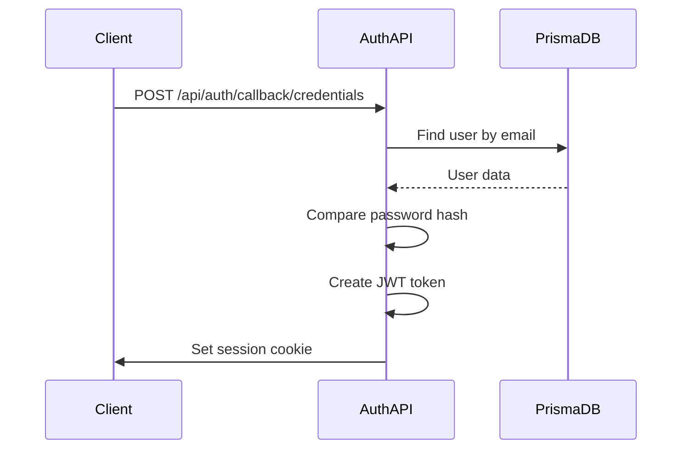
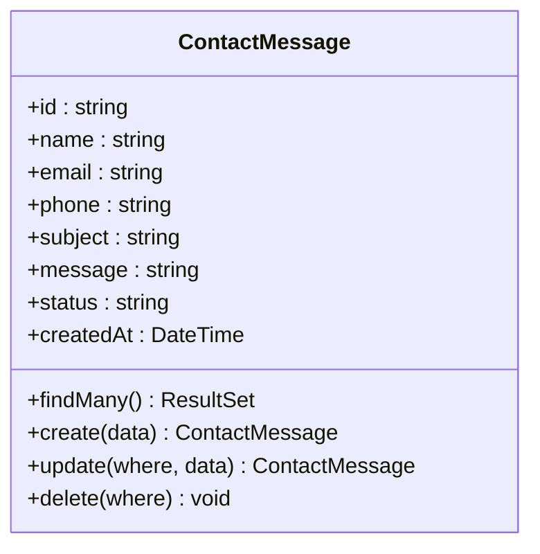
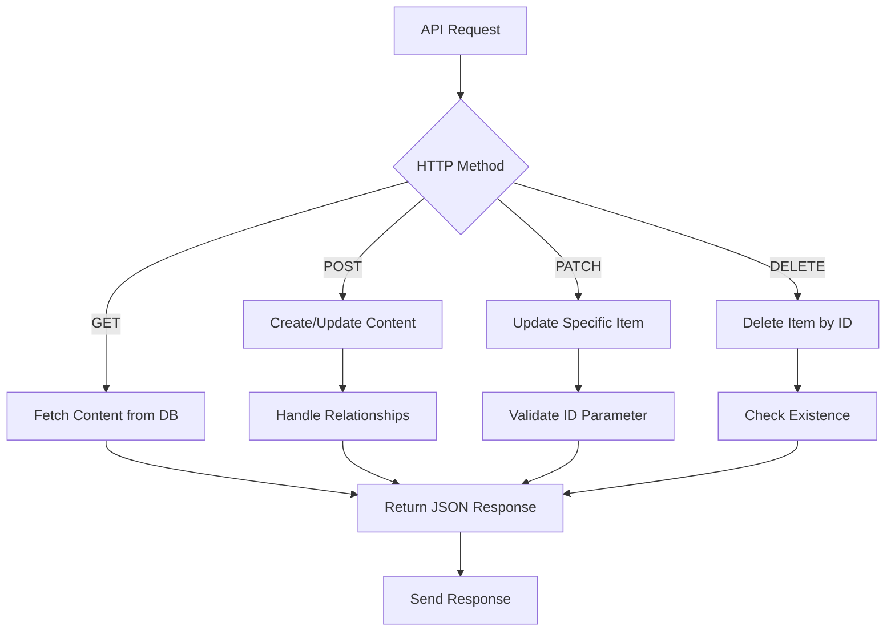
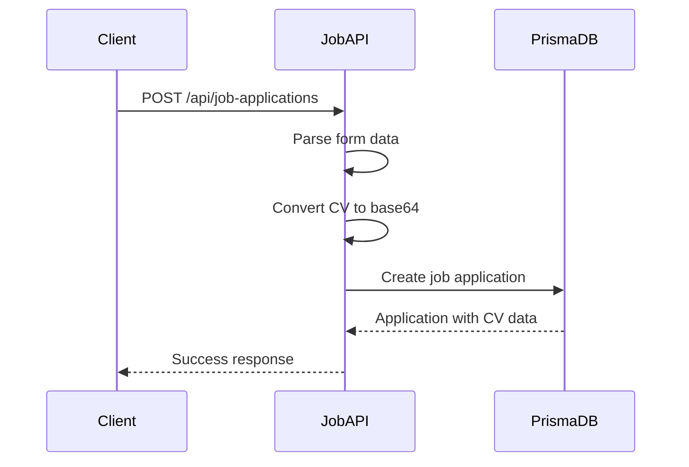
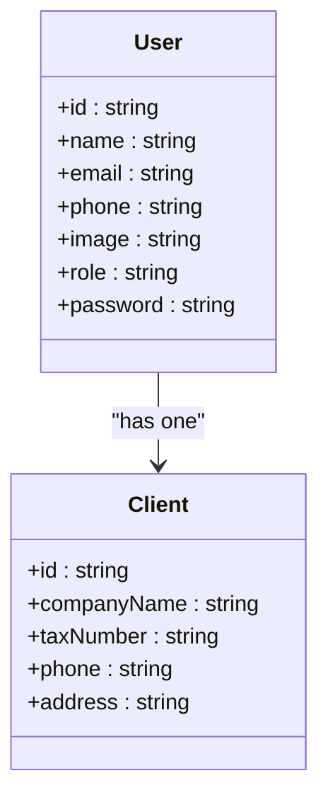
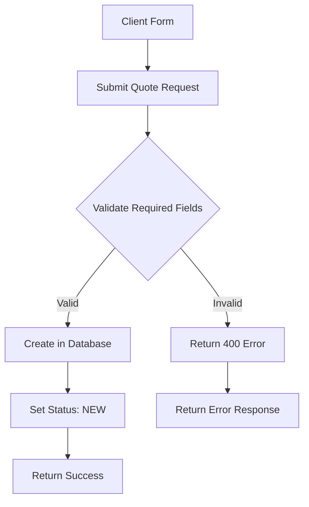
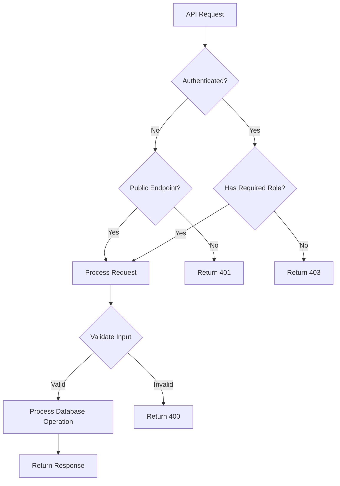

# API Endpoints

<cite>
**Referenced Files in This Document**   
- [auth\[...nextauth]\route.ts](file://src/app/api/auth/[...nextauth]/route.ts)
- [contact-messages\route.ts](file://src/app/api/contact-messages/route.ts)
- [content\about\route.ts](file://src/app/api/content/about/route.ts)
- [content\hero\route.ts](file://src/app/api/content/hero/route.ts)
- [content\institutions\route.ts](file://src/app/api/content/institutions/route.ts)
- [content\site-settings\route.ts](file://src/app/api/content/site-settings/route.ts)
- [job-applications\route.ts](file://src/app/api/job-applications/route.ts)
- [profile\route.ts](file://src/app/api/profile/route.ts)
- [quote-requests\route.ts](file://src/app/api/quote-requests/route.ts)
- [lib\auth.ts](file://src/lib/auth.ts)
- [lib\prisma.ts](file://src/lib/prisma.ts)
</cite>

## Table of Contents
1. [Introduction](#introduction)
2. [Authentication API](#authentication-api)
3. [Contact Messages API](#contact-messages-api)
4. [Content Management API](#content-management-api)
5. [Job Applications API](#job-applications-api)
6. [Profile API](#profile-api)
7. [Quote Requests API](#quote-requests-api)
8. [Security and Error Handling](#security-and-error-handling)
9. [Client Implementation Examples](#client-implementation-examples)
10. [Conclusion](#conclusion)

## Introduction
The smmm-system provides a comprehensive API for managing various aspects of a Serbest Muhasebeci Mali Müşavir (SMMM) business website. This documentation details all available API endpoints, organized by functional groups. Each API group supports standard CRUD operations and interacts with the database through Prisma ORM. The system uses Next.js App Router with API routes, and authentication is handled through NextAuth.js with a Prisma adapter.

The API endpoints are organized into several groups: authentication, contact messages, content management, job applications, user profile, and quote requests. All endpoints follow RESTful principles and return JSON responses. The backend is built on Prisma with a PostgreSQL database, and the frontend consumes these APIs through fetch calls in React components.

**Section sources**
- [lib\auth.ts](file://src/lib/auth.ts)
- [lib\prisma.ts](file://src/lib/prisma.ts)

## Authentication API

### Endpoint Overview
The authentication API handles user login and session management using NextAuth.js.

| HTTP Method | URL Pattern | Description | Authentication Required |
|-------------|-----------|-------------|------------------------|
| GET, POST | `/api/auth/[...nextauth]` | NextAuth.js authentication handler | No |

### Implementation Details
The authentication system uses NextAuth.js with credentials provider for email/password authentication. It integrates with Prisma through the PrismaAdapter to store user sessions and accounts. The authentication flow includes:
- JWT-based session strategy
- Password hashing with bcryptjs
- Role-based access control (ADMIN role)
- Custom session callbacks to include user role and ID

The API exposes GET and POST methods through the NextAuth handlers, which manage sign-in, sign-out, and session operations automatically.



**Diagram sources**
- [auth\[...nextauth]\route.ts](file://src/app/api/auth/[...nextauth]/route.ts)
- [lib\auth.ts](file://src/lib/auth.ts)

**Section sources**
- [auth\[...nextauth]\route.ts](file://src/app/api/auth/[...nextauth]/route.ts)
- [lib\auth.ts](file://src/lib/auth.ts)

## Contact Messages API

### Endpoint Overview
The contact messages API manages messages submitted through the website's contact form.

| HTTP Method | URL Pattern | Description | Authentication Required |
|-------------|-----------|-------------|------------------------|
| GET | `/api/contact-messages` | Retrieve all contact messages | Yes (ADMIN) |
| POST | `/api/contact-messages` | Create a new contact message | No |
| PATCH | `/api/contact-messages` | Update message status | Yes (ADMIN) |
| DELETE | `/api/contact-messages?id={id}` | Delete a message | Yes (ADMIN) |

### Request/Response Schemas
**POST Request Payload:**
```json
{
  "name": "string",
  "email": "string",
  "phone": "string",
  "subject": "string",
  "message": "string"
}
```

**GET Response (Array):**
```json
[
  {
    "id": "string",
    "name": "string",
    "email": "string",
    "phone": "string",
    "subject": "string",
    "message": "string",
    "status": "NEW|PENDING|REPLIED|RESOLVED",
    "createdAt": "string (ISO date)"
  }
]
```

### CRUD Operations
The Contact Messages API implements full CRUD operations:
- **Create**: POST request with contact form data, automatically sets status to "NEW"
- **Read**: GET request returns all messages sorted by creation date (newest first)
- **Update**: PATCH request updates only the status field of a message
- **Delete**: DELETE request removes a message by ID (passed as query parameter)

All operations interact with the Prisma `contactMessage` model, with proper error handling and validation.



**Diagram sources**
- [contact-messages\route.ts](file://src/app/api/contact-messages/route.ts)

**Section sources**
- [contact-messages\route.ts](file://src/app/api/contact-messages/route.ts)

## Content Management API

### Endpoint Overview
The content management API handles various content sections of the website.

| HTTP Method | URL Pattern | Description | Authentication Required |
|-------------|-----------|-------------|------------------------|
| GET, POST | `/api/content/about` | Manage about section content | Yes (ADMIN) |
| GET, POST, PATCH, DELETE | `/api/content/hero` | Manage hero section items | Yes (ADMIN) |
| GET, POST, PATCH, DELETE | `/api/content/institutions` | Manage client institution logos | Yes (ADMIN) |
| GET, POST | `/api/content/site-settings` | Manage site-wide settings | Yes (ADMIN) |

### About Section API
The about section API manages the "About Us" content with features.

**POST Request Payload:**
```json
{
  "title": "string",
  "subtitle": "string",
  "description": "string",
  "image": "string (URL)",
  "features": [
    {
      "icon": "string",
      "title": "string",
      "description": "string",
      "isActive": "boolean",
      "order": "number"
    }
  ]
}
```

**GET Response:**
```json
{
  "id": "string",
  "title": "string",
  "subtitle": "string",
  "description": "string",
  "image": "string",
  "features": [
    {
      "id": "string",
      "icon": "string",
      "title": "string",
      "description": "string",
      "isActive": "boolean",
      "order": "number"
    }
  ]
}
```

### Hero Section API
The hero section API manages carousel items for the homepage hero section.

**POST Request Payload:**
```json
{
  "title": "string",
  "subtitle": "string",
  "description": "string",
  "image": "string (URL)",
  "order": "number"
}
```

### Institutions API
The institutions API manages client logos displayed on the website.

**POST Request Payload:**
```json
{
  "name": "string",
  "logo": "string (URL)",
  "url": "string",
  "order": "number"
}
```

### CRUD Operations
The Content Management API implements CRUD operations for each content type:
- **Create**: POST request creates new content or updates existing content (upsert pattern)
- **Read**: GET request retrieves content, with fallback to default values if none exists
- **Update**: PATCH request updates specific items by ID
- **Delete**: DELETE request removes items by ID

The API uses Prisma transactions and relationships to maintain data integrity, particularly in the about section where features are managed as child entities.



**Diagram sources**
- [content\about\route.ts](file://src/app/api/content/about/route.ts)
- [content\hero\route.ts](file://src/app/api/content/hero/route.ts)
- [content\institutions\route.ts](file://src/app/api/content/institutions/route.ts)

**Section sources**
- [content\about\route.ts](file://src/app/api/content/about/route.ts)
- [content\hero\route.ts](file://src/app/api/content/hero/route.ts)
- [content\institutions\route.ts](file://src/app/api/content/institutions/route.ts)

## Job Applications API

### Endpoint Overview
The job applications API manages job applications submitted through the careers page.

| HTTP Method | URL Pattern | Description | Authentication Required |
|-------------|-----------|-------------|------------------------|
| GET | `/api/job-applications` | Retrieve all job applications | Yes (ADMIN) |
| POST | `/api/job-applications` | Submit a new job application | No |
| PATCH | `/api/job-applications` | Update application status | Yes (ADMIN) |
| DELETE | `/api/job-applications?id={id}` | Delete an application | Yes (ADMIN) |

### Request/Response Schemas
**POST Request (multipart/form-data):**
- firstName: string
- lastName: string
- email: string
- phone: string
- position: string
- experience: string
- education: string
- coverLetter: string
- cv: File

**GET Response (Array):**
```json
[
  {
    "id": "string",
    "name": "string",
    "email": "string",
    "phone": "string",
    "position": "string",
    "experience": "string",
    "education": "string",
    "coverLetter": "string",
    "cvFileName": "string",
    "cvFileData": "string (base64)",
    "cvMimeType": "string",
    "status": "NEW|REVIEWING|INTERVIEWED|REJECTED|ACCEPTED",
    "createdAt": "string (ISO date)"
  }
]
```

### CRUD Operations
The Job Applications API implements full CRUD operations with special handling for file uploads:
- **Create**: POST request with form data, converts CV file to base64 for storage
- **Read**: GET request returns all applications sorted by creation date
- **Update**: PATCH request updates only the status field
- **Delete**: DELETE request removes an application by ID

The API stores CV files as base64-encoded data in the database, allowing for easy retrieval and download without external storage dependencies.



**Diagram sources**
- [job-applications\route.ts](file://src/app/api/job-applications/route.ts)

**Section sources**
- [job-applications\route.ts](file://src/app/api/job-applications/route.ts)

## Profile API

### Endpoint Overview
The profile API manages administrator profile information.

| HTTP Method | URL Pattern | Description | Authentication Required |
|-------------|-----------|-------------|------------------------|
| GET | `/api/profile` | Retrieve admin profile | Yes (ADMIN) |
| PATCH | `/api/profile` | Update profile information | Yes (ADMIN) |

### Request/Response Schemas
**PATCH Request Payload:**
```json
{
  "name": "string",
  "email": "string",
  "phone": "string",
  "image": "string (URL)",
  "clientData": {
    "companyName": "string",
    "taxNumber": "string",
    "phone": "string",
    "address": "string"
  }
}
```

**GET Response:**
```json
{
  "id": "string",
  "name": "string",
  "email": "string",
  "phone": "string",
  "image": "string",
  "role": "ADMIN",
  "client": {
    "id": "string",
    "companyName": "string",
    "taxNumber": "string",
    "phone": "string",
    "address": "string"
  }
}
```

### CRUD Operations
The Profile API implements read and update operations:
- **Read**: GET request retrieves the first ADMIN user's profile and associated client data
- **Update**: PATCH request updates user information and optionally client information

The implementation currently uses the first ADMIN user as the profile target, with a TODO to implement proper session-based user identification.



**Diagram sources**
- [profile\route.ts](file://src/app/api/profile/route.ts)

**Section sources**
- [profile\route.ts](file://src/app/api/profile/route.ts)

## Quote Requests API

### Endpoint Overview
The quote requests API manages service quote requests from potential clients.

| HTTP Method | URL Pattern | Description | Authentication Required |
|-------------|-----------|-------------|------------------------|
| GET | `/api/quote-requests` | Retrieve all quote requests | Yes (ADMIN) |
| POST | `/api/quote-requests` | Submit a new quote request | No |
| PATCH | `/api/quote-requests` | Update request status | Yes (ADMIN) |
| DELETE | `/api/quote-requests?id={id}` | Delete a request | Yes (ADMIN) |

### Request/Response Schemas
**POST Request Payload:**
```json
{
  "name": "string",
  "email": "string",
  "phone": "string",
  "company": "string",
  "serviceType": "string",
  "message": "string"
}
```

**GET Response (Array):**
```json
[
  {
    "id": "string",
    "name": "string",
    "email": "string",
    "phone": "string",
    "company": "string",
    "serviceType": "string",
    "message": "string",
    "status": "NEW|PENDING|REPLIED|RESOLVED",
    "createdAt": "string (ISO date)"
  }
]
```

### CRUD Operations
The Quote Requests API implements full CRUD operations:
- **Create**: POST request with quote request form data, sets status to "NEW"
- **Read**: GET request returns all requests sorted by creation date
- **Update**: PATCH request updates only the status field
- **Delete**: DELETE request removes a request by ID

The API follows the same pattern as other request-based endpoints, with simple validation and error handling.



**Diagram sources**
- [quote-requests\route.ts](file://src/app/api/quote-requests/route.ts)

**Section sources**
- [quote-requests\route.ts](file://src/app/api/quote-requests/route.ts)

## Security and Error Handling

### Error Handling Patterns
The API implements consistent error handling across all endpoints:

| Status Code | Scenario | Response Structure |
|------------|---------|-------------------|
| 200 | Successful GET request | { data } |
| 201 | Successful POST request | { message, data } |
| 400 | Validation error | { error: "Validation message" } |
| 404 | Resource not found | { error: "Resource not found" } |
| 500 | Server error | { error: "Operation failed" } |

All endpoints wrap database operations in try-catch blocks and log errors to the console. Error messages are user-friendly and localized to Turkish, while maintaining English structure for consistency.

### Input Validation
The API uses basic validation for required fields:
- Contact messages: name, email, phone, subject, message
- Job applications: all form fields including CV file
- Quote requests: name, email, phone, company, serviceType
- Profile updates: field-specific validation

### Security Considerations
Key security aspects implemented in the API:

**Authentication Enforcement:**
- All administrative endpoints require ADMIN role
- NextAuth.js handles session management and JWT validation
- Credentials provider with bcrypt password hashing

**Input Sanitization:**
- No direct HTML/JS execution in stored content
- Base64 encoding for file uploads prevents direct script execution
- Prisma ORM provides protection against SQL injection

**Rate Limiting Considerations:**
- No explicit rate limiting implemented
- Recommendation: Implement rate limiting for public endpoints (contact messages, job applications, quote requests) to prevent abuse

**Role-Based Access Control:**
- ADMIN role required for all data modification and retrieval operations
- Public endpoints (POST methods) do not require authentication
- Session-based user identification for profile operations



**Diagram sources**
- [lib\auth.ts](file://src/lib/auth.ts)
- [contact-messages\route.ts](file://src/app/api/contact-messages/route.ts)
- [job-applications\route.ts](file://src/app/api/job-applications/route.ts)

**Section sources**
- [lib\auth.ts](file://src/lib/auth.ts)
- [contact-messages\route.ts](file://src/app/api/contact-messages/route.ts)
- [job-applications\route.ts](file://src/app/api/job-applications/route.ts)

## Client Implementation Examples

### Contact Message Form Submission
```javascript
// Example of submitting a contact message from the frontend
async function submitContactMessage(messageData) {
  try {
    const response = await fetch('/api/contact-messages', {
      method: 'POST',
      headers: {
        'Content-Type': 'application/json',
      },
      body: JSON.stringify(messageData),
    });

    if (response.ok) {
      const result = await response.json();
      console.log('Message sent:', result.message);
      return result;
    } else {
      const error = await response.json();
      console.error('Submission failed:', error.error);
      throw new Error(error.error);
    }
  } catch (error) {
    console.error('Network error:', error);
    throw error;
  }
}
```

### Quote Request Modal Implementation
```javascript
// Example from QuoteRequestModal component
const handleSubmit = async (e) => {
  e.preventDefault();
  setIsSubmitting(true);

  try {
    const formData = new FormData(form);
    const data = {
      name: `${formData.get('firstName')} ${formData.get('lastName')}`,
      email: formData.get('email'),
      phone: formData.get('phone'),
      company: formData.get('companyName') || 'Belirtilmemiş',
      serviceType: packageType,
      message: formData.get('message'),
    };

    const response = await fetch('/api/quote-requests', {
      method: 'POST',
      headers: {
        'Content-Type': 'application/json',
      },
      body: JSON.stringify(data),
    });

    if (response.ok) {
      toast.success('Teklif isteğiniz başarıyla gönderildi!');
      onOpenChange(false);
      form.reset();
    } else {
      const error = await response.json();
      toast.error(error.error || 'Teklif isteği gönderilemedi');
    }
  } catch (error) {
    toast.error('Bir hata oluştu. Lütfen tekrar deneyin.');
  } finally {
    setIsSubmitting(false);
  }
};
```

### Admin Dashboard Data Fetching
```javascript
// Example of fetching contact messages in admin dashboard
async function fetchContactMessages() {
  try {
    const response = await fetch('/api/contact-messages');
    
    if (response.ok) {
      const messages = await response.json();
      return messages;
    } else {
      throw new Error('Failed to fetch messages');
    }
  } catch (error) {
    console.error('Error fetching messages:', error);
    return [];
  }
}

// Example of updating message status
async function updateMessageStatus(messageId, newStatus) {
  try {
    const response = await fetch('/api/contact-messages', {
      method: 'PATCH',
      headers: {
        'Content-Type': 'application/json',
      },
      body: JSON.stringify({ id: messageId, status: newStatus }),
    });

    if (response.ok) {
      const updatedMessage = await response.json();
      return updatedMessage;
    } else {
      throw new Error('Failed to update status');
    }
  } catch (error) {
    console.error('Error updating status:', error);
    throw error;
  }
}
```

### Job Application CV Download
```javascript
// Example of downloading CV from job application
function downloadCV(application) {
  if (application.cvFileData && application.cvMimeType) {
    const byteCharacters = atob(application.cvFileData);
    const byteNumbers = new Array(byteCharacters.length);
    for (let i = 0; i < byteCharacters.length; i++) {
      byteNumbers[i] = byteCharacters.charCodeAt(i);
    }
    const byteArray = new Uint8Array(byteNumbers);
    const blob = new Blob([byteArray], { type: application.cvMimeType });
    const url = window.URL.createObjectURL(blob);
    const link = document.createElement('a');
    link.href = url;
    link.download = application.cvFileName || 'cv.pdf';
    
    document.body.appendChild(link);
    link.click();
    document.body.removeChild(link);
    window.URL.revokeObjectURL(url);
  }
}
```

**Section sources**
- [components\modals\quote-request-modal.tsx](file://src/components/modals/quote-request-modal.tsx)
- [components\admin\contact-message-modal.tsx](file://src/components/admin/contact-message-modal.tsx)
- [components\admin\job-application-modal.tsx](file://src/components/admin/job-application-modal.tsx)

## Conclusion
The smmm-system API provides a comprehensive set of endpoints for managing a professional accounting service website. The API follows RESTful principles with consistent patterns across all endpoints. Key features include:

- **Complete CRUD operations** for all data types
- **Authentication and role-based access control** through NextAuth.js
- **Prisma ORM integration** for database operations
- **Consistent error handling** with appropriate status codes
- **File upload support** for job applications
- **Client-side implementations** demonstrated in React components

Areas for potential improvement:
- Implement Zod for comprehensive request validation
- Add rate limiting to public endpoints
- Implement proper session-based user identification in profile API
- Add API versioning for future compatibility
- Implement more granular error codes and messages

The API is well-structured and follows modern Next.js practices, making it maintainable and extensible for future requirements.