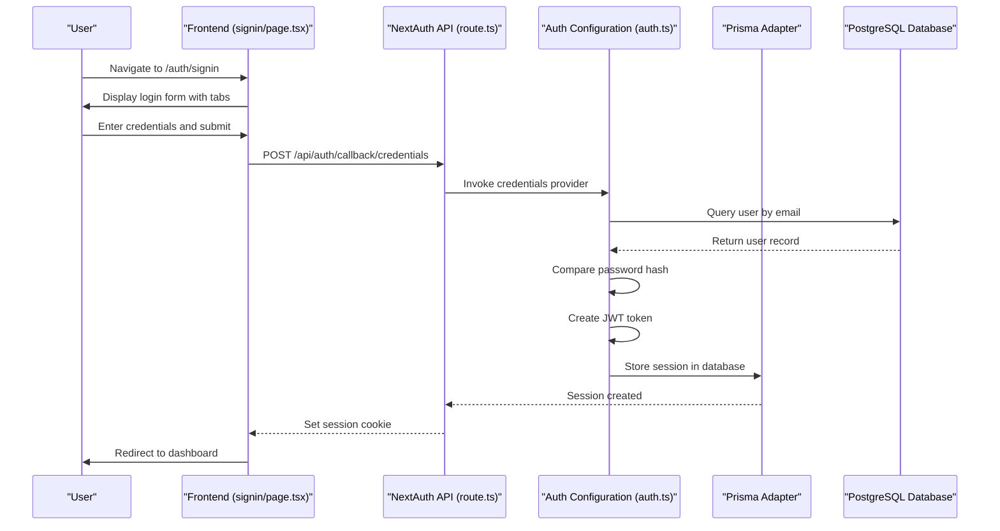
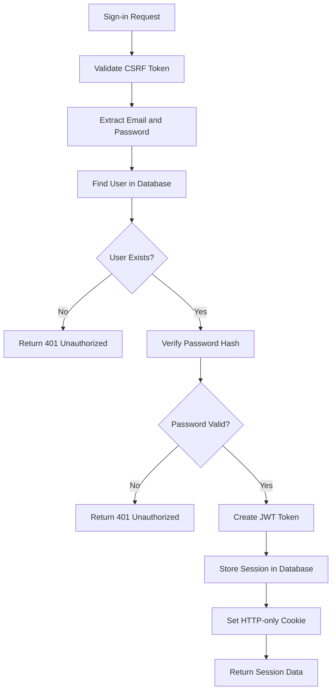
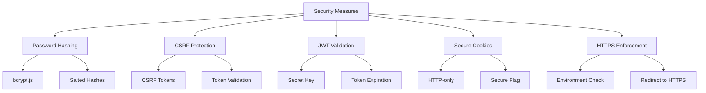
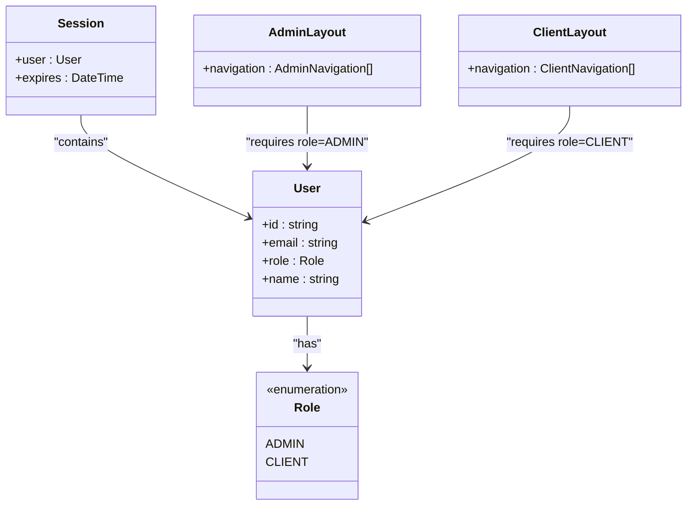
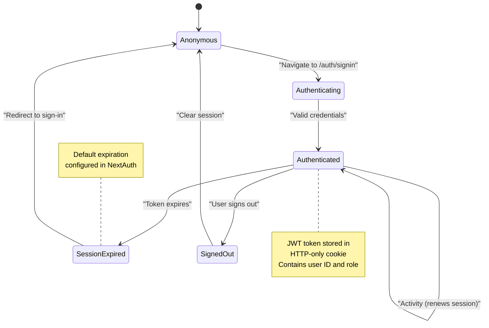
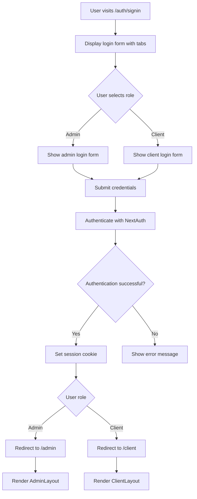
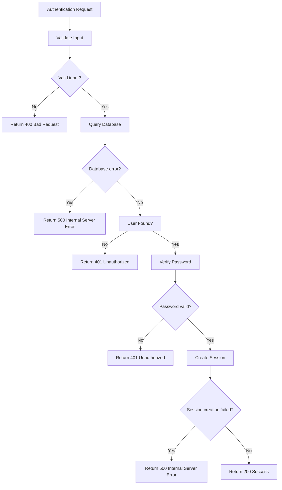

# Authentication API

<cite>
**Referenced Files in This Document**   
- [route.ts](file://src/app/api/auth/[...nextauth]/route.ts)
- [auth.ts](file://src/lib/auth.ts)
- [signin/page.tsx](file://src/app/auth/signin/page.tsx)
- [admin/layout.tsx](file://src/app/admin/layout.tsx)
- [client/layout.tsx](file://src/app/client/layout.tsx)
- [prisma/migrations/20251101125707_init/migration.sql](file://prisma/migrations/20251101125707_init/migration.sql)
- [package.json](file://package.json)
</cite>

## Table of Contents
1. [Introduction](#introduction)
2. [Authentication Flow](#authentication-flow)
3. [API Endpoints](#api-endpoints)
4. [Request/Response Schemas](#requestresponse-schemas)
5. [Security Considerations](#security-considerations)
6. [Role-Based Access Control](#role-based-access-control)
7. [Session Management](#session-management)
8. [Frontend Integration](#frontend-integration)
9. [Error Handling](#error-handling)
10. [Implementation Examples](#implementation-examples)

## Introduction

The Authentication API in the smmm-system implements a secure authentication system using NextAuth v5 with Prisma adapter for database persistence. The system supports credential-based authentication with role-based access control for different user types (ADMIN and CLIENT). This documentation provides comprehensive details about the authentication endpoints, their integration with the Prisma adapter, and the overall authentication flow.

The authentication system is built on NextAuth v5 beta, leveraging its modular architecture and security features. It uses JWT (JSON Web Token) as the session strategy, with credentials stored securely in the database using bcrypt hashing. The Prisma adapter seamlessly integrates NextAuth with the PostgreSQL database, handling user, account, session, and verification token storage.

**Section sources**
- [auth.ts](file://src/lib/auth.ts#L1-L86)
- [package.json](file://package.json#L1-L64)

## Authentication Flow

The authentication flow in smmm-system follows a standard credential-based authentication pattern with JWT session management. When a user attempts to sign in, the system validates their credentials against the database and creates a secure session upon successful authentication.

The flow begins at the `/auth/signin` route, where users can choose between admin and client login options. Upon form submission, the credentials are sent to the NextAuth API endpoints at `/api/auth/[...nextauth]`, which handles the authentication process through the configured providers and callbacks.



**Diagram sources**
- [route.ts](file://src/app/api/auth/[...nextauth]/route.ts#L1-L3)
- [auth.ts](file://src/lib/auth.ts#L1-L86)
- [signin/page.tsx](file://src/app/auth/signin/page.tsx#L1-L194)

**Section sources**
- [auth.ts](file://src/lib/auth.ts#L1-L86)
- [signin/page.tsx](file://src/app/auth/signin/page.tsx#L1-L194)

## API Endpoints

The authentication system exposes standard NextAuth API endpoints through the route handler pattern in Next.js. These endpoints are automatically generated by NextAuth based on the configuration in the auth.ts file.

The main authentication endpoint is located at `/api/auth/[...nextauth]/route.ts`, which exports the GET and POST handlers from the NextAuth configuration. This single file handles all authentication-related requests, including sign-in, sign-out, session management, and callback processing.

The following endpoints are available:

- `GET /api/auth/session` - Retrieve the current session information
- `POST /api/auth/callback/credentials` - Handle credential-based sign-in
- `GET /api/auth/signin` - Display the sign-in page
- `GET /api/auth/signout` - Handle user sign-out
- `GET /api/auth/csrf` - Retrieve CSRF token for form submissions

These endpoints are automatically registered by NextAuth based on the configuration in the auth.ts file. The system uses the Credentials provider for authentication, which handles email and password validation.

**Section sources**
- [route.ts](file://src/app/api/auth/[...nextauth]/route.ts#L1-L3)
- [auth.ts](file://src/lib/auth.ts#L1-L86)

## Request/Response Schemas

The authentication API follows standard NextAuth request and response patterns for credential-based authentication. The request and response schemas are defined by the NextAuth framework and the custom configuration in the smmm-system.

For sign-in requests, the API expects a POST request to `/api/auth/callback/credentials` with form data containing email and password fields. The request must include proper CSRF protection tokens to prevent cross-site request forgery attacks.

The successful authentication response returns a session object containing user information, including the user ID, email, name, and role. The session is stored as a JWT token in an HTTP-only cookie for security.



**Diagram sources**
- [auth.ts](file://src/lib/auth.ts#L1-L86)
- [prisma/migrations/20251101125707_init/migration.sql#L1-L44)

**Section sources**
- [auth.ts](file://src/lib/auth.ts#L1-L86)

## Security Considerations

The authentication system implements multiple security measures to protect user data and prevent common web vulnerabilities. These include password hashing, CSRF protection, JWT validation, and secure session management.

Passwords are stored in the database using bcrypt hashing with a salt, ensuring that even if the database is compromised, user passwords remain protected. The bcrypt library is configured with appropriate work factors to balance security and performance.

CSRF (Cross-Site Request Forgery) protection is implemented through NextAuth's built-in CSRF token system. Each sign-in request must include a valid CSRF token, which is validated on the server side before processing the authentication request.

JWT tokens are used for session management, with the token containing essential user information such as ID and role. The JWT secret is stored in environment variables and is used to sign and verify tokens. The session strategy is configured to use JWT, which means session data is stored in the token itself rather than server-side storage.



**Diagram sources**
- [auth.ts](file://src/lib/auth.ts#L1-L86)
- [package.json](file://package.json#L1-L64)

**Section sources**
- [auth.ts](file://src/lib/auth.ts#L1-L86)

## Role-Based Access Control

The smmm-system implements role-based access control (RBAC) to restrict access to different parts of the application based on user roles. The system defines two primary roles: ADMIN and CLIENT, each with different permissions and access levels.

Role information is stored in the User table in the database as an ENUM field with values 'ADMIN' and 'CLIENT'. This role is included in the user object during the authentication process and is added to both the JWT token and the session object through NextAuth callbacks.

The role-based access is enforced at multiple levels:
1. Authentication level: Different login forms for admin and client users
2. Route level: Different dashboard layouts and navigation options
3. Data access level: Different data visibility and modification permissions



**Diagram sources**
- [auth.ts](file://src/lib/auth.ts#L1-L86)
- [prisma/migrations/20251101125707_init/migration.sql#L1-L44)
- [admin/layout.tsx](file://src/app/admin/layout.tsx#L1-L144)
- [client/layout.tsx](file://src/app/client/layout.tsx#L1-L133)

**Section sources**
- [auth.ts](file://src/lib/auth.ts#L1-L86)
- [prisma/migrations/20251101125707_init/migration.sql#L1-L44)

## Session Management

The session management system in smmm-system uses JWT (JSON Web Token) as the session strategy, with sessions persisted in the database through the Prisma adapter. This approach provides a secure and scalable solution for maintaining user sessions across application restarts.

When a user successfully authenticates, NextAuth creates a JWT token containing the user's ID and role. This token is signed with a secret key and stored in an HTTP-only cookie. The session information is also stored in the database in the Session table, which includes the session token, user ID, and expiration time.

The session lifecycle includes:
1. Creation: When a user signs in successfully
2. Validation: On each request to protected routes
3. Renewal: When the session is refreshed
4. Termination: When a user signs out or the session expires



**Diagram sources**
- [auth.ts](file://src/lib/auth.ts#L1-L86)
- [prisma/migrations/20251101125707_init/migration.sql#L1-L44)

**Section sources**
- [auth.ts](file://src/lib/auth.ts#L1-L86)

## Frontend Integration

The frontend integration of the authentication system is implemented through the sign-in page and layout components that handle user interface and navigation based on authentication state. The system provides a seamless user experience with role-specific login options and dashboard layouts.

The sign-in page at `/auth/signin` features a tabbed interface that allows users to choose between admin and client login. Each tab displays a login form with email and password fields, and the background image changes randomly on each visit for visual appeal.

After successful authentication, users are redirected to their respective dashboards based on their role. Admin users are redirected to `/admin` while client users are redirected to `/client`. The layout components for these routes include role-specific navigation and functionality.



**Diagram sources**
- [signin/page.tsx](file://src/app/auth/signin/page.tsx#L1-L194)
- [admin/layout.tsx](file://src/app/admin/layout.tsx#L1-L144)
- [client/layout.tsx](file://src/app/client/layout.tsx#L1-L133)

**Section sources**
- [signin/page.tsx](file://src/app/auth/signin/page.tsx#L1-L194)

## Error Handling

The authentication system implements comprehensive error handling for various failure scenarios, including invalid credentials, network issues, and server errors. Error messages are designed to be user-friendly while not revealing sensitive information about the system.

When authentication fails, the system returns appropriate HTTP status codes and error messages. For invalid credentials, a 401 Unauthorized status is returned with a generic error message to prevent enumeration attacks. For server-side errors, a 500 Internal Server Error status is returned with a generic message.

The error handling process includes:
1. Validation of input parameters
2. Database query error handling
3. Password comparison errors
4. Session creation failures
5. Network and connectivity issues



**Diagram sources**
- [auth.ts](file://src/lib/auth.ts#L1-L86)

**Section sources**
- [auth.ts](file://src/lib/auth.ts#L1-L86)

## Implementation Examples

The following examples demonstrate how frontend components interact with the authentication API for login, logout, and session validation. These examples show the practical implementation of the authentication system in the smmm-system.

For login functionality, the sign-in page uses React state to manage form submission and loading states. Upon form submission, it calls the NextAuth signIn function with the credentials provider, passing the email and password. The system then handles the authentication flow and redirects the user to the appropriate dashboard.

For logout functionality, both admin and client layouts include a logout button that triggers the signOut function from NextAuth. This function clears the session cookie and redirects the user to the sign-in page.

```mermaid
classDiagram
class SignInPage {
+isLoading : boolean
+showPassword : boolean
+backgroundImage : string
+activeTab : UserType
+handleSubmit(e : FormEvent, userType : UserType)
+renderLoginForm(userType : UserType)
}
class AuthLib {
+handlers : {GET, POST}
+auth : Function
+signIn : Function
+signOut : Function
}
class Layout {
+handleLogout()
}
SignInPage --> AuthLib : "uses signIn"
Layout --> AuthLib : "uses signOut"
AuthLib --> PrismaAdapter : "uses"
PrismaAdapter --> Database : "persists"
note right of SignInPage
Handles form submission
Manages UI state
Redirects on success
end note
note left of AuthLib
NextAuth main functions
Central authentication logic
Session management
end note
```

**Diagram sources**
- [signin/page.tsx](file://src/app/auth/signin/page.tsx#L1-L194)
- [auth.ts](file://src/lib/auth.ts#L1-L86)
- [admin/layout.tsx](file://src/app/admin/layout.tsx#L1-L144)
- [client/layout.tsx](file://src/app/client/layout.tsx#L1-L133)

**Section sources**
- [signin/page.tsx](file://src/app/auth/signin/page.tsx#L1-L194)
- [auth.ts](file://src/lib/auth.ts#L1-L86)