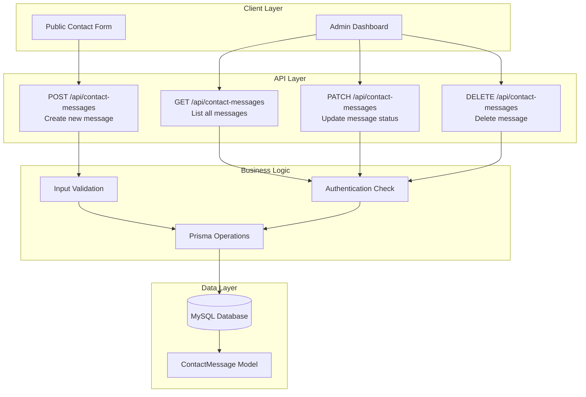
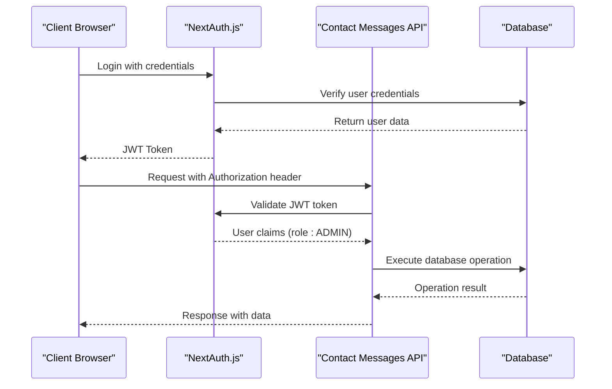
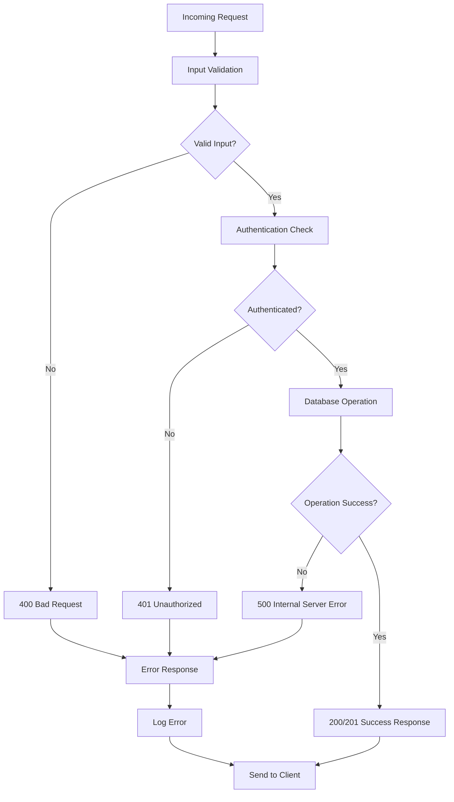
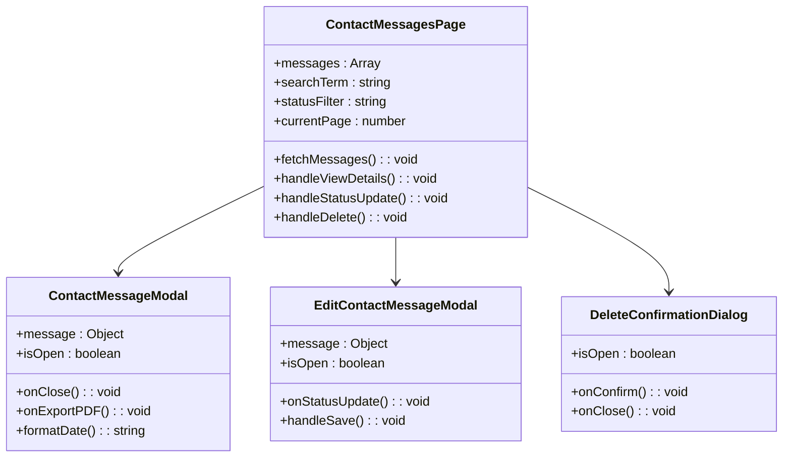

# Contact Messages API

<cite>
**Referenced Files in This Document**
- [src/app/api/contact-messages/route.ts](file://src/app/api/contact-messages/route.ts)
- [src/app/admin/contact-messages/page.tsx](file://src/app/admin/contact-messages/page.tsx)
- [src/components/admin/contact-message-modal.tsx](file://src/components/admin/contact-message-modal.tsx)
- [src/components/admin/edit-contact-message-modal.tsx](file://src/components/admin/edit-contact-message-modal.tsx)
- [src/components/landing/contact-section.tsx](file://src/components/landing/contact-section.tsx)
- [src/lib/pdf-export.ts](file://src/lib/pdf-export.ts)
- [src/lib/prisma.ts](file://src/lib/prisma.ts)
- [src/lib/db.ts](file://src/lib/db.ts)
- [src/lib/auth.ts](file://src/lib/auth.ts)
- [prisma/schema.prisma](file://prisma/schema.prisma)
- [src/app/admin/layout.tsx](file://src/app/admin/layout.tsx)
</cite>

## Table of Contents
1. [Introduction](#introduction)
2. [API Overview](#api-overview)
3. [Authentication and Authorization](#authentication-and-authorization)
4. [Endpoint Specifications](#endpoint-specifications)
5. [Data Models and Validation](#data-models-and-validation)
6. [Error Handling](#error-handling)
7. [Admin Dashboard Integration](#admin-dashboard-integration)
8. [Security Considerations](#security-considerations)
9. [Client Implementation Examples](#client-implementation-examples)
10. [Testing and Development](#testing-and-development)

## Introduction

The Contact Messages API provides comprehensive CRUD operations for managing contact form submissions in the SMMM System. This API handles incoming messages from the public contact form and enables administrative management of these messages through a dedicated admin dashboard. The system integrates with Prisma ORM for database operations and implements role-based access control for secure administration.

The API serves two primary use cases:
- **Public Endpoint**: Accepts contact form submissions from website visitors
- **Admin Endpoint**: Provides administrative capabilities for viewing, updating, and managing contact messages

## API Overview

The Contact Messages API consists of four main HTTP endpoints that support full CRUD operations:



**Diagram sources**
- [src/app/api/contact-messages/route.ts](file://src/app/api/contact-messages/route.ts#L1-L97)
- [src/app/admin/contact-messages/page.tsx](file://src/app/admin/contact-messages/page.tsx#L1-L466)

## Authentication and Authorization

The Contact Messages API implements role-based access control through NextAuth.js integration. Administrative operations require authentication with ADMIN role privileges.

### Authentication Flow



**Diagram sources**
- [src/lib/auth.ts](file://src/lib/auth.ts#L1-L87)
- [src/app/admin/layout.tsx](file://src/app/admin/layout.tsx#L1-L144)

### Role-Based Access Control

| Endpoint | Required Role | Description |
|----------|---------------|-------------|
| GET `/api/contact-messages` | ADMIN | Retrieve all contact messages |
| POST `/api/contact-messages` | PUBLIC | Submit new contact form |
| PATCH `/api/contact-messages` | ADMIN | Update message status |
| DELETE `/api/contact-messages` | ADMIN | Delete contact message |

**Section sources**
- [src/lib/auth.ts](file://src/lib/auth.ts#L1-L87)
- [src/app/admin/layout.tsx](file://src/app/admin/layout.tsx#L1-L144)

## Endpoint Specifications

### GET /api/contact-messages

Retrieves all contact messages ordered by creation date in descending order.

#### Request
```
GET /api/contact-messages
Authorization: Bearer <jwt-token>
```

#### Response
```json
[
  {
    "id": "cm_123456789",
    "name": "John Doe",
    "email": "john@example.com",
    "phone": "+905551234567",
    "subject": "Tax Consultation",
    "message": "I would like to schedule a consultation...",
    "status": "NEW",
    "createdAt": "2024-01-15T09:30:00Z",
    "updatedAt": "2024-01-15T09:30:00Z"
  }
]
```

#### Status Codes
- `200 OK`: Successful retrieval
- `500 Internal Server Error`: Database error

### POST /api/contact-messages

Creates a new contact message from public form submissions.

#### Request
```
POST /api/contact-messages
Content-Type: application/json

{
  "name": "Jane Smith",
  "email": "jane@example.com",
  "phone": "+905559876543",
  "subject": "Financial Services Inquiry",
  "message": "We are interested in your financial advisory services..."
}
```

#### Response
```json
{
  "message": "Mesajınız başarıyla gönderildi",
  "contactMessage": {
    "id": "cm_987654321",
    "name": "Jane Smith",
    "email": "jane@example.com",
    "phone": "+905559876543",
    "subject": "Financial Services Inquiry",
    "message": "We are interested in your financial advisory services...",
    "status": "NEW",
    "createdAt": "2024-01-15T10:15:00Z",
    "updatedAt": "2024-01-15T10:15:00Z"
  }
}
```

#### Status Codes
- `201 Created`: Message successfully created
- `400 Bad Request`: Missing required fields
- `500 Internal Server Error`: Database error

### PATCH /api/contact-messages

Updates the status of an existing contact message.

#### Request
```
PATCH /api/contact-messages
Content-Type: application/json

{
  "id": "cm_123456789",
  "status": "REPLIED"
}
```

#### Response
```json
{
  "id": "cm_123456789",
  "name": "John Doe",
  "email": "john@example.com",
  "phone": "+905551234567",
  "subject": "Tax Consultation",
  "message": "I would like to schedule a consultation...",
  "status": "REPLIED",
  "createdAt": "2024-01-15T09:30:00Z",
  "updatedAt": "2024-01-15T11:00:00Z"
}
```

#### Status Codes
- `200 OK`: Status successfully updated
- `400 Bad Request`: Missing required fields
- `500 Internal Server Error`: Database error

### DELETE /api/contact-messages

Deletes a contact message by ID.

#### Request
```
DELETE /api/contact-messages?id=cm_123456789
```

#### Response
```json
{
  "message": "Mesaj başarıyla silindi"
}
```

#### Status Codes
- `200 OK`: Message successfully deleted
- `400 Bad Request`: Missing ID parameter
- `500 Internal Server Error`: Database error

**Section sources**
- [src/app/api/contact-messages/route.ts](file://src/app/api/contact-messages/route.ts#L1-L97)

## Data Models and Validation

### ContactMessage Schema

The ContactMessage model defines the structure for storing contact form submissions:

| Field | Type | Required | Description | Default Value |
|-------|------|----------|-------------|---------------|
| id | String | Yes | Unique identifier | Auto-generated |
| name | String | Yes | Full name of sender | - |
| email | String | Yes | Email address | - |
| phone | String | No | Phone number | - |
| subject | String | Yes | Message subject | - |
| message | String | Yes | Message content | - |
| status | Enum | Yes | Message status | NEW |
| createdAt | DateTime | Yes | Creation timestamp | Current time |
| updatedAt | DateTime | Yes | Last update timestamp | Current time |

### Status Values

Contact messages support the following status values:

| Status | Description | Color | UI Label |
|--------|-------------|-------|----------|
| NEW | New message received | Blue | Yeni |
| PENDING | Under review | Yellow | Beklemede |
| REPLIED | Response sent | Green | Yanıtlandı |
| RESOLVED | Issue resolved | Gray | Çözüldü |

### Validation Rules

The API implements server-side validation for all endpoints:

#### POST Validation Rules
- All fields (`name`, `email`, `phone`, `subject`, `message`) are required
- Email format validation (basic email structure)
- Minimum length requirements for text fields
- Proper JSON payload structure

#### PATCH Validation Rules
- `id` field is required for identification
- `status` field must be one of the predefined enum values
- Both fields must be present in the request body

**Section sources**
- [prisma/schema.prisma](file://prisma/schema.prisma#L400-L410)
- [src/app/api/contact-messages/route.ts](file://src/app/api/contact-messages/route.ts#L15-L35)

## Error Handling

The API implements comprehensive error handling with appropriate HTTP status codes and descriptive error messages.

### Error Response Format

```json
{
  "error": "Descriptive error message in Turkish"
}
```

### Common Error Scenarios

#### Validation Errors
```json
{
  "error": "Tüm alanları doldurun"
}
```

#### Database Errors
```json
{
  "error": "Mesaj gönderilirken hata oluştu"
}
```

#### Resource Not Found
```json
{
  "error": "ID gereklidir"
}
```

#### Server Errors
```json
{
  "error": "Failed to fetch messages"
}
```

### Error Handling Flow



**Diagram sources**
- [src/app/api/contact-messages/route.ts](file://src/app/api/contact-messages/route.ts#L1-L97)

**Section sources**
- [src/app/api/contact-messages/route.ts](file://src/app/api/contact-messages/route.ts#L1-L97)

## Admin Dashboard Integration

The admin dashboard provides comprehensive management capabilities for contact messages through React components that integrate seamlessly with the API.

### Dashboard Features

#### Message Listing and Filtering
- **Search Functionality**: Filter by name, email, or subject
- **Status Filtering**: Filter by message status (New, Pending, Replied, Resolved)
- **Pagination**: Navigate through large message lists
- **Sorting**: Order by creation date or other criteria

#### Message Management Operations
- **View Details**: Comprehensive message information with status badges
- **Status Updates**: Change message status through dropdown selection
- **Message Deletion**: Remove unwanted messages with confirmation dialogs
- **PDF Export**: Generate professional PDF reports of messages

### Component Architecture



**Diagram sources**
- [src/app/admin/contact-messages/page.tsx](file://src/app/admin/contact-messages/page.tsx#L1-L466)
- [src/components/admin/contact-message-modal.tsx](file://src/components/admin/contact-message-modal.tsx#L1-L169)
- [src/components/admin/edit-contact-message-modal.tsx](file://src/components/admin/edit-contact-message-modal.tsx#L1-L155)

### PDF Export Functionality

The system provides professional PDF export capabilities for contact messages:

#### Export Features
- **Professional Formatting**: Clean, readable PDF layout
- **Complete Information**: All message details included
- **Timestamps**: Precise creation and modification dates
- **Status Indicators**: Clear status representation
- **Automatic Naming**: Generated filenames with message IDs

**Section sources**
- [src/app/admin/contact-messages/page.tsx](file://src/app/admin/contact-messages/page.tsx#L1-L466)
- [src/components/admin/contact-message-modal.tsx](file://src/components/admin/contact-message-modal.tsx#L1-L169)
- [src/components/admin/edit-contact-message-modal.tsx](file://src/components/admin/edit-contact-message-modal.tsx#L1-L155)
- [src/lib/pdf-export.ts](file://src/lib/pdf-export.ts#L1-L241)

## Security Considerations

### Input Sanitization and Validation

The API implements multiple layers of security measures:

#### Server-Side Validation
- **Required Field Validation**: Ensures all mandatory fields are present
- **Data Type Validation**: Validates field types and formats
- **Length Constraints**: Prevents excessively long inputs
- **SQL Injection Prevention**: Uses Prisma ORM for parameterized queries

#### Cross-Site Scripting (XSS) Protection
- **Output Encoding**: Automatic encoding of HTML content
- **Content Security Policy**: Implemented through Next.js configuration
- **Safe Rendering**: React components automatically sanitize JSX

### Authentication Security

#### JWT Token Management
- **Secure Storage**: Tokens stored in HTTP-only cookies
- **Expiration Handling**: Automatic token expiration and renewal
- **Scope Limitation**: Role-based access control implementation

#### Rate Limiting Considerations
- **API Throttling**: Implemented at the framework level
- **Brute Force Protection**: Built-in rate limiting mechanisms
- **Monitoring**: Request logging and monitoring capabilities

### Data Privacy

#### GDPR Compliance
- **Data Retention**: Configurable retention policies
- **Right to Erasure**: Complete message deletion capability
- **Data Portability**: PDF export functionality for data portability

#### Access Control
- **Role-Based Permissions**: ADMIN role required for sensitive operations
- **Audit Logging**: Comprehensive logging of administrative actions
- **Session Management**: Secure session handling and cleanup

**Section sources**
- [src/app/api/contact-messages/route.ts](file://src/app/api/contact-messages/route.ts#L15-L35)
- [src/lib/auth.ts](file://src/lib/auth.ts#L1-L87)

## Client Implementation Examples

### Frontend Integration

#### Public Contact Form Submission

```typescript
// Example implementation for public contact form
const handleSubmit = async (formData: FormData) => {
  const data = {
    name: formData.get('name') as string,
    email: formData.get('email') as string,
    phone: formData.get('phone') as string,
    subject: formData.get('subject') as string || 'Genel İletişim',
    message: formData.get('message') as string,
  };

  try {
    const response = await fetch('/api/contact-messages', {
      method: 'POST',
      headers: { 'Content-Type': 'application/json' },
      body: JSON.stringify(data),
    });

    if (response.ok) {
      // Handle successful submission
      toast.success('Mesajınız başarıyla gönderildi!');
      form.reset();
    } else {
      // Handle error
      const error = await response.json();
      toast.error(error.error || 'Mesaj gönderilemedi');
    }
  } catch (error) {
    // Handle network error
    toast.error('Bir hata oluştu, lütfen tekrar deneyin');
  }
};
```

#### Admin Dashboard API Calls

```typescript
// Fetch messages from API
const fetchMessages = async () => {
  setIsLoading(true);
  try {
    const response = await fetch('/api/contact-messages');
    if (response.ok) {
      const data = await response.json();
      setMessages(data);
    } else {
      toast.error('Mesajlar yüklenirken bir hata oluştu');
    }
  } catch (error) {
    console.error('Error fetching contact messages:', error);
    toast.error('Mesajlar yüklenirken bir hata oluştu');
  } finally {
    setIsLoading(false);
  }
};

// Update message status
const handleStatusUpdate = async (messageId: string, newStatus: string) => {
  try {
    const response = await fetch('/api/contact-messages', {
      method: 'PATCH',
      headers: { 'Content-Type': 'application/json' },
      body: JSON.stringify({ id: messageId, status: newStatus }),
    });

    if (response.ok) {
      // Update local state
      setMessages(prev => 
        prev.map(msg => 
          msg.id === messageId 
            ? { ...msg, status: newStatus } 
            : msg
        )
      );
      setIsEditModalOpen(false);
      toast.success('Mesaj durumu başarıyla güncellendi!');
    } else {
      toast.error('Durum güncellenirken bir hata oluştu');
    }
  } catch (error) {
    console.error('Error updating status:', error);
    toast.error('Durum güncellenirken bir hata oluştu');
  }
};
```

### Mobile Application Integration

#### iOS Swift Example
```swift
func submitContactMessage(name: String, email: String, phone: String, subject: String, message: String) {
    let url = URL(string: "https://yourdomain.com/api/contact-messages")!
    var request = URLRequest(url: url)
    request.httpMethod = "POST"
    request.setValue("application/json", forHTTPHeaderField: "Content-Type")
    
    let body: [String: Any] = [
        "name": name,
        "email": email,
        "phone": phone,
        "subject": subject,
        "message": message
    ]
    
    request.httpBody = try? JSONSerialization.data(withJSONObject: body)
    
    URLSession.shared.dataTask(with: request) { data, response, error in
        // Handle response
    }.resume()
}
```

#### Android Kotlin Example
```kotlin
fun submitContactMessage(name: String, email: String, phone: String, subject: String, message: String) {
    val url = URL("https://yourdomain.com/api/contact-messages")
    val connection = url.openConnection() as HttpURLConnection
    connection.requestMethod = "POST"
    connection.setRequestProperty("Content-Type", "application/json")
    
    val requestBody = JSONObject().apply {
        put("name", name)
        put("email", email)
        put("phone", phone)
        put("subject", subject)
        put("message", message)
    }
    
    connection.doOutput = true
    connection.outputStream.use { outputStream ->
        outputStream.write(requestBody.toString().toByteArray(Charsets.UTF_8))
    }
    
    // Handle response
}
```

**Section sources**
- [src/components/landing/contact-section.tsx](file://src/components/landing/contact-section.tsx#L42-L82)
- [src/app/admin/contact-messages/page.tsx](file://src/app/admin/contact-messages/page.tsx#L120-L180)

## Testing and Development

### Development Setup

#### Local Environment Configuration
1. **Database Setup**: Configure MySQL database connection
2. **Environment Variables**: Set up `.env` file with database credentials
3. **Prisma Migration**: Run database migrations
4. **Development Server**: Start Next.js development server

#### Testing Strategies

##### Unit Testing
```typescript
// Example unit test for API endpoint
describe('Contact Messages API', () => {
  it('should create a new contact message', async () => {
    const mockRequest = {
      json: jest.fn().mockResolvedValue({
        name: 'Test User',
        email: 'test@example.com',
        phone: '5551234567',
        subject: 'Test Subject',
        message: 'Test message content'
      })
    };
    
    const response = await POST(mockRequest as any);
    const responseBody = await response.json();
    
    expect(response.status).toBe(201);
    expect(responseBody.contactMessage).toHaveProperty('id');
    expect(responseBody.contactMessage.status).toBe('NEW');
  });
});
```

##### Integration Testing
```typescript
// Example integration test
describe('Contact Messages API Integration', () => {
  let authToken: string;
  
  beforeAll(async () => {
    // Authenticate and get token
    const loginResponse = await fetch('/api/auth/signin', {
      method: 'POST',
      headers: { 'Content-Type': 'application/json' },
      body: JSON.stringify({ email: 'admin@example.com', password: 'password' })
    });
    
    const loginData = await loginResponse.json();
    authToken = loginData.token;
  });
  
  it('should retrieve messages with proper authentication', async () => {
    const response = await fetch('/api/contact-messages', {
      headers: { 'Authorization': `Bearer ${authToken}` }
    });
    
    expect(response.status).toBe(200);
  });
});
```

### Monitoring and Observability

#### Logging Implementation
```typescript
// Enhanced error logging
export async function POST(request: NextRequest) {
  try {
    const startTime = Date.now();
    // ... API logic
    
    const duration = Date.now() - startTime;
    console.log(`POST /api/contact-messages completed in ${duration}ms`);
    
    return NextResponse.json(result);
  } catch (error) {
    console.error('Error in POST /api/contact-messages:', {
      error: error.message,
      stack: error.stack,
      timestamp: new Date().toISOString(),
      ip: request.ip
    });
    
    return NextResponse.json(
      { error: 'Internal server error' },
      { status: 500 }
    );
  }
}
```

#### Performance Metrics
- **Response Time Monitoring**: Track API response times
- **Error Rate Tracking**: Monitor failure rates
- **Resource Utilization**: Database connection monitoring
- **Rate Limiting**: API usage tracking

### Deployment Considerations

#### Production Configuration
- **Environment Separation**: Separate configurations for dev/prod
- **Database Connection Pooling**: Optimize database connections
- **Caching Strategy**: Implement Redis caching for frequently accessed data
- **CDN Integration**: Serve static assets efficiently

#### Scalability Planning
- **Horizontal Scaling**: Support for multiple API instances
- **Database Replication**: Read replicas for improved performance
- **Load Balancing**: Distribute traffic across multiple servers
- **Auto-scaling**: Dynamic resource allocation based on demand

**Section sources**
- [src/app/api/contact-messages/route.ts](file://src/app/api/contact-messages/route.ts#L1-L97)
- [src/lib/prisma.ts](file://src/lib/prisma.ts#L1-L10)