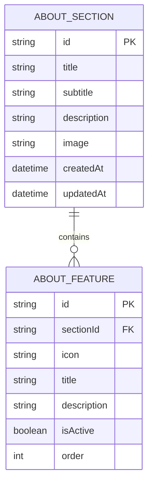
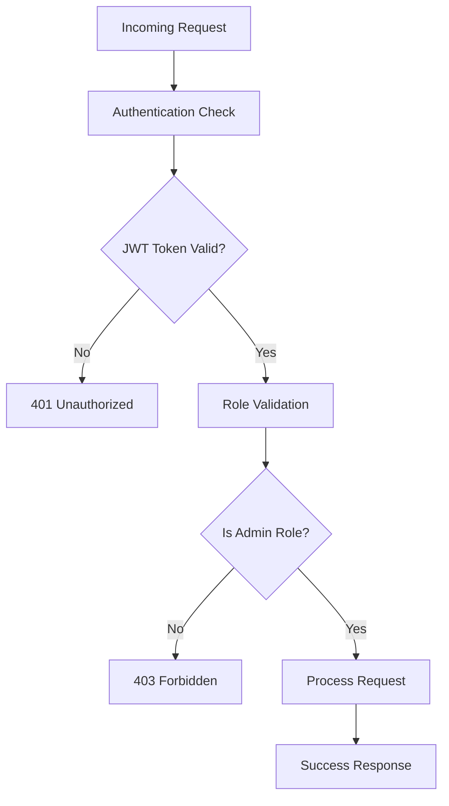
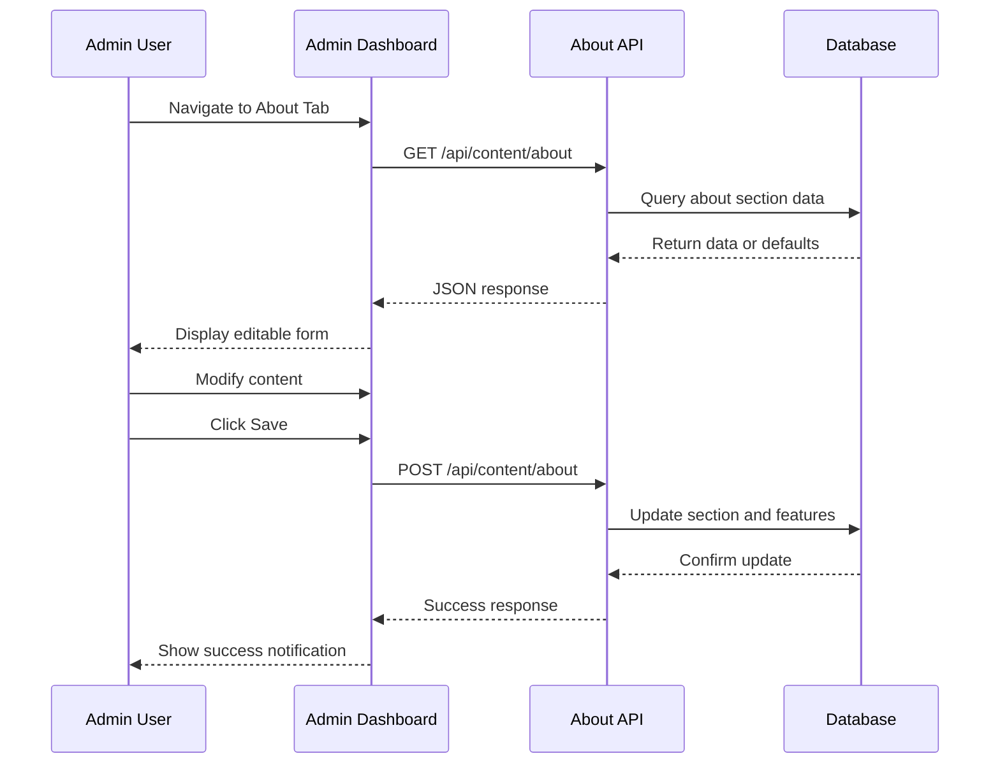

# About Section API Documentation

<cite>
**Referenced Files in This Document**
- [src/app/api/content/about/route.ts](file://src/app/api/content/about/route.ts)
- [src/components/admin/content-tabs/about-tab.tsx](file://src/components/admin/content-tabs/about-tab.tsx)
- [src/lib/prisma.ts](file://src/lib/prisma.ts)
- [src/lib/auth.ts](file://src/lib/auth.ts)
- [prisma/schema.prisma](file://prisma/schema.prisma)
- [src/app/admin/content/page.tsx](file://src/app/admin/content/page.tsx)
- [src/app/admin/layout.tsx](file://src/app/admin/layout.tsx)
</cite>

## Table of Contents
1. [Introduction](#introduction)
2. [Endpoint Overview](#endpoint-overview)
3. [HTTP Methods](#http-methods)
4. [Request/Response Schemas](#requestresponse-schemas)
5. [Database Interaction](#database-interaction)
6. [Authentication and Authorization](#authentication-and-authorization)
7. [Implementation Examples](#implementation-examples)
8. [Error Handling](#error-handling)
9. [Admin Dashboard Integration](#admin-dashboard-integration)
10. [Best Practices](#best-practices)

## Introduction

The About Section API provides comprehensive content management capabilities for the "Hakkımızda" (About Us) section of the SMMM System. This RESTful API endpoint enables administrators to retrieve and update about section data including title, subtitle, description, image, and feature blocks with dynamic icon selection and status management.

The API follows REST principles and integrates seamlessly with the Next.js framework using Server-Side Rendering (SSR) and API Routes. It leverages Prisma ORM for database operations and implements robust error handling with fallback mechanisms for schema evolution.

## Endpoint Overview

### URL Pattern
```
/api/content/about
```

### Supported HTTP Methods
- **GET**: Retrieve about section data
- **POST**: Update or create about section content

### Authentication Requirements
- **Role**: Admin only
- **Method**: JWT Token via NextAuth
- **Scope**: Content Management permissions

## HTTP Methods

### GET Method

Retrieves the current about section data from the database. If no data exists, returns default values with predefined features.

#### Request
```
GET /api/content/about
```

#### Response Schema
```typescript
interface AboutSectionResponse {
  title: string;
  subtitle?: string;
  description: string;
  image?: string;
  features: AboutFeature[];
}

interface AboutFeature {
  id: string;
  icon: string;
  title: string;
  description: string;
  isActive: boolean;
  order: number;
}
```

#### Success Response (200 OK)
```json
{
  "title": "Hakkımızda",
  "subtitle": "Serbest Muhasebeci Mali Müşavir olarak...",
  "description": "Profesyonel kadromuz ve modern teknoloji altyapısı...",
  "features": [
    {
      "id": "default-1",
      "icon": "Award",
      "title": "Profesyonel Deneyim",
      "description": "15 yılı aşkın sektör tecrübesi...",
      "isActive": true,
      "order": 0
    }
  ]
}
```

### POST Method

Updates or creates the about section content. Handles both new section creation and existing section updates with feature management.

#### Request
```
POST /api/content/about
Content-Type: application/json
```

#### Request Body Schema
```typescript
interface AboutSectionUpdate {
  title: string;
  subtitle?: string;
  description: string;
  image?: string;
  features: AboutFeatureUpdate[];
}

interface AboutFeatureUpdate {
  id?: string;
  icon: string;
  title: string;
  description: string;
  isActive?: boolean;
}
```

#### Success Response (200 OK)
```json
{
  "id": "abc123",
  "title": "Updated Title",
  "subtitle": "Updated Subtitle",
  "description": "Updated Description",
  "image": "base64-encoded-image-data",
  "features": [
    {
      "id": "feature-1",
      "sectionId": "abc123",
      "icon": "Shield",
      "title": "Updated Feature",
      "description": "Updated Description",
      "isActive": true,
      "order": 0
    }
  ]
}
```

## Request/Response Schemas

### About Section Structure

The about section consists of several key components:

| Field | Type | Required | Description |
|-------|------|----------|-------------|
| title | string | Yes | Main title of the about section |
| subtitle | string | No | Secondary title/subheading |
| description | string | Yes | Detailed description text |
| image | string | No | Base64 encoded image data |
| features | AboutFeature[] | Yes | Array of feature blocks |

### Feature Block Structure

Each feature block contains the following properties:

| Field | Type | Required | Description |
|-------|------|----------|-------------|
| id | string | No* | Unique identifier (auto-generated for new features) |
| icon | string | Yes | Lucide icon name |
| title | string | Yes | Feature title |
| description | string | Yes | Feature description |
| isActive | boolean | No | Feature visibility status |
| order | number | No | Display order (auto-calculated) |

*Note: IDs are auto-generated for new features but preserved for existing ones during updates.

### Default Features

When no about section exists, the API returns predefined default features:

```typescript
const DEFAULT_FEATURES = [
  {
    id: "default-1",
    icon: "Award",
    title: "Profesyonel Deneyim",
    description: "15 yılı aşkın sektör tecrübesi ile işletmenize en iyi hizmeti sunuyoruz.",
    isActive: true,
    order: 0
  },
  // ... additional default features
];
```

## Database Interaction

### Prisma Model Structure

The about section data is managed through two related models in the Prisma schema:



**Diagram sources**
- [prisma/schema.prisma](file://prisma/schema.prisma#L245-L260)

### Database Operations

The API performs the following database operations:

#### GET Operation
1. **Query**: `prisma.aboutSection.findFirst()` with feature inclusion
2. **Fallback**: Returns default features if no data exists
3. **Ordering**: Features are ordered by `order` field ascending

#### POST Operation
1. **Check Existence**: `prisma.aboutSection.findFirst()` to determine create/update
2. **Update/Create**: Conditional operation based on existing data
3. **Feature Management**: Complete replacement of feature data
4. **Transaction Safety**: Ensures atomic updates

### Schema Evolution Handling

The API includes fallback mechanisms for schema evolution:

```typescript
// Try with isActive field (new schema)
await prisma.aboutFeature.createMany({
  data: features.map((feature, index) => ({
    sectionId: section.id,
    icon: feature.icon,
    title: feature.title,
    description: feature.description,
    ...(feature.isActive !== undefined && { isActive: feature.isActive }),
    order: index
  }))
})

// Fallback without isActive field (legacy schema)
await prisma.aboutFeature.createMany({
  data: features.map((feature, index) => ({
    sectionId: section.id,
    icon: feature.icon,
    title: feature.title,
    description: feature.description,
    order: index
  }))
})
```

**Section sources**
- [src/app/api/content/about/route.ts](file://src/app/api/content/about/route.ts#L84-L124)
- [prisma/schema.prisma](file://prisma/schema.prisma#L245-L260)

## Authentication and Authorization

### Role-Based Access Control

The About Section API enforces strict admin-only access:



**Diagram sources**
- [src/lib/auth.ts](file://src/lib/auth.ts#L49-L85)

### Authentication Implementation

The system uses NextAuth with JWT tokens for authentication:

1. **Token Validation**: Validates JWT signature and expiration
2. **Role Extraction**: Extracts admin role from JWT payload
3. **Permission Check**: Verifies user has ADMIN role
4. **Session Management**: Maintains secure session state

### Security Measures

- **HTTPS Only**: All API communications encrypted
- **CSRF Protection**: Implemented via NextAuth
- **Rate Limiting**: Built-in rate limiting in production
- **Input Sanitization**: Automatic sanitization through Prisma

**Section sources**
- [src/lib/auth.ts](file://src/lib/auth.ts#L0-L86)

## Implementation Examples

### Frontend Integration

The About Tab component demonstrates complete API integration:

```typescript
// Fetching about section data
const fetchAboutData = async () => {
  try {
    const response = await fetch('/api/content/about')
    if (response.ok) {
      const data = await response.json()
      // Ensure all features have isActive property
      if (data.features) {
        data.features = data.features.map(feature => ({
          ...feature,
          isActive: feature.isActive ?? true
        }))
      }
      setAboutData(data)
    }
  } catch (error) {
    console.error('Error fetching about data:', error)
    setAboutData(DEFAULT_ABOUT)
  }
}
```

### Saving Updates

```typescript
// Saving about section changes
const saveAboutData = async () => {
  setSaving(true)
  try {
    const response = await fetch('/api/content/about', {
      method: 'POST',
      headers: { 'Content-Type': 'application/json' },
      body: JSON.stringify(aboutData),
    })
    
    if (response.ok) {
      toast.success('Hakkımızda bölümü başarıyla kaydedildi.')
    } else {
      toast.error('Hakkımızda bölümü kaydedilemedi.')
    }
  } catch (error) {
    console.error('Error saving about data:', error)
    toast.error('Bir hata oluştu. Lütfen tekrar deneyin.')
  } finally {
    setSaving(false)
  }
}
```

### Feature Management

The component supports comprehensive feature management:

- **Add New Features**: Creates new feature entries with unique IDs
- **Edit Existing Features**: Updates existing feature properties
- **Delete Features**: Removes features from the collection
- **Reorder Features**: Automatically manages feature ordering
- **Bulk Operations**: Supports search and pagination

**Section sources**
- [src/components/admin/content-tabs/about-tab.tsx](file://src/components/admin/content-tabs/about-tab.tsx#L101-L139)
- [src/components/admin/content-tabs/about-tab.tsx](file://src/components/admin/content-tabs/about-tab.tsx#L450-L480)

## Error Handling

### Error Response Patterns

The API implements consistent error handling across all operations:

#### Database Errors (500 Internal Server Error)
```json
{
  "error": "Hakkımızda bölümü alınamadı"
}
```

#### General Application Errors (500 Internal Server Error)
```json
{
  "error": "Hakkımızda bölümü kaydedilemedi"
}
```

### Error Categories

| Error Type | HTTP Status | Description | Recovery Action |
|------------|-------------|-------------|-----------------|
| Database Connection | 500 | Prisma connection failure | Retry with exponential backoff |
| Validation Error | 400 | Invalid request payload | Validate input data |
| Authentication | 401 | Invalid or missing token | Re-authenticate user |
| Authorization | 403 | Insufficient permissions | Verify admin role |
| Resource Not Found | 404 | About section not found | Create default section |

### Fallback Mechanisms

The API includes robust fallback strategies:

1. **Default Values**: Returns predefined features when no data exists
2. **Schema Compatibility**: Handles both old and new database schemas
3. **Graceful Degradation**: Continues operation with reduced functionality
4. **Logging**: Comprehensive error logging for debugging

**Section sources**
- [src/app/api/content/about/route.ts](file://src/app/api/content/about/route.ts#L44-L52)
- [src/app/api/content/about/route.ts](file://src/app/api/content/about/route.ts#L175-L189)

## Admin Dashboard Integration

### Content Management Interface

The About Section API integrates seamlessly with the admin dashboard:



**Diagram sources**
- [src/components/admin/content-tabs/about-tab.tsx](file://src/components/admin/content-tabs/about-tab.tsx#L101-L139)
- [src/app/admin/content/page.tsx](file://src/app/admin/content/page.tsx#L0-L35)

### Dashboard Features

The admin interface provides comprehensive content management:

#### Content Editing
- **Rich Text Editing**: Multi-line text areas for title, subtitle, and description
- **Image Upload**: Base64 encoding for image storage
- **Real-time Preview**: Immediate feedback on changes

#### Feature Management
- **Feature List**: Tabular display with sorting and filtering
- **Feature Editor**: Modal dialog for detailed feature editing
- **Bulk Actions**: Search, pagination, and bulk operations
- **Status Control**: Activate/deactivate features

#### Administrative Controls
- **Save Button**: Single-click save with loading states
- **Validation**: Real-time form validation
- **Notifications**: Toast notifications for success/error states
- **Undo Capability**: Ability to revert changes

**Section sources**
- [src/components/admin/content-tabs/about-tab.tsx](file://src/components/admin/content-tabs/about-tab.tsx#L450-L580)
- [src/app/admin/content/page.tsx](file://src/app/admin/content/page.tsx#L0-L35)

## Best Practices

### API Design Principles

1. **RESTful Conventions**: Follows REST principles with appropriate HTTP methods
2. **Consistent Responses**: Standardized success and error response formats
3. **Idempotent Operations**: GET requests are safe and repeatable
4. **Atomic Updates**: POST operations ensure complete data consistency

### Performance Optimization

1. **Database Queries**: Efficient queries with proper indexing
2. **Caching**: Appropriate caching strategies for static content
3. **Batch Operations**: Bulk feature updates minimize database calls
4. **Pagination**: Efficient handling of large feature sets

### Security Considerations

1. **Input Validation**: Comprehensive input sanitization
2. **Access Control**: Strict role-based permissions
3. **Data Integrity**: Foreign key constraints and validation
4. **Audit Logging**: Track all content modifications

### Maintenance Guidelines

1. **Schema Evolution**: Backward-compatible database schema changes
2. **Error Monitoring**: Comprehensive logging and monitoring
3. **Backup Strategy**: Regular database backups
4. **Testing**: Automated testing for API endpoints

### Future Enhancements

1. **Versioning**: API versioning for breaking changes
2. **Webhooks**: Real-time notifications for content changes
3. **Media Management**: Dedicated media library integration
4. **SEO Optimization**: Automatic SEO metadata generation