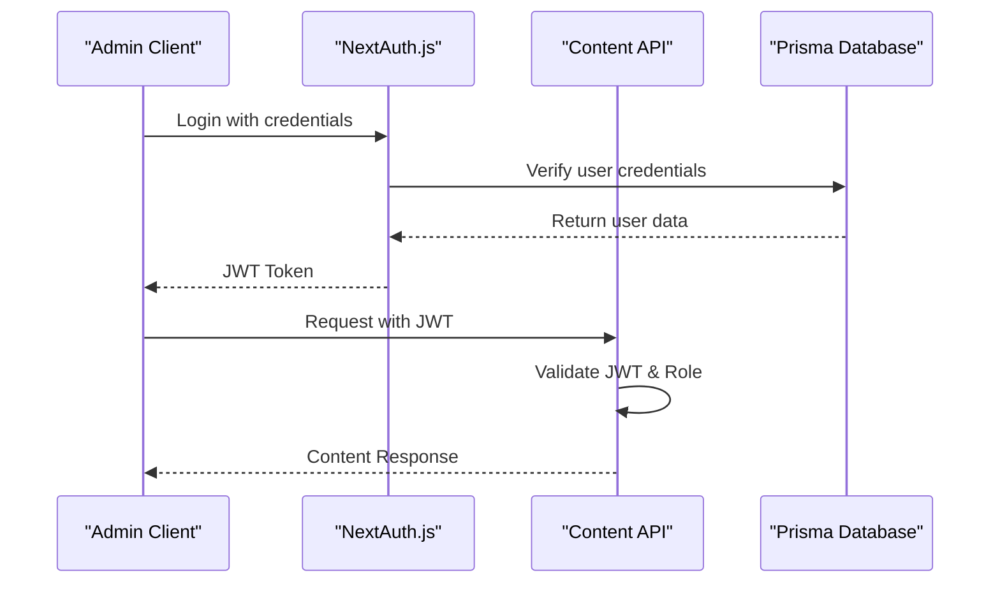
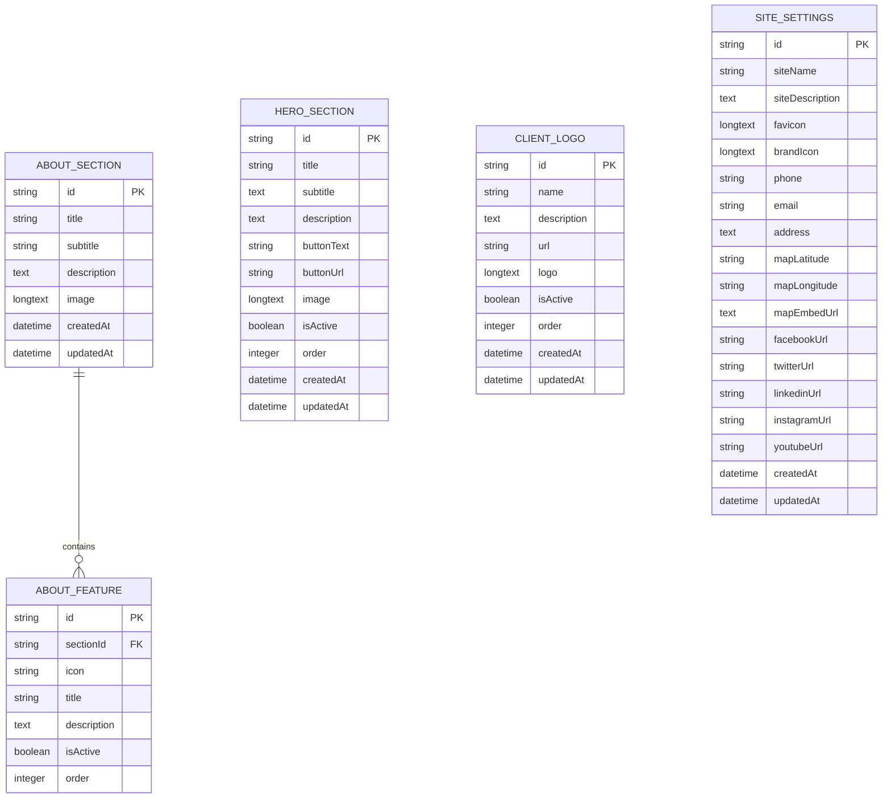
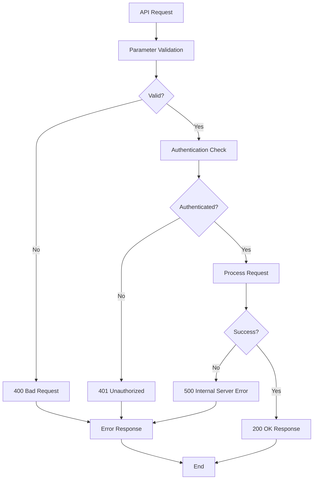
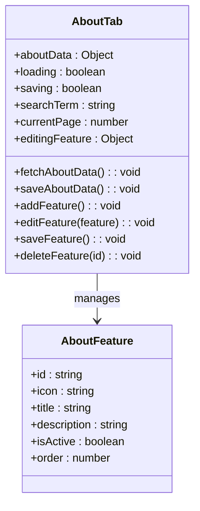
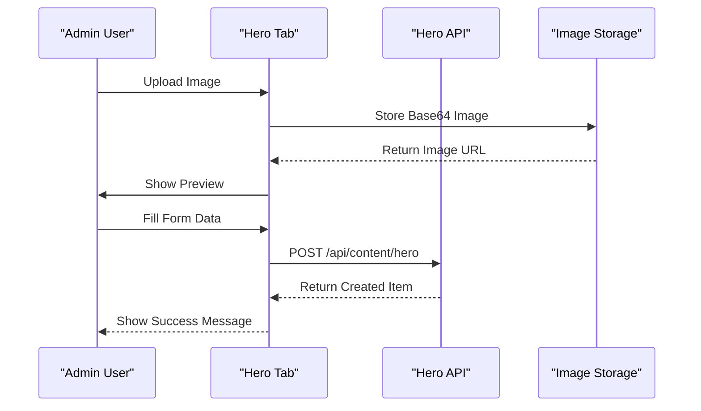
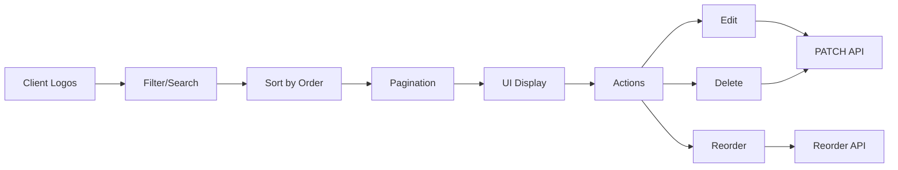

# Content Management API Documentation

<cite>
**Referenced Files in This Document**
- [src/app/api/content/about/route.ts](file://src/app/api/content/about/route.ts)
- [src/app/api/content/hero/route.ts](file://src/app/api/content/hero/route.ts)
- [src/app/api/content/hero/reorder/route.ts](file://src/app/api/content/hero/reorder/route.ts)
- [src/app/api/content/institutions/route.ts](file://src/app/api/content/institutions/route.ts)
- [src/app/api/content/institutions/reorder/route.ts](file://src/app/api/content/institutions/reorder/route.ts)
- [src/app/api/content/site-settings/route.ts](file://src/app/api/content/site-settings/route.ts)
- [src/lib/prisma.ts](file://src/lib/prisma.ts)
- [prisma/migrations/20251101125707_init/migration.sql](file://prisma/migrations/20251101125707_init/migration.sql)
- [src/components/admin/content-tabs/about-tab.tsx](file://src/components/admin/content-tabs/about-tab.tsx)
- [src/components/admin/content-tabs/hero-section-tab.tsx](file://src/components/admin/content-tabs/hero-section-tab.tsx)
- [src/components/admin/content-tabs/institutions-tab.tsx](file://src/components/admin/content-tabs/institutions-tab.tsx)
- [src/app/admin/content/page.tsx](file://src/app/admin/content/page.tsx)
- [src/lib/auth.ts](file://src/lib/auth.ts)
</cite>

## Table of Contents
1. [Introduction](#introduction)
2. [Authentication and Authorization](#authentication-and-authorization)
3. [API Overview](#api-overview)
4. [About Section API](#about-section-api)
5. [Hero Section API](#hero-section-api)
6. [Institutions Section API](#institutions-section-api)
7. [Site Settings API](#site-settings-api)
8. [Special Reorder Endpoints](#special-reorder-endpoints)
9. [Database Schema](#database-schema)
10. [Error Handling](#error-handling)
11. [Implementation Examples](#implementation-examples)
12. [Best Practices](#best-practices)

## Introduction

The Content Management API provides comprehensive CRUD operations for managing website content sections including About, Hero, Institutions, and Site Settings. Built with Next.js API Routes and Prisma ORM, this API enables administrators to dynamically manage website content through a modern admin interface.

The API follows RESTful principles with support for complex nested data structures, image uploads, and specialized reorder operations for ordered content sections. All endpoints require authentication and enforce role-based access control for admin users only.

## Authentication and Authorization

The API implements JWT-based authentication using NextAuth.js with role-based access control. Only users with the ADMIN role can access content management endpoints.

### Authentication Flow



**Diagram sources**
- [src/lib/auth.ts](file://src/lib/auth.ts#L25-L86)

### Role-Based Access Control

All content management endpoints are protected and require the ADMIN role:

- **Required Role**: `ADMIN`
- **Authentication Method**: JWT Token in Authorization header
- **Session Validation**: Token verification and role checking

**Section sources**
- [src/lib/auth.ts](file://src/lib/auth.ts#L25-L86)
- [prisma/migrations/20251101125707_init/migration.sql](file://prisma/migrations/20251101125707_init/migration.sql#L6-L15)

## API Overview

The Content Management API consists of five main content sections, each with standardized CRUD operations:

| Endpoint Category | Purpose | Operations |
|-------------------|---------|------------|
| **About Section** | Manage "About Us" content with features | GET, POST (Create/Update) |
| **Hero Section** | Manage homepage hero banner | GET, POST, PATCH, DELETE |
| **Institutions** | Manage client logos and institutions | GET, POST, PATCH, DELETE |
| **Site Settings** | Global site configuration | GET, POST |
| **Reorder Endpoints** | Special endpoints for ordering content | POST |

### Standard Request/Response Pattern

All content endpoints follow a consistent pattern:

```typescript
// Request Headers
Content-Type: application/json
Authorization: Bearer <jwt-token>

// Response Format
{
  "success": boolean,
  "data": any,
  "error": string | null
}
```

## About Section API

The About Section API manages the "About Us" page content including the main section and associated features.

### GET /api/content/about

Retrieves the current About section data with features sorted by order.

**HTTP Method**: `GET`

**Response Schema**:
```typescript
{
  "id": string,
  "title": string,
  "subtitle": string,
  "description": string,
  "image": string | null,
  "features": Array<{
    "id": string,
    "icon": string,
    "title": string,
    "description": string,
    "isActive": boolean,
    "order": number
  }>
}
```

**Default Response** (when no data exists):
```typescript
{
  "title": "Hakkımızda",
  "subtitle": "Serbest Muhasebeci Mali Müşavir olarak, işletmelerin finansal süreçlerini en verimli şekilde yönetmelerine yardımcı oluyoruz.",
  "description": "Profesyonel kadromuz ve modern teknoloji altyapımız ile sektörde fark yaratıyoruz.",
  "features": [
    {
      "id": "default-1",
      "icon": "Award",
      "title": "Profesyonel Deneyim",
      "description": "15 yılı aşkın sektör tecrübesi ile işletmenize en iyi hizmeti sunuyoruz.",
      "isActive": true,
      "order": 0
    }
  ]
}
```

### POST /api/content/about

Creates or updates the About section data. Supports both initial creation and subsequent updates.

**HTTP Method**: `POST`

**Request Body**:
```typescript
{
  "title": string,
  "subtitle": string,
  "description": string,
  "image": string | null,
  "features": Array<{
    "id": string,
    "icon": string,
    "title": string,
    "description": string,
    "isActive": boolean,
    "order": number
  }>
}
```

**Processing Logic**:
1. Checks if About section exists
2. Updates main section data if exists
3. Deletes existing features and creates new ones
4. Handles fallback for older database schemas without `isActive` field

**Success Response**: Returns the complete About section with features

**Section sources**
- [src/app/api/content/about/route.ts](file://src/app/api/content/about/route.ts#L45-L190)

## Hero Section API

The Hero Section API manages the homepage hero banner content with individual items that can be reordered.

### GET /api/content/hero

Retrieves all hero section items sorted by order.

**HTTP Method**: `GET`

**Response Schema**:
```typescript
Array<{
  "id": string,
  "title": string,
  "subtitle": string,
  "description": string | null,
  "buttonText": string | null,
  "buttonUrl": string | null,
  "image": string | null,
  "isActive": boolean,
  "order": number
}>
```

### POST /api/content/hero

Creates a new hero section item.

**HTTP Method**: `POST`

**Request Body**:
```typescript
{
  "title": string,
  "subtitle": string,
  "description": string | null,
  "buttonText": string | null,
  "buttonUrl": string | null,
  "image": string | null,
  "isActive": boolean,
  "order": number
}
```

### PATCH /api/content/hero?id={id}

Updates an existing hero section item.

**HTTP Method**: `PATCH`

**URL Parameters**:
- `id`: Hero item identifier (required)

**Request Body**:
```typescript
{
  "title": string,
  "subtitle": string,
  "description": string | null,
  "buttonText": string | null,
  "buttonUrl": string | null,
  "image": string | null,
  "isActive": boolean,
  "order": number
}
```

### DELETE /api/content/hero?id={id}

Deletes a hero section item.

**HTTP Method**: `DELETE`

**URL Parameters**:
- `id`: Hero item identifier (required)

**Response**: `{ "success": true }`

**Section sources**
- [src/app/api/content/hero/route.ts](file://src/app/api/content/hero/route.ts#L1-L88)

## Institutions Section API

The Institutions API manages client logos and institutional partners with sorting capabilities.

### GET /api/content/institutions

Retrieves all client logos sorted by order.

**HTTP Method**: `GET`

**Response Schema**:
```typescript
Array<{
  "id": string,
  "name": string,
  "description": string | null,
  "url": string | null,
  "logo": string,
  "isActive": boolean,
  "order": number
}>
```

### POST /api/content/institutions

Creates a new client logo entry.

**HTTP Method**: `POST`

**Request Body**:
```typescript
{
  "name": string,
  "description": string | null,
  "url": string | null,
  "logo": string, // Base64 encoded image
  "isActive": boolean,
  "order": number
}
```

### PATCH /api/content/institutions?id={id}

Updates an existing client logo.

**HTTP Method**: `PATCH`

**URL Parameters**:
- `id`: Institution identifier (required)

**Request Body**:
```typescript
{
  "name": string,
  "description": string | null,
  "url": string | null,
  "logo": string | null,
  "isActive": boolean,
  "order": number
}
```

### DELETE /api/content/institutions?id={id}

Deletes a client logo entry.

**HTTP Method**: `DELETE`

**URL Parameters**:
- `id`: Institution identifier (required)

**Response**: `{ "success": true }`

**Section sources**
- [src/app/api/content/institutions/route.ts](file://src/app/api/content/institutions/route.ts#L1-L88)

## Site Settings API

The Site Settings API manages global site configuration including branding, contact information, and social media links.

### GET /api/content/site-settings

Retrieves current site settings with default values for missing fields.

**HTTP Method**: `GET`

**Response Schema**:
```typescript
{
  "id": string,
  "siteName": string,
  "siteDescription": string,
  "favicon": string | null,
  "brandIcon": string | null,
  "phone": string,
  "email": string,
  "address": string,
  "mapLatitude": string | null,
  "mapLongitude": string | null,
  "mapEmbedUrl": string | null,
  "facebookUrl": string,
  "twitterUrl": string,
  "linkedinUrl": string,
  "instagramUrl": string,
  "youtubeUrl": string
}
```

**Default Values**:
```typescript
{
  siteName: 'SMMM Ofisi',
  siteDescription: 'Profesyonel mali müşavirlik hizmetleri ile işletmenizin mali yönetiminde güvenilir çözüm ortağınız.',
  phone: '+90 (212) 123 45 67',
  email: 'info@smmmofisi.com',
  address: 'İstanbul, Türkiye',
  facebookUrl: 'https://facebook.com',
  twitterUrl: 'https://twitter.com',
  linkedinUrl: 'https://linkedin.com',
  instagramUrl: 'https://instagram.com',
  youtubeUrl: 'https://youtube.com'
}
```

### POST /api/content/site-settings

Updates site settings with provided data.

**HTTP Method**: `POST`

**Request Body**:
```typescript
{
  "siteName": string,
  "siteDescription": string,
  "favicon": string | null,
  "brandIcon": string | null,
  "phone": string,
  "email": string,
  "address": string,
  "mapLatitude": string | null,
  "mapLongitude": string | null,
  "mapEmbedUrl": string | null,
  "facebookUrl": string,
  "twitterUrl": string,
  "linkedinUrl": string,
  "instagramUrl": string,
  "youtubeUrl": string
}
```

**Processing Logic**:
1. Checks for existing settings record
2. Creates new record if none exists
3. Updates all provided fields
4. Returns updated settings

**Section sources**
- [src/app/api/content/site-settings/route.ts](file://src/app/api/content/site-settings/route.ts#L1-L118)

## Special Reorder Endpoints

The API provides specialized endpoints for reordering content items within ordered sections.

### Hero Section Reorder

Endpoint: `POST /api/content/hero/reorder`

Reorders all hero section items based on new sequence.

**HTTP Method**: `POST`

**Request Body**:
```typescript
{
  "items": Array<{
    "id": string,
    "order": number
  }>
}
```

**Example Payload**:
```typescript
{
  "items": [
    { "id": "hero-item-1", "order": 0 },
    { "id": "hero-item-2", "order": 1 },
    { "id": "hero-item-3", "order": 2 }
  ]
}
```

**Processing Logic**:
1. Receives array of items with new order positions
2. Updates each item's order field concurrently
3. Returns success response

### Institutions Reorder

Endpoint: `POST /api/content/institutions/reorder`

Reorders all client logo items based on new sequence.

**HTTP Method**: `POST`

**Request Body**:
```typescript
{
  "items": Array<{
    "id": string,
    "order": number
  }>
}
```

**Example Payload**:
```typescript
{
  "items": [
    { "id": "client-1", "order": 0 },
    { "id": "client-2", "order": 1 },
    { "id": "client-3", "order": 2 }
  ]
}
```

**Processing Logic**:
1. Receives array of items with new order positions
2. Updates each client logo's order field concurrently
3. Returns success response

**Section sources**
- [src/app/api/content/hero/reorder/route.ts](file://src/app/api/content/hero/reorder/route.ts#L1-L27)
- [src/app/api/content/institutions/reorder/route.ts](file://src/app/api/content/institutions/reorder/route.ts#L1-L26)

## Database Schema

The content management system uses a relational database schema with the following key tables:



**Diagram sources**
- [prisma/migrations/20251101125707_init/migration.sql](file://prisma/migrations/20251101125707_init/migration.sql#L157-L449)

### Key Schema Features

| Table | Purpose | Primary Keys | Foreign Keys |
|-------|---------|--------------|--------------|
| **AboutSection** | Main about page content | `id` | None |
| **AboutFeature** | Features within about section | `id` | `sectionId` → AboutSection |
| **HeroSection** | Homepage hero banners | `id` | None |
| **ClientLogo** | Client and partner logos | `id` | None |
| **SiteSettings** | Global site configuration | `id` | None |

**Section sources**
- [prisma/migrations/20251101125707_init/migration.sql](file://prisma/migrations/20251101125707_init/migration.sql#L157-L449)

## Error Handling

The API implements comprehensive error handling with consistent response patterns:

### Standard Error Response Format

```typescript
{
  "error": string,
  "details": string | null
}
```

### Common Error Scenarios

| Status Code | Scenario | Response |
|-------------|----------|----------|
| `400` | Missing required parameters | `{ "error": "ID gerekli" }` |
| `401` | Unauthorized access | `{ "error": "Yetkisiz erişim" }` |
| `404` | Resource not found | `{ "error": "Kaynak bulunamadı" }` |
| `500` | Server error | `{ "error": "Sunucu hatası" }` |

### Error Handling Patterns



**Section sources**
- [src/app/api/content/about/route.ts](file://src/app/api/content/about/route.ts#L45-L55)
- [src/app/api/content/hero/route.ts](file://src/app/api/content/hero/route.ts#L15-L25)

## Implementation Examples

### Admin Content Tabs Interface

The admin interface demonstrates how the API is consumed for dynamic content management:

#### About Tab Implementation

The About tab provides comprehensive management of the "About Us" section:



**Diagram sources**
- [src/components/admin/content-tabs/about-tab.tsx](file://src/components/admin/content-tabs/about-tab.tsx#L150-L200)

#### Hero Section Tab Implementation

The Hero section tab manages homepage banners with image upload capabilities:



**Diagram sources**
- [src/components/admin/content-tabs/hero-section-tab.tsx](file://src/components/admin/content-tabs/hero-section-tab.tsx#L80-L120)

#### Institutions Tab Implementation

The Institutions tab provides advanced management with sorting and filtering:



**Diagram sources**
- [src/components/admin/content-tabs/institutions-tab.tsx](file://src/components/admin/content-tabs/institutions-tab.tsx#L400-L500)

### API Consumption Examples

#### Fetching About Section Data

```javascript
// Fetch current about section data
const fetchAboutData = async () => {
  try {
    const response = await fetch('/api/content/about');
    if (response.ok) {
      const data = await response.json();
      // Handle data
    }
  } catch (error) {
    console.error('Error fetching about data:', error);
  }
};
```

#### Updating Hero Section

```javascript
// Update hero section item
const updateHeroItem = async (itemId, updatedData) => {
  try {
    const response = await fetch(`/api/content/hero?id=${itemId}`, {
      method: 'PATCH',
      headers: {
        'Content-Type': 'application/json',
      },
      body: JSON.stringify(updatedData),
    });
    
    if (response.ok) {
      const updatedItem = await response.json();
      return updatedItem;
    }
  } catch (error) {
    console.error('Error updating hero item:', error);
  }
};
```

#### Reordering Items

```javascript
// Reorder hero items
const reorderHeroItems = async (newOrder) => {
  try {
    const response = await fetch('/api/content/hero/reorder', {
      method: 'POST',
      headers: {
        'Content-Type': 'application/json',
      },
      body: JSON.stringify({ items: newOrder }),
    });
    
    if (response.ok) {
      return true;
    }
  } catch (error) {
    console.error('Error reordering hero items:', error);
    return false;
  }
};
```

**Section sources**
- [src/components/admin/content-tabs/about-tab.tsx](file://src/components/admin/content-tabs/about-tab.tsx#L120-L180)
- [src/components/admin/content-tabs/hero-section-tab.tsx](file://src/components/admin/content-tabs/hero-section-tab.tsx#L100-L150)
- [src/components/admin/content-tabs/institutions-tab.tsx](file://src/components/admin/content-tabs/institutions-tab.tsx#L350-L400)

## Best Practices

### Security Considerations

1. **Authentication**: All endpoints require valid JWT tokens
2. **Role Verification**: Only ADMIN users can access content management
3. **Input Validation**: Validate all incoming data
4. **File Upload Security**: Limit file sizes and validate MIME types

### Performance Optimization

1. **Database Queries**: Use appropriate includes and selects
2. **Caching**: Implement caching for frequently accessed data
3. **Batch Operations**: Use concurrent updates for reorder operations
4. **Pagination**: Implement pagination for large datasets

### Error Handling Best Practices

1. **Consistent Responses**: Use standard error response format
2. **Logging**: Log errors for debugging and monitoring
3. **User Feedback**: Provide meaningful error messages
4. **Graceful Degradation**: Handle database connection failures

### Data Integrity

1. **Validation**: Validate all data before database operations
2. **Transactions**: Use transactions for complex operations
3. **Fallbacks**: Implement fallbacks for schema changes
4. **Backup**: Regular database backups

### API Design Principles

1. **RESTful Design**: Follow RESTful conventions
2. **Versioning**: Plan for API versioning
3. **Documentation**: Maintain comprehensive documentation
4. **Testing**: Implement comprehensive testing