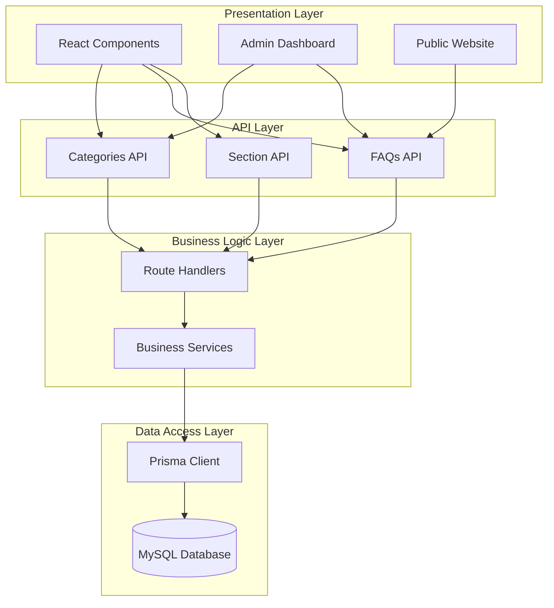
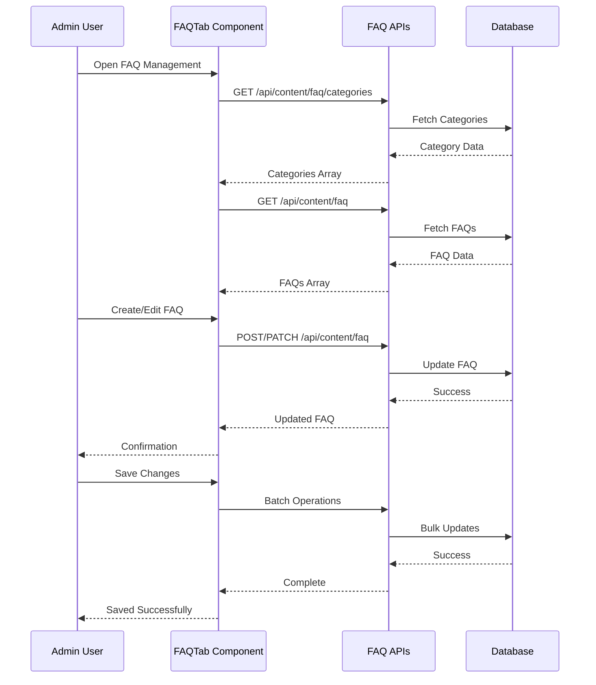
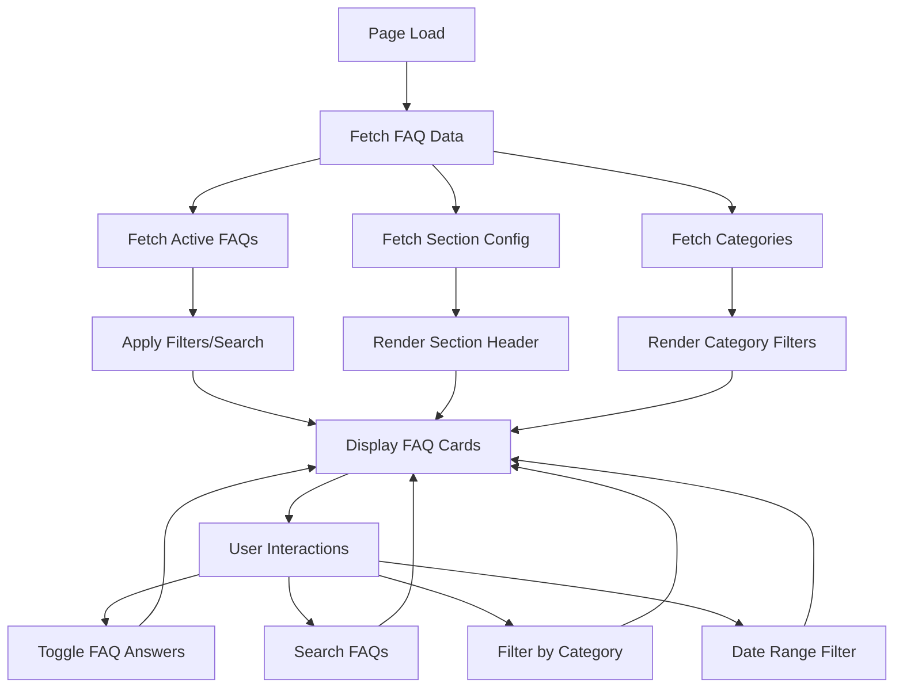

# FAQ Categories API Documentation

<cite>
**Referenced Files in This Document**
- [src/app/api/content/faq/categories/route.ts](file://src/app/api/content/faq/categories/route.ts)
- [src/app/api/content/faq/route.ts](file://src/app/api/content/faq/route.ts)
- [src/app/api/content/faq/section/route.ts](file://src/app/api/content/faq/section/route.ts)
- [src/components/admin/content-tabs/faq-tab.tsx](file://src/components/admin/content-tabs/faq-tab.tsx)
- [src/components/landing/faq-section.tsx](file://src/components/landing/faq-section.tsx)
- [src/lib/db.ts](file://src/lib/db.ts)
- [src/lib/prisma.ts](file://src/lib/prisma.ts)
- [prisma/migrations/20251101125707_init/migration.sql](file://prisma/migrations/20251101125707_init/migration.sql)
- [prisma/seed.ts](file://prisma/seed.ts)
- [src/app/(public)/page.tsx](file://src/app/(public)/page.tsx)
</cite>

## Table of Contents
1. [Introduction](#introduction)
2. [System Architecture](#system-architecture)
3. [Database Schema](#database-schema)
4. [API Endpoints](#api-endpoints)
5. [Component Integration](#component-integration)
6. [Data Models](#data-models)
7. [Error Handling](#error-handling)
8. [Usage Examples](#usage-examples)
9. [Best Practices](#best-practices)
10. [Troubleshooting](#troubleshooting)

## Introduction

The FAQ Categories API is a comprehensive system designed to manage Frequently Asked Questions (FAQs) for the SMMM (Serbest Muhasebeci Mali Müşavir) system. This API provides full CRUD operations for FAQ categories, individual questions, and section configuration, enabling administrators to organize and display frequently asked questions effectively on both administrative panels and public website sections.

The system supports hierarchical categorization of FAQs, allowing questions to be grouped under specific categories such as "General", "Services", "Pricing", "Procedures", and "Technical". Each category can contain multiple FAQs, and each FAQ can be associated with a specific category, ordered by importance or relevance.

## System Architecture

The FAQ Categories API follows a layered architecture pattern with clear separation of concerns:



**Diagram sources**
- [src/app/api/content/faq/categories/route.ts](file://src/app/api/content/faq/categories/route.ts#L1-L126)
- [src/app/api/content/faq/route.ts](file://src/app/api/content/faq/route.ts#L1-L128)
- [src/app/api/content/faq/section/route.ts](file://src/app/api/content/faq/section/route.ts#L1-L59)

**Section sources**
- [src/app/api/content/faq/categories/route.ts](file://src/app/api/content/faq/categories/route.ts#L1-L126)
- [src/app/api/content/faq/route.ts](file://src/app/api/content/faq/route.ts#L1-L128)
- [src/app/api/content/faq/section/route.ts](file://src/app/api/content/faq/section/route.ts#L1-L59)

## Database Schema

The FAQ system utilizes two primary database tables with a foreign key relationship:

```mermaid
erDiagram
FAQCategory {
varchar_id PK
varchar_name UK
varchar_slug UK
int_order
datetime_createdAt
datetime_updatedAt
}
FAQ {
varchar_id PK
varchar_categoryId FK
varchar_question
text_answer
int_order
datetime_createdAt
datetime_updatedAt
boolean_isActive
}
FAQSection {
varchar_id PK
varchar_title
text_paragraph
datetime_createdAt
datetime_updatedAt
}
FAQCategory ||--o{ FAQ : contains
```

**Diagram sources**
- [prisma/migrations/20251101125707_init/migration.sql](file://prisma/migrations/20251101125707_init/migration.sql#L310-L334)

### Table Definitions

| Table | Columns | Description |
|-------|---------|-------------|
| `FAQCategory` | `id`, `name`, `slug`, `order`, `createdAt`, `updatedAt` | Stores FAQ categories with unique constraints on name and slug |
| `FAQ` | `id`, `categoryId`, `question`, `answer`, `order`, `createdAt`, `updatedAt`, `isActive` | Contains individual FAQ entries with category relationships |
| `FAQSection` | `id`, `title`, `paragraph`, `createdAt`, `updatedAt` | Manages section-level configuration for FAQ display |

**Section sources**
- [prisma/migrations/20251101125707_init/migration.sql](file://prisma/migrations/20251101125707_init/migration.sql#L310-L334)

## API Endpoints

The FAQ Categories API provides three main endpoints for comprehensive FAQ management:

### Categories API

| Method | Endpoint | Description | Request Body | Response |
|--------|----------|-------------|--------------|----------|
| GET | `/api/content/faq/categories` | Fetch all FAQ categories with ordering | None | Array of FAQCategory objects |
| POST | `/api/content/faq/categories` | Create a new FAQ category | `{ name, slug, order }` | Created FAQCategory object |
| PATCH | `/api/content/faq/categories?id=ID` | Update an existing category | `{ name, slug, order }` | Updated FAQCategory object |
| DELETE | `/api/content/faq/categories?id=ID` | Delete a category | None | Success response |

### FAQs API

| Method | Endpoint | Description | Request Body | Response |
|--------|----------|-------------|--------------|----------|
| GET | `/api/content/faq` | Fetch all FAQs with category inclusion | None | Array of FAQ objects with category data |
| POST | `/api/content/faq` | Create a new FAQ | `{ categoryId, question, answer, isActive, order }` | Created FAQ object with category data |
| PATCH | `/api/content/faq?id=ID` | Update an existing FAQ | `{ categoryId, question, answer, isActive, order }` | Updated FAQ object with category data |
| DELETE | `/api/content/faq?id=ID` | Delete a FAQ | None | Success response |

### Section API

| Method | Endpoint | Description | Request Body | Response |
|--------|----------|-------------|--------------|----------|
| GET | `/api/content/faq/section` | Fetch FAQ section configuration | None | FAQSection object |
| POST | `/api/content/faq/section` | Update FAQ section configuration | `{ title, paragraph }` | Updated FAQSection object |

**Section sources**
- [src/app/api/content/faq/categories/route.ts](file://src/app/api/content/faq/categories/route.ts#L17-L126)
- [src/app/api/content/faq/route.ts](file://src/app/api/content/faq/route.ts#L6-L128)
- [src/app/api/content/faq/section/route.ts](file://src/app/api/content/faq/section/route.ts#L11-L59)

## Component Integration

The FAQ system integrates seamlessly with both administrative and public-facing components:

### Administrative Interface

The admin interface provides comprehensive management capabilities through the FAQTab component:



**Diagram sources**
- [src/components/admin/content-tabs/faq-tab.tsx](file://src/components/admin/content-tabs/faq-tab.tsx#L69-L160)

### Public Website Integration

The public FAQ section displays organized questions with filtering and search capabilities:



**Diagram sources**
- [src/components/landing/faq-section.tsx](file://src/components/landing/faq-section.tsx#L56-L89)

**Section sources**
- [src/components/admin/content-tabs/faq-tab.tsx](file://src/components/admin/content-tabs/faq-tab.tsx#L52-L421)
- [src/components/landing/faq-section.tsx](file://src/components/landing/faq-section.tsx#L32-L315)

## Data Models

### FAQCategory Model

Represents a category for organizing FAQs:

| Field | Type | Description | Validation |
|-------|------|-------------|------------|
| `id` | `string` | Unique identifier | Auto-generated UUID |
| `name` | `string` | Display name | Required, unique |
| `slug` | `string` | URL-friendly identifier | Required, unique, lowercase |
| `order` | `number` | Display order | Default: 0 |
| `createdAt` | `Date` | Creation timestamp | Auto-generated |
| `updatedAt` | `Date` | Last update timestamp | Auto-updated |

### FAQ Model

Represents individual frequently asked questions:

| Field | Type | Description | Validation |
|-------|------|-------------|------------|
| `id` | `string` | Unique identifier | Auto-generated UUID |
| `categoryId` | `string` | Associated category ID | Required, references FAQCategory |
| `question` | `string` | FAQ question text | Required, max length |
| `answer` | `string` | FAQ answer text | Required, rich text support |
| `isActive` | `boolean` | Visibility status | Default: true |
| `order` | `number` | Display order | Default: 0 |
| `createdAt` | `Date` | Creation timestamp | Auto-generated |
| `updatedAt` | `Date` | Last update timestamp | Auto-updated |

### FAQSection Model

Manages section-level configuration:

| Field | Type | Description | Validation |
|-------|------|-------------|------------|
| `id` | `string` | Unique identifier | Auto-generated UUID |
| `title` | `string` | Section title | Required, default: "Sıkça Sorulan Sorular" |
| `paragraph` | `string` | Section description | Required, default: "Mali müşavirlik hizmetlerimiz hakkında merak ettikleriniz..." |
| `createdAt` | `Date` | Creation timestamp | Auto-generated |
| `updatedAt` | `Date` | Last update timestamp | Auto-updated |

**Section sources**
- [src/components/admin/content-tabs/faq-tab.tsx](file://src/components/admin/content-tabs/faq-tab.tsx#L28-L34)
- [src/app/api/content/faq/categories/route.ts](file://src/app/api/content/faq/categories/route.ts#L7-L15)
- [src/app/api/content/faq/route.ts](file://src/app/api/content/faq/route.ts#L25-L50)

## Error Handling

The API implements comprehensive error handling with meaningful error messages:

### Common Error Responses

| Status Code | Error Type | Description | Example Response |
|-------------|------------|-------------|------------------|
| 400 | Bad Request | Missing required fields | `{ error: 'Name ve slug zorunludur' }` |
| 404 | Not Found | Resource not found | `{ error: 'Kategori bulunamadı' }` |
| 500 | Internal Error | Server-side errors | `{ error: 'Kategori eklenemedi', details: 'Database connection failed' }` |

### Database-Specific Error Handling

The system handles database schema issues gracefully:

```typescript
// Error handling for missing tables
if (error.code === 'P2021' || error.message?.includes('does not exist')) {
  return NextResponse.json(getDefaultCategories())
}
```

### Validation Rules

- **Category Creation**: Requires `name` and `slug` fields
- **FAQ Creation**: Requires `categoryId`, `question`, and `answer` fields
- **Slug Uniqueness**: Prevents duplicate slugs across categories
- **Category References**: Ensures FAQ categories exist before creating FAQs

**Section sources**
- [src/app/api/content/faq/categories/route.ts](file://src/app/api/content/faq/categories/route.ts#L30-L65)
- [src/app/api/content/faq/route.ts](file://src/app/api/content/faq/route.ts#L30-L62)

## Usage Examples

### Creating a New FAQ Category

```javascript
// POST /api/content/faq/categories
const response = await fetch('/api/content/faq/categories', {
  method: 'POST',
  headers: { 'Content-Type': 'application/json' },
  body: JSON.stringify({
    name: 'Yeni Kategori',
    slug: 'yeni-kategori',
    order: 5
  })
})

const category = await response.json()
console.log('Created category:', category)
```

### Adding a New FAQ Question

```javascript
// POST /api/content/faq
const response = await fetch('/api/content/faq', {
  method: 'POST',
  headers: { 'Content-Type': 'application/json' },
  body: JSON.stringify({
    categoryId: 'category-id-from-above',
    question: 'Bu hizmetin ücreti nedir?',
    answer: 'Ücretler hizmet türüne göre değişiklik gösterir.',
    isActive: true,
    order: 0
  })
})
```

### Updating FAQ Section Configuration

```javascript
// POST /api/content/faq/section
const response = await fetch('/api/content/faq/section', {
  method: 'POST',
  headers: { 'Content-Type': 'application/json' },
  body: JSON.stringify({
    title: 'Müşteri Destek',
    paragraph: 'Size yardımcı olabilecek sorularımız.'
  })
})
```

### Admin Interface Operations

The admin interface provides batch operations for efficient management:

```typescript
// Save all changes (batch operation)
await saveAllChanges()

// Reset to defaults
await saveDefaultsToDatabase()

// Individual FAQ operations
await handleSaveFaq()
await handleDeleteFaq(id)
await moveFaq(faq, direction)
```

**Section sources**
- [src/app/api/content/faq/categories/route.ts](file://src/app/api/content/faq/categories/route.ts#L40-L65)
- [src/app/api/content/faq/route.ts](file://src/app/api/content/faq/route.ts#L40-L62)
- [src/components/admin/content-tabs/faq-tab.tsx](file://src/components/admin/content-tabs/faq-tab.tsx#L114-L160)

## Best Practices

### Data Organization

1. **Hierarchical Structure**: Use logical categories to group related FAQs
2. **Consistent Naming**: Maintain uniform naming conventions for categories
3. **Order Management**: Utilize the `order` field for prioritizing content
4. **Slug Management**: Ensure unique, SEO-friendly slugs for categories

### Performance Optimization

1. **Lazy Loading**: Load FAQs dynamically as users interact with the interface
2. **Pagination**: Implement pagination for large FAQ collections
3. **Caching**: Cache frequently accessed category and section data
4. **Indexing**: Ensure proper database indexing on frequently queried fields

### Security Considerations

1. **Input Validation**: Validate all user inputs before database operations
2. **Access Control**: Restrict API access to authorized admin users
3. **Data Sanitization**: Sanitize HTML content in FAQ answers
4. **Rate Limiting**: Implement rate limiting for API endpoints

### Content Management

1. **Version Control**: Track changes to FAQ content
2. **Backup Strategy**: Regular backups of FAQ data
3. **Content Review**: Implement approval workflows for new FAQs
4. **Multilingual Support**: Plan for future internationalization

## Troubleshooting

### Common Issues and Solutions

#### Database Connection Problems

**Symptom**: API returns 500 errors or connection timeouts
**Solution**: 
- Verify database connectivity
- Check Prisma client initialization
- Review database migration status

#### Missing Default Categories

**Symptom**: Categories endpoint returns empty array
**Solution**:
- Check database schema existence
- Verify migration execution
- Use default categories fallback

#### FAQ Category Not Found

**Symptom**: Cannot create FAQ with invalid category ID
**Solution**:
- Verify category exists before creating FAQ
- Check foreign key constraints
- Ensure category ID format is correct

#### Duplicate Slug Errors

**Symptom**: Category creation fails with duplicate slug
**Solution**:
- Implement slug validation
- Use automatic slug generation
- Provide user feedback for conflicts

### Debugging Tools

1. **Console Logging**: Enable detailed logging in development
2. **Database Queries**: Monitor SQL queries for performance issues
3. **Network Inspection**: Use browser developer tools for API debugging
4. **Error Tracking**: Implement comprehensive error reporting

### Migration Issues

If encountering schema issues:

```sql
-- Check table existence
SHOW TABLES LIKE 'FAQCategory';

-- Verify column structure
DESCRIBE FAQCategory;

-- Check for orphaned records
SELECT * FROM FAQ WHERE categoryId NOT IN (SELECT id FROM FAQCategory);
```

**Section sources**
- [src/app/api/content/faq/categories/route.ts](file://src/app/api/content/faq/categories/route.ts#L25-L36)
- [src/lib/db.ts](file://src/lib/db.ts#L1-L10)
- [prisma/migrations/20251101125707_init/migration.sql](file://prisma/migrations/20251101125707_init/migration.sql#L310-L334)