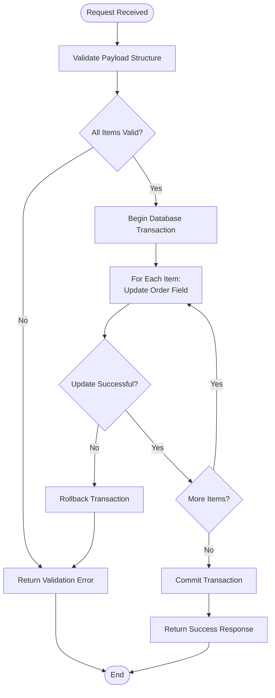

# Hero Section API Documentation

<cite>
**Referenced Files in This Document**
- [src/app/api/content/hero/route.ts](file://src/app/api/content/hero/route.ts)
- [src/app/api/content/hero/reorder/route.ts](file://src/app/api/content/hero/reorder/route.ts)
- [src/components/admin/content-tabs/hero-section-tab.tsx](file://src/components/admin/content-tabs/hero-section-tab.tsx)
- [src/lib/prisma.ts](file://src/lib/prisma.ts)
- [prisma/schema.prisma](file://prisma/schema.prisma)
- [src/lib/auth.ts](file://src/lib/auth.ts)
- [src/app/admin/layout.tsx](file://src/app/admin/layout.tsx)
</cite>

## Table of Contents
1. [Introduction](#introduction)
2. [System Architecture](#system-architecture)
3. [Authentication & Authorization](#authentication--authorization)
4. [Main Hero Section Endpoint](#main-hero-section-endpoint)
5. [Reorder Endpoint](#reorder-endpoint)
6. [Database Schema](#database-schema)
7. [Implementation Examples](#implementation-examples)
8. [Error Handling](#error-handling)
9. [Best Practices](#best-practices)
10. [Troubleshooting](#troubleshooting)

## Introduction

The Hero Section API provides comprehensive content management capabilities for the homepage hero section in the SMMM System. This API enables administrators to manage hero content blocks including title, subtitle, call-to-action buttons, images, and sequence ordering. The system supports both standard CRUD operations and specialized reordering functionality for drag-and-drop interface management.

The API follows RESTful principles with proper HTTP methods and status codes, implements role-based access control, and integrates with Prisma ORM for database operations. All endpoints support transactional operations where necessary to maintain data consistency.

## System Architecture

The Hero Section API is built on a modern Next.js 14 application with TypeScript, utilizing Prisma ORM for database abstraction and NextAuth for authentication. The architecture follows a layered approach with clear separation of concerns.


**Diagram sources**
- [src/app/api/content/hero/route.ts](file://src/app/api/content/hero/route.ts#L1-L88)
- [src/app/api/content/hero/reorder/route.ts](file://src/app/api/content/hero/reorder/route.ts#L1-L27)
- [src/lib/prisma.ts](file://src/lib/prisma.ts#L1-L10)
- [src/lib/auth.ts](file://src/lib/auth.ts#L1-L87)

## Authentication & Authorization

The Hero Section API implements role-based access control through NextAuth.js, requiring administrative privileges for content management operations. All endpoints are protected and require valid JWT tokens.

### Authentication Requirements

| Endpoint | Method | Authentication | Role Required |
|----------|--------|----------------|---------------|
| `/api/content/hero` | GET | JWT Token | ADMIN |
| `/api/content/hero` | POST | JWT Token | ADMIN |
| `/api/content/hero` | PATCH | JWT Token | ADMIN |
| `/api/content/hero` | DELETE | JWT Token | ADMIN |
| `/api/content/hero/reorder` | POST | JWT Token | ADMIN |

### Authentication Flow


**Diagram sources**
- [src/lib/auth.ts](file://src/lib/auth.ts#L40-L87)
- [src/app/api/content/hero/route.ts](file://src/app/api/content/hero/route.ts#L1-L88)

**Section sources**
- [src/lib/auth.ts](file://src/lib/auth.ts#L40-L87)
- [src/app/admin/layout.tsx](file://src/app/admin/layout.tsx#L135-L143)

## Main Hero Section Endpoint

The primary Hero Section endpoint handles standard CRUD operations for managing hero content blocks. It supports retrieving all hero items with ordered display, creating new hero entries, updating existing ones, and deleting items.

### GET /api/content/hero

Retrieves all hero section items sorted by their sequence order.

**Request Headers:**
- `Authorization: Bearer <jwt-token>`
- `Content-Type: application/json`

**Response:**
```json
[
  {
    "id": "clq123xyz456",
    "title": "Profesyonel Mali Müşavirlik Hizmetleri",
    "subtitle": "Güvenilir, deneyimli ve profesyonel ekibimizle yanınızdayız",
    "description": "Detaylı açıklama metni...",
    "buttonText": "Hemen Başla",
    "buttonUrl": "#services",
    "image": "data:image/jpeg;base64,/9j/4AAQSkZJRgABAQEASABIAAD...",
    "isActive": true,
    "order": 0,
    "createdAt": "2024-01-15T10:30:00.000Z",
    "updatedAt": "2024-01-15T10:30:00.000Z"
  }
]
```

**HTTP Status Codes:**
- `200 OK`: Successfully retrieved hero items
- `500 Internal Server Error`: Database query failed

### POST /api/content/hero

Creates a new hero section item with the provided data.

**Request Body:**
```json
{
  "title": "Yeni Hero Başlık",
  "subtitle": "Yeni Alt Başlık",
  "description": "Açıklama metni...",
  "buttonText": "Buton Metni",
  "buttonUrl": "#services",
  "image": "data:image/jpeg;base64,/9j/4AAQSkZJRgABAQEASABIAAD...",
  "isActive": true,
  "order": 0
}
```

**Response:**
```json
{
  "id": "clq456abc789",
  "title": "Yeni Hero Başlık",
  "subtitle": "Yeni Alt Başlık",
  "description": "Açıklama metni...",
  "buttonText": "Buton Metni",
  "buttonUrl": "#services",
  "image": "data:image/jpeg;base64,/9j/4AAQSkZJRgABAQEASABIAAD...",
  "isActive": true,
  "order": 0,
  "createdAt": "2024-01-15T11:00:00.000Z",
  "updatedAt": "2024-01-15T11:00:00.000Z"
}
```

### PATCH /api/content/hero?id={id}

Updates an existing hero section item identified by its ID.

**Query Parameter:**
- `id` (required): The unique identifier of the hero item

**Request Body:**
```json
{
  "title": "Güncellenmiş Başlık",
  "subtitle": "Güncellenmiş Alt Başlık",
  "description": "Güncellenmiş açıklama...",
  "buttonText": "Güncellenmiş Buton",
  "buttonUrl": "#about",
  "image": "data:image/jpeg;base64,/9j/4AAQSkZJRgABAQEASABIAAD...",
  "isActive": true
}
```

**Response:**
```json
{
  "id": "clq456abc789",
  "title": "Güncellenmiş Başlık",
  "subtitle": "Güncellenmiş Alt Başlık",
  "description": "Güncellenmiş açıklama...",
  "buttonText": "Güncellenmiş Buton",
  "buttonUrl": "#about",
  "image": "data:image/jpeg;base64,/9j/4AAQSkZJRgABAQEASABIAAD...",
  "isActive": true,
  "order": 0,
  "createdAt": "2024-01-15T11:00:00.000Z",
  "updatedAt": "2024-01-15T11:30:00.000Z"
}
```

### DELETE /api/content/hero?id={id}

Deletes a hero section item by its ID.

**Query Parameter:**
- `id` (required): The unique identifier of the hero item

**Response:**
```json
{
  "success": true
}
```

**HTTP Status Codes:**
- `200 OK`: Successfully deleted hero item
- `400 Bad Request`: Missing ID parameter
- `500 Internal Server Error`: Database operation failed

**Section sources**
- [src/app/api/content/hero/route.ts](file://src/app/api/content/hero/route.ts#L1-L88)

## Reorder Endpoint

The Hero Section reorder endpoint provides atomic sequence management for hero items, enabling drag-and-drop reordering functionality. This endpoint ensures data consistency through transactional operations.

### POST /api/content/hero/reorder

Updates the sequence order of multiple hero items in a single atomic operation.

**Request Body:**
```json
{
  "items": [
    {
      "id": "clq123xyz456",
      "order": 0
    },
    {
      "id": "clq456abc789",
      "order": 1
    },
    {
      "id": "clq789def012",
      "order": 2
    }
  ]
}
```

**Payload Structure:**
- `items` (array): Array of hero item objects
  - `id` (string): Unique identifier of the hero item
  - `order` (number): Desired sequence position (0-indexed)

**Response:**
```json
{
  "success": true
}
```

### Transaction Logic

The reorder endpoint implements atomic transaction logic to ensure all sequence updates succeed or fail together:



**Diagram sources**
- [src/app/api/content/hero/reorder/route.ts](file://src/app/api/content/hero/reorder/route.ts#L5-L26)

**HTTP Status Codes:**
- `200 OK`: Successfully reordered items
- `500 Internal Server Error`: Transaction failed or database error

**Section sources**
- [src/app/api/content/hero/reorder/route.ts](file://src/app/api/content/hero/reorder/route.ts#L1-L27)

## Database Schema

The Hero Section functionality is supported by the `HeroSection` model in the Prisma schema, which defines the structure and constraints for hero content storage.

### HeroSection Model

| Field | Type | Constraints | Description |
|-------|------|-------------|-------------|
| `id` | String | Primary Key, Auto-generated | Unique identifier for the hero item |
| `title` | String | Required | Main headline text |
| `subtitle` | String | Required | Subheading or description text |
| `description` | String | Nullable | Extended description content |
| `buttonText` | String | Nullable | Call-to-action button text |
| `buttonUrl` | String | Nullable | Link destination URL |
| `image` | String | Nullable | Base64 encoded image data |
| `isActive` | Boolean | Default: true | Visibility flag |
| `order` | Int | Default: 0 | Display sequence position |
| `createdAt` | DateTime | Auto-generated | Record creation timestamp |
| `updatedAt` | DateTime | Auto-generated | Last modification timestamp |

### Database Operations

The API utilizes several Prisma methods for database operations:


**Diagram sources**
- [prisma/schema.prisma](file://prisma/schema.prisma#L180-L195)
- [src/lib/prisma.ts](file://src/lib/prisma.ts#L1-L10)

**Section sources**
- [prisma/schema.prisma](file://prisma/schema.prisma#L180-L195)

## Implementation Examples

### Frontend Integration

The Admin Hero Section Tab demonstrates comprehensive API usage for content management:

#### Fetching Hero Data
```typescript
const fetchHeroData = async () => {
  setIsLoading(true);
  try {
    const response = await fetch('/api/content/hero');
    if (response.ok) {
      const data = await response.json();
      if (data && data.length > 0) {
        const hero = data[0];
        setHeroId(hero.id);
        setFormData({
          title: hero.title || "",
          subtitle: hero.subtitle || "",
          description: hero.description || "",
          buttonText: hero.buttonText || "",
          buttonUrl: hero.buttonUrl || "",
          image: hero.image || "",
        });
      }
    }
  } catch (error) {
    console.error('Error fetching hero data:', error);
  } finally {
    setIsLoading(false);
  }
};
```

#### Saving Hero Content
```typescript
const handleSave = async () => {
  if (!formData.title || !formData.subtitle) {
    toast.error('Başlık ve alt başlık zorunludur');
    return;
  }

  setIsSaving(true);
  try {
    const url = heroId ? `/api/content/hero?id=${heroId}` : '/api/content/hero';
    const method = heroId ? 'PATCH' : 'POST';

    const payload = {
      ...formData,
      isActive: true,
      order: 0,
    };

    const response = await fetch(url, {
      method,
      headers: { 'Content-Type': 'application/json' },
      body: JSON.stringify(payload),
    });

    if (response.ok) {
      const savedData = await response.json();
      setHeroId(savedData.id);
      toast.success('Hero bölümü başarıyla kaydedildi!');
      await fetchHeroData();
    } else {
      const error = await response.json();
      toast.error(error.error || 'Kaydetme sırasında bir hata oluştu');
    }
  } catch (error) {
    console.error('Error saving hero:', error);
    toast.error('Kaydetme sırasında bir hata oluştu');
  } finally {
    setIsSaving(false);
  }
};
```

#### Image Upload Handling
```typescript
const handleImageUpload = (e: React.ChangeEvent<HTMLInputElement>) => {
  const file = e.target.files?.[0];
  if (!file) return;

  if (!file.type.startsWith('image/')) {
    toast.error('Lütfen geçerli bir resim dosyası seçin');
    return;
  }

  if (file.size > 2 * 1024 * 1024) {
    toast.error('Resim boyutu en fazla 2MB olabilir');
    return;
  }

  const reader = new FileReader();
  reader.onloadend = () => {
    setFormData(prev => ({ ...prev, image: reader.result as string }));
    toast.success('Görsel yüklendi');
  };
  reader.onerror = () => {
    toast.error('Dosya okunamadı');
  };
  reader.readAsDataURL(file);
};
```

### Backend Implementation

#### Main Endpoint Handler
```typescript
export async function GET() {
  try {
    const items = await prisma.heroSection.findMany({
      orderBy: { order: 'asc' },
    });
    return NextResponse.json(items);
  } catch (error) {
    console.error('Error fetching hero items:', error);
    return NextResponse.json(
      { error: 'Hero bölümü alınamadı' },
      { status: 500 }
    );
  }
}
```

#### Reorder Endpoint Handler
```typescript
export async function POST(request: NextRequest) {
  try {
    const { items } = await request.json();

    // Update all items with new order
    await Promise.all(
      items.map((item: { id: string; order: number }) =>
        prisma.heroSection.update({
          where: { id: item.id },
          data: { order: item.order },
        })
      )
    );

    return NextResponse.json({ success: true });
  } catch (error) {
    console.error('Error reordering hero items:', error);
    return NextResponse.json(
      { error: 'Sıralama güncellenemedi' },
      { status: 500 }
    );
  }
}
```

**Section sources**
- [src/components/admin/content-tabs/hero-section-tab.tsx](file://src/components/admin/content-tabs/hero-section-tab.tsx#L69-L158)
- [src/app/api/content/hero/route.ts](file://src/app/api/content/hero/route.ts#L1-L88)
- [src/app/api/content/hero/reorder/route.ts](file://src/app/api/content/hero/reorder/route.ts#L1-L27)

## Error Handling

The API implements comprehensive error handling with appropriate HTTP status codes and meaningful error messages.

### Error Response Format

All error responses follow a consistent structure:
```json
{
  "error": "Human-readable error message"
}
```

### Common Error Scenarios

| Scenario | HTTP Status | Error Message | Cause |
|----------|-------------|---------------|-------|
| Missing ID parameter | 400 Bad Request | "ID gerekli" | Required query parameter missing |
| Database connection failure | 500 Internal Server Error | "Hero bölümü alınamadı" | Database unavailable |
| Invalid JSON payload | 400 Bad Request | "Invalid JSON" | Malformed request body |
| Unauthorized access | 401 Unauthorized | "Unauthorized" | Missing or invalid JWT token |
| Forbidden operation | 403 Forbidden | "Access denied" | Insufficient permissions |

### Error Handling Patterns


**Section sources**
- [src/app/api/content/hero/route.ts](file://src/app/api/content/hero/route.ts#L8-L12)
- [src/app/api/content/hero/route.ts](file://src/app/api/content/hero/route.ts#L20-L24)
- [src/app/api/content/hero/reorder/route.ts](file://src/app/api/content/hero/reorder/route.ts#L18-L22)

## Best Practices

### Security Considerations

1. **Always use HTTPS** for production deployments
2. **Validate all inputs** on both frontend and backend
3. **Implement rate limiting** to prevent abuse
4. **Use prepared statements** to prevent SQL injection
5. **Rotate JWT secrets** regularly

### Performance Optimization

1. **Implement caching** for frequently accessed hero data
2. **Use pagination** for large datasets
3. **Optimize database indexes** on frequently queried fields
4. **Minimize payload sizes** for image data
5. **Implement connection pooling** for database connections

### Data Consistency

1. **Use transactions** for multi-step operations
2. **Implement optimistic locking** for concurrent updates
3. **Maintain referential integrity** in database relationships
4. **Validate data constraints** before database operations
5. **Implement audit trails** for important changes

### API Design Principles

1. **Follow RESTful conventions** consistently
2. **Use meaningful HTTP status codes**
3. **Provide comprehensive error messages**
4. **Implement proper content negotiation**
5. **Version your API endpoints**

## Troubleshooting

### Common Issues and Solutions

#### Authentication Failures
**Problem:** 401 Unauthorized responses
**Solution:** Verify JWT token is included in Authorization header and hasn't expired

#### Database Connection Issues
**Problem:** 500 Internal Server Error during operations
**Solution:** Check database connectivity and Prisma client configuration

#### Invalid Payload Errors
**Problem:** 400 Bad Request with unclear error messages
**Solution:** Validate payload structure against documented schemas

#### Sequence Conflicts
**Problem:** Reorder operations failing unexpectedly
**Solution:** Ensure all item IDs exist and orders are sequential

### Debugging Tools

1. **Browser developer tools** for network inspection
2. **Postman** for API testing
3. **Prisma Studio** for database visualization
4. **Console logging** for server-side debugging
5. **Database query logs** for performance analysis

### Monitoring and Logging

Implement comprehensive logging for:
- API request/response cycles
- Authentication events
- Database operations
- Error occurrences
- Performance metrics

**Section sources**
- [src/app/api/content/hero/route.ts](file://src/app/api/content/hero/route.ts#L8-L12)
- [src/app/api/content/hero/reorder/route.ts](file://src/app/api/content/hero/reorder/route.ts#L18-L22)