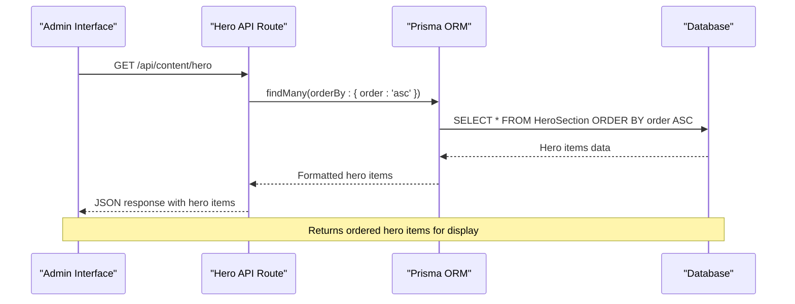
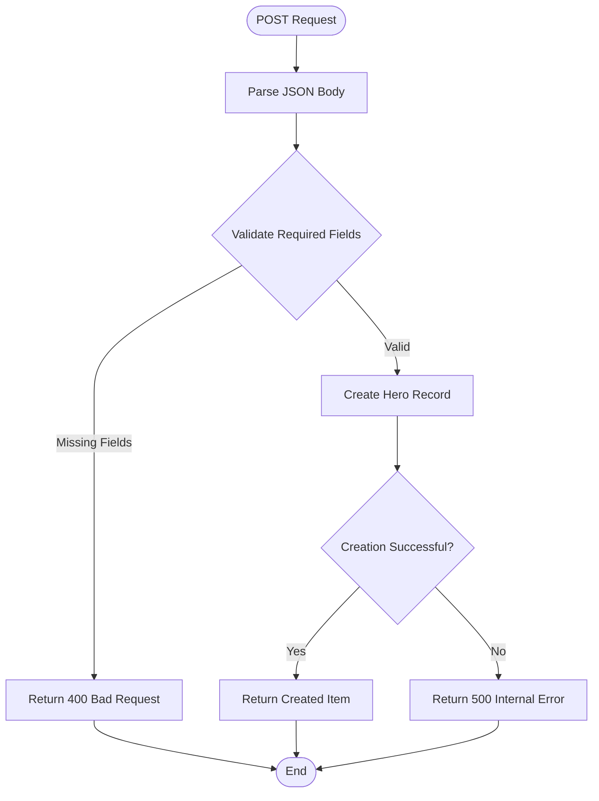
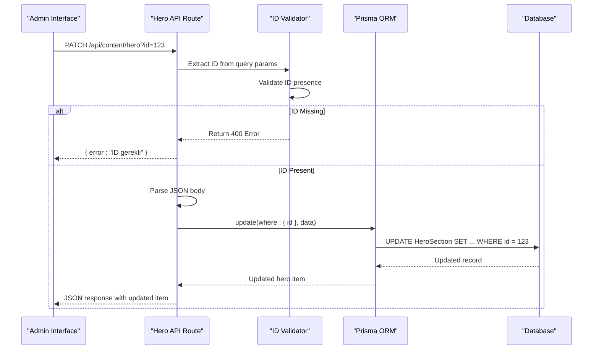
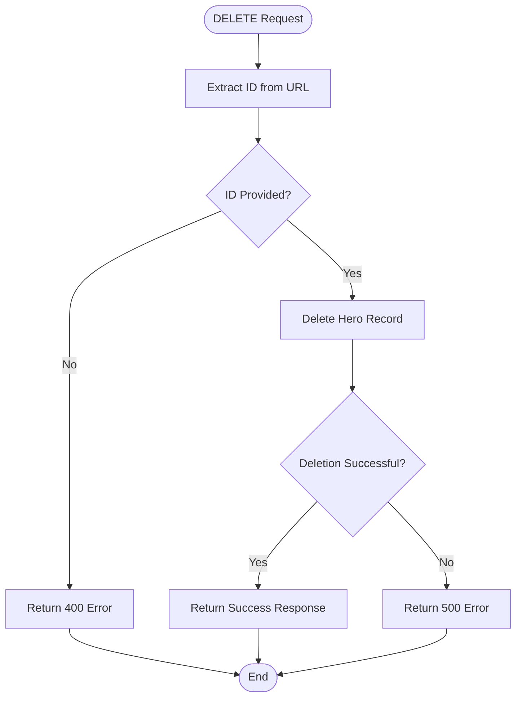
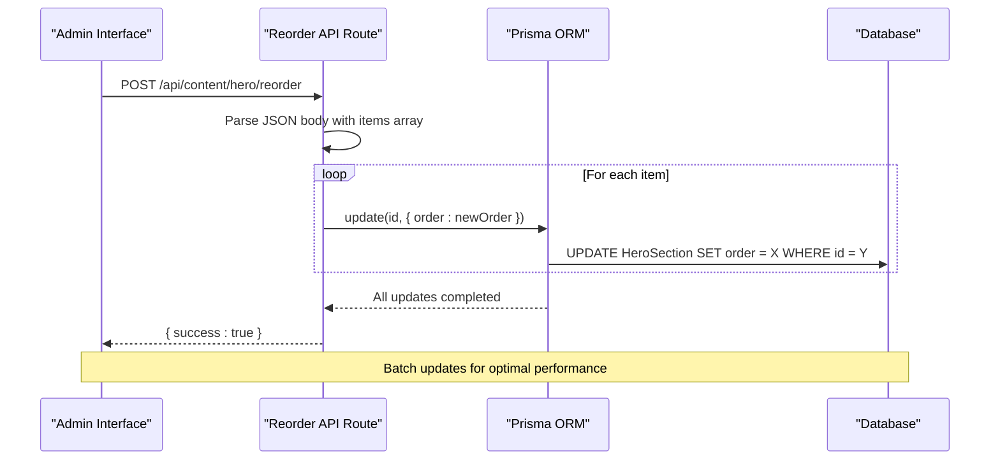
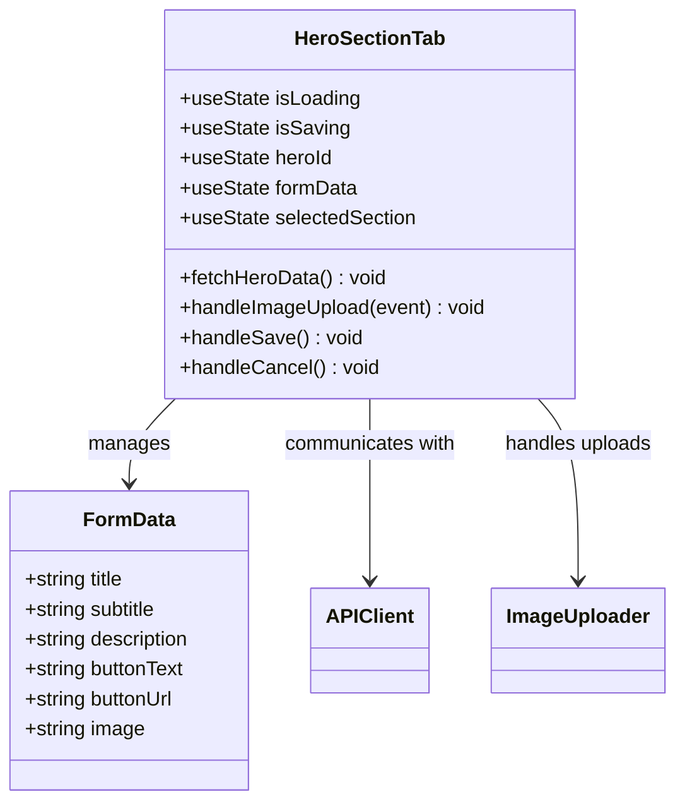
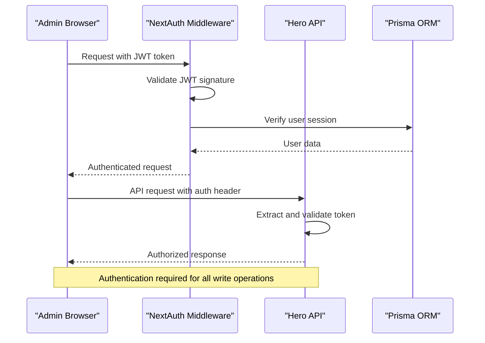

# Hero Section CRUD API Documentation

<cite>
**Referenced Files in This Document**
- [src/app/api/content/hero/route.ts](file://src/app/api/content/hero/route.ts)
- [src/app/api/content/hero/reorder/route.ts](file://src/app/api/content/hero/reorder/route.ts)
- [src/components/admin/content-tabs/hero-section-tab.tsx](file://src/components/admin/content-tabs/hero-section-tab.tsx)
- [src/app/admin/content/page.tsx](file://src/app/admin/content/page.tsx)
- [src/lib/prisma.ts](file://src/lib/prisma.ts)
- [prisma/migrations/20251101125707_init/migration.sql](file://prisma/migrations/20251101125707_init/migration.sql)
- [src/lib/auth.ts](file://src/lib/auth.ts)
</cite>

## Table of Contents
1. [Introduction](#introduction)
2. [API Endpoint Overview](#api-endpoint-overview)
3. [HTTP Methods Implementation](#http-methods-implementation)
4. [Data Model](#data-model)
5. [Frontend Integration](#frontend-integration)
6. [Error Handling](#error-handling)
7. [Authentication Requirements](#authentication-requirements)
8. [Request/Response Examples](#requestresponse-examples)
9. [Best Practices](#best-practices)
10. [Troubleshooting Guide](#troubleshooting-guide)

## Introduction

The Hero Section CRUD API provides comprehensive management capabilities for the homepage hero section content in the SMMM System. This API enables administrators to create, read, update, and delete hero content blocks while maintaining proper ordering and validation. The API is built using Next.js API routes with Prisma ORM for database operations and integrates with a React-based admin interface.

The hero section serves as the primary visual element on the homepage, featuring:
- Title and subtitle text
- Description text
- Call-to-action buttons with customizable links
- Background images
- Ordering system for multiple hero blocks
- Active/inactive status controls

## API Endpoint Overview

The Hero Section API consists of four main endpoints located at `/api/content/hero`:

| Method | Endpoint | Purpose | Authentication |
|--------|----------|---------|----------------|
| GET | `/api/content/hero` | Retrieve all hero items sorted by sequence order | Optional |
| POST | `/api/content/hero` | Create new hero content block | Required |
| PATCH | `/api/content/hero?id={id}` | Update existing hero item by ID | Required |
| DELETE | `/api/content/hero?id={id}` | Delete hero item by ID | Required |

Additionally, there's a specialized reorder endpoint:
| Method | Endpoint | Purpose | Authentication |
|--------|----------|---------|----------------|
| POST | `/api/content/hero/reorder` | Reorder multiple hero items | Required |

## HTTP Methods Implementation

### GET Request - Retrieve Hero Items

The GET endpoint retrieves all hero section items sorted by their sequence order, ensuring proper display on the homepage.



**Diagram sources**
- [src/app/api/content/hero/route.ts](file://src/app/api/content/hero/route.ts#L3-L12)

**Implementation Details:**
- Uses Prisma's `findMany()` with `orderBy` clause
- Results automatically sorted by the `order` field in ascending order
- Handles database connection errors gracefully
- Returns empty array if no hero items exist

**Section sources**
- [src/app/api/content/hero/route.ts](file://src/app/api/content/hero/route.ts#L3-L12)

### POST Request - Create New Hero Item

The POST endpoint creates new hero content blocks with comprehensive field support.



**Diagram sources**
- [src/app/api/content/hero/route.ts](file://src/app/api/content/hero/route.ts#L14-L28)

**Required Fields:**
- `title`: String (required)
- `subtitle`: Text (required)
- `isActive`: Boolean (default: true)
- `order`: Integer (default: 0)

**Optional Fields:**
- `description`: Text
- `buttonText`: String
- `buttonUrl`: String
- `image`: LongText (Base64 encoded image)

**Section sources**
- [src/app/api/content/hero/route.ts](file://src/app/api/content/hero/route.ts#L14-L28)

### PATCH Request - Update Existing Hero Item

The PATCH endpoint enables partial updates to existing hero items using the ID query parameter.



**Diagram sources**
- [src/app/api/content/hero/route.ts](file://src/app/api/content/hero/route.ts#L30-L56)

**Validation Logic:**
- Extracts ID from URL query parameters
- Validates ID presence before proceeding
- Supports partial updates (only provided fields are updated)
- Maintains existing values for unspecified fields

**Section sources**
- [src/app/api/content/hero/route.ts](file://src/app/api/content/hero/route.ts#L30-L56)

### DELETE Request - Remove Hero Item

The DELETE endpoint handles removal of hero items with proper ID validation.



**Diagram sources**
- [src/app/api/content/hero/route.ts](file://src/app/api/content/hero/route.ts#L58-L86)

**Soft vs Hard Delete:**
- Currently implements hard delete (permanently removes record)
- Future enhancements could include soft delete with `isActive` flag
- No cascade deletion effects documented in schema

**Section sources**
- [src/app/api/content/hero/route.ts](file://src/app/api/content/hero/route.ts#L58-L86)

### POST Request - Reorder Hero Items

The reorder endpoint manages bulk updates to hero item ordering.



**Diagram sources**
- [src/app/api/content/hero/reorder/route.ts](file://src/app/api/content/hero/reorder/route.ts#L3-L25)

**Payload Structure:**
```typescript
{
  items: [
    { id: "hero-item-id-1", order: 0 },
    { id: "hero-item-id-2", order: 1 },
    { id: "hero-item-id-3", order: 2 }
  ]
}
```

**Section sources**
- [src/app/api/content/hero/reorder/route.ts](file://src/app/api/content/hero/reorder/route.ts#L3-L25)

## Data Model

The HeroSection table schema defines the structure for hero content management:

| Field | Type | Constraints | Default | Description |
|-------|------|-------------|---------|-------------|
| `id` | String | Primary Key | Auto-generated | Unique identifier |
| `title` | String | Not Null | - | Main headline text |
| `subtitle` | Text | Not Null | - | Supporting text |
| `description` | Text | Nullable | null | Extended description |
| `buttonText` | String | Nullable | null | CTA button text |
| `buttonUrl` | String | Nullable | null | Link destination |
| `image` | LongText | Nullable | null | Base64 encoded image |
| `isActive` | Boolean | Not Null | true | Visibility toggle |
| `order` | Integer | Not Null | 0 | Display sequence |
| `createdAt` | DateTime | Auto-set | Current time | Creation timestamp |
| `updatedAt` | DateTime | Auto-updated | Current time | Last modification |

**Section sources**
- [prisma/migrations/20251101125707_init/migration.sql](file://prisma/migrations/20251101125707_init/migration.sql#L105-L117)

## Frontend Integration

### Admin Hero Section Tab Component

The Hero Section Tab component serves as the primary interface for managing hero content through the API.



**Diagram sources**
- [src/components/admin/content-tabs/hero-section-tab.tsx](file://src/components/admin/content-tabs/hero-section-tab.tsx#L29-L72)

**Key Features:**
- Real-time form validation
- Image upload with size/type restrictions
- Dynamic button URL selection from predefined sections
- Custom URL support for external links
- Loading states and error handling
- Automatic form population from API data

**Section sources**
- [src/components/admin/content-tabs/hero-section-tab.tsx](file://src/components/admin/content-tabs/hero-section-tab.tsx#L29-L291)

### API Invocation Patterns

The frontend demonstrates several API consumption patterns:

**Fetch API Pattern:**
```typescript
// Basic GET request
const response = await fetch('/api/content/hero')
const heroData = await response.json()

// POST request with JSON payload
const response = await fetch('/api/content/hero', {
  method: 'POST',
  headers: { 'Content-Type': 'application/json' },
  body: JSON.stringify(payload)
})
```

**Axios Pattern (alternative):**
```typescript
import axios from 'axios'

// GET request
const { data } = await axios.get('/api/content/hero')

// POST request
const { data } = await axios.post('/api/content/hero', payload)
```

**Section sources**
- [src/components/admin/content-tabs/hero-section-tab.tsx](file://src/components/admin/content-tabs/hero-section-tab.tsx#L85-L158)

## Error Handling

### Backend Error Responses

The API implements comprehensive error handling with appropriate HTTP status codes:

| Scenario | Status Code | Response Format | Example Message |
|----------|-------------|-----------------|-----------------|
| Missing ID Parameter | 400 | `{ error: "ID gerekli" }` | PATCH/DELETE requests |
| Database Connection Error | 500 | `{ error: "Hero bölümü alınamadı" }` | GET/POST/PATCH/DELETE |
| Validation Failure | 500 | `{ error: "Hero eklenemedi" }` | POST/PUT validation |
| Record Not Found | 500 | `{ error: "Hero silinemedi" }` | DELETE operations |

### Frontend Error Handling

The frontend implements robust error handling patterns:

```typescript
// Error handling in save operation
const handleSave = async () => {
  try {
    const response = await fetch(url, { method, headers, body })
    if (!response.ok) {
      const error = await response.json()
      toast.error(error.error || 'Kaydetme sırasında bir hata oluştu')
      return
    }
    // Success handling...
  } catch (error) {
    console.error('Error saving hero:', error)
    toast.error('Kaydetme sırasında bir hata oluştu')
  }
}
```

**Section sources**
- [src/app/api/content/hero/route.ts](file://src/app/api/content/hero/route.ts#L8-L12)
- [src/app/api/content/hero/route.ts](file://src/app/api/content/hero/route.ts#L19-L25)
- [src/app/api/content/hero/route.ts](file://src/app/api/content/hero/route.ts#L35-L41)
- [src/app/api/content/hero/route.ts](file://src/app/api/content/hero/route.ts#L65-L71)

## Authentication Requirements

### Authentication Setup

The API requires authentication for all write operations (POST, PATCH, DELETE) and the reorder endpoint. Authentication is handled through NextAuth.js with JWT tokens.



**Diagram sources**
- [src/lib/auth.ts](file://src/lib/auth.ts#L25-L86)

### Role-Based Access Control

The system implements role-based access control through the user role field:

- **ADMIN**: Full access to all content management features
- **CLIENT**: Restricted access (not applicable for hero section)

**Authentication Flow:**
1. User logs in through the admin interface
2. JWT token stored in browser storage
3. Token included in API request headers
4. Backend validates token and extracts user role

**Section sources**
- [src/lib/auth.ts](file://src/lib/auth.ts#L25-L86)

## Request/Response Examples

### GET Request Examples

**Request:**
```http
GET /api/content/hero HTTP/1.1
Host: example.com
Accept: application/json
```

**Response:**
```json
[
  {
    "id": "hero-001",
    "title": "Profesyonel Mali Müşavirlik",
    "subtitle": "Güvenilir, deneyimli ve profesyonel ekibimizle yanınızdayız",
    "description": "Detaylı mali danışmanlık hizmetleri sunuyoruz...",
    "buttonText": "Hizmetlerimizi Keşfedin",
    "buttonUrl": "#services",
    "image": "data:image/jpeg;base64,/9j/4AAQSkZJRgABAQAAAQ...",
    "isActive": true,
    "order": 0,
    "createdAt": "2024-01-15T10:30:00.000Z",
    "updatedAt": "2024-01-15T10:30:00.000Z"
  }
]
```

### POST Request Examples

**Request:**
```http
POST /api/content/hero HTTP/1.1
Content-Type: application/json

{
  "title": "Yeni Başlangıç Projemiz",
  "subtitle": "Modern mali yönetim çözümleri",
  "description": "Yenilikçi finansal stratejilerle işinizi büyütün.",
  "buttonText": "Detayları Görüntüle",
  "buttonUrl": "#about",
  "image": "data:image/png;base64,iVBORw0KGgoAAAANS...",
  "isActive": true,
  "order": 1
}
```

**Response:**
```json
{
  "id": "hero-002",
  "title": "Yeni Başlangıç Projemiz",
  "subtitle": "Modern mali yönetim çözümleri",
  "description": "Yenilikçi finansal stratejilerle işinizi büyütün.",
  "buttonText": "Detayları Görüntüle",
  "buttonUrl": "#about",
  "image": "data:image/png;base64,iVBORw0KGgoAAAANS...",
  "isActive": true,
  "order": 1,
  "createdAt": "2024-01-15T11:00:00.000Z",
  "updatedAt": "2024-01-15T11:00:00.000Z"
}
```

### PATCH Request Examples

**Request:**
```http
PATCH /api/content/hero?id=hero-002 HTTP/1.1
Content-Type: application/json

{
  "title": "Güncellenmiş Başlık",
  "buttonText": "Yeni Buton Metni"
}
```

**Response:**
```json
{
  "id": "hero-002",
  "title": "Güncellenmiş Başlık",
  "subtitle": "Modern mali yönetim çözümleri",
  "description": "Yenilikçi finansal stratejilerle işinizi büyütün.",
  "buttonText": "Yeni Buton Metni",
  "buttonUrl": "#about",
  "image": "data:image/png;base64,iVBORw0KGgoAAAANS...",
  "isActive": true,
  "order": 1,
  "createdAt": "2024-01-15T11:00:00.000Z",
  "updatedAt": "2024-01-15T11:30:00.000Z"
}
```

### DELETE Request Examples

**Request:**
```http
DELETE /api/content/hero?id=hero-002 HTTP/1.1
```

**Response:**
```json
{
  "success": true
}
```

### Reorder Request Examples

**Request:**
```http
POST /api/content/hero/reorder HTTP/1.1
Content-Type: application/json

{
  "items": [
    { "id": "hero-001", "order": 0 },
    { "id": "hero-003", "order": 1 },
    { "id": "hero-002", "order": 2 }
  ]
}
```

**Response:**
```json
{
  "success": true
}
```

## Best Practices

### API Design Principles

1. **RESTful Conventions**: Follows REST principles with proper HTTP methods
2. **Consistent Error Handling**: Standardized error response format across all endpoints
3. **Query Parameter Usage**: Proper use of query parameters for filtering and identification
4. **Content Negotiation**: Supports JSON content type exclusively

### Security Considerations

1. **Authentication Required**: All write operations require authentication
2. **Input Validation**: Client-side validation complements server-side validation
3. **Rate Limiting**: Implemented at the framework level through NextAuth
4. **CSRF Protection**: Handled by NextAuth.js middleware

### Performance Optimization

1. **Batch Operations**: Reorder endpoint uses batch updates for efficiency
2. **Indexing**: Database queries utilize appropriate indexes
3. **Connection Pooling**: Prisma manages database connections efficiently
4. **Caching**: Frontend implements caching for GET requests

### Data Integrity

1. **Atomic Operations**: Database transactions ensure data consistency
2. **Validation**: Comprehensive validation prevents invalid data
3. **Audit Trail**: Automatic timestamp tracking for modifications
4. **Soft Delete Pattern**: Planning for future soft delete implementation

## Troubleshooting Guide

### Common Issues and Solutions

#### 1. Authentication Failures

**Symptoms:**
- 401 Unauthorized responses
- "Invalid credentials" errors

**Solutions:**
- Verify user is logged in through admin interface
- Check JWT token validity and expiration
- Ensure authentication middleware is properly configured

#### 2. Missing ID Parameter

**Symptoms:**
- 400 Bad Request with "ID gerekli" message
- PATCH/DELETE operations failing

**Solutions:**
- Verify ID parameter is included in URL query string
- Check URL encoding for special characters
- Ensure proper parameter naming (`id` not `ID` or `heroId`)

#### 3. Database Connection Issues

**Symptoms:**
- 500 Internal Server Error
- "Hero bölümü alınamadı" messages
- Timeout errors

**Solutions:**
- Verify database connectivity
- Check Prisma client initialization
- Review database migration status
- Monitor database server health

#### 4. Image Upload Problems

**Symptoms:**
- Image upload fails silently
- Large file size errors
- Invalid file type errors

**Solutions:**
- Verify file size limit (2MB max)
- Check file type restrictions (image/*)
- Ensure proper Base64 encoding
- Validate image dimensions

#### 5. Ordering Issues

**Symptoms:**
- Items not displaying in correct order
- Reorder operations not persisting

**Solutions:**
- Verify all items have unique order values
- Check for concurrent modification conflicts
- Ensure proper batch update completion
- Review database constraint violations

### Debugging Tools

1. **Browser Developer Tools**: Network tab for API requests
2. **Console Logging**: Server-side error logging
3. **Database Queries**: Prisma debug mode for SQL inspection
4. **Authentication Tokens**: JWT decoder for token validation

### Monitoring and Maintenance

1. **API Health Checks**: Regular endpoint testing
2. **Error Rate Monitoring**: Track 4xx and 5xx responses
3. **Performance Metrics**: Response time monitoring
4. **Database Health**: Index usage and query optimization

**Section sources**
- [src/app/api/content/hero/route.ts](file://src/app/api/content/hero/route.ts#L8-L12)
- [src/app/api/content/hero/route.ts](file://src/app/api/content/hero/route.ts#L19-L25)
- [src/app/api/content/hero/route.ts](file://src/app/api/content/hero/route.ts#L35-L41)
- [src/app/api/content/hero/route.ts](file://src/app/api/content/hero/route.ts#L65-L71)