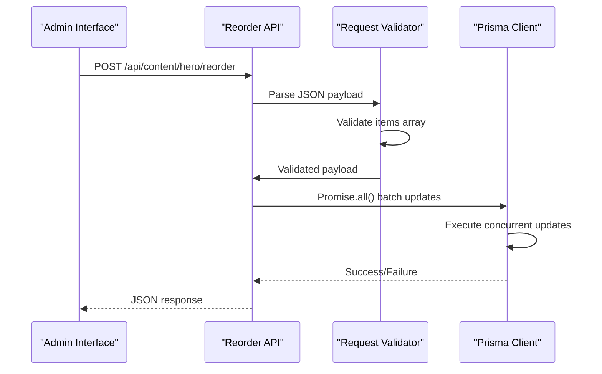
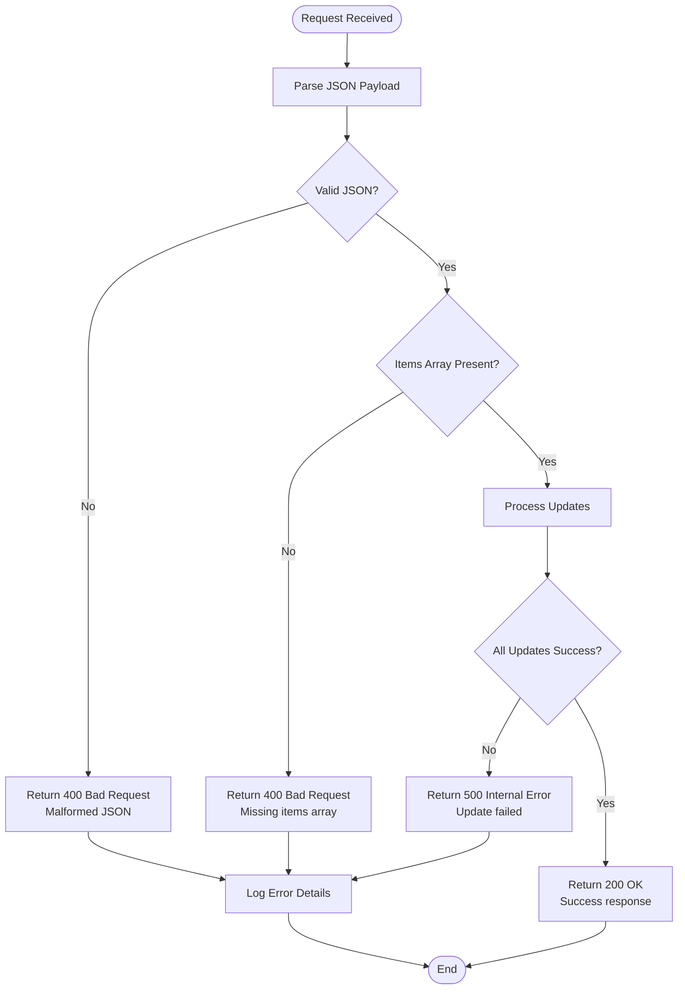
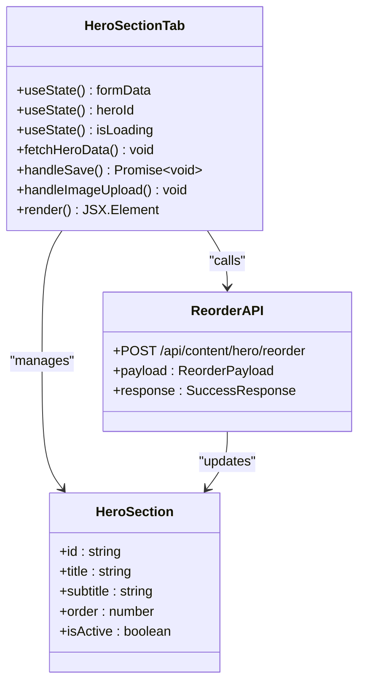

# Hero Section Reorder API

<cite>
**Referenced Files in This Document**
- [src/app/api/content/hero/reorder/route.ts](file://src/app/api/content/hero/reorder/route.ts)
- [src/app/api/content/hero/route.ts](file://src/app/api/content/hero/route.ts)
- [src/components/admin/content-tabs/hero-section-tab.tsx](file://src/components/admin/content-tabs/hero-section-tab.tsx)
- [src/lib/prisma.ts](file://src/lib/prisma.ts)
- [prisma/migrations/20251101125707_init/migration.sql](file://prisma/migrations/20251101125707_init/migration.sql)
</cite>

## Table of Contents
1. [Introduction](#introduction)
2. [Endpoint Overview](#endpoint-overview)
3. [Request Structure](#request-structure)
4. [Server Implementation](#server-implementation)
5. [Performance Analysis](#performance-analysis)
6. [Error Handling](#error-handling)
7. [Frontend Integration](#frontend-integration)
8. [Usage Examples](#usage-examples)
9. [Best Practices](#best-practices)
10. [Troubleshooting](#troubleshooting)

## Introduction

The Hero Section Reorder API provides a drag-and-drop interface for reordering hero content blocks in the SMMM System administration panel. This endpoint enables administrators to rearrange hero items by updating their sequence numbers atomically through a single POST request.

The API is designed to handle concurrent reordering operations safely while maintaining data consistency through atomic database updates. It works in conjunction with the Admin Hero Section Tab component to provide a seamless user experience for managing homepage hero content.

## Endpoint Overview

### Base URL
```
POST /api/content/hero/reorder
```

### Purpose
Updates the order sequence of hero content blocks in bulk using atomic database operations.

### Authentication
Requires administrative privileges for access to the endpoint.

### Content Type
Accepts `application/json` requests with structured payload data.

## Request Structure

### Payload Format

The request must contain an array of objects, each representing a hero item with its new order position:

```typescript
interface ReorderPayload {
  items: Array<{
    id: string;
    order: number;
  }>;
}
```

### Request Body Schema

| Parameter | Type | Required | Description |
|-----------|------|----------|-------------|
| `items` | Array | Yes | Array of hero item objects |
| `items[].id` | String | Yes | Unique identifier of the hero item |
| `items[].order` | Number | Yes | New sequence position (zero-based index) |

### Sample Request Payload

```json
{
  "items": [
    {
      "id": "hero-item-1",
      "order": 0
    },
    {
      "id": "hero-item-2", 
      "order": 1
    },
    {
      "id": "hero-item-3",
      "order": 2
    }
  ]
}
```

### Example: Reordering with Different Positions

```json
{
  "items": [
    {
      "id": "hero-item-1",
      "order": 2
    },
    {
      "id": "hero-item-2",
      "order": 0
    },
    {
      "id": "hero-item-3",
      "order": 1
    }
  ]
}
```

## Server Implementation

### Core Implementation Details

The server-side implementation utilizes `Promise.all()` to execute all database updates concurrently while ensuring atomicity through transaction-like behavior.



**Diagram sources**
- [src/app/api/content/hero/reorder/route.ts](file://src/app/api/content/hero/reorder/route.ts#L5-L20)

### Atomic Update Process

The implementation follows these steps:

1. **Payload Validation**: Extracts and validates the `items` array from the request
2. **Concurrent Updates**: Uses `Promise.all()` to execute all database updates simultaneously
3. **Individual Item Updates**: For each item, performs a Prisma `update` operation with specific `where` and `data` criteria
4. **Response Generation**: Returns success status upon completion

### Database Schema Integration

The hero section table includes an `order` column that tracks the display sequence:

```sql
CREATE TABLE `HeroSection` (
    `id` VARCHAR(191) NOT NULL,
    `title` VARCHAR(191) NOT NULL,
    `subtitle` TEXT NOT NULL,
    `description` TEXT NULL,
    `buttonText` VARCHAR(191) NULL,
    `buttonUrl` VARCHAR(191) NULL,
    `image` LONGTEXT NULL,
    `isActive` BOOLEAN NOT NULL DEFAULT true,
    `order` INTEGER NOT NULL DEFAULT 0,
    `createdAt` DATETIME(3) NOT NULL DEFAULT CURRENT_TIMESTAMP(3),
    `updatedAt` DATETIME(3) NOT NULL,
    PRIMARY KEY (`id`)
) DEFAULT CHARACTER SET utf8mb4 COLLATE utf8mb4_unicode_ci;
```

**Section sources**
- [src/app/api/content/hero/reorder/route.ts](file://src/app/api/content/hero/reorder/route.ts#L1-L26)
- [prisma/migrations/20251101125707_init/migration.sql](file://prisma/migrations/20251101125707_init/migration.sql#L118-L130)

## Performance Analysis

### Concurrent Execution Benefits

The use of `Promise.all()` provides several performance advantages:

- **Parallel Processing**: All updates execute simultaneously rather than sequentially
- **Reduced Latency**: Eliminates the need for individual round-trips per item
- **Resource Efficiency**: Minimizes database connection overhead

### Performance Characteristics

| Operation | Complexity | Notes |
|-----------|------------|-------|
| Individual Update | O(1) | Single database operation per item |
| Batch Processing | O(n) | Linear scaling with number of items |
| Total Execution | O(n) | Parallel execution reduces wall-clock time |

### Race Condition Mitigation

The current implementation handles potential race conditions through:

1. **Atomic Operations**: Each individual update is atomic
2. **Consistent Ordering**: All updates occur within the same request context
3. **Error Propagation**: Failure in any update stops the entire batch

### Scalability Considerations

- **Optimal Range**: Suitable for batches of 10-50 items
- **Large Batches**: May benefit from pagination for >100 items
- **Concurrency Limits**: Database connection pool limits apply

## Error Handling

### Request-Level Errors

The API handles various error scenarios gracefully:



**Diagram sources**
- [src/app/api/content/hero/reorder/route.ts](file://src/app/api/content/hero/reorder/route.ts#L5-L25)

### Error Response Formats

#### Malformed JSON
```json
{
  "error": "Invalid JSON payload"
}
```

#### Missing Items Array
```json
{
  "error": "Sıralama güncellenemedi"
}
```

#### Database Update Failures
```json
{
  "error": "Sıralama güncellenemedi"
}
```

### Error Categories

| Error Type | Status Code | Description |
|------------|-------------|-------------|
| Malformed JSON | 400 | Invalid request payload format |
| Missing Items | 400 | Missing required items array |
| Database Error | 500 | Internal database update failure |
| Validation Error | 400 | Invalid item properties |

**Section sources**
- [src/app/api/content/hero/reorder/route.ts](file://src/app/api/content/hero/reorder/route.ts#L18-L25)

## Frontend Integration

### Admin Hero Section Tab Integration

The reorder functionality integrates seamlessly with the Admin Hero Section Tab component:



**Diagram sources**
- [src/components/admin/content-tabs/hero-section-tab.tsx](file://src/components/admin/content-tabs/hero-section-tab.tsx#L26-L290)
- [src/app/api/content/hero/reorder/route.ts](file://src/app/api/content/hero/reorder/route.ts#L1-L26)

### State Synchronization

After successful reordering, the frontend maintains state consistency through:

1. **Immediate Feedback**: Visual indicators show reordering progress
2. **State Refresh**: Calls `fetchHeroData()` to reload current state
3. **UI Updates**: Re-render components with new order information

### Drag-and-Drop Integration

The frontend implementation supports drag-and-drop reordering through:

- **Event Handlers**: Capture drag start, drag over, and drop events
- **State Management**: Track item positions during drag operations
- **Batch Updates**: Send complete reordering payload on drop completion

**Section sources**
- [src/components/admin/content-tabs/hero-section-tab.tsx](file://src/components/admin/content-tabs/hero-section-tab.tsx#L110-L158)

## Usage Examples

### Basic Reordering Request

```javascript
// Example: Moving item from position 2 to position 0
const reorderData = {
  items: [
    { id: "hero-item-1", order: 2 },
    { id: "hero-item-2", order: 0 },
    { id: "hero-item-3", order: 1 }
  ]
};

fetch('/api/content/hero/reorder', {
  method: 'POST',
  headers: {
    'Content-Type': 'application/json'
  },
  body: JSON.stringify(reorderData)
})
.then(response => response.json())
.then(data => {
  if (data.success) {
    console.log('Reordering successful');
    // Refresh UI state
    fetchHeroData();
  }
});
```

### Error Handling Example

```javascript
async function reorderHeroItems(reorderedItems) {
  try {
    const response = await fetch('/api/content/hero/reorder', {
      method: 'POST',
      headers: {
        'Content-Type': 'application/json'
      },
      body: JSON.stringify({ items: reorderedItems })
    });

    if (!response.ok) {
      const errorData = await response.json();
      throw new Error(errorData.error || 'Reordering failed');
    }

    const result = await response.json();
    return result;
  } catch (error) {
    console.error('Reorder error:', error);
    // Show user-friendly error message
    showToast('Sıralama güncellenemedi', 'error');
    throw error;
  }
}
```

### Batch Reordering Example

```javascript
// Reorder multiple items simultaneously
const batchReorder = async (newOrderMap) => {
  const reorderItems = Object.entries(newOrderMap).map(([id, newOrder]) => ({
    id,
    order: newOrder
  }));

  try {
    const response = await fetch('/api/content/hero/reorder', {
      method: 'POST',
      headers: {
        'Content-Type': 'application/json'
      },
      body: JSON.stringify({ items: reorderItems })
    });

    if (response.ok) {
      // Update local state immediately
      updateLocalHeroState(reorderItems);
      showToast('Sıralama başarıyla güncellendi', 'success');
    }
  } catch (error) {
    showToast('Sıralama işlemi başarısız oldu', 'error');
  }
};
```

## Best Practices

### Client-Side Implementation

1. **Validation Before Submission**
   ```javascript
   const validateReorderPayload = (items) => {
     if (!Array.isArray(items) || items.length === 0) {
       throw new Error('Items array is required');
     }
     
     return items.every(item => 
       typeof item.id === 'string' && 
       typeof item.order === 'number'
     );
   };
   ```

2. **Progress Indication**
   - Show loading states during reorder operations
   - Provide visual feedback for drag-and-drop interactions
   - Implement optimistic updates for better user experience

3. **Error Recovery**
   - Implement retry mechanisms for transient failures
   - Provide undo functionality for accidental reordering
   - Maintain local state backup for recovery scenarios

### Server-Side Implementation

1. **Transaction Safety**
   ```typescript
   // While Promise.all() provides atomicity, consider explicit transactions
   // for more complex scenarios
   ```

2. **Rate Limiting**
   - Implement rate limiting to prevent abuse
   - Consider batching limits for large reordering operations

3. **Logging and Monitoring**
   - Log all reorder operations for audit trails
   - Monitor performance metrics for optimization

### Data Integrity

1. **Order Consistency**
   - Ensure no duplicate order values
   - Handle gaps in ordering automatically
   - Validate order ranges against item counts

2. **Backup Strategies**
   - Maintain history of reorder operations
   - Implement soft deletion for reordering rollback

## Troubleshooting

### Common Issues and Solutions

#### Issue: Reordering Not Persisting
**Symptoms**: Changes appear visually but revert after refresh
**Causes**: 
- Frontend state not updated after API call
- Database constraint violations
- Network timeout during update

**Solutions**:
1. Verify API response status
2. Call `fetchHeroData()` after successful reorder
3. Check browser console for network errors

#### Issue: Partial Reordering Failures
**Symptoms**: Some items not updated despite successful API response
**Causes**:
- Database constraint conflicts
- Race conditions with concurrent updates
- Invalid order values

**Solutions**:
1. Implement retry logic with exponential backoff
2. Validate order values before submission
3. Use database transactions for critical operations

#### Issue: Performance Degradation with Large Batches
**Symptoms**: Slow response times for reordering many items
**Causes**:
- Too many simultaneous database connections
- Large payload size affecting network performance

**Solutions**:
1. Implement pagination for large reordering operations
2. Limit batch sizes to 50 items maximum
3. Use background processing for very large batches

### Debugging Steps

1. **Check API Response**: Verify successful 200 status
2. **Inspect Database**: Confirm order values updated correctly
3. **Validate Payload**: Ensure proper JSON structure
4. **Monitor Logs**: Check server logs for error details

### Monitoring and Alerting

Implement monitoring for:
- API response times
- Error rates for reorder operations
- Database connection pool utilization
- Concurrent reorder operation conflicts

**Section sources**
- [src/app/api/content/hero/reorder/route.ts](file://src/app/api/content/hero/reorder/route.ts#L18-L25)