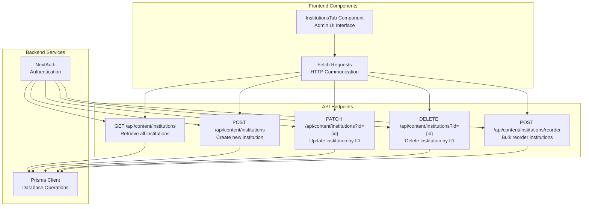
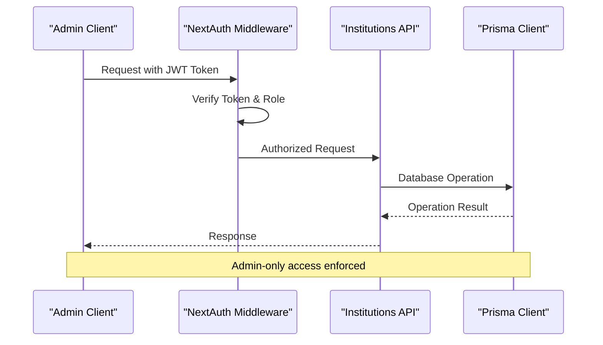
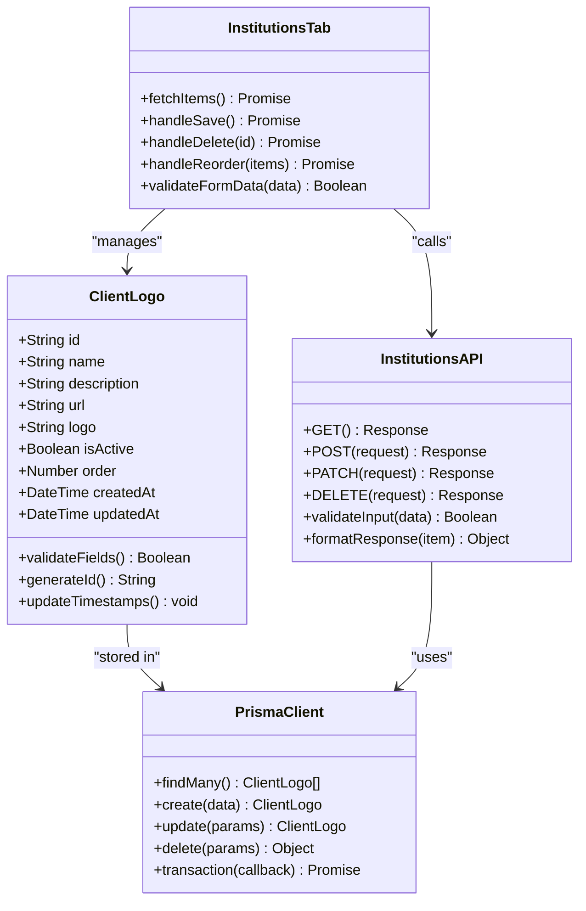
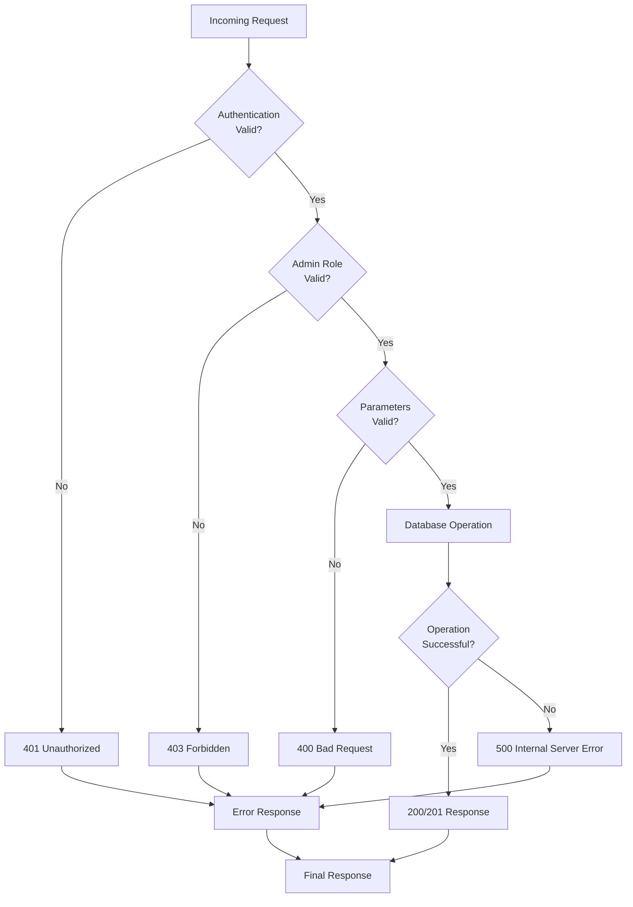
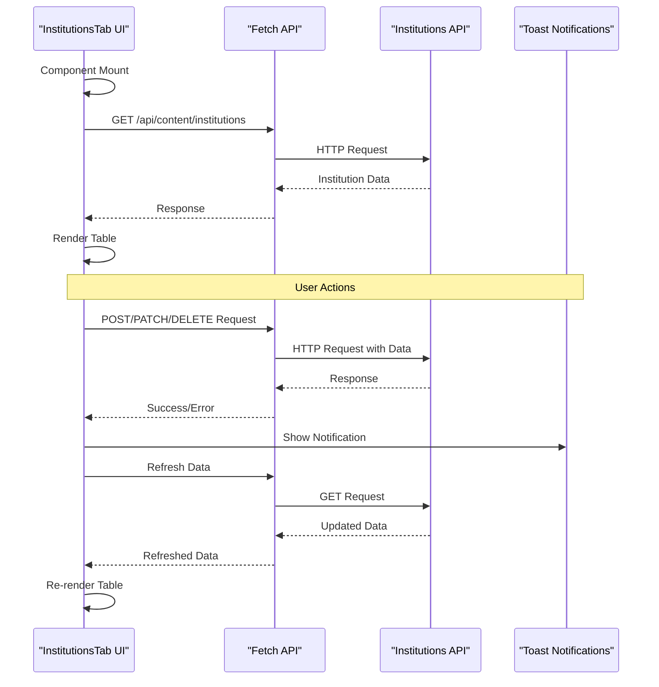

# Institutions CRUD API Documentation

<cite>
**Referenced Files in This Document**
- [src/app/api/content/institutions/route.ts](file://src/app/api/content/institutions/route.ts)
- [src/app/api/content/institutions/reorder/route.ts](file://src/app/api/content/institutions/reorder/route.ts)
- [src/components/admin/content-tabs/institutions-tab.tsx](file://src/components/admin/content-tabs/institutions-tab.tsx)
- [src/lib/prisma.ts](file://src/lib/prisma.ts)
- [prisma/schema.prisma](file://prisma/schema.prisma)
- [src/lib/auth.ts](file://src/lib/auth.ts)
</cite>

## Table of Contents
1. [Introduction](#introduction)
2. [API Endpoint Overview](#api-endpoint-overview)
3. [Authentication & Authorization](#authentication--authorization)
4. [HTTP Methods & Operations](#http-methods--operations)
5. [Request/Response Schemas](#requestresponse-schemas)
6. [Error Handling](#error-handling)
7. [Frontend Integration](#frontend-integration)
8. [Code Examples](#code-examples)
9. [Best Practices](#best-practices)

## Introduction

The Institutions CRUD API provides comprehensive management capabilities for client logos and institutional partners within the SMMM System. This API handles the creation, retrieval, updating, and deletion of institutional data, including logo management, ordering, and status control. The endpoint follows RESTful principles and integrates with NextAuth for authentication while maintaining strict admin-only access controls.

## API Endpoint Overview

The primary API endpoint for institutions management is located at `/api/content/institutions`. This endpoint supports four main HTTP methods for complete CRUD operations:

- **GET** - Retrieve all institutions ordered by sequence
- **POST** - Create new institution entries
- **PATCH** - Update existing institutions by ID
- **DELETE** - Remove institutions by ID

Additionally, there's a specialized reorder endpoint at `/api/content/institutions/reorder` for bulk ordering operations.



**Diagram sources**
- [src/app/api/content/institutions/route.ts](file://src/app/api/content/institutions/route.ts#L1-L88)
- [src/app/api/content/institutions/reorder/route.ts](file://src/app/api/content/institutions/reorder/route.ts#L1-L26)
- [src/components/admin/content-tabs/institutions-tab.tsx](file://src/components/admin/content-tabs/institutions-tab.tsx#L1-L681)

## Authentication & Authorization

The Institutions API requires administrative privileges for all operations. Authentication is handled through NextAuth, which provides JWT-based authentication with role-based access control.

### Authentication Requirements

All requests must include the appropriate authentication headers:

```typescript
// Required headers for authenticated requests
headers: {
  'Authorization': `Bearer ${token}`,
  'Content-Type': 'application/json'
}
```

### Role-Based Access Control

The system implements strict admin-only access for institutions management:

- **Required Role**: `ADMIN`
- **Access Level**: Full CRUD permissions
- **Implementation**: Verified through NextAuth JWT tokens



**Diagram sources**
- [src/lib/auth.ts](file://src/lib/auth.ts#L49-L85)
- [src/app/api/content/institutions/route.ts](file://src/app/api/content/institutions/route.ts#L1-L88)

**Section sources**
- [src/lib/auth.ts](file://src/lib/auth.ts#L49-L85)
- [src/app/api/content/institutions/route.ts](file://src/app/api/content/institutions/route.ts#L1-L88)

## HTTP Methods & Operations

### GET - Retrieve Institution List

Retrieves all institutional entries ordered by their display sequence.

**Endpoint**: `GET /api/content/institutions`

**Query Parameters**: None

**Response**: Array of institution objects sorted by `order` field in ascending order

**Success Response**: `200 OK`
```json
[
  {
    "id": "clg1",
    "name": "ABC Corporation",
    "description": "Leading financial services provider",
    "url": "https://abc.com",
    "logo": "data:image/png;base64,iVBORw0KGgoAAAANS...",
    "isActive": true,
    "order": 0
  },
  {
    "id": "clg2",
    "name": "XYZ University",
    "description": "Renowned educational institution",
    "url": "https://xyz.edu",
    "logo": "data:image/png;base64,iVBORw0KGgoAAAANS...",
    "isActive": true,
    "order": 1
  }
]
```

### POST - Create New Institution

Creates a new institutional entry with the provided data.

**Endpoint**: `POST /api/content/institutions`

**Request Headers**: `Content-Type: application/json`

**Request Body**: Complete institution object without ID and timestamps

**Success Response**: `201 Created`
```json
{
  "id": "clg3",
  "name": "DEF Company",
  "description": "Technology solutions provider",
  "url": "https://def.com",
  "logo": "data:image/png;base64,iVBORw0KGgoAAAANS...",
  "isActive": true,
  "order": 2
}
```

### PATCH - Update Existing Institution

Updates an existing institutional entry identified by ID.

**Endpoint**: `PATCH /api/content/institutions?id={id}`

**Query Parameters**:
- `id` (required): Unique identifier of the institution to update

**Request Headers**: `Content-Type: application/json`

**Request Body**: Partial institution object with fields to update

**Success Response**: `200 OK`
```json
{
  "id": "clg1",
  "name": "Updated ABC Corporation",
  "description": "Enhanced financial services provider",
  "url": "https://abc.com",
  "logo": "data:image/png;base64,iVBORw0KGgoAAAANS...",
  "isActive": false,
  "order": 0
}
```

### DELETE - Remove Institution

Deletes an institutional entry identified by ID.

**Endpoint**: `DELETE /api/content/institutions?id={id}`

**Query Parameters**:
- `id` (required): Unique identifier of the institution to delete

**Success Response**: `200 OK`
```json
{
  "success": true
}
```

### REORDER - Bulk Reorder Institutions

Updates the order of multiple institutions in a single operation.

**Endpoint**: `POST /api/content/institutions/reorder`

**Request Headers**: `Content-Type: application/json`

**Request Body**:
```json
{
  "items": [
    {
      "id": "clg1",
      "order": 1
    },
    {
      "id": "clg2",
      "order": 0
    },
    {
      "id": "clg3",
      "order": 2
    }
  ]
}
```

**Success Response**: `200 OK`
```json
{
  "success": true
}
```

**Section sources**
- [src/app/api/content/institutions/route.ts](file://src/app/api/content/institutions/route.ts#L1-L88)
- [src/app/api/content/institutions/reorder/route.ts](file://src/app/api/content/institutions/reorder/route.ts#L1-L26)

## Request/Response Schemas

### Institution Model Schema

The clientLogo model defines the structure for institutional data:

| Field | Type | Required | Description |
|-------|------|----------|-------------|
| `id` | String | Auto-generated | Unique identifier (UUID format) |
| `name` | String | Yes | Institutional name |
| `description` | String | No | Brief description (max 65535 chars) |
| `url` | String | No | Institutional website URL |
| `logo` | String | Yes | Base64-encoded image data |
| `isActive` | Boolean | Yes | Visibility status |
| `order` | Number | Yes | Display sequence order |
| `createdAt` | DateTime | Auto-generated | Creation timestamp |
| `updatedAt` | DateTime | Auto-updated | Last modification timestamp |

### Request Validation

Each endpoint implements specific validation requirements:

#### GET Request
- No request body
- No query parameters
- Returns ordered array

#### POST Request
- Validates presence of `name` and `logo` fields
- Ensures valid Base64 image format
- Assigns default values for optional fields

#### PATCH Request
- Requires `id` query parameter
- Validates `id` existence in database
- Allows partial updates of any fields

#### DELETE Request
- Requires `id` query parameter
- Validates `id` existence
- Performs soft or hard deletion based on Prisma configuration

#### REORDER Request
- Validates array of items with `id` and `order` fields
- Ensures all referenced IDs exist
- Updates multiple records atomically



**Diagram sources**
- [prisma/schema.prisma](file://prisma/schema.prisma#L203-L213)
- [src/app/api/content/institutions/route.ts](file://src/app/api/content/institutions/route.ts#L1-L88)
- [src/components/admin/content-tabs/institutions-tab.tsx](file://src/components/admin/content-tabs/institutions-tab.tsx#L25-L35)

**Section sources**
- [prisma/schema.prisma](file://prisma/schema.prisma#L203-L213)
- [src/app/api/content/institutions/route.ts](file://src/app/api/content/institutions/route.ts#L1-L88)

## Error Handling

The API implements comprehensive error handling with specific status codes and localized error messages in Turkish.

### Error Response Format

All error responses follow the same structure:
```json
{
  "error": "Localized error message in Turkish"
}
```

### HTTP Status Codes

| Status Code | Description | Common Scenarios |
|-------------|-------------|------------------|
| `200` | Success | Successful GET, PATCH, DELETE operations |
| `201` | Created | Successful POST operations |
| `400` | Bad Request | Missing ID parameter, invalid data format |
| `401` | Unauthorized | Missing or invalid authentication token |
| `403` | Forbidden | Non-admin user attempting admin operations |
| `500` | Internal Server Error | Database errors, system failures |

### Specific Error Conditions

#### Missing ID Parameter
**Condition**: PATCH or DELETE operations without `id` query parameter
**Response**: `400 Bad Request`
```json
{
  "error": "ID gerekli"
}
```

#### Database Operation Failures
**Conditions**: 
- Invalid ID during update/delete
- Database connection issues
- Constraint violations

**Response**: `500 Internal Server Error`
```json
{
  "error": "Kurum güncellenemedi"
}
```

#### Validation Errors
**Conditions**:
- Missing required fields in POST/PATCH
- Invalid Base64 image data
- Malformed URLs

**Response**: `400 Bad Request`
```json
{
  "error": "Kurum eklenemedi"
}
```

### Error Handling Flow



**Diagram sources**
- [src/app/api/content/institutions/route.ts](file://src/app/api/content/institutions/route.ts#L15-L88)

**Section sources**
- [src/app/api/content/institutions/route.ts](file://src/app/api/content/institutions/route.ts#L15-L88)

## Frontend Integration

The Institutions API integrates seamlessly with the Admin Institutions Tab component, providing a comprehensive management interface for institutional data.

### Admin Institutions Tab Component

The frontend component manages all CRUD operations through fetch requests, providing real-time updates and user-friendly interfaces.

#### Key Features

- **Real-time Data Loading**: Automatic fetching of institutional data on component mount
- **Form Validation**: Client-side validation before API submission
- **Image Upload**: Drag-and-drop image upload with preview functionality
- **Pagination & Filtering**: Advanced filtering by name, description, and status
- **Drag-and-Drop Reordering**: Visual reordering with immediate API updates
- **Toast Notifications**: User feedback for successful operations and errors

#### Data Flow Architecture



**Diagram sources**
- [src/components/admin/content-tabs/institutions-tab.tsx](file://src/components/admin/content-tabs/institutions-tab.tsx#L81-L112)
- [src/app/api/content/institutions/route.ts](file://src/app/api/content/institutions/route.ts#L1-L88)

### Image Upload & Validation

The frontend implements comprehensive image handling:

#### Supported Formats
- PNG, JPEG, GIF, SVG
- Maximum file size: 2MB
- Base64 encoding for storage

#### Validation Logic
```typescript
// Frontend validation example
const handleLogoUpload = (event: React.ChangeEvent<HTMLInputElement>) => {
  const file = event.target.files?.[0];
  
  // Format validation
  if (!file.type.startsWith('image/')) {
    toast.error('Lütfen geçerli bir resim dosyası seçin');
    return;
  }
  
  // Size validation
  if (file.size > 2 * 1024 * 1024) {
    toast.error('Resim boyutu en fazla 2MB olabilir');
    return;
  }
  
  // Convert to Base64
  const reader = new FileReader();
  reader.onloadend = () => {
    setFormData(prev => ({ ...prev, logo: reader.result as string }));
  };
  reader.readAsDataURL(file);
};
```

### Form Management

The component maintains state for both editing and creating operations:

#### Form States
- **Create Mode**: New institution form with default values
- **Edit Mode**: Existing institution form with pre-filled data
- **Validation State**: Real-time form validation feedback

#### Data Binding
```typescript
// Form data management
const [formData, setFormData] = useState<Partial<ClientLogo>>({
  name: "",
  description: "",
  url: "",
  logo: "",
  isActive: true,
  order: 0,
});
```

**Section sources**
- [src/components/admin/content-tabs/institutions-tab.tsx](file://src/components/admin/content-tabs/institutions-tab.tsx#L81-L681)

## Code Examples

### Basic CRUD Operations

#### Retrieving Institutions
```typescript
// GET request - Retrieve all institutions
async function fetchInstitutions(): Promise<ClientLogo[]> {
  try {
    const response = await fetch('/api/content/institutions');
    if (!response.ok) {
      throw new Error('Failed to fetch institutions');
    }
    return await response.json();
  } catch (error) {
    console.error('Error fetching institutions:', error);
    return [];
  }
}
```

#### Creating a New Institution
```typescript
// POST request - Create new institution
async function createInstitution(institutionData: Partial<ClientLogo>): Promise<ClientLogo> {
  const response = await fetch('/api/content/institutions', {
    method: 'POST',
    headers: {
      'Content-Type': 'application/json',
    },
    body: JSON.stringify(institutionData),
  });
  
  if (!response.ok) {
    throw new Error('Failed to create institution');
  }
  
  return await response.json();
}
```

#### Updating an Institution
```typescript
// PATCH request - Update existing institution
async function updateInstitution(id: string, updateData: Partial<ClientLogo>): Promise<ClientLogo> {
  const response = await fetch(`/api/content/institutions?id=${id}`, {
    method: 'PATCH',
    headers: {
      'Content-Type': 'application/json',
    },
    body: JSON.stringify(updateData),
  });
  
  if (!response.ok) {
    throw new Error('Failed to update institution');
  }
  
  return await response.json();
}
```

#### Deleting an Institution
```typescript
// DELETE request - Remove institution
async function deleteInstitution(id: string): Promise<boolean> {
  const response = await fetch(`/api/content/institutions?id=${id}`, {
    method: 'DELETE',
  });
  
  if (!response.ok) {
    throw new Error('Failed to delete institution');
  }
  
  const result = await response.json();
  return result.success === true;
}
```

### Advanced Operations

#### Bulk Reordering
```typescript
// POST request - Bulk reorder institutions
async function reorderInstitutions(items: { id: string; order: number }[]): Promise<boolean> {
  const response = await fetch('/api/content/institutions/reorder', {
    method: 'POST',
    headers: {
      'Content-Type': 'application/json',
    },
    body: JSON.stringify({ items }),
  });
  
  if (!response.ok) {
    throw new Error('Failed to reorder institutions');
  }
  
  const result = await response.json();
  return result.success === true;
}
```

#### Error Handling Pattern
```typescript
// Comprehensive error handling example
async function manageInstitution(operation: 'create' | 'update' | 'delete', data: any): Promise<any> {
  try {
    let response;
    
    switch (operation) {
      case 'create':
        response = await fetch('/api/content/institutions', {
          method: 'POST',
          headers: { 'Content-Type': 'application/json' },
          body: JSON.stringify(data),
        });
        break;
        
      case 'update':
        response = await fetch(`/api/content/institutions?id=${data.id}`, {
          method: 'PATCH',
          headers: { 'Content-Type': 'application/json' },
          body: JSON.stringify(data),
        });
        break;
        
      case 'delete':
        response = await fetch(`/api/content/institutions?id=${data.id}`, {
          method: 'DELETE',
        });
        break;
    }
    
    if (!response.ok) {
      const errorData = await response.json();
      throw new Error(errorData.error || 'Operation failed');
    }
    
    return await response.json();
    
  } catch (error) {
    console.error(`${operation} error:`, error);
    throw error;
  }
}
```

**Section sources**
- [src/app/api/content/institutions/route.ts](file://src/app/api/content/institutions/route.ts#L1-L88)
- [src/components/admin/content-tabs/institutions-tab.tsx](file://src/components/admin/content-tabs/institutions-tab.tsx#L200-L350)

## Best Practices

### Security Considerations

1. **Always Validate Authentication**: Ensure all requests include valid admin authentication
2. **Sanitize Input Data**: Validate all incoming data against the schema
3. **Use HTTPS Only**: All API communications should occur over secure connections
4. **Implement Rate Limiting**: Prevent abuse through request throttling

### Performance Optimization

1. **Batch Operations**: Use the reorder endpoint for multiple updates
2. **Efficient Queries**: The API automatically orders results by the `order` field
3. **Caching Strategies**: Implement client-side caching for frequently accessed data
4. **Lazy Loading**: Consider pagination for large datasets

### Error Recovery

1. **Graceful Degradation**: Handle network failures gracefully
2. **Retry Mechanisms**: Implement exponential backoff for transient failures
3. **User Feedback**: Provide meaningful error messages to users
4. **Logging**: Maintain comprehensive logs for debugging and monitoring

### Data Integrity

1. **Atomic Operations**: Use database transactions for complex operations
2. **Consistency Checks**: Validate data consistency after operations
3. **Backup Strategies**: Implement regular backups for institutional data
4. **Audit Trails**: Track all modifications for accountability

### Frontend Integration Guidelines

1. **State Management**: Maintain consistent state between UI and API
2. **Loading States**: Provide feedback during API operations
3. **Form Validation**: Validate data before submission
4. **Error Boundaries**: Handle API errors gracefully in the UI

The Institutions CRUD API provides a robust foundation for managing institutional data with comprehensive security, validation, and error handling mechanisms. Its integration with the Admin Institutions Tab component offers a powerful management interface for administrators while maintaining data integrity and system reliability.