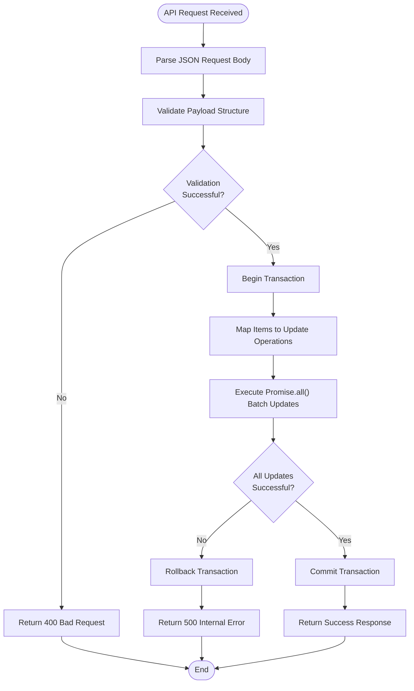
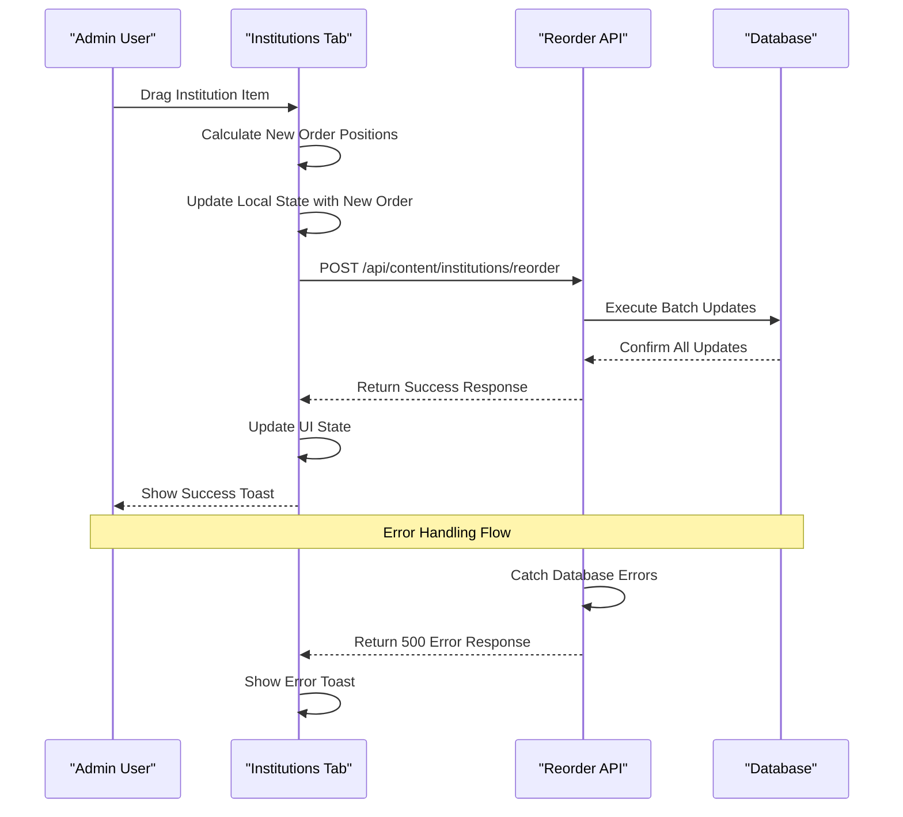
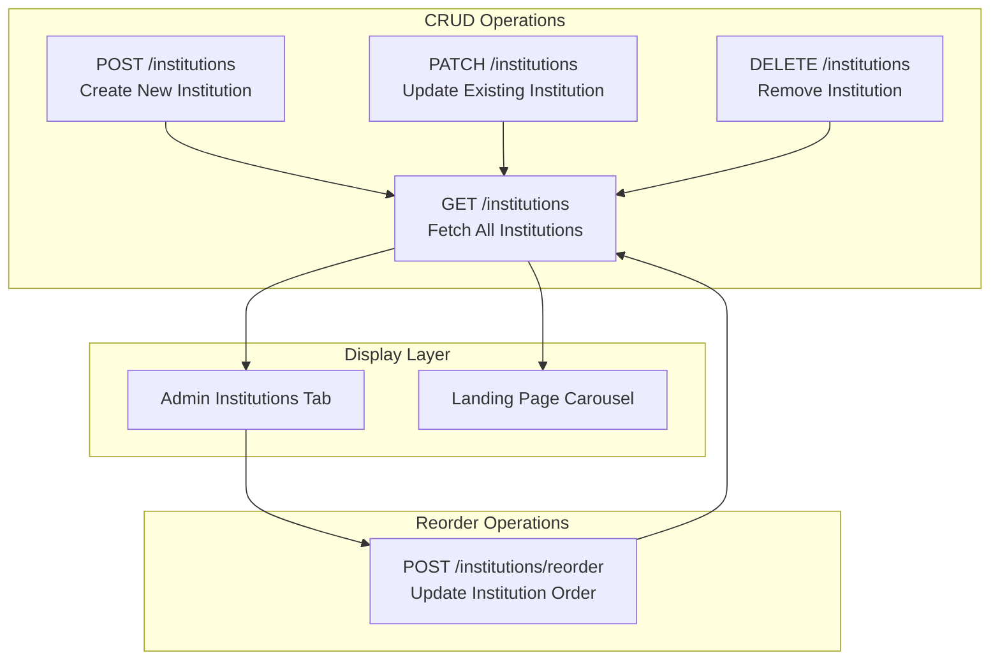

# Institutions Reorder API

<cite>
**Referenced Files in This Document**
- [src/app/api/content/institutions/reorder/route.ts](file://src/app/api/content/institutions/reorder/route.ts)
- [src/app/api/content/institutions/route.ts](file://src/app/api/content/institutions/route.ts)
- [src/components/admin/content-tabs/institutions-tab.tsx](file://src/components/admin/content-tabs/institutions-tab.tsx)
- [src/components/landing/institutions-section.tsx](file://src/components/landing/institutions-section.tsx)
- [src/lib/prisma.ts](file://src/lib/prisma.ts)
- [prisma/schema.prisma](file://prisma/schema.prisma)
</cite>

## Table of Contents
1. [Introduction](#introduction)
2. [Endpoint Overview](#endpoint-overview)
3. [Request Structure](#request-structure)
4. [Server-Side Implementation](#server-side-implementation)
5. [Frontend Integration](#frontend-integration)
6. [Error Handling](#error-handling)
7. [Performance Considerations](#performance-considerations)
8. [Complete CRUD Integration](#complete-crud-integration)
9. [Best Practices](#best-practices)
10. [Troubleshooting](#troubleshooting)

## Introduction

The Institutions Reorder API provides atomic sequence updates for multiple institutions in the SMMM System's content management interface. This endpoint enables administrators to rearrange institution logos through a drag-and-drop interface, ensuring transactional consistency across all affected records.

The API serves as a critical component of the system's content management functionality, allowing for efficient batch updates of institution ordering while maintaining data integrity through atomic operations.

## Endpoint Overview

### Base URL
```
/api/content/institutions/reorder
```

### HTTP Method
**POST**

### Description
Updates the order sequence of multiple institutions atomically using Promise.all() for concurrent database operations.

### Authentication
Requires admin authentication as part of the Next.js middleware protection.

**Section sources**
- [src/app/api/content/institutions/reorder/route.ts](file://src/app/api/content/institutions/reorder/route.ts#L1-L26)

## Request Structure

### Payload Format
The API expects a JSON payload containing an array of institution objects with `id` and `order` properties.

```typescript
interface ReorderPayload {
  items: Array<{
    id: string;
    order: number;
  }>;
}
```

### Example Request Body
```json
{
  "items": [
    {
      "id": "clntlg_01j9v5z8z8z8z8z8z8z8z8z8z8",
      "order": 0
    },
    {
      "id": "clntlg_01j9v5z8z8z8z8z8z8z8z8z8z9",
      "order": 1
    },
    {
      "id": "clntlg_01j9v5z8z8z8z8z8z8z8z8z8za",
      "order": 2
    },
    {
      "id": "clntlg_01j9v5z8z8z8z8z8z8z8z8z8zb",
      "order": 3
    }
  ]
}
```

### Request Headers
- `Content-Type: application/json`

### Validation Rules
- `items` array must contain at least one item
- Each item must have a valid UUID `id`
- `order` values must be sequential integers starting from 0
- All items in the array must exist in the database

**Section sources**
- [src/app/api/content/institutions/reorder/route.ts](file://src/app/api/content/institutions/reorder/route.ts#L5-L15)

## Server-Side Implementation

### Core Logic Flow



**Diagram sources**
- [src/app/api/content/institutions/reorder/route.ts](file://src/app/api/content/institutions/reorder/route.ts#L4-L25)

### Database Operations

The implementation uses Prisma's `Promise.all()` pattern for concurrent updates:

```typescript
await Promise.all(
  items.map((item: { id: string; order: number }) =>
    prisma.clientLogo.update({
      where: { id: item.id },
      data: { order: item.order },
    })
  )
)
```

### Transactional Consistency

While the current implementation uses `Promise.all()` for concurrency, it lacks explicit transaction boundaries. For enhanced data integrity, consider wrapping the operations in a Prisma transaction.

**Section sources**
- [src/app/api/content/institutions/reorder/route.ts](file://src/app/api/content/institutions/reorder/route.ts#L8-L16)

## Frontend Integration

### Drag-and-Drop Interface

The frontend implementation provides a user-friendly drag-and-drop interface through the Institutions Tab component:



**Diagram sources**
- [src/components/admin/content-tabs/institutions-tab.tsx](file://src/components/admin/content-tabs/institutions-tab.tsx#L240-L280)

### State Management

The frontend maintains institution order through React state management:

```typescript
const handleReorder = async (newItems: ClientLogo[]) => {
  try {
    const response = await fetch('/api/content/institutions/reorder', {
      method: 'POST',
      headers: { 'Content-Type': 'application/json' },
      body: JSON.stringify({ items: newItems }),
    })

    if (response.ok) {
      setItems(newItems)
      toast.success('Sıralama güncellendi')
    } else {
      toast.error('Sıralama güncellenemedi')
    }
  } catch (error) {
    console.error('Error reordering institutions:', error)
    toast.error('Sıralama güncellenirken hata oluştu')
  }
}
```

**Section sources**
- [src/components/admin/content-tabs/institutions-tab.tsx](file://src/components/admin/content-tabs/institutions-tab.tsx#L255-L280)

## Error Handling

### Malformed Payload Handling

The API implements robust error handling for various failure scenarios:

| Error Type | HTTP Status | Error Message | Cause |
|------------|-------------|---------------|-------|
| Invalid JSON | 400 | N/A | Malformed request body |
| Missing Items | 400 | N/A | Empty items array |
| Invalid ID Format | 400 | N/A | Non-UUID id values |
| Database Constraint | 500 | Sıralama güncellenemedi | Prisma validation errors |
| Network Timeout | 500 | Sıralama güncellenemedi | Database connection issues |

### Error Response Format
```json
{
  "error": "Sıralama güncellenemedi"
}
```

### Frontend Error Handling

The frontend provides user-friendly error feedback:

```typescript
catch (error) {
  console.error('Error reordering institutions:', error)
  toast.error('Sıralama güncellenirken hata oluştu')
}
```

**Section sources**
- [src/app/api/content/institutions/reorder/route.ts](file://src/app/api/content/institutions/reorder/route.ts#L18-L25)
- [src/components/admin/content-tabs/institutions-tab.tsx](file://src/components/admin/content-tabs/institutions-tab.tsx#L265-L275)

## Performance Considerations

### Batch Update Efficiency

The current implementation uses `Promise.all()` for concurrent database operations, which provides excellent performance for batch updates:

- **Concurrent Execution**: All updates run simultaneously
- **Network Optimization**: Single API call handles multiple updates
- **Reduced Latency**: Eliminates round-trip overhead for individual updates

### Scalability Limits

| Metric | Current Limit | Recommended Action |
|--------|---------------|-------------------|
| Max Items | Unlimited | Implement pagination for large datasets |
| Concurrent Connections | Database pool limit | Monitor connection usage |
| Transaction Size | Memory constrained | Consider chunked updates for >100 items |

### Potential Improvements

1. **Prisma Transactions**: Wrap operations in explicit transactions for guaranteed atomicity
2. **Chunked Updates**: Split large batches into smaller chunks (50-100 items per chunk)
3. **Optimistic UI**: Update UI immediately, rollback on API failure
4. **Background Processing**: Use queue system for very large reorders

### Database Indexing

Ensure proper indexing on the `clientLogo` table:
- Primary key (`id`) - automatically indexed
- Order column (`order`) - consider composite index with `id`

**Section sources**
- [src/app/api/content/institutions/reorder/route.ts](file://src/app/api/content/institutions/reorder/route.ts#L8-L16)

## Complete CRUD Integration

### Relationship with Main Institutions API

The reorder endpoint works in conjunction with the main CRUD API to provide comprehensive content management:



**Diagram sources**
- [src/app/api/content/institutions/route.ts](file://src/app/api/content/institutions/route.ts#L1-L88)
- [src/app/api/content/institutions/reorder/route.ts](file://src/app/api/content/institutions/reorder/route.ts#L1-L26)

### Data Flow Integration

1. **Initial Load**: GET `/api/content/institutions` returns ordered list
2. **Reordering**: POST `/api/content/institutions/reorder` updates positions
3. **Display**: Landing page fetches sorted data for carousel rendering

**Section sources**
- [src/app/api/content/institutions/route.ts](file://src/app/api/content/institutions/route.ts#L4-L12)
- [src/components/landing/institutions-section.tsx](file://src/components/landing/institutions-section.tsx#L95-L125)

## Best Practices

### Security Considerations

1. **Authentication**: Ensure endpoint requires admin authentication
2. **Authorization**: Verify user permissions before processing requests
3. **Input Validation**: Validate all incoming data against schema
4. **Rate Limiting**: Implement rate limiting for reorder operations

### Data Integrity

1. **Atomic Operations**: Consider using Prisma transactions for critical updates
2. **Consistency Checks**: Validate order values are sequential and unique
3. **Backup Strategy**: Maintain audit logs for reorder operations
4. **Rollback Mechanism**: Implement undo functionality for accidental reorders

### Performance Optimization

1. **Caching**: Cache frequently accessed institution data
2. **Pagination**: Implement pagination for large institution lists
3. **Lazy Loading**: Load institution data on demand
4. **Compression**: Enable gzip compression for API responses

### Monitoring and Logging

1. **Request Tracking**: Log all reorder operations with timestamps
2. **Error Monitoring**: Track failed reorder attempts
3. **Performance Metrics**: Monitor API response times
4. **User Activity**: Record who performed reorder operations

## Troubleshooting

### Common Issues

#### 500 Internal Server Error
**Symptoms**: API returns 500 status with "Sıralama güncellenemedi" message
**Causes**:
- Database connection issues
- Invalid order values
- Missing or invalid institution IDs
- Prisma validation failures

**Solutions**:
1. Check database connectivity
2. Verify order values are sequential integers
3. Confirm all institution IDs exist in database
4. Review server logs for detailed error messages

#### Order Not Persisting
**Symptoms**: UI shows new order but refresh reveals old order
**Causes**:
- Frontend state not updating correctly
- API call failing silently
- Database constraint violations

**Solutions**:
1. Verify API response status
2. Check browser console for JavaScript errors
3. Monitor network tab for failed requests
4. Validate database constraints

#### Performance Issues
**Symptoms**: Slow reorder operations with large institution lists
**Causes**:
- Too many simultaneous database connections
- Large batch sizes overwhelming memory
- Network latency affecting concurrent operations

**Solutions**:
1. Implement batch size limits (50-100 items)
2. Add loading indicators for long operations
3. Consider chunked update approach
4. Optimize database indexes

### Debugging Steps

1. **Enable Logging**: Add detailed logging around API operations
2. **Test Isolation**: Test reorder operations independently
3. **Database Inspection**: Verify order values in database
4. **Frontend State**: Check React state consistency
5. **Network Analysis**: Monitor API request/response cycles

**Section sources**
- [src/app/api/content/institutions/reorder/route.ts](file://src/app/api/content/institutions/reorder/route.ts#L18-L25)
- [src/components/admin/content-tabs/institutions-tab.tsx](file://src/components/admin/content-tabs/institutions-tab.tsx#L265-L280)