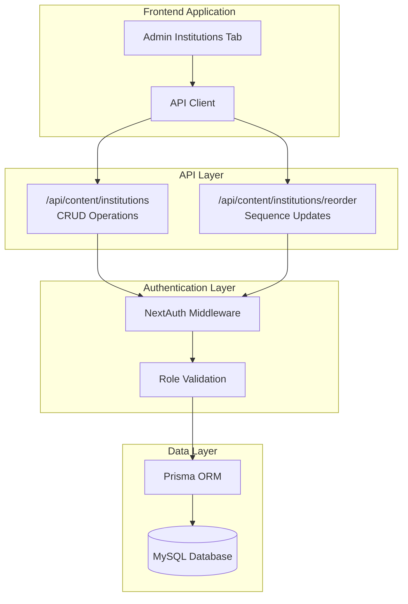
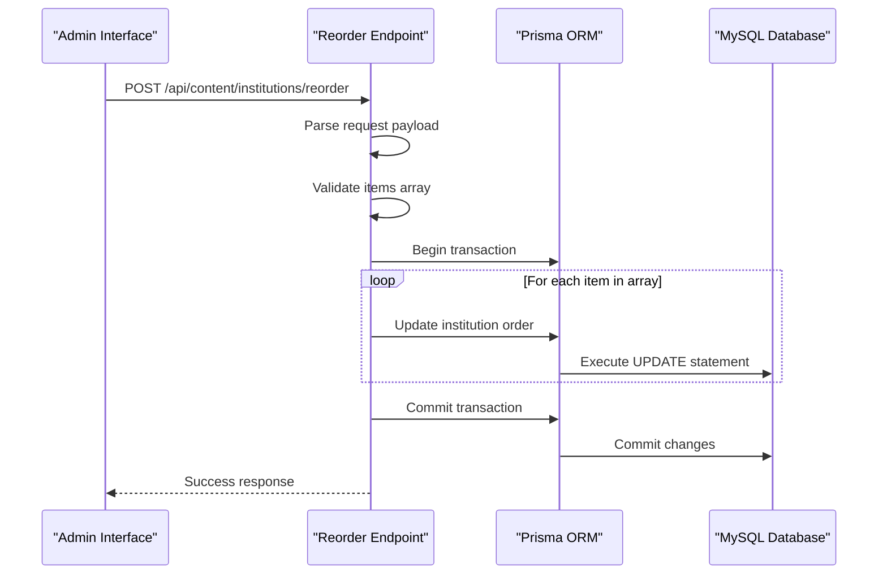
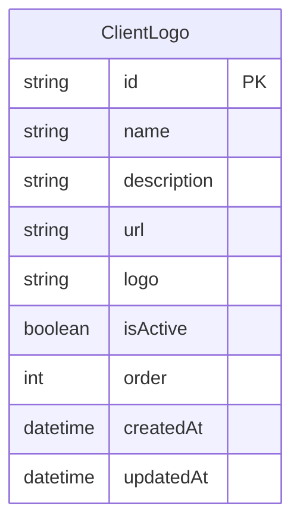
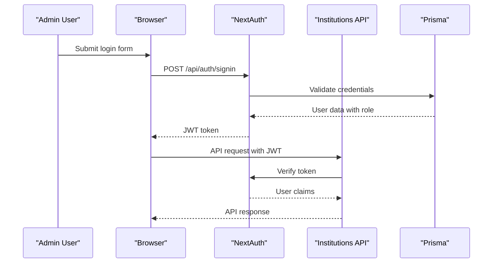
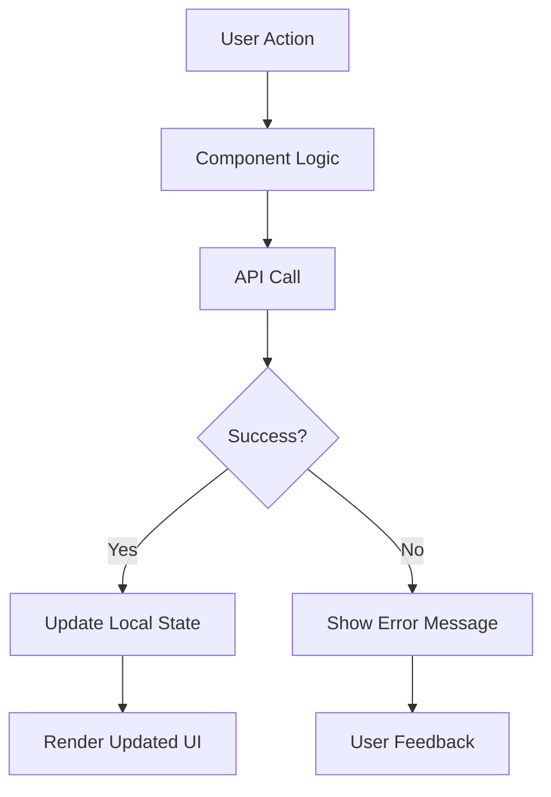

# Institutions Section API Documentation

<cite>
**Referenced Files in This Document**
- [src/app/api/content/institutions/route.ts](file://src/app/api/content/institutions/route.ts)
- [src/app/api/content/institutions/reorder/route.ts](file://src/app/api/content/institutions/reorder/route.ts)
- [src/components/admin/content-tabs/institutions-tab.tsx](file://src/components/admin/content-tabs/institutions-tab.tsx)
- [src/lib/prisma.ts](file://src/lib/prisma.ts)
- [src/lib/auth.ts](file://src/lib/auth.ts)
- [prisma/schema.prisma](file://prisma/schema.prisma)
- [src/app/admin/layout.tsx](file://src/app/admin/layout.tsx)
</cite>

## Table of Contents
1. [Introduction](#introduction)
2. [API Architecture Overview](#api-architecture-overview)
3. [Main Institutions Endpoint](#main-institutions-endpoint)
4. [Reorder Endpoint](#reorder-endpoint)
5. [Database Schema](#database-schema)
6. [Authentication and Authorization](#authentication-and-authorization)
7. [Implementation Examples](#implementation-examples)
8. [Error Handling](#error-handling)
9. [Frontend Integration](#frontend-integration)
10. [Best Practices](#best-practices)

## Introduction

The Institutions Section API provides comprehensive content management capabilities for partner institution logos and their display order on the main website. This API consists of two primary endpoints: the main CRUD endpoint for managing individual institution items, and a specialized reorder endpoint for updating the display sequence of all institutions.

The API is built using Next.js API routes with Prisma ORM for database operations, featuring robust error handling, authentication requirements, and role-based access control. The system supports full CRUD operations including creation, reading, updating, deletion, and reordering of institution logos with proper validation and transaction handling.

## API Architecture Overview

The Institutions API follows a RESTful architecture pattern with two main endpoints that work together to provide comprehensive content management functionality.



**Diagram sources**
- [src/app/api/content/institutions/route.ts](file://src/app/api/content/institutions/route.ts#L1-L88)
- [src/app/api/content/institutions/reorder/route.ts](file://src/app/api/content/institutions/reorder/route.ts#L1-L26)
- [src/lib/auth.ts](file://src/lib/auth.ts#L1-L87)

## Main Institutions Endpoint

The main endpoint handles all CRUD operations for individual institution items. It supports four HTTP methods: GET for retrieval, POST for creation, PATCH for updates, and DELETE for removal.

### GET Request - Retrieve All Institutions

**Endpoint:** `GET /api/content/institutions`

**Purpose:** Fetches all institution items ordered by their display sequence.

**Response Schema:**
```typescript
interface InstitutionItem {
  id: string;
  name: string;
  description?: string;
  url?: string;
  logo: string; // Base64 encoded image
  isActive: boolean;
  order: number;
  createdAt: string;
  updatedAt: string;
}
```

**Success Response:**
```json
[
  {
    "id": "cln123abc",
    "name": "ABC Muhasebe Ltd. Şti.",
    "description": "Profesyonel muhasebe ve danışmanlık hizmetleri",
    "url": "https://abc.com.tr",
    "logo": "data:image/png;base64,iVBORw0KGgoAAAANS...",
    "isActive": true,
    "order": 0,
    "createdAt": "2024-01-15T10:30:00.000Z",
    "updatedAt": "2024-01-15T10:30:00.000Z"
  }
]
```

**Error Responses:**
- `500 Internal Server Error`: Database connection failure or query execution error

### POST Request - Create New Institution

**Endpoint:** `POST /api/content/institutions`

**Purpose:** Creates a new institution item with the provided data.

**Request Payload:**
```json
{
  "name": "XYZ Danışmanlık A.Ş.",
  "description": "Finansal danışmanlık ve yatırım hizmetleri",
  "url": "https://xyz.com.tr",
  "logo": "data:image/png;base64,iVBORw0KGgoAAAANS...",
  "isActive": true
}
```

**Response Schema:**
Same as GET response schema for individual items.

**Success Response:**
```json
{
  "id": "cln456def",
  "name": "XYZ Danışmanlık A.Ş.",
  "description": "Finansal danışmanlık ve yatırım hizmetleri",
  "url": "https://xyz.com.tr",
  "logo": "data:image/png;base64,iVBORw0KGgoAAAANS...",
  "isActive": true,
  "order": 1,
  "createdAt": "2024-01-15T11:00:00.000Z",
  "updatedAt": "2024-01-15T11:00:00.000Z"
}
```

**Error Responses:**
- `500 Internal Server Error`: Database insertion failure

### PATCH Request - Update Existing Institution

**Endpoint:** `PATCH /api/content/institutions?id={id}`

**Purpose:** Updates an existing institution item identified by its ID.

**Query Parameter:**
- `id` (required): The unique identifier of the institution to update

**Request Payload:**
```json
{
  "name": "XYZ Danışmanlık A.Ş.",
  "description": "Geliştirilmiş finansal danışmanlık hizmetleri",
  "url": "https://xyz.com.tr",
  "logo": "data:image/png;base64,iVBORw0KGgoAAAANS...",
  "isActive": false
}
```

**Response Schema:**
Same as GET response schema for individual items.

**Success Response:**
```json
{
  "id": "cln456def",
  "name": "XYZ Danışmanlık A.Ş.",
  "description": "Geliştirilmiş finansal danışmanlık hizmetleri",
  "url": "https://xyz.com.tr",
  "logo": "data:image/png;base64,iVBORw0KGgoAAAANS...",
  "isActive": false,
  "order": 1,
  "createdAt": "2024-01-15T11:00:00.000Z",
  "updatedAt": "2024-01-15T11:30:00.000Z"
}
```

**Error Responses:**
- `400 Bad Request`: Missing ID parameter
- `500 Internal Server Error`: Database update failure

### DELETE Request - Remove Institution

**Endpoint:** `DELETE /api/content/institutions?id={id}`

**Purpose:** Deletes an institution item identified by its ID.

**Query Parameter:**
- `id` (required): The unique identifier of the institution to delete

**Success Response:**
```json
{
  "success": true
}
```

**Error Responses:**
- `400 Bad Request`: Missing ID parameter
- `500 Internal Server Error`: Database deletion failure

**Section sources**
- [src/app/api/content/institutions/route.ts](file://src/app/api/content/institutions/route.ts#L1-L88)

## Reorder Endpoint

The reorder endpoint provides atomic sequence updates for all institution items, ensuring consistent ordering across the application.

### POST Request - Update Sequence Order

**Endpoint:** `POST /api/content/institutions/reorder`

**Purpose:** Updates the display order of all institution items in a single atomic operation.

**Request Payload:**
```json
{
  "items": [
    {
      "id": "cln123abc",
      "order": 0
    },
    {
      "id": "cln456def",
      "order": 1
    },
    {
      "id": "cln789ghi",
      "order": 2
    }
  ]
}
```

**Payload Structure:**
- `items` (array): Array of objects containing institution IDs and their new order positions
- Each item object must contain:
  - `id` (string): Unique identifier of the institution
  - `order` (number): New zero-based index position

**Success Response:**
```json
{
  "success": true
}
```

### Transaction Logic

The reorder endpoint implements atomic transaction logic to ensure data consistency:



**Diagram sources**
- [src/app/api/content/institutions/reorder/route.ts](file://src/app/api/content/institutions/reorder/route.ts#L5-L20)

**Error Handling:**
- If any update fails during the batch operation, the entire transaction is rolled back
- Atomicity ensures either all orders are updated or none are changed

**Section sources**
- [src/app/api/content/institutions/reorder/route.ts](file://src/app/api/content/institutions/reorder/route.ts#L1-L26)

## Database Schema

The Institutions API operates on the `ClientLogo` model defined in the Prisma schema, which manages partner institution logos and their metadata.

### ClientLogo Model Structure



**Model Properties:**

| Field | Type | Description | Constraints |
|-------|------|-------------|-------------|
| `id` | String | Unique identifier | Auto-generated UUID |
| `name` | String | Institution name | Required |
| `description` | String | Brief description | Optional, max 65535 chars |
| `url` | String | Institution website URL | Optional, must be valid URL |
| `logo` | String | Base64 encoded image | Required, max 65535 chars |
| `isActive` | Boolean | Display status | Default: true |
| `order` | Integer | Display sequence | Default: 0 |
| `createdAt` | DateTime | Creation timestamp | Auto-generated |
| `updatedAt` | DateTime | Last update timestamp | Auto-updated |

### Database Queries

The API utilizes several Prisma query patterns:

**Retrieval with Ordering:**
```typescript
await prisma.clientLogo.findMany({
  orderBy: { order: 'asc' }
})
```

**Single Item Update:**
```typescript
await prisma.clientLogo.update({
  where: { id: itemId },
  data: updateData
})
```

**Bulk Update with Transaction:**
```typescript
await prisma.$transaction(items.map(item =>
  prisma.clientLogo.update({
    where: { id: item.id },
    data: { order: item.order }
  })
))
```

**Section sources**
- [prisma/schema.prisma](file://prisma/schema.prisma#L225-L235)
- [src/lib/prisma.ts](file://src/lib/prisma.ts#L1-L10)

## Authentication and Authorization

The Institutions API requires authentication and implements role-based access control to ensure only authorized administrators can modify content.

### Authentication Flow



**Diagram sources**
- [src/lib/auth.ts](file://src/lib/auth.ts#L1-L87)
- [src/app/admin/layout.tsx](file://src/app/admin/layout.tsx#L1-L144)

### Role-Based Access Control

**Required Role:** `ADMIN`

The API automatically inherits authentication from the NextAuth middleware configured in the application. All endpoints require a valid JWT token with the `ADMIN` role.

**Authentication Requirements:**
- Valid JWT token in Authorization header
- User must have `ADMIN` role
- Token must not be expired
- Session must be active

**Authorization Implementation:**
The authentication is handled transparently by NextAuth middleware, which validates tokens and injects user context into the request pipeline.

**Section sources**
- [src/lib/auth.ts](file://src/lib/auth.ts#L40-L87)
- [src/app/admin/layout.tsx](file://src/app/admin/layout.tsx#L1-L144)

## Implementation Examples

### Adding a New Institution

**Frontend Implementation:**
```typescript
// Using the InstitutionsTab component
const handleAddInstitution = async (formData: InstitutionFormData) => {
  try {
    const response = await fetch('/api/content/institutions', {
      method: 'POST',
      headers: { 'Content-Type': 'application/json' },
      body: JSON.stringify({
        name: formData.name,
        description: formData.description,
        url: formData.url,
        logo: formData.logo,
        isActive: true
      })
    });
    
    if (response.ok) {
      const newItem = await response.json();
      // Update local state with new item
      setItems(prev => [...prev, newItem]);
    }
  } catch (error) {
    console.error('Failed to add institution:', error);
  }
};
```

**Direct API Call:**
```javascript
fetch('/api/content/institutions', {
  method: 'POST',
  headers: {
    'Content-Type': 'application/json',
    'Authorization': `Bearer ${jwtToken}`
  },
  body: JSON.stringify({
    name: 'New Institution',
    description: 'Institution description',
    url: 'https://institution.com',
    logo: 'data:image/png;base64,...',
    isActive: true
  })
})
.then(response => response.json())
.then(data => console.log('Created:', data))
.catch(error => console.error('Error:', error));
```

### Reordering Institutions

**Frontend Implementation:**
```typescript
// Using the InstitutionsTab drag-and-drop functionality
const handleReorder = async (newOrder: InstitutionItem[]) => {
  try {
    const reorderPayload = newOrder.map((item, index) => ({
      id: item.id,
      order: index
    }));
    
    const response = await fetch('/api/content/institutions/reorder', {
      method: 'POST',
      headers: { 'Content-Type': 'application/json' },
      body: JSON.stringify({ items: reorderPayload })
    });
    
    if (response.ok) {
      // Update local state with new order
      setItems(newOrder);
    }
  } catch (error) {
    console.error('Failed to reorder institutions:', error);
  }
};
```

**Direct API Call:**
```javascript
fetch('/api/content/institutions/reorder', {
  method: 'POST',
  headers: {
    'Content-Type': 'application/json',
    'Authorization': `Bearer ${jwtToken}`
  },
  body: JSON.stringify({
    items: [
      { id: 'cln123abc', order: 0 },
      { id: 'cln456def', order: 1 },
      { id: 'cln789ghi', order: 2 }
    ]
  })
})
.then(response => response.json())
.then(data => console.log('Reordered successfully'))
.catch(error => console.error('Error:', error));
```

**Section sources**
- [src/components/admin/content-tabs/institutions-tab.tsx](file://src/components/admin/content-tabs/institutions-tab.tsx#L200-L300)
- [src/app/api/content/institutions/route.ts](file://src/app/api/content/institutions/route.ts#L1-L88)

## Error Handling

The API implements comprehensive error handling with meaningful error messages and appropriate HTTP status codes.

### Error Response Format

All error responses follow a consistent format:
```json
{
  "error": "Human-readable error message"
}
```

### Common Error Scenarios

| Scenario | HTTP Status | Error Message | Cause |
|----------|-------------|---------------|-------|
| Database connection failure | 500 | "Kurum logoları alınamadı" | Database unavailable |
| Missing ID parameter | 400 | "ID gerekli" | Required query parameter missing |
| Invalid JSON payload | 400 | "Invalid request payload" | Malformed JSON |
| Record not found | 404 | "Kurum bulunamadı" | Non-existent institution ID |
| Permission denied | 403 | "Yetkiniz yok" | Insufficient privileges |
| Validation failure | 400 | "Geçersiz veri" | Invalid field values |

### Error Recovery Strategies

**Client-Side Error Handling:**
```typescript
const handleApiError = (error: any, fallbackMessage: string) => {
  if (error.response) {
    // Server responded with non-2xx status
    const errorMessage = error.response.data?.error || fallbackMessage;
    toast.error(errorMessage);
  } else if (error.request) {
    // No response received
    toast.error('Sunucuya bağlanılamadı');
  } else {
    // Error in request configuration
    toast.error(fallbackMessage);
  }
};
```

**Server-Side Error Logging:**
```typescript
catch (error) {
  console.error('API Error:', {
    endpoint: request.url,
    method: request.method,
    error: error.message,
    stack: error.stack
  });
  return NextResponse.json(
    { error: 'İşlem sırasında bir hata oluştu' },
    { status: 500 }
  );
}
```

**Section sources**
- [src/app/api/content/institutions/route.ts](file://src/app/api/content/institutions/route.ts#L8-L15)
- [src/app/api/content/institutions/route.ts](file://src/app/api/content/institutions/route.ts#L25-L32)

## Frontend Integration

The Institutions API is seamlessly integrated with the Admin Institutions Tab component, providing a comprehensive management interface.

### Admin Institutions Tab Features

The frontend component offers extensive functionality for managing institution logos:

**Core Features:**
- **CRUD Operations**: Create, read, update, and delete institution entries
- **Drag-and-Drop Reordering**: Visual reordering of institution display sequence
- **Image Upload**: Drag-and-drop or file selection for logo uploads
- **Status Management**: Activate/deactivate institutions for display
- **Search and Filter**: Real-time filtering by name, description, and status
- **Pagination**: Efficient handling of large institution lists

**Implementation Details:**
The component maintains local state for items, loading indicators, and modal dialogs. It communicates with the API through standardized fetch operations with proper error handling and user feedback.

**Data Flow:**


**Diagram sources**
- [src/components/admin/content-tabs/institutions-tab.tsx](file://src/components/admin/content-tabs/institutions-tab.tsx#L1-L681)

### Integration Patterns

**State Management:**
```typescript
const [items, setItems] = useState<InstitutionItem[]>([]);
const [isLoading, setIsLoading] = useState(true);
const [isModalOpen, setIsModalOpen] = useState(false);
```

**API Communication:**
```typescript
const fetchItems = async () => {
  setIsLoading(true);
  try {
    const response = await fetch('/api/content/institutions');
    if (response.ok) {
      const data = await response.json();
      setItems(data);
    }
  } catch (error) {
    console.error('Error fetching institutions:', error);
  } finally {
    setIsLoading(false);
  }
};
```

**Section sources**
- [src/components/admin/content-tabs/institutions-tab.tsx](file://src/components/admin/content-tabs/institutions-tab.tsx#L47-L85)

## Best Practices

### Security Considerations

1. **Authentication Required**: All endpoints require valid JWT authentication
2. **Role-Based Access**: Only users with ADMIN role can modify content
3. **Input Validation**: Client-side validation complements server-side validation
4. **Rate Limiting**: Implement rate limiting to prevent abuse
5. **HTTPS Only**: Ensure all API communications use HTTPS

### Performance Optimization

1. **Efficient Queries**: Use appropriate Prisma query patterns
2. **Caching**: Implement caching for frequently accessed data
3. **Batch Operations**: Use bulk operations for multiple updates
4. **Pagination**: Implement pagination for large datasets
5. **Lazy Loading**: Load images asynchronously

### Data Integrity

1. **Atomic Transactions**: Use transactions for related operations
2. **Validation**: Validate all incoming data
3. **Audit Logging**: Log all modifications for audit trails
4. **Backup Strategy**: Implement regular database backups
5. **Consistency Checks**: Validate data consistency regularly

### Development Guidelines

1. **Error Handling**: Implement comprehensive error handling
2. **Documentation**: Maintain up-to-date API documentation
3. **Testing**: Write unit and integration tests
4. **Monitoring**: Implement monitoring and alerting
5. **Versioning**: Plan for API versioning if needed

### Maintenance Procedures

1. **Regular Backups**: Schedule automated database backups
2. **Performance Monitoring**: Monitor API response times
3. **Security Audits**: Regular security assessments
4. **Code Reviews**: Implement peer review processes
5. **Update Management**: Keep dependencies updated