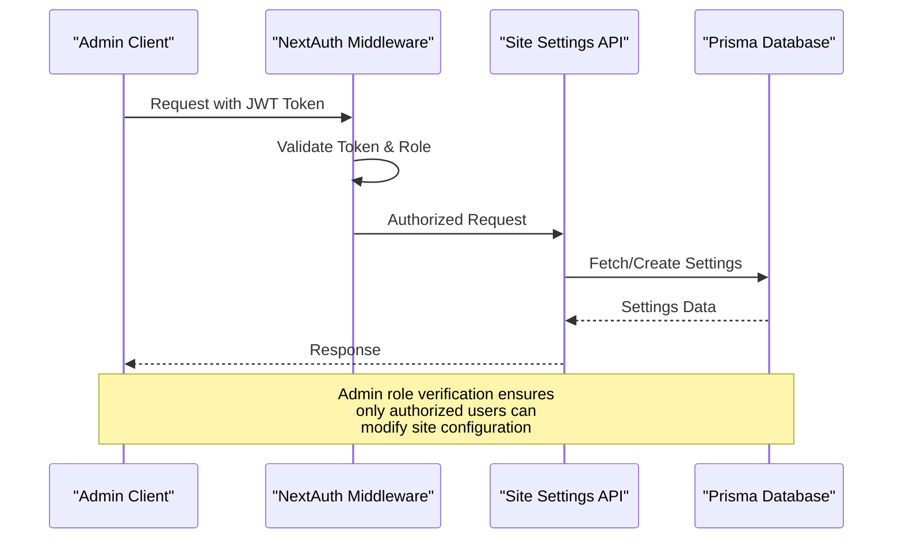
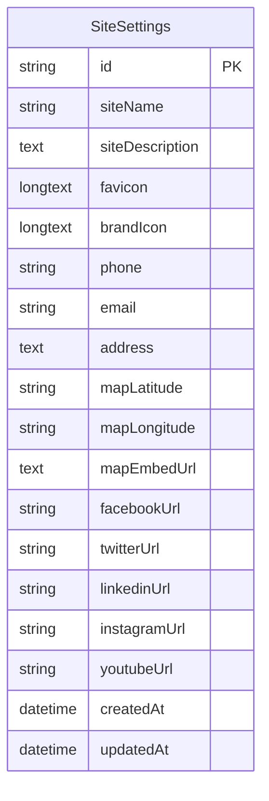
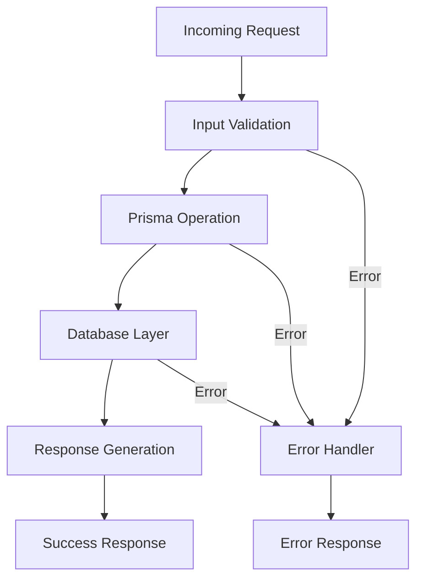
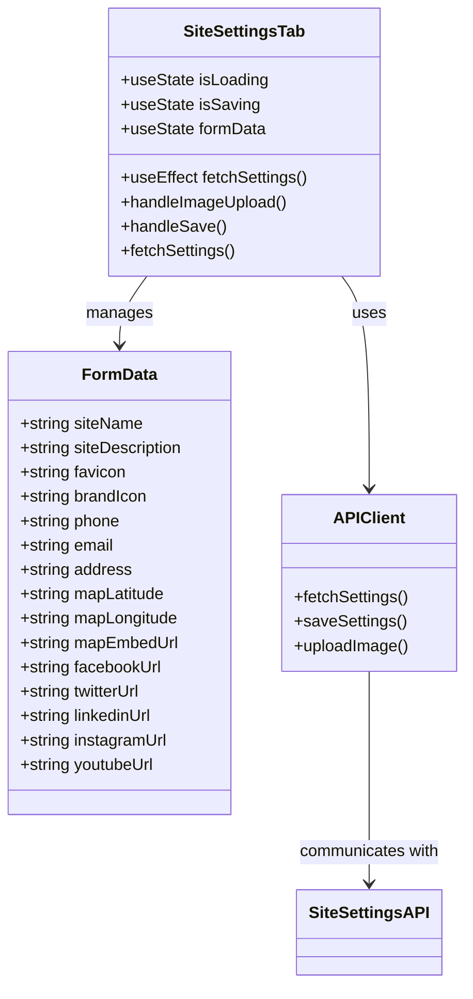
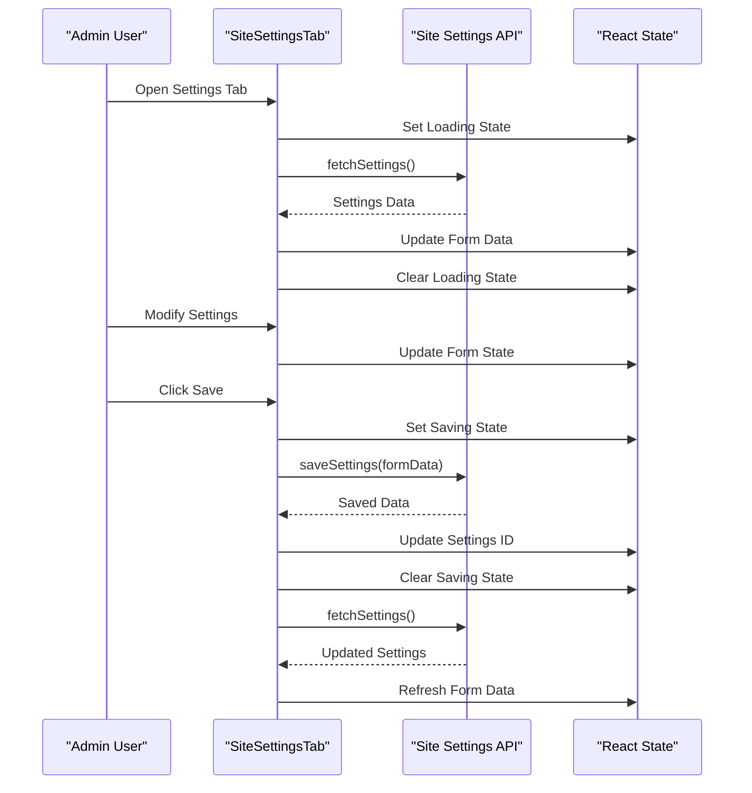

# Site Settings API Documentation

<cite>
**Referenced Files in This Document**
- [src/app/api/content/site-settings/route.ts](file://src/app/api/content/site-settings/route.ts)
- [src/components/admin/content-tabs/site-settings-tab.tsx](file://src/components/admin/content-tabs/site-settings-tab.tsx)
- [src/lib/prisma.ts](file://src/lib/prisma.ts)
- [src/lib/db.ts](file://src/lib/db.ts)
- [src/lib/auth.ts](file://src/lib/auth.ts)
- [prisma/migrations/20251101125707_init/migration.sql](file://prisma/migrations/20251101125707_init/migration.sql)
- [src/app/admin/layout.tsx](file://src/app/admin/layout.tsx)
- [src/app/admin/page.tsx](file://src/app/admin/page.tsx)
</cite>

## Table of Contents
1. [Introduction](#introduction)
2. [Endpoint Overview](#endpoint-overview)
3. [Authentication and Authorization](#authentication-and-authorization)
4. [HTTP Methods](#http-methods)
5. [Request and Response Schemas](#request-and-response-schemas)
6. [Database Schema](#database-schema)
7. [Implementation Details](#implementation-details)
8. [Error Handling](#error-handling)
9. [Usage Examples](#usage-examples)
10. [Frontend Integration](#frontend-integration)

## Introduction

The Site Settings API provides comprehensive management capabilities for global website configuration settings in the SMMM System. This endpoint allows administrators to retrieve and update essential site-wide properties including branding information, contact details, social media links, and operational configurations. The API is built with Next.js 14, utilizes Prisma ORM for database operations, and implements robust authentication and validation mechanisms.

## Endpoint Overview

### Base URL
```
/api/content/site-settings
```

### Supported Methods
- **GET**: Retrieve current site settings
- **POST**: Update site settings (uses PUT semantics for simplicity)

### Authentication Requirements
- **Role**: Admin access required
- **Method**: JWT token authentication via NextAuth
- **Scope**: Administrative privileges only

## Authentication and Authorization

The Site Settings API implements role-based access control through the NextAuth authentication system. Only users with the ADMIN role can access and modify site settings.



**Diagram sources**
- [src/lib/auth.ts](file://src/lib/auth.ts#L40-L86)
- [src/app/api/content/site-settings/route.ts](file://src/app/api/content/site-settings/route.ts#L1-L118)

**Section sources**
- [src/lib/auth.ts](file://src/lib/auth.ts#L40-L86)
- [src/app/api/content/site-settings/route.ts](file://src/app/api/content/site-settings/route.ts#L1-L118)

## HTTP Methods

### GET Method

Retrieves the current site settings with automatic fallback to default values if no settings exist.

**URL Pattern**: `/api/content/site-settings`

**Request Headers**:
- `Authorization: Bearer <jwt-token>`
- `Content-Type: application/json`

**Response Format**: JSON

**Success Response**:
- **Status**: 200 OK
- **Content-Type**: application/json

**Default Values**:
- Site Name: "SMMM Ofisi"
- Site Description: "Profesyonel mali müşavirlik hizmetleri ile işletmenizin mali yönetiminde güvenilir çözüm ortağınız."
- Contact Email: "info@smmmofisi.com"
- Phone: "+90 (212) 123 45 67"
- Address: "İstanbul, Türkiye"
- Social Media: Default URLs to popular platforms

### POST Method

Updates existing site settings or creates new ones if none exist.

**URL Pattern**: `/api/content/site-settings`

**Request Headers**:
- `Authorization: Bearer <jwt-token>`
- `Content-Type: application/json`

**Request Body**: Complete or partial settings object

**Response Format**: JSON

**Success Response**:
- **Status**: 200 OK
- **Content-Type**: application/json

**Section sources**
- [src/app/api/content/site-settings/route.ts](file://src/app/api/content/site-settings/route.ts#L18-L36)
- [src/app/api/content/site-settings/route.ts](file://src/app/api/content/site-settings/route.ts#L38-L117)

## Request and Response Schemas

### Request Schema

The POST request accepts a comprehensive settings object with the following structure:

| Field | Type | Required | Description |
|-------|------|----------|-------------|
| `siteName` | String | No | Website display name |
| `siteDescription` | String | No | Brief website description |
| `favicon` | String | No | Base64 encoded favicon image |
| `brandIcon` | String | No | Base64 encoded brand icon |
| `phone` | String | No | Contact telephone number |
| `email` | String | No | Contact email address |
| `address` | String | No | Physical business address |
| `mapLatitude` | String | No | Google Maps latitude coordinate |
| `mapLongitude` | String | No | Google Maps longitude coordinate |
| `mapEmbedUrl` | String | No | Google Maps embed iframe URL |
| `facebookUrl` | String | No | Facebook page URL |
| `twitterUrl` | String | No | Twitter/X profile URL |
| `linkedinUrl` | String | No | LinkedIn company URL |
| `instagramUrl` | String | No | Instagram profile URL |
| `youtubeUrl` | String | No | YouTube channel URL |

### Response Schema

The API returns a standardized settings object with all fields populated:

```typescript
interface SiteSettingsResponse {
  id: string;
  siteName: string;
  siteDescription: string;
  favicon: string | null;
  brandIcon: string | null;
  phone: string;
  email: string;
  address: string;
  mapLatitude: string | null;
  mapLongitude: string | null;
  mapEmbedUrl: string | null;
  facebookUrl: string;
  twitterUrl: string;
  linkedinUrl: string;
  instagramUrl: string;
  youtubeUrl: string;
  createdAt: Date;
  updatedAt: Date;
}
```

### Default Value Resolution

The API implements intelligent default value resolution:
- Returns stored values when available
- Falls back to predefined defaults for missing fields
- Creates default settings automatically if none exist

**Section sources**
- [src/app/api/content/site-settings/route.ts](file://src/app/api/content/site-settings/route.ts#L5-L16)
- [src/app/api/content/site-settings/route.ts](file://src/app/api/content/site-settings/route.ts#L25-L36)

## Database Schema

The Site Settings data is managed through the `SiteSettings` table in the Prisma database schema.



**Diagram sources**
- [prisma/migrations/20251101125707_init/migration.sql](file://prisma/migrations/20251101125707_init/migration.sql#L135-L158)

### Database Constraints

| Column | Type | Default | Constraints |
|--------|------|---------|-------------|
| `id` | VARCHAR(191) | Auto-generated | Primary Key |
| `siteName` | VARCHAR(191) | 'SMMM Ofisi' | Not Null |
| `siteDescription` | TEXT | NULL | Nullable |
| `favicon` | LONGTEXT | NULL | Nullable |
| `brandIcon` | LONGTEXT | NULL | Nullable |
| `phone` | VARCHAR(191) | NULL | Nullable |
| `email` | VARCHAR(191) | NULL | Nullable |
| `address` | TEXT | NULL | Nullable |
| `mapLatitude` | VARCHAR(191) | NULL | Nullable |
| `mapLongitude` | VARCHAR(191) | NULL | Nullable |
| `mapEmbedUrl` | TEXT | NULL | Nullable |
| `facebookUrl` | VARCHAR(191) | NULL | Nullable |
| `twitterUrl` | VARCHAR(191) | NULL | Nullable |
| `linkedinUrl` | VARCHAR(191) | NULL | Nullable |
| `instagramUrl` | VARCHAR(191) | NULL | Nullable |
| `youtubeUrl` | VARCHAR(191) | NULL | Nullable |
| `createdAt` | DATETIME(3) | CURRENT_TIMESTAMP(3) | Not Null |
| `updatedAt` | DATETIME(3) | Current timestamp | Not Null |

**Section sources**
- [prisma/migrations/20251101125707_init/migration.sql](file://prisma/migrations/20251101125707_init/migration.sql#L135-L158)

## Implementation Details

### Database Layer Integration

The API integrates with the Prisma ORM for database operations, utilizing connection pooling and transaction management for optimal performance.



**Diagram sources**
- [src/app/api/content/site-settings/route.ts](file://src/app/api/content/site-settings/route.ts#L38-L117)
- [src/lib/prisma.ts](file://src/lib/prisma.ts#L1-L10)

### Connection Management

The application uses a singleton pattern for Prisma client management to ensure efficient resource utilization and connection pooling.

**Section sources**
- [src/app/api/content/site-settings/route.ts](file://src/app/api/content/site-settings/route.ts#L1-L118)
- [src/lib/prisma.ts](file://src/lib/prisma.ts#L1-L10)

## Error Handling

The API implements comprehensive error handling with appropriate HTTP status codes and meaningful error messages.

### Error Response Format

```typescript
interface ErrorResponse {
  error: string;
  details?: string;
}
```

### Common Error Scenarios

| Scenario | HTTP Status | Error Message | Cause |
|----------|-------------|---------------|-------|
| Database Connection Failure | 500 | "Site ayarları kaydedilemedi" | Database unavailable |
| Invalid JSON Payload | 400 | "Bad Request" | Malformed request body |
| Authentication Failure | 401 | "Unauthorized" | Missing/invalid JWT token |
| Authorization Failure | 403 | "Forbidden" | Insufficient permissions |
| Validation Errors | 400 | Specific validation message | Invalid field values |

### Error Recovery Mechanisms

- Automatic creation of default settings when none exist
- Graceful degradation to default values for missing fields
- Comprehensive logging for debugging and monitoring
- Fallback responses to prevent service disruption

**Section sources**
- [src/app/api/content/site-settings/route.ts](file://src/app/api/content/site-settings/route.ts#L100-L117)

## Usage Examples

### Retrieving Current Settings

```bash
curl -X GET "https://your-domain.com/api/content/site-settings" \
  -H "Authorization: Bearer YOUR_JWT_TOKEN"
```

**Response**:
```json
{
  "id": "clqz123abc456",
  "siteName": "SMMM Ofisi",
  "siteDescription": "Profesyonel mali müşavirlik hizmetleri...",
  "favicon": "data:image/png;base64,iVBORw0KGgoAAAANSUhEUgAA...",
  "brandIcon": "data:image/png;base64,iVBORw0KGgoAAAANSUhEUgAA...",
  "phone": "+90 (212) 123 45 67",
  "email": "info@smmmofisi.com",
  "address": "İstanbul, Türkiye",
  "mapLatitude": "41.0082",
  "mapLongitude": "28.9784",
  "mapEmbedUrl": "https://www.google.com/maps/embed?pb=...",
  "facebookUrl": "https://facebook.com/smmmofisi",
  "twitterUrl": "https://twitter.com/smmmofisi",
  "linkedinUrl": "https://linkedin.com/company/smmmofisi",
  "instagramUrl": "https://instagram.com/smmmofisi",
  "youtubeUrl": "https://youtube.com/@smmmofisi",
  "createdAt": "2024-01-15T10:30:00.000Z",
  "updatedAt": "2024-01-15T10:30:00.000Z"
}
```

### Updating Site Settings

```bash
curl -X POST "https://your-domain.com/api/content/site-settings" \
  -H "Authorization: Bearer YOUR_JWT_TOKEN" \
  -H "Content-Type: application/json" \
  -d '{
    "siteName": "Modern Muhasebe Ofisi",
    "siteDescription": "Gelişmiş muhasebe ve finansal hizmetler.",
    "favicon": "data:image/png;base64,iVBORw0KGgoAAAANSUhEUgAA...",
    "brandIcon": "data:image/png;base64,iVBORw0KGgoAAAANSUhEUgAA...",
    "phone": "+90 (555) 123 45 67",
    "email": "contact@modermm.com",
    "address": "Ankara, Türkiye",
    "mapLatitude": "39.9042",
    "mapLongitude": "32.8564",
    "mapEmbedUrl": "https://www.google.com/maps/embed?pb=...",
    "facebookUrl": "https://facebook.com/modermm",
    "twitterUrl": "https://twitter.com/modermm",
    "linkedinUrl": "https://linkedin.com/company/modermm",
    "instagramUrl": "https://instagram.com/modermm",
    "youtubeUrl": "https://youtube.com/@modermm"
  }'
```

**Response**:
```json
{
  "id": "clqz123abc456",
  "siteName": "Modern Muhasebe Ofisi",
  "siteDescription": "Gelişmiş muhasebe ve finansal hizmetler.",
  "favicon": "data:image/png;base64,iVBORw0KGgoAAAANSUhEUgAA...",
  "brandIcon": "data:image/png;base64,iVBORw0KGgoAAAANSUhEUgAA...",
  "phone": "+90 (555) 123 45 67",
  "email": "contact@modermm.com",
  "address": "Ankara, Türkiye",
  "mapLatitude": "39.9042",
  "mapLongitude": "32.8564",
  "mapEmbedUrl": "https://www.google.com/maps/embed?pb=...",
  "facebookUrl": "https://facebook.com/modermm",
  "twitterUrl": "https://twitter.com/modermm",
  "linkedinUrl": "https://linkedin.com/company/modermm",
  "instagramUrl": "https://instagram.com/modermm",
  "youtubeUrl": "https://youtube.com/@modermm",
  "createdAt": "2024-01-15T10:30:00.000Z",
  "updatedAt": "2024-01-15T11:15:30.000Z"
}
```

### Error Response Example

```bash
curl -X POST "https://your-domain.com/api/content/site-settings" \
  -H "Authorization: Bearer INVALID_TOKEN" \
  -H "Content-Type: application/json" \
  -d '{"siteName": ""}'
```

**Response**:
```json
{
  "error": "Site ayarları kaydedilemedi",
  "details": "Invalid credentials"
}
```

## Frontend Integration

### Admin Site Settings Tab Component

The frontend implementation provides a comprehensive administrative interface for managing site settings through the SiteSettingsTab component.



**Diagram sources**
- [src/components/admin/content-tabs/site-settings-tab.tsx](file://src/components/admin/content-tabs/site-settings-tab.tsx#L10-L525)
- [src/app/api/content/site-settings/route.ts](file://src/app/api/content/site-settings/route.ts#L38-L117)

### Key Features of the Frontend Implementation

1. **Real-time Form Management**: Reactive state updates for all settings fields
2. **Image Upload Handling**: Base64 encoding for favicon and brand icon uploads
3. **Validation Feedback**: Real-time validation with user-friendly error messages
4. **Google Maps Integration**: Embedded map preview and configuration
5. **Responsive Design**: Mobile-friendly interface with progressive disclosure
6. **Loading States**: Clear indication of network operations
7. **Error Handling**: Comprehensive error reporting and recovery

### Component Lifecycle



**Diagram sources**
- [src/components/admin/content-tabs/site-settings-tab.tsx](file://src/components/admin/content-tabs/site-settings-tab.tsx#L40-L120)
- [src/components/admin/content-tabs/site-settings-tab.tsx](file://src/components/admin/content-tabs/site-settings-tab.tsx#L122-L160)

### Integration with Admin Dashboard

The Site Settings API integrates seamlessly with the broader admin interface, providing centralized configuration management for the entire system.

**Section sources**
- [src/components/admin/content-tabs/site-settings-tab.tsx](file://src/components/admin/content-tabs/site-settings-tab.tsx#L1-L526)
- [src/app/admin/layout.tsx](file://src/app/admin/layout.tsx#L1-L144)