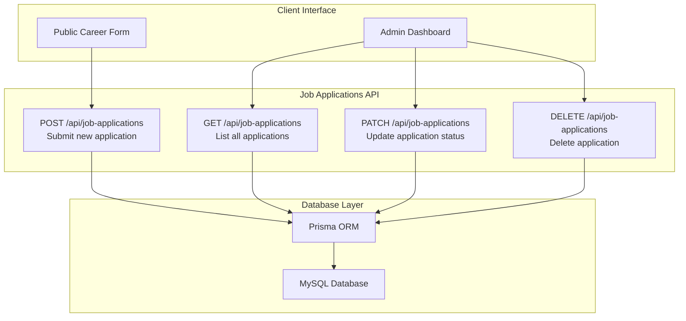
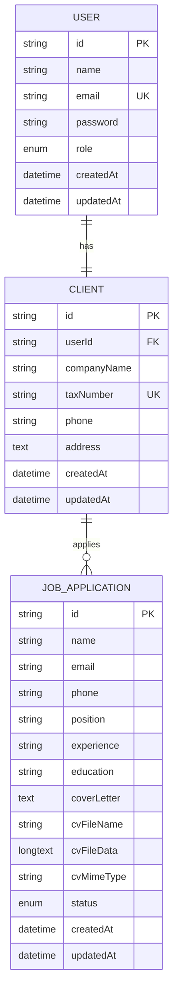
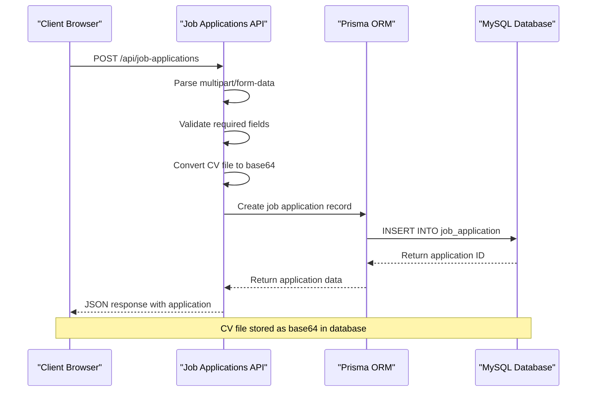
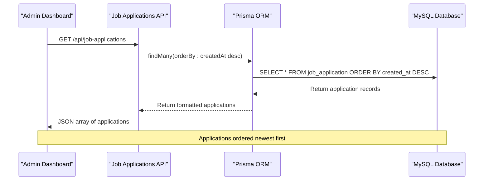
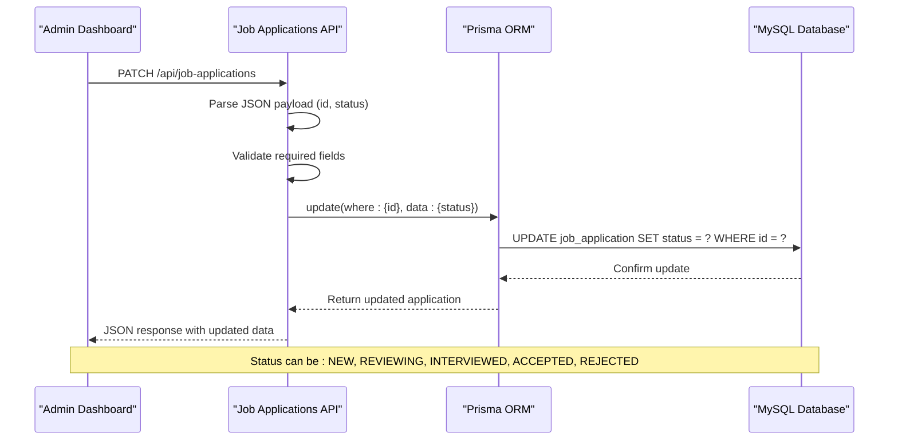
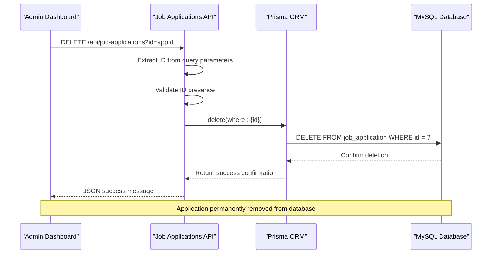
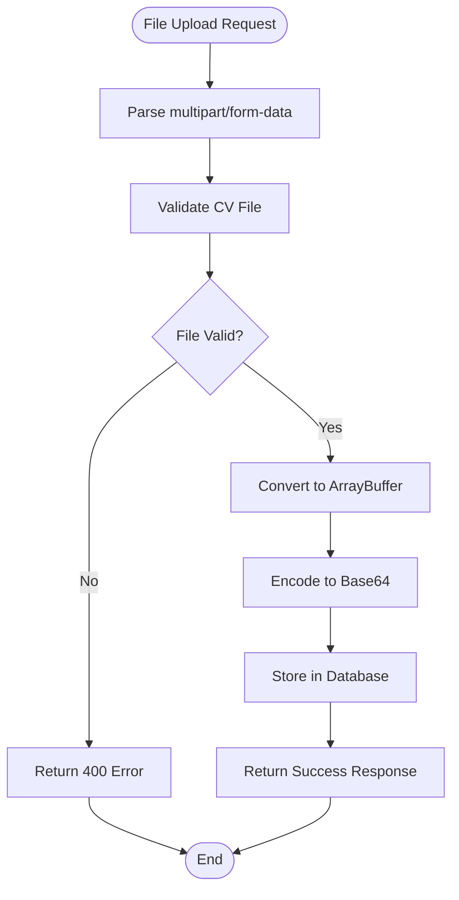
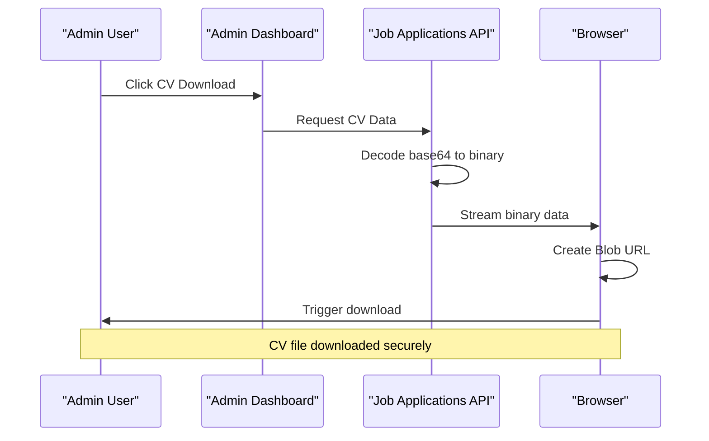

# Job Applications API

<cite>
**Referenced Files in This Document**
- [src/app/api/job-applications/route.ts](file://src/app/api/job-applications/route.ts)
- [src/app/admin/job-applications/page.tsx](file://src/app/admin/job-applications/page.tsx)
- [src/components/admin/edit-job-application-modal.tsx](file://src/components/admin/edit-job-application-modal.tsx)
- [src/components/admin/job-application-modal.tsx](file://src/components/admin/job-application-modal.tsx)
- [src/lib/pdf-export.ts](file://src/lib/pdf-export.ts)
- [src/lib/prisma.ts](file://src/lib/prisma.ts)
- [prisma/schema.prisma](file://prisma/schema.prisma)
- [prisma/migrations/20251101125707_init/migration.sql](file://prisma/migrations/20251101125707_init/migration.sql)
</cite>

## Table of Contents
1. [Introduction](#introduction)
2. [API Endpoints Overview](#api-endpoints-overview)
3. [Database Schema](#database-schema)
4. [HTTP Methods and URL Patterns](#http-methods-and-url-patterns)
5. [Request/Response Schemas](#requestresponse-schemas)
6. [CRUD Operations Implementation](#crud-operations-implementation)
7. [Authentication and Security](#authentication-and-security)
8. [Validation Rules](#validation-rules)
9. [Error Handling](#error-handling)
10. [File Upload Handling](#file-upload-handling)
11. [Admin Dashboard Integration](#admin-dashboard-integration)
12. [Client Implementation Examples](#client-implementation-examples)
13. [Status Codes](#status-codes)
14. [Best Practices](#best-practices)

## Introduction

The Job Applications API provides comprehensive functionality for managing job applications in the smmm-system. This API handles the complete lifecycle of job applications, from submission through the career form to administrative processing and status updates. The system supports file uploads for CVs, real-time status tracking, and PDF export capabilities for administrative review.

The API is built using Next.js 14 with App Router, leveraging Prisma ORM for database operations and implementing robust validation and security measures. The system supports both public job application submissions and administrative management interfaces.

## API Endpoints Overview

The Job Applications API consists of four primary endpoints that support the complete CRUD (Create, Read, Update, Delete) operations:



**Diagram sources**
- [src/app/api/job-applications/route.ts](file://src/app/api/job-applications/route.ts#L1-L130)

## Database Schema

The Job Application model is defined in the Prisma schema with comprehensive fields for capturing applicant information and CV data:



**Diagram sources**
- [prisma/schema.prisma](file://prisma/schema.prisma#L385-L400)
- [prisma/migrations/20251101125707_init/migration.sql](file://prisma/migrations/20251101125707_init/migration.sql#L425-L440)

**Section sources**
- [prisma/schema.prisma](file://prisma/schema.prisma#L385-L400)
- [prisma/migrations/20251101125707_init/migration.sql](file://prisma/migrations/20251101125707_init/migration.sql#L425-L440)

## HTTP Methods and URL Patterns

### GET /api/job-applications
**Purpose**: Retrieve all job applications ordered by creation date (newest first)

**Method**: `GET`
**Authentication**: Not required for listing (public endpoint)
**URL Pattern**: `/api/job-applications`
**Response Type**: JSON array of job applications

### POST /api/job-applications
**Purpose**: Submit a new job application with file upload

**Method**: `POST`
**Authentication**: Not required (public form submission)
**URL Pattern**: `/api/job-applications`
**Content Type**: `multipart/form-data`
**Response Type**: JSON with application details

### PATCH /api/job-applications
**Purpose**: Update the status of an existing job application

**Method**: `PATCH`
**Authentication**: Required (admin only)
**URL Pattern**: `/api/job-applications`
**Content Type**: `application/json`
**Response Type**: JSON with updated application

### DELETE /api/job-applications
**Purpose**: Delete a job application by ID

**Method**: `DELETE`
**Authentication**: Required (admin only)
**URL Pattern**: `/api/job-applications?id={applicationId}`
**Response Type**: JSON success message

## Request/Response Schemas

### GET Response Schema
```typescript
interface GetJobApplicationsResponse {
  id: string;
  name: string;
  email: string;
  phone: string;
  position: string;
  experience: string;
  education: string;
  coverLetter?: string;
  cvFileName?: string;
  cvMimeType?: string;
  status: 'NEW' | 'REVIEWING' | 'INTERVIEWED' | 'ACCEPTED' | 'REJECTED';
  createdAt: string;
  updatedAt: string;
}
```

### POST Request Schema
```typescript
interface PostJobApplicationRequest {
  firstName: string;
  lastName: string;
  email: string;
  phone: string;
  position: string;
  experience: string;
  education: string;
  coverLetter?: string;
  cv: File;
}
```

### POST Response Schema
```typescript
interface PostJobApplicationResponse {
  message: string;
  application: GetJobApplicationsResponse;
}
```

### PATCH Request Schema
```typescript
interface PatchJobApplicationRequest {
  id: string;
  status: 'NEW' | 'REVIEWING' | 'INTERVIEWED' | 'ACCEPTED' | 'REJECTED';
}
```

### DELETE Response Schema
```typescript
interface DeleteJobApplicationResponse {
  message: string;
}
```

**Section sources**
- [src/app/api/job-applications/route.ts](file://src/app/api/job-applications/route.ts#L1-L130)

## CRUD Operations Implementation

### Create Operation (POST)
The POST endpoint handles new job application submissions with comprehensive validation and file processing:



**Diagram sources**
- [src/app/api/job-applications/route.ts](file://src/app/api/job-applications/route.ts#L15-L77)

### Read Operation (GET)
The GET endpoint retrieves all applications with automatic ordering:



**Diagram sources**
- [src/app/api/job-applications/route.ts](file://src/app/api/job-applications/route.ts#L4-L12)

### Update Operation (PATCH)
The PATCH endpoint enables status updates for administrative processing:



**Diagram sources**
- [src/app/api/job-applications/route.ts](file://src/app/api/job-applications/route.ts#L80-L95)

### Delete Operation (DELETE)
The DELETE endpoint removes applications with proper validation:



**Diagram sources**
- [src/app/api/job-applications/route.ts](file://src/app/api/job-applications/route.ts#L98-L129)

**Section sources**
- [src/app/api/job-applications/route.ts](file://src/app/api/job-applications/route.ts#L1-L130)

## Authentication and Security

### Role-Based Access Control
The API implements role-based access control for administrative operations:

- **Public Endpoints**: GET and POST endpoints are publicly accessible for job application submissions
- **Admin Endpoints**: PATCH and DELETE operations require administrative privileges
- **Authentication Method**: Uses NextAuth.js for session-based authentication
- **Authorization**: Admin role verification through session middleware

### Security Measures

#### Input Validation
- **Required Field Validation**: All mandatory fields validated server-side
- **File Type Validation**: CV file validation during upload
- **Length Constraints**: Appropriate field length limits
- **Format Validation**: Email and phone number format checking

#### Data Sanitization
- **SQL Injection Prevention**: Prisma ORM automatically handles SQL injection protection
- **XSS Protection**: Automatic escaping of user-generated content
- **File Content Validation**: Base64 encoding prevents malicious file content

#### File Security
- **Base64 Encoding**: CV files converted to base64 before storage
- **MIME Type Validation**: File type verification during upload
- **Size Limitations**: Practical size limits enforced through browser constraints
- **Access Control**: File downloads controlled through secure endpoints

**Section sources**
- [src/app/api/job-applications/route.ts](file://src/app/api/job-applications/route.ts#L34-L42)
- [src/app/admin/job-applications/page.tsx](file://src/app/admin/job-applications/page.tsx#L1-L501)

## Validation Rules

### Field Validation Rules

| Field | Type | Required | Validation Rules |
|-------|------|----------|------------------|
| firstName | string | Yes | Non-empty, max 100 characters |
| lastName | string | Yes | Non-empty, max 100 characters |
| email | string | Yes | Valid email format, unique constraint |
| phone | string | Yes | Valid phone number format |
| position | string | Yes | Non-empty, max 200 characters |
| experience | string | Yes | Non-empty, max 200 characters |
| education | string | Yes | Non-empty, max 200 characters |
| coverLetter | string | No | Max 5000 characters |
| cv | File | Yes | PDF format, max 10MB |

### Business Logic Validation
- **Unique Email Constraint**: Each email can only apply once per position
- **Status Transitions**: Valid status change sequences
- **File Format**: Only PDF files accepted for CV uploads
- **Field Length Limits**: Appropriate character limits for all text fields

### Error Messages
The API provides localized error messages in Turkish:
- "Tüm zorunlu alanları doldurun" - All required fields must be filled
- "Başvuru gönderilirken bir hata oluştu" - Error occurred while submitting application
- "ID gereklidir" - ID is required
- "Başvuru silinirken hata oluştu" - Error occurred while deleting application

**Section sources**
- [src/app/api/job-applications/route.ts](file://src/app/api/job-applications/route.ts#L34-L42)
- [src/app/api/job-applications/route.ts](file://src/app/api/job-applications/route.ts#L74-L77)

## Error Handling

### Error Response Format
All API endpoints return standardized error responses:

```typescript
interface ErrorResponse {
  error: string;
  details?: string;
}
```

### Common Error Scenarios

#### Validation Errors (400 Bad Request)
- Missing required fields
- Invalid email format
- Missing CV file
- Invalid status values

#### Server Errors (500 Internal Server Error)
- Database connection failures
- Prisma operation errors
- File processing failures
- Unexpected runtime exceptions

#### Business Logic Errors
- Duplicate email submissions
- Invalid status transitions
- Non-existent application IDs
- Insufficient permissions

### Error Logging and Monitoring
- Comprehensive error logging with stack traces
- Error categorization for monitoring
- Graceful degradation for non-critical failures
- User-friendly error messages

**Section sources**
- [src/app/api/job-applications/route.ts](file://src/app/api/job-applications/route.ts#L14-L18)
- [src/app/api/job-applications/route.ts](file://src/app/api/job-applications/route.ts#L74-L77)
- [src/app/api/job-applications/route.ts](file://src/app/api/job-applications/route.ts#L89-L93)
- [src/app/api/job-applications/route.ts](file://src/app/api/job-applications/route.ts#L115-L119)

## File Upload Handling

### CV File Processing
The API implements sophisticated file upload and storage mechanisms:



**Diagram sources**
- [src/app/api/job-applications/route.ts](file://src/app/api/job-applications/route.ts#L44-L52)

### File Storage Strategy
- **Storage Format**: Base64-encoded binary data
- **Database Column**: LONGTEXT column for storing encoded files
- **Metadata Storage**: Separate columns for filename and MIME type
- **Size Considerations**: Practical limits for web application performance

### File Download Implementation
The admin interface provides secure CV file downloads:



**Diagram sources**
- [src/components/admin/job-application-modal.tsx](file://src/components/admin/job-application-modal.tsx#L60-L105)

**Section sources**
- [src/app/api/job-applications/route.ts](file://src/app/api/job-applications/route.ts#L44-L52)
- [src/components/admin/job-application-modal.tsx](file://src/components/admin/job-application-modal.tsx#L60-L105)

## Admin Dashboard Integration

### Dashboard Features
The admin dashboard provides comprehensive job application management:

#### Application Listing
- **Pagination**: Configurable items per page (5, 10, 25, 50)
- **Sorting**: Order by creation date, position, or status
- **Filtering**: Multi-dimensional filtering by status and position
- **Search**: Full-text search across name, email, and position

#### Application Details
- **Modal View**: Comprehensive application details display
- **Status Tracking**: Real-time status updates
- **File Downloads**: Secure CV file access
- **PDF Export**: Professional PDF generation

#### Administrative Actions
- **Status Updates**: Real-time status modification
- **Bulk Operations**: Efficient batch processing
- **Deletion**: Permanent application removal
- **Export**: PDF report generation

### Real-Time Updates
The dashboard implements real-time synchronization:
- **Automatic Refresh**: Manual refresh capability
- **Instant Feedback**: Immediate status change confirmation
- **Loading States**: Clear indication of ongoing operations
- **Error Handling**: Graceful error recovery

**Section sources**
- [src/app/admin/job-applications/page.tsx](file://src/app/admin/job-applications/page.tsx#L1-L501)
- [src/components/admin/edit-job-application-modal.tsx](file://src/components/admin/edit-job-application-modal.tsx#L1-L163)

## Client Implementation Examples

### Public Form Submission
```javascript
// Example: Submitting a job application from the public career form
async function submitJobApplication(formData) {
  try {
    const response = await fetch('/api/job-applications', {
      method: 'POST',
      body: formData, // FormData with CV file
    });
    
    if (!response.ok) {
      throw new Error('Application submission failed');
    }
    
    const result = await response.json();
    return result.application;
  } catch (error) {
    console.error('Submission error:', error);
    throw error;
  }
}
```

### Admin Dashboard Integration
```javascript
// Example: Fetching and displaying job applications
async function fetchJobApplications() {
  try {
    const response = await fetch('/api/job-applications');
    if (!response.ok) {
      throw new Error('Failed to fetch applications');
    }
    
    const applications = await response.json();
    return applications;
  } catch (error) {
    console.error('Fetch error:', error);
    return [];
  }
}

// Example: Updating application status
async function updateApplicationStatus(applicationId, newStatus) {
  try {
    const response = await fetch('/api/job-applications', {
      method: 'PATCH',
      headers: {
        'Content-Type': 'application/json',
      },
      body: JSON.stringify({ id: applicationId, status: newStatus }),
    });
    
    if (!response.ok) {
      throw new Error('Status update failed');
    }
    
    return await response.json();
  } catch (error) {
    console.error('Update error:', error);
    throw error;
  }
}
```

### PDF Export Implementation
```javascript
// Example: Exporting application to PDF
function exportApplicationToPDF(application) {
  // Using the PDF export utility
  exportJobApplicationToPDF(application);
}
```

**Section sources**
- [src/app/admin/job-applications/page.tsx](file://src/app/admin/job-applications/page.tsx#L110-L140)
- [src/app/admin/job-applications/page.tsx](file://src/app/admin/job-applications/page.tsx#L150-L180)
- [src/lib/pdf-export.ts](file://src/lib/pdf-export.ts#L60-L120)

## Status Codes

### HTTP Status Codes Reference

| Status Code | Description | Usage Scenario |
|-------------|-------------|----------------|
| 200 OK | Successful GET request | Retrieving job applications |
| 201 Created | Successful POST request | New application submitted |
| 200 OK | Successful PATCH request | Status updated successfully |
| 200 OK | Successful DELETE request | Application deleted successfully |
| 400 Bad Request | Invalid request data | Missing fields, invalid format |
| 404 Not Found | Resource not found | Non-existent application ID |
| 500 Internal Server Error | Server error | Database issues, unexpected failures |

### Error Response Statuses
- **400 Bad Request**: Validation failures, missing required fields
- **404 Not Found**: Attempting to access non-existent resources
- **500 Internal Server Error**: Server-side processing errors
- **503 Service Unavailable**: Temporary service unavailability

**Section sources**
- [src/app/api/job-applications/route.ts](file://src/app/api/job-applications/route.ts#L14-L18)
- [src/app/api/job-applications/route.ts](file://src/app/api/job-applications/route.ts#L74-L77)
- [src/app/api/job-applications/route.ts](file://src/app/api/job-applications/route.ts#L89-L93)
- [src/app/api/job-applications/route.ts](file://src/app/api/job-applications/route.ts#L115-L119)

## Best Practices

### API Design Principles
- **RESTful Architecture**: Consistent URL patterns and HTTP methods
- **Resource-Oriented**: Clear resource identification and manipulation
- **Stateless Operations**: Each request contains all necessary information
- **Standardized Responses**: Consistent response formats across endpoints

### Performance Optimization
- **Database Indexing**: Proper indexing on frequently queried fields
- **Query Optimization**: Efficient database queries with appropriate joins
- **Caching Strategies**: Appropriate caching for read-heavy operations
- **File Size Management**: Reasonable limits for file uploads

### Security Best Practices
- **Input Validation**: Comprehensive server-side validation
- **Authentication**: Role-based access control implementation
- **Data Sanitization**: Proper handling of user-generated content
- **Error Handling**: Secure error message presentation

### Development Guidelines
- **Type Safety**: TypeScript implementation for compile-time safety
- **Error Logging**: Comprehensive logging for debugging and monitoring
- **Documentation**: Clear API documentation and examples
- **Testing**: Adequate test coverage for all endpoints

### Maintenance Considerations
- **Schema Evolution**: Proper migration strategies for database changes
- **Backward Compatibility**: Maintaining API compatibility across versions
- **Monitoring**: Implementation of health checks and performance metrics
- **Scalability**: Design considerations for future growth