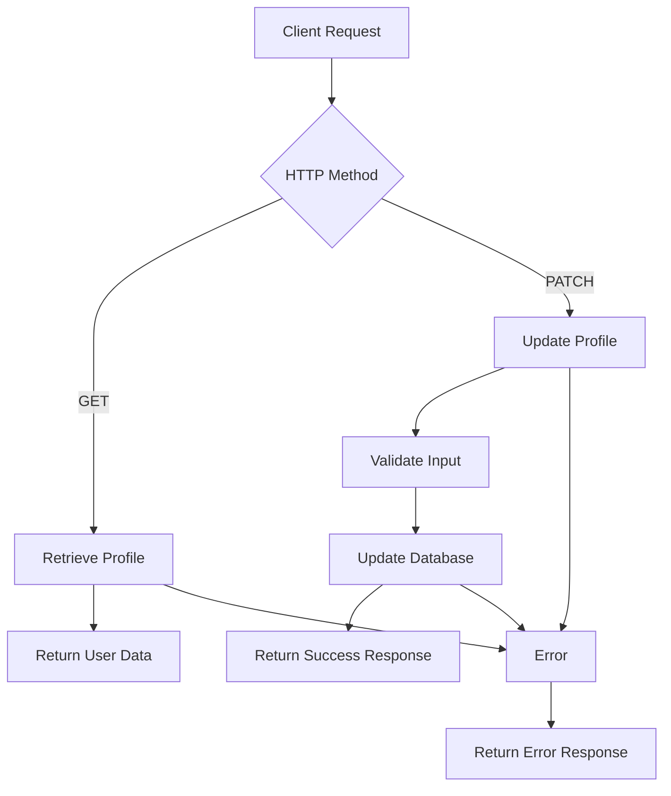
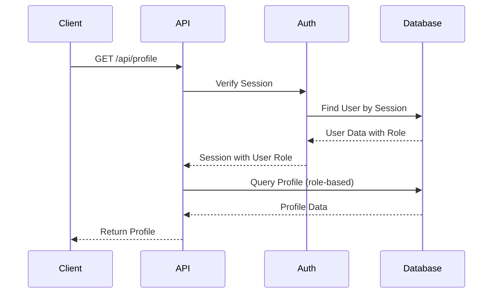
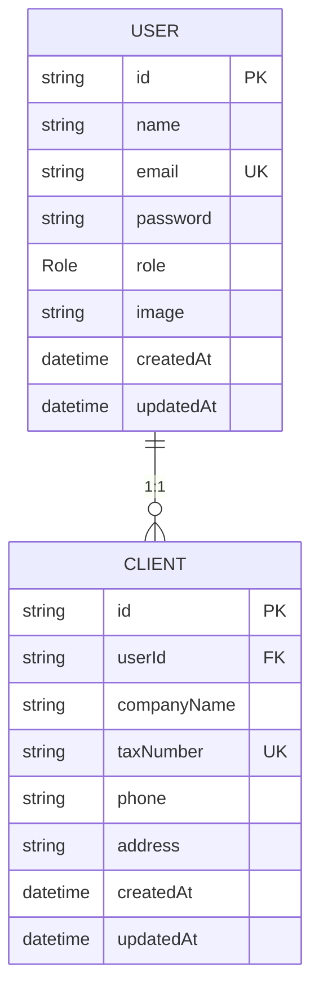
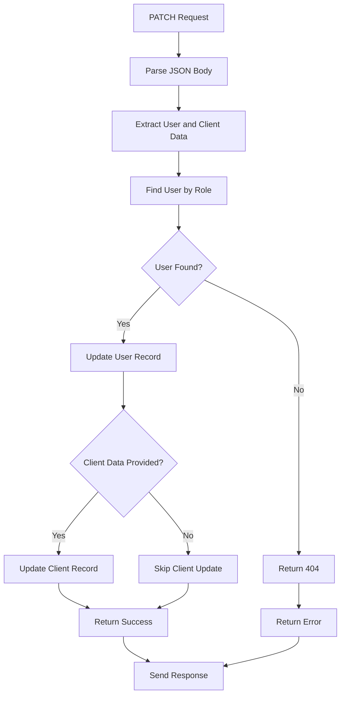
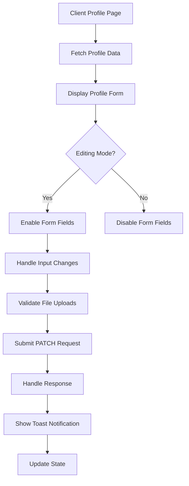

# Profile API

<cite>
**Referenced Files in This Document**   
- [route.ts](file://src/app/api/profile/route.ts)
- [page.tsx](file://src/app/client/profile/page.tsx)
- [page.tsx](file://src/app/admin/profile/page.tsx)
- [auth.ts](file://src/lib/auth.ts)
- [schema.prisma](file://prisma/schema.prisma)
- [prisma.ts](file://src/lib/prisma.ts)
</cite>

## Table of Contents
1. [Introduction](#introduction)
2. [Profile API Endpoints](#profile-api-endpoints)
3. [Request/Response Schemas](#requestresponse-schemas)
4. [Authentication and Authorization](#authentication-and-authorization)
5. [Database Interaction](#database-interaction)
6. [Client-Side Implementation](#client-side-implementation)
7. [Validation and Error Handling](#validation-and-error-handling)
8. [Security Considerations](#security-considerations)
9. [Usage Examples](#usage-examples)

## Introduction

The Profile API in the smmm-system provides endpoints for managing user profile information. This API enables users to retrieve their profile data and update personal information, with different capabilities based on user roles (ADMIN or CLIENT). The system integrates with Prisma ORM for database operations and uses NextAuth for authentication. While the current implementation has placeholder authentication logic, it's designed to support session-based access control.

**Section sources**
- [route.ts](file://src/app/api/profile/route.ts#L1-L81)
- [schema.prisma](file://prisma/schema.prisma#L1-L434)

## Profile API Endpoints

The Profile API exposes two primary endpoints for profile management:

### GET /api/profile
Retrieves the authenticated user's profile information including personal details and role-specific data.

### PATCH /api/profile
Updates the authenticated user's profile information. The endpoint supports partial updates and can modify both user and client-related data.



**Diagram sources**
- [route.ts](file://src/app/api/profile/route.ts#L4-L79)

**Section sources**
- [route.ts](file://src/app/api/profile/route.ts#L4-L79)

## Request/Response Schemas

### GET Response Schema
The GET endpoint returns complete user profile information:

```json
{
  "id": "string",
  "name": "string",
  "email": "string",
  "role": "ADMIN|CLIENT",
  "image": "string|null",
  "createdAt": "datetime",
  "client": {
    "companyName": "string",
    "taxNumber": "string",
    "phone": "string|null",
    "address": "string|null"
  }
}
```

### PATCH Request Schema
The PATCH endpoint accepts a JSON payload with user and client data:

```json
{
  "name": "string",
  "email": "string",
  "image": "string|null",
  "clientData": {
    "companyName": "string",
    "taxNumber": "string",
    "phone": "string",
    "address": "string"
  }
}
```

### PATCH Response Schema
Successful updates return confirmation with updated user data:

```json
{
  "message": "Profile updated successfully",
  "user": {
    "id": "string",
    "name": "string",
    "email": "string",
    "role": "ADMIN|CLIENT",
    "image": "string|null",
    "client": {
      "companyName": "string",
      "taxNumber": "string",
      "phone": "string|null",
      "address": "string|null"
    }
  }
}
```

**Section sources**
- [route.ts](file://src/app/api/profile/route.ts#L4-L79)
- [page.tsx](file://src/app/client/profile/page.tsx#L59-L111)
- [page.tsx](file://src/app/admin/profile/page.tsx#L74-L120)

## Authentication and Authorization

The system implements role-based access control through NextAuth authentication. Users are assigned roles (ADMIN or CLIENT) that determine their access to profile data and functionality.

### Authentication Flow
1. Users authenticate via credentials provider
2. NextAuth creates a JWT containing user ID and role
3. Session information is attached to requests
4. API endpoints use session data to identify and authorize users

### Role-Based Access
- **ADMIN users**: Can access all profile fields and administrative functions
- **CLIENT users**: Limited to client-specific information and self-management



**Diagram sources**
- [auth.ts](file://src/lib/auth.ts#L49-L85)
- [route.ts](file://src/app/api/profile/route.ts#L4-L46)

**Section sources**
- [auth.ts](file://src/lib/auth.ts#L1-L87)
- [route.ts](file://src/app/api/profile/route.ts#L4-L46)

## Database Interaction

The Profile API interacts with the database through Prisma ORM, following a structured data model with relationships between users and clients.

### Data Model
The Prisma schema defines two primary models for profile management:



**Diagram sources**
- [schema.prisma](file://prisma/schema.prisma#L1-L434)

### Database Operations
The API performs the following operations:

**GET Operation:**
- Queries the User model with client relation
- Filters by role (currently ADMIN only)
- Returns first matching record

**PATCH Operation:**
- Updates User record with provided fields
- Conditionally updates Client record if clientData is provided
- Returns updated user with client relation



**Diagram sources**
- [route.ts](file://src/app/api/profile/route.ts#L42-L79)
- [prisma.ts](file://src/lib/prisma.ts#L1-L10)

**Section sources**
- [route.ts](file://src/app/api/profile/route.ts#L42-L79)
- [schema.prisma](file://prisma/schema.prisma#L1-L434)

## Client-Side Implementation

The system provides two distinct interfaces for profile management based on user roles.

### Client Profile Interface
Located at `/client/profile`, this interface allows clients to manage their personal and company information:

- Personal details (name, email, phone)
- Company information (name, tax number, address)
- Profile image upload
- Form validation and submission

### Admin Profile Interface
Located at `/admin/profile`, this interface provides administrators with profile management capabilities:

- Personal details management
- System information access
- Security settings (placeholder)
- Profile image management



**Diagram sources**
- [page.tsx](file://src/app/client/profile/page.tsx#L59-L111)
- [page.tsx](file://src/app/admin/profile/page.tsx#L74-L120)

**Section sources**
- [page.tsx](file://src/app/client/profile/page.tsx#L1-L401)
- [page.tsx](file://src/app/admin/profile/page.tsx#L1-L380)

## Validation and Error Handling

The system implements comprehensive validation and error handling at both API and client levels.

### API-Level Validation
- Input parsing and extraction
- User existence verification
- Database transaction error handling
- Structured error responses with appropriate HTTP status codes

### Client-Level Validation
- File type validation (image/* MIME types)
- File size validation (maximum 2MB)
- Form field validation
- User feedback through toast notifications

### Error Response Schema
```json
{
  "error": "Error description",
  "status": 400|404|500
}
```

Common error scenarios:
- **400 Bad Request**: Invalid input data
- **404 Not Found**: User not found
- **500 Internal Server Error**: Database or server errors

**Section sources**
- [route.ts](file://src/app/api/profile/route.ts#L10-L38)
- [page.tsx](file://src/app/client/profile/page.tsx#L112-L163)

## Security Considerations

The Profile API implementation includes several security measures, with planned enhancements for production use.

### Current Security Features
- Role-based data access
- Input validation
- Error handling without information leakage
- File type and size validation for uploads

### Planned Security Enhancements
- Proper session-based user identification
- Ownership verification to prevent privilege escalation
- Input sanitization
- Rate limiting
- Enhanced password security

### Security Risks and Mitigations
| Risk | Current Status | Mitigation Plan |
|------|---------------|----------------|
| Insecure Direct Object Reference | Present (uses first ADMIN user) | Implement session-based user identification |
| Privilege Escalation | Possible | Add ownership checks and role validation |
| Insecure File Uploads | Mitigated | Add virus scanning and file type restrictions |
| Information Leakage | Low risk | Ensure error messages don't expose system details |

**Section sources**
- [route.ts](file://src/app/api/profile/route.ts#L4-L79)
- [auth.ts](file://src/lib/auth.ts#L1-L87)

## Usage Examples

### Client Profile Update
```javascript
// Example request from client interface
fetch('/api/profile', {
  method: 'PATCH',
  headers: { 'Content-Type': 'application/json' },
  body: JSON.stringify({
    name: 'John Doe',
    email: 'john.doe@example.com',
    image: 'data:image/jpeg;base64,/9j/4AAQSkZJRgA...',
    clientData: {
      companyName: 'Example Company Ltd.',
      taxNumber: '1234567890',
      phone: '05321234567',
      address: 'Main Street 123, Istanbul'
    }
  })
})
```

### Admin Profile Update
```javascript
// Example request from admin interface
fetch('/api/profile', {
  method: 'PATCH',
  headers: { 'Content-Type': 'application/json' },
  body: JSON.stringify({
    name: 'Admin User',
    email: 'admin@example.com',
    image: 'data:image/jpeg;base64,/9j/4AAQSkZJRgA...'
  })
})
```

### Successful Response
```json
{
  "message": "Profile updated successfully",
  "user": {
    "id": "clx8m5q1n0000vqz1a2b3c4d5",
    "name": "John Doe",
    "email": "john.doe@example.com",
    "role": "CLIENT",
    "image": "data:image/jpeg;base64,/9j/4AAQSkZJRgA...",
    "createdAt": "2024-02-01T10:00:00.000Z",
    "client": {
      "id": "clx8m5q1n0001vqz1a2b3c4d5",
      "userId": "clx8m5q1n0000vqz1a2b3c4d5",
      "companyName": "Example Company Ltd.",
      "taxNumber": "1234567890",
      "phone": "05321234567",
      "address": "Main Street 123, Istanbul",
      "createdAt": "2024-02-01T10:00:00.000Z",
      "updatedAt": "2024-02-02T14:30:00.000Z"
    }
  }
}
```

**Section sources**
- [page.tsx](file://src/app/client/profile/page.tsx#L122-L163)
- [page.tsx](file://src/app/admin/profile/page.tsx#L122-L163)
- [route.ts](file://src/app/api/profile/route.ts#L65-L79)