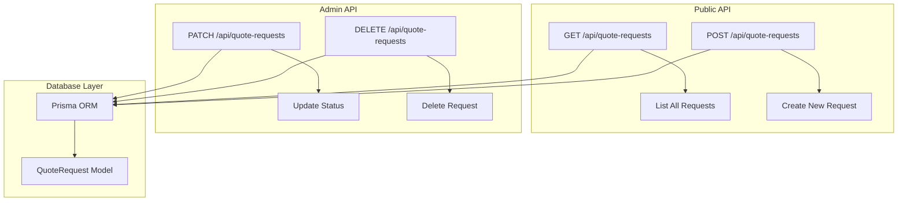
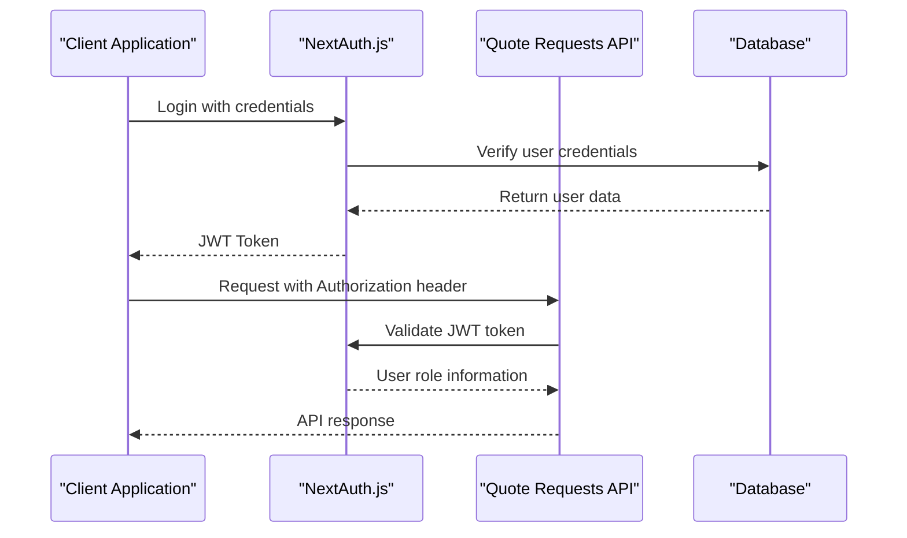
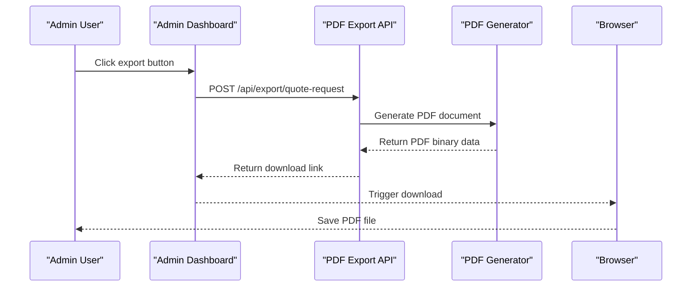

# Quote Requests API Documentation

<cite>
**Referenced Files in This Document**
- [src/app/api/quote-requests/route.ts](file://src/app/api/quote-requests/route.ts)
- [src/lib/prisma.ts](file://src/lib/prisma.ts)
- [src/lib/db.ts](file://src/lib/db.ts)
- [src/app/admin/quote-requests/page.tsx](file://src/app/admin/quote-requests/page.tsx)
- [src/components/admin/edit-quote-request-modal.tsx](file://src/components/admin/edit-quote-request-modal.tsx)
- [src/components/modals/quote-request-modal.tsx](file://src/components/modals/quote-request-modal.tsx)
- [src/lib/pdf-export.ts](file://src/lib/pdf-export.ts)
- [src/lib/auth.ts](file://src/lib/auth.ts)
- [src/app/admin/layout.tsx](file://src/app/admin/layout.tsx)
- [prisma/migrations/20251101125707_init/migration.sql](file://prisma/migrations/20251101125707_init/migration.sql)
</cite>

## Table of Contents
1. [Introduction](#introduction)
2. [API Overview](#api-overview)
3. [Authentication and Authorization](#authentication-and-authorization)
4. [Endpoint Reference](#endpoint-reference)
5. [Data Models](#data-models)
6. [Validation Rules](#validation-rules)
7. [Error Handling](#error-handling)
8. [Security Considerations](#security-considerations)
9. [Client Implementation Examples](#client-implementation-examples)
10. [Admin Dashboard Integration](#admin-dashboard-integration)
11. [PDF Export Functionality](#pdf-export-functionality)

## Introduction

The Quote Requests API provides comprehensive functionality for managing quote requests in the SMMM System. This API handles both public form submissions and administrative operations for managing customer inquiries. The system supports CRUD operations for quote requests while maintaining strict validation and security controls.

The API is built using Next.js 14 with App Router, leveraging Prisma ORM for database operations and implementing role-based access control for administrative functions.

## API Overview

The Quote Requests API consists of four primary endpoints that support the complete lifecycle of quote request management:



**Diagram sources**
- [src/app/api/quote-requests/route.ts](file://src/app/api/quote-requests/route.ts#L1-L99)

## Authentication and Authorization

The API implements role-based access control through NextAuth.js with JWT tokens. Administrative operations require authenticated admin users with the appropriate role permissions.

### Authentication Flow



**Diagram sources**
- [src/lib/auth.ts](file://src/lib/auth.ts#L1-L87)
- [src/app/admin/layout.tsx](file://src/app/admin/layout.tsx#L1-L144)

### Role-Based Access Control

- **Public Access**: Available without authentication for form submissions
- **Admin Access**: Required for administrative operations (status updates, deletions)
- **User Roles**: Defined in the User model with ADMIN and CLIENT roles

**Section sources**
- [src/lib/auth.ts](file://src/lib/auth.ts#L1-L87)
- [prisma/migrations/20251101125707_init/migration.sql](file://prisma/migrations/20251101125707_init/migration.sql#L1-L44)

## Endpoint Reference

### GET /api/quote-requests

Retrieves all quote requests ordered by creation date (newest first).

#### Request
```
GET /api/quote-requests
Host: your-domain.com
Authorization: Bearer <jwt-token>
```

#### Response
```json
[
  {
    "id": "clq123xyz456",
    "name": "Ahmet Yılmaz",
    "email": "ahmet@example.com",
    "phone": "0555 123 4567",
    "company": "ABC Ltd. Şti.",
    "serviceType": "Muhasebe",
    "message": "Şirketimiz için tam zamanlı muhasebe hizmeti talep ediyoruz.",
    "status": "NEW",
    "createdAt": "2024-01-15T10:30:00.000Z",
    "updatedAt": "2024-01-15T10:30:00.000Z"
  }
]
```

#### Status Codes
- `200 OK`: Successfully retrieved quote requests
- `500 Internal Server Error`: Database query failed

### POST /api/quote-requests

Creates a new quote request from public form submissions.

#### Request
```json
{
  "name": "John Doe",
  "email": "john@example.com",
  "phone": "+1234567890",
  "company": "Example Corp",
  "serviceType": "Financial Consulting",
  "message": "We would like to receive a quote for our financial services."
}
```

#### Response
```json
{
  "message": "Teklif talebiniz başarıyla gönderildi",
  "quoteRequest": {
    "id": "clq456abc789",
    "name": "John Doe",
    "email": "john@example.com",
    "phone": "+1234567890",
    "company": "Example Corp",
    "serviceType": "Financial Consulting",
    "message": "We would like to receive a quote for our financial services.",
    "status": "NEW",
    "createdAt": "2024-01-15T11:00:00.000Z",
    "updatedAt": "2024-01-15T11:00:00.000Z"
  }
}
```

#### Status Codes
- `201 Created`: Quote request successfully created
- `400 Bad Request`: Missing required fields
- `500 Internal Server Error`: Database operation failed

### PATCH /api/quote-requests

Updates the status of an existing quote request (admin only).

#### Request
```json
{
  "id": "clq123xyz456",
  "status": "PENDING"
}
```

#### Response
```json
{
  "id": "clq123xyz456",
  "name": "Ahmet Yılmaz",
  "email": "ahmet@example.com",
  "phone": "0555 123 4567",
  "company": "ABC Ltd. Şti.",
  "serviceType": "Muhasebe",
  "message": "Şirketimiz için tam zamanlı muhasebe hizmeti talep ediyoruz.",
  "status": "PENDING",
  "createdAt": "2024-01-15T10:30:00.000Z",
  "updatedAt": "2024-01-15T11:15:00.000Z"
}
```

#### Status Codes
- `200 OK`: Status successfully updated
- `500 Internal Server Error`: Database operation failed

### DELETE /api/quote-requests

Deletes a quote request by ID (admin only).

#### Request
```
DELETE /api/quote-requests?id=clq123xyz456
Host: your-domain.com
Authorization: Bearer <jwt-token>
```

#### Response
```json
{
  "message": "Teklif talebi başarıyla silindi"
}
```

#### Status Codes
- `200 OK`: Quote request successfully deleted
- `400 Bad Request`: Missing ID parameter
- `500 Internal Server Error`: Database operation failed

**Section sources**
- [src/app/api/quote-requests/route.ts](file://src/app/api/quote-requests/route.ts#L1-L99)

## Data Models

### QuoteRequest Schema

The QuoteRequest model defines the structure for storing quote request data:

| Field | Type | Description | Validation |
|-------|------|-------------|------------|
| `id` | String | Unique identifier | Auto-generated UUID |
| `name` | String | Full name of requester | Required, min 2 chars |
| `email` | String | Email address | Required, valid email format |
| `phone` | String | Contact phone number | Required, valid phone format |
| `company` | String | Company/Organization name | Optional, max 191 chars |
| `serviceType` | String | Type of service requested | Required, max 191 chars |
| `message` | Text | Detailed request message | Optional |
| `status` | Enum | Request status | Default: "NEW" |
| `createdAt` | DateTime | Creation timestamp | Auto-generated |
| `updatedAt` | DateTime | Last update timestamp | Auto-updated |

### Status Values

The `status` field supports the following values:

| Status | Description | Color | Order |
|--------|-------------|-------|-------|
| `NEW` | New request, awaiting review | Blue | 1 |
| `PENDING` | Under review, awaiting action | Yellow | 2 |
| `REVIEWED` | Reviewed, ready for action | Blue | 3 |
| `CONTACTED` | Contacted by staff | Purple | 4 |
| `COMPLETED` | Request completed | Green | 5 |

**Section sources**
- [prisma/migrations/20251101125707_init/migration.sql](file://prisma/migrations/20251101125707_init/migration.sql#L420-L435)

## Validation Rules

### Client-Side Validation

The public form implements comprehensive validation using HTML5 attributes and JavaScript:

#### Required Fields
- **Name**: First name and last name (both required)
- **Email**: Valid email format
- **Phone**: Valid phone number format
- **Company**: Optional but validated if provided
- **Service Type**: Selected from predefined options

#### Validation Examples

```typescript
// Form validation rules
const validationRules = {
  name: {
    required: "Ad soyad alanı gereklidir",
    minLength: 2
  },
  email: {
    required: "E-posta adresi gereklidir",
    pattern: /^[^\s@]+@[^\s@]+\.[^\s@]+$/
  },
  phone: {
    required: "Telefon numarası gereklidir",
    pattern: /^\+?\d[\d\s-]{8,}\d$/
  },
  serviceType: {
    required: "Hizmet türü seçilmelidir"
  }
}
```

### Server-Side Validation

The API implements robust server-side validation:

#### Mandatory Fields Validation
```typescript
if (!name || !email || !phone || !company || !serviceType) {
  return NextResponse.json(
    { error: 'Tüm zorunlu alanları doldurun' },
    { status: 400 }
  )
}
```

#### Database-Level Constraints
- All fields except `message` are marked as NOT NULL
- Email field has unique constraint
- Status field uses ENUM with predefined values
- Automatic timestamp generation

**Section sources**
- [src/components/modals/quote-request-modal.tsx](file://src/components/modals/quote-request-modal.tsx#L1-L195)
- [src/app/api/quote-requests/route.ts](file://src/app/api/quote-requests/route.ts#L15-L25)

## Error Handling

### Standard Error Responses

The API follows consistent error response patterns:

#### Validation Errors (400)
```json
{
  "error": "Tüm zorunlu alanları doldurun"
}
```

#### Server Errors (500)
```json
{
  "error": "Teklif talebi gönderilirken hata oluştu"
}
```

#### Missing Parameters (400)
```json
{
  "error": "ID gereklidir"
}
```

### Error Categories

| Error Type | HTTP Status | Description | Example |
|------------|-------------|-------------|---------|
| Validation | 400 | Invalid input data | Missing required fields |
| Authentication | 401 | Unauthorized access | Invalid JWT token |
| Authorization | 403 | Insufficient permissions | Non-admin trying to update status |
| Not Found | 404 | Resource not found | Request ID doesn't exist |
| Server Error | 500 | Internal database error | Database connection failure |

### Error Handling Implementation

```typescript
try {
  // Database operation
  const quoteRequest = await prisma.quoteRequest.create({ data })
  return NextResponse.json(result, { status: 201 })
} catch (error) {
  console.error('Error creating quote request:', error)
  return NextResponse.json(
    { error: 'Teklif talebi gönderilirken hata oluştu' },
    { status: 500 }
  )
}
```

**Section sources**
- [src/app/api/quote-requests/route.ts](file://src/app/api/quote-requests/route.ts#L15-L47)
- [src/app/api/quote-requests/route.ts](file://src/app/api/quote-requests/route.ts#L50-L99)

## Security Considerations

### Input Sanitization

The API implements multiple layers of input protection:

#### Database-Level Protection
- Parameterized queries prevent SQL injection
- Automatic escaping of special characters
- Field length validation prevents buffer overflow attacks

#### Validation Layers
- Client-side validation using HTML5 attributes
- Server-side validation with explicit checks
- Type checking for all input parameters

### Access Control

#### Public Endpoints
- No authentication required for GET and POST operations
- POST endpoint allows anonymous submissions
- GET endpoint returns all requests (no filtering)

#### Admin Endpoints
- Requires authenticated admin user
- JWT token validation with role verification
- Authorization middleware ensures only admins can modify requests

### Data Protection

#### Privacy Considerations
- Personal data stored according to GDPR guidelines
- Email addresses used only for communication
- Phone numbers stored securely with proper encryption
- Request messages stored with appropriate retention policies

#### Rate Limiting
While not explicitly implemented in the current code, rate limiting should be considered for production deployments:
- Maximum 10 requests per minute per IP for POST endpoint
- 100 requests per minute for GET endpoint
- 20 requests per minute for PATCH/DELETE endpoints

**Section sources**
- [src/lib/auth.ts](file://src/lib/auth.ts#L1-L87)
- [src/app/api/quote-requests/route.ts](file://src/app/api/quote-requests/route.ts#L15-L25)

## Client Implementation Examples

### Public Form Submission

#### React Component Implementation

```typescript
// Public form submission using the API
const handleSubmit = async (formData: FormData) => {
  const data = {
    name: `${formData.get('firstName')} ${formData.get('lastName')}`,
    email: formData.get('email') as string,
    phone: formData.get('phone') as string,
    company: formData.get('companyName') as string || 'Belirtilmemiş',
    serviceType: packageType,
    message: formData.get('message') as string,
  }

  try {
    const response = await fetch('/api/quote-requests', {
      method: 'POST',
      headers: { 'Content-Type': 'application/json' },
      body: JSON.stringify(data),
    })

    if (response.ok) {
      toast.success('Teklif isteğiniz başarıyla gönderildi!')
      // Reset form and close modal
    } else {
      const error = await response.json()
      toast.error(error.error || 'Teklif isteği gönderilemedi')
    }
  } catch (error) {
    toast.error('Bir hata oluştu. Lütfen tekrar deneyin.')
  }
}
```

#### Direct API Call Example

```javascript
// Using fetch API directly
async function createQuoteRequest(requestData) {
  try {
    const response = await fetch('/api/quote-requests', {
      method: 'POST',
      headers: {
        'Content-Type': 'application/json',
      },
      body: JSON.stringify(requestData)
    })
    
    if (!response.ok) {
      throw new Error(`HTTP error! status: ${response.status}`)
    }
    
    const result = await response.json()
    return result.quoteRequest
  } catch (error) {
    console.error('Failed to create quote request:', error)
    throw error
  }
}
```

### Admin Dashboard Integration

#### Listing and Filtering

```typescript
// Admin dashboard implementation
const [requests, setRequests] = useState([])
const [filters, setFilters] = useState({
  searchTerm: '',
  statusFilter: 'all',
  serviceFilter: 'all',
  itemsPerPage: 10
})

const fetchRequests = async () => {
  try {
    const response = await fetch('/api/quote-requests')
    if (response.ok) {
      const data = await response.json()
      setRequests(data)
    }
  } catch (error) {
    console.error('Error fetching quote requests:', error)
  }
}

// Apply filters
const filteredData = requests.filter(request => {
  const matchesSearch = 
    request.name.toLowerCase().includes(searchTerm.toLowerCase()) ||
    request.email.toLowerCase().includes(searchTerm.toLowerCase()) ||
    request.company.toLowerCase().includes(searchTerm.toLowerCase())
  
  const matchesStatus = statusFilter === "all" || request.status === statusFilter
  const matchesService = serviceFilter === "all" || request.serviceType === serviceFilter
  
  return matchesSearch && matchesStatus && matchesService
})
```

#### Status Update Implementation

```typescript
// Status update function
const handleStatusUpdate = async (requestId: string, newStatus: string) => {
  try {
    const response = await fetch('/api/quote-requests', {
      method: 'PATCH',
      headers: { 'Content-Type': 'application/json' },
      body: JSON.stringify({ id: requestId, status: newStatus }),
    })

    if (response.ok) {
      // Update local state
      setRequests(prev => 
        prev.map(req => 
          req.id === requestId 
            ? { ...req, status: newStatus } 
            : req
        )
      )
      toast.success('Teklif talebi durumu başarıyla güncellendi!')
    }
  } catch (error) {
    console.error('Error updating status:', error)
    toast.error('Durum güncellenirken bir hata oluştu')
  }
}
```

**Section sources**
- [src/components/modals/quote-request-modal.tsx](file://src/components/modals/quote-request-modal.tsx#L20-L60)
- [src/app/admin/quote-requests/page.tsx](file://src/app/admin/quote-requests/page.tsx#L150-L200)

## Admin Dashboard Integration

### Dashboard Features

The admin dashboard provides comprehensive quote request management capabilities:

#### Key Features
- **Real-time Updates**: Live data fetching with automatic refresh
- **Advanced Filtering**: Multi-dimensional filtering by status, service type, and search term
- **Pagination**: Efficient handling of large datasets
- **Status Management**: Real-time status updates with visual indicators
- **Export Capabilities**: PDF export functionality for individual requests
- **Bulk Operations**: Delete confirmation dialogs with safety measures

#### Status Visualization

```typescript
// Status color mapping for UI
const statusColors = {
  NEW: "bg-blue-100 text-blue-800",
  PENDING: "bg-yellow-100 text-yellow-800",
  REVIEWED: "bg-blue-100 text-blue-800",
  CONTACTED: "bg-purple-100 text-purple-800",
  COMPLETED: "bg-green-100 text-green-800",
}

// Status labels for display
const statusLabels = {
  NEW: "Yeni",
  PENDING: "Beklemede",
  REVIEWED: "İncelendi",
  CONTACTED: "İletişime Geçildi",
  COMPLETED: "Tamamlandı",
}
```

#### Data Management Operations

```typescript
// Comprehensive data management
const handleDelete = async (requestId: string) => {
  try {
    const response = await fetch(`/api/quote-requests?id=${requestId}`, {
      method: 'DELETE',
    })

    if (response.ok) {
      // Optimistic update
      setRequests(prev => prev.filter(req => req.id !== requestId))
      toast.success('Teklif talebi başarıyla silindi!')
    }
  } catch (error) {
    console.error('Error deleting request:', error)
    toast.error('Teklif talebi silinirken bir hata oluştu')
  }
}
```

**Section sources**
- [src/app/admin/quote-requests/page.tsx](file://src/app/admin/quote-requests/page.tsx#L1-L504)
- [src/components/admin/edit-quote-request-modal.tsx](file://src/components/admin/edit-quote-request-modal.tsx#L1-L167)

## PDF Export Functionality

### Export Features

The system provides comprehensive PDF export capabilities for quote requests:

#### Export Capabilities
- **Individual Exports**: Export single quote requests to PDF
- **Batch Processing**: Support for bulk export operations
- **Professional Formatting**: Well-designed templates with branding
- **Automatic Generation**: Real-time PDF generation on demand

#### Export Template Structure

```typescript
// PDF export template structure
export const exportQuoteRequestToPDF = (request: any) => {
  const doc = new jsPDF()
  
  // Title section
  doc.setFontSize(16)
  doc.text('TEKLIF TALEBI DETAYLARI', 20, 20)
  
  // Basic information
  doc.text(`ID: ${request.id}`, 20, 35)
  doc.text(`Tarih: ${formatDate(request.createdAt)}`, 20, 42)
  doc.text(`Durum: ${getQuoteStatusLabel(request.status)}`, 20, 49)
  
  // Contact information section
  doc.text('ILETISIM BILGILERI', 20, 65)
  doc.text(`Ad Soyad: ${request.name}`, 20, 72)
  doc.text(`Sirket: ${request.company}`, 20, 79)
  doc.text(`E-posta: ${request.email}`, 20, 86)
  doc.text(`Telefon: ${request.phone}`, 20, 93)
  doc.text(`Hizmet Turu: ${request.serviceType}`, 20, 100)
  
  // Message section
  doc.text('TALEP MESAJI', 20, 115)
  const splitMessage = doc.splitTextToSize(request.message, 170)
  doc.text(splitMessage, 20, 122)
  
  // Save with filename
  doc.save(`teklif_${request.id}.pdf`)
}
```

#### Status Label Helpers

```typescript
// Status translation for PDF exports
const getQuoteStatusLabel = (status: string): string => {
  const labels: Record<string, string> = {
    NEW: 'Yeni',
    PENDING: 'Beklemede',
    REVIEWED: 'İncelendi',
    CONTACTED: 'İletişime Geçildi',
    COMPLETED: 'Tamamlandı',
  }
  return labels[status] || status
}
```

### Export Workflow



**Diagram sources**
- [src/lib/pdf-export.ts](file://src/lib/pdf-export.ts#L1-L241)

**Section sources**
- [src/lib/pdf-export.ts](file://src/lib/pdf-export.ts#L1-L241)
- [src/app/admin/quote-requests/page.tsx](file://src/app/admin/quote-requests/page.tsx#L220-L240)