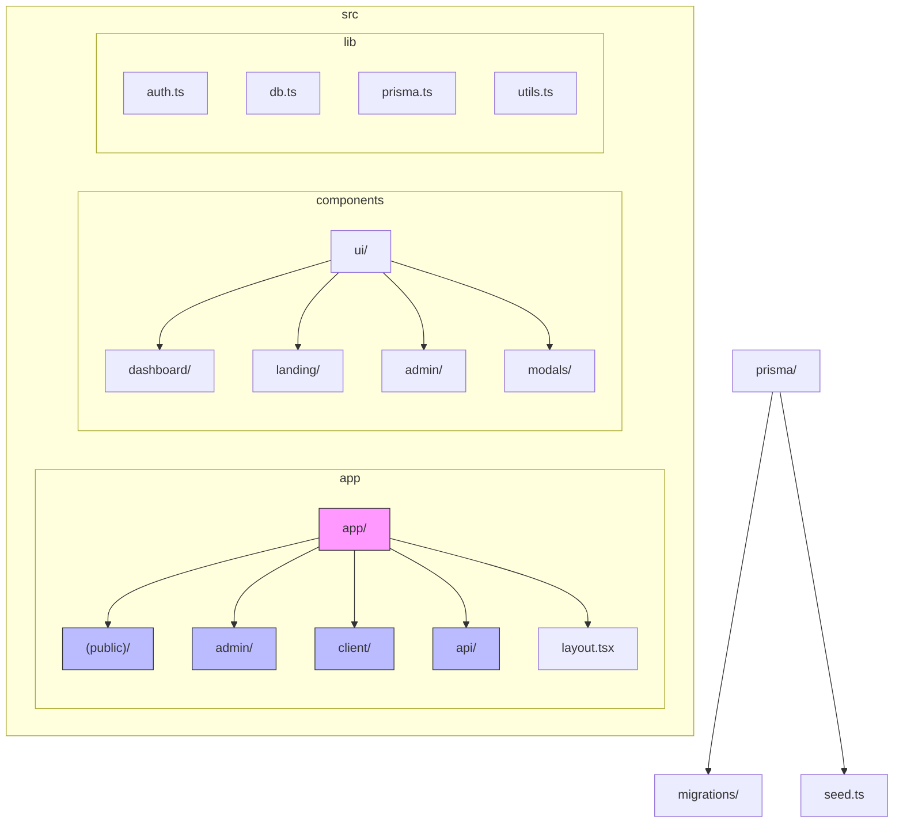
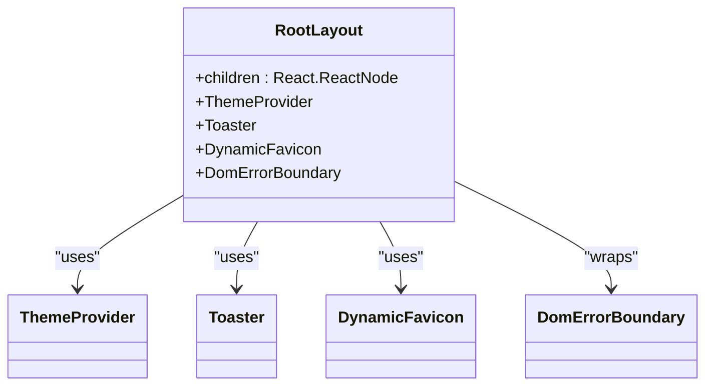
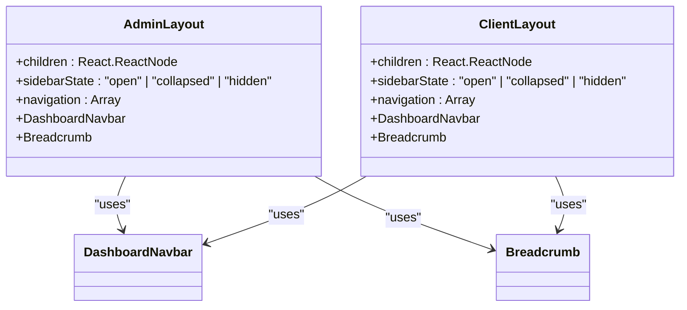
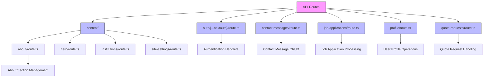
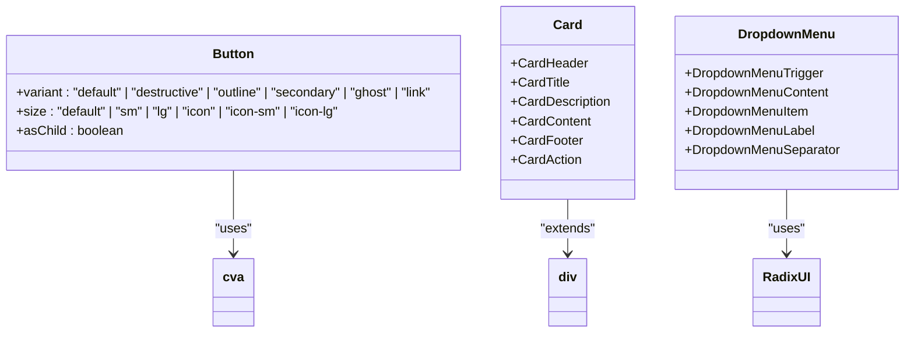
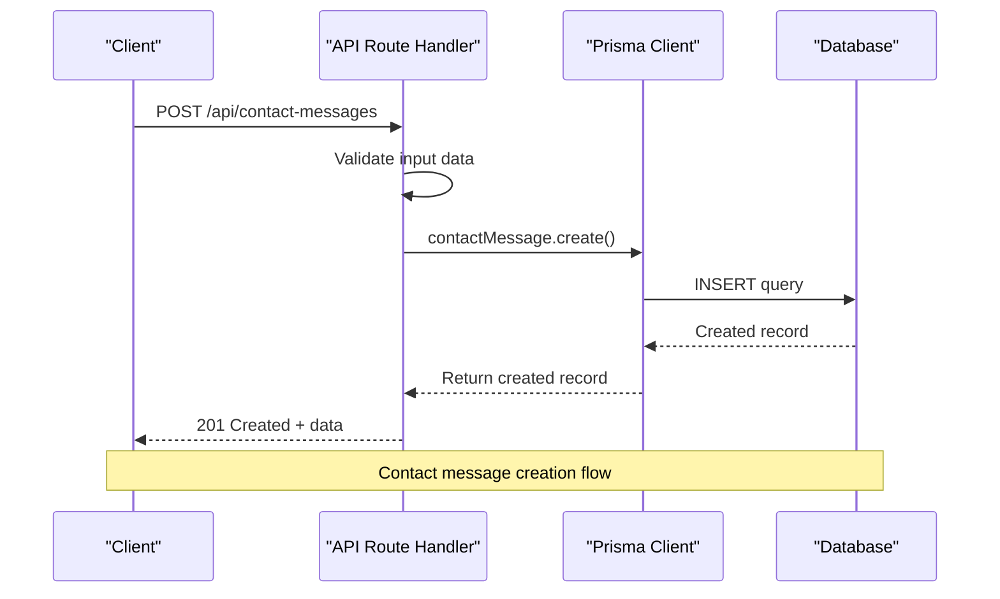
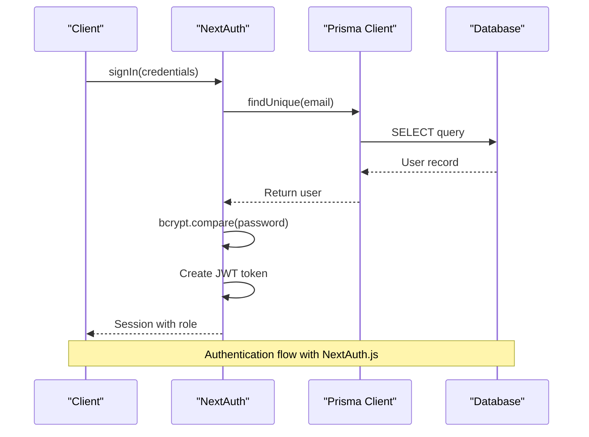

# Architecture

<cite>
**Referenced Files in This Document**   
- [layout.tsx](file://src/app/layout.tsx)
- [app/(public)/layout.tsx](file://src/app/(public)/layout.tsx)
- [app/admin/layout.tsx](file://src/app/admin/layout.tsx)
- [app/client/layout.tsx](file://src/app/client/layout.tsx)
- [lib/auth.ts](file://src/lib/auth.ts)
- [lib/db.ts](file://src/lib/db.ts)
- [app/api/auth/[...nextauth]/route.ts](file://src/app/api/auth/[...nextauth]/route.ts)
- [app/api/contact-messages/route.ts](file://src/app/api/contact-messages/route.ts)
- [app/api/content/about/route.ts](file://src/app/api/content/about/route.ts)
- [app/api/profile/route.ts](file://src/app/api/profile/route.ts)
- [components/ui/button.tsx](file://src/components/ui/button.tsx)
- [components/ui/card.tsx](file://src/components/ui/card.tsx)
- [components/dashboard/navbar.tsx](file://src/components/dashboard/navbar.tsx)
- [components/landing/navbar.tsx](file://src/components/landing/navbar.tsx)
- [components/admin/content-tabs/about-tab.tsx](file://src/components/admin/content-tabs/about-tab.tsx)
- [components/landing/about-section.tsx](file://src/components/landing/about-section.tsx)
</cite>

## Table of Contents
1. [Introduction](#introduction)
2. [Project Structure](#project-structure)
3. [Layout System](#layout-system)
4. [Routing Architecture](#routing-architecture)
5. [Component Architecture](#component-architecture)
6. [Data Flow and API Integration](#data-flow-and-api-integration)
7. [Authentication and Security](#authentication-and-security)
8. [Performance Optimization](#performance-optimization)
9. [Code Organization Principles](#code-organization-principles)
10. [Conclusion](#conclusion)

## Introduction
The smmm-system is a Next.js application built with the App Router architecture, designed to serve a professional accounting and financial consulting service. The system features distinct user roles (public, admin, and client) with dedicated layouts and routing. This document provides a comprehensive architectural overview of the system, focusing on the layout system, routing architecture, component organization, data flow, authentication, and performance optimization strategies implemented throughout the application.

## Project Structure
The project follows a standard Next.js App Router structure with clear separation of concerns. The application is organized into three main sections: public-facing pages, admin dashboard, and client portal. The src directory contains the app directory for routing, components for UI elements, and lib for utility functions and database connections. The Prisma ORM is used for database operations, with migrations and seed files properly configured.

**Diagram sources**
- [src/app/layout.tsx](file://src/app/layout.tsx#L1-L43)
- [src/components/ui/button.tsx](file://src/components/ui/button.tsx#L1-L61)

**Section sources**
- [src/app/layout.tsx](file://src/app/layout.tsx#L1-L43)
- [src/components/ui/button.tsx](file://src/components/ui/button.tsx#L1-L61)

## Layout System
The application implements a sophisticated layout system using Next.js App Router's nested layout capabilities. The system features three distinct layout hierarchies for different user roles: public, admin, and client. The root layout provides global UI elements and theme management, while role-specific layouts handle navigation and role-specific UI components.

### Root Layout
The root layout in src/app/layout.tsx serves as the foundation for the entire application. It wraps all pages with essential providers including ThemeProvider for dark/light mode toggling, Toaster for notifications, and DynamicFavicon for dynamic favicon management. The layout also includes error boundary handling through DomErrorBoundary to ensure graceful error recovery.

**Diagram sources**
- [src/app/layout.tsx](file://src/app/layout.tsx#L1-L43)

**Section sources**
- [src/app/layout.tsx](file://src/app/layout.tsx#L1-L43)

### Role-Specific Layouts
The application implements role-specific layouts for admin and client users, both of which are client components that manage interactive UI elements like navigation and user state. The admin layout provides access to administrative functions including content management, client management, and system settings, while the client layout offers access to personal account information, tax filings, and communication tools.

The admin and client layouts share a common design pattern with a collapsible sidebar navigation that adapts to user preferences. Both layouts include a dashboard navbar with user profile information, quick action links, and notification indicators for pending items. The layouts use Next.js navigation hooks to highlight active routes and provide a consistent user experience across the application.

**Diagram sources**
- [src/app/admin/layout.tsx](file://src/app/admin/layout.tsx#L1-L144)
- [src/app/client/layout.tsx](file://src/app/client/layout.tsx#L1-L133)

**Section sources**
- [src/app/admin/layout.tsx](file://src/app/admin/layout.tsx#L1-L144)
- [src/app/client/layout.tsx](file://src/app/client/layout.tsx#L1-L133)

## Routing Architecture
The application leverages Next.js App Router for a file-based routing system with clear organization and role-based access control. The routing architecture is divided into three main sections: public routes, admin routes, and client routes, each with their own layout and authentication requirements.

### Route Handlers
The API routes in src/app/api/ provide server-side endpoints for data operations, authentication, and content management. Each route handler follows the Next.js Route Handler pattern, exporting HTTP method handlers (GET, POST, PATCH, DELETE) for CRUD operations. The API routes integrate directly with Prisma for database operations and include proper error handling and validation.

The route handlers are organized by feature, with each feature having its own directory containing route.ts files. For example, contact-messages, content, job-applications, profile, and quote-requests each have dedicated API routes. The content management system includes nested routes for specific content sections like about, hero, institutions, and site-settings, allowing for granular control over different parts of the website.

**Diagram sources**
- [src/app/api/contact-messages/route.ts](file://src/app/api/contact-messages/route.ts#L1-L97)
- [src/app/api/content/about/route.ts](file://src/app/api/content/about/route.ts#L1-L190)
- [src/app/api/profile/route.ts](file://src/app/api/profile/route.ts#L1-L81)

**Section sources**
- [src/app/api/contact-messages/route.ts](file://src/app/api/contact-messages/route.ts#L1-L97)
- [src/app/api/content/about/route.ts](file://src/app/api/content/about/route.ts#L1-L190)
- [src/app/api/profile/route.ts](file://src/app/api/profile/route.ts#L1-L81)

## Component Architecture
The component architecture follows a modular design with clear separation between UI library components, feature-specific components, and layout components. The system is organized into several categories: UI components, dashboard components, landing page components, admin components, and modals.

### UI Component Library
The UI component library in src/components/ui/ provides a collection of reusable, accessible components built with Radix UI primitives and styled with Tailwind CSS. Components include Button, Card, Avatar, DropdownMenu, Dialog, Form, Input, and others. These components follow consistent design patterns and support various variants and sizes, enabling a cohesive user interface across the application.

The Button component, for example, uses class-variance-authority (cva) to define variants and sizes, allowing for consistent styling across the application. The Card component provides a structured layout with header, title, description, content, and footer sections, making it easy to create consistent information displays.

**Diagram sources**
- [src/components/ui/button.tsx](file://src/components/ui/button.tsx#L1-L61)
- [src/components/ui/card.tsx](file://src/components/ui/card.tsx#L1-L93)

**Section sources**
- [src/components/ui/button.tsx](file://src/components/ui/button.tsx#L1-L61)
- [src/components/ui/card.tsx](file://src/components/ui/card.tsx#L1-L93)

### Feature Components
Feature components are organized by their functional area, with dedicated directories for admin, client, dashboard, landing, and modals. Admin components include content management tabs for different sections of the website, while landing components provide the UI for public-facing pages. Dashboard components include shared elements like navbar and breadcrumb navigation used across admin and client interfaces.

The admin content tabs (about-tab, faq-tab, hero-section-tab, etc.) provide a tabbed interface for managing different content sections of the website. These components integrate with the corresponding API routes to fetch and update content, providing a rich content management experience for administrators.

## Data Flow and API Integration
The application implements a clear data flow pattern from HTTP requests through server-side processing to database operations and back to the client. This section documents the request lifecycle and integration points between different system components.

### Request Lifecycle
The request lifecycle begins with an HTTP request to a route handler in src/app/api/. The route handler processes the request, performs validation, and interacts with the Prisma database client to execute database operations. Results are returned as JSON responses to the client, which may be a browser or another service.

For example, when creating a new contact message, the client sends a POST request to /api/contact-messages with the message data. The route handler validates the input, creates a new record in the database, and returns the created message with a success status. Error handling is implemented at multiple levels to provide meaningful feedback to users.

**Diagram sources**
- [src/app/api/contact-messages/route.ts](file://src/app/api/contact-messages/route.ts#L1-L97)
- [src/lib/db.ts](file://src/lib/db.ts#L1-L10)

**Section sources**
- [src/app/api/contact-messages/route.ts](file://src/app/api/contact-messages/route.ts#L1-L97)
- [src/lib/db.ts](file://src/lib/db.ts#L1-L10)

### Database Integration
The application uses Prisma as an ORM for database operations, with a singleton pattern implemented in src/lib/db.ts to ensure efficient database connection management. The Prisma client is configured with a global instance to prevent connection leaks in development, while using a new instance in production.

The database schema includes models for users, contact messages, job applications, quote requests, and various content sections (about, hero, institutions, etc.). Relationships between models are properly defined, enabling efficient data retrieval and manipulation through Prisma's relation queries.

## Authentication and Security
The application implements a robust authentication system using NextAuth.js with credentials-based login. The authentication architecture provides secure user management, role-based access control, and session management.

### Authentication Flow
The authentication system is configured in src/lib/auth.ts using NextAuth.js with a credentials provider. User authentication occurs through email and password, with passwords securely hashed using bcryptjs. The Prisma adapter integrates NextAuth.js with the database for user storage and retrieval.

Upon successful authentication, a JWT token is created containing the user's ID and role. This token is used to maintain the user session and authorize access to protected routes. The session callback enriches the session object with user role information, enabling role-based UI rendering and access control.

**Diagram sources**
- [src/lib/auth.ts](file://src/lib/auth.ts#L1-L87)
- [src/app/api/auth/[...nextauth]/route.ts](file://src/app/api/auth/[...nextauth]/route.ts#L1-L4)

**Section sources**
- [src/lib/auth.ts](file://src/lib/auth.ts#L1-L87)
- [src/app/api/auth/[...nextauth]/route.ts](file://src/app/api/auth/[...nextauth]/route.ts#L1-L4)

### Security Boundaries
The application implements several security measures to protect user data and system integrity. Route handlers include input validation and error handling to prevent common vulnerabilities. The use of server components for data fetching and API routes ensures that sensitive operations occur on the server side, protecting database credentials and business logic.

Role-based access control is implemented through the user role field stored in the JWT token. This enables the application to render appropriate UI elements and restrict access to certain routes based on user role. The admin and client sections are completely separate, preventing unauthorized access to administrative functions.

## Performance Optimization
The application leverages Next.js features for performance optimization, including server-side rendering, static generation, and efficient data fetching strategies.

### Server-Side Rendering
The application uses server components for data fetching and rendering, which improves performance by reducing client-side JavaScript bundle size and enabling faster initial page loads. Server components can directly access the database and API routes without requiring client-side fetch calls, reducing network overhead.

The root layout and public pages are rendered on the server, allowing search engines to index content and improving perceived performance for users. Data required for rendering is fetched during the server-side rendering process, eliminating the need for additional client-side requests.

### Client-Side Interactivity
Client components are used strategically for interactive elements like navigation, forms, and dynamic content updates. The admin and client layouts are client components that manage state for sidebar visibility, user preferences, and real-time updates.

The dashboard navbar includes real-time counters for pending items (quote requests, contact messages, job applications) that are updated every 30 seconds. This provides users with up-to-date information without requiring manual page refreshes, enhancing the user experience while maintaining performance.

## Code Organization Principles
The application follows several key code organization principles that contribute to maintainability, scalability, and developer experience.

### Feature-Based Organization
Components and routes are organized by feature rather than by type, making it easier to locate related code. For example, all admin-related components are in the admin directory, while all landing page components are in the landing directory. This reduces cognitive load when working on specific features and enables better code isolation.

### Separation of Concerns
The application maintains a clear separation between different types of components:
- UI components: Reusable, styled elements in src/components/ui
- Layout components: Structural elements that define page structure
- Feature components: Components specific to business functionality
- Utility functions: Shared logic in src/lib

This separation ensures that changes to one part of the system have minimal impact on others, reducing the risk of unintended side effects.

### Consistent Patterns
The application uses consistent patterns across similar components:
- API routes follow a standard CRUD pattern with proper error handling
- Forms use react-hook-form with Zod validation
- UI components use class-variance-authority for variant management
- Icons from lucide-react for a consistent visual language

These patterns make the codebase more predictable and easier to understand for new developers.

## Conclusion
The smmm-system architecture demonstrates a well-structured Next.js application that effectively leverages the App Router, server components, and modern React patterns. The nested layout system provides a consistent user experience across different user roles, while the component architecture promotes reusability and maintainability. The integration of Prisma with NextAuth.js provides a robust foundation for data management and authentication, and the clear separation of concerns enables efficient development and scaling. By following Next.js best practices and implementing thoughtful performance optimizations, the application delivers a responsive and secure experience for both administrators and clients.