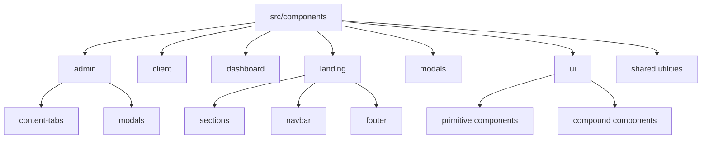
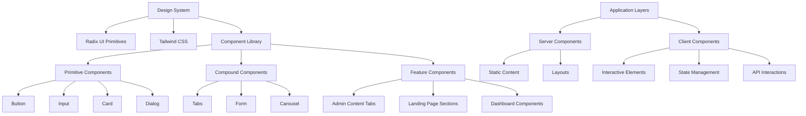
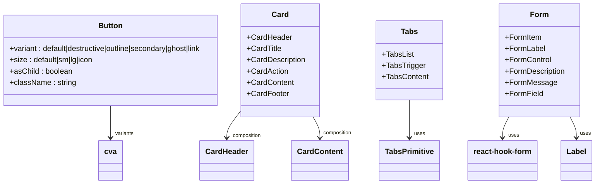
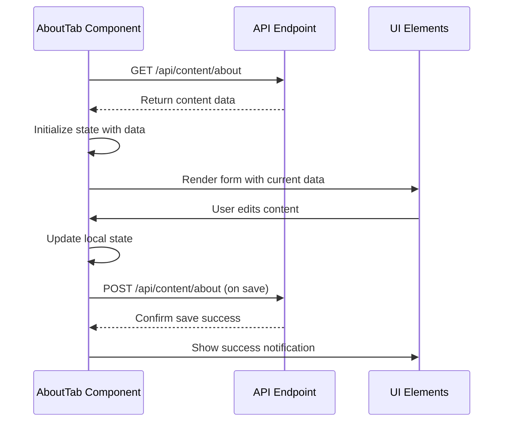
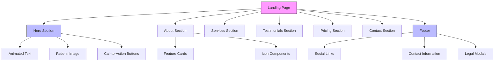
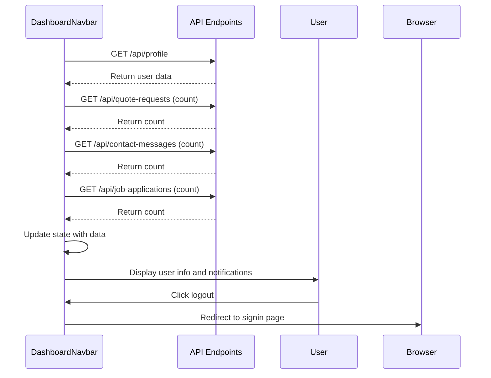
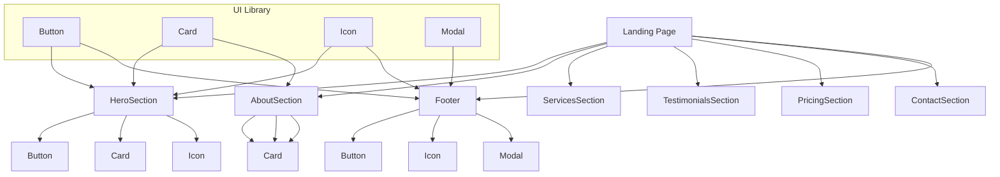
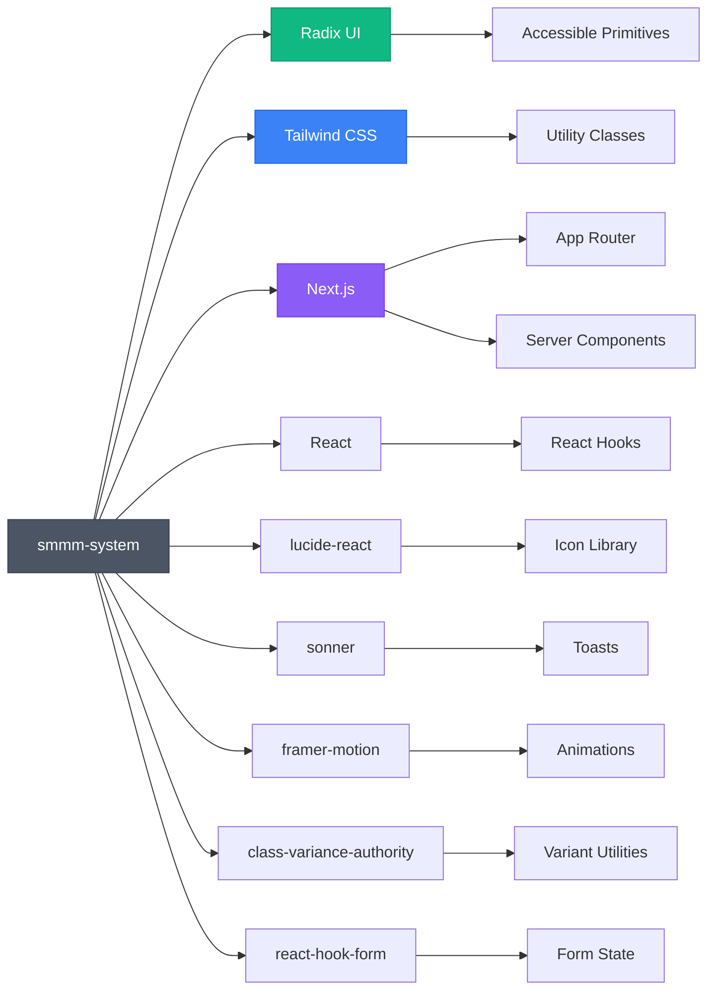

# Component Architecture

<cite>
**Referenced Files in This Document**   
- [button.tsx](file://src/components/ui/button.tsx)
- [card.tsx](file://src/components/ui/card.tsx)
- [tabs.tsx](file://src/components/ui/tabs.tsx)
- [form.tsx](file://src/components/ui/form.tsx)
- [label.tsx](file://src/components/ui/label.tsx)
- [about-tab.tsx](file://src/components/admin/content-tabs/about-tab.tsx)
- [hero-section.tsx](file://src/components/landing/hero-section.tsx)
- [footer.tsx](file://src/components/landing/footer.tsx)
- [client-logo-carousel.tsx](file://src/components/client/client-logo-carousel.tsx)
- [dashboard-navbar.tsx](file://src/components/dashboard/navbar.tsx)
- [quote-request-modal.tsx](file://src/components/modals/quote-request-modal.tsx)
- [layout.tsx](file://src/app/layout.tsx)
- [components.json](file://components.json)
- [utils.ts](file://src/lib/utils.ts)
</cite>

## Table of Contents
1. [Introduction](#introduction)
2. [Project Structure](#project-structure)
3. [Core Components](#core-components)
4. [Architecture Overview](#architecture-overview)
5. [Detailed Component Analysis](#detailed-component-analysis)
6. [Dependency Analysis](#dependency-analysis)
7. [Performance Considerations](#performance-considerations)
8. [Troubleshooting Guide](#troubleshooting-guide)
9. [Conclusion](#conclusion)

## Introduction
This document provides comprehensive architectural documentation for the component architecture of the smmm-system. It details the organization of components into feature-based directories, the implementation of the design system using Radix UI primitives and Tailwind CSS, and the application of the container/presentation pattern. The documentation covers server and client component usage patterns, accessibility implementation, responsive design approaches, and performance optimization strategies through lazy loading and code splitting.

## Project Structure

The smmm-system follows a feature-based directory organization with clear separation of concerns. Components are organized into distinct directories based on their functionality and usage context.

**Diagram sources**
- [src/components/admin](file://src/components/admin)
- [src/components/client](file://src/components/client)
- [src/components/landing](file://src/components/landing)
- [src/components/ui](file://src/components/ui)

**Section sources**
- [src/components](file://src/components)

## Core Components

The component architecture is built around reusable UI primitives from the Radix UI library, extended with Tailwind CSS for styling. The system implements a clear separation between primitive UI components in the `ui` directory and higher-level feature components organized by context (admin, client, dashboard, landing). Server components are used for static content rendering, while client components handle interactive elements with state management and API interactions.

**Section sources**
- [src/components/ui](file://src/components/ui)
- [src/components](file://src/components)

## Architecture Overview

The component architecture follows a layered approach with reusable UI primitives at the foundation, feature-specific components at the intermediate layer, and page-level compositions at the top layer. The system leverages Next.js App Router conventions with server components for static content and client components for interactive elements.

**Diagram sources**
- [components.json](file://components.json)
- [src/components/ui](file://src/components/ui)
- [src/app](file://src/app)

## Detailed Component Analysis

### UI Component Library Analysis

The UI component library in `src/components/ui` implements a design system using Radix UI primitives enhanced with Tailwind CSS. This approach combines accessible, unstyled base components with utility-first styling for consistent visual design.

**Diagram sources**
- [button.tsx](file://src/components/ui/button.tsx)
- [card.tsx](file://src/components/ui/card.tsx)
- [tabs.tsx](file://src/components/ui/tabs.tsx)
- [form.tsx](file://src/components/ui/form.tsx)
- [label.tsx](file://src/components/ui/label.tsx)

**Section sources**
- [src/components/ui](file://src/components/ui)

### Admin Content Tabs Analysis

The admin content tabs implement the container/presentation pattern, with container components managing state and API interactions while presentation components handle rendering. Each tab component (e.g., AboutTab) fetches data from corresponding API endpoints and provides an interface for content management.

**Diagram sources**
- [about-tab.tsx](file://src/components/admin/content-tabs/about-tab.tsx)
- [src/app/api/content/about/route.ts](file://src/app/api/content/about/route.ts)

**Section sources**
- [about-tab.tsx](file://src/components/admin/content-tabs/about-tab.tsx)

### Landing Page Components Analysis

Landing page components follow a composition pattern where individual section components are assembled to create the complete landing page. These components use client-side rendering for interactive elements while maintaining server-rendered content for SEO and performance.

**Diagram sources**
- [hero-section.tsx](file://src/components/landing/hero-section.tsx)
- [footer.tsx](file://src/components/landing/footer.tsx)
- [src/components/landing](file://src/components/landing)

**Section sources**
- [hero-section.tsx](file://src/components/landing/hero-section.tsx)
- [footer.tsx](file://src/components/landing/footer.tsx)

### Client Component Usage Analysis

Client components are used for interactive elements that require state management, animations, and API interactions. The dashboard navbar and modals demonstrate the use of client components for dynamic user interfaces.

**Diagram sources**
- [dashboard-navbar.tsx](file://src/components/dashboard/navbar.tsx)
- [src/app/api/profile/route.ts](file://src/app/api/profile/route.ts)

**Section sources**
- [dashboard-navbar.tsx](file://src/components/dashboard/navbar.tsx)

### Component Composition Patterns

The system demonstrates effective component composition patterns, particularly in the assembly of landing page sections from individual components. This approach promotes reusability and maintainability.

**Diagram sources**
- [hero-section.tsx](file://src/components/landing/hero-section.tsx)
- [footer.tsx](file://src/components/landing/footer.tsx)
- [client-logo-carousel.tsx](file://src/components/client/client-logo-carousel.tsx)

**Section sources**
- [hero-section.tsx](file://src/components/landing/hero-section.tsx)
- [footer.tsx](file://src/components/landing/footer.tsx)
- [client-logo-carousel.tsx](file://src/components/client/client-logo-carousel.tsx)

## Dependency Analysis

The component architecture demonstrates a clear dependency hierarchy with well-defined relationships between components and external libraries.

**Diagram sources**
- [components.json](file://components.json)
- [package.json](file://package.json)
- [src/components/ui](file://src/components/ui)

**Section sources**
- [components.json](file://components.json)
- [package.json](file://package.json)

## Performance Considerations

The component architecture incorporates several performance optimization strategies:

1. **Code Splitting**: Components are organized in a modular structure that enables code splitting by feature area.
2. **Lazy Loading**: Interactive components are implemented as client components, allowing for selective hydration.
3. **Efficient Rendering**: The use of React.memo and useCallback where appropriate to prevent unnecessary re-renders.
4. **Optimized Imports**: Direct imports of specific components rather than entire libraries.
5. **Conditional Loading**: Components like the client logo carousel implement loading states and error handling.

The architecture also leverages Next.js features for performance:
- Server-side rendering for static content
- Client-side rendering for interactive elements
- Automatic code splitting by route
- Image optimization through Next.js Image component

**Section sources**
- [client-logo-carousel.tsx](file://src/components/client/client-logo-carousel.tsx)
- [hero-section.tsx](file://src/components/landing/hero-section.tsx)
- [layout.tsx](file://src/app/layout.tsx)

## Troubleshooting Guide

Common issues and solutions for the component architecture:

1. **Component Not Rendering**: Ensure the component is properly imported and the file path is correct. Check for any TypeScript errors in the component file.

2. **Styling Issues**: Verify that the Tailwind CSS classes are correctly applied and that the `cn` utility function is being used properly for class merging.

3. **API Integration Problems**: Check that the API endpoints are correctly configured and that the fetch calls include proper error handling.

4. **State Management Issues**: For client components, ensure that useState and useEffect hooks are properly implemented with appropriate dependencies.

5. **Accessibility Concerns**: Verify that all interactive elements have proper ARIA attributes and that keyboard navigation is supported.

6. **Performance Bottlenecks**: Use React DevTools to identify unnecessary re-renders and implement memoization where appropriate.

**Section sources**
- [about-tab.tsx](file://src/components/admin/content-tabs/about-tab.tsx)
- [dashboard-navbar.tsx](file://src/components/dashboard/navbar.tsx)
- [utils.ts](file://src/lib/utils.ts)

## Conclusion

The smmm-system component architecture demonstrates a well-structured approach to building a modern web application with Next.js. The feature-based directory organization promotes maintainability and scalability. The design system implementation using Radix UI primitives and Tailwind CSS ensures consistent, accessible UI components. The strategic use of server and client components optimizes performance while enabling rich interactivity. The container/presentation pattern in admin content tabs separates concerns effectively, making the codebase more testable and maintainable. Overall, the architecture provides a solid foundation for future development and scaling of the application.