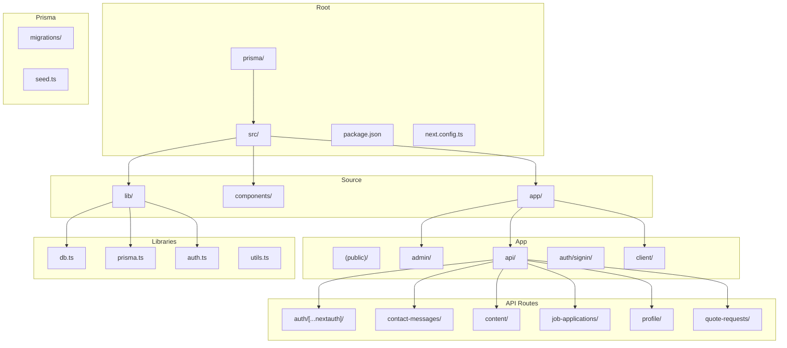
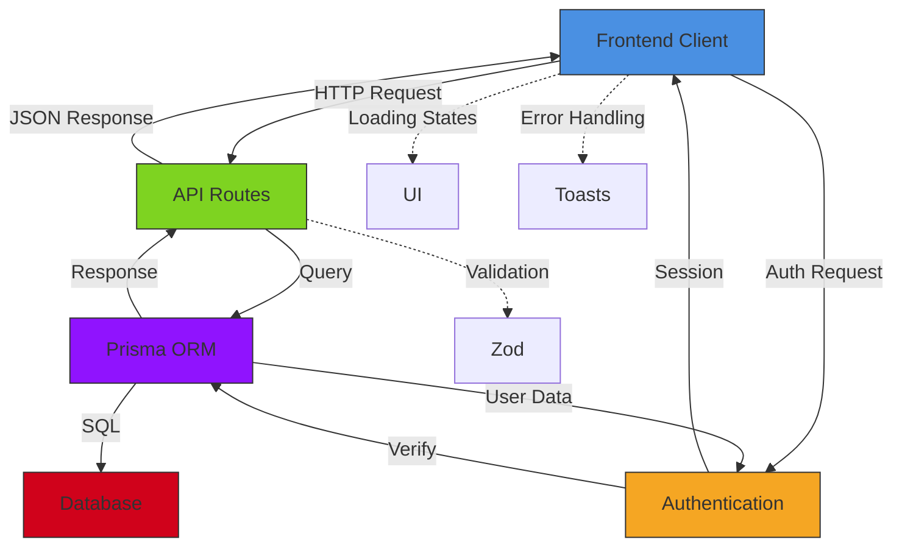
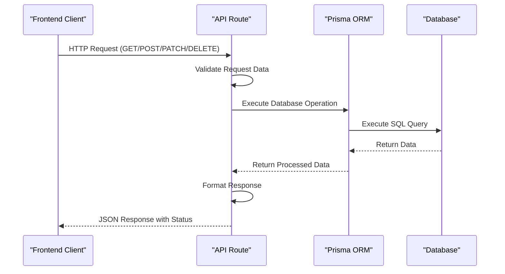
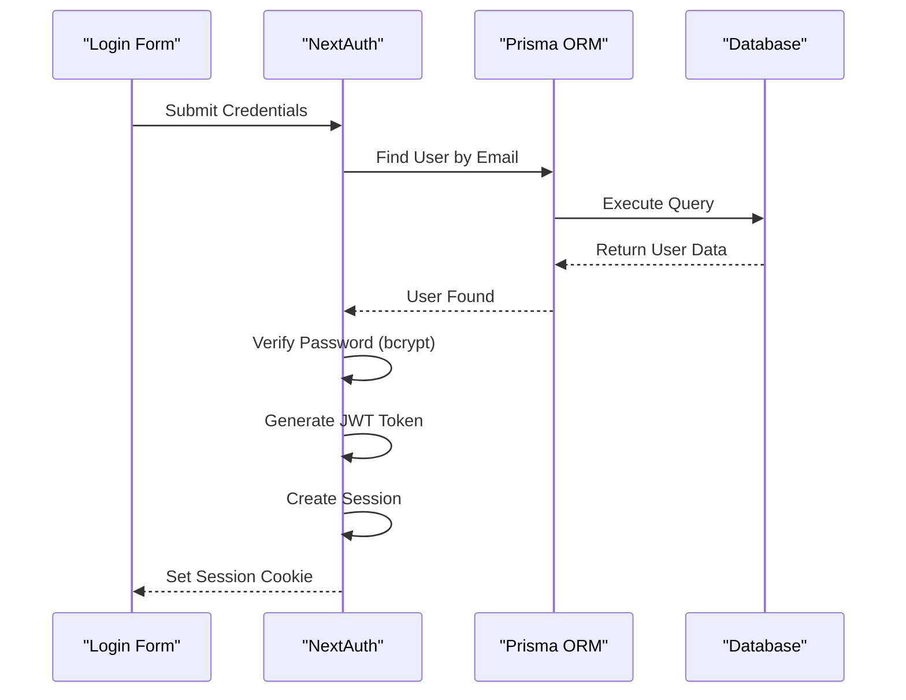
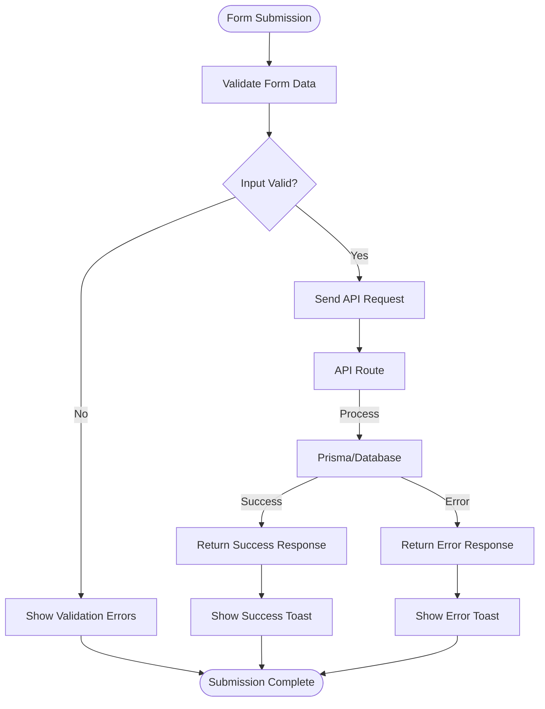
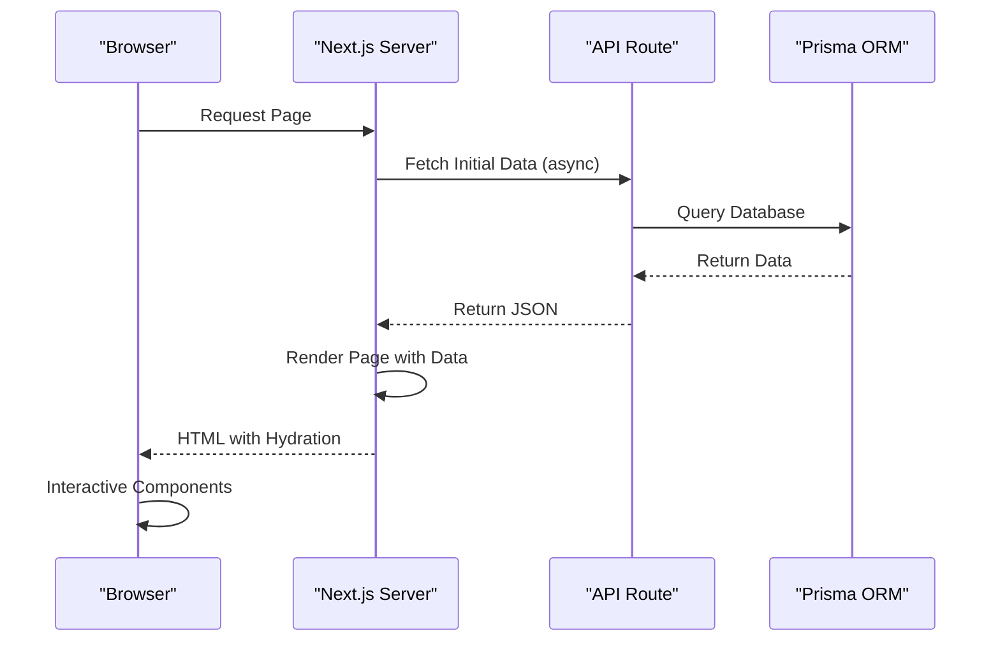
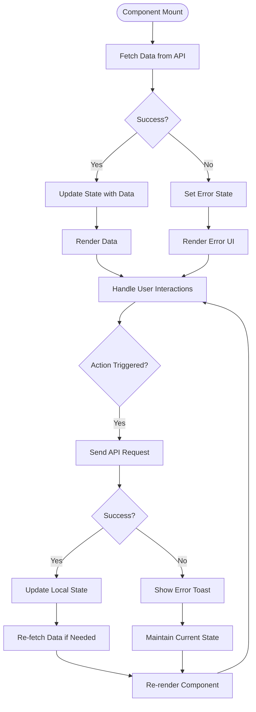
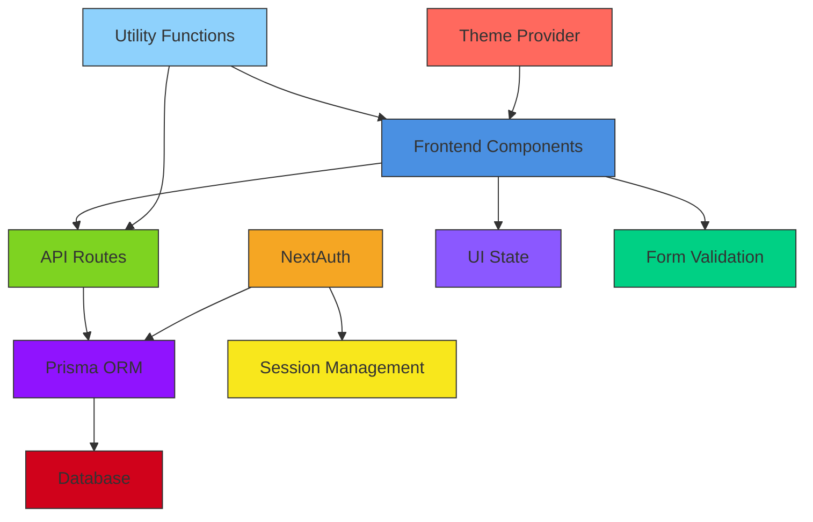

# Data Flow Architecture

<cite>
**Referenced Files in This Document**   
- [layout.tsx](file://src/app/layout.tsx)
- [db.ts](file://src/lib/db.ts)
- [prisma.ts](file://src/lib/prisma.ts)
- [auth.ts](file://src/lib/auth.ts)
- [route.ts](file://src/app/api/auth/[...nextauth]/route.ts)
- [about/route.ts](file://src/app/api/content/about/route.ts)
- [site-settings/route.ts](file://src/app/api/content/site-settings/route.ts)
- [contact-messages/route.ts](file://src/app/api/contact-messages/route.ts)
- [job-applications/route.ts](file://src/app/api/job-applications/route.ts)
- [profile/route.ts](file://src/app/api/profile/route.ts)
- [quote-requests/route.ts](file://src/app/api/quote-requests/route.ts)
- [page.tsx](file://src/app/admin/content/page.tsx)
- [about-tab.tsx](file://src/components/admin/content-tabs/about-tab.tsx)
- [profile/page.tsx](file://src/app/client/profile/page.tsx)
- [quote-request-modal.tsx](file://src/components/modals/quote-request-modal.tsx)
- [contact-message-modal.tsx](file://src/components/admin/contact-message-modal.tsx)
</cite>

## Table of Contents
1. [Introduction](#introduction)
2. [Project Structure](#project-structure)
3. [Core Components](#core-components)
4. [Architecture Overview](#architecture-overview)
5. [Detailed Component Analysis](#detailed-component-analysis)
6. [Dependency Analysis](#dependency-analysis)
7. [Performance Considerations](#performance-considerations)
8. [Troubleshooting Guide](#troubleshooting-guide)
9. [Conclusion](#conclusion)

## Introduction
This document provides comprehensive architectural documentation for the data flow architecture in the smmm-system. It maps the complete data lifecycle from HTTP requests in API routes to database persistence via Prisma ORM and back to frontend rendering. The documentation covers server-side data fetching patterns using async components, the separation between data-fetching logic in API routes versus client-side data synchronization, authentication data flow with NextAuth including session management and role-based data access, form submissions from client components flowing through API endpoints to database operations, error handling patterns, loading states, and data validation using Zod in the data flow pipeline.

## Project Structure

**Diagram sources**
- [src/app](file://src/app)
- [src/lib](file://src/lib)
- [prisma](file://prisma)

**Section sources**
- [src/app](file://src/app)
- [src/lib](file://src/lib)

## Core Components

The smmm-system implements a Next.js application with a comprehensive data flow architecture that handles content management, user authentication, form submissions, and database operations through Prisma ORM. The core components include API routes for handling HTTP requests, server-side data fetching for content rendering, authentication flows with NextAuth, and client-side components for user interaction.

The system follows a clear separation of concerns between data-fetching logic in API routes and client-side data synchronization. API routes serve as the entry points for all data operations, handling CRUD operations and connecting to the database through Prisma. Client components consume these API endpoints to display and modify data, implementing proper loading states, error handling, and form validation.

**Section sources**
- [src/app/api](file://src/app/api)
- [src/components](file://src/components)
- [src/lib](file://src/lib)

## Architecture Overview

**Diagram sources**
- [src/app/api](file://src/app/api)
- [src/lib/auth.ts](file://src/lib/auth.ts)
- [src/lib/prisma.ts](file://src/lib/prisma.ts)
- [src/components/ui](file://src/components/ui)

## Detailed Component Analysis

### API Routes Data Flow
The API routes in the smmm-system handle all data operations between the frontend and database. Each route follows a consistent pattern of receiving HTTP requests, processing data, interacting with the database through Prisma, and returning appropriate responses.

**Diagram sources**
- [src/app/api/content/about/route.ts](file://src/app/api/content/about/route.ts)
- [src/app/api/contact-messages/route.ts](file://src/app/api/contact-messages/route.ts)
- [src/app/api/job-applications/route.ts](file://src/app/api/job-applications/route.ts)

**Section sources**
- [src/app/api](file://src/app/api)

### Authentication Data Flow
The authentication system uses NextAuth with a Prisma adapter to manage user sessions and role-based access control. The flow begins with credential validation and continues through JWT token generation and session management.

**Diagram sources**
- [src/lib/auth.ts](file://src/lib/auth.ts)
- [src/app/api/auth/[...nextauth]/route.ts](file://src/app/api/auth/[...nextauth]/route.ts)

**Section sources**
- [src/lib/auth.ts](file://src/lib/auth.ts)

### Form Submission Flow
Form submissions follow a structured data flow from client components through API endpoints to database persistence. The system implements proper validation, error handling, and user feedback throughout the process.

**Diagram sources**
- [src/components/modals/quote-request-modal.tsx](file://src/components/modals/quote-request-modal.tsx)
- [src/app/api/quote-requests/route.ts](file://src/app/api/quote-requests/route.ts)

**Section sources**
- [src/components/modals/quote-request-modal.tsx](file://src/components/modals/quote-request-modal.tsx)
- [src/app/api/quote-requests/route.ts](file://src/app/api/quote-requests/route.ts)

### Server-Side Data Fetching
The system implements server-side data fetching patterns using async components and API routes to retrieve data before rendering. This ensures optimal performance and SEO benefits.

**Diagram sources**
- [src/app/admin/content/page.tsx](file://src/app/admin/content/page.tsx)
- [src/components/admin/content-tabs/about-tab.tsx](file://src/components/admin/content-tabs/about-tab.tsx)

**Section sources**
- [src/app/admin/content/page.tsx](file://src/app/admin/content/page.tsx)

### Client-Side Data Synchronization
Client components implement data synchronization patterns to keep the UI updated with the latest data from the server, handling loading states and error conditions appropriately.

**Diagram sources**
- [src/app/client/profile/page.tsx](file://src/app/client/profile/page.tsx)
- [src/app/api/profile/route.ts](file://src/app/api/profile/route.ts)

**Section sources**
- [src/app/client/profile/page.tsx](file://src/app/client/profile/page.tsx)

## Dependency Analysis

**Diagram sources**
- [package.json](file://package.json)
- [src/lib](file://src/lib)
- [src/components](file://src/components)

**Section sources**
- [package.json](file://package.json)
- [src/lib](file://src/lib)

## Performance Considerations
The smmm-system implements several performance optimizations in its data flow architecture. API routes are designed to handle data operations efficiently with proper database indexing through Prisma. The system uses connection pooling and caching patterns to minimize database load. Client components implement loading states to provide immediate feedback during data operations, and error boundaries prevent application crashes. The use of Next.js enables server-side rendering for improved initial load performance and SEO. Data fetching is optimized by retrieving only necessary fields and using appropriate query patterns to minimize payload size.

## Troubleshooting Guide

Common issues in the data flow architecture and their solutions:

1. **API Route Not Responding**
   - Check if the route file is correctly named and located in the `src/app/api` directory
   - Verify the HTTP method handlers (GET, POST, etc.) are properly exported
   - Check server logs for error messages

2. **Database Connection Issues**
   - Ensure Prisma client is properly initialized in `db.ts` and `prisma.ts`
   - Verify database connection string in environment variables
   - Check if Prisma migrations have been applied

3. **Authentication Failures**
   - Verify NextAuth configuration in `auth.ts`
   - Check if the Prisma adapter is properly configured
   - Ensure session strategy is correctly set (JWT in this case)

4. **Form Submission Errors**
   - Validate that form data matches the expected schema
   - Check API route validation logic
   - Verify proper error handling and user feedback

5. **Data Synchronization Issues**
   - Ensure client components properly handle loading and error states
   - Verify API responses include necessary data for UI updates
   - Check for proper state management after data mutations

**Section sources**
- [src/app/api](file://src/app/api)
- [src/lib/auth.ts](file://src/lib/auth.ts)
- [src/components](file://src/components)

## Conclusion
The smmm-system implements a robust data flow architecture that effectively manages the complete lifecycle of data from HTTP requests to database persistence and back to frontend rendering. The system follows best practices for Next.js applications, with clear separation between API routes and client components, proper authentication flows using NextAuth, and efficient data operations through Prisma ORM. The architecture supports server-side data fetching for optimal performance while providing responsive client-side interactions with proper loading states and error handling. Form submissions are handled securely with validation and user feedback, and the system implements role-based access control for data security. This comprehensive data flow architecture provides a solid foundation for the application's content management and user interaction features.