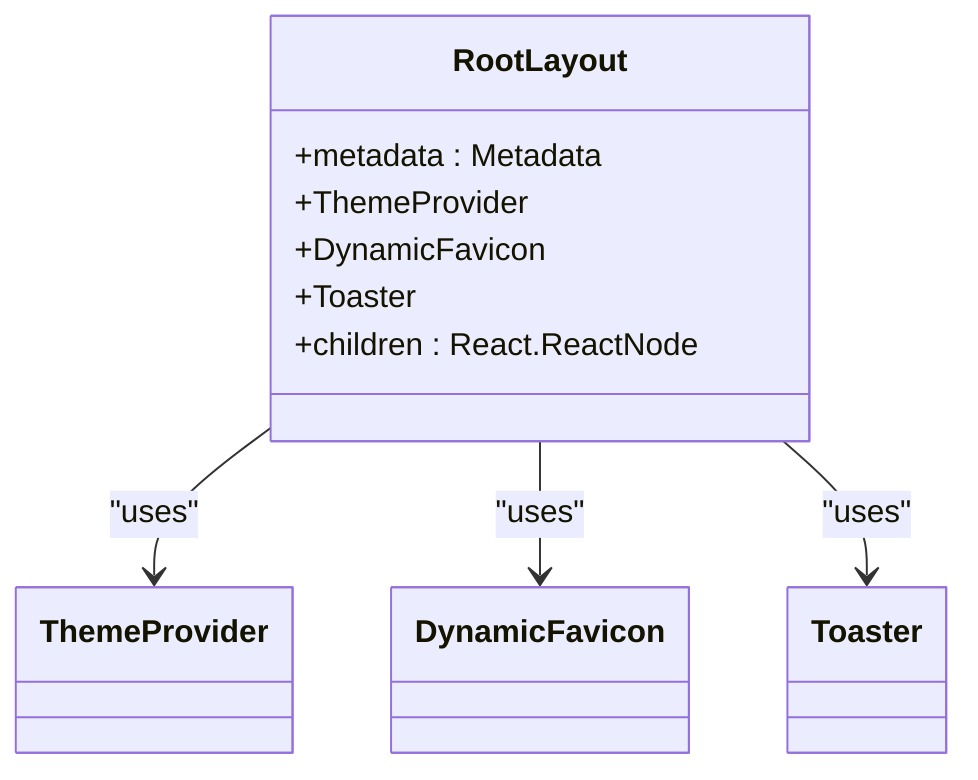
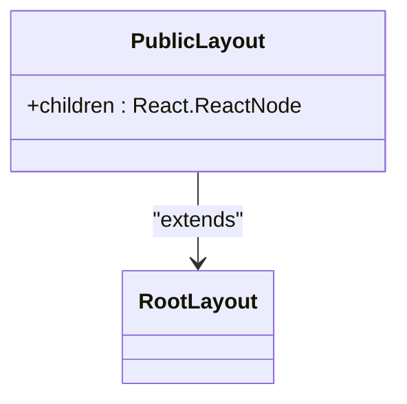
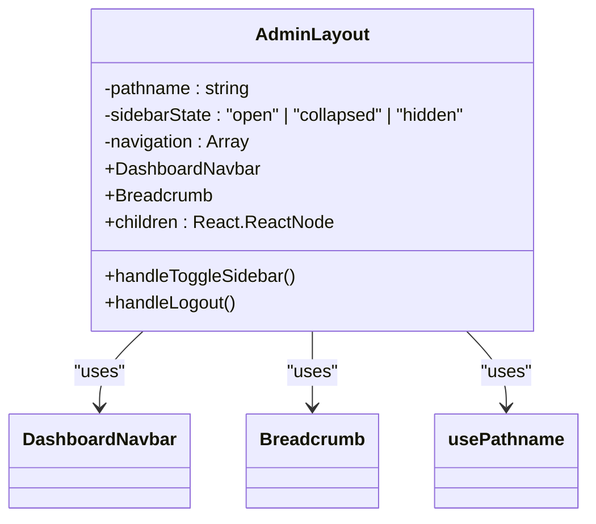
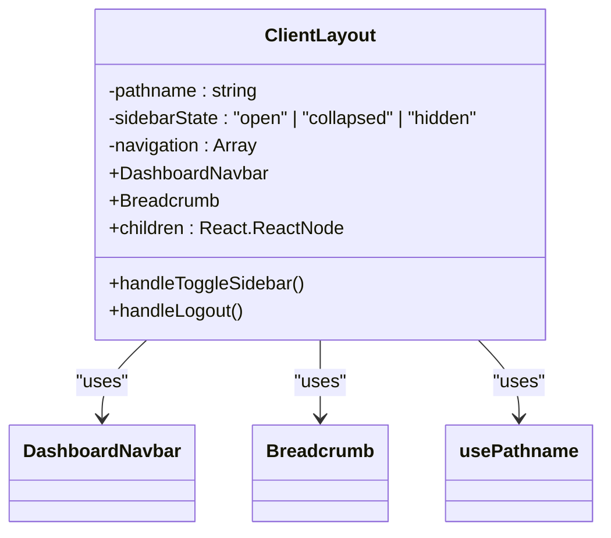
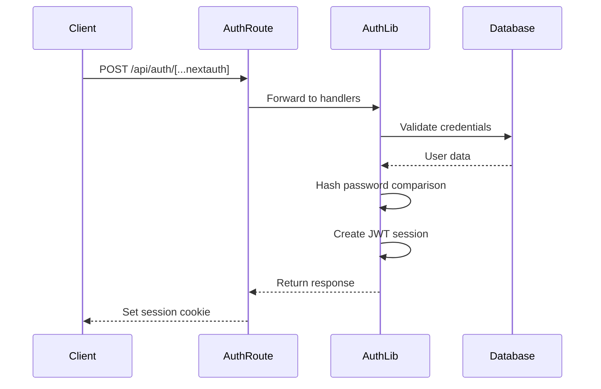
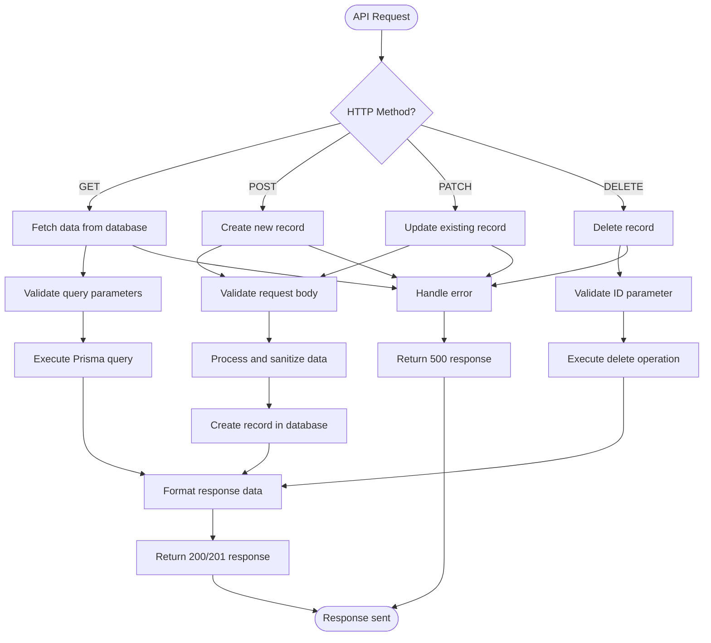
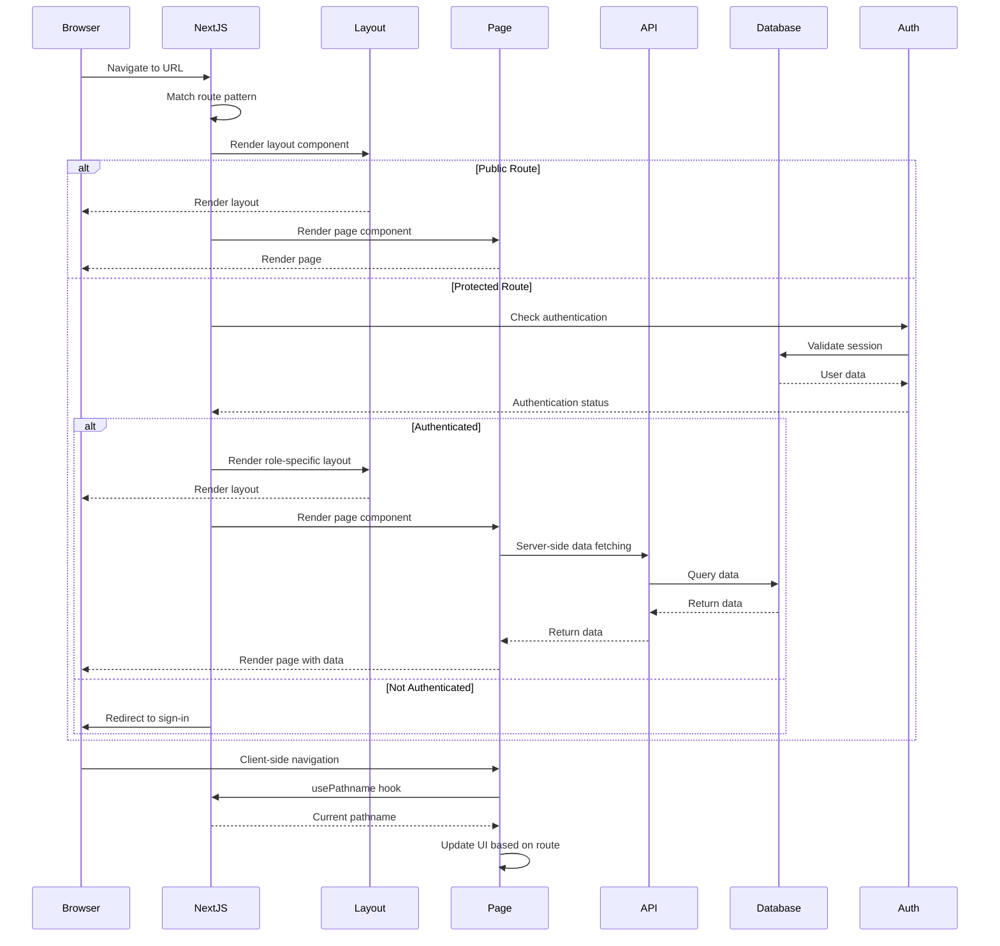
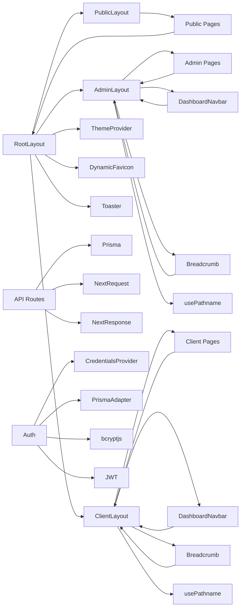

# Routing Architecture

<cite>
**Referenced Files in This Document**   
- [layout.tsx](file://src/app/layout.tsx)
- [layout.tsx](file://src/app/(public)/layout.tsx)
- [layout.tsx](file://src/app/admin/layout.tsx)
- [layout.tsx](file://src/app/client/layout.tsx)
- [page.tsx](file://src/app/admin/page.tsx)
- [page.tsx](file://src/app/client/page.tsx)
- [signin/page.tsx](file://src/app/auth/signin/page.tsx)
- [route.ts](file://src/app/api/auth/[...nextauth]/route.ts)
- [auth.ts](file://src/lib/auth.ts)
- [route.ts](file://src/app/api/contact-messages/route.ts)
- [route.ts](file://src/app/api/content/about/route.ts)
- [route.ts](file://src/app/api/content/hero/reorder/route.ts)
</cite>

## Table of Contents
1. [Introduction](#introduction)
2. [Project Structure](#project-structure)
3. [Core Components](#core-components)
4. [Architecture Overview](#architecture-overview)
5. [Detailed Component Analysis](#detailed-component-analysis)
6. [Dependency Analysis](#dependency-analysis)
7. [Performance Considerations](#performance-considerations)
8. [Troubleshooting Guide](#troubleshooting-guide)
9. [Conclusion](#conclusion)

## Introduction
This document provides comprehensive architectural documentation for the Next.js App Router routing system in the smmm-system application. The system implements a role-based routing architecture with distinct interfaces for public visitors, administrators, and clients. The routing structure leverages Next.js App Router conventions with nested layouts, dynamic API routes, and authentication integration to create a secure, scalable application with shared UI components and role-specific experiences.

## Project Structure

```mermaid
graph TD
A[src/app] --> B[(public)]
A --> C[admin]
A --> D[client]
A --> E[api]
A --> F[auth/signin]
A --> G[layout.tsx]
B --> H[layout.tsx]
B --> I[page.tsx]
C --> J[layout.tsx]
C --> K[page.tsx]
C --> L[contact-messages]
C --> M[content]
C --> N[job-applications]
C --> O[profile]
C --> P[quote-requests]
D --> Q[layout.tsx]
D --> R[page.tsx]
D --> S[profile]
E --> T[auth/[...nextauth]]
E --> U[contact-messages]
E --> V[content]
E --> W[job-applications]
E --> X[profile]
E --> Y[quote-requests]
T --> Z[route.ts]
U --> AA[route.ts]
V --> AB[about/route.ts]
V --> AC[hero/reorder/route.ts]
V --> AD[hero/route.ts]
V --> AE[institutions/route.ts]
V --> AF[institutions/reorder/route.ts]
V --> AG[site-settings/route.ts]
```

**Diagram sources**
- [src/app](file://src/app)
- [src/app/admin](file://src/app/admin)
- [src/app/api](file://src/app/api)

**Section sources**
- [src/app](file://src/app)

## Core Components

The routing system in smmm-system is built around several core components that enable the nested layout structure, role-based access, and API route handling. The application uses Next.js App Router conventions with folder-based routing, layout components for shared UI, and API routes for server-side operations. The authentication system is integrated with NextAuth.js, providing secure access control across different user roles.

**Section sources**
- [layout.tsx](file://src/app/layout.tsx)
- [auth.ts](file://src/lib/auth.ts)
- [route.ts](file://src/app/api/auth/[...nextauth]/route.ts)

## Architecture Overview

```mermaid
graph TB
subgraph "Client-Side"
A[URL Request] --> B{Route Match}
B --> C[/admin/*]
B --> D[/client/*]
B --> E[/api/*]
B --> F[/public/*]
end
subgraph "Server-Side"
C --> G[AdminLayout]
D --> H[ClientLayout]
E --> I[API Route Handler]
F --> J[PublicLayout]
G --> K[Admin Dashboard]
H --> L[Client Dashboard]
I --> M[Database Operations]
J --> N[Public Page]
end
subgraph "Authentication"
O[NextAuth] --> P[Credentials Provider]
P --> Q[Prisma Adapter]
Q --> R[Database]
end
A --> O
O --> C
O --> D
O --> I
```

**Diagram sources**
- [layout.tsx](file://src/app/admin/layout.tsx)
- [layout.tsx](file://src/app/client/layout.tsx)
- [layout.tsx](file://src/app/(public)/layout.tsx)
- [auth.ts](file://src/lib/auth.ts)

## Detailed Component Analysis

### Layout Structure Analysis

The application implements a nested layout structure with four distinct layout levels: root, public, admin, and client. This hierarchical approach enables shared UI elements while maintaining role-specific interfaces.

#### Root Layout


**Diagram sources**
- [layout.tsx](file://src/app/layout.tsx#L1-L43)

**Section sources**
- [layout.tsx](file://src/app/layout.tsx#L1-L43)

#### Public Layout


**Diagram sources**
- [layout.tsx](file://src/app/(public)/layout.tsx#L1-L8)

**Section sources**
- [layout.tsx](file://src/app/(public)/layout.tsx#L1-L8)

#### Admin Layout


**Diagram sources**
- [layout.tsx](file://src/app/admin/layout.tsx#L1-L144)

**Section sources**
- [layout.tsx](file://src/app/admin/layout.tsx#L1-L144)

#### Client Layout


**Diagram sources**
- [layout.tsx](file://src/app/client/layout.tsx#L1-L133)

**Section sources**
- [layout.tsx](file://src/app/client/layout.tsx#L1-L133)

### API Routing Analysis

The API routing system follows RESTful conventions with CRUD operations implemented for various resources. The system uses dynamic route segments and special route handlers to manage different operations.

#### Authentication Route Handling


**Diagram sources**
- [route.ts](file://src/app/api/auth/[...nextauth]/route.ts#L1-L4)
- [auth.ts](file://src/lib/auth.ts#L1-L87)

**Section sources**
- [route.ts](file://src/app/api/auth/[...nextauth]/route.ts#L1-L4)
- [auth.ts](file://src/lib/auth.ts#L1-L87)

#### CRUD API Route Patterns


**Diagram sources**
- [route.ts](file://src/app/api/contact-messages/route.ts#L1-L97)
- [route.ts](file://src/app/api/content/about/route.ts#L1-L190)

**Section sources**
- [route.ts](file://src/app/api/contact-messages/route.ts#L1-L97)
- [route.ts](file://src/app/api/content/about/route.ts#L1-L190)

### Request Flow Analysis

The request flow from URL to server component rendering involves several stages, including routing, authentication, data fetching, and client-side navigation.



**Diagram sources**
- [layout.tsx](file://src/app/admin/layout.tsx#L1-L144)
- [page.tsx](file://src/app/admin/page.tsx#L1-L108)
- [page.tsx](file://src/app/client/page.tsx#L1-L136)
- [signin/page.tsx](file://src/app/auth/signin/page.tsx#L1-L194)

**Section sources**
- [layout.tsx](file://src/app/admin/layout.tsx#L1-L144)
- [page.tsx](file://src/app/admin/page.tsx#L1-L108)
- [page.tsx](file://src/app/client/page.tsx#L1-L136)
- [signin/page.tsx](file://src/app/auth/signin/page.tsx#L1-L194)

## Dependency Analysis



**Diagram sources**
- [layout.tsx](file://src/app/layout.tsx#L1-L43)
- [layout.tsx](file://src/app/(public)/layout.tsx#L1-L8)
- [layout.tsx](file://src/app/admin/layout.tsx#L1-L144)
- [layout.tsx](file://src/app/client/layout.tsx#L1-L133)
- [auth.ts](file://src/lib/auth.ts#L1-L87)

**Section sources**
- [layout.tsx](file://src/app/layout.tsx#L1-L43)
- [layout.tsx](file://src/app/(public)/layout.tsx#L1-L8)
- [layout.tsx](file://src/app/admin/layout.tsx#L1-L144)
- [layout.tsx](file://src/app/client/layout.tsx#L1-L133)
- [auth.ts](file://src/lib/auth.ts#L1-L87)

## Performance Considerations

The routing architecture in smmm-system incorporates several performance optimizations:

1. **Server-Side Rendering (SSR)**: Pages are rendered on the server for improved initial load performance and SEO.
2. **Static Generation**: Public pages can be pre-rendered at build time for faster delivery.
3. **Client-Side Navigation**: The use of Next.js Link component enables fast client-side navigation without full page reloads.
4. **Code Splitting**: The App Router automatically splits code by route, loading only necessary components.
5. **Efficient Data Fetching**: API routes use Prisma for optimized database queries with proper indexing.
6. **Caching Strategies**: The application can implement caching for frequently accessed data to reduce database load.

The layout structure minimizes redundant rendering by sharing common UI components across routes while allowing for role-specific customizations. The use of React Server Components enables selective server-side rendering of data-intensive components.

## Troubleshooting Guide

Common routing issues and their solutions:

**Section sources**
- [auth.ts](file://src/lib/auth.ts#L1-L87)
- [route.ts](file://src/app/api/auth/[...nextauth]/route.ts#L1-L4)
- [layout.tsx](file://src/app/admin/layout.tsx#L1-L144)

## Conclusion

The Next.js App Router routing system in smmm-system provides a robust, scalable architecture for a multi-role web application. The nested layout structure enables efficient code reuse while maintaining distinct interfaces for different user roles. The folder-based routing convention provides clear organization and intuitive navigation patterns. The integration of NextAuth.js with Prisma provides secure authentication and authorization at the routing level. API routes follow RESTful principles with consistent CRUD patterns for data management. The system leverages modern Next.js features including server components, client-side navigation, and efficient data fetching to deliver a responsive user experience. Security considerations are addressed through role-based access control and proper session management. This architecture provides a solid foundation for future enhancements and scaling.