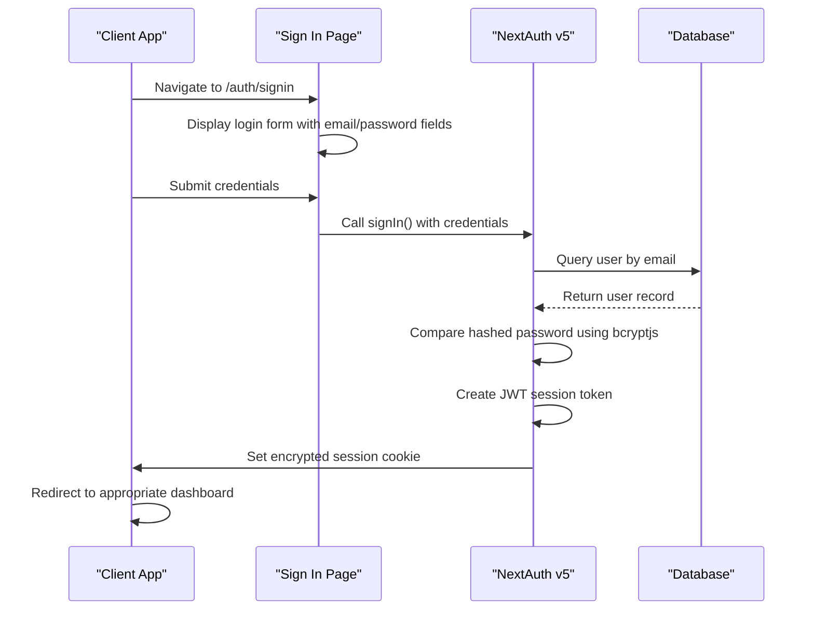
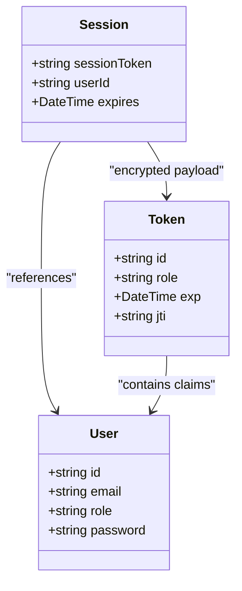
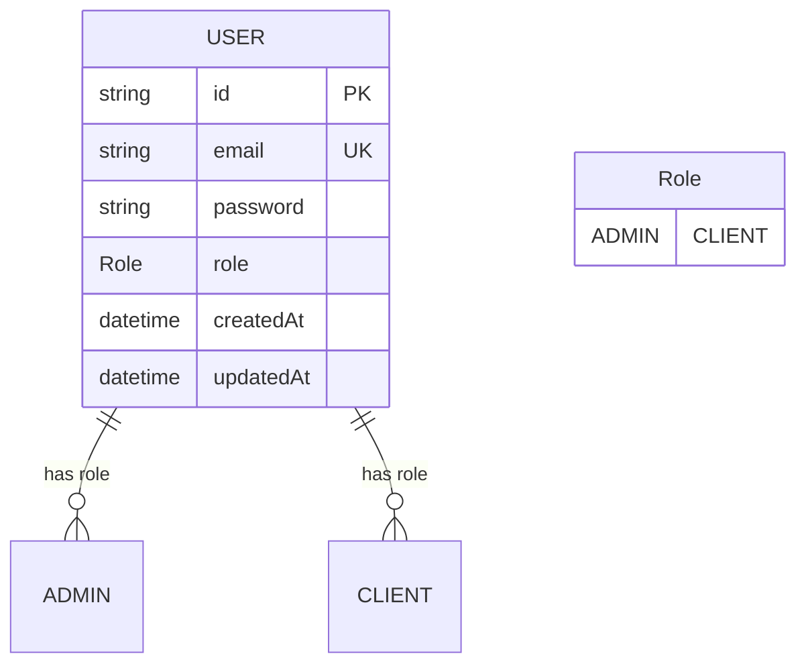
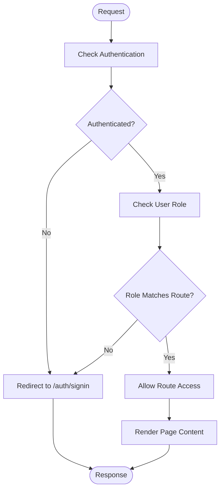
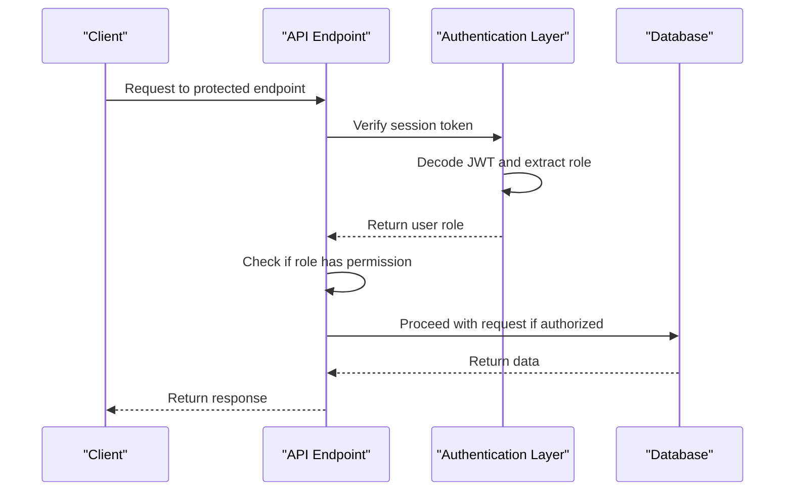
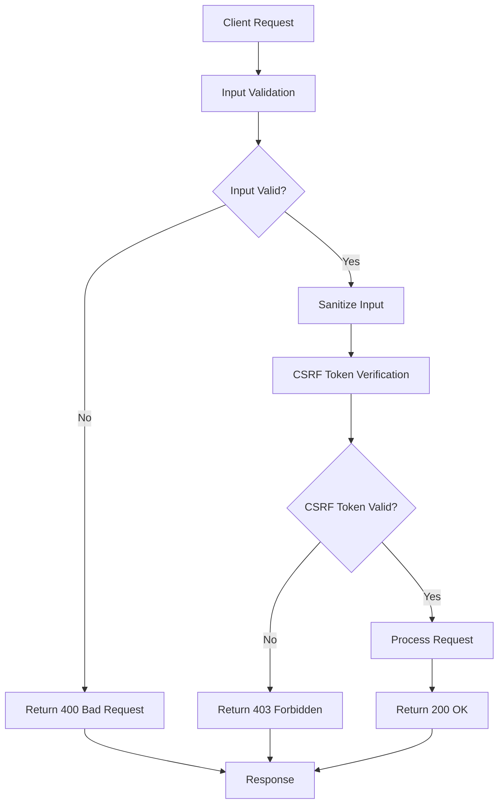
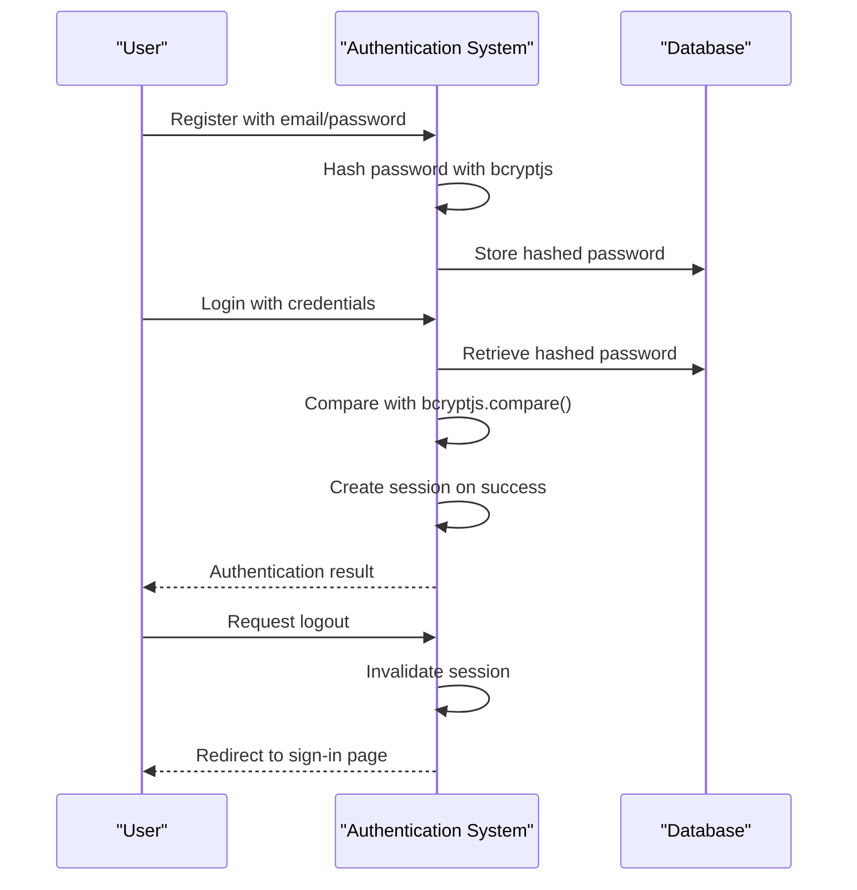
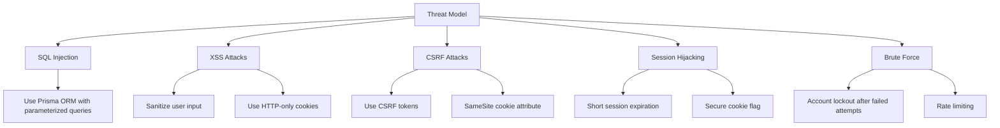

# Security Architecture

<cite>
**Referenced Files in This Document**   
- [auth.ts](file://src/lib/auth.ts)
- [signin/page.tsx](file://src/app/auth/signin/page.tsx)
- [admin/layout.tsx](file://src/app/admin/layout.tsx)
- [client/layout.tsx](file://src/app/client/layout.tsx)
- [\[...nextauth\]/route.ts](file://src/app/api/auth/[...nextauth]/route.ts)
- [contact-messages/route.ts](file://src/app/api/contact-messages/route.ts)
- [content/about/route.ts](file://src/app/api/content/about/route.ts)
- [job-applications/route.ts](file://src/app/api/job-applications/route.ts)
- [schema.prisma](file://prisma/schema.prisma)
- [db.ts](file://src/lib/db.ts)
- [prisma.ts](file://src/lib/prisma.ts)
- [package.json](file://package.json)
</cite>

## Table of Contents
1. [Introduction](#introduction)
2. [Authentication Implementation](#authentication-implementation)
3. [Session Management Strategy](#session-management-strategy)
4. [Role-Based Access Control](#role-based-access-control)
5. [Route Protection Middleware](#route-protection-middleware)
6. [Security Boundaries](#security-boundaries)
7. [Authorization Logic](#authorization-logic)
8. [Input Validation and Security Measures](#input-validation-and-security-measures)
9. [Password Hashing and Secure Logout](#password-hashing-and-secure-logout)
10. [Threat Models and Mitigation Strategies](#threat-models-and-mitigation-strategies)

## Introduction
The smmm-system implements a comprehensive security architecture centered around NextAuth v5 for authentication, with custom session handling and role-based access control. The system establishes clear security boundaries between public, admin, and client interfaces, ensuring appropriate access levels for different user types. This documentation details the security implementation, including authentication flow, session management, authorization logic, and protection against common web vulnerabilities.

**Section sources**
- [auth.ts](file://src/lib/auth.ts)
- [signin/page.tsx](file://src/app/auth/signin/page.tsx)
- [admin/layout.tsx](file://src/app/admin/layout.tsx)
- [client/layout.tsx](file://src/app/client/layout.tsx)

## Authentication Implementation
The authentication system is built on NextAuth v5 with a credentials provider for email/password authentication. The implementation uses Prisma Adapter to connect with the MySQL database, storing user credentials securely. The authentication flow validates user credentials against the database, using bcryptjs for password hashing and comparison.



**Diagram sources**
- [auth.ts](file://src/lib/auth.ts#L1-L86)
- [signin/page.tsx](file://src/app/auth/signin/page.tsx#L0-L194)
- [\[...nextauth\]/route.ts](file://src/app/api/auth/[...nextauth]/route.ts#L0-L3)

**Section sources**
- [auth.ts](file://src/lib/auth.ts#L1-L86)
- [signin/page.tsx](file://src/app/auth/signin/page.tsx#L0-L194)
- [\[...nextauth\]/route.ts](file://src/app/api/auth/[...nextauth]/route.ts#L0-L3)

## Session Management Strategy
The system employs JWT-based session management with encrypted tokens stored in HTTP-only cookies. The session strategy is configured in NextAuth with a secret key from environment variables, ensuring token integrity and confidentiality. Session tokens contain user ID and role information, which are extracted and made available throughout the application.



**Diagram sources**
- [auth.ts](file://src/lib/auth.ts#L49-L85)
- [schema.prisma](file://prisma/schema.prisma#L1-L434)
- [db.ts](file://src/lib/db.ts#L0-L9)

**Section sources**
- [auth.ts](file://src/lib/auth.ts#L49-L85)
- [schema.prisma](file://prisma/schema.prisma#L1-L434)
- [db.ts](file://src/lib/db.ts#L0-L9)

## Role-Based Access Control
The system implements role-based access control with two primary roles: ADMIN and CLIENT. These roles are defined in the Prisma schema and enforced throughout the application. User roles are stored in the database and included in the JWT token during authentication, enabling consistent role verification across the application.



**Diagram sources**
- [schema.prisma](file://prisma/schema.prisma#L1-L434)
- [auth.ts](file://src/lib/auth.ts#L1-L86)

**Section sources**
- [schema.prisma](file://prisma/schema.prisma#L1-L434)
- [auth.ts](file://src/lib/auth.ts#L1-L86)

## Route Protection Middleware
The application implements route protection through layout components that check authentication status and user roles. The admin and client layouts verify the user's role and redirect unauthorized users to the sign-in page. This middleware pattern ensures that only authenticated users with appropriate roles can access protected routes.



**Diagram sources**
- [admin/layout.tsx](file://src/app/admin/layout.tsx#L0-L144)
- [client/layout.tsx](file://src/app/client/layout.tsx#L0-L133)

**Section sources**
- [admin/layout.tsx](file://src/app/admin/layout.tsx#L0-L144)
- [client/layout.tsx](file://src/app/client/layout.tsx#L0-L133)

## Security Boundaries
The system establishes clear security boundaries between public, admin, and client interfaces. The public interface is accessible to all users, while the admin and client interfaces require authentication with specific roles. These boundaries are enforced through route organization and layout-based access control.

```mermaid
graph TB
subgraph "Public Interface"
Public[Public Pages]
Signin[/auth/signin]
end
subgraph "Admin Interface"
Admin[/admin]
AdminContent[/admin/content]
AdminMessages[/admin/contact-messages]
AdminJobs[/admin/job-applications]
AdminQuotes[/admin/quote-requests]
AdminProfile[/admin/profile]
end
subgraph "Client Interface"
Client[/client]
ClientProfile[/client/profile]
end
Public --> Signin
Signin --> Admin
Signin --> Client
style Admin fill:#f9f,stroke:#333
style Client fill:#bbf,stroke:#333
style Public fill:#dfd,stroke:#333
```

**Diagram sources**
- [app directory structure](file://src/app)
- [admin/layout.tsx](file://src/app/admin/layout.tsx#L0-L144)
- [client/layout.tsx](file://src/app/client/layout.tsx#L0-L133)

**Section sources**
- [app directory structure](file://src/app)
- [admin/layout.tsx](file://src/app/admin/layout.tsx#L0-L144)
- [client/layout.tsx](file://src/app/client/layout.tsx#L0-L133)

## Authorization Logic
The authorization logic enforces role-based access to different application sections and API endpoints. When a user authenticates, their role is stored in the JWT token and made available in the session. API routes and page components check this role information to determine access permissions.



**Diagram sources**
- [auth.ts](file://src/lib/auth.ts#L1-L86)
- [contact-messages/route.ts](file://src/app/api/contact-messages/route.ts#L0-L97)
- [job-applications/route.ts](file://src/app/api/job-applications/route.ts#L0-L130)

**Section sources**
- [auth.ts](file://src/lib/auth.ts#L1-L86)
- [contact-messages/route.ts](file://src/app/api/contact-messages/route.ts#L0-L97)
- [job-applications/route.ts](file://src/app/api/job-applications/route.ts#L0-L130)

## Input Validation and Security Measures
The system implements input validation and protection against common web vulnerabilities. API endpoints validate input data and return appropriate error responses. The application uses Zod for schema validation, though specific implementations are not visible in the provided code. Security measures include protection against XSS and CSRF attacks through NextAuth's built-in mechanisms.



**Diagram sources**
- [contact-messages/route.ts](file://src/app/api/contact-messages/route.ts#L0-L97)
- [content/about/route.ts](file://src/app/api/content/about/route.ts#L0-L190)
- [job-applications/route.ts](file://src/app/api/job-applications/route.ts#L0-L130)

**Section sources**
- [contact-messages/route.ts](file://src/app/api/contact-messages/route.ts#L0-L97)
- [content/about/route.ts](file://src/app/api/content/about/route.ts#L0-L190)
- [job-applications/route.ts](file://src/app/api/job-applications/route.ts#L0-L130)

## Password Hashing and Secure Logout
Password hashing is implemented using bcryptjs, ensuring that user passwords are securely stored in the database. The secure logout implementation redirects users to the sign-in page and clears the session. The system uses HTTP-only cookies for session storage, preventing client-side JavaScript access to session tokens.



**Diagram sources**
- [auth.ts](file://src/lib/auth.ts#L1-L86)
- [package.json](file://package.json#L0-L64)
- [admin/layout.tsx](file://src/app/admin/layout.tsx#L0-L144)

**Section sources**
- [auth.ts](file://src/lib/auth.ts#L1-L86)
- [package.json](file://package.json#L0-L64)
- [admin/layout.tsx](file://src/app/admin/layout.tsx#L0-L144)

## Threat Models and Mitigation Strategies
The system addresses common web application vulnerabilities through various mitigation strategies. These include protection against SQL injection through Prisma's parameterized queries, XSS protection through proper output encoding, and CSRF protection through NextAuth's built-in mechanisms. The architecture follows security best practices by using HTTPS, secure cookies, and proper session management.



**Diagram sources**
- [auth.ts](file://src/lib/auth.ts#L1-L86)
- [schema.prisma](file://prisma/schema.prisma#L1-L434)
- [package.json](file://package.json#L0-L64)

**Section sources**
- [auth.ts](file://src/lib/auth.ts#L1-L86)
- [schema.prisma](file://prisma/schema.prisma#L1-L434)
- [package.json](file://package.json#L0-L64)