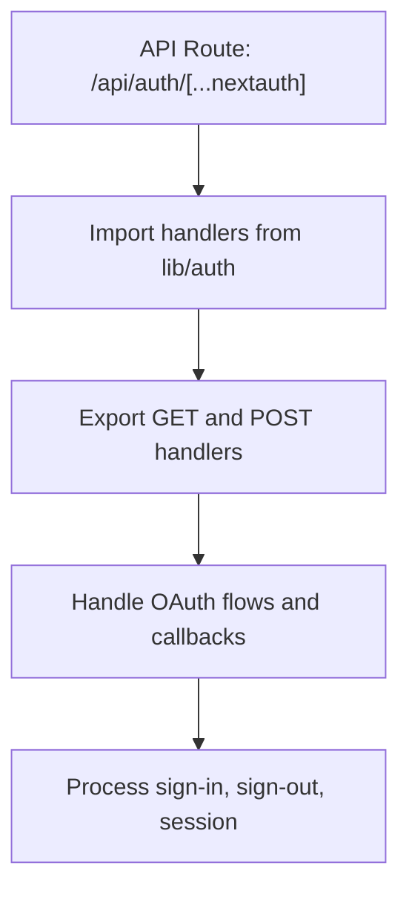
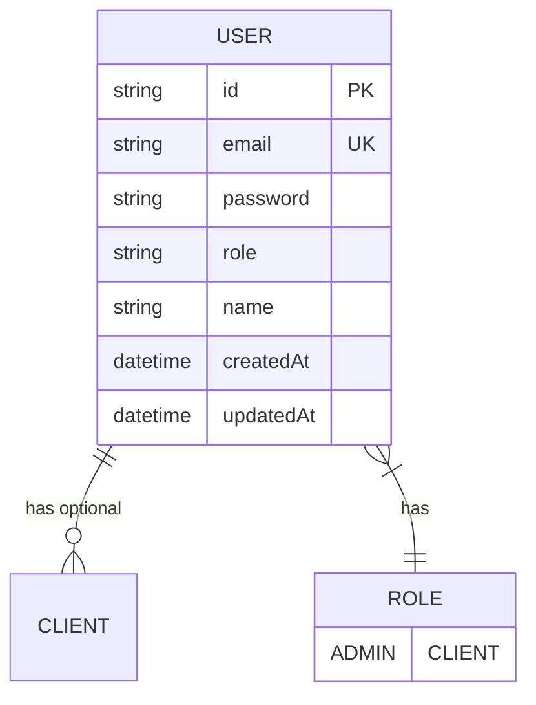
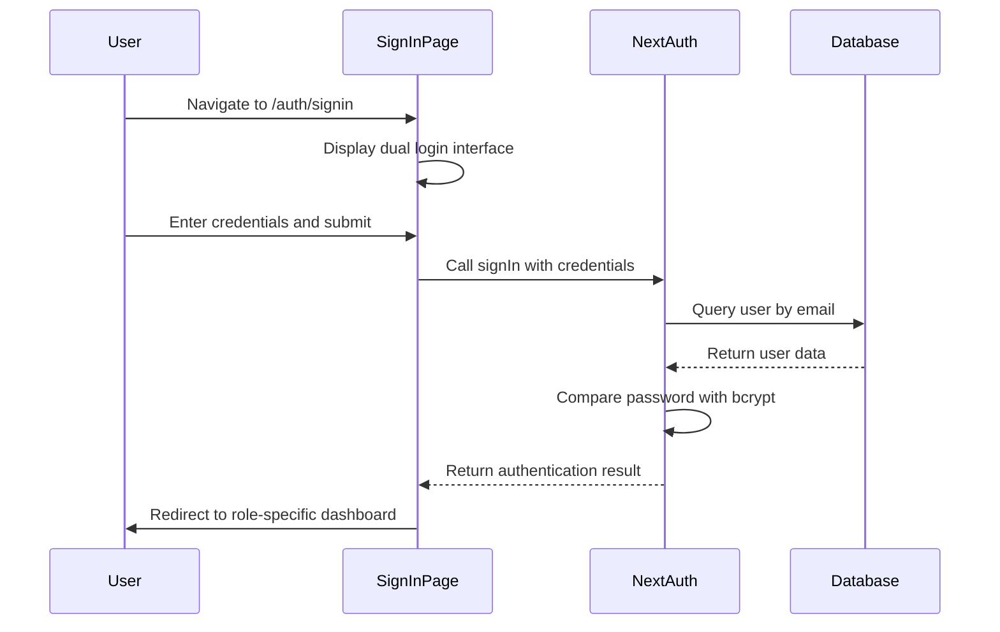
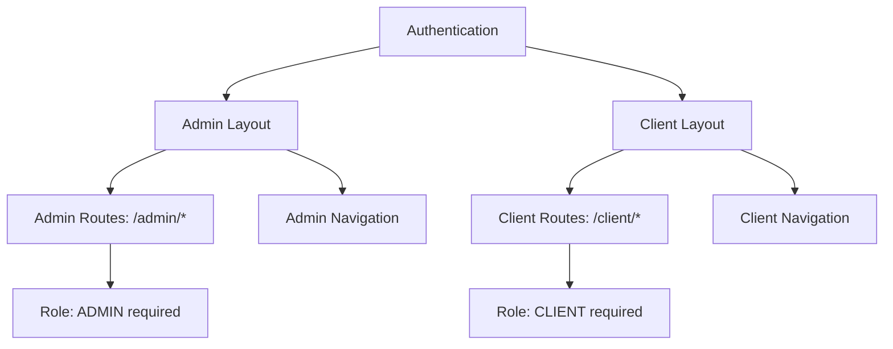
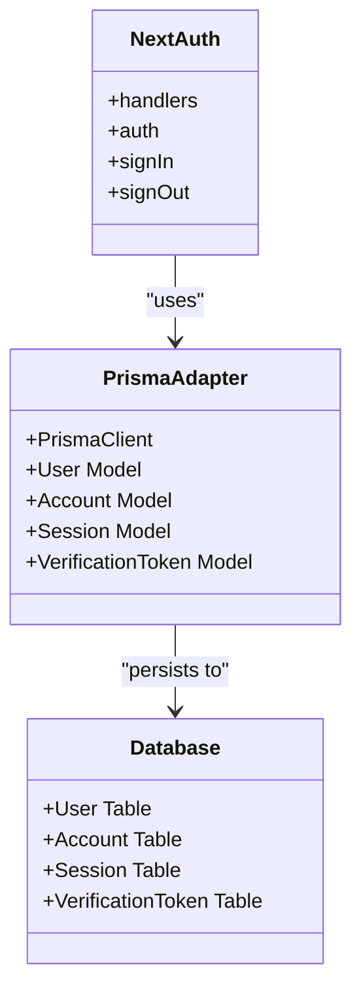

# Authentication and Authorization

<cite>
**Referenced Files in This Document**   
- [route.ts](file://src/app/api/auth/[...nextauth]/route.ts)
- [auth.ts](file://src/lib/auth.ts)
- [signin/page.tsx](file://src/app/auth/signin/page.tsx)
- [admin/layout.tsx](file://src/app/admin/layout.tsx)
- [client/layout.tsx](file://src/app/client/layout.tsx)
- [prisma/seed.ts](file://prisma/seed.ts)
- [prisma/migrations/20251101125707_init/migration.sql](file://prisma/migrations/20251101125707_init/migration.sql)
- [package.json](file://package.json)
</cite>

## Table of Contents
1. [Introduction](#introduction)
2. [NextAuth Configuration](#nextauth-configuration)
3. [Role-Based Access Control System](#role-based-access-control-system)
4. [Sign-In Process and Session Management](#sign-in-process-and-session-management)
5. [Protected Route Patterns](#protected-route-patterns)
6. [Prisma Adapter Integration](#prisma-adapter-integration)
7. [Security Considerations](#security-considerations)
8. [Troubleshooting Guide](#troubleshooting-guide)

## Introduction
The authentication and authorization system in the smmm-system implements NextAuth v5 for secure user management with role-based access control. The system supports two user roles: admin and client, with distinct access levels and interface experiences. This documentation details the implementation of the authentication flow, session management, role enforcement, and security measures throughout the application.

## NextAuth Configuration

The NextAuth configuration is implemented through the route handler and centralized authentication module. The system uses a credentials-based authentication approach with JWT session strategy.



**Diagram sources**
- [route.ts](file://src/app/api/auth/[...nextauth]/route.ts)

The core authentication configuration is defined in the `auth.ts` file, which sets up the NextAuth instance with credentials provider, Prisma adapter, and custom callbacks for JWT and session management.

**Section sources**
- [auth.ts](file://src/lib/auth.ts)

### Providers Configuration
The system implements a credentials provider for email/password authentication. The provider configuration includes:
- Email field with email input type validation
- Password field with secure password input
- Custom authorize callback that verifies user credentials against the database

The credentials provider handles the authentication logic by:
1. Validating that both email and password are provided
2. Querying the database for a user with the provided email
3. Comparing the provided password with the hashed password stored in the database using bcryptjs
4. Returning user information including ID, email, name, and role upon successful authentication

### Callbacks Implementation
The NextAuth configuration includes two essential callbacks for managing user data in the authentication flow:

**JWT Callback**: This callback adds the user's role and ID to the JWT token during authentication. When a user successfully authenticates, their role and ID are attached to the token, making this information available for subsequent requests.

**Session Callback**: This callback extends the session object with the user's role and ID from the JWT token. It ensures that the role information is available in the session object throughout the user's session.

### Session Management
The system uses JWT (JSON Web Token) as the session strategy, which means authentication state is maintained through tokens rather than server-side sessions. The session configuration includes:
- JWT strategy for stateless authentication
- Custom session object that includes user ID and role
- Session persistence through NextAuth's built-in mechanisms

The session object is extended to include role-based information, allowing for easy access to user roles in protected routes and components.

**Section sources**
- [auth.ts](file://src/lib/auth.ts#L49-L85)

## Role-Based Access Control System

The role-based access control (RBAC) system in smmm-system defines two primary roles: ADMIN and CLIENT. These roles determine user permissions and interface access throughout the application.



**Diagram sources**
- [prisma/migrations/20251101125707_init/migration.sql](file://prisma/migrations/20251101125707_init/migration.sql#L1-L44)

### Role Storage in Database
User roles are stored in the database as an ENUM field in the User table. The Prisma schema defines the role field with two possible values: 'ADMIN' and 'CLIENT', with 'CLIENT' as the default value.

The User table in the database contains the following relevant fields:
- `id`: Unique identifier for the user
- `email`: User's email address (unique)
- `password`: Hashed password stored securely
- `role`: User role (ADMIN or CLIENT)
- `name`: User's full name

During user creation, the role is explicitly set based on the user type. The seed data shows that admin users have the role 'ADMIN' while client users have the role 'CLIENT'.

### Role Enforcement Mechanism
The role information is propagated through the authentication system via the NextAuth callbacks. When a user authenticates, the following process occurs:
1. The authorize callback retrieves the user from the database, including their role
2. The JWT callback adds the role to the JWT token
3. The session callback adds the role to the session object

This ensures that role information is available throughout the application. The extended session interface in `auth.ts` explicitly includes the role field, making TypeScript-aware components able to access this information safely.

The role-based access is enforced at multiple levels:
- Route protection based on user role
- UI component visibility based on user role
- API endpoint access control
- Data access restrictions

**Section sources**
- [auth.ts](file://src/lib/auth.ts#L6-L16)
- [prisma/migrations/20251101125707_init/migration.sql](file://prisma/migrations/20251101125707_init/migration.sql#L1-L44)
- [prisma/seed.ts](file://prisma/seed.ts#L1-L50)

## Sign-In Process and Session Persistence

The sign-in process in smmm-system provides a user-friendly interface for both admin and client users with role-specific login options.



**Diagram sources**
- [signin/page.tsx](file://src/app/auth/signin/page.tsx)
- [auth.ts](file://src/lib/auth.ts)

### Sign-In Interface
The sign-in page (`signin/page.tsx`) implements a dual-login interface that allows users to select between admin and client login options using tabs. Key features include:
- Responsive design with random background images
- Tabbed interface for admin and client login
- Password visibility toggle
- Form validation for email and password fields
- Development credentials displayed for testing purposes

The interface uses Next.js App Router with client-side functionality to handle form submission and navigation. Upon successful authentication, users are redirected to their respective dashboards: `/admin` for admins and `/client` for clients.

### Session Persistence
Session persistence is handled by NextAuth's JWT strategy. When a user successfully authenticates:
1. A JWT token is created and signed with the NEXTAUTH_SECRET
2. The token is stored in an HTTP-only cookie for security
3. The session information is made available through NextAuth's session management
4. The session remains valid until expiration or explicit sign-out

The session configuration specifies a JWT strategy, which creates stateless sessions that can be verified without server-side storage. This approach improves scalability and reduces server memory usage.

**Section sources**
- [signin/page.tsx](file://src/app/auth/signin/page.tsx)
- [auth.ts](file://src/lib/auth.ts#L80-L85)

## Protected Route Patterns

The application implements role-based access to protected routes through layout components that serve as authentication guards for their respective sections.



**Diagram sources**
- [admin/layout.tsx](file://src/app/admin/layout.tsx)
- [client/layout.tsx](file://src/app/client/layout.tsx)

### Authentication Guards in Layouts
The admin and client layouts serve as authentication guards for their respective route hierarchies. Both layouts follow a similar pattern:

**Admin Layout**: Located at `admin/layout.tsx`, this component:
- Renders the admin sidebar with navigation links
- Includes a logout handler that redirects to the sign-in page
- Provides role-specific navigation options
- Uses client-side routing to maintain the admin context

**Client Layout**: Located at `client/layout.tsx`, this component:
- Renders the client sidebar with client-specific navigation
- Includes the same logout functionality as the admin layout
- Provides access to client-focused features like declarations and account summary

Both layouts assume that authentication has already occurred and focus on providing the appropriate interface based on the user's role. The actual authentication check is handled by NextAuth at the route level.

### Logout Implementation
The logout functionality is implemented consistently across both layouts. When a user clicks the logout button:
1. The `handleLogout` function is triggered
2. A small delay ensures any animations complete
3. The browser is redirected to the sign-in page using `window.location.href`
4. This full page reload ensures proper cleanup of React components and state

The logout implementation uses a full page navigation rather than client-side routing to ensure complete session cleanup and prevent potential state inconsistencies.

**Section sources**
- [admin/layout.tsx](file://src/app/admin/layout.tsx)
- [client/layout.tsx](file://src/app/client/layout.tsx)

## Prisma Adapter Integration

The system integrates NextAuth with Prisma through the official `@auth/prisma-adapter` package, enabling seamless database operations for authentication data.



**Diagram sources**
- [auth.ts](file://src/lib/auth.ts#L1-L85)
- [prisma/migrations/20251101125707_init/migration.sql](file://prisma/migrations/20251101125707_init/migration.sql)

### Adapter Configuration
The Prisma adapter is configured in `auth.ts` by passing the Prisma client instance to the `PrismaAdapter` constructor:

```typescript
adapter: PrismaAdapter(prisma) as any
```

This integration automatically handles the following database operations:
- User creation, reading, updating, and deletion
- Session management (creation, retrieval, deletion)
- Account linking for OAuth providers
- Email verification token storage and validation

### Database Schema
The Prisma migration defines the necessary tables for NextAuth to function properly:

**User Table**: Stores user credentials and basic information including the role field essential for the RBAC system.

**Account Table**: Stores information about user accounts, particularly for OAuth providers (though not currently used in this implementation).

**Session Table**: Stores active sessions with session tokens and expiration dates, enabling persistent login across browser sessions.

**VerificationToken Table**: Stores tokens for email verification, supporting account verification workflows.

The foreign key constraints ensure data integrity, with Account, Session, and other related tables referencing the User table.

The integration allows NextAuth to automatically manage authentication-related data in the database without requiring manual SQL queries or Prisma operations in the authentication flow.

**Section sources**
- [auth.ts](file://src/lib/auth.ts#L1-L85)
- [prisma/migrations/20251101125707_init/migration.sql](file://prisma/migrations/20251101125707_init/migration.sql)

## Security Considerations

The authentication system implements multiple security measures to protect user data and prevent common vulnerabilities.

### CSRF Protection
NextAuth v5 includes built-in CSRF protection for state-changing operations. The framework automatically generates and validates CSRF tokens for:
- Sign-in requests
- Sign-out requests
- Session updates

This protection prevents cross-site request forgery attacks by ensuring that state-changing requests originate from the application itself rather than malicious third-party sites.

### Secure Session Storage
The system uses JWT-based sessions stored in HTTP-only cookies, which provides several security benefits:
- Cookies are not accessible to JavaScript, preventing XSS attacks from stealing session tokens
- The secure flag ensures cookies are only sent over HTTPS connections
- The same-site attribute prevents cross-site request forgery
- JWT tokens are signed with a secret key, preventing tampering

The session strategy is configured to use JWT, which creates stateless sessions that don't require server-side storage, reducing the attack surface.

### Password Hashing with bcryptjs
All user passwords are securely hashed using bcryptjs before storage in the database. The implementation includes:
- bcryptjs library for secure password hashing
- Salt rounds configured to 10 (as seen in the seed file)
- Asynchronous password comparison to prevent timing attacks

When a user registers or changes their password, the system:
1. Generates a salt using bcrypt.genSalt()
2. Hashes the password with the salt using bcrypt.hash()
3. Stores only the hashed password in the database

During authentication, the system uses bcrypt.compare() to verify the provided password against the stored hash, ensuring that plain-text passwords are never stored or compared.

### Additional Security Measures
The system includes several other security considerations:
- Environment variables for sensitive configuration (NEXTAUTH_SECRET)
- TypeScript interfaces that enforce type safety in authentication data
- Input validation on the sign-in form
- Error handling that doesn't leak implementation details to users
- HTTPS for all authentication endpoints (implied by production configuration)

The package.json shows that the application uses next-auth version 5.0.0-beta.30, which includes the latest security patches and improvements from the NextAuth team.

**Section sources**
- [auth.ts](file://src/lib/auth.ts)
- [package.json](file://package.json)
- [prisma/seed.ts](file://prisma/seed.ts)

## Troubleshooting Guide

This section addresses common authentication issues and their solutions.

### Common Issues and Solutions

**Issue: Unable to sign in with valid credentials**
- Verify that the email and password are correct
- Check that the user exists in the database (verify with Prisma Studio)
- Ensure the password is properly hashed in the database
- Confirm that the NEXTAUTH_SECRET environment variable is set

**Issue: Session not persisting between page refreshes**
- Check browser settings for cookie blocking
- Verify that the site is accessed over HTTPS in production
- Ensure the NEXTAUTH_URL environment variable is correctly set
- Check for JavaScript errors in the console

**Issue: Role information not available in session**
- Verify that the JWT and session callbacks are properly configured
- Check that the user object returned by the authorize callback includes the role
- Ensure the extended session interface is correctly defined
- Confirm that the Prisma user record includes the role field

**Issue: Redirect loops after sign-in**
- Check that the signIn page configuration matches the actual route
- Verify that protected routes are properly guarded
- Ensure the callback URLs are correctly configured
- Check for conflicting middleware

### Debugging Steps
1. Enable verbose logging in development to trace authentication flow
2. Use Prisma Studio to inspect user, session, and account records
3. Check browser developer tools for network requests and cookies
4. Verify environment variables are properly loaded
5. Test with the seed data credentials to isolate issues

### Development Credentials
For testing purposes, the seed data provides the following credentials:
- Admin: admin@smmm.com / password123
- Client: mukellef@example.com / password123
- Client 2: firma@example.com / password123

These credentials can be used to verify the authentication flow and role-based access during development and testing.

**Section sources**
- [prisma/seed.ts](file://prisma/seed.ts)
- [auth.ts](file://src/lib/auth.ts)
- [signin/page.tsx](file://src/app/auth/signin/page.tsx)