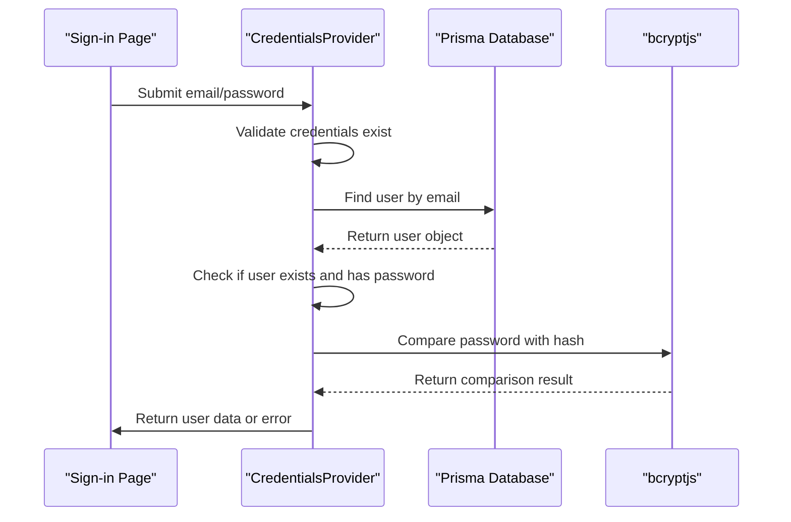
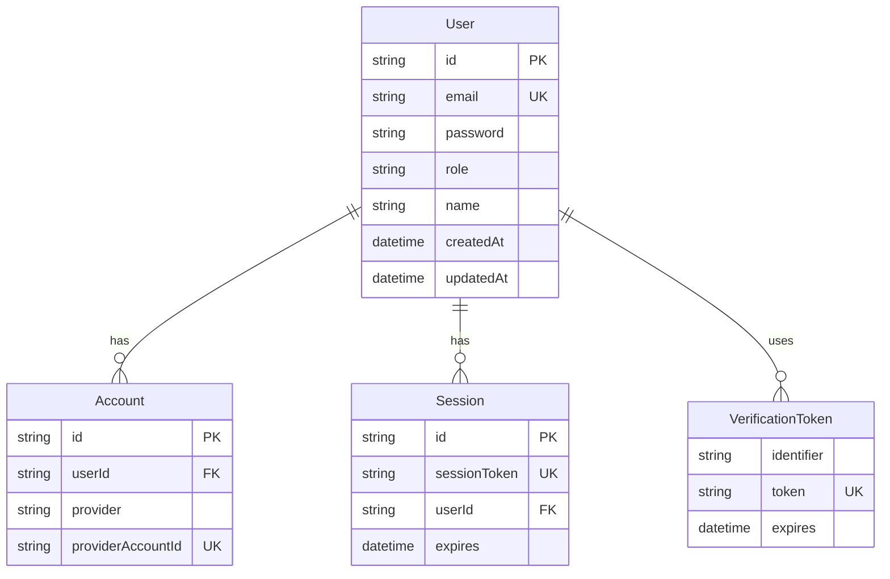
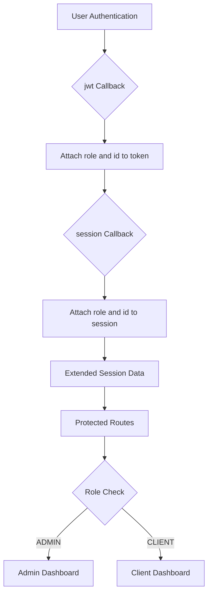

# NextAuth Configuration

<cite>
**Referenced Files in This Document**   
- [auth.ts](file://src/lib/auth.ts)
- [route.ts](file://src/app/api/auth/[...nextauth]/route.ts)
- [signin/page.tsx](file://src/app/auth/signin/page.tsx)
- [prisma.ts](file://src/lib/prisma.ts)
- [seed.ts](file://prisma/seed.ts)
- [migration.sql](file://prisma/migrations/20251101125707_init/migration.sql)
- [package.json](file://package.json)
</cite>

## Table of Contents
1. [Introduction](#introduction)
2. [Authentication Architecture](#authentication-architecture)
3. [Credentials Provider Implementation](#credentials-provider-implementation)
4. [User Authorization Flow](#user-authorization-flow)
5. [Prisma Adapter Integration](#prisma-adapter-integration)
6. [JWT Session Strategy](#jwt-session-strategy)
7. [Custom Callbacks for Role and ID Attachment](#custom-callbacks-for-role-and-id-attachment)
8. [Secret Management](#secret-management)
9. [Sign-in Page Redirection](#sign-in-page-redirection)
10. [API Route Handlers](#api-route-handlers)
11. [Security Implementation](#security-implementation)
12. [Troubleshooting Guide](#troubleshooting-guide)

## Introduction
This document provides comprehensive documentation for the NextAuth v5 configuration in the smmm-system application. The authentication system is built using NextAuth.js with a credentials provider for email/password authentication, integrated with Prisma for database operations, and configured with JWT session strategy. The system supports role-based access control with ADMIN and CLIENT roles, and includes secure password hashing and validation mechanisms.

**Section sources**
- [auth.ts](file://src/lib/auth.ts#L1-L86)

## Authentication Architecture
The authentication architecture in smmm-system follows a modern Next.js App Router pattern with server-side authentication handling. The system uses NextAuth v5 in beta, leveraging its modular approach with exported handlers. The architecture separates authentication logic into a dedicated library file (auth.ts) while maintaining route handlers in the App Router structure. The system integrates with Prisma ORM for database operations and uses JWT for session management, with custom callbacks to extend session data with user roles and IDs.

```mermaid
graph TB
A[Client Application] --> B[Sign-in Page]
B --> C[API Route /api/auth/[...nextauth]]
C --> D[NextAuth Handlers]
D --> E[Credential Provider]
E --> F[Prisma Adapter]
F --> G[Database]
D --> H[JWT Session]
H --> I[Protected Routes]
I --> J[Admin Dashboard]
I --> K[Client Dashboard]
```

**Diagram sources**
- [auth.ts](file://src/lib/auth.ts#L1-L86)
- [route.ts](file://src/app/api/auth/[...nextauth]/route.ts#L1-L3)
- [signin/page.tsx](file://src/app/auth/signin/page.tsx#L1-L193)

## Credentials Provider Implementation
The CredentialsProvider is configured to handle email/password authentication with proper validation and error handling. The provider defines credentials for email and password input fields, with appropriate labels and types for form rendering. The authorize callback implements a comprehensive authentication flow that validates input, queries the database for user existence, and verifies passwords using bcryptjs. The implementation returns a user object with id, email, name, and role properties upon successful authentication.

**Section sources**
- [auth.ts](file://src/lib/auth.ts#L10-L51)

## User Authorization Flow
The user authorization flow begins with credential submission from the sign-in page. The system validates that both email and password are provided, then queries the database for a user with the matching email address. If no user is found or the user has no password, authentication fails. The system then uses bcryptjs to compare the provided password with the hashed password stored in the database. Upon successful validation, the authorize function returns a user object that includes the user's role and ID, which are later attached to the JWT token and session through callbacks.



**Diagram sources**
- [auth.ts](file://src/lib/auth.ts#L30-L51)
- [signin/page.tsx](file://src/app/auth/signin/page.tsx#L1-L193)

## Prisma Adapter Integration
The NextAuth configuration integrates with Prisma through the @auth/prisma-adapter package, which provides a bridge between NextAuth and the Prisma ORM. The adapter is configured with the Prisma client instance imported from src/lib/prisma.ts, establishing a connection to the MySQL database. The Prisma schema defines a User model with fields for id, email, password, role (as an ENUM with ADMIN and CLIENT values), and other user attributes. The adapter automatically handles CRUD operations for users, accounts, sessions, and verification tokens, mapping them to the corresponding database tables.



**Diagram sources**
- [auth.ts](file://src/lib/auth.ts#L7-L8)
- [prisma.ts](file://src/lib/prisma.ts#L1-L10)
- [migration.sql](file://prisma/migrations/20251101125707_init/migration.sql#L1-L50)

## JWT Session Strategy
The authentication system uses a JWT-based session strategy, configured in the NextAuth options with session.strategy set to "jwt". This approach stores session data in an encrypted JWT token rather than in a database, reducing database queries and improving scalability. The JWT token is signed with the NEXTAUTH_SECRET and contains user information that can be verified on each request. This strategy is particularly suitable for the smmm-system application as it allows for stateless authentication while maintaining security through proper secret management.

**Section sources**
- [auth.ts](file://src/lib/auth.ts#L78-L80)

## Custom Callbacks for Role and ID Attachment
The configuration implements two custom callbacks—jwt and session—to extend the default session data with user role and ID information. The jwt callback executes when a JSON Web Token is created or updated, attaching the user's role and ID to the token when a user object is available. The session callback then reads these values from the token and attaches them to the session object, making them accessible throughout the application. This allows for role-based access control and user identification without additional database queries on each request.



**Diagram sources**
- [auth.ts](file://src/lib/auth.ts#L60-L76)

## Secret Management
The system uses the NEXTAUTH_SECRET environment variable for signing and verifying JWT tokens, ensuring the integrity and security of authentication tokens. The secret is accessed through process.env.NEXTAUTH_SECRET in the NextAuth configuration. For development purposes, the seed data (seed.ts) shows that a default password "password123" is hashed and stored for test accounts, but in production, a strong, randomly generated secret should be used. The absence of a .env file in the repository indicates that environment variables are managed externally, following security best practices.

**Section sources**
- [auth.ts](file://src/lib/auth.ts#L82-L84)
- [seed.ts](file://prisma/seed.ts#L1-L221)

## Sign-in Page Redirection
The authentication configuration specifies a custom sign-in page at '/auth/signin' through the pages.signIn option. This directs unauthenticated users to the custom sign-in page rather than using NextAuth's default page. The sign-in page implements a dual-login interface with tabs for both ADMIN and CLIENT users, providing a tailored experience for different user types. After successful authentication, users are redirected to their respective dashboards (/admin for ADMIN users and /client for CLIENT users) based on their role.

**Section sources**
- [auth.ts](file://src/lib/auth.ts#L77-L78)
- [signin/page.tsx](file://src/app/auth/signin/page.tsx#L1-L193)

## API Route Handlers
The API route handlers are implemented using the Next.js App Router pattern in src/app/api/auth/[...nextauth]/route.ts. The file imports the handlers object from src/lib/auth.ts and exports it as GET and POST methods, following NextAuth v5's modular approach. This configuration allows the NextAuth middleware to handle different HTTP methods appropriately—GET requests for sign-in page rendering and callback handling, and POST requests for authentication submission and token generation. The route is automatically mapped to /api/auth/[...nextauth], providing the necessary endpoints for the authentication flow.

```mermaid
graph TB
A[/api/auth/signin] --> B[GET Request]
B --> C[Render Sign-in Page]
A --> D[POST Request]
D --> E[Authenticate Credentials]
E --> F[Create JWT Token]
F --> G[Set Session Cookie]
G --> H[Redirect to Dashboard]
```

**Diagram sources**
- [route.ts](file://src/app/api/auth/[...nextauth]/route.ts#L1-L3)
- [auth.ts](file://src/lib/auth.ts#L1-L86)

## Security Implementation
The authentication system implements multiple security measures to protect user data and prevent common vulnerabilities. Passwords are hashed using bcryptjs with a salt round of 10, as demonstrated in the seed.ts file. The credentials provider validates input presence and performs constant-time password comparison to prevent timing attacks. The JWT session strategy uses a secret key for token signing, and the system leverages HTTPS in production (implied by the use of secure practices). The Prisma schema includes unique constraints on email and provider account IDs to prevent duplication, and the User model uses an ENUM for roles to ensure data integrity.

**Section sources**
- [auth.ts](file://src/lib/auth.ts#L5-L51)
- [seed.ts](file://prisma/seed.ts#L1-L221)
- [package.json](file://package.json#L1-L63)

## Troubleshooting Guide
Common configuration issues and their solutions:

1. **Adapter Misconfiguration**: Ensure the Prisma client instance is properly imported and passed to PrismaAdapter. Verify that the Prisma schema includes all required models (User, Account, Session, VerificationToken).

2. **Callback Execution Order**: The jwt callback executes before the session callback. Ensure that all data needed in the session is first attached to the token in the jwt callback.

3. **Environment Variables**: Verify that NEXTAUTH_SECRET is set in the environment. In development, this can be done via .env.local; in production, through platform-specific environment configuration.

4. **TypeScript Errors**: The "as any" assertion on PrismaAdapter is used to bypass type mismatches. Consider updating to compatible versions of @auth/prisma-adapter and @prisma/client if type errors occur.

5. **Database Connection**: Ensure the Prisma client can connect to the database. Check database credentials and network connectivity, especially when deploying to production environments.

6. **Session Persistence**: If sessions are not persisting, verify that the NEXTAUTH_SECRET is consistent across deployments and that cookies are being set with appropriate security flags.

**Section sources**
- [auth.ts](file://src/lib/auth.ts#L1-L86)
- [prisma.ts](file://src/lib/prisma.ts#L1-L10)
- [package.json](file://package.json#L1-L63)