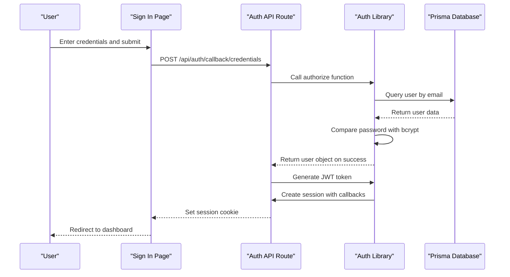
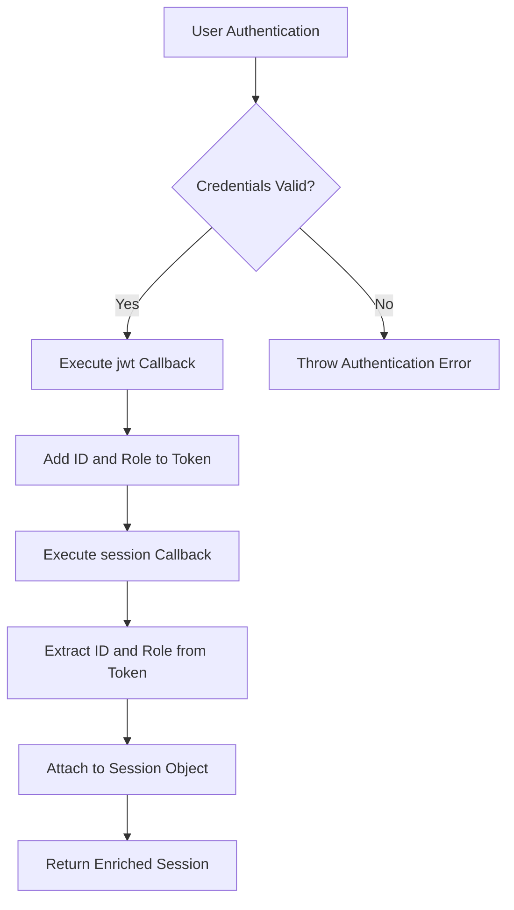
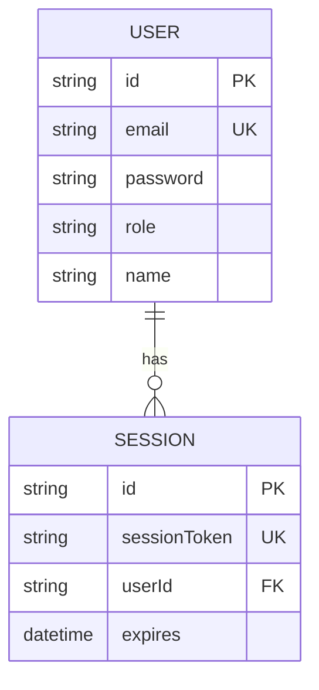
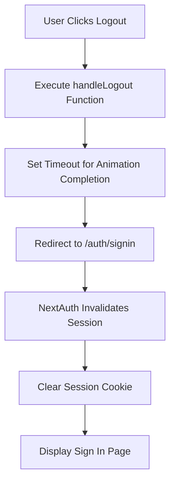

# Session Management

<cite>
**Referenced Files in This Document**   
- [auth.ts](file://src/lib/auth.ts)
- [route.ts](file://src/app/api/auth/[...nextauth]/route.ts)
- [signin/page.tsx](file://src/app/auth/signin/page.tsx)
- [admin/layout.tsx](file://src/app/admin/layout.tsx)
- [client/layout.tsx](file://src/app/client/layout.tsx)
- [navbar.tsx](file://src/components/dashboard/navbar.tsx)
- [migration.sql](file://prisma/migrations/20251101125707_init/migration.sql)
</cite>

## Table of Contents
1. [Introduction](#introduction)
2. [Session Creation and Authentication Flow](#session-creation-and-authentication-flow)
3. [JWT-Based Session Strategy](#jwt-based-session-strategy)
4. [Session Callback and Data Enrichment](#session-callback-and-data-enrichment)
5. [Session Storage and Transmission](#session-storage-and-transmission)
6. [Accessing Session Data in Components](#accessing-session-data-in-components)
7. [Session Termination and Sign Out](#session-termination-and-sign-out)
8. [Security and Performance Considerations](#security-and-performance-considerations)

## Introduction
The smmm-system implements a robust session management system using NextAuth with JWT (JSON Web Token) strategy for secure user authentication and authorization. This document details the complete session lifecycle including creation, maintenance, and destruction across application routes. The system is designed to support two user roles (ADMIN and CLIENT) with role-based access control, and leverages JWT tokens to maintain stateless sessions that enhance scalability and performance.

**Section sources**
- [auth.ts](file://src/lib/auth.ts#L1-L86)

## Session Creation and Authentication Flow
Session creation begins when a user submits credentials through the sign-in page. The authentication flow follows a credentials-based approach where users provide their email and password. The system validates these credentials against the database using bcrypt for password hashing and comparison. Upon successful authentication, NextAuth creates a JWT token containing user information which serves as the session identifier.

The authentication endpoint at `/api/auth/[...nextauth]/route.ts` handles the authentication requests by exposing the handlers from the main auth configuration. This route processes both GET and POST requests for various authentication operations including sign-in, callback, and session management.



**Diagram sources**
- [auth.ts](file://src/lib/auth.ts#L1-L86)
- [route.ts](file://src/app/api/auth/[...nextauth]/route.ts#L1-L3)
- [signin/page.tsx](file://src/app/auth/signin/page.tsx#L1-L194)

**Section sources**
- [auth.ts](file://src/lib/auth.ts#L1-L86)
- [signin/page.tsx](file://src/app/auth/signin/page.tsx#L1-L194)

## JWT-Based Session Strategy
The system employs a JWT-based session strategy, configured in the NextAuth options with `session: { strategy: "jwt" }`. This stateless approach offers several advantages over database-backed sessions:

- **Scalability**: No need to store session data on the server, making it easier to scale horizontally
- **Performance**: Eliminates database queries for session validation on each request
- **Statelessness**: Each token contains all necessary user information, reducing server-side storage requirements

The JWT token is signed using the `NEXTAUTH_SECRET` environment variable, ensuring its integrity and preventing tampering. The token contains standard claims along with custom claims for user ID and role, which are used for authorization decisions throughout the application.

When using JWT strategy, NextAuth automatically handles token issuance, validation, and refresh mechanisms. The token is typically stored in an HTTP-only cookie for security, preventing client-side JavaScript access and reducing the risk of XSS attacks.

**Section sources**
- [auth.ts](file://src/lib/auth.ts#L78-L82)

## Session Callback and Data Enrichment
The session management system includes a critical callback function in `src/lib/auth.ts` that enriches the default session with additional user information from the JWT token. This callback is essential for providing role-based access control and personalized user experiences throughout the application.

The session enrichment process occurs in two stages:

1. **JWT Callback**: When a user is authenticated, the `jwt` callback adds the user's ID and role to the JWT token payload
2. **Session Callback**: The `session` callback then extracts this information from the token and attaches it to the session object



The implementation in `src/lib/auth.ts` shows this process:

```typescript
callbacks: {
  async jwt({ token, user }) {
    if (user) {
      token.role = user.role
      token.id = user.id
    }
    return token
  },
  async session({ session, token }) {
    if (session?.user) {
      session.user.role = token.role as string
      session.user.id = token.id as string
    }
    return session
  }
}
```

This enrichment allows all protected routes and components to access the user's role and ID without additional database queries, improving performance while maintaining security.

**Diagram sources**
- [auth.ts](file://src/lib/auth.ts#L60-L76)

**Section sources**
- [auth.ts](file://src/lib/auth.ts#L60-L76)

## Session Storage and Transmission
Session data is securely stored and transmitted using industry-standard practices to protect user information and prevent common security vulnerabilities. The JWT token is stored in an HTTP-only, secure cookie that is not accessible via JavaScript, mitigating the risk of cross-site scripting (XSS) attacks.

The cookie is configured with the following security attributes:
- **HttpOnly**: Prevents client-side script access
- **Secure**: Ensures transmission only over HTTPS
- **SameSite**: Protects against cross-site request forgery (CSRF) attacks

When a user makes requests to protected API routes, the browser automatically includes the session cookie in the request headers. Server-side routes can then access the session data through the `auth()` function, while client-side components use the `useSession()` hook to access session information.

The Prisma schema includes a Session table that stores session tokens and their expiration times, providing an additional layer of security and allowing for session invalidation when needed:



**Diagram sources**
- [auth.ts](file://src/lib/auth.ts#L1-L86)
- [migration.sql](file://prisma/migrations/20251101125707_init/migration.sql#L30-L44)

**Section sources**
- [auth.ts](file://src/lib/auth.ts#L1-L86)
- [migration.sql](file://prisma/migrations/20251101125707_init/migration.sql#L30-L44)

## Accessing Session Data in Components
The system provides multiple methods for accessing session data in both server and client components, following Next.js best practices for data fetching and rendering.

### Server Components
In server components, session data is accessed using the `auth()` function imported from `@/lib/auth`. This function can be used in server actions, API routes, and server components to retrieve the current user's session information:

```typescript
import { auth } from "@/lib/auth"

// Example usage in a server component or API route
const session = await auth()
if (session?.user) {
  // Access user.id, user.role, user.email, etc.
}
```

### Client Components
In client components, the `useSession()` hook from NextAuth is used to access session data reactively:

```typescript
import { useSession } from "next-auth/react"

function MyComponent() {
  const { data: session, status } = useSession()
  
  if (status === "loading") {
    return <div>Loading...</div>
  }
  
  if (session) {
    // Access session.user.id, session.user.role, etc.
  }
}
```

The admin and client layouts demonstrate how session data could be used to customize the user interface based on the user's role, though the actual session access code is currently commented as TODO in the profile API routes.

**Section sources**
- [auth.ts](file://src/lib/auth.ts#L1-L86)
- [admin/layout.tsx](file://src/app/admin/layout.tsx#L1-L144)
- [client/layout.tsx](file://src/app/client/layout.tsx#L1-L133)

## Session Termination and Sign Out
Session termination is handled through the sign-out mechanism, which invalidates the current session and redirects the user to the sign-in page. The system implements sign-out functionality in multiple locations throughout the application, including the admin and client dashboards.

When a user clicks the logout button, the following process occurs:
1. The `handleLogout` function is triggered in the layout components
2. A small delay is implemented to ensure any animations complete
3. The browser is redirected to the sign-in page using `window.location.href`
4. NextAuth automatically invalidates the session token on the server side

The logout implementation uses a full page reload approach rather than client-side navigation to ensure a clean state and prevent potential DOM reconciliation issues. This approach also helps clear any cached data and ensures the user starts with a fresh session upon next login.



**Diagram sources**
- [admin/layout.tsx](file://src/app/admin/layout.tsx#L80-L95)
- [client/layout.tsx](file://src/app/client/layout.tsx#L80-L95)
- [navbar.tsx](file://src/components/dashboard/navbar.tsx#L101-L116)

**Section sources**
- [admin/layout.tsx](file://src/app/admin/layout.tsx#L80-L95)
- [client/layout.tsx](file://src/app/client/layout.tsx#L80-L95)
- [navbar.tsx](file://src/components/dashboard/navbar.tsx#L101-L116)

## Security and Performance Considerations
The session management system incorporates several security and performance best practices to ensure a robust and secure authentication experience.

### Security Best Practices
- **HTTPS Enforcement**: All authentication routes should be served over HTTPS in production
- **Secret Management**: The `NEXTAUTH_SECRET` is loaded from environment variables and should be a cryptographically strong random string
- **Password Hashing**: User passwords are hashed using bcrypt before storage
- **Input Validation**: Credentials are validated before processing to prevent injection attacks
- **HTTP-only Cookies**: Session tokens are stored in HTTP-only cookies to prevent XSS attacks

### Performance Optimization
- **Stateless JWT**: Eliminates database queries for session validation
- **Token Expiration**: Sessions have a defined expiration time to balance security and user experience
- **Caching Strategy**: The system could implement additional caching for frequently accessed user data
- **Database Indexing**: The Prisma schema includes proper indexes on user email and session token fields

### Common Issues and Solutions
- **Session Expiration**: Implement refresh tokens or silent authentication to handle expired sessions gracefully
- **Concurrent Sessions**: The current implementation allows multiple sessions per user; consider implementing session revocation for enhanced security
- **Clearing Session State**: Ensure all client-side state is cleared on sign out to prevent data leakage
- **Cross-Tab Synchronization**: Consider implementing broadcast channel API to synchronize sign-out across browser tabs

The system's architecture provides a solid foundation for secure session management while allowing for future enhancements such as multi-factor authentication, session revocation, and improved error handling for expired sessions.

**Section sources**
- [auth.ts](file://src/lib/auth.ts#L1-L86)
- [package.json](file://package.json#L1-L64)
- [migration.sql](file://prisma/migrations/20251101125707_init/migration.sql#L1-L80)