# Sign-In Process

<cite>
**Referenced Files in This Document**
- [src/app/auth/signin/page.tsx](file://src/app/auth/signin/page.tsx)
- [src/lib/auth.ts](file://src/lib/auth.ts)
- [src/components/ui/sonner.tsx](file://src/components/ui/sonner.tsx)
- [src/components/ui/button.tsx](file://src/components/ui/button.tsx)
- [src/components/ui/input.tsx](file://src/components/ui/input.tsx)
- [src/components/ui/tabs.tsx](file://src/components/ui/tabs.tsx)
- [src/components/ui/card.tsx](file://src/components/ui/card.tsx)
- [src/app/globals.css](file://src/app/globals.css)
- [src/components/theme-provider.tsx](file://src/components/theme-provider.tsx)
- [src/app/api/auth/[...nextauth]/route.ts](file://src/app/api/auth/[...nextauth]/route.ts)
- [package.json](file://package.json)
</cite>

## Table of Contents
1. [Introduction](#introduction)
2. [System Architecture](#system-architecture)
3. [Dual-Tab Interface Design](#dual-tab-interface-design)
4. [Client-Side Form Handling](#client-side-form-handling)
5. [Password Visibility Feature](#password-visibility-feature)
6. [Toast Notifications System](#toast-notifications-system)
7. [Development Credentials Section](#development-credentials-section)
8. [Random Background Image Selection](#random-background-image-selection)
9. [Authentication Integration](#authentication-integration)
10. [UI Customization Guidelines](#ui-customization-guidelines)
11. [Form Validation Implementation](#form-validation-implementation)
12. [Additional Provider Integration](#additional-provider-integration)
13. [Troubleshooting Guide](#troubleshooting-guide)
14. [Conclusion](#conclusion)

## Introduction

The sign-in process implemented in this Next.js application provides a sophisticated dual-user authentication system with separate interfaces for administrative (SMMM) and client (taxpayer) access. Built with modern React patterns using TypeScript, the system incorporates advanced UI components, state management, and seamless authentication integration with NextAuth.js.

The implementation showcases a clean, responsive design with visual feedback mechanisms, password visibility controls, and development-friendly features that facilitate testing and debugging during the development lifecycle.

## System Architecture

The sign-in system follows a modular architecture that separates concerns between presentation, state management, and authentication logic:

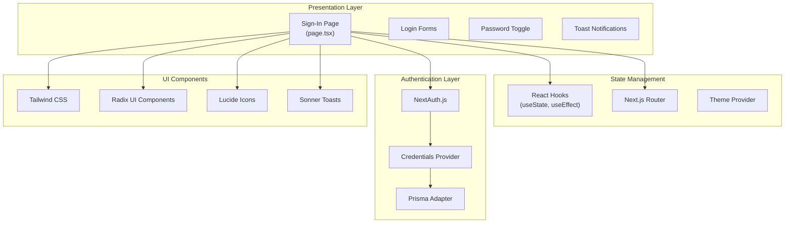

**Diagram sources**
- [src/app/auth/signin/page.tsx](file://src/app/auth/signin/page.tsx#L1-L194)
- [src/lib/auth.ts](file://src/lib/auth.ts#L1-L87)
- [src/components/ui/sonner.tsx](file://src/components/ui/sonner.tsx#L1-L52)

**Section sources**
- [src/app/auth/signin/page.tsx](file://src/app/auth/signin/page.tsx#L1-L194)
- [src/lib/auth.ts](file://src/lib/auth.ts#L1-L87)

## Dual-Tab Interface Design

The sign-in page implements a sophisticated dual-tab interface that allows users to select between administrative and client authentication modes. This design pattern enhances usability by clearly separating different user types while maintaining a consistent interface structure.

### Tab Structure and Navigation

The tab system utilizes Radix UI's Tabs component with custom styling to create a visually distinct interface:

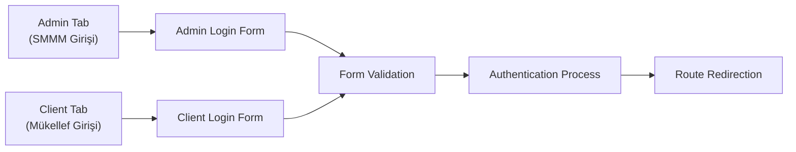

**Diagram sources**
- [src/app/auth/signin/page.tsx](file://src/app/auth/signin/page.tsx#L150-L194)

### User Type Management

The system defines user types through TypeScript union types and manages state transitions between different authentication contexts:

| User Type | Description | Access Level | Default Credentials |
|-----------|-------------|--------------|-------------------|
| `admin` | Administrative user (SMMM) | Full system access | Email: `admin@smmm.com` Password: `admin123` |
| `client` | Taxpayer/client user | Limited access | Email: `mukellef@example.com` Password: `mukellef123` |

**Section sources**
- [src/app/auth/signin/page.tsx](file://src/app/auth/signin/page.tsx#L150-L194)

## Client-Side Form Handling

The form handling implementation leverages React hooks for state management and Next.js router for navigation, providing a seamless user experience with proper loading states and error handling.

### State Management Architecture

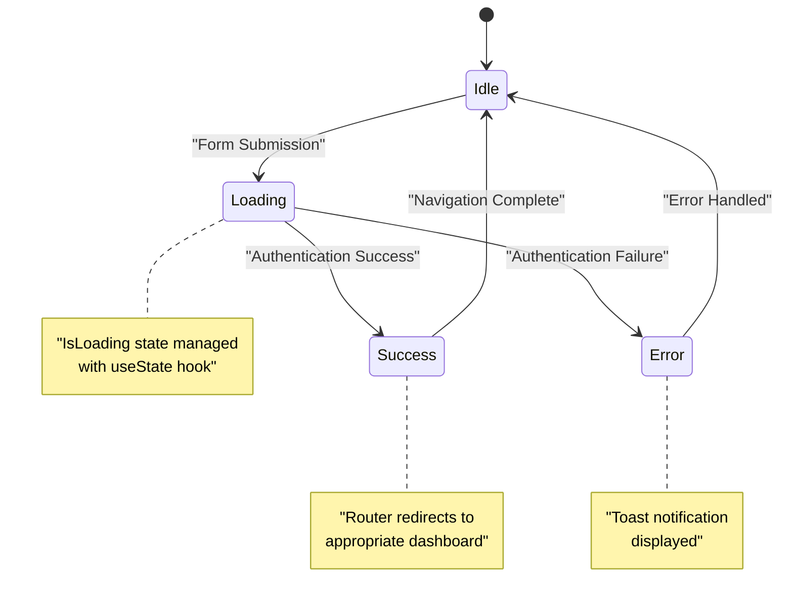

**Diagram sources**
- [src/app/auth/signin/page.tsx](file://src/app/auth/signin/page.tsx#L30-L50)

### Form Submission Process

The form submission handler implements a structured approach to authentication with proper error handling and user feedback:

1. **Pre-submission Validation**: Validates form data before processing
2. **State Management**: Sets loading state and prevents duplicate submissions
3. **Data Extraction**: Uses FormData API to collect form inputs
4. **Mock Authentication**: Simulates authentication process with promise-based delay
5. **Navigation Logic**: Routes users to appropriate dashboards based on user type
6. **Feedback Mechanism**: Provides success/error notifications through toast system

**Section sources**
- [src/app/auth/signin/page.tsx](file://src/app/auth/signin/page.tsx#L40-L60)

## Password Visibility Feature

The password visibility toggle implements a user-friendly feature that enhances accessibility and reduces input errors. The implementation uses Lucide React icons for visual consistency.

### Implementation Details

The password toggle functionality operates through a state-driven approach:

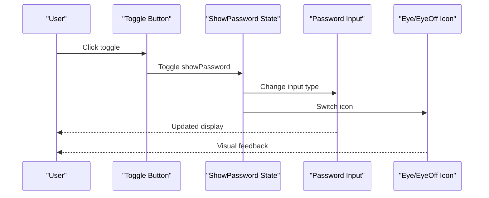

**Diagram sources**
- [src/app/auth/signin/page.tsx](file://src/app/auth/signin/page.tsx#L95-L115)

### Icon Integration

The system utilizes Lucide React's Eye and EyeOff icons for intuitive visual representation:

| State | Icon | Purpose | Accessibility |
|-------|------|---------|---------------|
| Visible | EyeOff | Hide password | Clear indication of current state |
| Hidden | Eye | Show password | Enhanced security awareness |

**Section sources**
- [src/app/auth/signin/page.tsx](file://src/app/auth/signin/page.tsx#L95-L115)

## Toast Notifications System

The toast notification system provides immediate feedback for authentication events using the Sonner library with custom styling and icon integration.

### Notification Types and Styling

The system implements a comprehensive notification framework with distinct visual treatments for different event types:

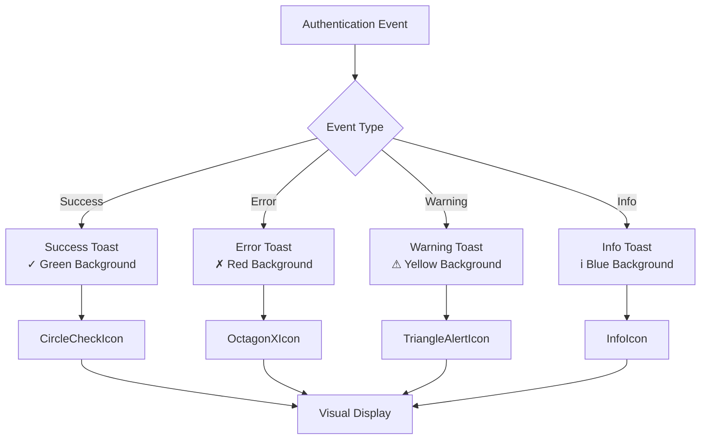

**Diagram sources**
- [src/components/ui/sonner.tsx](file://src/components/ui/sonner.tsx#L15-L45)

### Custom Toast Implementation

The Sonner toast system includes custom styling and iconography for enhanced visual feedback:

| Notification Type | Background Color | Icon | Border Color | Use Case |
|------------------|------------------|------|--------------|----------|
| Success | Green-500 (#10B981) | CircleCheck | Green-600 | Successful authentication |
| Error | Red-500 (#EF4444) | OctagonX | Red-600 | Authentication failures |
| Warning | Yellow-500 (#EAB308) | TriangleAlert | Yellow-600 | Security warnings |
| Info | Blue-500 (#3B82F6) | Info | Blue-600 | Informational messages |

**Section sources**
- [src/components/ui/sonner.tsx](file://src/components/ui/sonner.tsx#L15-L50)

## Development Credentials Section

The development credentials section provides developers with easy access to pre-configured login information for testing purposes. This feature enhances development workflow by eliminating the need for manual credential creation.

### Credential Management

The system dynamically generates credentials based on the selected user type:

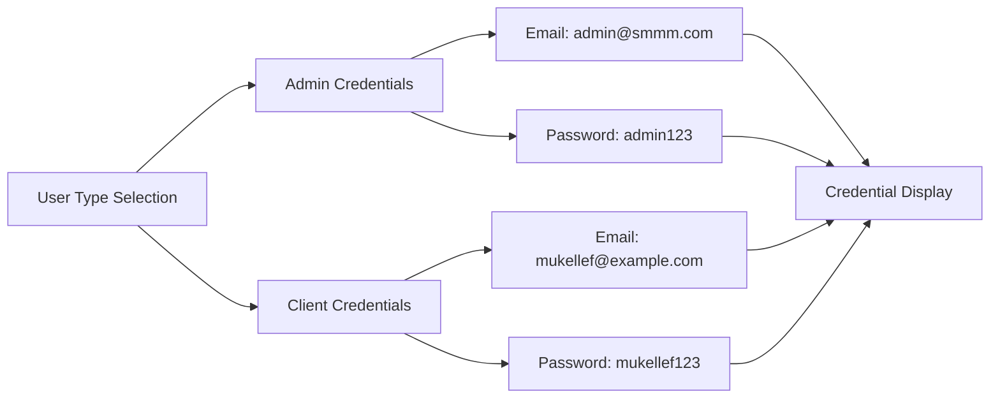

**Diagram sources**
- [src/app/auth/signin/page.tsx](file://src/app/auth/signin/page.tsx#L135-L150)

### Security Considerations

The development credentials section includes several security measures:

- **Visual Separation**: Clearly marked as development-only information
- **Minimal Exposure**: Only essential credential information displayed
- **Contextual Relevance**: Credentials change based on active tab
- **Temporary Nature**: Intended solely for development and testing scenarios

**Section sources**
- [src/app/auth/signin/page.tsx](file://src/app/auth/signin/page.tsx#L135-L150)

## Random Background Image Selection

The system implements a dynamic background image selection mechanism that provides visual variety and enhances the user experience through environmental design.

### Image Selection Algorithm

The background image system utilizes a random selection algorithm from a curated collection of high-quality landscape photographs:

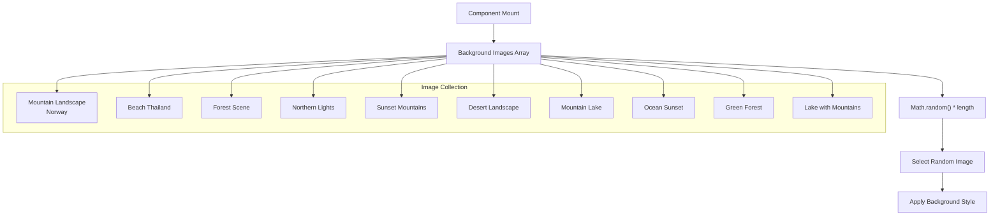

**Diagram sources**
- [src/app/auth/signin/page.tsx](file://src/app/auth/signin/page.tsx#L15-L30)

### Visual Design Features

The background system incorporates several design elements:

| Feature | Implementation | Purpose |
|---------|---------------|---------|
| Blur Effect | `backdrop-blur-[2px]` | Enhances text readability |
| Overlay | `bg-black/40` | Creates contrast for text |
| Cover Fit | `background-size: cover` | Ensures full screen coverage |
| Center Position | `background-position: center` | Maintains visual balance |

**Section sources**
- [src/app/auth/signin/page.tsx](file://src/app/auth/signin/page.tsx#L15-L30)

## Authentication Integration

The authentication system integrates seamlessly with NextAuth.js, providing a robust foundation for user authentication with support for multiple authentication providers and session management.

### NextAuth.js Configuration

The authentication provider is configured with credentials-based authentication and Prisma database integration:

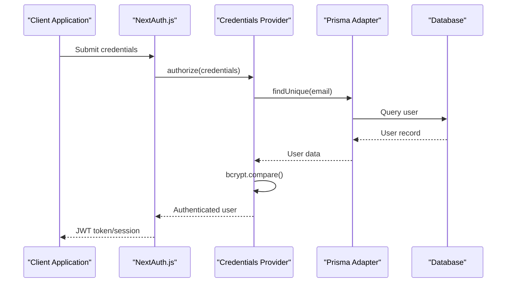

**Diagram sources**
- [src/lib/auth.ts](file://src/lib/auth.ts#L20-L60)

### Authentication Flow

The authentication process follows a secure, standardized flow:

1. **Credential Submission**: User provides email and password
2. **Validation**: System validates input format and presence
3. **Database Lookup**: Searches for user by email
4. **Password Verification**: Uses bcrypt for secure comparison
5. **Token Generation**: Creates JWT for session management
6. **Session Creation**: Establishes authenticated session

**Section sources**
- [src/lib/auth.ts](file://src/lib/auth.ts#L20-L60)

## UI Customization Guidelines

The sign-in system provides extensive customization capabilities through Tailwind CSS utilities and component composition. Developers can modify various aspects of the interface to match brand guidelines or specific design requirements.

### Customization Areas

| Element | Customization Options | Implementation Method |
|---------|----------------------|---------------------|
| Colors | Primary, secondary, accent colors | CSS variables in globals.css |
| Typography | Font families, sizes, weights | Tailwind typography utilities |
| Spacing | Padding, margins, gaps | Tailwind spacing utilities |
| Shadows | Depth effects, blur radius | Tailwind shadow utilities |
| Transitions | Animation timing, easing | CSS transition properties |

### Theme Integration

The system supports both light and dark themes through the Next Themes provider:

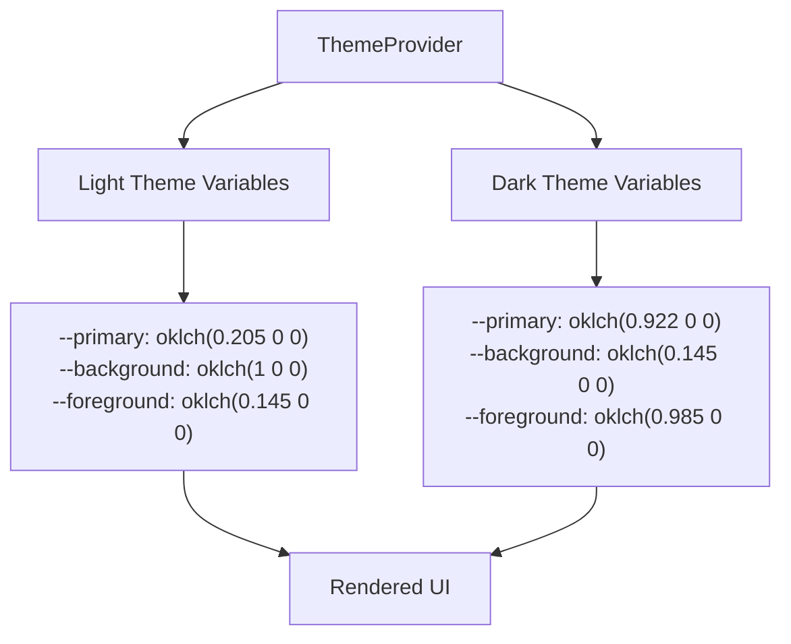

**Diagram sources**
- [src/app/globals.css](file://src/app/globals.css#L40-L80)

**Section sources**
- [src/app/globals.css](file://src/app/globals.css#L40-L80)
- [src/components/theme-provider.tsx](file://src/components/theme-provider.tsx#L1-L12)

## Form Validation Implementation

While the current implementation focuses on basic form validation through HTML5 attributes, the system provides a foundation for implementing more sophisticated validation logic using React hooks and validation libraries.

### Current Validation Approach

The form currently implements client-side validation through HTML5 attributes:

| Field | Validation Type | Attributes |
|-------|----------------|------------|
| Email | Format validation | `type="email"` |
| Password | Required field | `required` |
| Email | Placeholder text | `placeholder="ornek@mail.com"` |

### Enhancement Opportunities

Future validation enhancements could include:

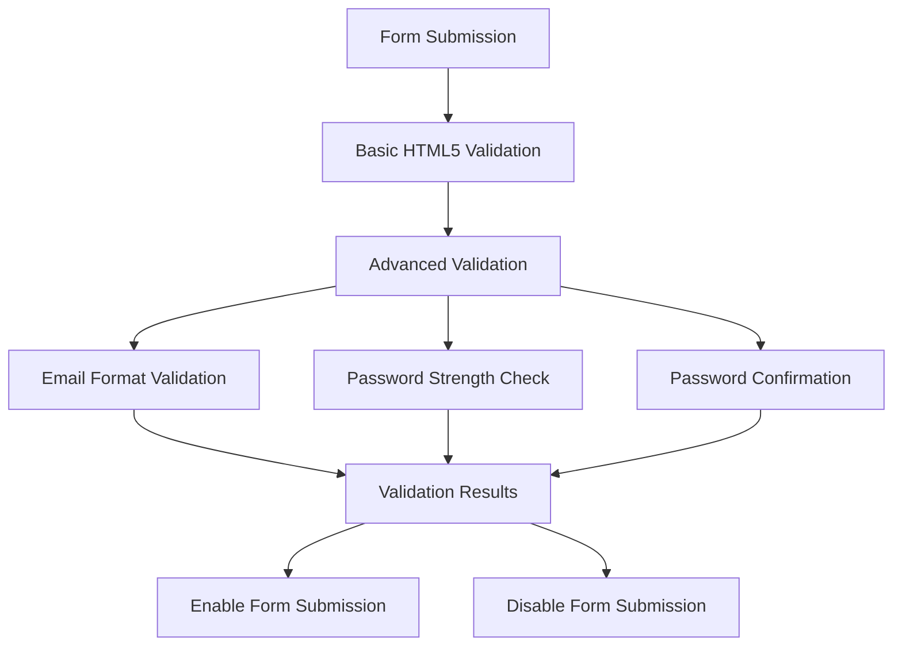

### Validation Libraries Integration

Potential integration points for validation libraries:

- **React Hook Form**: For advanced form state management
- **Zod**: For schema-based validation
- **Formik**: For comprehensive form handling

## Additional Provider Integration

The NextAuth.js configuration supports integration with multiple authentication providers, enabling social login and enterprise identity solutions.

### Supported Providers

The current configuration supports credentials-based authentication, with extensibility for additional providers:

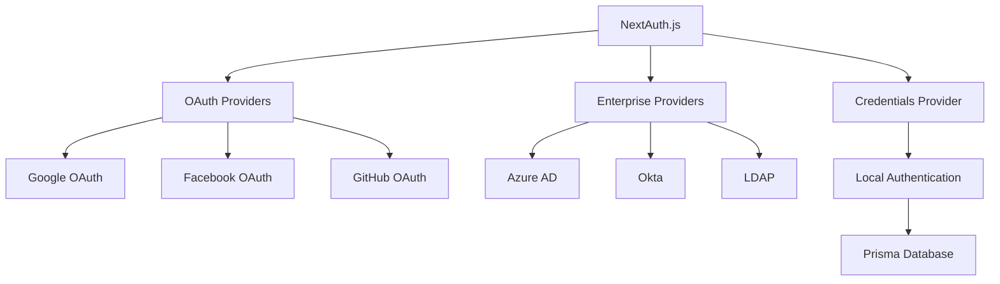

**Diagram sources**
- [src/lib/auth.ts](file://src/lib/auth.ts#L15-L35)

### Provider Configuration

Integration with additional providers requires:

1. **Provider Setup**: Configure provider credentials in environment variables
2. **Provider Registration**: Add provider to NextAuth configuration
3. **Callback Handling**: Implement callback routes for provider redirection
4. **Session Management**: Handle provider-specific session data

**Section sources**
- [src/lib/auth.ts](file://src/lib/auth.ts#L15-L35)

## Troubleshooting Guide

Common issues and their resolutions for the sign-in system:

### Authentication Issues

| Problem | Symptoms | Solution |
|---------|----------|----------|
| Login fails silently | No error message, no redirect | Check browser console for authentication errors |
| Incorrect credentials accepted | Wrong credentials work | Verify bcrypt hashing and database records |
| Session not maintained | Redirects to login after refresh | Check JWT token expiration and storage |

### UI/UX Issues

| Problem | Symptoms | Solution |
|---------|----------|----------|
| Background image not loading | White background instead of image | Verify Unsplash URL accessibility and CORS settings |
| Password toggle not working | Cannot show/hide password | Check React state management and icon rendering |
| Toast notifications missing | No feedback for actions | Verify Sonner provider is properly configured |

### Development Issues

| Problem | Symptoms | Solution |
|---------|----------|----------|
| Development credentials not visible | Missing credential section | Ensure development environment is properly configured |
| Theme not switching | Static color scheme | Check Next Themes provider configuration |
| Form validation not working | No client-side validation | Verify HTML5 attributes and JavaScript functionality |

**Section sources**
- [src/app/auth/signin/page.tsx](file://src/app/auth/signin/page.tsx#L40-L60)
- [src/components/ui/sonner.tsx](file://src/components/ui/sonner.tsx#L15-L50)

## Conclusion

The sign-in process implementation demonstrates a comprehensive approach to user authentication in modern web applications. The system successfully combines React's declarative programming model with Next.js's server-side capabilities and NextAuth.js's robust authentication framework.

Key strengths of the implementation include:

- **Dual-User Support**: Effective separation of administrative and client authentication
- **Modern UI Components**: Utilization of Radix UI and Tailwind CSS for consistent design
- **Accessibility Features**: Password visibility toggle and clear visual feedback
- **Developer Experience**: Comprehensive development credentials and toast notifications
- **Scalability**: Foundation for additional authentication providers and validation logic

The modular architecture ensures maintainability while the extensive customization options provide flexibility for future enhancements. The system serves as an excellent foundation for production applications requiring sophisticated authentication workflows.