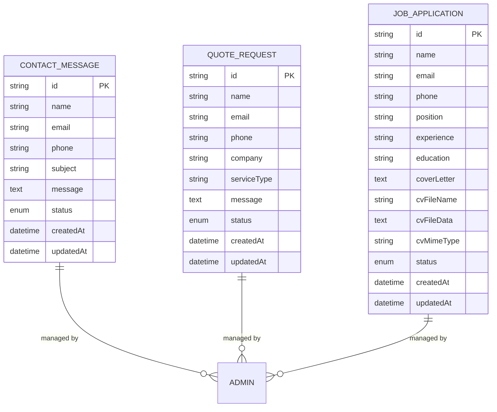
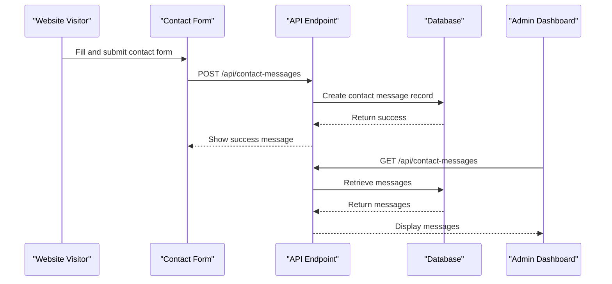
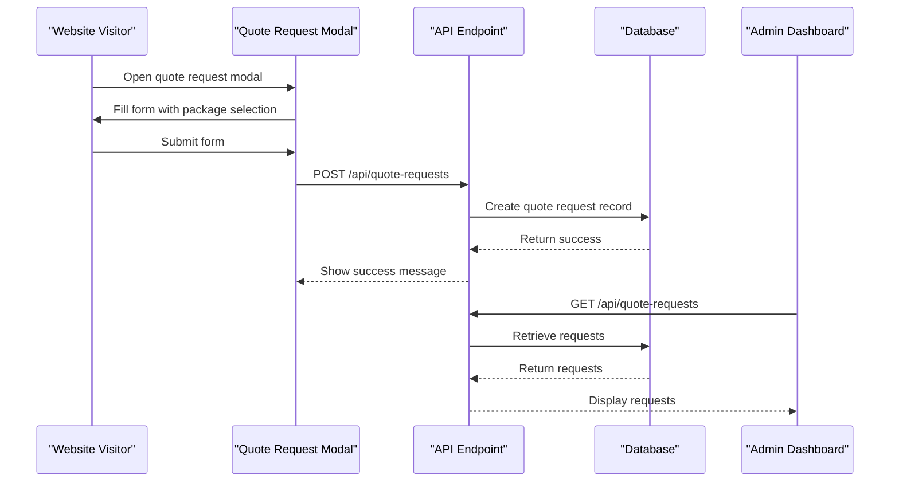
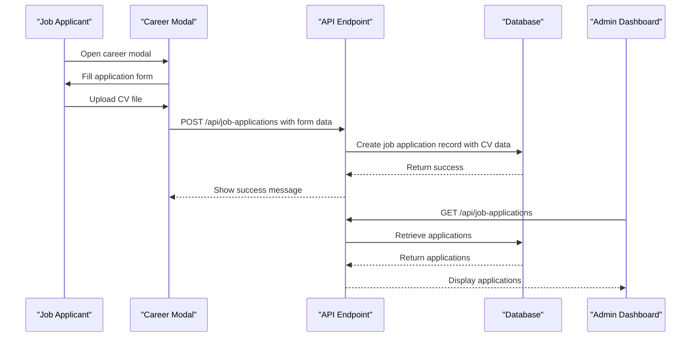
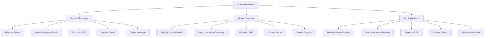
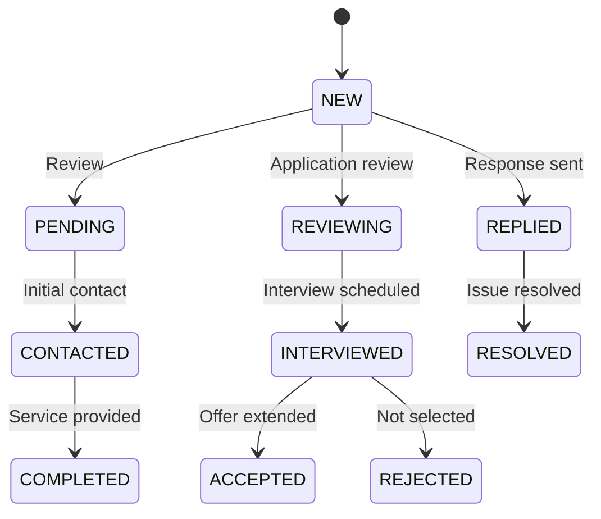
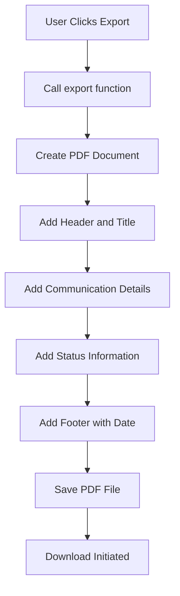
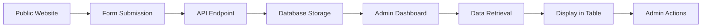
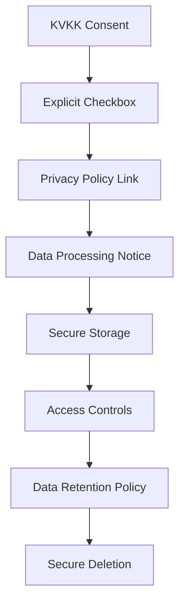
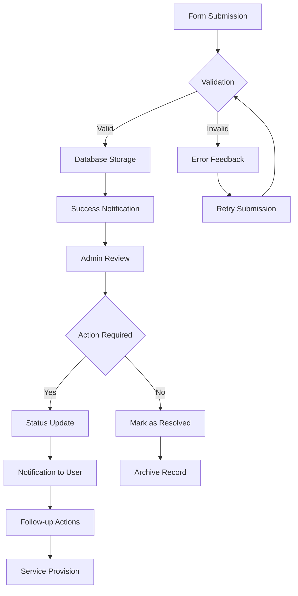

# Communication Features

<cite>
**Referenced Files in This Document**   
- [contact-messages/page.tsx](file://src/app/admin/contact-messages/page.tsx)
- [quote-requests/page.tsx](file://src/app/admin/quote-requests/page.tsx)
- [job-applications/page.tsx](file://src/app/admin/job-applications/page.tsx)
- [api/contact-messages/route.ts](file://src/app/api/contact-messages/route.ts)
- [api/quote-requests/route.ts](file://src/app/api/quote-requests/route.ts)
- [api/job-applications/route.ts](file://src/app/api/job-applications/route.ts)
- [components/admin/contact-message-modal.tsx](file://src/components/admin/contact-message-modal.tsx)
- [components/admin/edit-contact-message-modal.tsx](file://src/components/admin/edit-contact-message-modal.tsx)
- [components/admin/quote-request-modal.tsx](file://src/components/admin/quote-request-modal.tsx)
- [components/admin/edit-quote-request-modal.tsx](file://src/components/admin/edit-quote-request-modal.tsx)
- [components/admin/job-application-modal.tsx](file://src/components/admin/job-application-modal.tsx)
- [components/admin/edit-job-application-modal.tsx](file://src/components/admin/edit-job-application-modal.tsx)
- [components/landing/contact-section.tsx](file://src/components/landing/contact-section.tsx)
- [components/modals/quote-request-modal.tsx](file://src/components/modals/quote-request-modal.tsx)
- [components/modals/career-modal.tsx](file://src/components/modals/career-modal.tsx)
- [components/modals/kvkk-modal.tsx](file://src/components/modals/kvkk-modal.tsx)
- [lib/pdf-export.ts](file://src/lib/pdf-export.ts)
- [prisma/migrations/20251101125707_init/migration.sql](file://prisma/migrations/20251101125707_init/migration.sql)
</cite>

## Table of Contents
1. [Introduction](#introduction)
2. [Data Models and Lifecycle](#data-models-and-lifecycle)
3. [Contact Message Handling](#contact-message-handling)
4. [Quote Request Processing](#quote-request-processing)
5. [Job Application Management](#job-application-management)
6. [Admin Interface](#admin-interface)
7. [Status Tracking and Notifications](#status-tracking-and-notifications)
8. [Data Export Functionality](#data-export-functionality)
9. [Form Integration](#form-integration)
10. [Privacy and Compliance](#privacy-and-compliance)
11. [Common Workflows and Edge Cases](#common-workflows-and-edge-cases)

## Introduction
The communication management system in smmm-system handles three primary types of communications: contact messages, quote requests, and job applications. Each communication type has its own data model, lifecycle, and administrative interface. The system integrates form submissions from the public website with an admin dashboard for review, filtering, and response management. This document details the implementation of these features, including data models, status tracking, notification patterns, and compliance with privacy regulations like KVKK.

## Data Models and Lifecycle
The system implements three distinct data models for different communication types, each with specific fields and status workflows.

**Diagram sources**
- [prisma/migrations/20251101125707_init/migration.sql](file://prisma/migrations/20251101125707_init/migration.sql)

**Section sources**
- [prisma/migrations/20251101125707_init/migration.sql](file://prisma/migrations/20251101125707_init/migration.sql)

## Contact Message Handling
Contact messages are submitted through a form on the public website and stored in the database with a default status of "NEW". The system allows administrators to view, update status, export to PDF, and delete messages.

**Diagram sources**
- [components/landing/contact-section.tsx](file://src/components/landing/contact-section.tsx#L100-L150)
- [api/contact-messages/route.ts](file://src/app/api/contact-messages/route.ts#L10-L40)
- [admin/contact-messages/page.tsx](file://src/app/admin/contact-messages/page.tsx#L100-L150)

**Section sources**
- [api/contact-messages/route.ts](file://src/app/api/contact-messages/route.ts)
- [admin/contact-messages/page.tsx](file://src/app/admin/contact-messages/page.tsx)
- [components/landing/contact-section.tsx](file://src/components/landing/contact-section.tsx)

## Quote Request Processing
Quote requests are submitted through modal forms on the pricing section of the website. The system captures company information along with service type preferences and stores them with a default status of "NEW".

**Diagram sources**
- [components/modals/quote-request-modal.tsx](file://src/components/modals/quote-request-modal.tsx#L50-L100)
- [api/quote-requests/route.ts](file://src/app/api/quote-requests/route.ts#L10-L40)
- [admin/quote-requests/page.tsx](file://src/app/admin/quote-requests/page.tsx#L100-L150)

**Section sources**
- [api/quote-requests/route.ts](file://src/app/api/quote-requests/route.ts)
- [admin/quote-requests/page.tsx](file://src/app/admin/quote-requests/page.tsx)
- [components/modals/quote-request-modal.tsx](file://src/components/modals/quote-request-modal.tsx)

## Job Application Management
Job applications are submitted through a career modal that includes CV upload functionality. The system stores the CV as base64-encoded data in the database along with applicant information.

**Diagram sources**
- [components/modals/career-modal.tsx](file://src/components/modals/career-modal.tsx#L50-L100)
- [api/job-applications/route.ts](file://src/app/api/job-applications/route.ts#L10-L40)
- [admin/job-applications/page.tsx](file://src/app/admin/job-applications/page.tsx#L100-L150)

**Section sources**
- [api/job-applications/route.ts](file://src/app/api/job-applications/route.ts)
- [admin/job-applications/page.tsx](file://src/app/admin/job-applications/page.tsx)
- [components/modals/career-modal.tsx](file://src/components/modals/career-modal.tsx)

## Admin Interface
The admin interface provides separate dashboards for managing contact messages, quote requests, and job applications. Each dashboard includes filtering, pagination, and action capabilities.

**Diagram sources**
- [admin/contact-messages/page.tsx](file://src/app/admin/contact-messages/page.tsx)
- [admin/quote-requests/page.tsx](file://src/app/admin/quote-requests/page.tsx)
- [admin/job-applications/page.tsx](file://src/app/admin/job-applications/page.tsx)

**Section sources**
- [admin/contact-messages/page.tsx](file://src/app/admin/contact-messages/page.tsx)
- [admin/quote-requests/page.tsx](file://src/app/admin/quote-requests/page.tsx)
- [admin/job-applications/page.tsx](file://src/app/admin/job-applications/page.tsx)

## Status Tracking and Notifications
Each communication type has a specific status workflow with appropriate notifications for state changes.

**Diagram sources**
- [api/contact-messages/route.ts](file://src/app/api/contact-messages/route.ts#L50-L80)
- [api/quote-requests/route.ts](file://src/app/api/quote-requests/route.ts#L50-L80)
- [api/job-applications/route.ts](file://src/app/api/job-applications/route.ts#L50-L80)

**Section sources**
- [admin/contact-messages/page.tsx](file://src/app/admin/contact-messages/page.tsx#L200-L300)
- [admin/quote-requests/page.tsx](file://src/app/admin/quote-requests/page.tsx#L200-L300)
- [admin/job-applications/page.tsx](file://src/app/admin/job-applications/page.tsx#L200-L300)

## Data Export Functionality
The system provides PDF export functionality for all communication types using the jsPDF library.

**Diagram sources**
- [lib/pdf-export.ts](file://src/lib/pdf-export.ts)
- [admin/contact-messages/page.tsx](file://src/app/admin/contact-messages/page.tsx#L150-L200)
- [admin/quote-requests/page.tsx](file://src/app/admin/quote-requests/page.tsx#L150-L200)
- [admin/job-applications/page.tsx](file://src/app/admin/job-applications/page.tsx#L150-L200)

**Section sources**
- [lib/pdf-export.ts](file://src/lib/pdf-export.ts)

## Form Integration
The system integrates public-facing forms with the admin dashboard through API endpoints.

**Diagram sources**
- [components/landing/contact-section.tsx](file://src/components/landing/contact-section.tsx)
- [components/modals/quote-request-modal.tsx](file://src/components/modals/quote-request-modal.tsx)
- [components/modals/career-modal.tsx](file://src/components/modals/career-modal.tsx)
- [api/contact-messages/route.ts](file://src/app/api/contact-messages/route.ts)
- [api/quote-requests/route.ts](file://src/app/api/quote-requests/route.ts)
- [api/job-applications/route.ts](file://src/app/api/job-applications/route.ts)

**Section sources**
- [components/landing/contact-section.tsx](file://src/components/landing/contact-section.tsx)
- [components/modals/quote-request-modal.tsx](file://src/components/modals/quote-request-modal.tsx)
- [components/modals/career-modal.tsx](file://src/components/modals/career-modal.tsx)

## Privacy and Compliance
The system implements privacy considerations for handling personal data in compliance with KVKK regulations.

**Diagram sources**
- [components/modals/career-modal.tsx](file://src/components/modals/career-modal.tsx#L200-L250)
- [components/modals/kvkk-modal.tsx](file://src/components/modals/kvkk-modal.tsx)
- [api/job-applications/route.ts](file://src/app/api/job-applications/route.ts#L20-L40)

**Section sources**
- [components/modals/career-modal.tsx](file://src/components/modals/career-modal.tsx)
- [components/modals/kvkk-modal.tsx](file://src/components/modals/kvkk-modal.tsx)

## Common Workflows and Edge Cases
The system handles various common workflows and edge cases in communication management.

**Diagram sources**
- [api/contact-messages/route.ts](file://src/app/api/contact-messages/route.ts)
- [api/quote-requests/route.ts](file://src/app/api/quote-requests/route.ts)
- [api/job-applications/route.ts](file://src/app/api/job-applications/route.ts)
- [admin/contact-messages/page.tsx](file://src/app/admin/contact-messages/page.tsx)
- [admin/quote-requests/page.tsx](file://src/app/admin/quote-requests/page.tsx)
- [admin/job-applications/page.tsx](file://src/app/admin/job-applications/page.tsx)

**Section sources**
- [api/contact-messages/route.ts](file://src/app/api/contact-messages/route.ts)
- [api/quote-requests/route.ts](file://src/app/api/quote-requests/route.ts)
- [api/job-applications/route.ts](file://src/app/api/job-applications/route.ts)