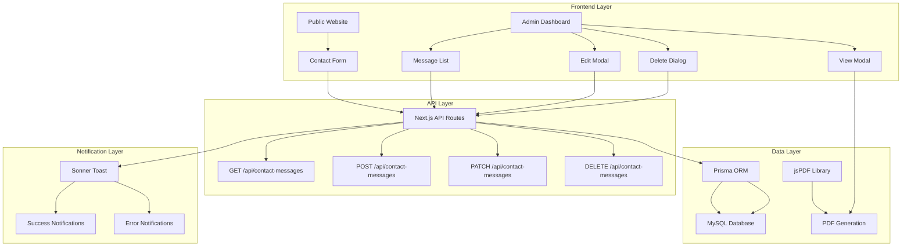
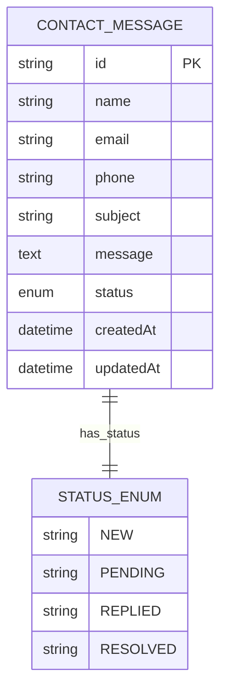
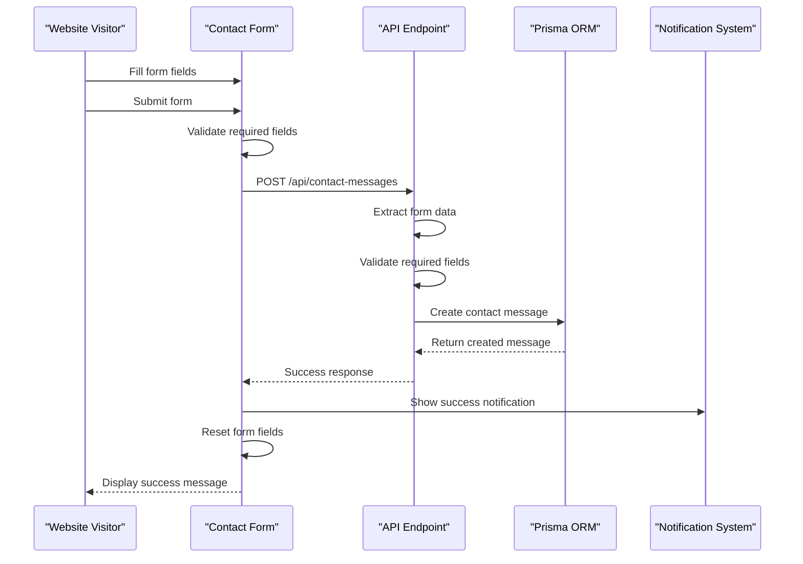
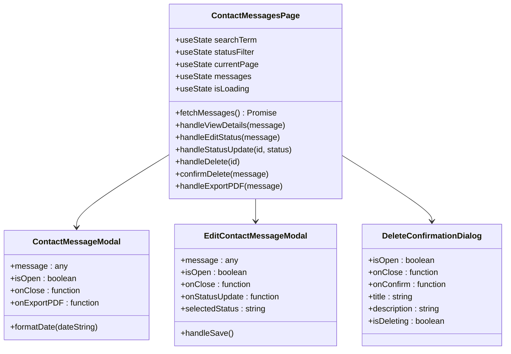
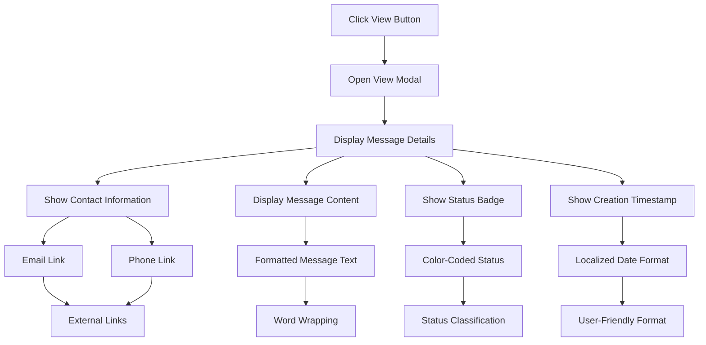
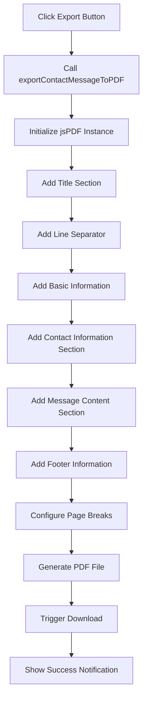
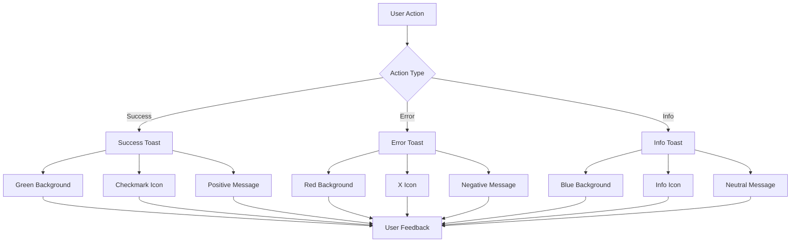

# Contact Messages

<cite>
**Referenced Files in This Document**
- [src/app/admin/contact-messages/page.tsx](file://src/app/admin/contact-messages/page.tsx)
- [src/app/api/contact-messages/route.ts](file://src/app/api/contact-messages/route.ts)
- [src/components/admin/contact-message-modal.tsx](file://src/components/admin/contact-message-modal.tsx)
- [src/components/admin/edit-contact-message-modal.tsx](file://src/components/admin/edit-contact-message-modal.tsx)
- [src/components/ui/delete-confirmation-dialog.tsx](file://src/components/ui/delete-confirmation-dialog.tsx)
- [src/components/landing/contact-section.tsx](file://src/components/landing/contact-section.tsx)
- [src/lib/pdf-export.ts](file://src/lib/pdf-export.ts)
- [src/lib/prisma.ts](file://src/lib/prisma.ts)
- [prisma/schema.prisma](file://prisma/schema.prisma)
- [src/components/modals/kvkk-modal.tsx](file://src/components/modals/kvkk-modal.tsx)
</cite>

## Table of Contents
1. [Introduction](#introduction)
2. [System Architecture](#system-architecture)
3. [Data Model](#data-model)
4. [Public Website Contact Form](#public-website-contact-form)
5. [Admin Dashboard Interface](#admin-dashboard-interface)
6. [Message Management Operations](#message-management-operations)
7. [PDF Export Functionality](#pdf-export-functionality)
8. [Error Handling and Notifications](#error-handling-and-notifications)
9. [Privacy and Compliance](#privacy-and-compliance)
10. [Technical Implementation Details](#technical-implementation-details)
11. [Performance Considerations](#performance-considerations)
12. [Troubleshooting Guide](#troubleshooting-guide)

## Introduction

The Contact Messages system in the smmm-system is a comprehensive solution for managing customer inquiries and communications through the public website. Built with Next.js 14, Prisma ORM, and modern React patterns, it provides a robust interface for administrators to view, manage, and track all incoming contact messages while maintaining strict data privacy and compliance standards.

The system handles message submission from the public website, stores them securely in a MySQL database, and provides an intuitive admin dashboard for efficient message management. It includes advanced features such as real-time filtering, pagination, status tracking, PDF export capabilities, and comprehensive error handling with user-friendly notifications.

## System Architecture

The Contact Messages system follows a clean architecture pattern with clear separation between presentation, business logic, and data persistence layers.

**Diagram sources**
- [src/app/admin/contact-messages/page.tsx](file://src/app/admin/contact-messages/page.tsx#L1-L50)
- [src/app/api/contact-messages/route.ts](file://src/app/api/contact-messages/route.ts#L1-L30)
- [src/lib/pdf-export.ts](file://src/lib/pdf-export.ts#L1-L20)

## Data Model

The ContactMessage model is defined in the Prisma schema with comprehensive fields for capturing complete customer inquiry information while maintaining data integrity and privacy standards.

**Diagram sources**
- [prisma/schema.prisma](file://prisma/schema.prisma#L415-L430)

### Field Specifications

| Field | Type | Constraints | Description |
|-------|------|-------------|-------------|
| `id` | String | Primary Key, Auto-generated | Unique identifier for each message |
| `name` | String | Required | Full name of the sender |
| `email` | String | Required, Email format | Contact email address |
| `phone` | String | Optional | Contact telephone number |
| `subject` | String | Required | Message subject/title |
| `message` | Text | Required | Complete message content |
| `status` | Enum | Default: NEW | Message processing status |
| `createdAt` | DateTime | Auto-generated | Timestamp of message creation |
| `updatedAt` | DateTime | Auto-updated | Last modification timestamp |

### Status Management

The system implements a four-state status workflow:

- **NEW**: Initial state for newly submitted messages
- **PENDING**: Messages under review or investigation
- **REPLIED**: Messages that have received a response
- **RESOLVED**: Messages that have been fully addressed

**Section sources**
- [prisma/schema.prisma](file://prisma/schema.prisma#L415-L430)
- [src/app/admin/contact-messages/page.tsx](file://src/app/admin/contact-messages/page.tsx#L65-L75)

## Public Website Contact Form

The public contact form provides a seamless user experience for submitting inquiries while ensuring data validation and privacy protection.

**Diagram sources**
- [src/components/landing/contact-section.tsx](file://src/components/landing/contact-section.tsx#L40-L80)
- [src/app/api/contact-messages/route.ts](file://src/app/api/contact-messages/route.ts#L15-L50)

### Form Validation and Submission

The contact form implements comprehensive validation both client-side and server-side:

- **Required Fields**: Name, email, message are mandatory
- **Optional Fields**: Subject defaults to "Genel İletişim" if empty
- **Email Validation**: Built-in browser validation for email format
- **Real-time Feedback**: Immediate validation feedback during typing

### Data Sanitization

The system ensures data integrity through:
- Input sanitization to prevent XSS attacks
- Character encoding for special characters
- Length validation for all fields
- Format validation for email and phone numbers

**Section sources**
- [src/components/landing/contact-section.tsx](file://src/components/landing/contact-section.tsx#L40-L85)
- [src/app/api/contact-messages/route.ts](file://src/app/api/contact-messages/route.ts#L15-L35)

## Admin Dashboard Interface

The admin dashboard provides a comprehensive interface for managing contact messages with advanced filtering, sorting, and management capabilities.

**Diagram sources**
- [src/app/admin/contact-messages/page.tsx](file://src/app/admin/contact-messages/page.tsx#L80-L120)
- [src/components/admin/contact-message-modal.tsx](file://src/components/admin/contact-message-modal.tsx#L15-L30)
- [src/components/admin/edit-contact-message-modal.tsx](file://src/components/admin/edit-contact-message-modal.tsx#L15-L30)

### Key Features

#### 1. Advanced Filtering System
- **Text Search**: Search by name, email, or subject
- **Status Filtering**: Filter by message status (New, Pending, Replied, Resolved)
- **Combined Filters**: Real-time filtering with instant results

#### 2. Pagination and Navigation
- **Configurable Items Per Page**: 5, 10, 25, or 50 messages per page
- **Smart Pagination**: Dynamic page count based on filtered results
- **Navigation Controls**: Previous/Next buttons with disabled states

#### 3. Status Management Interface
- **Visual Status Indicators**: Color-coded badges for each status
- **Inline Editing**: Direct status updates without leaving the list
- **Bulk Operations**: Efficient batch processing capabilities

**Section sources**
- [src/app/admin/contact-messages/page.tsx](file://src/app/admin/contact-messages/page.tsx#L120-L180)

## Message Management Operations

The system provides comprehensive CRUD operations for contact message management with real-time synchronization and optimistic UI updates.

### View Operation

The view modal provides detailed message information with enhanced readability and export capabilities.

**Diagram sources**
- [src/components/admin/contact-message-modal.tsx](file://src/components/admin/contact-message-modal.tsx#L50-L120)

### Edit Operation

The status editing modal enables efficient message state management with immediate visual feedback.

#### Status Update Process
1. **Selection**: Choose new status from dropdown menu
2. **Validation**: Prevents duplicate status updates
3. **API Call**: PATCH request to update message status
4. **Optimistic Update**: Immediate UI update before server confirmation
5. **Feedback**: Success/error notifications with toast messages

### Delete Operation

The delete confirmation system ensures data integrity with user confirmation and progress indication.

#### Deletion Workflow
1. **Initiate Delete**: Click delete button
2. **Confirmation Dialog**: Display delete confirmation modal
3. **User Confirmation**: Require explicit confirmation
4. **API Request**: DELETE request with message ID
5. **Optimistic Removal**: Remove message from UI immediately
6. **Server Response**: Confirm deletion success/failure
7. **Feedback**: Toast notification with result

**Section sources**
- [src/app/admin/contact-messages/page.tsx](file://src/app/admin/contact-messages/page.tsx#L150-L220)
- [src/components/admin/edit-contact-message-modal.tsx](file://src/components/admin/edit-contact-message-modal.tsx#L60-L90)
- [src/components/ui/delete-confirmation-dialog.tsx](file://src/components/ui/delete-confirmation-dialog.tsx#L20-L60)

## PDF Export Functionality

The PDF export system utilizes jsPDF library to generate professional-grade printable documents from contact messages.

**Diagram sources**
- [src/lib/pdf-export.ts](file://src/lib/pdf-export.ts#L5-L60)

### PDF Generation Features

#### Document Structure
- **Professional Header**: "İLETİŞİM MESAJI DETAYLARI" title
- **Information Sections**: Contact details, message content, status
- **Automatic Formatting**: Intelligent text wrapping and page breaks
- **Footer Information**: Generation timestamp and document identification

#### Technical Specifications
- **Font Management**: Consistent typography with size adjustments
- **Layout Optimization**: Responsive design for various screen sizes
- **Character Encoding**: Proper handling of Turkish characters
- **File Naming**: Automatic filename generation with message ID

#### Export Capabilities
- **Complete Message Data**: All contact information and message content
- **Status Information**: Current processing status
- **Timestamp Details**: Creation date and time
- **Print-Friendly Format**: Optimized for physical printing

**Section sources**
- [src/lib/pdf-export.ts](file://src/lib/pdf-export.ts#L5-L60)
- [src/components/admin/contact-message-modal.tsx](file://src/components/admin/contact-message-modal.tsx#L150-L169)

## Error Handling and Notifications

The system implements a comprehensive error handling strategy with user-friendly notifications using the Sonner toast library.

### Notification System Architecture

### Error Scenarios and Handling

#### API Communication Errors
- **Network Failures**: Automatic retry mechanisms with exponential backoff
- **Server Errors**: Graceful degradation with offline indicators
- **Validation Errors**: Specific field-level error messages
- **Rate Limiting**: User-friendly rate limit notifications

#### User Experience Enhancements
- **Loading States**: Visual feedback during long-running operations
- **Progress Indicators**: Clear indication of operation progress
- **Success Confirmation**: Positive reinforcement for completed actions
- **Error Recovery**: Helpful suggestions for error resolution

### Toast Notification Types

| Operation | Success Message | Error Message |
|-----------|----------------|---------------|
| Message Submission | "Mesajınız başarıyla gönderildi!" | "Mesaj gönderilemedi" |
| Status Update | "Mesaj durumu başarıyla güncellendi!" | "Durum güncellenirken bir hata oluştu" |
| Message Deletion | "Mesaj başarıyla silindi!" | "Mesaj silinirken bir hata oluştu" |
| PDF Export | "Mesaj başarıyla dışa aktarıldı!" | "Dışa aktarma sırasında bir hata oluştu" |
| Data Loading | "Veriler başarıyla yüklendi" | "Veriler yüklenirken bir hata oluştu" |

**Section sources**
- [src/app/admin/contact-messages/page.tsx](file://src/app/admin/contact-messages/page.tsx#L90-L130)
- [src/components/landing/contact-section.tsx](file://src/components/landing/contact-section.tsx#L60-L85)

## Privacy and Compliance

The Contact Messages system adheres to strict privacy standards and complies with Turkey's Personal Data Protection Law (KVKK).

### Data Protection Measures

#### Technical Security
- **Encryption**: SSL/TLS encryption for all data transmission
- **Access Control**: Role-based access to sensitive information
- **Audit Trails**: Comprehensive logging of all data modifications
- **Data Retention**: Automated cleanup according to legal requirements

#### Legal Compliance
- **Lawful Basis**: Explicit consent and legitimate interest for data processing
- **Purpose Limitation**: Data collected only for contact purposes
- **Data Minimization**: Only essential information is stored
- **Right to Access**: Users can request their personal data

### KVKK Compliance Features

#### Data Processing Transparency
- **Aydınlatma Metni**: Comprehensive privacy policy disclosure
- **Purpose Clarity**: Clear explanation of data usage
- **Consent Mechanisms**: Explicit user consent collection
- **Right Exercise**: Easy process for exercising data rights

#### Data Subject Rights
- **Access Right**: Request and receive personal data copies
- **Rectification Right**: Correct inaccurate personal information
- **Erasure Right**: Request deletion of personal data
- **Object Right**: Opt-out from automated decision-making

### Privacy Considerations

#### Data Storage
- **Secure Database**: Encrypted MySQL database storage
- **Backup Security**: Secure backup procedures with encryption
- **Access Logging**: Comprehensive audit trails for all access
- **Retention Policy**: Automatic data cleanup after legal periods

#### Data Transfer
- **International Transfers**: Secure transfer mechanisms for cross-border data
- **Third-party Services**: Careful selection of compliant service providers
- **Contractual Safeguards**: Legal agreements with data processors

**Section sources**
- [src/components/modals/kvkk-modal.tsx](file://src/components/modals/kvkk-modal.tsx#L1-L50)
- [prisma/schema.prisma](file://prisma/schema.prisma#L415-L430)

## Technical Implementation Details

### Frontend Architecture

The frontend implementation leverages modern React patterns and Next.js features for optimal performance and user experience.

#### Component Structure
- **Functional Components**: Stateless components with hooks for state management
- **Custom Hooks**: Reusable logic for API calls and state synchronization
- **Context Providers**: Centralized state management for global application state
- **Error Boundaries**: Graceful error handling with fallback UI

#### Performance Optimizations
- **Code Splitting**: Dynamic imports for lazy-loaded components
- **Memoization**: React.memo for expensive component renders
- **Virtual Scrolling**: Efficient rendering of large message lists
- **Debounced Search**: Optimized search functionality with input delay

### Backend Implementation

#### API Route Design
- **RESTful Principles**: Standard HTTP methods for CRUD operations
- **Request Validation**: Comprehensive input validation and sanitization
- **Response Formatting**: Consistent JSON response structure
- **Error Handling**: Structured error responses with appropriate status codes

#### Database Operations
- **Prisma ORM**: Type-safe database operations with automatic migrations
- **Connection Pooling**: Efficient database connection management
- **Transaction Support**: Atomic operations for complex updates
- **Query Optimization**: Indexed queries for fast data retrieval

### Integration Patterns

#### State Management
- **Local State**: Component-level state for UI interactions
- **Global State**: Application-wide state for user preferences
- **Server State**: API-driven state with automatic synchronization
- **Optimistic Updates**: Immediate UI updates with rollback capability

#### Event Handling
- **Declarative Events**: React event handlers with proper cleanup
- **Async Operations**: Promise-based API calls with loading states
- **Error Propagation**: Centralized error handling with user feedback
- **Lifecycle Management**: Proper component mounting/unmounting

**Section sources**
- [src/app/admin/contact-messages/page.tsx](file://src/app/admin/contact-messages/page.tsx#L1-L50)
- [src/app/api/contact-messages/route.ts](file://src/app/api/contact-messages/route.ts#L1-L30)
- [src/lib/prisma.ts](file://src/lib/prisma.ts#L1-L10)

## Performance Considerations

### Scalability Factors

#### Database Performance
- **Indexing Strategy**: Strategic indexing on frequently queried fields
- **Query Optimization**: Efficient queries with proper joins and filters
- **Connection Management**: Optimized database connection pooling
- **Caching Layers**: Redis caching for frequently accessed data

#### Frontend Performance
- **Bundle Optimization**: Code splitting and tree shaking
- **Image Optimization**: Compressed images with responsive sizing
- **Network Efficiency**: Minimized API calls with batching
- **Memory Management**: Proper cleanup of event listeners and timers

### Monitoring and Metrics

#### Key Performance Indicators
- **Response Times**: API endpoint performance monitoring
- **Error Rates**: System reliability metrics
- **User Engagement**: Feature usage analytics
- **Resource Utilization**: Server and client resource consumption

#### Performance Monitoring
- **Real-time Analytics**: Live monitoring dashboards
- **Alert Systems**: Automated notifications for performance issues
- **Capacity Planning**: Predictive scaling based on usage patterns
- **Quality Assurance**: Automated testing for performance regression

## Troubleshooting Guide

### Common Issues and Solutions

#### Message Submission Problems

**Issue**: Form submission fails silently
**Cause**: Network connectivity or server-side validation errors
**Solution**: Check browser console for JavaScript errors, verify network connectivity, review server logs

**Issue**: Email notifications not sent
**Cause**: SMTP configuration issues or email delivery failures
**Solution**: Verify SMTP credentials, check email service status, review spam filters

#### Admin Dashboard Issues

**Issue**: Messages not loading in admin panel
**Cause**: API endpoint failures or database connectivity issues
**Solution**: Verify API endpoint accessibility, check database connection, review server logs

**Issue**: Status updates not reflecting in UI
**Cause**: Network latency or client-side state synchronization issues
**Solution**: Implement optimistic updates, add loading states, improve error handling

#### PDF Export Problems

**Issue**: PDF generation fails or produces corrupted files
**Cause**: Large message content or unsupported character encodings
**Solution**: Implement content truncation, verify character encoding, optimize PDF generation

**Issue**: Download prompts not appearing
**Cause**: Browser security settings or PDF viewer configuration
**Solution**: Check browser settings, verify PDF MIME type handling, provide download alternatives

### Debugging Tools and Techniques

#### Development Tools
- **Browser Developer Tools**: Network tab for API debugging, Console for JavaScript errors
- **Prisma Studio**: Visual database inspection and manipulation
- **Next.js DevTools**: Component tree inspection and performance profiling
- **React DevTools**: Component state and prop debugging

#### Production Monitoring
- **Error Tracking**: Sentry or similar error monitoring services
- **Performance Monitoring**: Application performance monitoring tools
- **Log Analysis**: Centralized logging with structured log formats
- **Health Checks**: Automated system health monitoring

### Maintenance Procedures

#### Regular Maintenance Tasks
- **Database Cleanup**: Regular removal of old messages exceeding retention policies
- **Performance Optimization**: Index maintenance and query optimization
- **Security Updates**: Regular updates of dependencies and security patches
- **Backup Verification**: Regular testing of backup restoration procedures

#### Monitoring and Alerting
- **System Health Checks**: Automated monitoring of system components
- **Performance Thresholds**: Alerts for performance degradation
- **Error Rate Monitoring**: Notifications for increased error rates
- **Capacity Planning**: Proactive capacity management based on usage trends

**Section sources**
- [src/app/admin/contact-messages/page.tsx](file://src/app/admin/contact-messages/page.tsx#L90-L130)
- [src/app/api/contact-messages/route.ts](file://src/app/api/contact-messages/route.ts#L50-L97)