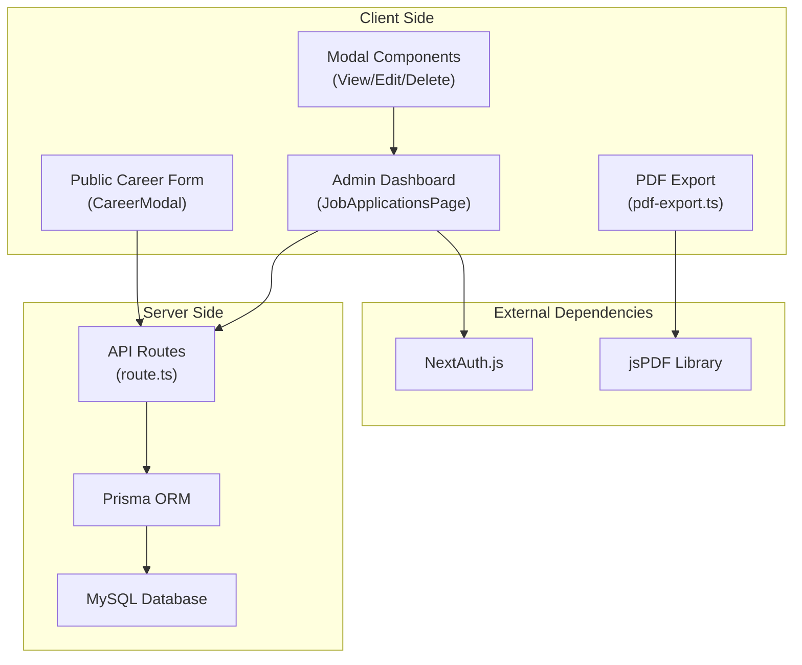
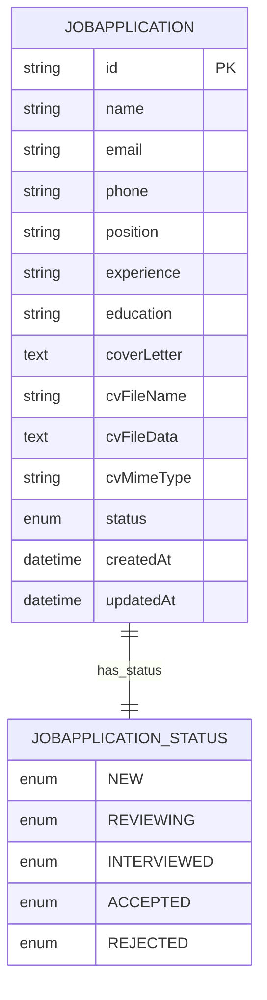
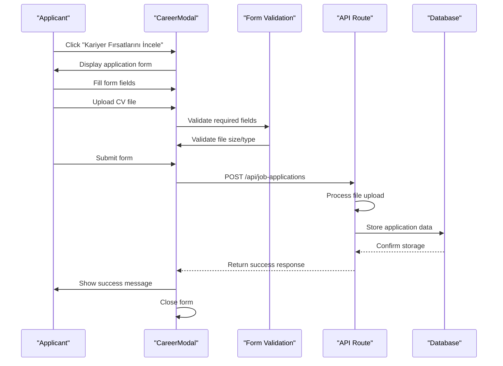
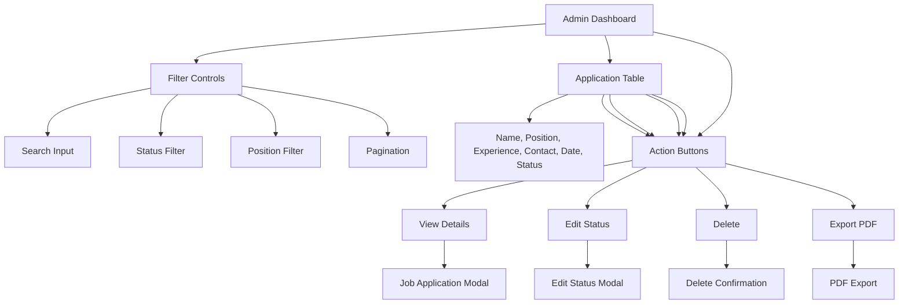
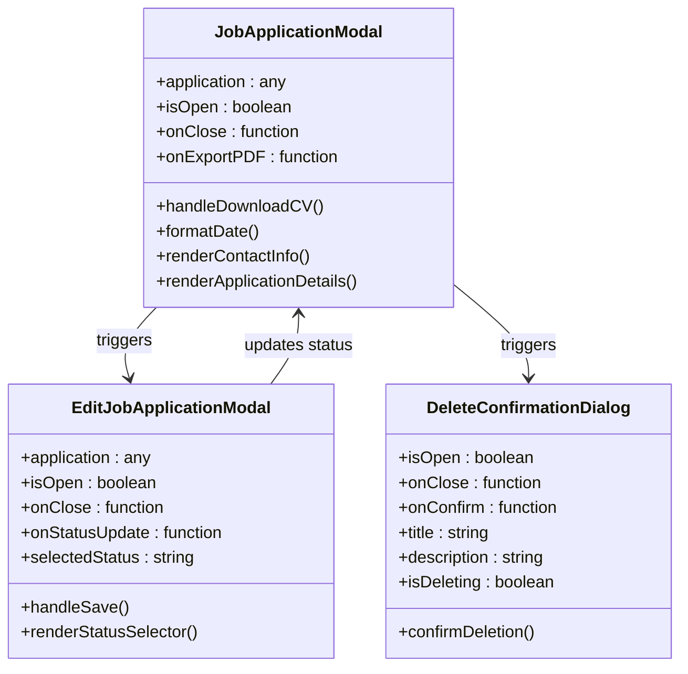
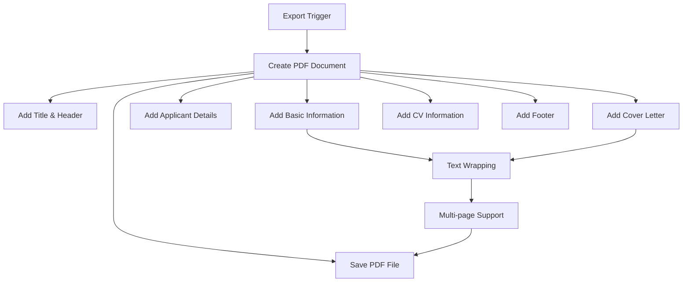
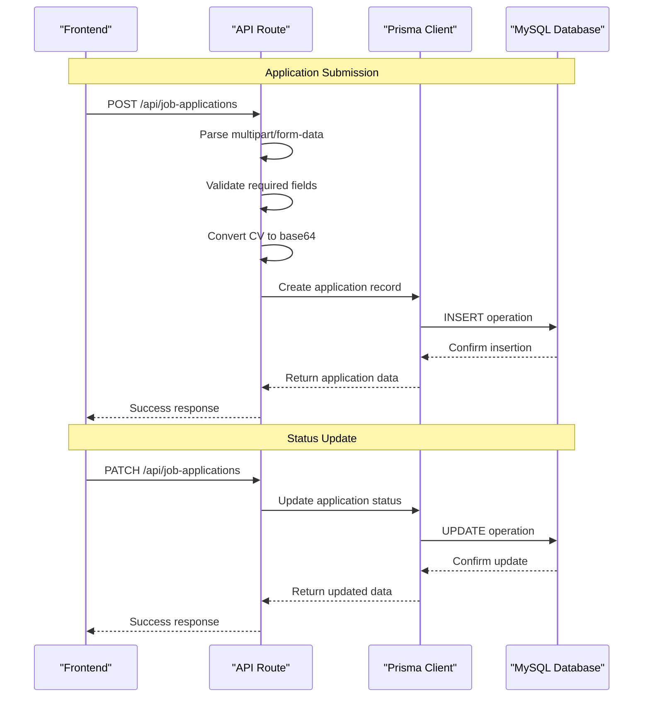
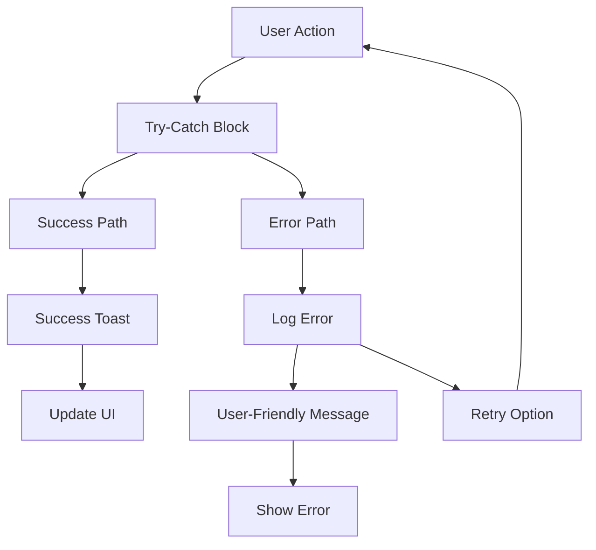
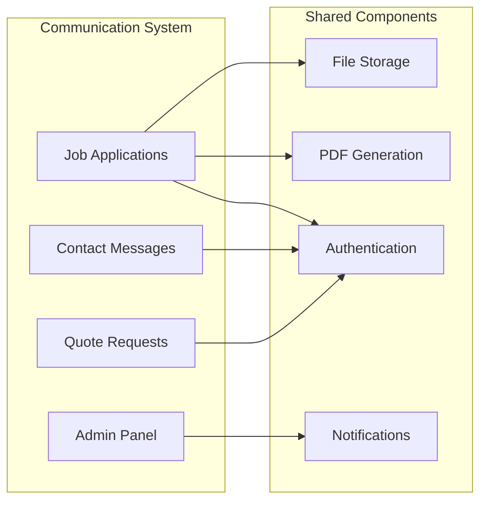

# Job Applications

<cite>
**Referenced Files in This Document**
- [src/app/admin/job-applications/page.tsx](file://src/app/admin/job-applications/page.tsx)
- [src/app/api/job-applications/route.ts](file://src/app/api/job-applications/route.ts)
- [src/components/admin/edit-job-application-modal.tsx](file://src/components/admin/edit-job-application-modal.tsx)
- [src/components/admin/job-application-modal.tsx](file://src/components/admin/job-application-modal.tsx)
- [src/components/modals/career-modal.tsx](file://src/components/modals/career-modal.tsx)
- [src/components/ui/delete-confirmation-dialog.tsx](file://src/components/ui/delete-confirmation-dialog.tsx)
- [src/components/ui/table.tsx](file://src/components/ui/table.tsx)
- [src/lib/pdf-export.ts](file://src/lib/pdf-export.ts)
- [prisma/schema.prisma](file://prisma/schema.prisma)
- [src/components/landing/team-section.tsx](file://src/components/landing/team-section.tsx)
</cite>

## Table of Contents
1. [Introduction](#introduction)
2. [System Architecture](#system-architecture)
3. [Data Model](#data-model)
4. [Public Career Form](#public-career-form)
5. [Admin Dashboard](#admin-dashboard)
6. [Modal Components](#modal-components)
7. [PDF Export Functionality](#pdf-export-functionality)
8. [API Routes](#api-routes)
9. [Error Handling and User Feedback](#error-handling-and-user-feedback)
10. [Data Privacy and Security](#data-privacy-and-security)
11. [Integration with Communication System](#integration-with-communication-system)
12. [Performance Considerations](#performance-considerations)
13. [Troubleshooting Guide](#troubleshooting-guide)

## Introduction

The Job Applications system in smmm-system is a comprehensive solution for managing career applications from public form submissions to admin review and processing. Built with Next.js 14, TypeScript, and Prisma ORM, the system provides a seamless end-to-end workflow for handling job applications while maintaining data privacy and user experience standards.

The system consists of two main components: a public career form for applicants and an admin dashboard for recruiters to manage applications. It features real-time filtering, status tracking, PDF export capabilities, and secure CV file handling.

## System Architecture

The job application system follows a modern React-based architecture with server-side rendering and API routes for data management.

**Diagram sources**
- [src/app/admin/job-applications/page.tsx](file://src/app/admin/job-applications/page.tsx#L1-L50)
- [src/app/api/job-applications/route.ts](file://src/app/api/job-applications/route.ts#L1-L30)
- [src/lib/pdf-export.ts](file://src/lib/pdf-export.ts#L1-L50)

## Data Model

The job application data model is defined in the Prisma schema with comprehensive fields for capturing applicant information and tracking application status.

**Diagram sources**
- [prisma/schema.prisma](file://prisma/schema.prisma#L380-L395)

### Core Data Fields

| Field | Type | Description | Validation |
|-------|------|-------------|------------|
| `id` | String | Unique identifier (UUID) | Auto-generated |
| `name` | String | Full name of applicant | Required |
| `email` | String | Email address | Required, validated format |
| `phone` | String | Contact phone number | Required |
| `position` | String | Applied position | Required, predefined options |
| `experience` | String | Work experience level | Required |
| `education` | String | Educational background | Required |
| `coverLetter` | Text | Personal motivation letter | Optional |
| `cvFileName` | String | Original CV filename | Optional |
| `cvFileData` | Text | Base64 encoded CV content | Optional |
| `cvMimeType` | String | File MIME type | Optional |
| `status` | Enum | Application status | Default: NEW |
| `createdAt` | DateTime | Creation timestamp | Auto-generated |
| `updatedAt` | DateTime | Last update timestamp | Auto-updated |

**Section sources**
- [prisma/schema.prisma](file://prisma/schema.prisma#L380-L395)

## Public Career Form

The public career form is implemented as a modal component integrated into the team section of the landing page, providing a seamless application process for candidates.

### Form Implementation

**Diagram sources**
- [src/components/modals/career-modal.tsx](file://src/components/modals/career-modal.tsx#L50-L100)
- [src/app/api/job-applications/route.ts](file://src/app/api/job-applications/route.ts#L20-L80)

### Form Features

The career form includes comprehensive validation and user experience enhancements:

- **Multi-field Input**: Name, email, phone, position selection, experience level, and education details
- **File Upload**: CV upload with size (max 5MB) and type (PDF/Word) validation
- **Optional Cover Letter**: Rich text area for personal motivation
- **Privacy Compliance**: KVKK consent checkbox with modal display
- **Real-time Validation**: Immediate feedback for field validation
- **Progressive Enhancement**: Loading states and success/error notifications

**Section sources**
- [src/components/modals/career-modal.tsx](file://src/components/modals/career-modal.tsx#L1-L303)

## Admin Dashboard

The admin dashboard provides comprehensive management capabilities for job applications with advanced filtering, sorting, and CRUD operations.

### Dashboard Layout

**Diagram sources**
- [src/app/admin/job-applications/page.tsx](file://src/app/admin/job-applications/page.tsx#L200-L300)

### Key Features

The admin dashboard offers sophisticated management capabilities:

- **Advanced Filtering**: Search by name/email/position, status filtering, and position-specific filtering
- **Responsive Table**: Sortable columns with pagination support (5/10/25/50 items per page)
- **Status Tracking**: Visual status indicators with color-coded badges
- **Bulk Operations**: Individual actions for each application
- **Real-time Updates**: Automatic data refresh with loading states
- **Mobile Responsive**: Adaptive layout for various screen sizes

**Section sources**
- [src/app/admin/job-applications/page.tsx](file://src/app/admin/job-applications/page.tsx#L1-L501)

## Modal Components

The system utilizes specialized modal components for different interaction scenarios, each designed for specific use cases.

### Job Application View Modal

The view modal displays comprehensive application details with interactive CV download functionality.

**Diagram sources**
- [src/components/admin/job-application-modal.tsx](file://src/components/admin/job-application-modal.tsx#L15-L50)
- [src/components/admin/edit-job-application-modal.tsx](file://src/components/admin/edit-job-application-modal.tsx#L15-L50)
- [src/components/ui/delete-confirmation-dialog.tsx](file://src/components/ui/delete-confirmation-dialog.tsx#L10-L40)

### CV Download Mechanism

The CV download functionality handles both legacy file paths and modern base64-encoded files:

- **Base64 Processing**: Converts stored base64 data to downloadable blobs
- **MIME Type Support**: Maintains original file type information
- **Error Handling**: Graceful fallback for missing or corrupted files
- **Browser Compatibility**: Cross-browser download support with cleanup

**Section sources**
- [src/components/admin/job-application-modal.tsx](file://src/components/admin/job-application-modal.tsx#L60-L120)

## PDF Export Functionality

The PDF export system provides professional document generation for job applications using the jsPDF library.

### Export Implementation

**Diagram sources**
- [src/lib/pdf-export.ts](file://src/lib/pdf-export.ts#L50-L150)

### Export Features

The PDF export functionality includes:

- **Professional Formatting**: Clean layout with proper typography and spacing
- **Multi-page Support**: Automatic page breaks for long content
- **Status Translation**: Localized status labels (Turkish)
- **Timestamp Generation**: Export date and time stamps
- **File Naming**: Consistent naming convention (basvuru_{id}.pdf)
- **Content Preservation**: Complete application data inclusion

**Section sources**
- [src/lib/pdf-export.ts](file://src/lib/pdf-export.ts#L1-L241)

## API Routes

The API layer handles all backend operations for job application management with proper authentication and data validation.

### Route Endpoints

| Method | Endpoint | Purpose | Authentication |
|--------|----------|---------|----------------|
| GET | `/api/job-applications` | Fetch all applications | Admin only |
| POST | `/api/job-applications` | Submit new application | Public |
| PATCH | `/api/job-applications` | Update application status | Admin only |
| DELETE | `/api/job-applications` | Delete application | Admin only |

### Request/Response Patterns

**Diagram sources**
- [src/app/api/job-applications/route.ts](file://src/app/api/job-applications/route.ts#L15-L130)

### Security Measures

The API implements comprehensive security measures:

- **File Validation**: Size limits (5MB max) and type restrictions (PDF/Word)
- **Field Validation**: Required field checking and format validation
- **Error Handling**: Detailed error messages without exposing internal details
- **Rate Limiting**: Protection against abuse through proper HTTP status codes
- **Data Sanitization**: Prevention of injection attacks through proper parsing

**Section sources**
- [src/app/api/job-applications/route.ts](file://src/app/api/job-applications/route.ts#L1-L130)

## Error Handling and User Feedback

The system implements comprehensive error handling and user feedback mechanisms across all interaction points.

### Error Handling Strategy

### Feedback Mechanisms

The system provides multiple layers of user feedback:

- **Toast Notifications**: Real-time success/error messages using sonner
- **Loading States**: Visual feedback during API operations
- **Form Validation**: Inline validation messages
- **Modal States**: Clear indication of modal actions
- **Button States**: Disabled/enabled states during processing
- **Network Errors**: Graceful handling of connectivity issues

**Section sources**
- [src/app/admin/job-applications/page.tsx](file://src/app/admin/job-applications/page.tsx#L150-L200)

## Data Privacy and Security

The job application system implements robust data privacy and security measures to protect sensitive applicant information.

### Privacy Features

- **GDPR Compliance**: KVKK (Turkish GDPR equivalent) compliance with explicit consent
- **Data Minimization**: Only essential information collected for each application
- **Secure Storage**: CV files stored as base64 encoded data in database
- **Access Control**: Admin-only access to sensitive application details
- **Audit Trail**: Timestamp tracking for all application activities
- **Data Retention**: Configurable retention policies for application data

### Security Measures

- **Input Validation**: Comprehensive form validation and sanitization
- **File Security**: Uploaded file type and size validation
- **CSRF Protection**: Built-in Next.js CSRF protection
- **HTTPS Enforcement**: Secure communication protocols
- **Error Masking**: Generic error messages prevent information disclosure
- **Rate Limiting**: Protection against automated abuse

**Section sources**
- [src/components/modals/career-modal.tsx](file://src/components/modals/career-modal.tsx#L280-L303)

## Integration with Communication System

The job application system integrates seamlessly with the broader communication infrastructure of smmm-system.

### System Integration

**Diagram sources**
- [src/app/admin/job-applications/page.tsx](file://src/app/admin/job-applications/page.tsx#L1-L20)
- [src/lib/pdf-export.ts](file://src/lib/pdf-export.ts#L1-L30)

### Shared Infrastructure

The job application system leverages shared infrastructure components:

- **Authentication**: Unified NextAuth.js authentication system
- **Notifications**: Centralized toast notification system
- **PDF Generation**: Shared jsPDF library for document creation
- **File Management**: Consistent file handling across all upload features
- **Error Logging**: Centralized error tracking and monitoring
- **UI Components**: Reusable component library for consistent UX

**Section sources**
- [src/app/admin/job-applications/page.tsx](file://src/app/admin/job-applications/page.tsx#L1-L50)

## Performance Considerations

The job application system is optimized for performance across multiple dimensions.

### Frontend Performance

- **Code Splitting**: Lazy loading of heavy components and modals
- **Optimized Rendering**: Efficient table rendering with virtualization concepts
- **State Management**: Minimal re-renders through proper state updates
- **Bundle Optimization**: Tree shaking and dead code elimination
- **Image Optimization**: Efficient CV file handling without image processing overhead

### Backend Performance

- **Database Indexing**: Proper indexing on frequently queried fields
- **Query Optimization**: Efficient Prisma queries with selective field loading
- **Caching**: Client-side caching of application lists
- **Connection Pooling**: Optimized database connection management
- **File Storage**: Base64 encoding reduces file system overhead

### Scalability Features

- **Pagination**: Efficient handling of large application datasets
- **Filtering**: Server-side filtering reduces payload size
- **Modular Design**: Independent component architecture
- **API Rate Limiting**: Built-in protection against excessive requests
- **Memory Management**: Proper cleanup of file handles and timeouts

## Troubleshooting Guide

Common issues and their solutions for the job application system.

### Form Submission Issues

**Problem**: CV upload fails
- **Cause**: File size exceeds 5MB limit
- **Solution**: Reduce file size or compress PDF
- **Prevention**: Implement client-side size validation

**Problem**: Form submission timeout
- **Cause**: Large CV file or network issues
- **Solution**: Increase timeout settings or optimize file size
- **Prevention**: Implement progress indicators for large uploads

### Admin Dashboard Issues

**Problem**: Applications not loading
- **Cause**: Network connectivity or API endpoint issues
- **Solution**: Check browser console for error messages
- **Prevention**: Implement retry mechanisms and offline indicators

**Problem**: Status updates failing
- **Cause**: Authentication issues or database connectivity
- **Solution**: Verify admin authentication and database connection
- **Prevention**: Add confirmation dialogs for critical operations

### PDF Export Issues

**Problem**: CV download fails
- **Cause**: Corrupted base64 data or unsupported file types
- **Solution**: Verify file encoding and MIME type
- **Prevention**: Implement file integrity checks

**Problem**: PDF export fails
- **Cause**: Large content requiring multiple pages
- **Solution**: Implement page break detection and handling
- **Prevention**: Optimize content formatting for PDF generation

**Section sources**
- [src/app/admin/job-applications/page.tsx](file://src/app/admin/job-applications/page.tsx#L150-L200)
- [src/components/admin/job-application-modal.tsx](file://src/components/admin/job-application-modal.tsx#L60-L120)