# Quote Requests

<cite>
**Referenced Files in This Document**
- [src/app/admin/quote-requests/page.tsx](file://src/app/admin/quote-requests/page.tsx)
- [src/app/api/quote-requests/route.ts](file://src/app/api/quote-requests/route.ts)
- [src/components/admin/edit-quote-request-modal.tsx](file://src/components/admin/edit-quote-request-modal.tsx)
- [src/components/admin/quote-request-modal.tsx](file://src/components/admin/quote-request-modal.tsx)
- [src/components/modals/quote-request-modal.tsx](file://src/components/modals/quote-request-modal.tsx)
- [src/lib/pdf-export.ts](file://src/lib/pdf-export.ts)
- [src/lib/prisma.ts](file://src/lib/prisma.ts)
- [prisma/schema.prisma](file://prisma/schema.prisma)
- [src/components/landing/contact-section.tsx](file://src/components/landing/contact-section.tsx)
- [src/lib/auth.ts](file://src/lib/auth.ts)
- [src/app/auth/signin/page.tsx](file://src/app/auth/signin/page.tsx)
</cite>

## Table of Contents
1. [Introduction](#introduction)
2. [System Architecture](#system-architecture)
3. [Data Model](#data-model)
4. [Public Form Submission](#public-form-submission)
5. [Admin Interface](#admin-interface)
6. [API Endpoints](#api-endpoints)
7. [PDF Export Functionality](#pdf-export-functionality)
8. [State Management](#state-management)
9. [Error Handling](#error-handling)
10. [Performance Considerations](#performance-considerations)
11. [Authentication Integration](#authentication-integration)
12. [Workflow Diagrams](#workflow-diagrams)

## Introduction

The Quote Requests system in the smmm-system is a comprehensive management solution for handling pricing inquiries from clients. It provides a seamless workflow from public form submissions through to administrative processing, featuring real-time data persistence, advanced filtering capabilities, and professional PDF export functionality.

The system serves two primary use cases: public website visitors submitting quote requests through a dedicated modal form, and administrators managing these requests through an intuitive admin interface. Built on modern React patterns with Next.js API routes and Prisma ORM, it offers robust data management with TypeScript type safety and comprehensive error handling.

## System Architecture

The quote request management system follows a layered architecture pattern with clear separation of concerns:

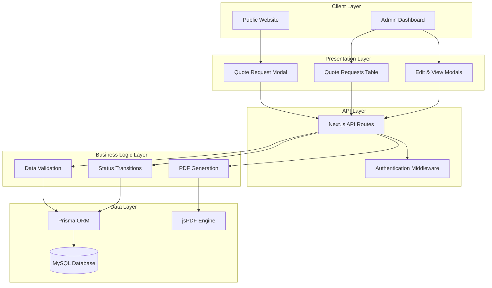

**Diagram sources**
- [src/app/admin/quote-requests/page.tsx](file://src/app/admin/quote-requests/page.tsx#L1-L50)
- [src/app/api/quote-requests/route.ts](file://src/app/api/quote-requests/route.ts#L1-L30)
- [src/lib/prisma.ts](file://src/lib/prisma.ts#L1-L10)

## Data Model

The quote request system utilizes a comprehensive data model defined in the Prisma schema with the following structure:

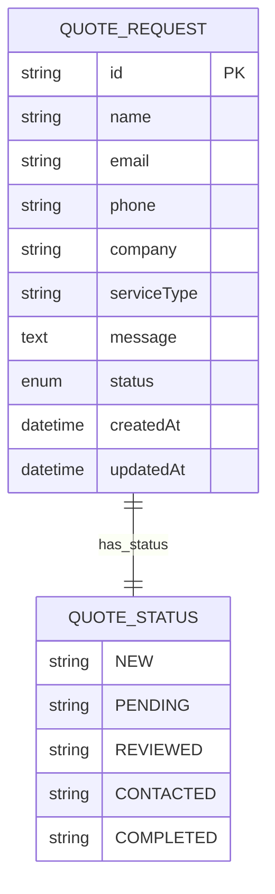

**Diagram sources**
- [prisma/schema.prisma](file://prisma/schema.prisma#L380-L395)

### Core Fields

| Field | Type | Description | Constraints |
|-------|------|-------------|-------------|
| `id` | String | Unique identifier (UUID) | Auto-generated, Primary Key |
| `name` | String | Full name of requester | Required |
| `email` | String | Email address | Required, Must be valid email format |
| `phone` | String | Contact phone number | Required |
| `company` | String | Company/Organization name | Optional |
| `serviceType` | String | Type of service requested | Required |
| `message` | Text | Detailed request message | Optional |
| `status` | Enum | Request processing status | Default: NEW |
| `createdAt` | DateTime | Record creation timestamp | Auto-generated |
| `updatedAt` | DateTime | Last modification timestamp | Auto-updated |

### Status Workflow

The system implements a five-stage status workflow:

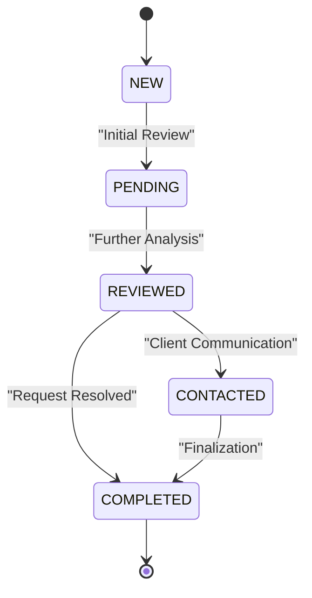

**Diagram sources**
- [prisma/schema.prisma](file://prisma/schema.prisma#L396-L402)
- [src/app/admin/quote-requests/page.tsx](file://src/app/admin/quote-requests/page.tsx#L83-L95)

**Section sources**
- [prisma/schema.prisma](file://prisma/schema.prisma#L380-L395)
- [src/app/admin/quote-requests/page.tsx](file://src/app/admin/quote-requests/page.tsx#L83-L95)

## Public Form Submission

The public quote request form provides a streamlined user experience for visitors to submit inquiries through the website:

### Form Implementation

The public form is implemented as a modal component that integrates seamlessly with the landing page:

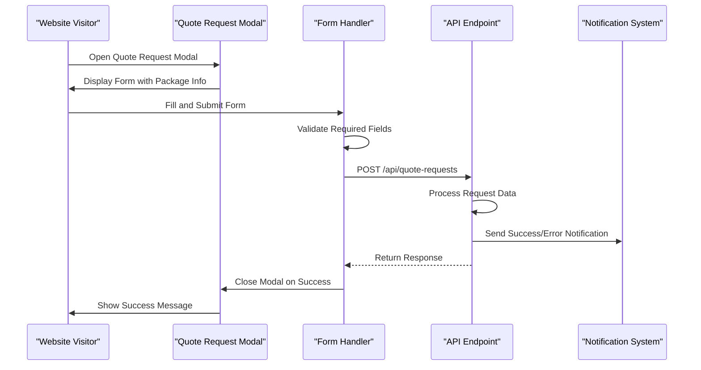

**Diagram sources**
- [src/components/modals/quote-request-modal.tsx](file://src/components/modals/quote-request-modal.tsx#L20-L60)
- [src/app/api/quote-requests/route.ts](file://src/app/api/quote-requests/route.ts#L15-L50)

### Form Validation and Processing

The form implements comprehensive validation and data processing:

| Field | Validation Rules | Error Handling |
|-------|------------------|----------------|
| Name | Required, First and Last Name | Real-time feedback |
| Email | Required, Valid email format | Format validation |
| Phone | Required, International format | Input masking support |
| Company | Optional | Graceful fallback handling |
| Service Type | Inferred from package selection | Pre-populated field |
| Message | Optional | Character limit enforcement |

**Section sources**
- [src/components/modals/quote-request-modal.tsx](file://src/components/modals/quote-request-modal.tsx#L20-L80)
- [src/app/api/quote-requests/route.ts](file://src/app/api/quote-requests/route.ts#L15-L50)

## Admin Interface

The admin interface provides comprehensive management capabilities for quote requests with advanced filtering, sorting, and export functionality.

### Main Dashboard Features

The admin page implements a sophisticated table-based interface with the following capabilities:

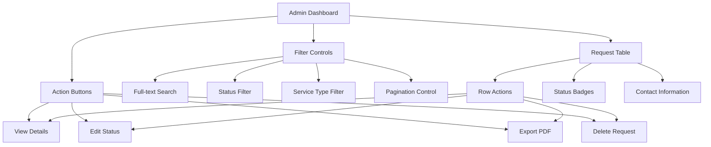

**Diagram sources**
- [src/app/admin/quote-requests/page.tsx](file://src/app/admin/quote-requests/page.tsx#L150-L250)

### Filtering and Search Capabilities

The system provides multiple filtering mechanisms:

| Filter Type | Implementation | Scope |
|-------------|----------------|-------|
| Full-text Search | Case-insensitive substring matching | Name, Email, Company |
| Status Filter | Dropdown selection | All statuses or individual status |
| Service Type Filter | Dynamic dropdown | Extracted from existing requests |
| Pagination | Configurable items per page | 5, 10, 25, 50 items |

### Status Management Interface

The edit status modal provides intuitive status transition controls:

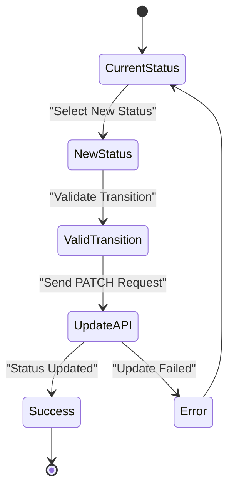

**Diagram sources**
- [src/components/admin/edit-quote-request-modal.tsx](file://src/components/admin/edit-quote-request-modal.tsx#L80-L120)

**Section sources**
- [src/app/admin/quote-requests/page.tsx](file://src/app/admin/quote-requests/page.tsx#L150-L350)
- [src/components/admin/edit-quote-request-modal.tsx](file://src/components/admin/edit-quote-request-modal.tsx#L80-L166)

## API Endpoints

The system exposes four primary API endpoints for comprehensive quote request management:

### Endpoint Specifications

| Method | Endpoint | Purpose | Request Body | Response |
|--------|----------|---------|--------------|----------|
| GET | `/api/quote-requests` | Retrieve all requests | None | Array of quote requests |
| POST | `/api/quote-requests` | Create new request | Form data | Created request object |
| PATCH | `/api/quote-requests` | Update request status | `{id, status}` | Updated request object |
| DELETE | `/api/quote-requests` | Delete request | Query parameter: `id` | Success message |

### Request Processing Flow

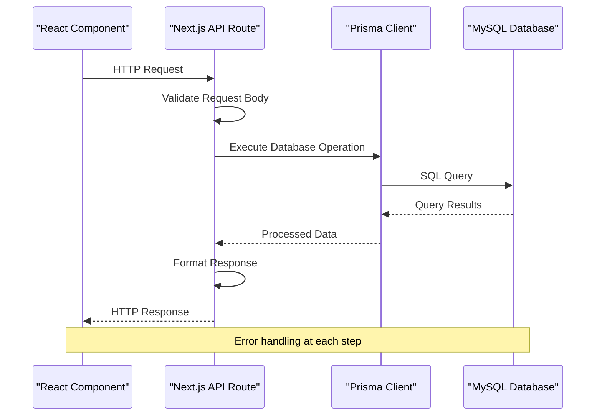

**Diagram sources**
- [src/app/api/quote-requests/route.ts](file://src/app/api/quote-requests/route.ts#L1-L98)

### Data Persistence Strategy

The API implements robust data persistence with transaction support and error handling:

| Operation | Prisma Method | Transaction Support | Error Handling |
|-----------|---------------|-------------------|----------------|
| Read | `findMany()` | No | 500 Internal Server Error |
| Create | `create()` | No | Validation errors handled |
| Update | `update()` | No | Record not found protection |
| Delete | `delete()` | No | Cascade deletion support |

**Section sources**
- [src/app/api/quote-requests/route.ts](file://src/app/api/quote-requests/route.ts#L1-L98)

## PDF Export Functionality

The system provides professional PDF export capabilities through a centralized export function that generates standardized report formats.

### Export Function Architecture

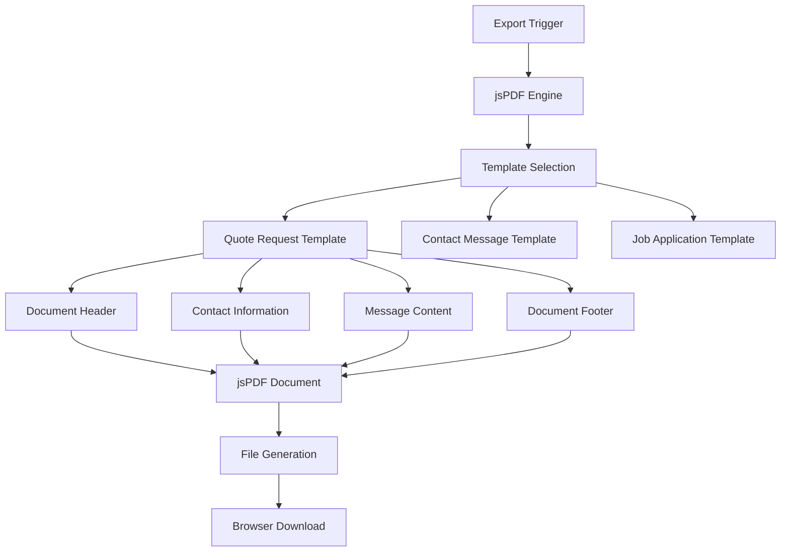

**Diagram sources**
- [src/lib/pdf-export.ts](file://src/lib/pdf-export.ts#L100-L150)

### PDF Template Structure

The quote request PDF template includes comprehensive information:

| Section | Content | Formatting |
|---------|---------|------------|
| Header | "TEKLIF TALEBI DETAYLARI" | Bold, 16pt font |
| Basic Info | ID, Date, Status | 10pt font, left-aligned |
| Contact Info | Name, Company, Email, Phone, Service Type | 10pt font, bullet points |
| Message Content | Request message with wrapping | 10pt font, word wrap |
| Footer | Generation date | 8pt font, centered |

### Export Process Implementation

The export process handles document generation and user feedback:

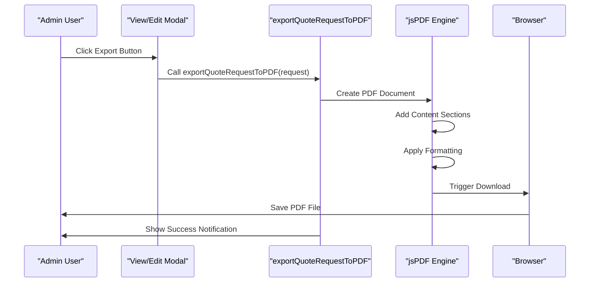

**Diagram sources**
- [src/lib/pdf-export.ts](file://src/lib/pdf-export.ts#L100-L150)
- [src/components/admin/quote-request-modal.tsx](file://src/components/admin/quote-request-modal.tsx#L170-L182)

**Section sources**
- [src/lib/pdf-export.ts](file://src/lib/pdf-export.ts#L100-L240)
- [src/components/admin/quote-request-modal.tsx](file://src/components/admin/quote-request-modal.tsx#L170-L182)

## State Management

The admin interface implements sophisticated state management using React hooks with proper cleanup and optimization strategies.

### Component State Architecture

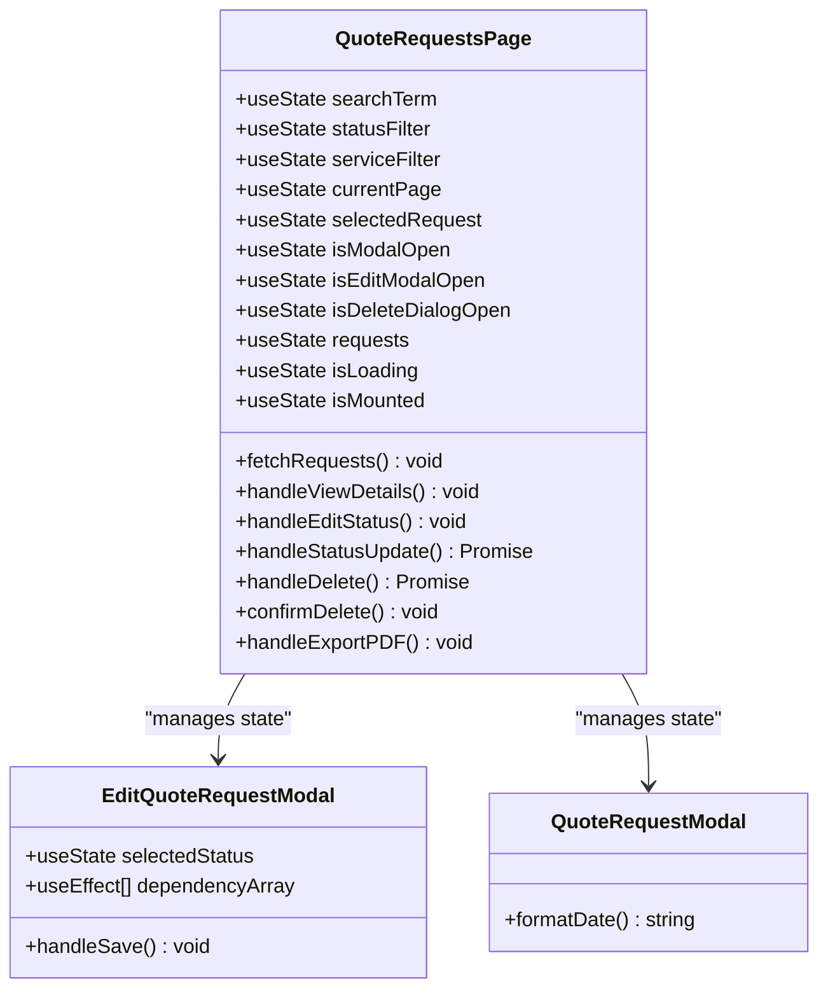

**Diagram sources**
- [src/app/admin/quote-requests/page.tsx](file://src/app/admin/quote-requests/page.tsx#L85-L120)
- [src/components/admin/edit-quote-request-modal.tsx](file://src/components/admin/edit-quote-request-modal.tsx#L40-L60)

### State Synchronization Patterns

The system implements several state synchronization patterns:

| Pattern | Implementation | Purpose |
|---------|----------------|---------|
| Controlled Components | `useState` with `onChange` handlers | Form input management |
| Derived State | Computed values from base state | Filtered and paginated data |
| Effect Dependencies | `useEffect` with dependency arrays | API calls and cleanup |
| Event Propagation | Callback props for parent-child communication | Modal state management |

### Performance Optimization Strategies

The state management incorporates several performance optimization techniques:

- **Memoization**: Using `useCallback` for expensive operations
- **Conditional Rendering**: Optimizing component re-renders
- **Debounced Search**: Preventing excessive API calls during typing
- **Pagination**: Limiting data load for large datasets

**Section sources**
- [src/app/admin/quote-requests/page.tsx](file://src/app/admin/quote-requests/page.tsx#L85-L200)
- [src/components/admin/edit-quote-request-modal.tsx](file://src/components/admin/edit-quote-request-modal.tsx#L40-L80)

## Error Handling

The system implements comprehensive error handling strategies across all layers of the application.

### Error Handling Architecture

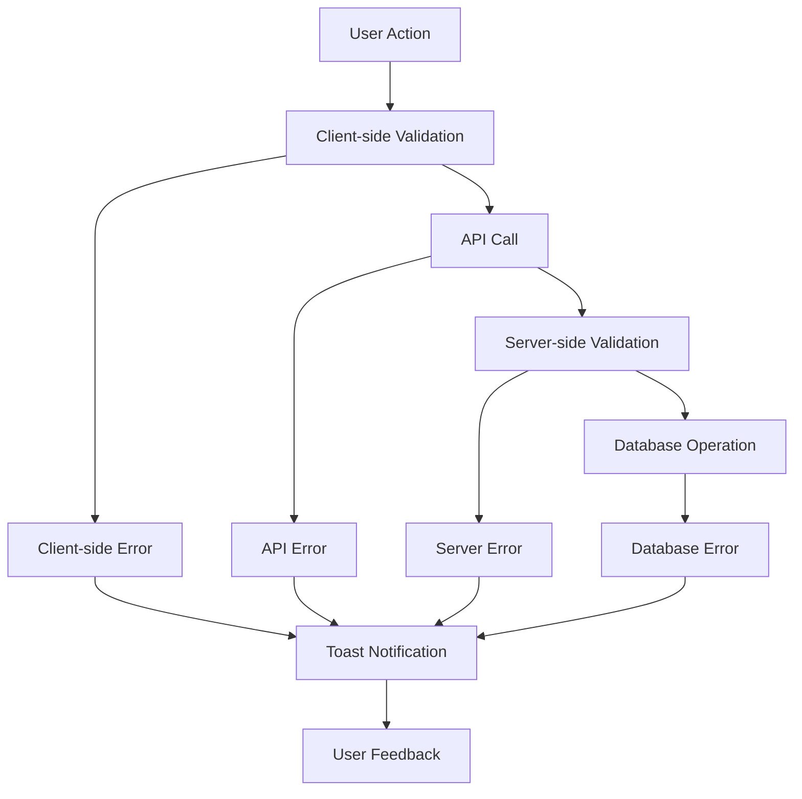

**Diagram sources**
- [src/app/admin/quote-requests/page.tsx](file://src/app/admin/quote-requests/page.tsx#L120-L180)
- [src/app/api/quote-requests/route.ts](file://src/app/api/quote-requests/route.ts#L20-L50)

### Error Categories and Responses

| Error Category | Implementation | User Experience |
|----------------|----------------|-----------------|
| Validation Errors | Form field validation | Inline error messages |
| Network Errors | Fetch API error handling | Retry mechanisms |
| Database Errors | Prisma error catching | Generic error messages |
| Authentication Errors | Token validation | Redirect to login |
| Authorization Errors | Role-based access control | Access denied messages |

### Notification System Integration

The system uses the Sonner notification library for consistent user feedback:

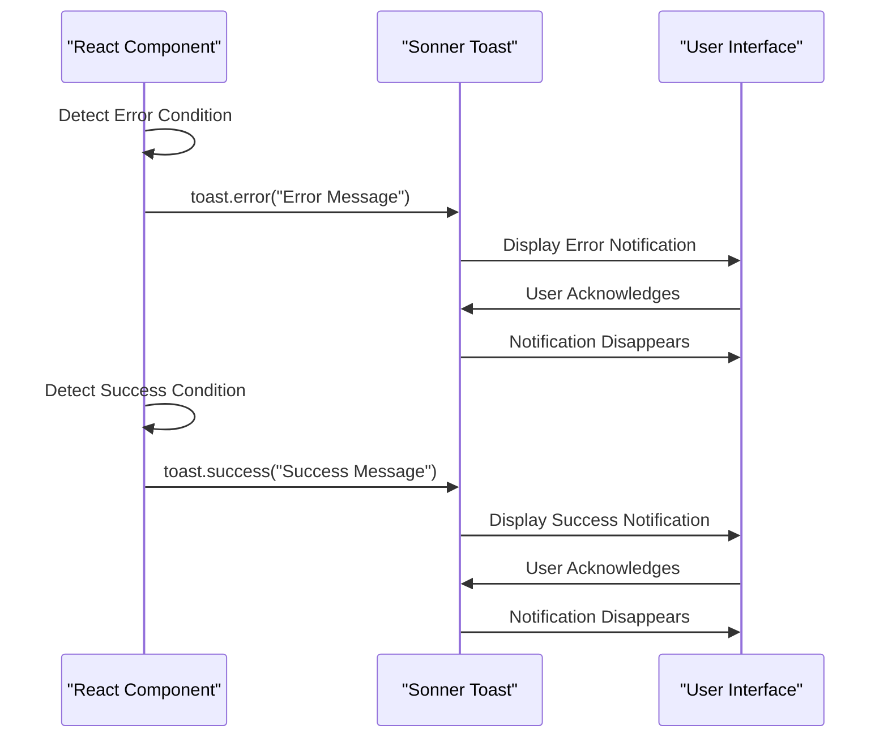

**Diagram sources**
- [src/app/admin/quote-requests/page.tsx](file://src/app/admin/quote-requests/page.tsx#L120-L180)

**Section sources**
- [src/app/admin/quote-requests/page.tsx](file://src/app/admin/quote-requests/page.tsx#L120-L180)
- [src/app/api/quote-requests/route.ts](file://src/app/api/quote-requests/route.ts#L20-L98)

## Performance Considerations

The system implements several performance optimization strategies to handle large datasets efficiently and provide responsive user experiences.

### Data Loading Optimization

The admin interface implements progressive data loading with the following strategies:

| Optimization | Implementation | Benefit |
|--------------|----------------|---------|
| Lazy Loading | Client-side mounting detection | Prevents unnecessary API calls |
| Pagination | Configurable items per page | Limits initial data load |
| Virtual Scrolling | Not implemented but available | Future scalability |
| Caching | Browser caching headers | Reduces redundant requests |

### Memory Management

The system employs memory-efficient patterns:

- **Component Cleanup**: Proper cleanup in `useEffect` hooks
- **Event Listener Management**: Automatic removal of event listeners
- **State Optimization**: Minimal state updates to prevent re-renders
- **Bundle Splitting**: Dynamic imports for large components

### Scalability Features

For handling large datasets, the system includes:

- **Server-side Filtering**: Prisma query optimization
- **Indexing Strategy**: Database indexes on frequently queried fields
- **Connection Pooling**: Prisma connection management
- **Rate Limiting**: API rate limiting for protection

**Section sources**
- [src/app/admin/quote-requests/page.tsx](file://src/app/admin/quote-requests/page.tsx#L100-L150)

## Authentication Integration

The quote request system integrates seamlessly with the NextAuth.js authentication framework, providing secure access control and user management.

### Authentication Architecture

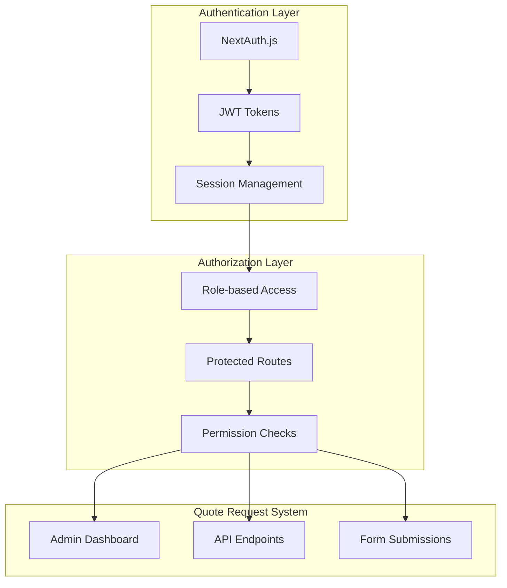

**Diagram sources**
- [src/lib/auth.ts](file://src/lib/auth.ts#L1-L86)
- [src/app/auth/signin/page.tsx](file://src/app/auth/signin/page.tsx#L1-L50)

### Role-Based Access Control

The system implements role-based access control for different user types:

| Role | Access Level | Quote Request Access |
|------|-------------|---------------------|
| ADMIN | Full access | Complete management |
| CLIENT | Limited access | Self-service only |
| PUBLIC | No access | Form submissions only |

### Security Measures

The authentication system implements comprehensive security measures:

- **Password Hashing**: BCrypt for password storage
- **Session Management**: Secure cookie-based sessions
- **CSRF Protection**: Built-in CSRF protection
- **Rate Limiting**: Protection against brute force attacks
- **Secure Headers**: HTTPS enforcement and security headers

**Section sources**
- [src/lib/auth.ts](file://src/lib/auth.ts#L1-L86)
- [src/app/auth/signin/page.tsx](file://src/app/auth/signin/page.tsx#L1-L193)

## Workflow Diagrams

### Complete System Workflow

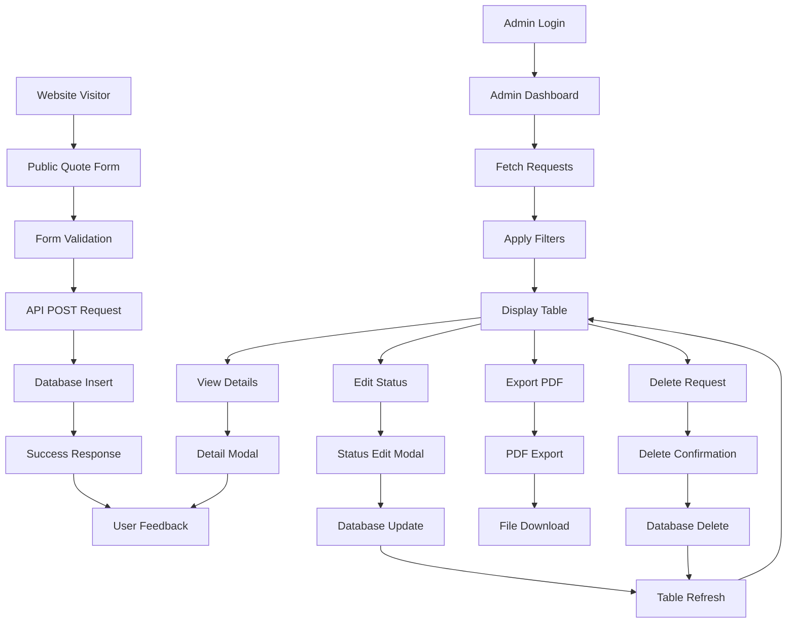

**Diagram sources**
- [src/components/modals/quote-request-modal.tsx](file://src/components/modals/quote-request-modal.tsx#L20-L80)
- [src/app/admin/quote-requests/page.tsx](file://src/app/admin/quote-requests/page.tsx#L120-L200)

### Status Transition Workflow

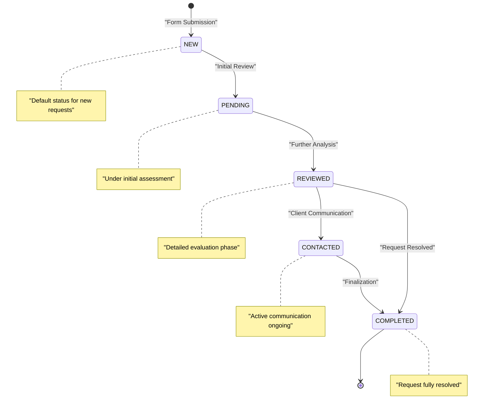

**Diagram sources**
- [prisma/schema.prisma](file://prisma/schema.prisma#L396-L402)

### Error Recovery Workflow

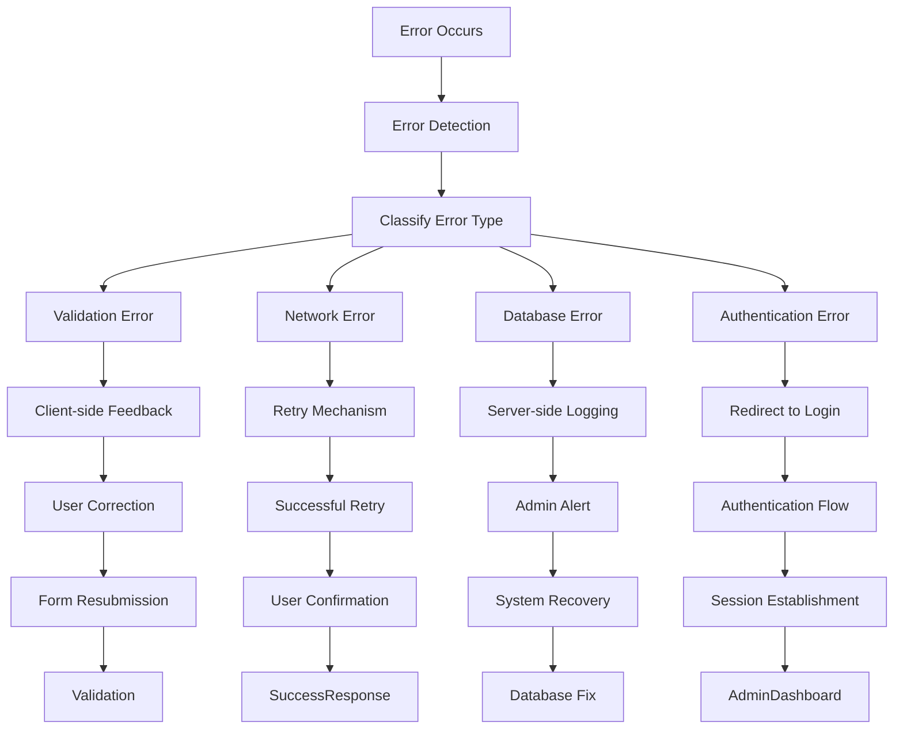

**Diagram sources**
- [src/app/admin/quote-requests/page.tsx](file://src/app/admin/quote-requests/page.tsx#L120-L180)
- [src/app/api/quote-requests/route.ts](file://src/app/api/quote-requests/route.ts#L20-L98)