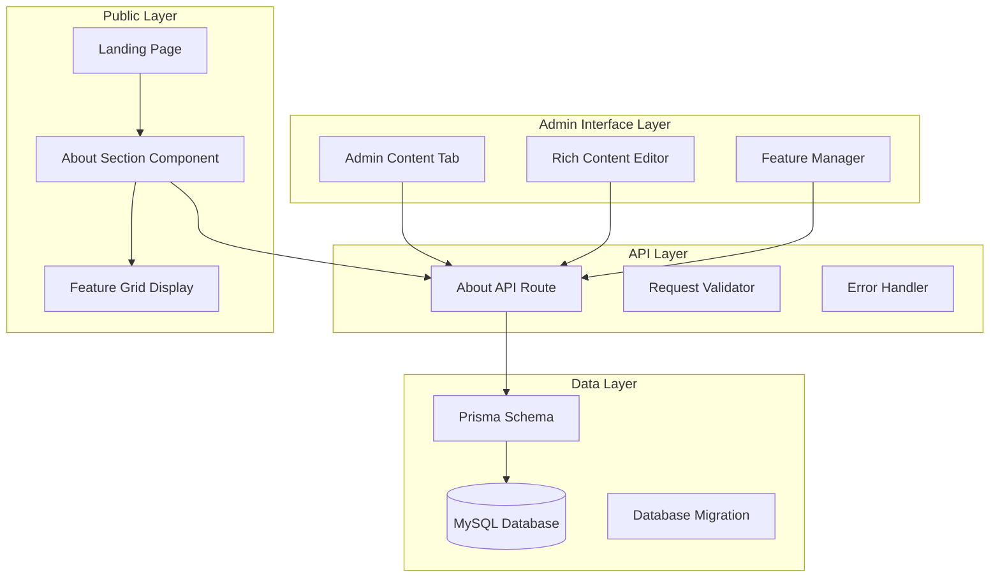
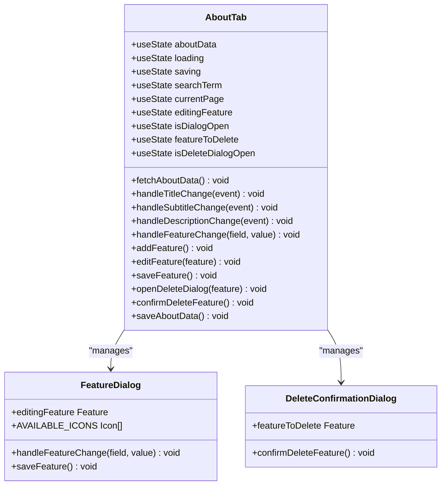
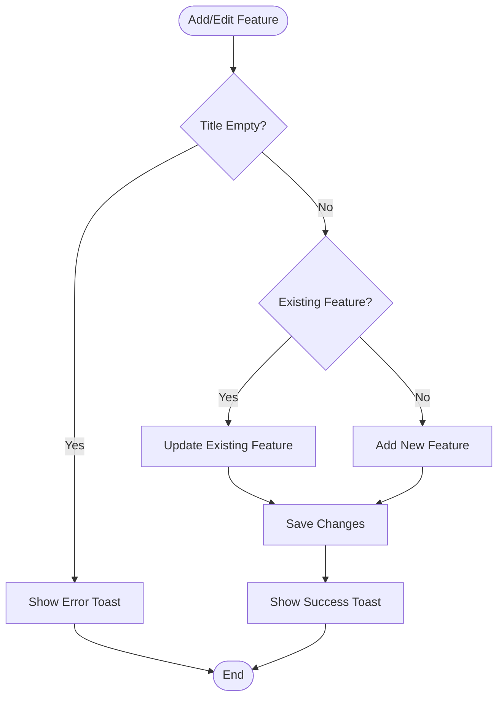
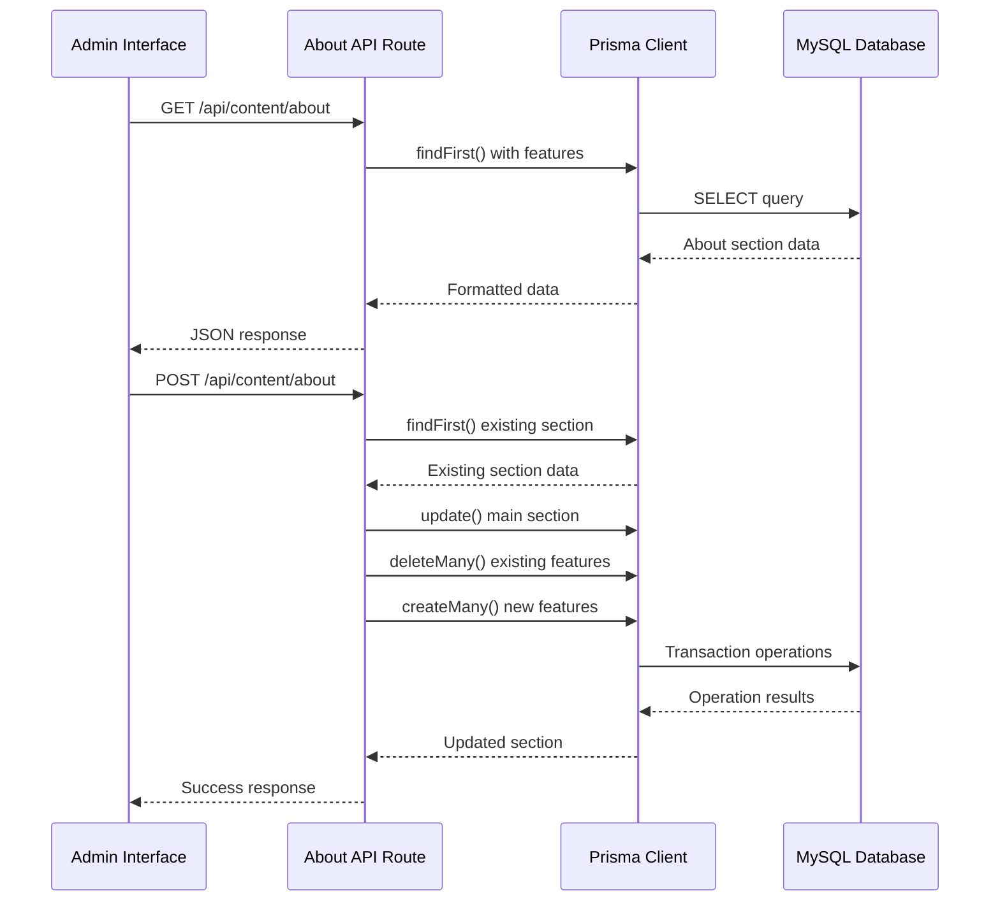
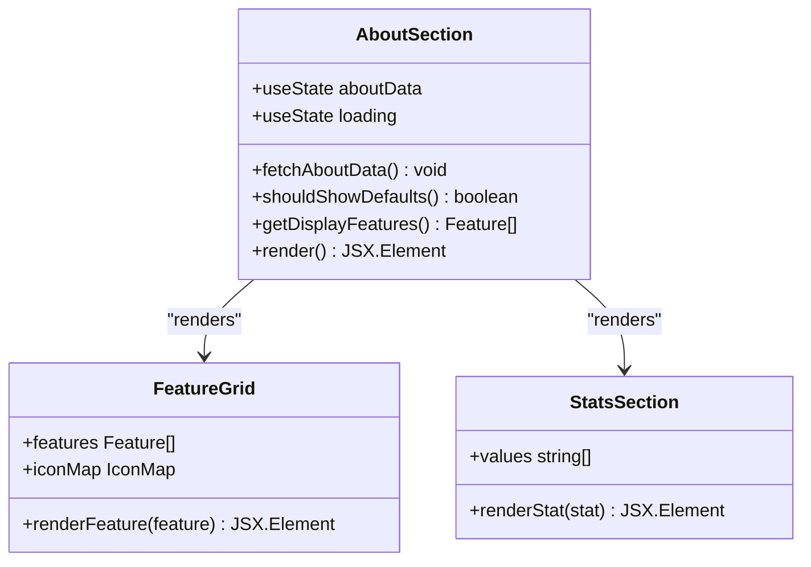
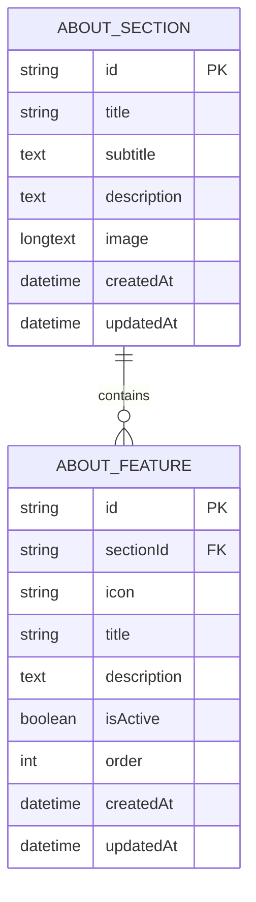
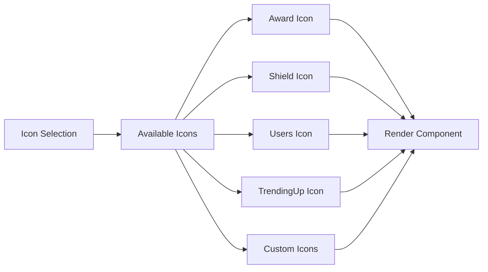
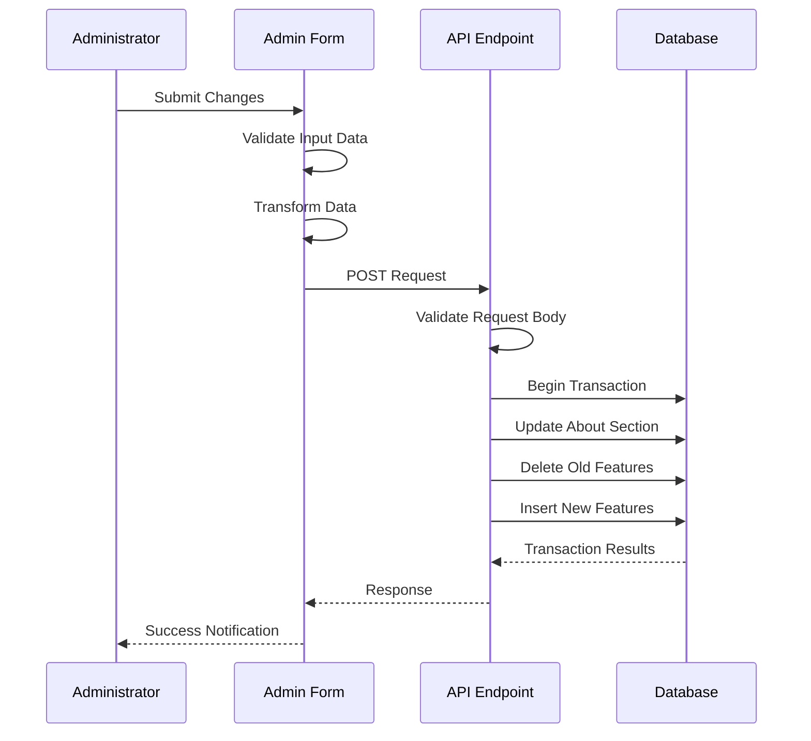

# About Section Management

<cite>
**Referenced Files in This Document**
- [src/app/admin/content/page.tsx](file://src/app/admin/content/page.tsx)
- [src/components/admin/content-tabs/about-tab.tsx](file://src/components/admin/content-tabs/about-tab.tsx)
- [src/app/api/content/about/route.ts](file://src/app/api/content/about/route.ts)
- [src/components/landing/about-section.tsx](file://src/components/landing/about-section.tsx)
- [prisma/schema.prisma](file://prisma/schema.prisma)
- [src/lib/db.ts](file://src/lib/db.ts)
- [src/app/(public)/page.tsx](file://src/app/(public)/page.tsx)
</cite>

## Table of Contents
1. [Introduction](#introduction)
2. [System Architecture](#system-architecture)
3. [Admin Interface Implementation](#admin-interface-implementation)
4. [API Layer Design](#api-layer-design)
5. [Public Landing Page Integration](#public-landing-page-integration)
6. [Data Model and Database Schema](#data-model-and-database-schema)
7. [Rich Content Editor Features](#rich-content-editor-features)
8. [Form Submission and Persistence](#form-submission-and-persistence)
9. [Error Handling and Validation](#error-handling-and-validation)
10. [Common Issues and Solutions](#common-issues-and-solutions)
11. [Best Practices](#best-practices)
12. [Troubleshooting Guide](#troubleshooting-guide)

## Introduction

The About Section Management functionality provides a comprehensive solution for managing the "About Us" content on both the admin panel and public landing page. This system enables administrators to create, edit, and manage rich content including titles, subtitles, descriptions, and feature blocks with customizable icons. The implementation follows a modern React-based architecture with Next.js API routes, featuring robust error handling, data validation, and seamless integration between the admin interface and public-facing content.

## System Architecture

The About Section Management system follows a layered architecture pattern with clear separation of concerns:

**Diagram sources**
- [src/components/admin/content-tabs/about-tab.tsx](file://src/components/admin/content-tabs/about-tab.tsx#L1-L581)
- [src/app/api/content/about/route.ts](file://src/app/api/content/about/route.ts#L1-L190)
- [src/components/landing/about-section.tsx](file://src/components/landing/about-section.tsx#L1-L266)

## Admin Interface Implementation

The admin interface is built around the `AboutTab` component, which serves as the primary management interface for the About section content. This component provides a comprehensive form with real-time validation and feedback mechanisms.

### Component Structure and State Management

The `AboutTab` component utilizes React's state management capabilities to handle complex form data:

**Diagram sources**
- [src/components/admin/content-tabs/about-tab.tsx](file://src/components/admin/content-tabs/about-tab.tsx#L150-L250)

### Rich Content Editor Features

The admin interface provides sophisticated editing capabilities for various content types:

#### Title and Subtitle Management
- **Title Field**: Single-line input for the main heading
- **Subtitle Field**: Multi-line textarea for introductory text
- **Real-time Validation**: Immediate feedback for empty fields
- **Character Limits**: Built-in character counting for optimal SEO

#### Description Editor
- **Multi-line Textarea**: Supports rich text formatting
- **Word Count**: Real-time word count display
- **Auto-formatting**: Consistent spacing and paragraph structure
- **Preview Mode**: Live preview of formatted content

#### Feature Management System
The feature management system allows administrators to create and manage feature blocks with comprehensive customization options:

**Diagram sources**
- [src/components/admin/content-tabs/about-tab.tsx](file://src/components/admin/content-tabs/about-tab.tsx#L200-L230)

**Section sources**
- [src/components/admin/content-tabs/about-tab.tsx](file://src/components/admin/content-tabs/about-tab.tsx#L150-L300)

## API Layer Design

The API layer implements a RESTful interface for managing About section data with comprehensive CRUD operations and data validation.

### API Route Implementation

The `/api/content/about` route handles both GET and POST requests with sophisticated data processing:

**Diagram sources**
- [src/app/api/content/about/route.ts](file://src/app/api/content/about/route.ts#L40-L190)

### Request Processing Pipeline

The API implements a robust request processing pipeline with fallback mechanisms:

#### GET Request Handling
- **Data Retrieval**: Fetches complete About section with associated features
- **Default Value Fallback**: Returns predefined defaults if no data exists
- **Feature Ordering**: Maintains feature order through database queries
- **Error Recovery**: Graceful degradation with default values

#### POST Request Processing
- **Data Validation**: Comprehensive input validation
- **Transaction Management**: Atomic operations for data consistency
- **Feature Synchronization**: Complete replacement of feature sets
- **Error Handling**: Multiple fallback strategies for schema compatibility

**Section sources**
- [src/app/api/content/about/route.ts](file://src/app/api/content/about/route.ts#L40-L190)

## Public Landing Page Integration

The public landing page integrates the About section through the `AboutSection` component, which fetches and displays content dynamically.

### Component Architecture

The `AboutSection` component implements a responsive design pattern with progressive enhancement:

**Diagram sources**
- [src/components/landing/about-section.tsx](file://src/components/landing/about-section.tsx#L50-L150)

### Content Rendering Strategy

The public component implements intelligent content rendering with fallback mechanisms:

#### Content Loading and Caching
- **Initial Load**: Asynchronous data fetching with loading states
- **Error Recovery**: Default content display when API fails
- **Caching Strategy**: Local state caching for improved performance
- **Progressive Enhancement**: Graceful degradation for network failures

#### Responsive Design Implementation
- **Mobile-first Approach**: Optimized for mobile devices
- **Adaptive Layouts**: Responsive grid systems for feature display
- **Performance Optimization**: Lazy loading for images and content
- **Accessibility Features**: Screen reader support and keyboard navigation

**Section sources**
- [src/components/landing/about-section.tsx](file://src/components/landing/about-section.tsx#L50-L200)

## Data Model and Database Schema

The data model implements a normalized structure with comprehensive relationships and constraints.

### Database Schema Design

The About section data model consists of two main entities with a one-to-many relationship:

**Diagram sources**
- [prisma/schema.prisma](file://prisma/schema.prisma#L230-L250)

### Field Specifications and Constraints

#### AboutSection Entity
- **title**: Required string field for main heading
- **subtitle**: Optional text field for introductory content
- **description**: Required text field for detailed information
- **image**: Optional base64-encoded image storage
- **createdAt/updatedAt**: Automatic timestamp management

#### AboutFeature Entity
- **sectionId**: Foreign key linking to parent section
- **icon**: String field storing Lucide icon names
- **title**: Required string field for feature heading
- **description**: Required text field for feature details
- **isActive**: Boolean flag for content visibility
- **order**: Integer field for feature ordering
- **createdAt/updatedAt**: Automatic timestamp management

### Data Type Considerations

The schema implements appropriate data types for optimal performance and usability:

| Field | Type | Constraints | Purpose |
|-------|------|-------------|---------|
| id | String | @id, @default(cuid()) | Unique identifier |
| title | String | Required | Main heading text |
| subtitle | Text | Optional | Introductory text |
| description | Text | Required | Detailed content |
| image | LongText | Optional | Base64 image data |
| icon | String | Required | Icon name reference |
| isActive | Boolean | Default: true | Visibility control |
| order | Int | Default: 0 | Display ordering |

**Section sources**
- [prisma/schema.prisma](file://prisma/schema.prisma#L230-L250)

## Rich Content Editor Features

The rich content editor provides comprehensive functionality for managing About section content with advanced features and intuitive user experience.

### Feature Management System

The feature management system offers sophisticated capabilities for creating and organizing content features:

#### Icon Selection System
The system provides a comprehensive icon library with dynamic icon rendering:

**Diagram sources**
- [src/components/admin/content-tabs/about-tab.tsx](file://src/components/admin/content-tabs/about-tab.tsx#L15-L45)

#### Feature Lifecycle Management
- **Creation**: New feature creation with unique identifiers
- **Editing**: In-place editing with real-time validation
- **Deletion**: Safe deletion with confirmation dialogs
- **Reordering**: Drag-and-drop functionality for feature positioning
- **Activation**: Toggle activation/deactivation of features

### Content Validation and Quality Control

The system implements comprehensive validation mechanisms:

#### Real-time Validation
- **Field Validation**: Immediate feedback for required fields
- **Format Validation**: Ensures proper data formats
- **Length Validation**: Character and word count limits
- **Type Validation**: Ensures correct data types

#### Content Quality Checks
- **Empty Field Detection**: Prevents empty content blocks
- **Duplicate Prevention**: Avoids duplicate feature titles
- **Consistency Checks**: Maintains content quality standards
- **SEO Optimization**: Built-in SEO-friendly content guidelines

**Section sources**
- [src/components/admin/content-tabs/about-tab.tsx](file://src/components/admin/content-tabs/about-tab.tsx#L150-L350)

## Form Submission and Persistence

The form submission process implements a robust data persistence mechanism with transactional integrity and comprehensive error handling.

### Submission Workflow

The submission process follows a structured workflow with multiple validation stages:

**Diagram sources**
- [src/components/admin/content-tabs/about-tab.tsx](file://src/components/admin/content-tabs/about-tab.tsx#L250-L280)
- [src/app/api/content/about/route.ts](file://src/app/api/content/about/route.ts#L80-L160)

### Data Transformation and Normalization

The system implements sophisticated data transformation processes:

#### Input Sanitization
- **HTML Escaping**: Prevents XSS attacks
- **SQL Injection Protection**: Parameterized queries
- **Data Type Coercion**: Automatic type conversion
- **Null Handling**: Consistent null value management

#### Output Formatting
- **JSON Serialization**: Proper JSON formatting
- **Base64 Encoding**: Image data encoding
- **Order Normalization**: Feature ordering consistency
- **Metadata Addition**: Timestamp and audit information

### Transaction Management

The API implements robust transaction management for data integrity:

#### Atomic Operations
- **Single Transaction**: All operations occur within one transaction
- **Rollback Capability**: Automatic rollback on failure
- **Consistency Guarantees**: ACID compliance
- **Concurrency Control**: Locking mechanisms for concurrent access

#### Error Recovery Strategies
- **Retry Mechanisms**: Automatic retry for transient failures
- **Fallback Data**: Default values for missing data
- **Partial Updates**: Allow partial success scenarios
- **Audit Logging**: Comprehensive logging for debugging

**Section sources**
- [src/app/api/content/about/route.ts](file://src/app/api/content/about/route.ts#L80-L190)

## Error Handling and Validation

The system implements comprehensive error handling and validation mechanisms across all layers of the application.

### Multi-layer Error Handling

The error handling strategy implements defense-in-depth principles:

#### Frontend Error Handling
- **Input Validation**: Real-time client-side validation
- **Network Error Recovery**: Automatic retry mechanisms
- **User Feedback**: Clear error messages and notifications
- **Graceful Degradation**: Fallback to default content

#### Backend Error Handling
- **Request Validation**: Comprehensive input validation
- **Database Error Handling**: Connection and query error management
- **Transaction Rollback**: Automatic rollback on failures
- **Logging and Monitoring**: Detailed error logging

#### Database Error Handling
- **Connection Pooling**: Efficient connection management
- **Query Optimization**: Performance monitoring
- **Deadlock Detection**: Automatic deadlock resolution
- **Backup and Recovery**: Data protection mechanisms

### Validation Strategies

The system implements multiple validation layers:

#### Input Validation
- **Required Fields**: Mandatory field checking
- **Format Validation**: Data format verification
- **Range Validation**: Numeric range checking
- **Custom Validation**: Business rule enforcement

#### Business Logic Validation
- **Data Consistency**: Cross-field validation
- **Referential Integrity**: Foreign key validation
- **Uniqueness Constraints**: Duplicate prevention
- **Business Rules**: Domain-specific validation

### Error Response Patterns

The system implements standardized error response patterns:

| Error Type | HTTP Status | Response Format | Example |
|------------|-------------|-----------------|---------|
| Validation Error | 400 | `{ error: "message" }` | Invalid input data |
| Authentication Error | 401 | `{ error: "Unauthorized" }` | Access denied |
| Authorization Error | 403 | `{ error: "Forbidden" }` | Insufficient permissions |
| Not Found | 404 | `{ error: "Not found" }` | Resource not found |
| Server Error | 500 | `{ error: "Internal server error" }` | Unexpected failure |

**Section sources**
- [src/app/api/content/about/route.ts](file://src/app/api/content/about/route.ts#L50-L60)
- [src/components/admin/content-tabs/about-tab.tsx](file://src/components/admin/content-tabs/about-tab.tsx#L120-L140)

## Common Issues and Solutions

This section addresses frequently encountered issues and provides practical solutions for common problems.

### Image Upload and Format Compatibility

#### Issue: Unsupported Image Formats
**Problem**: Users attempt to upload unsupported image formats
**Solution**: Implement comprehensive format validation with clear error messages

#### Issue: Large Image Files
**Problem**: Excessive file sizes causing performance issues
**Solution**: Implement file size limits and automatic compression

#### Issue: Image Loading Failures
**Problem**: Images fail to load or display incorrectly
**Solution**: Implement robust error handling and fallback mechanisms

### Text Truncation and Display Issues

#### Issue: Content Truncation in Feature Lists
**Problem**: Long feature descriptions are truncated in admin interface
**Solution**: Implement intelligent truncation with tooltips

#### Issue: Responsive Text Display
**Problem**: Text doesn't adapt properly to different screen sizes
**Solution**: Implement responsive typography with breakpoint-specific styles

#### Issue: SEO Optimization
**Problem**: Content not optimized for search engines
**Solution**: Implement meta tag management and content structure optimization

### Data Synchronization Issues

#### Issue: Stale Data in Admin Interface
**Problem**: Admin interface shows outdated content
**Solution**: Implement proper cache invalidation and refresh mechanisms

#### Issue: Concurrent Editing Conflicts
**Problem**: Multiple administrators editing content simultaneously
**Solution**: Implement optimistic locking and conflict resolution

#### Issue: Partial Update Failures
**Problem**: Some content updates successfully while others fail
**Solution**: Implement transactional updates with rollback capabilities

### Performance Optimization

#### Issue: Slow Page Loads
**Problem**: About section content causes slow page loads
**Solution**: Implement caching strategies and lazy loading

#### Issue: High Memory Usage
**Problem**: Large feature sets consume excessive memory
**Solution**: Implement pagination and virtual scrolling

#### Issue: Network Latency
**Problem**: Slow API responses affecting user experience
**Solution**: Implement request debouncing and caching

## Best Practices

This section outlines industry best practices for managing About section content effectively.

### Content Creation Guidelines

#### Writing Compelling About Content
- **Clear Value Proposition**: Clearly communicate unique selling points
- **Storytelling Approach**: Use narrative techniques to engage readers
- **Brand Consistency**: Maintain consistent tone and voice across all content
- **Call-to-Action Integration**: Include subtle CTAs in content
- **SEO Optimization**: Use relevant keywords naturally throughout content

#### Content Structure Best Practices
- **Hierarchical Organization**: Use clear headings and subheadings
- **Paragraph Length**: Keep paragraphs concise and focused
- **Bullet Point Usage**: Use lists for key benefits and features
- **Visual Hierarchy**: Create clear visual hierarchy with typography
- **Whitespace Management**: Use adequate spacing for readability

### Brand Consistency Management

#### Visual Identity Standards
- **Color Palette**: Maintain consistent color usage
- **Typography**: Use approved fonts consistently
- **Imagery**: Apply consistent image treatment and filters
- **Icon Usage**: Standardize icon selection and styling
- **Spacing**: Maintain consistent spacing and alignment

#### Tone and Voice Guidelines
- **Professional Tone**: Maintain appropriate professional tone
- **Audience Alignment**: Tailor content to target audience
- **Consistency**: Ensure consistent messaging across platforms
- **Cultural Sensitivity**: Consider cultural differences in content
- **Accessibility**: Ensure content is accessible to all users

### Technical Implementation Standards

#### Code Quality Standards
- **Component Modularity**: Create reusable, composable components
- **State Management**: Use appropriate state management patterns
- **Error Handling**: Implement comprehensive error handling
- **Performance Optimization**: Optimize for performance and user experience
- **Security**: Implement security best practices

#### Data Management Best Practices
- **Data Validation**: Implement comprehensive input validation
- **Data Integrity**: Maintain data consistency and integrity
- **Backup Strategies**: Implement reliable backup and recovery
- **Monitoring**: Set up monitoring and alerting systems
- **Documentation**: Maintain comprehensive documentation

## Troubleshooting Guide

This section provides systematic approaches to diagnosing and resolving common issues.

### Diagnostic Procedures

#### Step 1: Identify the Problem Area
- **Frontend Issues**: Check browser console for JavaScript errors
- **Backend Issues**: Review server logs for API errors
- **Database Issues**: Examine database logs for query errors
- **Network Issues**: Test network connectivity and latency

#### Step 2: Isolate the Issue
- **Reproduce the Problem**: Consistently reproduce the issue
- **Narrow Scope**: Determine if the issue is isolated or widespread
- **Check Dependencies**: Verify all dependencies are functioning
- **Review Recent Changes**: Identify recent changes that might cause issues

#### Step 3: Implement Solutions
- **Temporary Workarounds**: Implement quick fixes for immediate issues
- **Permanent Fixes**: Develop long-term solutions
- **Testing**: Thoroughly test solutions before deployment
- **Documentation**: Document solutions for future reference

### Common Troubleshooting Scenarios

#### Content Not Saving
**Symptoms**: Changes made in admin interface don't persist
**Diagnosis Steps**:
1. Check browser console for JavaScript errors
2. Verify network connectivity and API responses
3. Review server logs for backend errors
4. Check database connection and permissions

**Resolution Steps**:
1. Clear browser cache and cookies
2. Verify API endpoint accessibility
3. Check database write permissions
4. Restart application servers if necessary

#### Features Not Displaying
**Symptoms**: Added features don't appear on public page
**Diagnosis Steps**:
1. Verify feature activation status
2. Check feature ordering and display logic
3. Review content filtering mechanisms
4. Test with default content

**Resolution Steps**:
1. Activate inactive features
2. Reset feature ordering
3. Clear content cache
4. Restore default content if necessary

#### Image Upload Failures
**Symptoms**: Image uploads fail or don't display
**Diagnosis Steps**:
1. Check file format and size restrictions
2. Verify file permissions and storage
3. Review image processing pipeline
4. Test with different image formats

**Resolution Steps**:
1. Convert images to supported formats
2. Reduce image file size
3. Check storage disk space
4. Verify image processing configuration

### Monitoring and Maintenance

#### Regular Maintenance Tasks
- **Database Cleanup**: Regular cleanup of old or unused data
- **Performance Monitoring**: Monitor system performance metrics
- **Security Audits**: Regular security vulnerability assessments
- **Backup Verification**: Verify backup integrity and restoration
- **Dependency Updates**: Keep dependencies updated and secure

#### Proactive Monitoring
- **Error Tracking**: Implement comprehensive error tracking
- **Performance Metrics**: Monitor key performance indicators
- **User Experience**: Track user experience metrics
- **System Health**: Monitor system health and availability
- **Security Events**: Track and respond to security events

**Section sources**
- [src/components/admin/content-tabs/about-tab.tsx](file://src/components/admin/content-tabs/about-tab.tsx#L120-L140)
- [src/app/api/content/about/route.ts](file://src/app/api/content/about/route.ts#L50-L60)