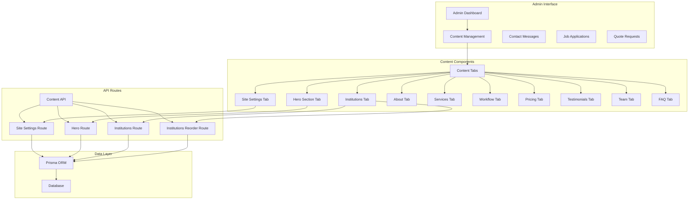
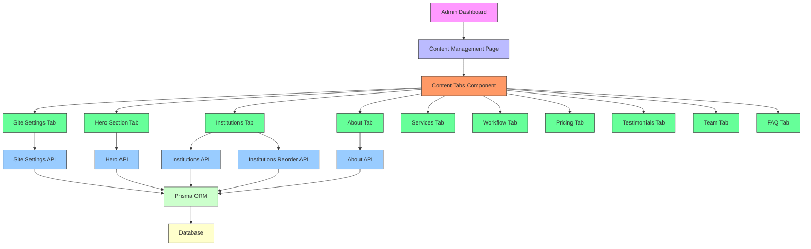
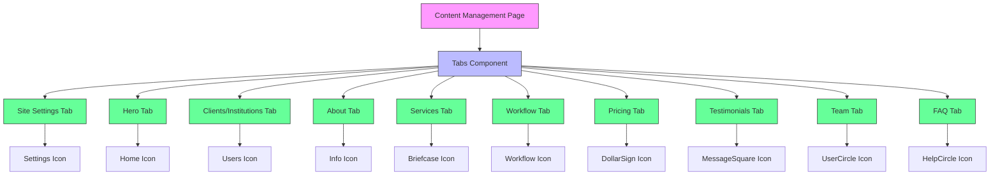
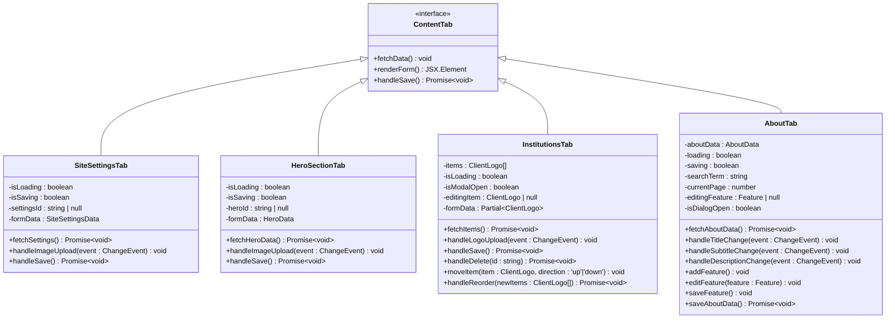
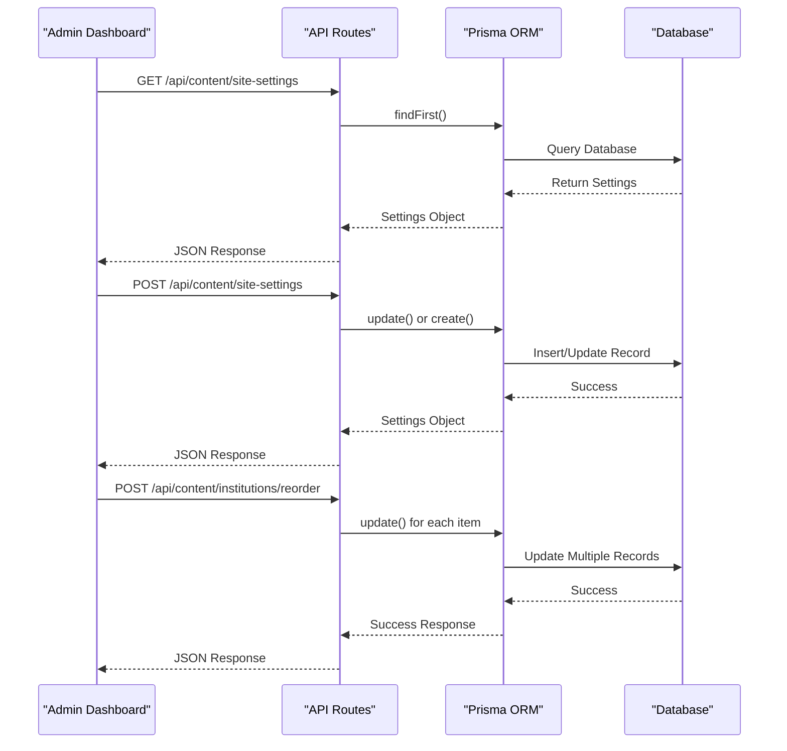
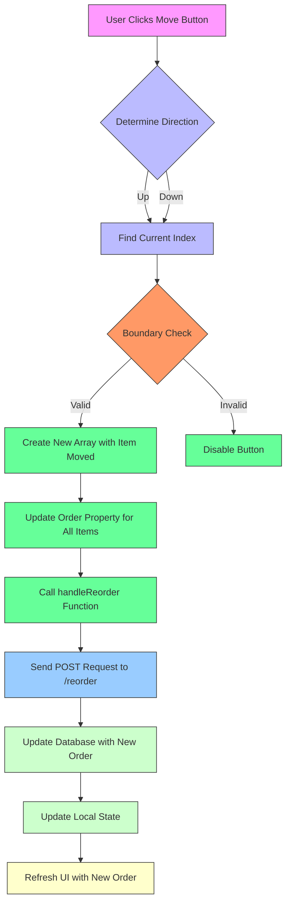
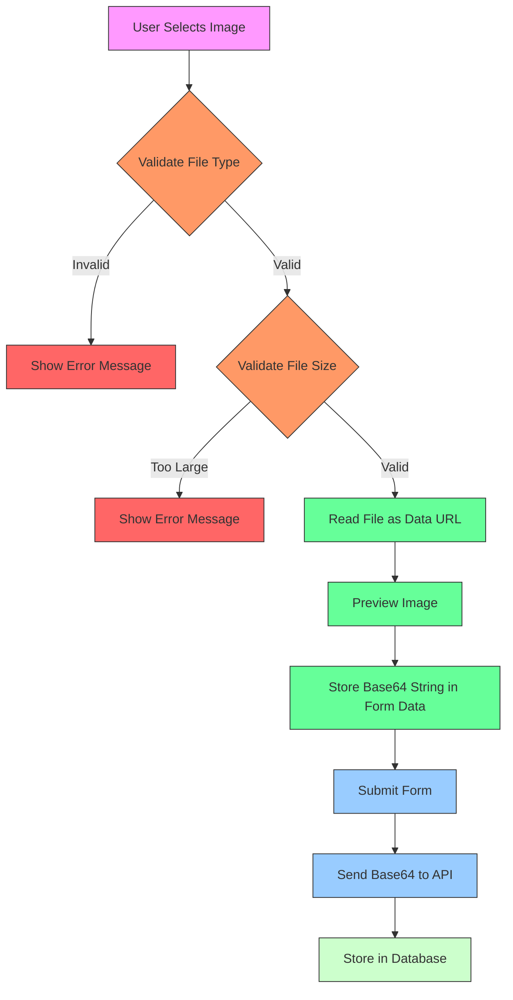
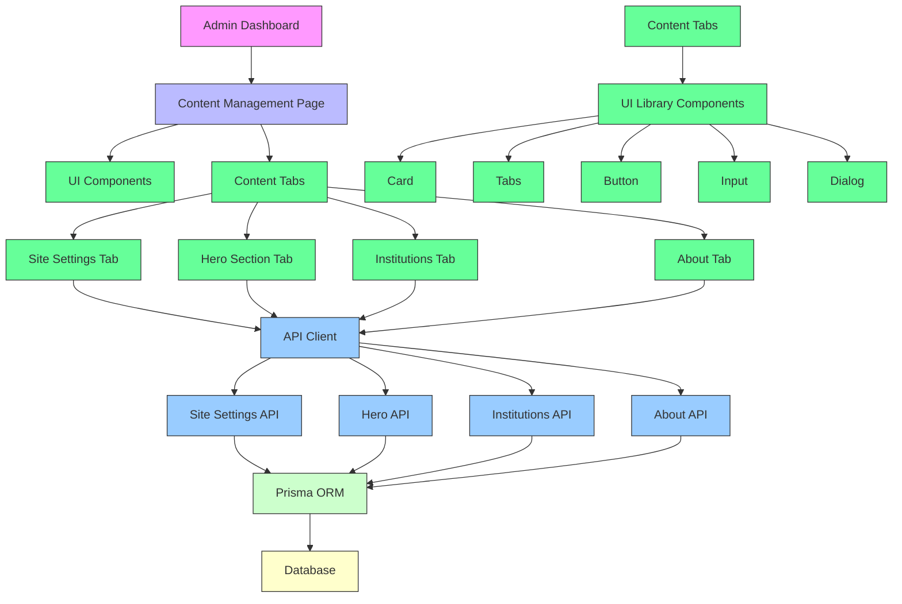

# Content Management System

<cite>
**Referenced Files in This Document**   
- [content/page.tsx](file://src/app/admin/content/page.tsx)
- [site-settings-tab.tsx](file://src/components/admin/content-tabs/site-settings-tab.tsx)
- [hero-section-tab.tsx](file://src/components/admin/content-tabs/hero-section-tab.tsx)
- [institutions-tab.tsx](file://src/components/admin/content-tabs/institutions-tab.tsx)
- [about-tab.tsx](file://src/components/admin/content-tabs/about-tab.tsx)
- [services-tab.tsx](file://src/components/admin/content-tabs/services-tab.tsx)
- [workflow-tab.tsx](file://src/components/admin/content-tabs/workflow-tab.tsx)
- [pricing-tab.tsx](file://src/components/admin/content-tabs/pricing-tab.tsx)
- [testimonials-tab.tsx](file://src/components/admin/content-tabs/testimonials-tab.tsx)
- [team-tab.tsx](file://src/components/admin/content-tabs/team-tab.tsx)
- [faq-tab.tsx](file://src/components/admin/content-tabs/faq-tab.tsx)
- [route.ts](file://src/app/api/content/site-settings/route.ts)
- [route.ts](file://src/app/api/content/hero/route.ts)
- [route.ts](file://src/app/api/content/institutions/route.ts)
- [reorder/route.ts](file://src/app/api/content/institutions/reorder/route.ts)
</cite>

## Table of Contents
1. [Introduction](#introduction)
2. [Project Structure](#project-structure)
3. [Core Components](#core-components)
4. [Architecture Overview](#architecture-overview)
5. [Detailed Component Analysis](#detailed-component-analysis)
6. [Dependency Analysis](#dependency-analysis)
7. [Performance Considerations](#performance-considerations)
8. [Troubleshooting Guide](#troubleshooting-guide)
9. [Conclusion](#conclusion)

## Introduction
The Content Management System (CMS) in the smmm-system provides administrators with a comprehensive dashboard to manage all website content. This documentation details the implementation and usage of the CMS functionality, focusing on content management through the admin interface, API integration for data persistence, media handling, and extensibility patterns.

## Project Structure

**Diagram sources**
- [content/page.tsx](file://src/app/admin/content/page.tsx)
- [site-settings-tab.tsx](file://src/components/admin/content-tabs/site-settings-tab.tsx)
- [hero-section-tab.tsx](file://src/components/admin/content-tabs/hero-section-tab.tsx)
- [institutions-tab.tsx](file://src/components/admin/content-tabs/institutions-tab.tsx)

**Section sources**
- [content/page.tsx](file://src/app/admin/content/page.tsx)
- [components/admin/content-tabs](file://src/components/admin/content-tabs)

## Core Components

The CMS functionality is organized around several core components that enable administrators to manage different aspects of website content. The system follows a modular architecture with dedicated tabs for each content type, API routes for data persistence, and a consistent user interface pattern across all content management sections.

**Section sources**
- [content/page.tsx](file://src/app/admin/content/page.tsx)
- [components/admin/content-tabs](file://src/components/admin/content-tabs)

## Architecture Overview

**Diagram sources**
- [content/page.tsx](file://src/app/admin/content/page.tsx)
- [site-settings-tab.tsx](file://src/components/admin/content-tabs/site-settings-tab.tsx)
- [hero-section-tab.tsx](file://src/components/admin/content-tabs/hero-section-tab.tsx)
- [institutions-tab.tsx](file://src/components/admin/content-tabs/institutions-tab.tsx)
- [about-tab.tsx](file://src/components/admin/content-tabs/about-tab.tsx)
- [route.ts](file://src/app/api/content/site-settings/route.ts)
- [route.ts](file://src/app/api/content/hero/route.ts)
- [route.ts](file://src/app/api/content/institutions/route.ts)
- [reorder/route.ts](file://src/app/api/content/institutions/reorder/route.ts)

## Detailed Component Analysis

### Content Management Dashboard

The content management dashboard serves as the central interface for administrators to manage all website content. It implements a tab-based navigation system that organizes different content types into separate sections.

**Diagram sources**
- [content/page.tsx](file://src/app/admin/content/page.tsx)

**Section sources**
- [content/page.tsx](file://src/app/admin/content/page.tsx)

### Content Tabs Implementation

The content tabs system provides a consistent interface for managing different types of website content. Each tab represents a specific content section and follows a similar pattern of data fetching, form handling, and persistence.

**Diagram sources**
- [site-settings-tab.tsx](file://src/components/admin/content-tabs/site-settings-tab.tsx)
- [hero-section-tab.tsx](file://src/components/admin/content-tabs/hero-section-tab.tsx)
- [institutions-tab.tsx](file://src/components/admin/content-tabs/institutions-tab.tsx)
- [about-tab.tsx](file://src/components/admin/content-tabs/about-tab.tsx)

**Section sources**
- [components/admin/content-tabs](file://src/components/admin/content-tabs)

### API Integration and Data Persistence

The CMS implements a RESTful API architecture for data persistence, with dedicated routes for each content type. The API routes handle CRUD operations and integrate with the Prisma ORM for database interactions.

**Diagram sources**
- [route.ts](file://src/app/api/content/site-settings/route.ts)
- [route.ts](file://src/app/api/content/hero/route.ts)
- [route.ts](file://src/app/api/content/institutions/route.ts)
- [reorder/route.ts](file://src/app/api/content/institutions/reorder/route.ts)

**Section sources**
- [src/app/api/content](file://src/app/api/content)

### Reordering Functionality

The CMS implements reordering functionality for content sections that require custom ordering, such as the hero and institutions sections. This functionality allows administrators to control the display order of items through a drag-inspired interface.

**Diagram sources**
- [institutions-tab.tsx](file://src/components/admin/content-tabs/institutions-tab.tsx)
- [reorder/route.ts](file://src/app/api/content/institutions/reorder/route.ts)

**Section sources**
- [institutions-tab.tsx](file://src/components/admin/content-tabs/institutions-tab.tsx)
- [reorder/route.ts](file://src/app/api/content/institutions/reorder/route.ts)

### Form Validation and Media Management

The CMS implements form validation and media management through client-side validation and base64 encoding for image uploads. This approach simplifies the storage model by embedding images directly in the database.

**Diagram sources**
- [site-settings-tab.tsx](file://src/components/admin/content-tabs/site-settings-tab.tsx)
- [hero-section-tab.tsx](file://src/components/admin/content-tabs/hero-section-tab.tsx)
- [institutions-tab.tsx](file://src/components/admin/content-tabs/institutions-tab.tsx)

**Section sources**
- [site-settings-tab.tsx](file://src/components/admin/content-tabs/site-settings-tab.tsx)
- [hero-section-tab.tsx](file://src/components/admin/content-tabs/hero-section-tab.tsx)
- [institutions-tab.tsx](file://src/components/admin/content-tabs/institutions-tab.tsx)

## Dependency Analysis

**Diagram sources**
- [content/page.tsx](file://src/app/admin/content/page.tsx)
- [components/admin/content-tabs](file://src/components/admin/content-tabs)
- [src/app/api/content](file://src/app/api/content)
- [lib/prisma.ts](file://src/lib/prisma.ts)

**Section sources**
- [content/page.tsx](file://src/app/admin/content/page.tsx)
- [components/admin/content-tabs](file://src/components/admin/content-tabs)
- [src/app/api/content](file://src/app/api/content)

## Performance Considerations

The CMS implementation includes several performance considerations to ensure a responsive user experience:

1. **Lazy Loading**: Content is fetched only when the corresponding tab is activated
2. **Optimized Image Handling**: Images are validated for size (maximum 2MB) and type before processing
3. **Efficient Reordering**: The reorder API updates multiple records in a single transaction using Promise.all
4. **Client-Side Filtering**: The institutions tab implements client-side filtering and pagination to reduce server requests
5. **Base64 Optimization**: Images are stored as base64 strings, eliminating the need for separate file storage but requiring careful size management

The system balances performance with simplicity by using base64 encoding for images, which avoids the complexity of file storage management but requires careful attention to image size limits to prevent database bloat.

**Section sources**
- [institutions-tab.tsx](file://src/components/admin/content-tabs/institutions-tab.tsx)
- [reorder/route.ts](file://src/app/api/content/institutions/reorder/route.ts)
- [site-settings-tab.tsx](file://src/components/admin/content-tabs/site-settings-tab.tsx)

## Troubleshooting Guide

Common issues and their solutions in the CMS implementation:

1. **Image Upload Failures**: Ensure images are under 2MB and in supported formats (PNG, JPG, SVG)
2. **Reordering Not Persisting**: Verify that the reorder API is properly updating the order field in the database
3. **Content Not Displaying**: Check that the isActive flag is set to true for the content items
4. **API Connection Errors**: Verify that the Prisma client is properly configured and the database is accessible
5. **Form Validation Issues**: Ensure all required fields are filled before submission

The system includes comprehensive error handling with user-friendly toast notifications to guide administrators through common issues.

**Section sources**
- [site-settings-tab.tsx](file://src/components/admin/content-tabs/site-settings-tab.tsx)
- [hero-section-tab.tsx](file://src/components/admin/content-tabs/hero-section-tab.tsx)
- [institutions-tab.tsx](file://src/components/admin/content-tabs/institutions-tab.tsx)
- [about-tab.tsx](file://src/components/admin/content-tabs/about-tab.tsx)

## Conclusion

The Content Management System in smmm-system provides a comprehensive solution for administrators to manage website content through an intuitive dashboard interface. The system implements a modular architecture with dedicated tabs for different content types, consistent API patterns for data persistence, and user-friendly features for content management.

Key strengths of the implementation include:
- A unified tab-based interface for managing all content types
- Robust API integration with Prisma ORM for reliable data persistence
- Intuitive reordering functionality for content sections
- Comprehensive form validation and media management
- Responsive design with client-side filtering and pagination

The system is designed to be extensible, with a clear pattern for adding new content types by implementing additional tabs and API routes following the established conventions.