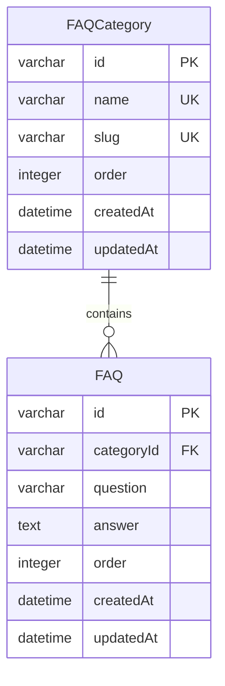
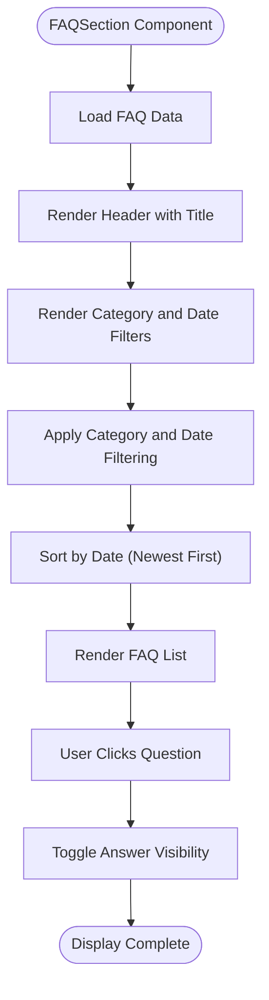
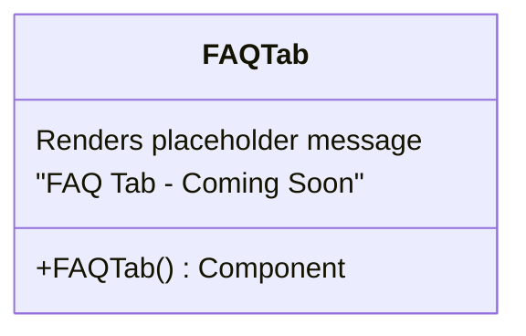

# FAQ Management

<cite>
**Referenced Files in This Document**   
- [faq-section.tsx](file://src/components/landing/faq-section.tsx)
- [faq-tab.tsx](file://src/components/admin/content-tabs/faq-tab.tsx)
- [migration.sql](file://prisma/migrations/20251101125707_init/migration.sql)
</cite>

## Table of Contents
1. [Introduction](#introduction)
2. [FAQ Data Structure and Storage](#faq-data-structure-and-storage)
3. [Public FAQ Display](#public-faq-display)
4. [Admin FAQ Management Interface](#admin-faq-management-interface)
5. [Validation and Data Integrity](#validation-and-data-integrity)
6. [Best Practices for FAQ Content](#best-practices-for-faq-content)
7. [Troubleshooting Common Issues](#troubleshooting-common-issues)
8. [Conclusion](#conclusion)

## Introduction
The FAQ management system enables administrators to organize frequently asked questions and display them in an interactive format on the public website. The system supports categorization, filtering by date, and expandable/collapsible question-answer pairs. While the frontend display component is fully implemented, the admin interface for managing FAQ entries is currently marked as "Coming Soon," indicating that the backend infrastructure exists but the admin UI is not yet complete.

## FAQ Data Structure and Storage

The FAQ system consists of two main database tables that store questions and their categories:

**Diagram sources**
- [migration.sql](file://prisma/migrations/20251101125707_init/migration.sql#L287-L330)

The database schema reveals that:
- FAQ categories are stored in the `FAQCategory` table with unique names and slugs
- Individual FAQ entries are stored in the `FAQ` table with foreign key relationships to categories
- Each FAQ entry contains a question (with character limit), answer (text field), ordering information, and timestamps
- The relationship ensures referential integrity between categories and their questions

**Section sources**
- [migration.sql](file://prisma/migrations/20251101125707_init/migration.sql#L287-L330)

## Public FAQ Display

The public FAQ section renders questions in an expandable format with filtering capabilities:

**Diagram sources**
- [faq-section.tsx](file://src/components/landing/faq-section.tsx#L74-L273)

The FAQSection component provides the following features:
- Category filtering with six predefined categories: "General", "Services", "Pricing", "Processes", "Technical"
- Date filtering to show FAQs from a specific starting date
- Expandable/collapsible question-answer pairs with smooth animations
- Visual indicators for open/closed states using chevron icons
- Responsive design with proper spacing and hover effects
- Sorting functionality that displays newest FAQs first

Users can filter FAQs by selecting a category button or specifying a start date. When a question is clicked, the answer expands with a smooth animation while the chevron icon rotates to indicate the open state. The component uses Framer Motion for animations and implements accessibility features through proper semantic HTML structure.

**Section sources**
- [faq-section.tsx](file://src/components/landing/faq-section.tsx#L74-L273)

## Admin FAQ Management Interface

Currently, the admin interface for FAQ management is not functional:

**Diagram sources**
- [faq-tab.tsx](file://src/components/admin/content-tabs/faq-tab.tsx#L0-L0)

The FAQTab component in the admin panel currently only displays a placeholder message indicating that the feature is not yet implemented. Despite this, the presence of database tables for FAQs and the routing structure in the application suggests that the backend infrastructure is prepared for FAQ management functionality. The admin content page includes a tab for FAQs, indicating that the UI framework exists but the implementation is incomplete.

Based on similar components in the system (such as the AboutTab and InstitutionsTab), a complete FAQ management interface would likely include:
- A form for creating new FAQ entries with question and answer fields
- Category selection for organizing questions
- Reordering capabilities through drag-and-drop or priority numbers
- Edit and delete functionality for existing entries
- Search and filtering options for managing large numbers of FAQs
- Validation to prevent duplicate questions

**Section sources**
- [faq-tab.tsx](file://src/components/admin/content-tabs/faq-tab.tsx#L0-L0)

## Validation and Data Integrity

While the admin interface is not yet implemented, the database schema enforces several data integrity constraints:

- The `FAQ` table requires both question and answer fields to be present (NOT NULL constraints)
- Category names and slugs must be unique across the `FAQCategory` table
- Foreign key relationships ensure that every FAQ entry is associated with a valid category
- Timestamps are automatically managed with createdAt and updatedAt fields

When the admin interface is implemented, it should include client-side validation such as:
- Required field validation for both question and answer
- Character limits for questions to ensure they remain concise
- Duplicate detection to prevent multiple entries with identical questions
- Rich text validation for answers to prevent malformed content
- Category selection requirement to ensure proper organization

The system should also implement server-side validation to enforce these rules even if the client-side validation is bypassed.

## Best Practices for FAQ Content

To create effective FAQ content that reduces support inquiries, follow these best practices:

### Question Formulation
- Use natural language that mirrors how customers actually ask questions
- Keep questions concise but specific enough to be meaningful
- Avoid jargon and technical terms when simpler alternatives exist
- Focus on the most common customer pain points and concerns

### Answer Structure
- Provide complete but concise answers that address the question directly
- Include specific details such as timeframes, costs, or process steps
- Use bullet points for multi-step processes or lists of requirements
- Include links to related resources when appropriate
- Update answers regularly to reflect current policies and procedures

### Organization Strategy
- Group related questions into logical categories
- Order questions by importance or frequency of inquiry
- Regularly review analytics to identify missing questions
- Monitor support tickets to discover new FAQ opportunities
- Remove outdated questions that no longer apply

### Example Effective FAQ Entries
**Question:** "How quickly can you respond to urgent accounting issues?"
**Answer:** "We provide same-day response for urgent matters during business hours. Our clients have direct access to their assigned accountant via phone, email, or our client portal."

**Question:** "What documents do I need to provide for monthly accounting?"
**Answer:** "You'll need to provide all bank statements, invoices, receipts, and payroll records. We accept documents electronically through our secure portal or by physical delivery to our office."

## Troubleshooting Common Issues

### Missing FAQ Management Interface
**Issue:** The admin FAQ management tab displays "Coming Soon" instead of a functional interface.
**Solution:** This indicates the feature is planned but not yet implemented. Administrators cannot currently create or edit FAQ entries through the admin panel. As a temporary workaround, FAQ data may need to be managed directly through the database until the admin interface is completed.

### Duplicate Questions
**Issue:** Similar questions appearing multiple times with slightly different wording.
**Solution:** Implement a search-as-you-type feature in the admin interface that shows existing similar questions. Establish a review process to consolidate duplicate questions and maintain a comprehensive but non-redundant FAQ collection.

### Outdated Information
**Issue:** FAQ answers that no longer reflect current policies or procedures.
**Solution:** Implement a review schedule (e.g., quarterly) to audit all FAQ entries. Add timestamps to answers and consider implementing an expiration date field for time-sensitive information.

### Unclear Answers
**Issue:** Answers that are too technical, vague, or incomplete.
**Solution:** Establish clear guidelines for answer length and complexity. Use plain language and avoid jargon. Include examples where helpful. Consider implementing a peer review process for new FAQ entries.

### Poor Categorization
**Issue:** Questions placed in inappropriate categories, making them difficult to find.
**Solution:** Regularly review the category structure and reorganize questions as needed. Consider implementing multiple category tagging if a question fits in more than one category.

## Conclusion
The FAQ management system has a solid foundation with a well-designed database schema and an attractive public-facing component. The FAQSection component provides an excellent user experience with filtering, sorting, and smooth animations. However, the admin interface for managing FAQ content is currently non-functional, limiting the system's practical utility. Once the FAQTab component is implemented with proper CRUD functionality, the system will provide a comprehensive solution for managing frequently asked questions. In the meantime, administrators should plan for the eventual implementation by preparing content and considering the organizational structure that will best serve their clients.