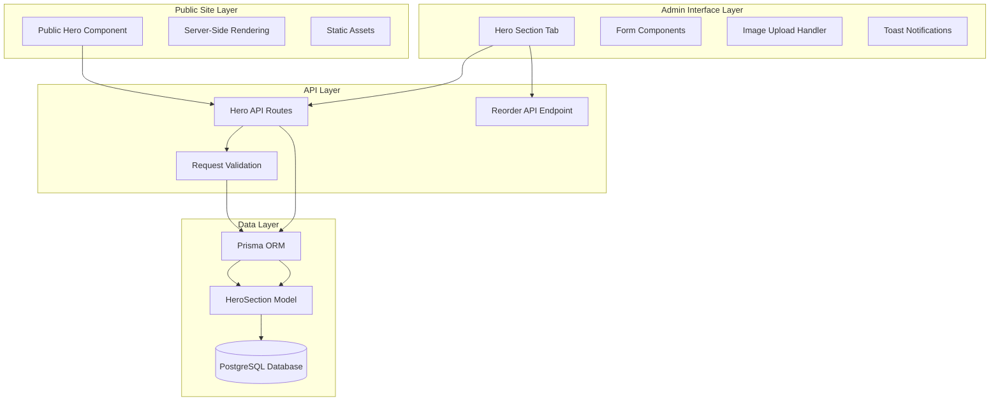
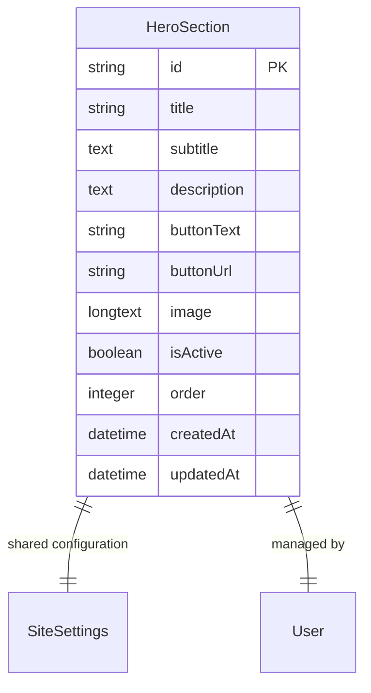
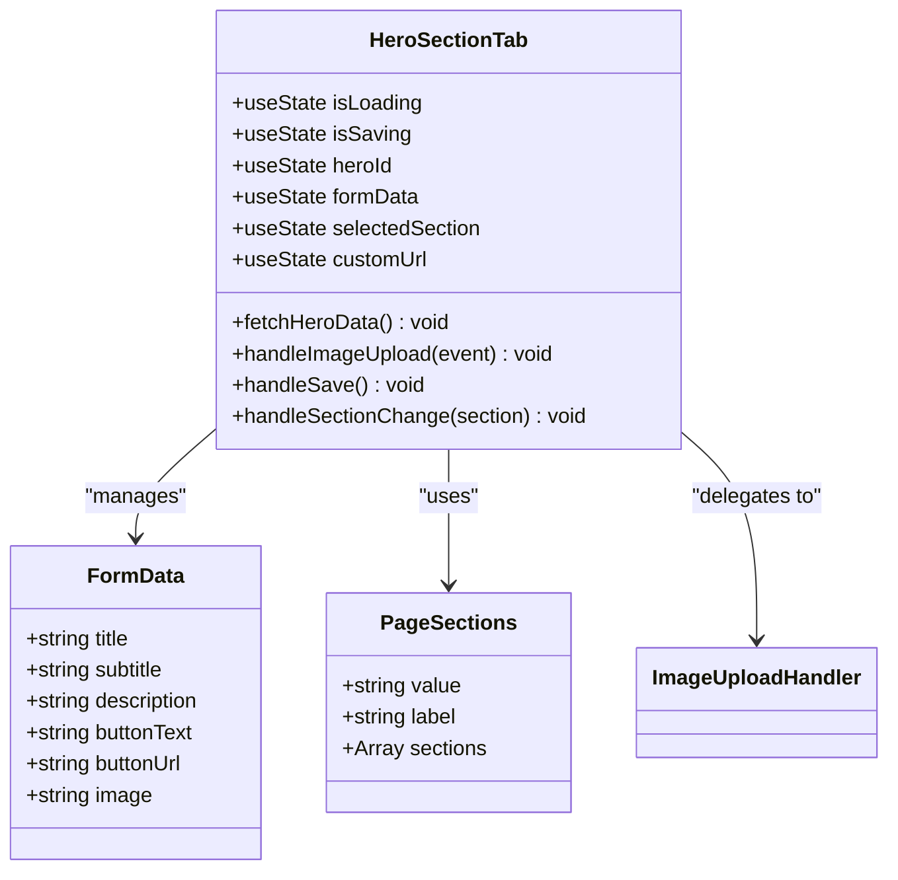
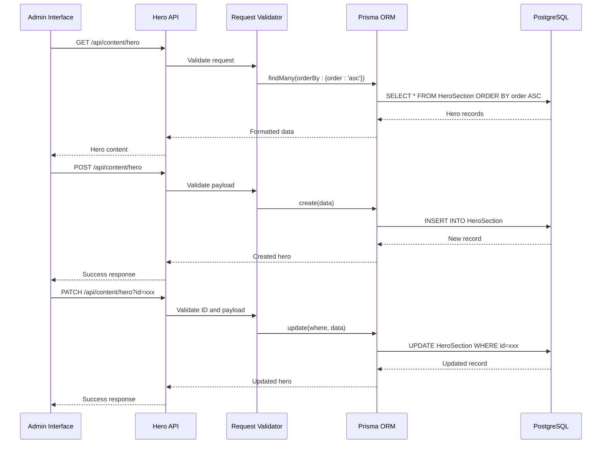
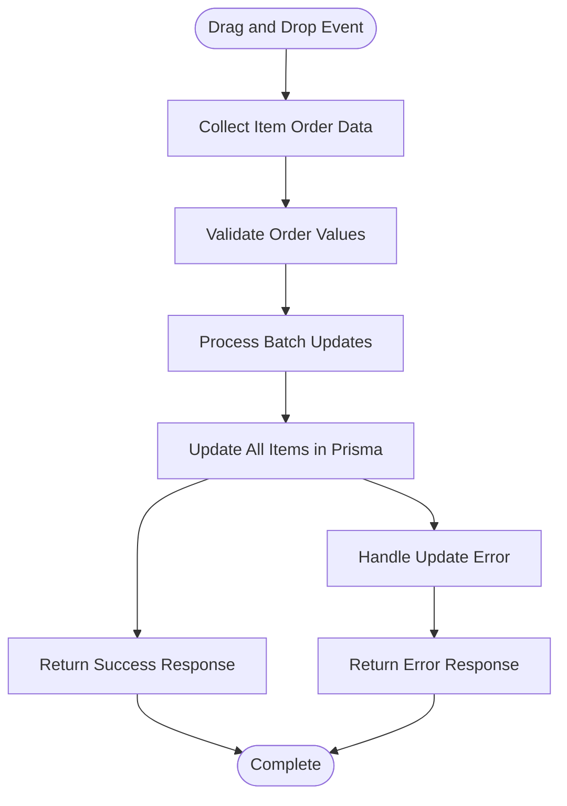
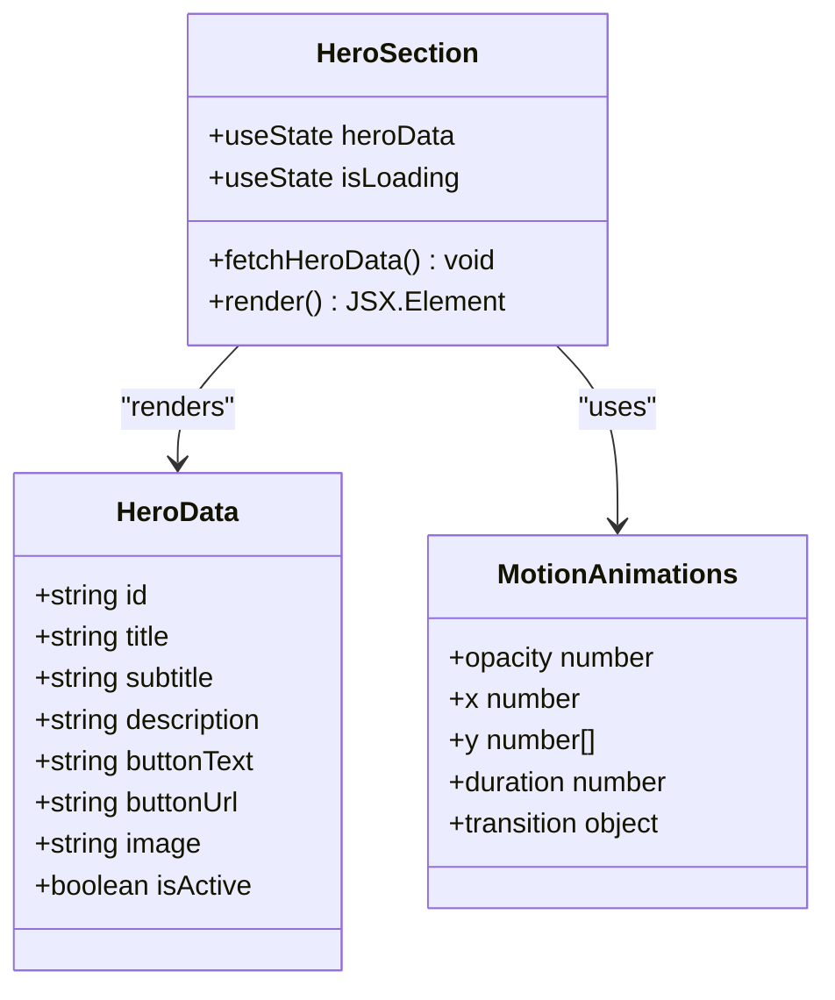
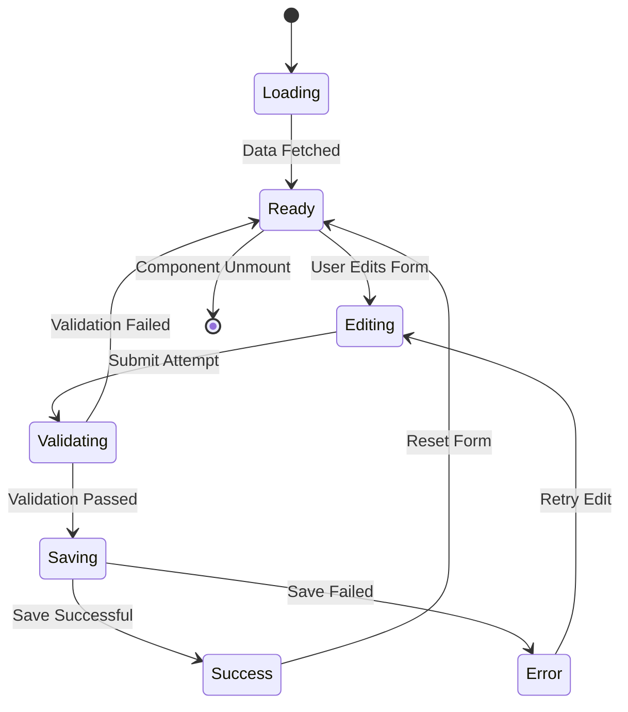
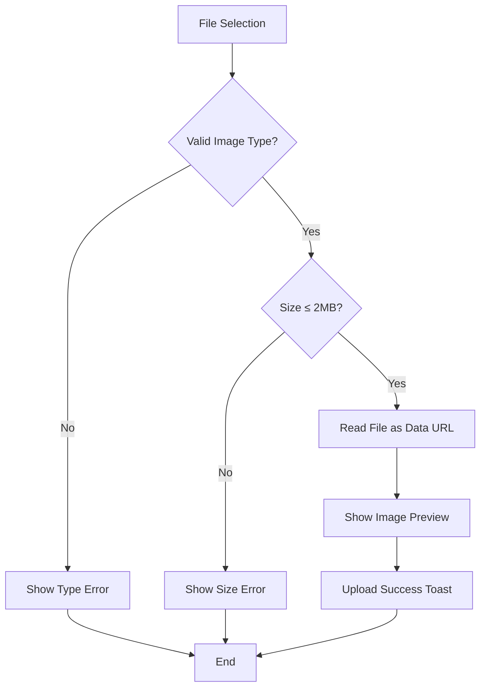
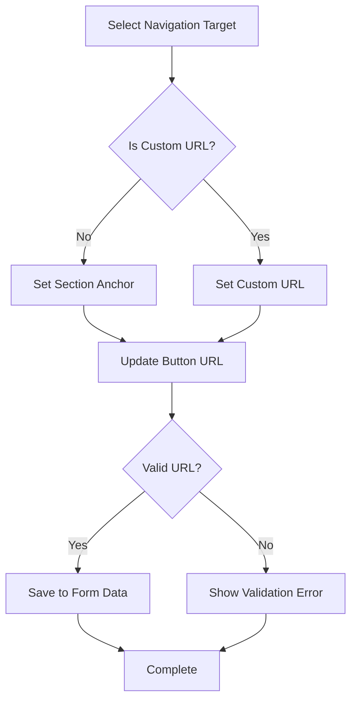
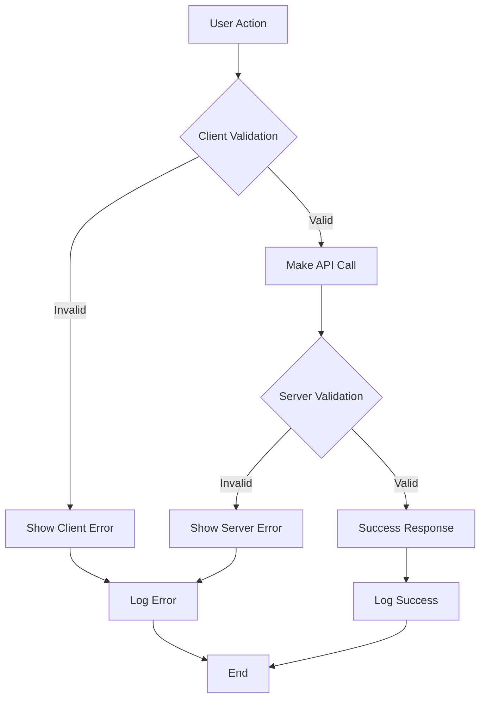

# Hero Section Management

<cite>
**Referenced Files in This Document**
- [hero-section-tab.tsx](file://src/components/admin/content-tabs/hero-section-tab.tsx)
- [hero-section.tsx](file://src/components/landing/hero-section.tsx)
- [hero-route.ts](file://src/app/api/content/hero/route.ts)
- [hero-reorder-route.ts](file://src/app/api/content/hero/reorder/route.ts)
- [content-page.tsx](file://src/app/admin/content/page.tsx)
- [migration.sql](file://prisma/migrations/20251101125707_init/migration.sql)
- [db.ts](file://src/lib/db.ts)
- [form.tsx](file://src/components/ui/form.tsx)
- [card.tsx](file://src/components/ui/card.tsx)
- [sonner.tsx](file://src/components/ui/sonner.tsx)
- [package.json](file://package.json)
</cite>

## Table of Contents
1. [Introduction](#introduction)
2. [System Architecture](#system-architecture)
3. [Database Schema](#database-schema)
4. [Admin Interface Implementation](#admin-interface-implementation)
5. [API Endpoints](#api-endpoints)
6. [Public Site Rendering](#public-site-rendering)
7. [Form State Management](#form-state-management)
8. [Image Upload System](#image-upload-system)
9. [URL Targeting and Navigation](#url-targeting-and-navigation)
10. [Error Handling and Validation](#error-handling-and-validation)
11. [Performance Optimization](#performance-optimization)
12. [Accessibility Considerations](#accessibility-considerations)
13. [Common Issues and Solutions](#common-issues-and-solutions)
14. [Best Practices](#best-practices)

## Introduction

The Hero Section Management functionality provides a comprehensive solution for managing the hero section content on the public website. This system enables administrators to edit title, subtitle, description, button text, URL targeting, and image uploads through an intuitive admin interface. The implementation includes real-time data synchronization, drag-and-drop reordering capabilities, and seamless integration between the admin panel and public site rendering.

The system is built on a modern React/Next.js architecture with TypeScript, utilizing Prisma ORM for database operations and Tailwind CSS for styling. It features responsive design, accessibility compliance, and robust error handling mechanisms.

## System Architecture

The Hero Section management system follows a layered architecture pattern with clear separation of concerns:

**Diagram sources**
- [hero-section-tab.tsx](file://src/components/admin/content-tabs/hero-section-tab.tsx#L1-L292)
- [hero-route.ts](file://src/app/api/content/hero/route.ts#L1-L88)
- [hero-section.tsx](file://src/components/landing/hero-section.tsx#L1-L164)

## Database Schema

The HeroSection model defines the structure for storing hero content with comprehensive metadata:

**Diagram sources**
- [migration.sql](file://prisma/migrations/20251101125707_init/migration.sql#L108-L120)

### Key Schema Features

| Column | Type | Constraints | Description |
|--------|------|-------------|-------------|
| `id` | VARCHAR(191) | PRIMARY KEY | Unique identifier for each hero section |
| `title` | VARCHAR(191) | NOT NULL | Main headline text |
| `subtitle` | TEXT | NOT NULL | Supporting text below title |
| `description` | TEXT | NULLABLE | Extended description content |
| `buttonText` | VARCHAR(191) | NULLABLE | Call-to-action button text |
| `buttonUrl` | VARCHAR(191) | NULLABLE | Target URL or section anchor |
| `image` | LONGTEXT | NULLABLE | Base64 encoded image data |
| `isActive` | BOOLEAN | DEFAULT true | Visibility toggle |
| `order` | INTEGER | DEFAULT 0 | Display ordering |
| `createdAt` | DATETIME(3) | DEFAULT CURRENT_TIMESTAMP | Creation timestamp |
| `updatedAt` | DATETIME(3) | NOT NULL | Last update timestamp |

**Section sources**
- [migration.sql](file://prisma/migrations/20251101125707_init/migration.sql#L108-L120)

## Admin Interface Implementation

The admin interface is implemented as a dedicated tab within the content management system, providing comprehensive editing capabilities:

**Diagram sources**
- [hero-section-tab.tsx](file://src/components/admin/content-tabs/hero-section-tab.tsx#L20-L292)

### Core Components and Features

The Hero Section Tab implements several key components:

1. **Form Controls**: Input fields for title, subtitle, description, and button text
2. **URL Target Selection**: Dropdown with predefined page sections and custom URL option
3. **Image Upload**: Drag-and-drop file upload with preview functionality
4. **State Management**: Centralized form state with real-time updates
5. **Validation**: Client-side validation for required fields
6. **Notifications**: Real-time feedback using toast notifications

**Section sources**
- [hero-section-tab.tsx](file://src/components/admin/content-tabs/hero-section-tab.tsx#L152-L292)

## API Endpoints

The system provides RESTful API endpoints for comprehensive CRUD operations:

**Diagram sources**
- [hero-route.ts](file://src/app/api/content/hero/route.ts#L1-L88)
- [hero-reorder-route.ts](file://src/app/api/content/hero/reorder/route.ts#L1-L27)

### API Endpoint Specifications

| Method | Endpoint | Purpose | Request Body | Response |
|--------|----------|---------|--------------|----------|
| GET | `/api/content/hero` | Fetch all hero items | None | Array of hero objects |
| POST | `/api/content/hero` | Create new hero item | Hero data object | Created hero object |
| PATCH | `/api/content/hero?id={id}` | Update existing hero | Hero data object | Updated hero object |
| DELETE | `/api/content/hero?id={id}` | Delete hero item | None | Success/failure response |

### Reorder API Endpoint

The reorder functionality enables drag-and-drop ordering of hero items:

**Diagram sources**
- [hero-reorder-route.ts](file://src/app/api/content/hero/reorder/route.ts#L5-L25)

**Section sources**
- [hero-route.ts](file://src/app/api/content/hero/route.ts#L1-L88)
- [hero-reorder-route.ts](file://src/app/api/content/hero/reorder/route.ts#L1-L27)

## Public Site Rendering

The public hero section component renders the hero content fetched from the API with optimized performance:

**Diagram sources**
- [hero-section.tsx](file://src/components/landing/hero-section.tsx#L15-L164)

### Rendering Features

The public hero component includes several advanced rendering features:

1. **Server-Side Rendering**: Optimized for SEO and performance
2. **Motion Animations**: Framer Motion animations for engaging user experience
3. **Responsive Design**: Adaptive layouts for different screen sizes
4. **Fallback Content**: Default values when data is unavailable
5. **Image Optimization**: Next.js Image component with automatic optimization

**Section sources**
- [hero-section.tsx](file://src/components/landing/hero-section.tsx#L15-L164)

## Form State Management

The form state management utilizes React's `useState` and `useEffect` hooks for efficient data handling:

### State Variables and Their Purposes

| State Variable | Type | Purpose | Initial Value |
|----------------|------|---------|---------------|
| `isLoading` | boolean | Loading indicator | true |
| `isSaving` | boolean | Save operation indicator | false |
| `heroId` | string \| null | Current hero record ID | null |
| `formData` | object | Complete form data | Empty defaults |
| `selectedSection` | string | Selected navigation target | "#services" |
| `customUrl` | string | Custom URL input | "" |

### Data Flow Patterns

The form implements bidirectional data flow with automatic synchronization:

1. **Fetch → Populate**: API data populates form state
2. **Edit → Update**: User edits update form state
3. **Save → Persist**: Form state saves to API
4. **Sync → Refresh**: API updates refresh form state

**Section sources**
- [hero-section-tab.tsx](file://src/components/admin/content-tabs/hero-section-tab.tsx#L20-L115)

## Image Upload System

The image upload system provides comprehensive file handling with validation and preview capabilities:

**Diagram sources**
- [hero-section-tab.tsx](file://src/components/admin/content-tabs/hero-section-tab.tsx#L95-L115)

### Image Processing Pipeline

The image upload system implements a multi-stage processing pipeline:

1. **File Selection**: User selects image file through hidden input
2. **Type Validation**: Checks MIME type starts with 'image/'
3. **Size Validation**: Ensures file size ≤ 2MB
4. **Base64 Encoding**: Converts file to base64 data URL
5. **Preview Generation**: Displays thumbnail preview
6. **State Update**: Updates form state with encoded image
7. **Notification**: Provides user feedback

### File Validation Rules

| Validation Rule | Requirement | Error Message |
|-----------------|-------------|---------------|
| File Type | Must start with 'image/' | "Please select a valid image file" |
| File Size | Must be ≤ 2MB | "Image size must be at most 2MB" |
| File Read | Must be readable | "File could not be read" |

**Section sources**
- [hero-section-tab.tsx](file://src/components/admin/content-tabs/hero-section-tab.tsx#L95-L115)

## URL Targeting and Navigation

The URL targeting system provides flexible navigation options with intelligent fallback handling:

**Diagram sources**
- [hero-section-tab.tsx](file://src/components/admin/content-tabs/hero-section-tab.tsx#L40-L65)

### Navigation Target Options

The system provides predefined navigation targets for common page sections:

| Target Value | Display Label | Purpose |
|--------------|---------------|---------|
| `#hero` | "Ana Sayfa (En Üst)" | Homepage top |
| `#services` | "Hizmetlerimiz" | Services section |
| `#about` | "Hakkımızda" | About section |
| `#clients` | "Kurumlar" | Institutions section |
| `#testimonials` | "Müşteri Yorumları" | Testimonials section |
| `#faq` | "Sıkça Sorulan Sorular" | FAQ section |
| `#contact` | "İletişim" | Contact section |
| `/teklif-al` | "Teklif Al Sayfası" | Quote request page |
| `/iletisim` | "İletişim Sayfası" | Contact page |
| `custom` | "Özel Link" | Custom URL option |

### Dynamic URL Resolution

The system implements intelligent URL resolution during data loading:

1. **Section Detection**: Matches buttonUrl against predefined sections
2. **Custom URL Handling**: Falls back to custom URL mode when no match found
3. **State Synchronization**: Updates both section selection and custom URL state
4. **Form Consistency**: Maintains consistency between UI and form data

**Section sources**
- [hero-section-tab.tsx](file://src/components/admin/content-tabs/hero-section-tab.tsx#L40-L65)

## Error Handling and Validation

The system implements comprehensive error handling and validation at multiple levels:

### Validation Layers

The system implements multi-layered validation:

#### Client-Side Validation
- **Required Fields**: Title and subtitle are mandatory
- **Image Validation**: Type and size checks
- **URL Validation**: Basic URL format checking
- **Form State**: Real-time validation feedback

#### Server-Side Validation
- **Database Constraints**: Prisma model validation
- **Business Logic**: Content validation rules
- **Security**: Input sanitization and XSS protection

#### Error Response Handling
- **HTTP Status Codes**: Proper status code responses
- **Error Messages**: Descriptive error messages
- **User Feedback**: Toast notifications for errors

### Error Types and Handling

| Error Type | Trigger Condition | Response Strategy |
|------------|-------------------|-------------------|
| Missing Required Fields | Empty title/subtitle | Client-side validation |
| Invalid File Type | Non-image file | File type validation |
| File Too Large | > 2MB file | Size validation |
| API Failure | Network/Server error | Retry mechanism |
| Database Error | SQL constraint violation | User-friendly message |

**Section sources**
- [hero-section-tab.tsx](file://src/components/admin/content-tabs/hero-section-tab.tsx#L110-L158)

## Performance Optimization

The system implements several performance optimization strategies:

### Client-Side Optimizations

1. **Lazy Loading**: Components load only when needed
2. **State Optimization**: Minimal re-renders through efficient state management
3. **Image Optimization**: Base64 encoding for small images
4. **Debounced Operations**: Prevent excessive API calls

### Server-Side Optimizations

1. **Database Indexing**: Indexed `order` column for fast sorting
2. **Connection Pooling**: Efficient database connection management
3. **Caching**: API response caching where applicable
4. **Batch Operations**: Bulk updates for reorder operations

### Rendering Optimizations

1. **Memoization**: React.memo for expensive components
2. **Code Splitting**: Dynamic imports for large components
3. **Tree Shaking**: Elimination of unused code
4. **Bundle Optimization**: Minification and compression

## Accessibility Considerations

The system incorporates comprehensive accessibility features:

### Keyboard Navigation
- Full keyboard support for all interactive elements
- Logical tab order through form fields
- Focus indicators for keyboard users

### Screen Reader Support
- Semantic HTML markup
- ARIA attributes where needed
- Descriptive labels for all form controls
- Live regions for status updates

### Visual Accessibility
- High contrast color schemes
- Scalable text sizing
- Clear visual hierarchy
- Consistent design patterns

### Assistive Technology Compatibility
- Proper heading structure
- Form labeling standards
- Error message announcements
- Progress indication for long operations

## Common Issues and Solutions

### Image Upload Failures

**Issue**: Image upload fails silently or shows incorrect error messages.

**Causes**:
- File size exceeding 2MB limit
- Unsupported file format
- Network connectivity issues
- Browser compatibility problems

**Solutions**:
1. Implement comprehensive file validation
2. Provide clear error messaging
3. Add retry mechanisms for network failures
4. Test across different browsers

### Invalid URL Routing

**Issue**: Custom URLs don't navigate correctly or cause 404 errors.

**Causes**:
- Malformed URL format
- Missing protocol (http/https)
- Incorrect internal path structure
- Route conflicts with existing pages

**Solutions**:
1. Implement URL format validation
2. Provide URL examples and guidelines
3. Test URL routing before deployment
4. Add canonical URL handling

### State Synchronization Issues

**Issue**: Form state becomes desynchronized with backend data.

**Causes**:
- Race conditions in API calls
- Concurrent modifications
- Network latency effects
- Client-side caching problems

**Solutions**:
1. Implement optimistic updates with rollback
2. Add conflict detection and resolution
3. Use proper loading states
4. Implement proper error recovery

### Performance Degradation

**Issue**: Slow loading times or poor responsiveness.

**Causes**:
- Large image files
- Excessive API calls
- Memory leaks
- Inefficient rendering

**Solutions**:
1. Optimize image sizes and formats
2. Implement request debouncing
3. Add proper cleanup in useEffect
4. Use React.memo for expensive components

## Best Practices

### Development Guidelines

1. **Type Safety**: Use TypeScript consistently for all components
2. **Error Boundaries**: Implement error boundaries for graceful degradation
3. **Testing**: Write unit and integration tests for critical functionality
4. **Documentation**: Maintain up-to-date documentation for API endpoints

### Security Considerations

1. **Input Validation**: Validate all user inputs server-side
2. **Authentication**: Ensure proper authentication for admin actions
3. **Authorization**: Implement role-based access control
4. **Sanitization**: Sanitize user-generated content

### Maintenance and Monitoring

1. **Logging**: Implement comprehensive logging for debugging
2. **Monitoring**: Set up monitoring for API performance
3. **Backups**: Regular database backup procedures
4. **Updates**: Keep dependencies updated regularly

### User Experience

1. **Feedback**: Provide immediate feedback for all user actions
2. **Progress Indicators**: Show loading states during operations
3. **Undo Capability**: Allow undoing of destructive actions
4. **Mobile Responsiveness**: Ensure mobile-friendly design