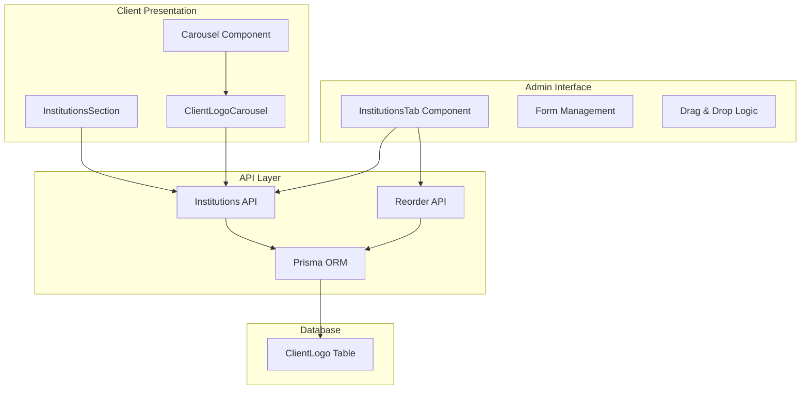
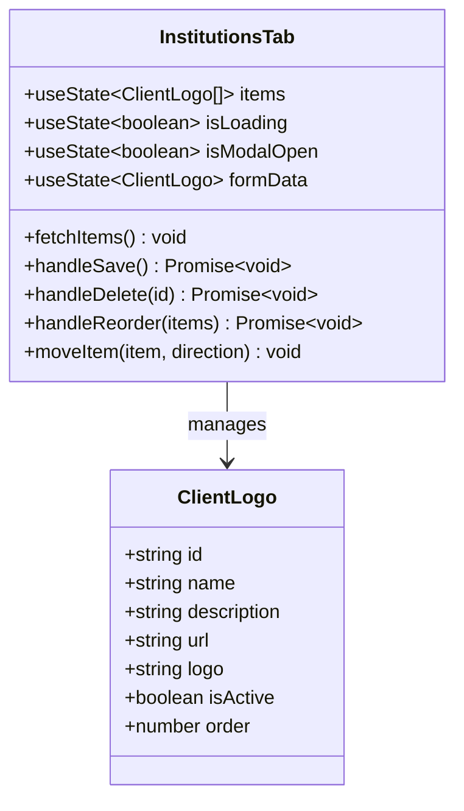
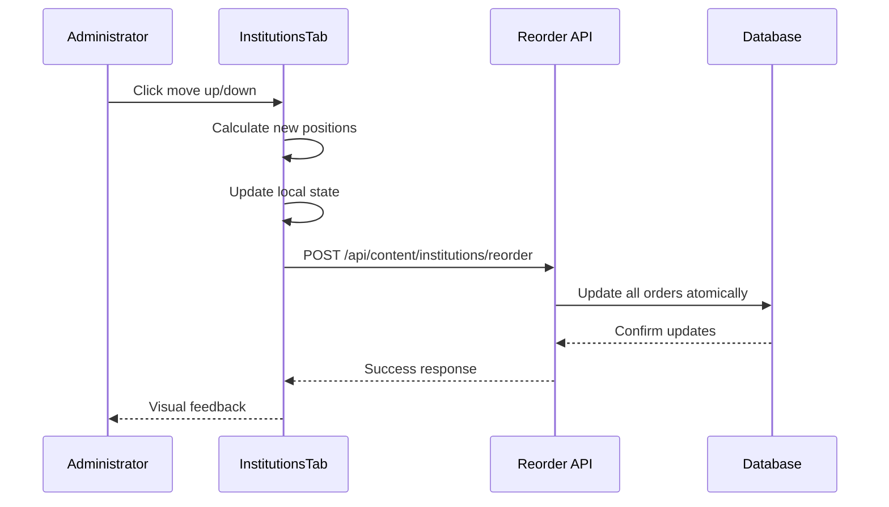
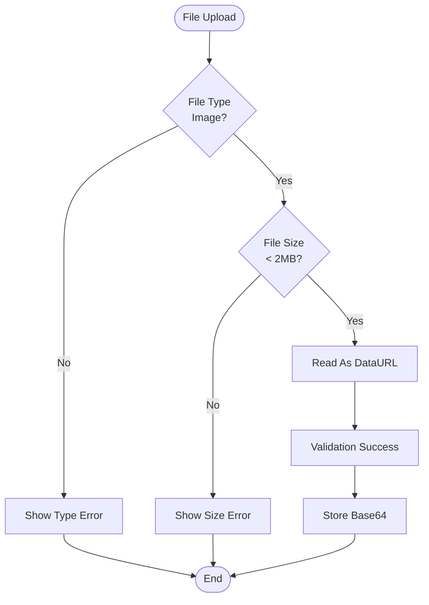
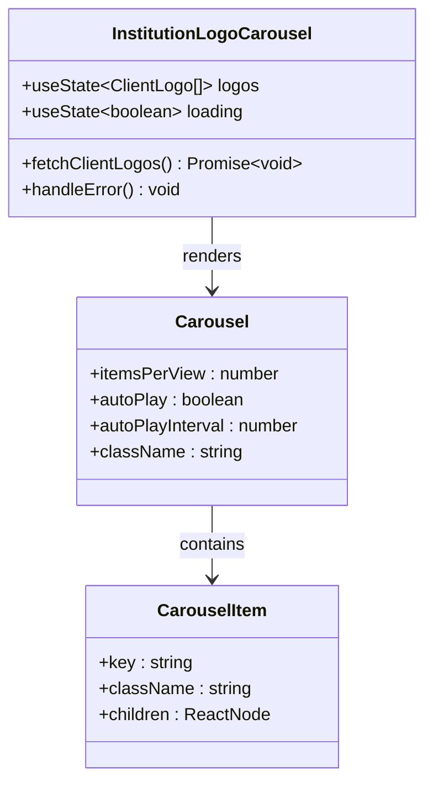
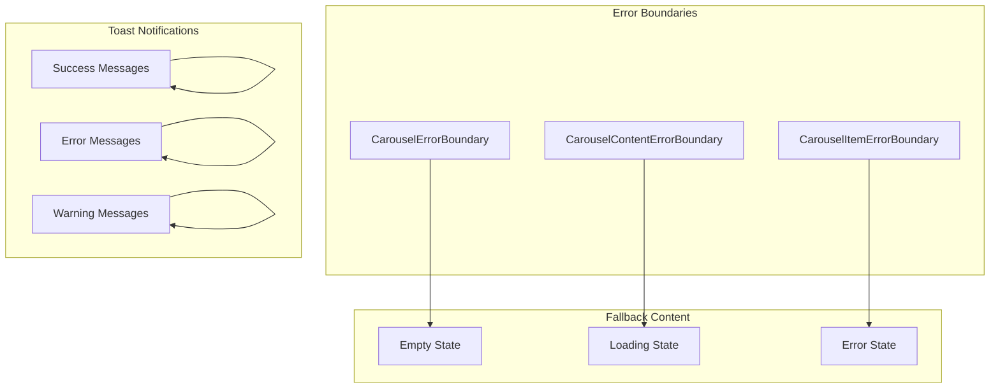

# Institutions Management

<cite>
**Referenced Files in This Document**
- [src/components/admin/content-tabs/institutions-tab.tsx](file://src/components/admin/content-tabs/institutions-tab.tsx)
- [src/app/api/content/institutions/route.ts](file://src/app/api/content/institutions/route.ts)
- [src/app/api/content/institutions/reorder/route.ts](file://src/app/api/content/institutions/reorder/route.ts)
- [src/components/client/client-logo-carousel.tsx](file://src/components/client/client-logo-carousel.tsx)
- [src/components/landing/institutions-section.tsx](file://src/components/landing/institutions-section.tsx)
- [src/components/ui/carousel.tsx](file://src/components/ui/carousel.tsx)
- [prisma/migrations/20251101125707_init/migration.sql](file://prisma/migrations/20251101125707_init/migration.sql)
- [src/components/ui/form.tsx](file://src/components/ui/form.tsx)
- [src/components/ui/sonner.tsx](file://src/components/ui/sonner.tsx)
</cite>

## Table of Contents
1. [Introduction](#introduction)
2. [System Architecture](#system-architecture)
3. [Database Schema](#database-schema)
4. [API Endpoints](#api-endpoints)
5. [Admin Interface](#admin-interface)
6. [Drag-and-Drop Reordering](#drag-and-drop-reordering)
7. [Form Validation](#form-validation)
8. [Client-Side Implementation](#client-side-implementation)
9. [Error Handling](#error-handling)
10. [Performance Optimization](#performance-optimization)
11. [Common Issues and Solutions](#common-issues-and-solutions)
12. [Best Practices](#best-practices)

## Introduction

The Institutions Management feature enables administrators to manage institutional logos displayed in the client carousel on the landing page. This comprehensive system includes functionality for adding, editing, reordering, and managing the visibility of institutional logos through an intuitive administrative interface. The feature leverages drag-and-drop reordering powered by a dedicated API endpoint and provides robust validation for image uploads and form submissions.

## System Architecture

The Institutions Management system follows a modular architecture with clear separation between administration, API services, and client-side presentation:



**Diagram sources**
- [src/components/admin/content-tabs/institutions-tab.tsx](file://src/components/admin/content-tabs/institutions-tab.tsx#L1-L681)
- [src/app/api/content/institutions/route.ts](file://src/app/api/content/institutions/route.ts#L1-L88)
- [src/app/api/content/institutions/reorder/route.ts](file://src/app/api/content/institutions/reorder/route.ts#L1-L26)
- [src/components/landing/institutions-section.tsx](file://src/components/landing/institutions-section.tsx#L1-L341)

## Database Schema

The institutions data is stored in the `ClientLogo` table with the following structure:

| Column | Type | Description | Constraints |
|--------|------|-------------|-------------|
| `id` | VARCHAR(191) | Unique identifier | PRIMARY KEY |
| `name` | VARCHAR(191) | Institution name | NOT NULL |
| `description` | TEXT | Institution description | NULLABLE |
| `url` | VARCHAR(191) | Institution website URL | NULLABLE |
| `logo` | LONGTEXT | Base64 encoded logo image | NOT NULL |
| `isActive` | BOOLEAN | Visibility status | DEFAULT true |
| `order` | INTEGER | Display order | DEFAULT 0 |
| `createdAt` | DATETIME(3) | Creation timestamp | DEFAULT CURRENT_TIMESTAMP |
| `updatedAt` | DATETIME(3) | Last update timestamp | NOT NULL |

**Section sources**
- [prisma/migrations/20251101125707_init/migration.sql](file://prisma/migrations/20251101125707_init/migration.sql#L158-L168)

## API Endpoints

### GET /api/content/institutions
Retrieves all client logos ordered by display order.

**Response Format:**
```typescript
ClientLogo[] = [
  {
    id: string,
    name: string,
    description: string | null,
    url: string | null,
    logo: string,
    isActive: boolean,
    order: number,
    createdAt: string,
    updatedAt: string
  }
]
```

### POST /api/content/institutions
Creates a new client logo entry.

**Request Body:**
```typescript
{
  name: string,
  description?: string,
  url?: string,
  logo: string,
  isActive?: boolean,
  order?: number
}
```

### PATCH /api/content/institutions?id={id}
Updates an existing client logo.

**Request Body:**
```typescript
{
  name?: string,
  description?: string,
  url?: string,
  logo?: string,
  isActive?: boolean,
  order?: number
}
```

### DELETE /api/content/institutions?id={id}
Deletes a client logo by ID.

### POST /api/content/institutions/reorder
Updates the display order of all client logos.

**Request Body:**
```typescript
{
  items: Array<{
    id: string;
    order: number;
  }>
}
```

**Section sources**
- [src/app/api/content/institutions/route.ts](file://src/app/api/content/institutions/route.ts#L1-L88)
- [src/app/api/content/institutions/reorder/route.ts](file://src/app/api/content/institutions/reorder/route.ts#L1-L26)

## Admin Interface

The administrative interface is built around the `InstitutionsTab` component, providing comprehensive management capabilities:

### Component Structure



**Diagram sources**
- [src/components/admin/content-tabs/institutions-tab.tsx](file://src/components/admin/content-tabs/institutions-tab.tsx#L20-L30)

### Key Features

1. **Grid-Based Management**: Displays logos in a sortable, searchable grid
2. **Bulk Operations**: Supports filtering by status (active/inactive) and search functionality
3. **Pagination**: Handles large datasets with configurable page sizes
4. **Real-time Updates**: Immediate reflection of changes in the database
5. **Visual Feedback**: Toast notifications for successful operations

**Section sources**
- [src/components/admin/content-tabs/institutions-tab.tsx](file://src/components/admin/content-tabs/institutions-tab.tsx#L271-L681)

## Drag-and-Drop Reordering

The drag-and-drop reordering functionality provides intuitive manual sorting capabilities:

### Implementation Flow



**Diagram sources**
- [src/components/admin/content-tabs/institutions-tab.tsx](file://src/components/admin/content-tabs/institutions-tab.tsx#L290-L320)
- [src/app/api/content/institutions/reorder/route.ts](file://src/app/api/content/institutions/reorder/route.ts#L5-L25)

### Reordering Logic

The reordering process involves:

1. **Position Calculation**: Determining new indices for moved items
2. **State Synchronization**: Updating local component state immediately
3. **Atomic Updates**: Using Prisma's transaction capabilities for consistency
4. **Error Handling**: Graceful rollback on failures

**Section sources**
- [src/components/admin/content-tabs/institutions-tab.tsx](file://src/components/admin/content-tabs/institutions-tab.tsx#L290-L320)

## Form Validation

The form validation system ensures data integrity and provides user-friendly error messages:

### Image Validation Rules

| Validation Type | Rule | Error Message |
|----------------|------|---------------|
| File Type | Must be image/* | "Lütfen geçerli bir resim dosyası seçin" |
| File Size | Maximum 2MB | "Resim boyutu en fazla 2MB olabilir" |
| Required Fields | Name and Logo | "Kurum adı ve logo zorunludur" |

### Validation Implementation



**Diagram sources**
- [src/components/admin/content-tabs/institutions-tab.tsx](file://src/components/admin/content-tabs/institutions-tab.tsx#L130-L150)

**Section sources**
- [src/components/admin/content-tabs/institutions-tab.tsx](file://src/components/admin/content-tabs/institutions-tab.tsx#L130-L150)

## Client-Side Implementation

### Carousel Component Architecture

The client-side carousel is implemented using a sophisticated React component system:



**Diagram sources**
- [src/components/client/client-logo-carousel.tsx](file://src/components/client/client-logo-carousel.tsx#L15-L30)
- [src/components/ui/carousel.tsx](file://src/components/ui/carousel.tsx#L150-L200)

### Responsive Design

The carousel adapts to different screen sizes:

- **Desktop (≥768px)**: 4 logos per view with navigation controls
- **Mobile (<768px)**: Grid layout with 2 logos per row
- **Error Handling**: Graceful degradation with fallback content

**Section sources**
- [src/components/client/client-logo-carousel.tsx](file://src/components/client/client-logo-carousel.tsx#L50-L162)
- [src/components/landing/institutions-section.tsx](file://src/components/landing/institutions-section.tsx#L200-L340)

## Error Handling

The system implements comprehensive error handling at multiple levels:

### Frontend Error Boundaries



**Diagram sources**
- [src/components/ui/carousel.tsx](file://src/components/ui/carousel.tsx#L10-L80)
- [src/components/ui/sonner.tsx](file://src/components/ui/sonner.tsx#L1-L52)

### Error Types and Responses

| Error Type | Handler | Fallback |
|------------|---------|----------|
| Network Errors | Toast notification | Loading state |
| Validation Errors | Inline feedback | Form preservation |
| Database Errors | Server response | Default institutions |
| Image Load Errors | Hide broken images | Placeholder content |

**Section sources**
- [src/components/ui/carousel.tsx](file://src/components/ui/carousel.tsx#L10-L80)
- [src/components/admin/content-tabs/institutions-tab.tsx](file://src/components/admin/content-tabs/institutions-tab.tsx#L180-L220)

## Performance Optimization

### Image Optimization Strategies

1. **Base64 Encoding**: Images are converted to Base64 for immediate display
2. **Lazy Loading**: Carousel items load progressively
3. **Error Prevention**: Pre-validation prevents failed image loads
4. **Memory Management**: Proper cleanup on component unmount

### API Optimization

- **Batch Updates**: Reorder operations update all items in a single transaction
- **Selective Loading**: Only active logos are fetched for client display
- **Efficient Queries**: Database queries use appropriate indexes

**Section sources**
- [src/app/api/content/institutions/reorder/route.ts](file://src/app/api/content/institutions/reorder/route.ts#L8-L18)
- [src/components/client/client-logo-carousel.tsx](file://src/components/client/client-logo-carousel.tsx#L25-L45)

## Common Issues and Solutions

### Upload Failures

**Issue**: Images fail to upload or display incorrectly
**Causes**:
- File size exceeding 2MB limit
- Unsupported file formats
- Network connectivity issues

**Solutions**:
1. Implement client-side validation before upload
2. Provide clear error messages with file size/format requirements
3. Add retry mechanisms for network failures

### Display Order Problems

**Issue**: Logos appear in incorrect order
**Causes**:
- Race conditions during reorder operations
- Database synchronization delays
- Browser caching issues

**Solutions**:
1. Use atomic database transactions for reorder operations
2. Implement optimistic UI updates with rollback capability
3. Clear browser cache after significant changes

### Responsive Behavior Issues

**Issue**: Carousel displays incorrectly on different devices
**Causes**:
- CSS specificity conflicts
- JavaScript execution timing
- Missing viewport meta tag

**Solutions**:
1. Use CSS Grid/Flexbox for responsive layouts
2. Implement proper lifecycle management
3. Ensure mobile-first design principles

**Section sources**
- [src/components/admin/content-tabs/institutions-tab.tsx](file://src/components/admin/content-tabs/institutions-tab.tsx#L130-L150)
- [src/components/ui/carousel.tsx](file://src/components/ui/carousel.tsx#L150-L200)

## Best Practices

### Development Guidelines

1. **Validation First**: Always validate on the client side before API calls
2. **Progressive Enhancement**: Ensure core functionality works without JavaScript
3. **Accessibility**: Implement proper ARIA labels and keyboard navigation
4. **Testing**: Test with various image formats and sizes
5. **Documentation**: Maintain clear comments for complex logic

### Security Considerations

1. **Input Sanitization**: Validate all user inputs server-side
2. **File Validation**: Verify file types and signatures
3. **Rate Limiting**: Implement limits on API requests
4. **Error Information**: Avoid exposing sensitive information in error messages

### Performance Guidelines

1. **Optimize Images**: Use compressed formats and appropriate dimensions
2. **Minimize HTTP Requests**: Batch operations where possible
3. **Cache Strategically**: Implement appropriate caching policies
4. **Monitor Performance**: Track load times and error rates

This comprehensive Institutions Management system provides administrators with powerful tools to maintain institutional logos while ensuring optimal performance and user experience across all devices and browsers.