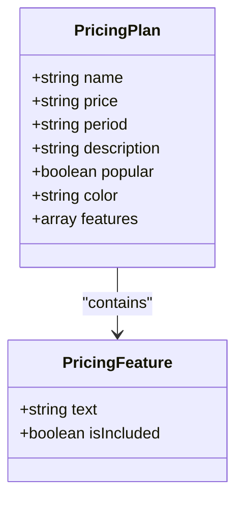
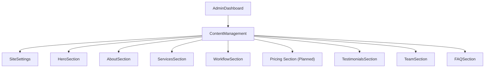
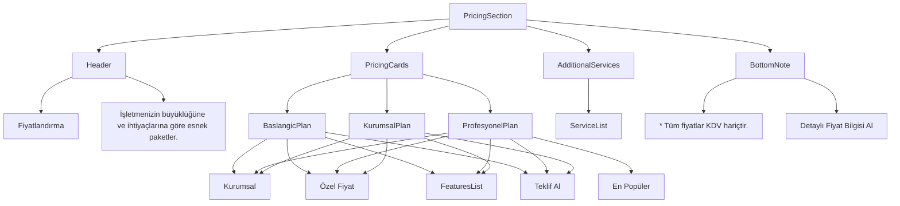
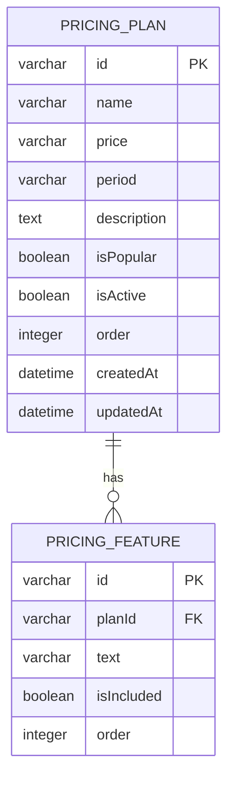

# Pricing Management

<cite>
**Referenced Files in This Document**   
- [pricing-section.tsx](file://src/components/landing/pricing-section.tsx)
- [pricing-tab.tsx](file://src/components/admin/content-tabs/pricing-tab.tsx)
- [schema.prisma](file://prisma/schema.prisma)
- [content/page.tsx](file://src/app/admin/content/page.tsx)
- [page.tsx](file://src/app/(public)/page.tsx)
</cite>

## Table of Contents
1. [Introduction](#introduction)
2. [Pricing Data Structure](#pricing-data-structure)
3. [Admin Interface Status](#admin-interface-status)
4. [Public Pricing Display](#public-pricing-display)
5. [Database Schema](#database-schema)
6. [Implementation Roadmap](#implementation-roadmap)
7. [Best Practices for Pricing Strategy](#best-practices-for-pricing-strategy)
8. [Troubleshooting Common Issues](#troubleshooting-common-issues)
9. [Conclusion](#conclusion)

## Introduction
This document provides comprehensive information about the Pricing Management system in the SMMM application. The pricing system is designed to display tiered service packages to potential clients while allowing administrators to manage pricing plans through an administrative interface. Currently, the system displays static pricing information on the public website, with plans for future administrative functionality to manage these pricing tiers dynamically.

**Section sources**
- [pricing-section.tsx](file://src/components/landing/pricing-section.tsx)
- [pricing-tab.tsx](file://src/components/admin/content-tabs/pricing-tab.tsx)

## Pricing Data Structure
The pricing system consists of multiple pricing tiers, each with specific attributes that define the plan's characteristics and value proposition. Each pricing plan contains the following properties:

- **name**: The plan name (e.g., "Başlangıç", "Profesyonel", "Kurumsal")
- **price**: The monthly cost displayed in Turkish Lira (₺)
- **period**: The billing frequency (currently "/ay" for monthly)
- **description**: A brief description of the target customer segment
- **popular**: Boolean flag indicating if the plan is the recommended option
- **features**: An array of included services and benefits
- **color**: Visual gradient for the plan's card (differentiates plans visually)

Each plan's features are displayed as a checklist, with the "Profesyonel" (Professional) plan marked as the popular choice through visual prominence and styling.

**Diagram sources**
- [pricing-section.tsx](file://src/components/landing/pricing-section.tsx)
- [schema.prisma](file://prisma/schema.prisma)

**Section sources**
- [pricing-section.tsx](file://src/components/landing/pricing-section.tsx)

## Admin Interface Status
The administrative interface for pricing management currently exists as a placeholder component. The `PricingTab` component in the admin content management section displays a "Coming Soon" message, indicating that the functionality is planned but not yet implemented.

The admin navigation structure includes a dedicated tab for pricing management, suggesting that this feature is part of the planned roadmap. The tab is accessible through the content management section of the admin dashboard, positioned among other content modules like hero section, about, services, and testimonials.

**Diagram sources**
- [content/page.tsx](file://src/app/admin/content/page.tsx)
- [pricing-tab.tsx](file://src/components/admin/content-tabs/pricing-tab.tsx)

**Section sources**
- [content/page.tsx](file://src/app/admin/content/page.tsx)
- [pricing-tab.tsx](file://src/components/admin/content-tabs/pricing-tab.tsx)

## Public Pricing Display
The pricing section is prominently displayed on the public website, integrated into the main landing page flow between the services and testimonials sections. The component uses motion effects for enhanced user experience, with elements animating into view as users scroll.

The pricing display features three-tiered plans with responsive grid layout that adjusts from three columns on desktop to single column on mobile devices. The "Profesyonel" plan receives special visual treatment with a border, shadow, and scale effect to emphasize its status as the recommended option.

Each pricing card includes:
- Plan name and descriptive icon
- Price with currency symbol (₺)
- Feature checklist with green checkmarks
- Call-to-action button for requesting a quote

The section also includes additional services that can be added to any package, displayed in a separate highlighted section with blue background.

**Diagram sources**
- [pricing-section.tsx](file://src/components/landing/pricing-section.tsx)
- [page.tsx](file://src/app/(public)/page.tsx)

**Section sources**
- [pricing-section.tsx](file://src/components/landing/pricing-section.tsx)
- [page.tsx](file://src/app/(public)/page.tsx)

## Database Schema
The database schema includes dedicated models for storing pricing information, indicating that dynamic pricing management is part of the system's intended functionality. The schema consists of two related tables:

- **PricingPlan**: Stores the main plan information including name, price, description, and display properties
- **PricingFeature**: Stores individual features associated with each plan, allowing for flexible feature lists

Key fields in the PricingPlan model include:
- `name`: Required string for the plan name
- `price`: Required string for the price value
- `period`: String with default value "ay" (month)
- `isPopular`: Boolean flag to designate the recommended plan
- `isActive`: Boolean to control plan visibility
- `order`: Integer for controlling display sequence

The PricingFeature model supports individual feature management with:
- `text`: The feature description
- `isIncluded`: Boolean to indicate if the feature is included (allowing for strikethrough display of unavailable features)
- `order`: Integer for feature list sequencing

**Diagram sources**
- [schema.prisma](file://prisma/schema.prisma)

**Section sources**
- [schema.prisma](file://prisma/schema.prisma)

## Implementation Roadmap
Based on the current codebase analysis, the pricing management system appears to be in a transitional state with the following characteristics:

1. **Frontend Display**: Fully implemented with static pricing data
2. **Database Schema**: Complete with appropriate models and relationships
3. **Admin Interface**: Created as a placeholder with navigation integration
4. **API Routes**: Not yet implemented for pricing data management

To complete the pricing management functionality, the following components need to be developed:

### Required API Endpoints
- **GET /api/content/pricing**: Retrieve all pricing plans and features
- **POST /api/content/pricing**: Create new pricing plan
- **PATCH /api/content/pricing/[id]**: Update existing pricing plan
- **DELETE /api/content/pricing/[id]**: Remove pricing plan
- **Reordering Endpoint**: Adjust plan display order

### Admin Interface Components
- Form for creating/editing pricing plans
- Feature list management with add/remove functionality
- Visual controls for setting plan popularity and active status
- Price validation with Turkish Lira formatting
- Real-time preview of changes

### Validation Rules
- Plan name: Required, minimum 3 characters
- Price: Required, numeric value or "Özel Fiyat"
- Features: At least one feature required per plan
- Period: Must be a valid time unit (ay, yıl, etc.)

## Best Practices for Pricing Strategy
When implementing the completed pricing management system, consider the following best practices for effective pricing structures:

### Competitive Positioning
- Research competitor pricing in the accounting and financial services market
- Position the "Profesyonel" plan as the optimal value choice
- Use the "Kurumsal" plan for high-touch enterprise clients with custom pricing

### Transparency Principles
- Clearly display what's included in each tier
- Avoid hidden fees or charges
- Specify billing frequency and contract terms
- Include VAT information in pricing notes

### Conversion Optimization
- Use the "En Popüler" (Most Popular) badge strategically on the recommended plan
- Ensure the call-to-action buttons are prominent and action-oriented
- Provide clear next steps for prospects interested in custom solutions
- Include social proof near pricing information

### Tier Design
- Follow the standard three-tier model (Good, Better, Best)
- Make the middle tier the recommended option
- Use feature progression that encourages upgrading
- Consider annual billing discounts to improve customer lifetime value

## Troubleshooting Common Issues
While the pricing management system is under development, administrators may encounter the following issues:

### Price Formatting Issues
**Problem**: Incorrect display of Turkish Lira symbol (₺) or decimal separators
**Solution**: Ensure prices are stored as strings with consistent formatting, using period as decimal separator and including the ₺ symbol only in display (not in data storage)

### Missing Plan Features
**Problem**: Features not appearing in the pricing display
**Solution**: Verify that features are properly linked to their parent plans in the database and that the frontend correctly maps the relationship

### Responsive Layout Problems
**Problem**: Pricing cards not displaying correctly on mobile devices
**Solution**: Test the responsive grid implementation and ensure proper breakpoints are configured for different screen sizes

### Performance Concerns
**Problem**: Slow loading of pricing information
**Solution**: Implement caching for pricing data and optimize database queries to retrieve plans and features efficiently

### Data Consistency
**Problem**: Inconsistent ordering of plans or features
**Solution**: Use the order field in both PricingPlan and PricingFeature models to maintain consistent display sequence

## Conclusion
The pricing management system in the SMMM application is currently in a partially implemented state, with a fully functional public display component and a placeholder admin interface. The database schema is well-designed to support dynamic pricing management, but the API routes and admin forms have not yet been developed.

The current implementation effectively communicates the service tiers to potential clients with a clean, professional design that highlights the recommended "Profesyonel" plan. Once the admin functionality is completed, administrators will be able to fully manage pricing plans, features, and display properties through the content management interface.

The roadmap for completion includes developing the necessary API endpoints to connect the admin interface with the database, creating form components for managing pricing data, and implementing proper validation to ensure data integrity. With these additions, the system will provide a comprehensive solution for managing service pricing that balances administrative control with effective client communication.