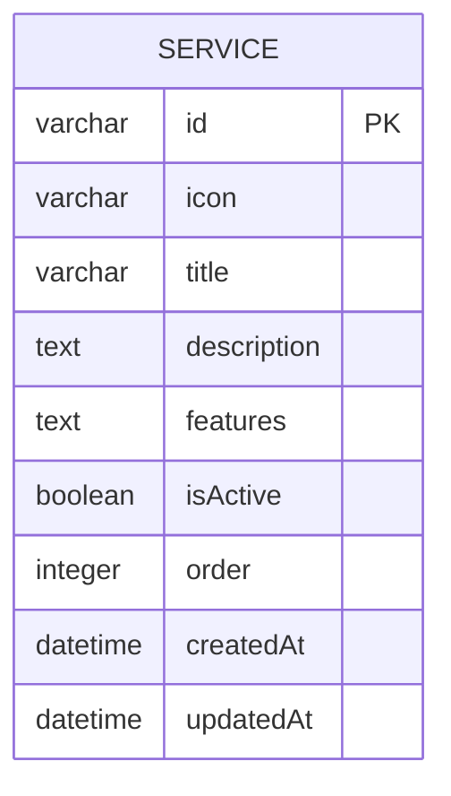
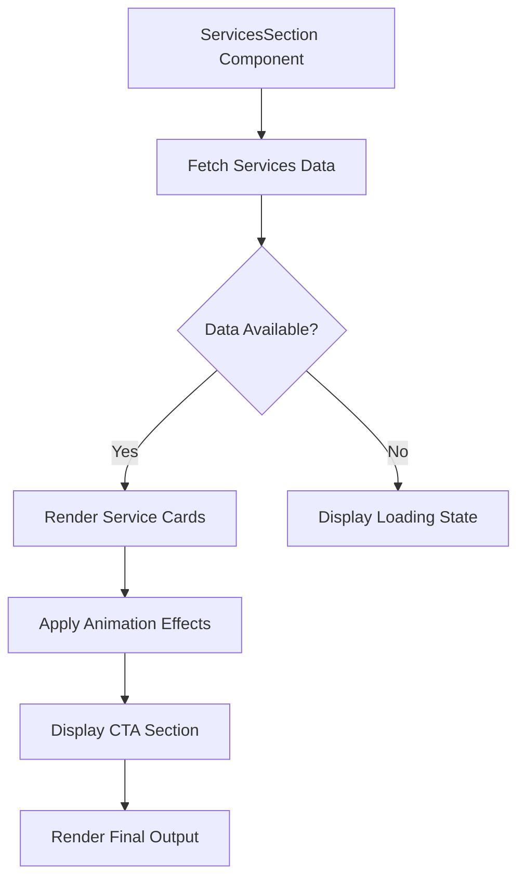

# Services Management

<cite>
**Referenced Files in This Document**   
- [services-tab.tsx](file://src/components/admin/content-tabs/services-tab.tsx)
- [services-section.tsx](file://src/components/landing/services-section.tsx)
- [migration.sql](file://prisma/migrations/20251101125707_init/migration.sql)
- [content-management-page.tsx](file://src/app/admin/content/page.tsx)
</cite>

## Table of Contents
1. [Introduction](#introduction)
2. [Service Data Structure](#service-data-structure)
3. [Admin Interface for Service Management](#admin-interface-for-service-management)
4. [Public Services Display](#public-services-display)
5. [Icon Management System](#icon-management-system)
6. [Common Issues and Troubleshooting](#common-issues-and-troubleshooting)
7. [Best Practices for Service Catalog Maintenance](#best-practices-for-service-catalog-maintenance)

## Introduction
The Services Management feature enables administrators to maintain a comprehensive catalog of tax consulting services offered by the firm. This documentation details how administrators can manage service listings, including service titles, descriptions, icon selection, and ordering. The system allows for dynamic content management through an admin interface while ensuring consistent presentation on the public website through the ServicesSection component. Although the admin interface for services is currently marked as "Coming Soon," the underlying data structure and public display components are fully implemented and operational.

**Section sources**
- [services-tab.tsx](file://src/components/admin/content-tabs/services-tab.tsx#L1-L2)
- [content-management-page.tsx](file://src/app/admin/content/page.tsx#L1-L134)

## Service Data Structure
The service data is structured in the database with comprehensive fields to support rich content presentation. Each service record contains essential information for both administrative management and public display.

**Diagram sources**
- [migration.sql](file://prisma/migrations/20251101125707_init/migration.sql#L220-L244)

The Service table in the database includes the following fields:
- **id**: Unique identifier for each service (VARCHAR, Primary Key)
- **icon**: Reference to the icon used for the service (VARCHAR, Nullable)
- **title**: The service title displayed to users (VARCHAR, Not Null)
- **description**: Brief description of the service (TEXT, Not Null)
- **features**: Detailed list of service features in JSON format (TEXT, Nullable)
- **isActive**: Boolean flag indicating if the service is currently offered (BOOLEAN, Default: true)
- **order**: Integer value determining the display order of services (INTEGER, Default: 0)
- **createdAt**: Timestamp of record creation (DATETIME, Default: CURRENT_TIMESTAMP)
- **updatedAt**: Timestamp of last modification (DATETIME, Not Null)

This structure supports the dynamic management of services while maintaining historical data integrity through creation and update timestamps.

**Section sources**
- [migration.sql](file://prisma/migrations/20251101125707_init/migration.sql#L220-L244)

## Admin Interface for Service Management
The admin interface for service management is accessible through the Content Management section of the admin dashboard. Administrators can navigate to the Services tab to manage the service catalog, although the current implementation indicates this feature is still in development.

The navigation interface in the admin panel includes a dedicated tab for services with a briefcase icon, indicating its purpose for managing professional services. When fully implemented, this interface will allow administrators to perform CRUD (Create, Read, Update, Delete) operations on service items, including setting the service title, description, icon selection, and ordering.

The placeholder implementation currently displays a "Services Tab - Coming Soon" message, suggesting that the development team plans to implement a comprehensive form interface for adding and editing service items with appropriate validation rules and submission handling.

**Section sources**
- [services-tab.tsx](file://src/components/admin/content-tabs/services-tab.tsx#L1-L2)
- [content-management-page.tsx](file://src/app/admin/content/page.tsx#L65-L67)

## Public Services Display
The ServicesSection component renders the service catalog on the public website, providing visitors with a clear overview of the firm's offerings. The component displays services in a responsive grid layout that adapts to different screen sizes.

**Diagram sources**
- [services-section.tsx](file://src/components/landing/services-section.tsx#L1-L172)

The public display includes the following elements:
- **Header Section**: Displays the "Hizmetlerimiz" (Our Services) title with a gradient effect and a descriptive subtitle
- **Service Grid**: Presents services in a responsive grid (1 column on mobile, 2 on medium screens, 3 on large screens)
- **Service Cards**: Each card contains an icon, title, description, and a list of specific features
- **Call-to-Action Section**: Prominent CTA section encouraging visitors to request a free consultation or obtain pricing information

The component uses motion effects from Framer Motion to create an engaging user experience, with services appearing with fade-in and slide-up animations as they come into view.

**Section sources**
- [services-section.tsx](file://src/components/landing/services-section.tsx#L1-L172)

## Icon Management System
The system utilizes the Lucide React icon library to provide a consistent visual language across service offerings. The current implementation includes six distinct icons that represent different service categories:

- **FileText**: Represents tax filing and declaration services
- **Calculator**: Symbolizes accounting and bookkeeping services
- **Building2**: Indicates company formation and corporate services
- **TrendingUp**: Denotes financial advisory and strategic consulting
- **Shield**: Represents auditing and compliance services
- **Users**: Symbolizes payroll and HR-related services

These icons are rendered within circular gradient backgrounds that provide visual distinction and brand consistency. The icon-color pairing follows a deliberate scheme where each service category has a dedicated color gradient (e.g., blue for tax filing, green for accounting, purple for company formation).

The system currently hardcodes these icons within the services array, but the database structure suggests future flexibility to allow administrators to select from a broader range of icons when creating or editing service listings.

**Section sources**
- [services-section.tsx](file://src/components/landing/services-section.tsx#L1-L41)

## Common Issues and Troubleshooting
Several potential issues may arise in the management and display of services, particularly given the current state of development:

**Missing Icons**: If an icon reference in the database does not correspond to a valid Lucide React component, the service card may fail to render properly or display a broken icon. This can be prevented by implementing proper validation in the admin interface to restrict icon selection to available options.

**Inconsistent Service Descriptions**: Without standardized templates or character limits, service descriptions may vary significantly in length and style, leading to inconsistent presentation. Implementing character counters and style guidelines in the admin interface can help maintain consistency.

**Ordering Issues**: The current implementation does not show a mechanism for reordering services in the admin interface. Administrators may need to manually adjust the "order" field values in the database, which could lead to gaps or duplicates in the sequence.

**Inactive Service Visibility**: Although the database includes an "isActive" field, the public component does not filter out inactive services. This could result in outdated or discontinued services being displayed to visitors.

**Responsive Design Problems**: With a growing number of services, the current grid layout may become crowded on smaller screens, potentially affecting user experience.

**Section sources**
- [services-section.tsx](file://src/components/landing/services-section.tsx#L1-L172)
- [migration.sql](file://prisma/migrations/20251101125707_init/migration.sql#L220-L244)

## Best Practices for Service Catalog Maintenance
To ensure a clear and compelling service catalog that aligns with business offerings, administrators should follow these best practices:

**Consistent Content Structure**: Maintain a uniform structure for service titles and descriptions. Titles should be concise and descriptive, while descriptions should highlight key benefits in 1-2 sentences.

**Visual Hierarchy**: Use the ordering system strategically to present the most popular or profitable services first, guiding visitor attention to priority offerings.

**Regular Updates**: Periodically review the service catalog to ensure all offerings are current and accurately represented. Remove or archive discontinued services rather than simply deactivating them.

**Feature List Optimization**: Keep feature lists focused on 4-6 key benefits per service to avoid overwhelming visitors. Use consistent terminology across similar services.

**Performance Monitoring**: Track visitor engagement with different service listings (through analytics) to identify which offerings generate the most interest and adjust the catalog accordingly.

**Brand Alignment**: Ensure all service descriptions and visuals align with the firm's overall brand positioning and value proposition.

**Accessibility Considerations**: Verify that icon-color combinations provide sufficient contrast for users with visual impairments, and ensure all interactive elements are keyboard-navigable.

**Section sources**
- [services-section.tsx](file://src/components/landing/services-section.tsx#L1-L172)
- [migration.sql](file://prisma/migrations/20251101125707_init/migration.sql#L220-L244)