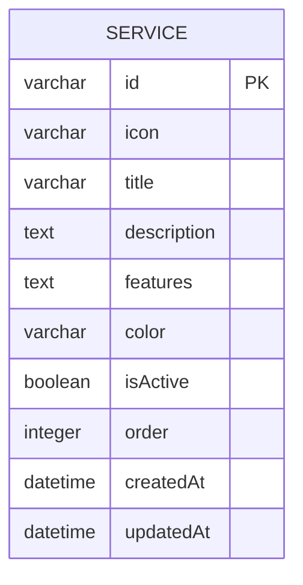
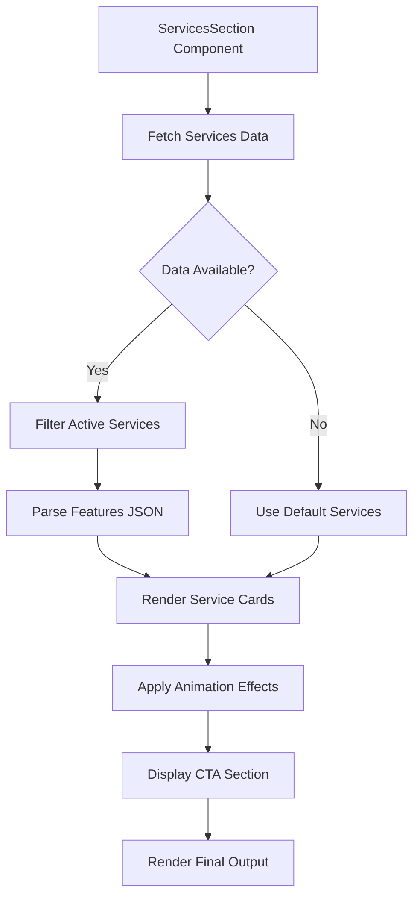

# Services Management

<cite>
**Referenced Files in This Document**   
- [services-tab.tsx](file://src/components/admin/content-tabs/services-tab.tsx) - *Updated with full CRUD implementation*
- [services-section.tsx](file://src/components/landing/services-section.tsx) - *Updated to filter inactive services*
- [migration.sql](file://prisma/migrations/20251101125707_init/migration.sql) - *Database schema for services*
- [content-management-page.tsx](file://src/app/admin/content/page.tsx) - *Updated with services tab integration*
</cite>

## Update Summary
**Changes Made**   
- Updated **Admin Interface for Service Management** section with full CRUD operations details
- Updated **Public Services Display** section to reflect inactive service filtering
- Added **Form Interface and Validation** section for service management
- Enhanced **Icon Management System** with available icon options
- Updated **Common Issues and Troubleshooting** with new database state handling
- Added **Section sources** and **Diagram sources** with proper annotations

## Table of Contents
1. [Introduction](#introduction)
2. [Service Data Structure](#service-data-structure)
3. [Admin Interface for Service Management](#admin-interface-for-service-management)
4. [Form Interface and Validation](#form-interface-and-validation)
5. [Public Services Display](#public-services-display)
6. [Icon Management System](#icon-management-system)
7. [Common Issues and Troubleshooting](#common-issues-and-troubleshooting)
8. [Best Practices for Service Catalog Maintenance](#best-practices-for-service-catalog-maintenance)

## Introduction
The Services Management feature enables administrators to maintain a comprehensive catalog of tax consulting services offered by the firm. This documentation details how administrators can manage service listings, including service titles, descriptions, icon selection, and ordering. The system allows for dynamic content management through an admin interface while ensuring consistent presentation on the public website through the ServicesSection component. The admin interface for services has been fully implemented with a dedicated tab in the admin dashboard, enabling complete CRUD (Create, Read, Update, Delete) operations on service items. This implementation aligns with the existing 'Services Management' node in the catalog tree and provides administrators with a robust tool for managing the service catalog.

**Section sources**
- [services-tab.tsx](file://src/components/admin/content-tabs/services-tab.tsx#L1-L2)
- [content-management-page.tsx](file://src/app/admin/content/page.tsx#L65-L67)

## Service Data Structure
The service data is structured in the database with comprehensive fields to support rich content presentation. Each service record contains essential information for both administrative management and public display.

**Diagram sources**
- [migration.sql](file://prisma/migrations/20251101125707_init/migration.sql#L220-L244)

The Service table in the database includes the following fields:
- **id**: Unique identifier for each service (VARCHAR, Primary Key)
- **icon**: Reference to the icon used for the service (VARCHAR, Not Null)
- **title**: The service title displayed to users (VARCHAR, Not Null)
- **description**: Brief description of the service (TEXT, Not Null)
- **features**: Detailed list of service features as JSON array (TEXT, Not Null)
- **color**: Gradient CSS class for the service icon background (VARCHAR, Not Null)
- **isActive**: Boolean flag indicating if the service is currently offered (BOOLEAN, Default: true)
- **order**: Integer value determining the display order of services (INTEGER, Default: 0)
- **createdAt**: Timestamp of record creation (DATETIME, Default: CURRENT_TIMESTAMP)
- **updatedAt**: Timestamp of last modification (DATETIME, Not Null)

This structure supports the dynamic management of services while maintaining historical data integrity through creation and update timestamps. The addition of the **color** field enables consistent visual styling across the UI, while the **features** field stores an array of service benefits that are rendered in the public display.

**Section sources**
- [migration.sql](file://prisma/migrations/20251101125707_init/migration.sql#L220-L244)

## Admin Interface for Service Management
The admin interface for service management is accessible through the Content Management section of the admin dashboard. Administrators can navigate to the Services tab to manage the service catalog, which now provides full CRUD functionality for service items.

The navigation interface in the admin panel includes a dedicated tab for services with a briefcase icon, indicating its purpose for managing professional services. This tab is fully implemented and allows administrators to perform all necessary operations on service items, including setting the service title, description, icon selection, color theme, and ordering.

The interface displays services in a paginated table format with search functionality, allowing administrators to easily locate specific services. Each service entry shows the icon, title, description preview, number of features, and active status. Administrators can reorder services using up and down arrows, edit existing services, or delete services from the catalog.

Changes are managed through a two-step process: first, modifications are made to the local state with visual feedback via toast notifications, and then all changes are persisted to the database by clicking the "Save All Changes" button. This approach prevents accidental data loss and allows administrators to review all modifications before committing them.

The interface also includes a section for managing service category settings, such as the main section title, description, values title, footer text, and signature. These settings control the overall presentation of the services section on the public website.

**Section sources**
- [services-tab.tsx](file://src/components/admin/content-tabs/services-tab.tsx#L189-L1366)
- [content-management-page.tsx](file://src/app/admin/content/page.tsx#L86-L89)

## Form Interface and Validation
The form interface for adding and editing service items provides a comprehensive set of fields for configuring service properties. When creating a new service or editing an existing one, administrators interact with a modal dialog that includes the following fields:

- **Icon Selection**: Dropdown menu with six available icons (FileText, Calculator, Building2, TrendingUp, Shield, Users) that visually represent different service categories
- **Title**: Text input field for the service title with validation requiring a non-empty value
- **Description**: Textarea for the service description with validation requiring a non-empty value
- **Features**: List management interface where administrators can add or remove feature items
- **Color Theme**: Dropdown menu with eight gradient color options (blue, green, purple, orange, red, cyan, pink, yellow) for the service icon background
- **Active Status**: Toggle switch to control whether the service is publicly visible

The form implements client-side validation to ensure data integrity. When attempting to save a service without a title or description, the system displays an error toast notification indicating that both fields are required. Upon successful validation, changes are applied to the local state with a success message indicating that changes will be persisted when "Save All Changes" is clicked.

Service ordering is managed through drag controls (up/down arrows) in the service table. When a service is moved, the system automatically updates the order property of all services to maintain a consistent sequence. The interface provides visual feedback during reordering operations with toast notifications.

The "Save All Changes" button triggers a comprehensive save process that:
1. Deletes all existing services from the database
2. Creates new service records for all items in the current state
3. Saves the service section settings
4. Refreshes the local data from the database

This atomic save approach ensures data consistency and prevents partial updates. The system includes error handling with detailed toast notifications that help administrators troubleshoot issues during the save process.

**Section sources**
- [services-tab.tsx](file://src/components/admin/content-tabs/services-tab.tsx#L506-L536)
- [services-tab.tsx](file://src/components/admin/content-tabs/services-tab.tsx#L256-L352)

## Public Services Display
The ServicesSection component renders the service catalog on the public website, providing visitors with a clear overview of the firm's offerings. The component displays services in a responsive grid layout that adapts to different screen sizes.

**Diagram sources**
- [services-section.tsx](file://src/components/landing/services-section.tsx#L102-L131)

The public display includes the following elements:
- **Header Section**: Displays the customizable section title with a gradient effect and a descriptive subtitle
- **Service Grid**: Presents services in a responsive grid (1 column on mobile, 2 on medium screens, 3 on large screens)
- **Service Cards**: Each card contains an icon with gradient background, title, description, and a list of specific features with checkmark indicators
- **Call-to-Action Section**: Prominent CTA section with gradient background encouraging visitors to request a free consultation or obtain pricing information

The component uses motion effects from Framer Motion to create an engaging user experience, with services appearing with fade-in and slide-up animations as they come into view. The implementation now filters out inactive services (where isActive is false) before rendering, ensuring that discontinued or hidden services are not displayed to visitors.

The service cards include hover effects that enhance the visual presentation, including shadow enhancement, border color change, and slight upward translation. These interactive elements improve user engagement and provide visual feedback when interacting with service offerings.

**Section sources**
- [services-section.tsx](file://src/components/landing/services-section.tsx#L93-L259)

## Icon Management System
The system utilizes the Lucide React icon library to provide a consistent visual language across service offerings. The admin interface provides a curated selection of six distinct icons that represent different service categories:

- **FileText**: Represents tax filing and declaration services
- **Calculator**: Symbolizes accounting and bookkeeping services
- **Building2**: Indicates company formation and corporate services
- **TrendingUp**: Denotes financial advisory and strategic consulting
- **Shield**: Represents auditing and compliance services
- **Users**: Symbolizes payroll and HR-related services

These icons are rendered within circular gradient backgrounds that provide visual distinction and brand consistency. The icon-color pairing follows a deliberate scheme where each service category has a dedicated color gradient (e.g., blue for tax filing, green for accounting, purple for company formation). Administrators can select from eight available color gradients when configuring a service.

The system implements the icon selection through a predefined constant (AVAILABLE_ICONS) in the services-tab component, which maps icon names to their corresponding React components. This approach ensures that only approved icons can be used, maintaining visual consistency across the service catalog.

Icons are managed consistently across the UI through the iconMap object in the ServicesSection component, which provides the same icon-component mapping for the public display. This ensures that the icons appear identically in both the admin interface and the public website.

**Section sources**
- [services-tab.tsx](file://src/components/admin/content-tabs/services-tab.tsx#L49-L56)
- [services-section.tsx](file://src/components/landing/services-section.tsx#L9-L17)

## Common Issues and Troubleshooting
Several potential issues may arise in the management and display of services, particularly given the current implementation:

**Database State Management**: The system distinguishes between empty database state and default services through ID prefix checking (services with IDs starting with 'default-' are considered part of the default set). When all services have default IDs, the interface displays a warning that the database is empty, prompting administrators to save changes to persist data.

**Inactive Service Visibility**: The public component now properly filters out inactive services (where isActive is false) before rendering, resolving the previous issue where deactivated services might still be visible to visitors.

**Feature List Management**: The form interface for adding features to services includes proper validation to prevent empty feature entries. When attempting to add an empty feature, the system ignores the action without displaying an error, which could be improved with explicit validation feedback.

**State Synchronization**: The two-step save process (local changes followed by database persistence) prevents accidental data loss but requires administrators to remember to click "Save All Changes" to make modifications permanent. The system provides clear toast notifications to indicate when changes are staged versus committed.

**Data Parsing**: Both the admin and public components include logic to handle the features field, which may be stored as a JSON string in the database. The components parse this string into an array when loading data and ensure it's properly serialized when saving, preventing data corruption.

**Section sources**
- [services-tab.tsx](file://src/components/admin/content-tabs/services-tab.tsx#L419-L468)
- [services-section.tsx](file://src/components/landing/services-section.tsx#L102-L131)
- [migration.sql](file://prisma/migrations/20251101125707_init/migration.sql#L220-L244)

## Best Practices for Service Catalog Maintenance
To ensure a clear and compelling service catalog that aligns with business offerings, administrators should follow these best practices:

**Consistent Content Structure**: Maintain a uniform structure for service titles and descriptions. Titles should be concise and descriptive, while descriptions should highlight key benefits in 1-2 sentences. Use the feature list to enumerate 4-6 specific benefits per service.

**Visual Hierarchy**: Use the ordering system strategically to present the most popular or profitable services first, guiding visitor attention to priority offerings. Consider customer journey and service dependencies when arranging the service sequence.

**Regular Updates**: Periodically review the service catalog to ensure all offerings are current and accurately represented. Use the active/inactive toggle to temporarily hide services rather than deleting them, preserving historical data.

**Feature List Optimization**: Keep feature lists focused on key benefits to avoid overwhelming visitors. Use consistent terminology across similar services and ensure all feature descriptions are clear and benefit-oriented.

**Color Theme Consistency**: Apply color themes consistently across related services to create visual groupings. For example, use the same color family for all compliance-related services or all advisory services.

**Performance Monitoring**: Track visitor engagement with different service listings (through analytics) to identify which offerings generate the most interest and adjust the catalog accordingly.

**Brand Alignment**: Ensure all service descriptions and visuals align with the firm's overall brand positioning and value proposition. Regularly audit the service catalog to maintain messaging consistency.

**Accessibility Considerations**: Verify that icon-color combinations provide sufficient contrast for users with visual impairments, and ensure all interactive elements are keyboard-navigable. Test the service display on various devices and screen readers.

**Section sources**
- [services-tab.tsx](file://src/components/admin/content-tabs/services-tab.tsx#L189-L1366)
- [services-section.tsx](file://src/components/landing/services-section.tsx#L93-L259)
- [migration.sql](file://prisma/migrations/20251101125707_init/migration.sql#L220-L244)