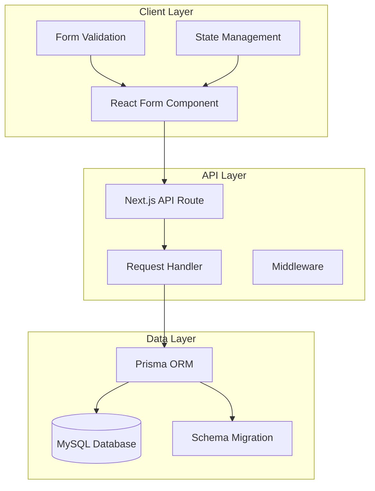
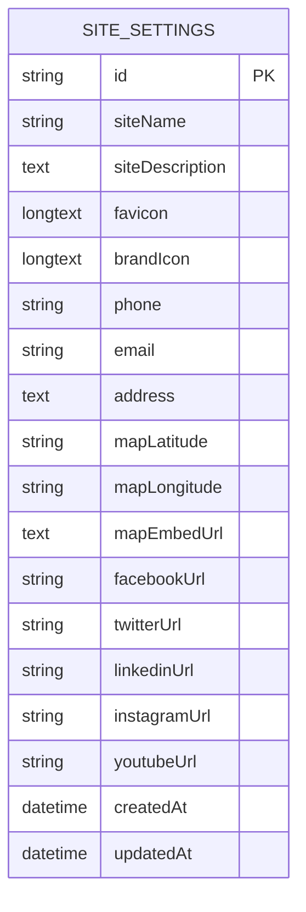
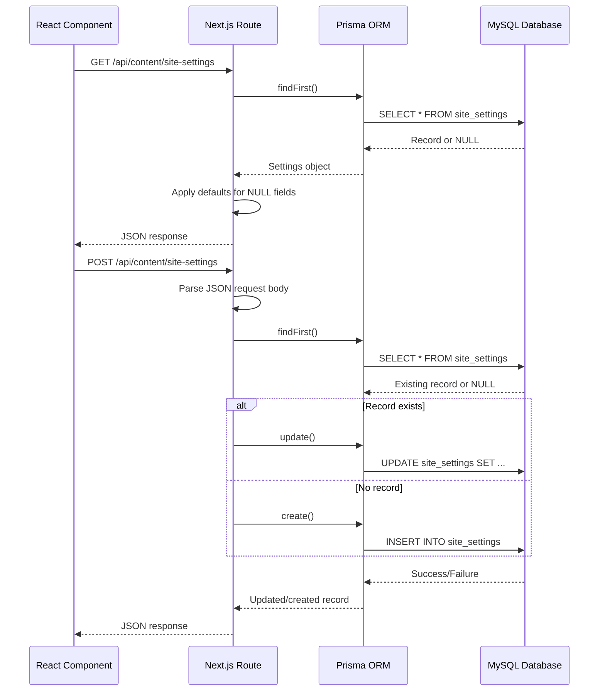
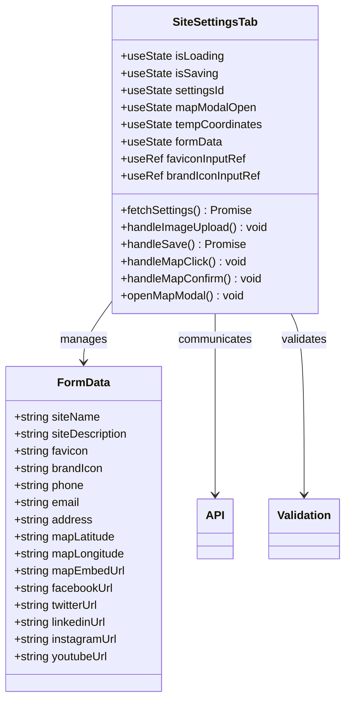
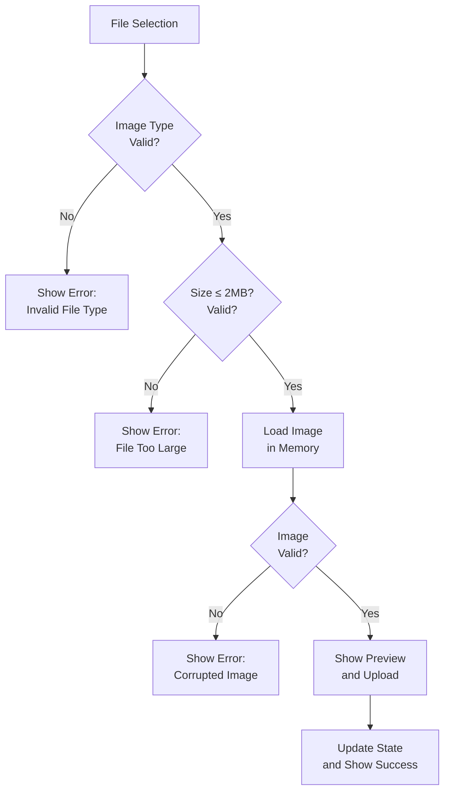
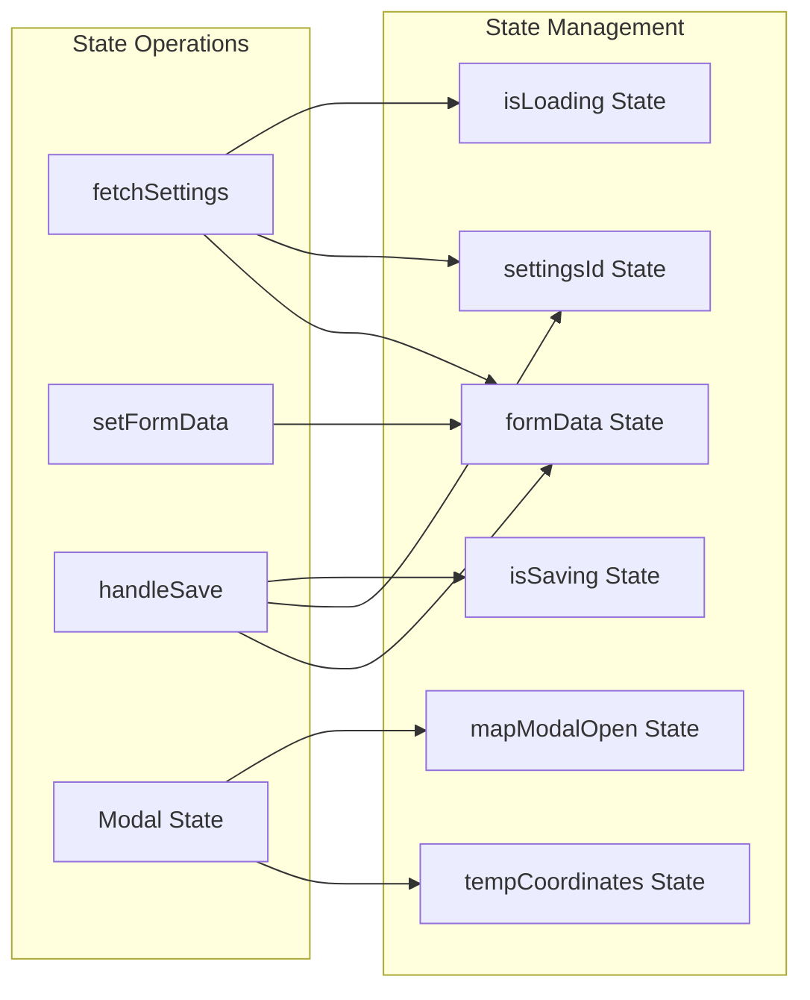
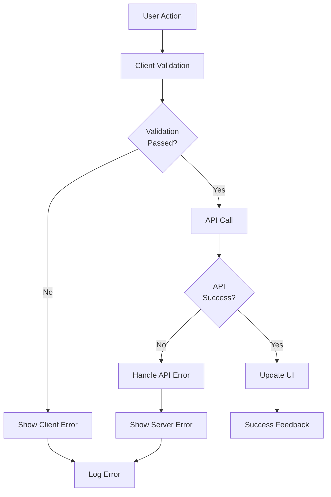
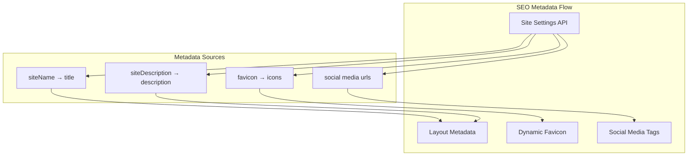

# Site Settings Management

<cite>
**Referenced Files in This Document**
- [src/components/admin/content-tabs/site-settings-tab.tsx](file://src/components/admin/content-tabs/site-settings-tab.tsx)
- [src/app/api/content/site-settings/route.ts](file://src/app/api/content/site-settings/route.ts)
- [src/components/landing/contact-section.tsx](file://src/components/landing/contact-section.tsx)
- [src/components/landing/footer.tsx](file://src/components/landing/footer.tsx)
- [src/app/layout.tsx](file://src/app/layout.tsx)
- [prisma/schema.prisma](file://prisma/schema.prisma)
</cite>

## Table of Contents
1. [Introduction](#introduction)
2. [System Architecture](#system-architecture)
3. [Database Schema](#database-schema)
4. [API Implementation](#api-implementation)
5. [Frontend Form Component](#frontend-form-component)
6. [State Management Pattern](#state-management-pattern)
7. [Validation and Error Handling](#validation-and-error-handling)
8. [SEO Integration](#seo-integration)
9. [Extension Guidelines](#extension-guidelines)
10. [Best Practices](#best-practices)
11. [Troubleshooting](#troubleshooting)

## Introduction

The Site Settings Management feature provides a comprehensive interface for configuring global website settings in the CMS system. This sub-feature enables administrators to manage essential site-wide configurations including organization information, contact details, social media links, and SEO-related settings. The implementation follows a robust pattern combining Next.js API routes with React client-side forms, utilizing modern validation techniques and state management approaches.

The system supports real-time form validation, image upload capabilities with preview functionality, and seamless integration with the backend database through standardized API endpoints. The design emphasizes user experience with intuitive form layouts and immediate feedback mechanisms.

## System Architecture

The Site Settings Management system follows a layered architecture pattern with clear separation between presentation, business logic, and data persistence layers.



**Diagram sources**
- [src/components/admin/content-tabs/site-settings-tab.tsx](file://src/components/admin/content-tabs/site-settings-tab.tsx#L1-L526)
- [src/app/api/content/site-settings/route.ts](file://src/app/api/content/site-settings/route.ts#L1-L118)
- [prisma/schema.prisma](file://prisma/schema.prisma#L148-L165)

## Database Schema

The Site Settings functionality is built around the `SiteSettings` model in the Prisma schema, which defines the structure for storing global website configuration data.



**Diagram sources**
- [prisma/schema.prisma](file://prisma/schema.prisma#L148-L165)

### Field Specifications

| Field | Type | Constraints | Description |
|-------|------|-------------|-------------|
| `siteName` | String | Default: "SMMM Ofisi" | Primary site identifier |
| `siteDescription` | Text | Nullable | Meta description for SEO |
| `favicon` | LongText | Base64 encoded | Small icon for browser tabs |
| `brandIcon` | LongText | Base64 encoded | Logo/icon for branding |
| `phone` | String | Nullable | Contact telephone number |
| `email` | String | Nullable | Contact email address |
| `address` | Text | Nullable | Physical business address |
| `mapLatitude` | String | Nullable | Google Maps latitude |
| `mapLongitude` | String | Nullable | Google Maps longitude |
| `mapEmbedUrl` | Text | Nullable | Google Maps embed iframe |
| `facebookUrl` | String | Nullable | Facebook social media link |
| `twitterUrl` | String | Nullable | Twitter/X social media link |
| `linkedinUrl` | String | Nullable | LinkedIn professional network |
| `instagramUrl` | String | Nullable | Instagram social media link |
| `youtubeUrl` | String | Nullable | YouTube channel link |

**Section sources**
- [prisma/schema.prisma](file://prisma/schema.prisma#L148-L165)

## API Implementation

The API layer provides RESTful endpoints for managing site settings with comprehensive CRUD operations and data validation.



**Diagram sources**
- [src/app/api/content/site-settings/route.ts](file://src/app/api/content/site-settings/route.ts#L18-L118)

### API Endpoints

#### GET /api/content/site-settings
Retrieves current site settings with automatic default value application for missing fields.

**Request Headers:**
- None required

**Response Format:**
```typescript
{
  id: string,
  siteName: string,
  siteDescription: string | null,
  favicon: string | null,
  brandIcon: string | null,
  phone: string | null,
  email: string | null,
  address: string | null,
  mapLatitude: string | null,
  mapLongitude: string | null,
  mapEmbedUrl: string | null,
  facebookUrl: string | null,
  twitterUrl: string | null,
  linkedinUrl: string | null,
  instagramUrl: string | null,
  youtubeUrl: string | null
}
```

#### POST /api/content/site-settings
Creates or updates site settings based on the provided data payload.

**Request Body:**
```typescript
{
  id?: string,
  siteName: string,
  siteDescription?: string,
  favicon?: string,
  brandIcon?: string,
  phone?: string,
  email?: string,
  address?: string,
  mapLatitude?: string,
  mapLongitude?: string,
  mapEmbedUrl?: string,
  facebookUrl?: string,
  twitterUrl?: string,
  linkedinUrl?: string,
  instagramUrl?: string,
  youtubeUrl?: string
}
```

**Response Format:**
Success response mirrors the request payload with the generated ID.

**Section sources**
- [src/app/api/content/site-settings/route.ts](file://src/app/api/content/site-settings/route.ts#L18-L118)

## Frontend Form Component

The React component implements a comprehensive form interface with real-time validation, image upload capabilities, and responsive design patterns.



**Diagram sources**
- [src/components/admin/content-tabs/site-settings-tab.tsx](file://src/components/admin/content-tabs/site-settings-tab.tsx#L13-L36)

### Form Structure and Layout

The form is organized into logical sections with clear visual hierarchy:

1. **General Information Section**
   - Site Name field with placeholder text
   - Email field with type validation
   - Site Description textarea with character limits
   - Favicon upload with preview
   - Brand Icon upload with preview

2. **Contact Information Section**
   - Phone number field with formatting guidance
   - Address field for physical location
   - Google Maps integration with embed URL
   - Interactive map modal for coordinates selection

3. **Social Media Links Section**
   - Facebook URL field
   - Twitter/X URL field
   - LinkedIn URL field
   - Instagram URL field
   - YouTube URL field

### Image Upload Implementation

The component includes sophisticated image upload functionality with validation and preview capabilities:



**Diagram sources**
- [src/components/admin/content-tabs/site-settings-tab.tsx](file://src/components/admin/content-tabs/site-settings-tab.tsx#L77-L111)

**Section sources**
- [src/components/admin/content-tabs/site-settings-tab.tsx](file://src/components/admin/content-tabs/site-settings-tab.tsx#L13-L526)

## State Management Pattern

The component employs a centralized state management approach using React's `useState` hooks with careful coordination between different form sections.

### State Architecture



**Diagram sources**
- [src/components/admin/content-tabs/site-settings-tab.tsx](file://src/components/admin/content-tabs/site-settings-tab.tsx#L13-L36)

### Form Data Structure

The `formData` state maintains a comprehensive object structure that mirrors the database schema:

| Field Category | Fields | Validation Type |
|----------------|--------|-----------------|
| Basic Information | `siteName`, `siteDescription` | Text input with length limits |
| Contact Details | `phone`, `email`, `address` | Format validation |
| Location Data | `mapLatitude`, `mapLongitude`, `mapEmbedUrl` | URL and coordinate validation |
| Social Media | `facebookUrl`, `twitterUrl`, `linkedinUrl`, `instagramUrl`, `youtubeUrl` | URL format validation |
| Brand Assets | `favicon`, `brandIcon` | Image file validation |

### Lifecycle Management

The component implements proper lifecycle management with cleanup functions to prevent memory leaks:

**Mount Effects:**
- Initialize form data from API
- Set up cleanup handlers

**Cleanup Functions:**
- Clear file input values
- Reset modal states
- Prevent memory leaks during unmount

**Section sources**
- [src/components/admin/content-tabs/site-settings-tab.tsx](file://src/components/admin/content-tabs/site-settings-tab.tsx#L38-L58)

## Validation and Error Handling

The system implements multi-layered validation covering client-side form validation, server-side data integrity checks, and comprehensive error handling mechanisms.

### Client-Side Validation

#### Image Upload Validation
- **File Type Validation**: Ensures only image files (PNG, ICO, JPEG) are accepted
- **Size Limitation**: Restricts uploads to 2MB maximum file size
- **Format Verification**: Validates image dimensions and integrity
- **Error Handling**: Provides immediate feedback for validation failures

#### URL Validation
- **Social Media Links**: Validates URL format for all social media platforms
- **Maps Embed URL**: Ensures proper Google Maps embed format
- **Email Validation**: Built-in HTML5 email type validation
- **Required Fields**: Implements mandatory field checking

### Server-Side Validation

#### Database Constraints
- **Primary Key**: Automatic UUID generation
- **Default Values**: Automatic fallback for missing fields
- **Data Types**: Strict typing enforcement
- **Null Constraints**: Flexible null handling with defaults

#### Business Logic Validation
- **Unique Identifiers**: Ensures proper ID management
- **Data Consistency**: Maintains referential integrity
- **Format Preservation**: Preserves original data formats

### Error Handling Patterns



**Diagram sources**
- [src/components/admin/content-tabs/site-settings-tab.tsx](file://src/components/admin/content-tabs/site-settings-tab.tsx#L113-L153)

### Common Validation Scenarios

#### Invalid URL Formats
- **Social Media URLs**: Validates against platform-specific patterns
- **Maps Embed URLs**: Ensures proper Google Maps embed format
- **Protocol Requirements**: Enforces HTTPS protocol for external links

#### Required Field Validation
- **Site Name**: Mandatory field with default fallback
- **Email Address**: Valid email format requirement
- **Maps Integration**: Coordinate pair validation

#### Image Upload Issues
- **Corrupted Files**: Detects invalid image data
- **Dimension Mismatches**: Validates image sizing requirements
- **Format Conflicts**: Handles unsupported image formats

**Section sources**
- [src/components/admin/content-tabs/site-settings-tab.tsx](file://src/components/admin/content-tabs/site-settings-tab.tsx#L77-L153)

## SEO Integration

The Site Settings feature provides comprehensive SEO support through integration with Next.js metadata and dynamic content rendering.

### Metadata Integration

The system automatically populates SEO metadata using site settings data:



**Diagram sources**
- [src/app/layout.tsx](file://src/app/layout.tsx#L10-L15)
- [src/components/landing/footer.tsx](file://src/components/landing/footer.tsx#L45-L74)

### Dynamic Content Rendering

#### Contact Section Integration
The contact section dynamically renders site information fetched from the settings API:

**Contact Information Display:**
- **Address**: Uses `siteSettings.address` for physical location
- **Phone Number**: Displays `siteSettings.phone` with tel: prefix
- **Email**: Shows `siteSettings.email` with mailto: link
- **Map Integration**: Embeds Google Maps using `siteSettings.mapEmbedUrl`

#### Footer Social Media Links
The footer component automatically displays social media links based on configured values:

**Conditional Link Rendering:**
- Checks if social media URLs exist in settings
- Renders appropriate icons with external links
- Falls back to default values if settings unavailable

### SEO Best Practices

#### Metadata Optimization
- **Title Tag**: Uses site name for primary identification
- **Meta Description**: Leverages site description for search snippets
- **Canonical URLs**: Maintains proper canonical references
- **Structured Data**: Supports schema.org markup through configuration

#### Social Media Optimization
- **Open Graph Tags**: Automatically generates OG metadata
- **Twitter Cards**: Configures Twitter sharing parameters
- **Rich Snippets**: Enables structured data display
- **Mobile Optimization**: Responsive design for mobile devices

**Section sources**
- [src/components/landing/contact-section.tsx](file://src/components/landing/contact-section.tsx#L15-L46)
- [src/components/landing/footer.tsx](file://src/components/landing/footer.tsx#L45-L74)
- [src/app/layout.tsx](file://src/app/layout.tsx#L10-L15)

## Extension Guidelines

The Site Settings system is designed for extensibility, allowing developers to add new configuration fields while maintaining backward compatibility and system integrity.

### Adding New Configuration Fields

#### Step 1: Update Database Schema
Modify the `SiteSettings` model in the Prisma schema:

```typescript
// Add new field to schema.prisma
model SiteSettings {
  // ... existing fields
  newFeatureFlag Boolean @default(false)
  customMetaTags String? @db.Text
}
```

#### Step 2: Update API Endpoint
Enhance the API route to handle new fields:

```typescript
// Update POST handler in route.ts
export async function POST(request: NextRequest) {
  const data = await request.json()
  
  // Add new field handling
  const updatedData = {
    // ... existing fields
    newFeatureFlag: data.newFeatureFlag,
    customMetaTags: data.customMetaTags,
  }
  
  // Apply to database operation
}
```

#### Step 3: Update Frontend Component
Extend the form component with new input fields:

```typescript
// Add to formData state
const [formData, setFormData] = useState({
  // ... existing fields
  newFeatureFlag: false,
  customMetaTags: "",
})

// Add to form render
<div className="space-y-2">
  <Label htmlFor="newFeatureFlag">New Feature Flag</Label>
  <Switch
    id="newFeatureFlag"
    checked={formData.newFeatureFlag}
    onCheckedChange={(checked) => 
      setFormData(prev => ({ ...prev, newFeatureFlag: checked }))
    }
  />
</div>
```

### Backward Compatibility Strategies

#### Default Value Implementation
Always provide sensible defaults for new fields:

```typescript
// Default settings with new fields
const DEFAULT_SETTINGS = {
  // ... existing defaults
  newFeatureFlag: false,
  customMetaTags: "",
}
```

#### Graceful Degradation
Ensure new features don't break existing functionality:

```typescript
// Safe field access with defaults
const safeValue = siteSettings.newFeatureFlag ?? DEFAULT_SETTINGS.newFeatureFlag
```

### Extension Patterns

#### Modular Field Groups
Organize related settings into logical groups:

```typescript
// Example: Analytics Settings group
const analyticsFields = {
  googleAnalyticsId: "",
  matomoSiteId: "",
  customTrackingScripts: "",
}
```

#### Conditional Rendering
Implement feature flags for optional functionality:

```typescript
// Render conditionally based on feature flags
{featureFlags.analytics && (
  <AnalyticsSettings />
)}
```

#### Validation Extensions
Add specialized validation for new field types:

```typescript
// Custom validation for new field types
const validateCustomMetaTags = (tags: string): boolean => {
  // Custom validation logic
  return tags.length <= 1000
}
```

## Best Practices

### Performance Optimization

#### Efficient API Calls
- **Debounced Requests**: Implement debouncing for rapid input changes
- **Batch Updates**: Group related setting changes into single API calls
- **Caching Strategy**: Cache frequently accessed settings data
- **Lazy Loading**: Load settings only when needed

#### Memory Management
- **Cleanup Functions**: Properly clean up event listeners and timeouts
- **State Optimization**: Use minimal state updates to prevent unnecessary re-renders
- **Reference Management**: Utilize `useRef` for DOM references and callbacks

### Security Considerations

#### Input Sanitization
- **URL Validation**: Strict validation for external links
- **File Upload Security**: Comprehensive image validation
- **SQL Injection Prevention**: Use Prisma ORM for database operations
- **XSS Protection**: Sanitize user-generated content

#### Access Control
- **Authentication**: Require admin authentication for settings access
- **Authorization**: Implement role-based access control
- **Audit Logging**: Log all settings changes for accountability

### User Experience Guidelines

#### Form Design Principles
- **Progressive Disclosure**: Show advanced options only when needed
- **Immediate Feedback**: Provide instant validation feedback
- **Accessibility**: Ensure keyboard navigation and screen reader support
- **Responsive Design**: Optimize for all device sizes

#### Error Communication
- **Clear Messaging**: Use specific error messages for different failure modes
- **Visual Hierarchy**: Highlight errors prominently in the form
- **Recovery Options**: Provide clear paths to resolve issues
- **Success Confirmation**: Confirm successful operations immediately

## Troubleshooting

### Common Issues and Solutions

#### Image Upload Problems

**Issue**: Images fail to upload or display
**Causes**: 
- File size exceeding limits
- Unsupported file formats
- Corrupted image files

**Solutions**:
1. Verify file size (< 2MB)
2. Check supported formats (PNG, ICO, JPEG)
3. Validate image integrity
4. Clear browser cache

#### API Communication Errors

**Issue**: Settings fail to save or load
**Causes**:
- Network connectivity issues
- Database connection problems
- Authentication failures

**Solutions**:
1. Check network connectivity
2. Verify database status
3. Review authentication tokens
4. Monitor API response codes

#### Validation Failures

**Issue**: Form validation prevents submission
**Causes**:
- Invalid URL formats
- Required field omissions
- Character encoding issues

**Solutions**:
1. Validate URL formats before submission
2. Ensure all required fields are completed
3. Check character encoding compatibility
4. Review browser console for specific errors

### Debugging Techniques

#### Console Logging
Implement comprehensive logging for troubleshooting:

```typescript
// Enable debug mode
const DEBUG_MODE = process.env.NODE_ENV === 'development'

const logDebug = (message: string, data?: any) => {
  if (DEBUG_MODE) {
    console.log(`[SiteSettings Debug] ${message}`, data)
  }
}
```

#### State Inspection
Monitor state changes for unexpected behavior:

```typescript
// Track state changes
useEffect(() => {
  console.log('Form data updated:', formData)
}, [formData])
```

#### API Response Analysis
Examine API responses for detailed error information:

```typescript
// Enhanced error handling
const handleApiError = (error: any, response: any) => {
  console.error('API Error:', error)
  console.error('Response Status:', response.status)
  console.error('Response Body:', response.body)
}
```

### Performance Monitoring

#### Loading States
Implement proper loading indicators:

```typescript
// Loading state management
const [isLoading, setIsLoading] = useState(true)
const [isSaving, setIsSaving] = useState(false)

// Show loading spinner during operations
{isLoading && (
  <Loader2 className="h-8 w-8 animate-spin" />
)}
```

#### Error Boundaries
Implement error boundaries for graceful degradation:

```typescript
// Error boundary wrapper
const SettingsErrorBoundary = ({ children }: { children: React.ReactNode }) => {
  const [hasError, setHasError] = useState(false)
  
  if (hasError) {
    return <div>Something went wrong with settings</div>
  }
  
  return <>{children}</>
}
```

**Section sources**
- [src/components/admin/content-tabs/site-settings-tab.tsx](file://src/components/admin/content-tabs/site-settings-tab.tsx#L113-L153)