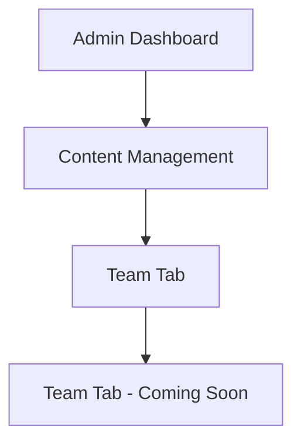
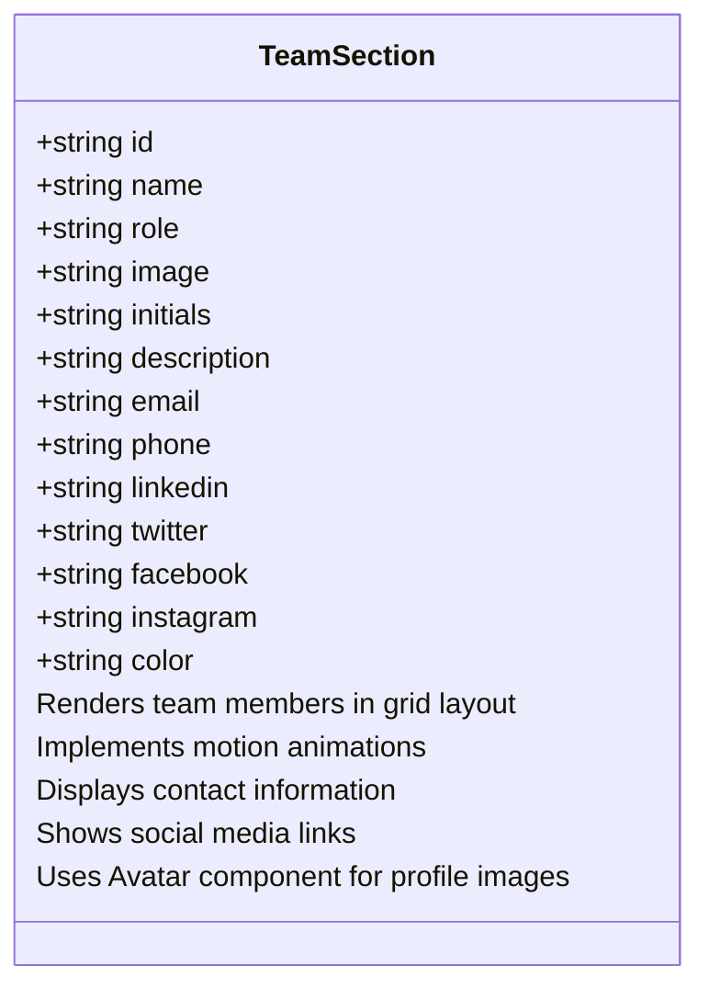
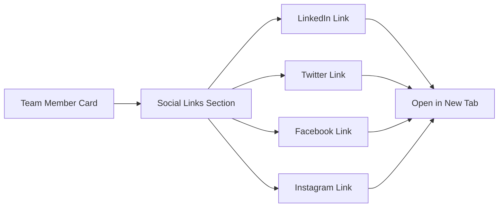

# Team Management

<cite>
**Referenced Files in This Document**   
- [team-section.tsx](file://src/components/landing/team-section.tsx)
- [team-tab.tsx](file://src/components/admin/content-tabs/team-tab.tsx)
- [migration.sql](file://prisma/migrations/20251101125707_init/migration.sql)
- [site-settings-tab.tsx](file://src/components/admin/content-tabs/site-settings-tab.tsx)
</cite>

## Table of Contents
1. [Introduction](#introduction)
2. [Team Data Structure](#team-data-structure)
3. [Team Management Interface](#team-management-interface)
4. [Team Section Implementation](#team-section-implementation)
5. [Image Upload Requirements](#image-upload-requirements)
6. [Social Media Integration](#social-media-integration)
7. [Common Issues and Troubleshooting](#common-issues-and-troubleshooting)
8. [Professional Presentation Guidelines](#professional-presentation-guidelines)

## Introduction
The Team Management sub-feature enables administrators to manage team member profiles and present them professionally on the public website. This documentation covers the data structure, management interface, implementation details, and best practices for maintaining an effective team presentation that builds client confidence.

## Team Data Structure
The team member data is structured in the database with comprehensive fields for professional representation. The TeamMember table contains essential information for each team member.

```mermaid
erDiagram
TEAMMEMBER {
varchar id PK
varchar name NOT NULL
varchar position NOT NULL
text bio NULL
longtext avatar NULL
varchar email NULL
varchar phone NULL
varchar linkedinUrl NULL
boolean isActive NOT NULL DEFAULT true
integer order NOT NULL DEFAULT 0
datetime createdAt NOT NULL DEFAULT CURRENT_TIMESTAMP
datetime updatedAt NOT NULL
}
```

**Diagram sources**
- [migration.sql](file://prisma/migrations/20251101125707_init/migration.sql#L287-L330)

**Section sources**
- [migration.sql](file://prisma/migrations/20251101125707_init/migration.sql#L287-L330)

## Team Management Interface
The team management interface is currently marked as "Coming Soon" in the admin panel. The interface is designed to be part of the content management section, accessible through the admin dashboard.



The interface will eventually allow administrators to add, edit, and reorder team members. The current implementation suggests that the team management functionality is planned but not yet implemented in the admin interface.

**Section sources**
- [team-tab.tsx](file://src/components/admin/content-tabs/team-tab.tsx#L0-L0)

## Team Section Implementation
The public-facing team section is implemented as a React component that displays team members in a responsive grid layout. The component uses motion effects for enhanced user experience.



The team section displays members with their name, role, description, contact information, and social media links. Each team member card includes hover effects and responsive design for various screen sizes.

**Diagram sources**
- [team-section.tsx](file://src/components/landing/team-section.tsx#L1-L245)

**Section sources**
- [team-section.tsx](file://src/components/landing/team-section.tsx#L1-L245)

## Image Upload Requirements
Based on the existing profile image upload functionality in the system, image requirements are standardized across the application. These requirements will likely apply to team member profile images when the management interface is implemented.

**Image Validation Rules**
- File type: Must be an image format (starts with 'image/')
- Maximum file size: 2MB (2 * 1024 * 1024 bytes)
- Format: Any standard web image format (JPEG, PNG, GIF, WebP)
- Storage: Base64 encoded string stored in database
- Preview: Client-side preview before saving

The system converts uploaded images to base64 format for storage in the database, which is consistent with the LONGTEXT field type used for avatar storage in the TeamMember table.

**Section sources**
- [profile.tsx](file://src/app/client/profile/page.tsx#L59-L111)
- [profile.tsx](file://src/app/admin/profile/page.tsx#L74-L120)
- [site-settings-tab.tsx](file://src/components/admin/content-tabs/site-settings-tab.tsx#L73-L114)

## Social Media Integration
The team section supports integration with multiple social platforms. The current implementation includes icons and links for major professional and social networks.

**Supported Social Platforms**
- LinkedIn: Professional networking
- Twitter: Microblogging and news
- Facebook: Social networking
- Instagram: Visual content sharing

The system uses dedicated icon components from the lucide-react library for each social platform. Links open in new tabs with proper security attributes (target="_blank" rel="noopener noreferrer").



**Diagram sources**
- [team-section.tsx](file://src/components/landing/team-section.tsx#L147-L176)

**Section sources**
- [team-section.tsx](file://src/components/landing/team-section.tsx#L147-L176)

## Common Issues and Troubleshooting
Several common issues may arise when managing team member information. This section addresses potential problems and their solutions.

**Broken Social Links**
- **Issue**: Social media links may be broken if URLs are incorrectly formatted
- **Solution**: Ensure URLs include the full address (https://www.linkedin.com/in/username)
- **Prevention**: Implement URL validation in the management interface

**Inconsistent Team Information**
- **Issue**: Inconsistent formatting of names, titles, or bios
- **Solution**: Establish and follow a style guide for team member information
- **Prevention**: Implement input validation and formatting guidelines in the management interface

**Image Display Problems**
- **Issue**: Profile images may not display properly
- **Solution**: Verify image URLs are correct and images are accessible
- **Prevention**: Implement image validation and fallback mechanisms

**Data Synchronization Issues**
- **Issue**: Team member information may become outdated
- **Solution**: Establish a regular review process for team information
- **Prevention**: Implement notification system for profile updates

## Professional Presentation Guidelines
Presenting the team professionally is crucial for building client confidence and showcasing expertise.

**Best Practices for Team Presentation**
- Use high-quality, professional photographs
- Ensure consistent formatting of names and titles
- Highlight relevant expertise and experience
- Keep bios concise and focused on professional qualifications
- Maintain up-to-date contact information
- Regularly review and update team member information

**Expertise Highlighting**
- Emphasize years of experience and specialized knowledge
- Include relevant certifications and qualifications
- Showcase industry-specific expertise
- Highlight successful projects or case studies

**Client Confidence Building**
- Present team members as approachable and knowledgeable
- Include direct contact options for team members
- Showcase team diversity and complementary skills
- Update team information regularly to show an active, growing organization

The team section should be designed to instill confidence in potential clients by demonstrating the depth of expertise and professionalism within the organization.