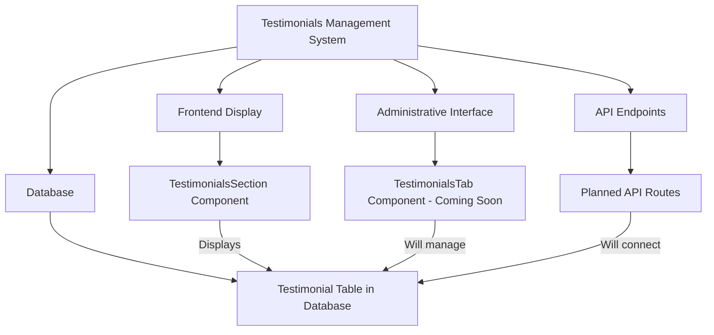
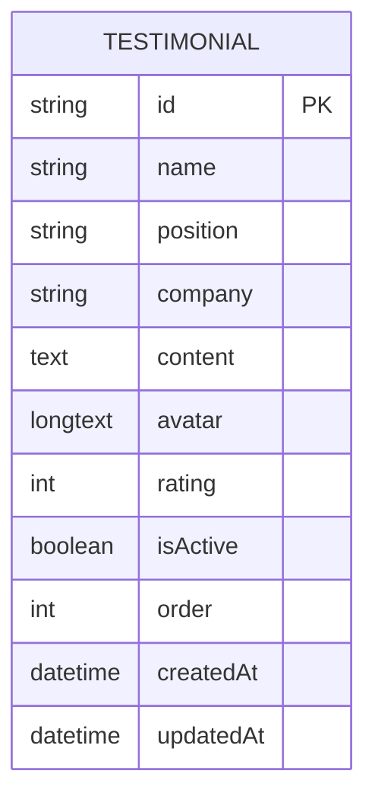
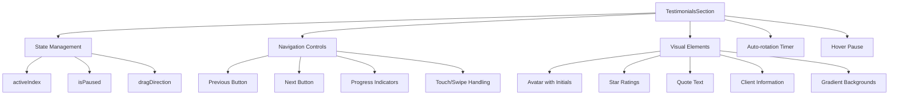
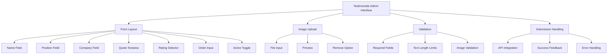
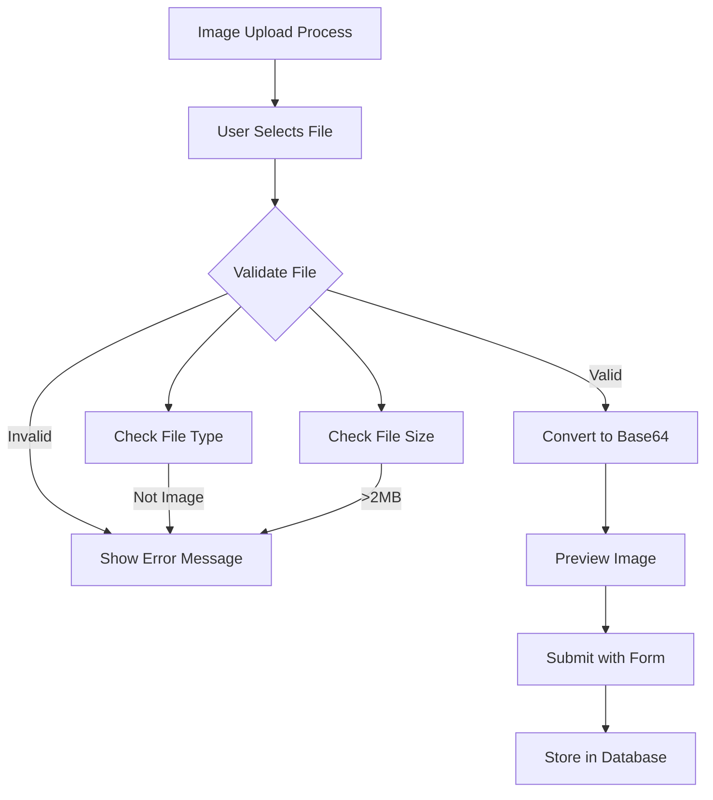
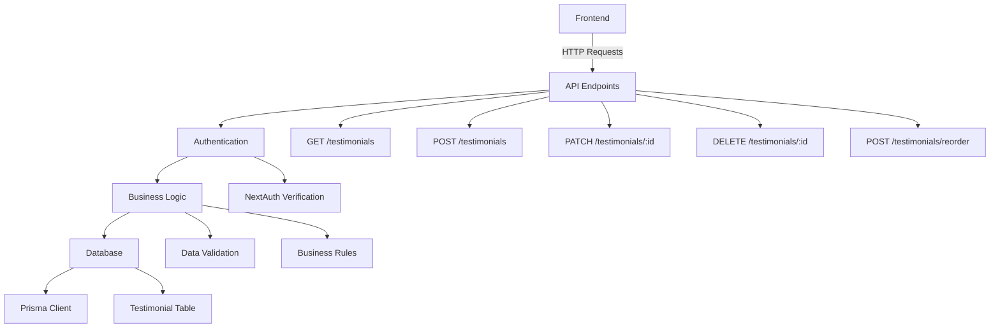

# Testimonials Management

<cite>
**Referenced Files in This Document**   
- [testimonials-section.tsx](file://src/components/landing/testimonials-section.tsx)
- [testimonials-tab.tsx](file://src/components/admin/content-tabs/testimonials-tab.tsx)
- [prisma/migrations/20251101125707_init/migration.sql](file://prisma/migrations/20251101125707_init/migration.sql)
- [institutions-tab.tsx](file://src/components/admin/content-tabs/institutions-tab.tsx)
- [site-settings-tab.tsx](file://src/components/admin/content-tabs/site-settings-tab.tsx)
- [content-api-structure](file://src/app/api/content)
</cite>

## Table of Contents
1. [Introduction](#introduction)
2. [Current Implementation Status](#current-implementation-status)
3. [Testimonials Data Structure](#testimonials-data-structure)
4. [Public Display Implementation](#public-display-implementation)
5. [Planned Administrative Interface](#planned-administrative-interface)
6. [Image Upload and Validation](#image-upload-and-validation)
7. [API Architecture and Endpoints](#api-architecture-and-endpoints)
8. [Best Practices for Testimonial Management](#best-practices-for-testimonial-management)
9. [Common Issues and Troubleshooting](#common-issues-and-troubleshooting)
10. [Future Development Recommendations](#future-development-recommendations)

## Introduction

The Testimonials management functionality is designed to showcase client feedback on the public website through an engaging carousel interface. This system allows administrators to manage client testimonials including client name, position, company, quote, and avatar image. The testimonials are displayed on the public website via the TestimonialsSection component, which presents them in an interactive carousel format. Although the display component is fully implemented, the administrative interface for managing testimonials is currently in development.

**Section sources**
- [testimonials-section.tsx](file://src/components/landing/testimonials-section.tsx#L1-L259)
- [testimonials-tab.tsx](file://src/components/admin/content-tabs/testimonials-tab.tsx#L1-L1)

## Current Implementation Status

The testimonials functionality currently has a complete frontend display component but lacks a fully implemented administrative interface. The TestimonialsSection component is fully operational and displays hardcoded testimonials in a responsive carousel format. However, the administrative interface for adding, editing, and managing testimonials is marked as "Coming Soon" in the codebase, indicating it is not yet implemented.

The system follows the same architectural pattern as other content management features in the application, such as institutions, about section, and site settings, which have complete CRUD (Create, Read, Update, Delete) functionality through API endpoints. The database schema for testimonials is already defined, suggesting that the backend infrastructure is prepared for testimonial management.

**Diagram sources**
- [testimonials-section.tsx](file://src/components/landing/testimonials-section.tsx#L1-L259)
- [testimonials-tab.tsx](file://src/components/admin/content-tabs/testimonials-tab.tsx#L1-L1)
- [migration.sql](file://prisma/migrations/20251101125707_init/migration.sql#L243-L285)

## Testimonials Data Structure

The testimonials data structure is defined in the database schema with comprehensive fields to capture client feedback information. Each testimonial record includes essential information such as client name, position, company, content (quote), avatar image, rating, and display status.

The database schema defines the following fields for testimonials:
- `id`: Unique identifier for each testimonial
- `name`: Client's full name
- `position`: Client's job title or position
- `company`: Client's company name
- `content`: The testimonial quote text
- `avatar`: Base64 encoded image data or image URL
- `rating`: Numerical rating (1-5 stars)
- `isActive`: Boolean flag to control visibility
- `order`: Integer for sorting testimonials
- `createdAt` and `updatedAt`: Timestamps for record management

**Diagram sources**
- [migration.sql](file://prisma/migrations/20251101125707_init/migration.sql#L243-L285)

**Section sources**
- [migration.sql](file://prisma/migrations/20251101125707_init/migration.sql#L243-L285)

## Public Display Implementation

The TestimonialsSection component implements a fully functional carousel interface for displaying client testimonials on the public website. The component uses Framer Motion for smooth animations and provides multiple interaction methods for navigating through testimonials.

Key features of the display implementation include:
- Automatic sliding with a 5-second interval
- Manual navigation via left and right arrow buttons
- Progress indicators for direct slide selection
- Touch/swipe support for mobile devices
- Hover pause functionality
- Responsive design that adapts to different screen sizes

The component displays testimonials with client avatars (using fallback initials when images are not available), star ratings, testimonial text, and client information including name, position, and company. The visual design uses gradient backgrounds and subtle animations to create an engaging user experience.

**Diagram sources**
- [testimonials-section.tsx](file://src/components/landing/testimonials-section.tsx#L1-L259)

**Section sources**
- [testimonials-section.tsx](file://src/components/landing/testimonials-section.tsx#L1-L259)

## Planned Administrative Interface

Although the TestimonialsTab component is currently marked as "Coming Soon," it is expected to follow the same pattern as other content management tabs in the application. Based on the implementation of similar features like institutions and site settings, the administrative interface will likely include:

- A form interface for adding and editing testimonials
- Fields for client name, position, company, quote, and rating
- Image upload functionality for avatar images
- Controls for setting testimonial order and visibility
- Validation rules for form submission
- Integration with the testimonials API endpoint

The interface will be accessible through the content management section of the admin dashboard, alongside other content management features. It will provide administrators with the ability to curate and manage the testimonials displayed on the public website.

**Section sources**
- [testimonials-tab.tsx](file://src/components/admin/content-tabs/testimonials-tab.tsx#L1-L1)
- [institutions-tab.tsx](file://src/components/admin/content-tabs/institutions-tab.tsx#L47-L85)

## Image Upload and Validation

Based on the implementation patterns observed in other parts of the application, the image upload functionality for testimonials will likely follow the same approach used in profile and site settings management. The system will implement client-side validation for image uploads with the following rules:

- **File Type**: Only image files (JPEG, PNG, GIF, WebP) will be accepted
- **File Size**: Maximum size of 2MB per image
- **Image Dimensions**: Responsive design that adapts to different screen sizes
- **Preview**: Immediate preview of uploaded images before submission
- **Storage**: Images will be stored as base64 encoded data in the database

The upload process will use the FileReader API to convert uploaded images to base64 format, allowing for immediate preview and storage in the database without requiring a separate file storage system. Error handling will provide clear feedback for invalid file types or sizes.

**Section sources**
- [site-settings-tab.tsx](file://src/components/admin/content-tabs/site-settings-tab.tsx#L73-L114)
- [profile/page.tsx](file://src/app/client/profile/page.tsx#L59-L111)

## API Architecture and Endpoints

The testimonials management system will follow the same API architecture pattern as other content management features in the application. Based on the existing API structure, the testimonials endpoints will likely be organized under `/api/content/testimonials` with standard CRUD operations.

Expected API endpoints include:
- `GET /api/content/testimonials` - Retrieve all testimonials
- `POST /api/content/testimonials` - Create a new testimonial
- `PATCH /api/content/testimonials/:id` - Update an existing testimonial
- `DELETE /api/content/testimonials/:id` - Remove a testimonial
- `POST /api/content/testimonials/reorder` - Update the order of testimonials

The API will use Prisma as the database client and follow RESTful principles with JSON responses. Authentication will be handled through the existing NextAuth system, ensuring only authorized administrators can modify testimonials.

**Section sources**
- [content-api-structure](file://src/app/api/content)
- [site-settings/route.ts](file://src/app/api/content/site-settings/route.ts#L1-L117)

## Best Practices for Testimonial Management

To ensure the testimonials effectively build trust with potential clients, administrators should follow these best practices:

1. **Authenticity**: Only use genuine testimonials from real clients with their permission
2. **Diversity**: Include testimonials from different industries, company sizes, and service areas
3. **Specificity**: Prioritize testimonials that mention specific services, results, or experiences
4. **Visual Quality**: Use high-quality images that present clients professionally
5. **Relevance**: Feature testimonials that address common concerns of potential clients
6. **Currency**: Regularly update testimonials to reflect current client experiences
7. **Balance**: Include both short and detailed testimonials to cater to different attention spans

When selecting testimonials, focus on those that highlight the firm's expertise, responsiveness, and the tangible benefits clients have received. Testimonials that mention specific challenges overcome or measurable results achieved are particularly effective in building credibility.

**Section sources**
- [testimonials-section.tsx](file://src/components/landing/testimonials-section.tsx#L1-L259)

## Common Issues and Troubleshooting

Administrators may encounter several common issues when managing testimonials. Understanding these potential problems and their solutions will help maintain a smooth content management process:

1. **Image Upload Failures**: Ensure images are under 2MB and in supported formats (JPEG, PNG, GIF, WebP). Users should receive clear error messages if their images don't meet requirements.

2. **Content Moderation**: Implement a review process for new testimonials to ensure they don't contain inappropriate content, false claims, or confidential information.

3. **Display Issues**: Testimonials with very long text may affect the carousel layout. Consider implementing character limits or responsive text truncation.

4. **Performance Concerns**: With many testimonials and large image files, page load times may increase. Consider implementing lazy loading for images and pagination for the admin interface.

5. **Data Consistency**: Ensure all required fields are filled and maintain consistent formatting for client information.

6. **Mobile Responsiveness**: Verify that the carousel displays correctly on all device sizes, with touch navigation working smoothly.

**Section sources**
- [testimonials-section.tsx](file://src/components/landing/testimonials-section.tsx#L1-L259)
- [site-settings-tab.tsx](file://src/components/admin/content-tabs/site-settings-tab.tsx#L73-L114)

## Future Development Recommendations

To complete the testimonials management functionality, the following development steps are recommended:

1. **Implement Admin Interface**: Develop the TestimonialsTab component with a form for adding and editing testimonials, following the pattern of other content management tabs.

2. **Create API Endpoints**: Implement the full set of CRUD endpoints for testimonials under `/api/content/testimonials`.

3. **Connect Frontend to API**: Modify the TestimonialsSection component to fetch testimonials from the API rather than using hardcoded data.

4. **Add Reordering Functionality**: Implement drag-and-drop or numerical ordering for testimonials, similar to the hero section and institutions management.

5. **Enhance Validation**: Implement comprehensive validation for form submissions, including server-side validation.

6. **Add Search and Filtering**: In the admin interface, include search and filtering options for managing a large number of testimonials.

7. **Implement Moderation Workflow**: Create a system for reviewing and approving testimonials before they go live on the website.

8. **Optimize Performance**: Implement lazy loading for images and consider pagination for the admin interface when managing many testimonials.

Completing these development tasks will create a comprehensive testimonials management system that enhances the website's credibility and provides administrators with an intuitive interface for curating client feedback.

**Section sources**
- [testimonials-tab.tsx](file://src/components/admin/content-tabs/testimonials-tab.tsx#L1-L1)
- [testimonials-section.tsx](file://src/components/landing/testimonials-section.tsx#L1-L259)
- [content-api-structure](file://src/app/api/content)