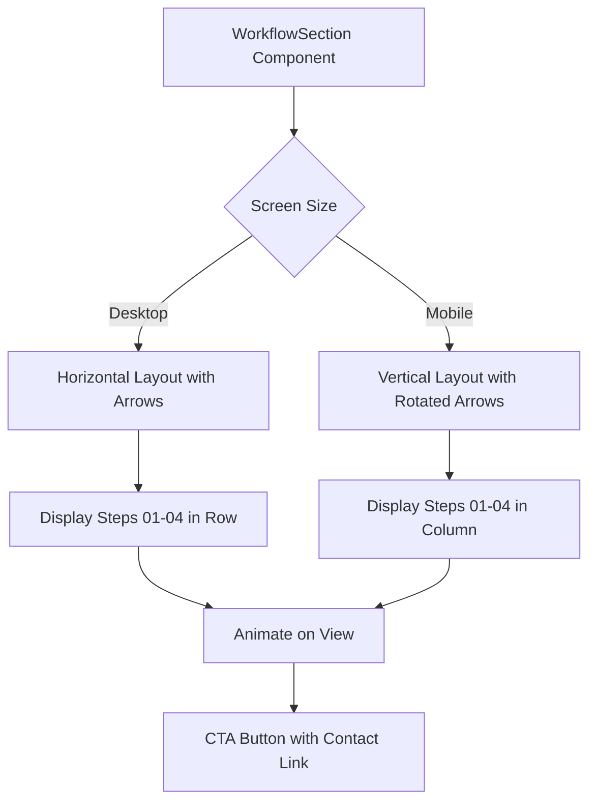
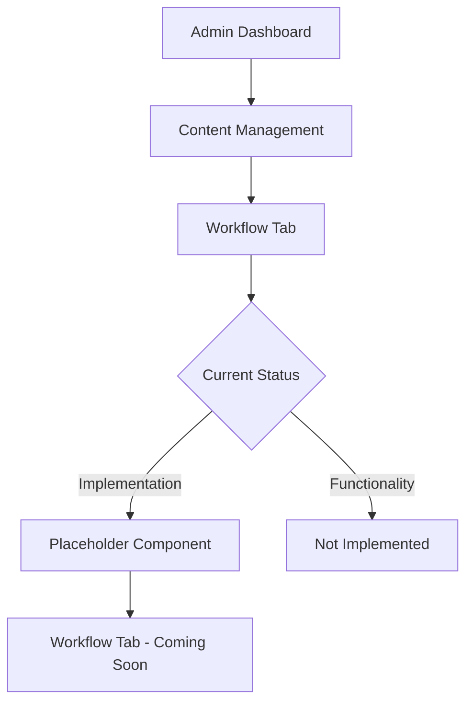

# Workflow Management

<cite>
**Referenced Files in This Document**   
- [workflow-section.tsx](file://src/components/landing/workflow-section.tsx)
- [workflow-tab.tsx](file://src/components/admin/content-tabs/workflow-tab.tsx)
- [migration.sql](file://prisma/migrations/20251101125707_init/migration.sql)
- [content/page.tsx](file://src/app/admin/content/page.tsx)
</cite>

## Table of Contents
1. [Introduction](#introduction)
2. [Data Structure](#data-structure)
3. [Workflow Rendering](#workflow-rendering)
4. [Admin Interface Status](#admin-interface-status)
5. [Implementation Roadmap](#implementation-roadmap)
6. [Best Practices](#best-practices)

## Introduction
The Workflow Management system is designed to visually represent the consulting process stages on the public landing page. Currently, the workflow display is implemented as a static component with predefined steps that illustrate the service delivery process. The system includes a database schema for workflow steps, but the admin interface for managing these steps is not yet implemented. This documentation outlines the current implementation, data structure, and future development requirements for the workflow management functionality.

## Data Structure
The workflow steps are stored in a dedicated database table with structured fields to support flexible presentation and ordering.

```mermaid
erDiagram
WORKFLOW_STEP {
id VARCHAR(191) PK
icon VARCHAR(191)
title VARCHAR(191) NOT NULL
description TEXT NOT NULL
order INTEGER NOT NULL DEFAULT 0
createdAt DATETIME(3) NOT NULL
updatedAt DATETIME(3) NOT NULL
}
```

**Diagram sources**
- [migration.sql](file://prisma/migrations/20251101125707_init/migration.sql#L202-L244)

**Section sources**
- [migration.sql](file://prisma/migrations/20251101125707_init/migration.sql#L202-L244)

The `WorkflowStep` table contains the following fields:
- `id`: Unique identifier for each workflow step
- `icon`: Reference to the icon used in the visualization
- `title`: Step title displayed to users
- `description`: Detailed explanation of the step
- `order`: Integer value determining the sequence of steps
- `createdAt` and `updatedAt`: Timestamps for record management

## Workflow Rendering
The workflow is rendered on the public landing page as a step-by-step visualization that adapts to different screen sizes.



**Diagram sources**
- [workflow-section.tsx](file://src/components/landing/workflow-section.tsx#L0-L186)

**Section sources**
- [workflow-section.tsx](file://src/components/landing/workflow-section.tsx#L0-L186)

The `WorkflowSection` component implements responsive design patterns:
- On desktop: Horizontal layout with right-facing arrows connecting steps
- On mobile: Vertical layout with down-facing arrows (rotated 90 degrees)
- Each step displays a number, icon, title, and description
- Motion animations trigger when steps enter the viewport
- Color gradients are applied to step cards for visual distinction
- Bottom CTA (Call to Action) encourages user contact

The current implementation uses hardcoded data with four consulting process stages:
1. Initial Consultation ("İlk Görüşme")
2. Analysis and Planning ("Analiz ve Planlama")
3. Implementation ("Uygulama")
4. Monitoring and Reporting ("Takip ve Raporlama")

## Admin Interface Status
The administrative interface for managing workflow steps exists as a placeholder without functional implementation.



**Diagram sources**
- [workflow-tab.tsx](file://src/components/admin/content-tabs/workflow-tab.tsx#L0-L0)
- [content/page.tsx](file://src/app/admin/content/page.tsx#L0-L133)

**Section sources**
- [workflow-tab.tsx](file://src/components/admin/content-tabs/workflow-tab.tsx#L0-L0)
- [content/page.tsx](file://src/app/admin/content/page.tsx#L0-L133)

The admin interface shows:
- A navigation tab for workflow management within the content management section
- A placeholder component that displays "Workflow Tab - Coming Soon"
- No form elements for creating, editing, or reordering workflow steps
- No API integration for CRUD operations on workflow data

## Implementation Roadmap
To complete the workflow management functionality, several components require development:

### Missing Features
1. **Admin Editor Interface**: Form-based editor for workflow steps with fields for title, description, icon selection, and order
2. **API Endpoints**: RESTful endpoints for workflow step management (GET, POST, PUT, DELETE)
3. **Database Integration**: Connection between the frontend component and Prisma client
4. **Form Validation**: Input validation and error handling for admin interface
5. **Reordering Functionality**: Drag-and-drop or numerical ordering system

### Development Priorities
1. Create API routes for workflow step management in the `/api/content` directory
2. Implement the `WorkflowTab` component with form controls and data binding
3. Connect the frontend to the backend using the existing Prisma client
4. Add form validation and submission handling
5. Implement real-time preview of workflow changes

## Best Practices
When implementing and using the workflow management system, consider the following best practices:

### For Implementation
- Maintain consistency between workflow steps and actual business processes
- Use clear, action-oriented titles for each step
- Ensure descriptions provide meaningful information about what occurs in each stage
- Select icons that are easily recognizable and relevant to the step content
- Keep the number of steps manageable (4-6 is optimal for user comprehension)

### For User Experience
- Ensure mobile responsiveness is maintained during implementation
- Use consistent color schemes that align with brand guidelines
- Implement smooth animations that enhance rather than distract
- Provide clear visual hierarchy between step numbers, icons, titles, and descriptions
- Include a strong call-to-action that guides users to the next step

### For Content Management
- Regularly review and update workflow steps to reflect current processes
- Test all changes in a staging environment before production deployment
- Consider user feedback when modifying the workflow presentation
- Ensure all text is proofread and free of errors before publication
- Maintain accessibility standards for all users

### Common Issues and Solutions
- **Incomplete workflow definitions**: Implement required field validation in the admin interface
- **Inconsistent step ordering**: Use explicit order fields with validation to prevent gaps or duplicates
- **Poor mobile display**: Test responsive behavior across device sizes
- **Slow loading**: Implement lazy loading for workflow components if performance becomes an issue
- **Data inconsistency**: Use database constraints and application-level validation to maintain data integrity