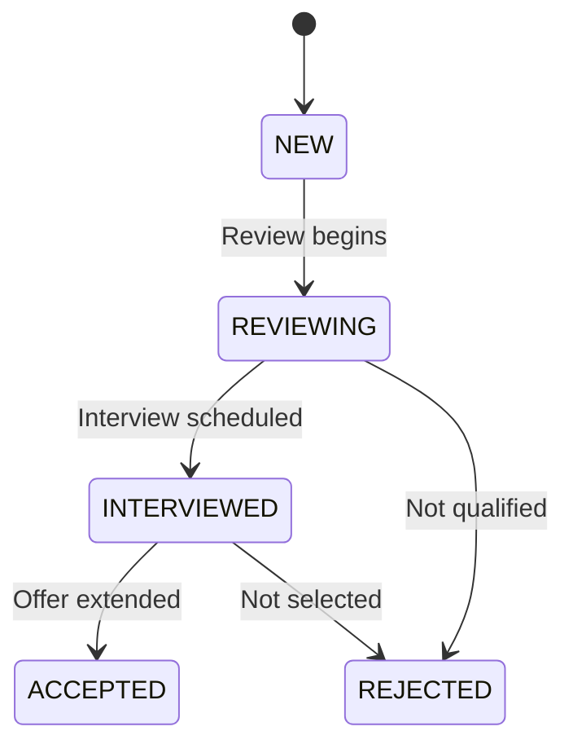
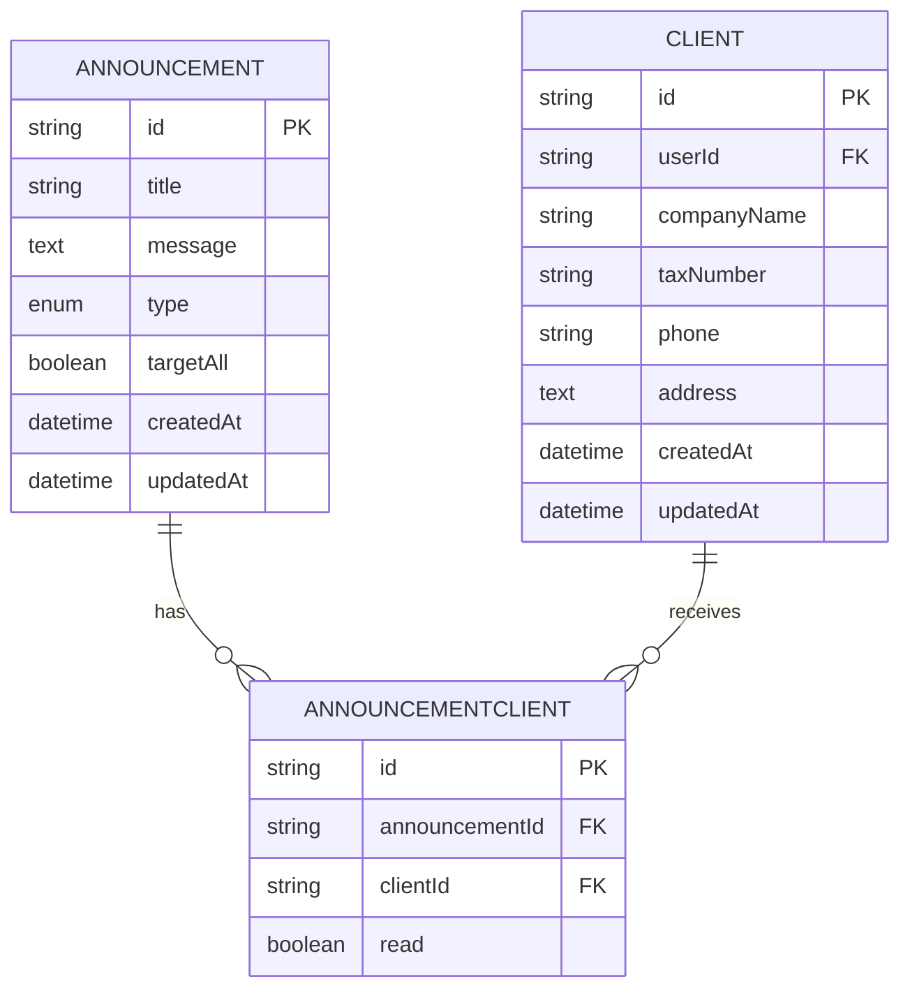
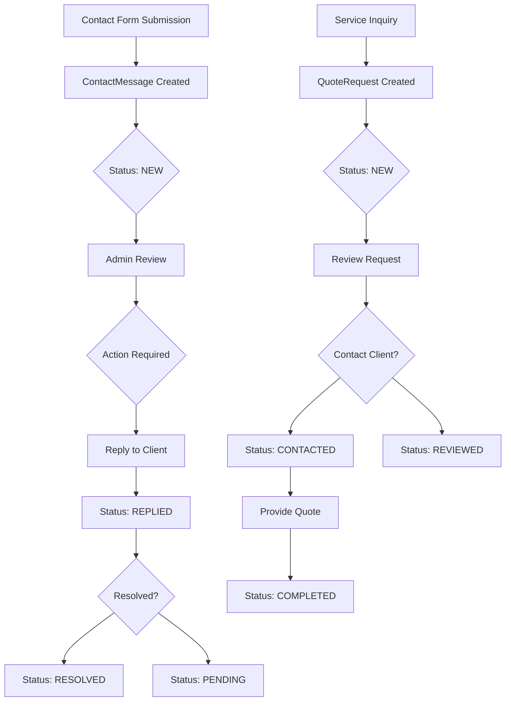
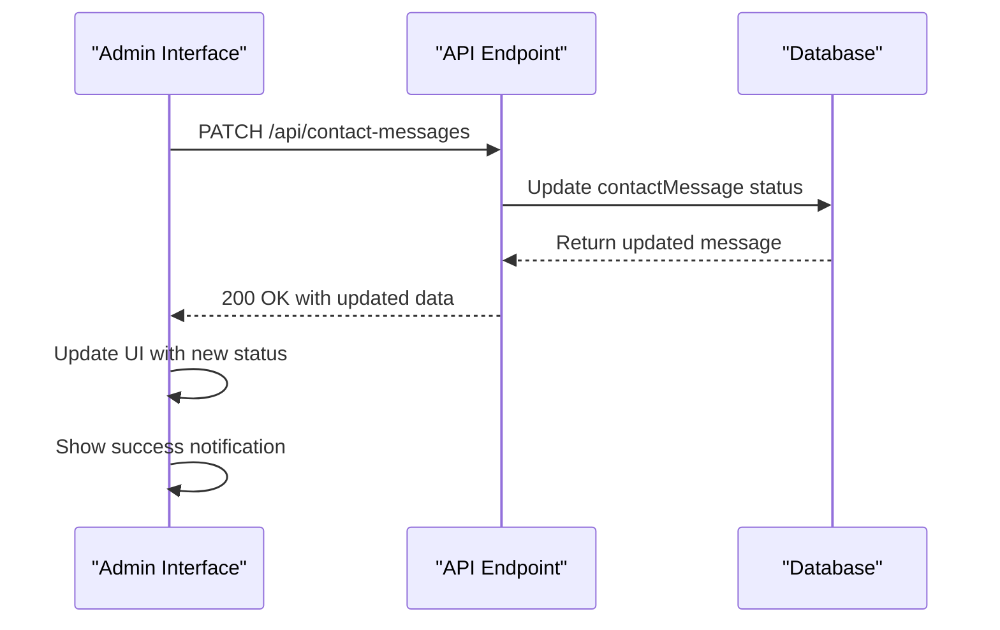

# Communication Models

<cite>
**Referenced Files in This Document**   
- [migration.sql](file://prisma/migrations/20251101125707_init/migration.sql)
- [seed.ts](file://prisma/seed.ts)
- [contact-messages/route.ts](file://src/app/api/contact-messages/route.ts)
- [job-applications/route.ts](file://src/app/api/job-applications/route.ts)
- [quote-requests/route.ts](file://src/app/api/quote-requests/route.ts)
- [contact-messages/page.tsx](file://src/app/admin/contact-messages/page.tsx)
- [pdf-export.ts](file://src/lib/pdf-export.ts)
</cite>

## Table of Contents
1. [Introduction](#introduction)
2. [Core Communication Models](#core-communication-models)
3. [Status Enumerations and Lifecycle Tracking](#status-enumerations-and-lifecycle-tracking)
4. [Client-Admin Communication System](#client-admin-communication-system)
5. [Announcement System](#announcement-system)
6. [Lead Generation and Customer Intake Mechanisms](#lead-generation-and-customer-intake-mechanisms)
7. [File Handling in Job Applications](#file-handling-in-job-applications)
8. [Data Validation and Compliance](#data-validation-and-compliance)
9. [Notification Workflows](#notification-workflows)
10. [Conclusion](#conclusion)

## Introduction
The smmm-system implements a comprehensive communication framework designed to facilitate interactions between clients and administrators. This documentation details the core messaging models including Message, Announcement, AnnouncementClient, ContactMessage, JobApplication, and QuoteRequest. These models serve as the foundation for client-admin communication, announcement broadcasting, and lead generation processes. The system supports various communication channels and maintains detailed lifecycle tracking through status enumerations. Special attention is given to data integrity, personal data compliance, and efficient file handling, particularly for job application documents stored as Base64 encoded data.

## Core Communication Models

### Message Model
The Message model facilitates direct communication between users and administrators. It establishes a one-to-many relationship with the User model through the userId foreign key, enabling administrators to manage messages from multiple clients. Each message contains a subject, message content, read status, and timestamps for creation and updates. The model is designed for private, two-way communication within the system.

### Announcement Model
The Announcement model supports broadcast messaging to clients. It includes fields for title, message content, type (INFO, WARNING, REMINDER, URGENT), and a targetAll boolean flag that determines whether the announcement should be sent to all clients or specific ones. The model includes timestamps for creation and updates, allowing administrators to track when announcements were published.

### ContactMessage Model
The ContactMessage model captures inquiries from website visitors and clients. It stores personal information including name, email, phone, subject, and message content. The model includes a status field that tracks the message lifecycle from initial submission to resolution. This model serves as a primary lead generation mechanism, capturing potential client inquiries for follow-up by the administrative team.

### JobApplication Model
The JobApplication model manages recruitment processes, storing applicant information such as name, contact details, position applied for, experience, education, and cover letter. It includes specialized fields for CV handling: cvFileName, cvFileData (Base64 encoded), and cvMimeType for proper file type identification. The model tracks application status throughout the hiring process.

### QuoteRequest Model
The QuoteRequest model handles service quotation requests from potential clients. It captures requester information, company details, service type, and message content. This model serves as a customer intake mechanism for service offerings, allowing the business to respond to specific service inquiries with appropriate quotes and proposals.

**Section sources**
- [migration.sql](file://prisma/migrations/20251101125707_init/migration.sql#L432-L448)
- [migration.sql](file://prisma/migrations/20251101125707_init/migration.sql#L82-L120)
- [migration.sql](file://prisma/migrations/20251101125707_init/migration.sql#L399-L430)

## Status Enumerations and Lifecycle Tracking

### JobApplicationStatus Enumeration
The JobApplicationStatus enumeration defines the lifecycle stages of job applications with five distinct states:
- NEW: Initial state when a new application is received
- REVIEWING: Application is being evaluated by the hiring team
- INTERVIEWED: Candidate has completed an interview
- ACCEPTED: Application has been approved
- REJECTED: Application has been declined

This enumeration enables systematic tracking of recruitment progress and facilitates workflow management.

**Diagram sources**
- [migration.sql](file://prisma/migrations/20251101125707_init/migration.sql#L363-L400)
- [job-applications/route.ts](file://src/app/api/job-applications/route.ts#L3)

## Announcement System

### Broadcast and Targeted Announcements
The announcement system implements a flexible notification framework through the Announcement and AnnouncementClient models. The targetAll boolean field in the Announcement model determines the distribution scope. When targetAll is true, the announcement is intended for all clients; when false, it's directed to specific clients through the AnnouncementClient join table.

### AnnouncementClient Join Table
The AnnouncementClient table serves as a many-to-many relationship resolver between announcements and clients, with the following structure:
- id: Unique identifier
- announcementId: Foreign key to Announcement
- clientId: Foreign key to Client
- read: Boolean flag indicating whether the client has viewed the announcement

This design enables precise tracking of announcement delivery and reading status for individual clients, supporting both broadcast and targeted communication strategies.

**Diagram sources**
- [migration.sql](file://prisma/migrations/20251101125707_init/migration.sql#L82-L120)
- [migration.sql](file://prisma/migrations/20251101125707_init/migration.sql#L42-L80)

## Lead Generation and Customer Intake Mechanisms

### ContactMessage as Lead Generator
The ContactMessage model serves as a primary lead generation channel, capturing inquiries from the website's contact form. Each submission includes essential contact information and message content, allowing the administrative team to respond promptly. The status field (NEW, PENDING, REPLIED, RESOLVED) enables systematic tracking of inquiry resolution, ensuring no potential client is overlooked.

### QuoteRequest for Service Intake
The QuoteRequest model functions as a customer intake mechanism for service offerings. It captures detailed information about potential clients' service needs, including:
- Requester contact information
- Company details
- Specific service type requested
- Additional message content

The status enumeration (NEW, PENDING, REVIEWED, CONTACTED, COMPLETED) tracks the progression from initial request to service completion, facilitating efficient workflow management.

### JobApplication for Recruitment
The JobApplication model serves as a recruitment intake system, collecting comprehensive applicant information. It enables the organization to manage the hiring process systematically, from initial application to final decision.

**Diagram sources**
- [contact-messages/route.ts](file://src/app/api/contact-messages/route.ts)
- [quote-requests/route.ts](file://src/app/api/quote-requests/route.ts)
- [job-applications/route.ts](file://src/app/api/job-applications/route.ts)

## File Handling in Job Applications

### Base64 Encoding Implementation
The JobApplication model implements file handling through Base64 encoding of CV documents. When a job application is submitted via the API endpoint, the CV file is processed as follows:
1. The file is received as a FormData object
2. The file data is converted to an ArrayBuffer
3. The ArrayBuffer is converted to a Buffer
4. The Buffer is encoded as a Base64 string
5. The Base64 string is stored in the cvFileData field

This approach allows binary file data to be stored directly in the database while maintaining compatibility with JSON-based APIs.

### MIME Type Tracking
The system tracks the original MIME type of uploaded CV files through the cvMimeType field. This information is crucial for:
- Proper file type identification
- Security validation
- Appropriate file handling when retrieving or downloading
- Compliance with file type restrictions

The MIME type is extracted from the original File object during the upload process, ensuring accurate representation of the file format.

**Section sources**
- [job-applications/route.ts](file://src/app/api/job-applications/route.ts#L20-L65)

## Data Validation and Compliance

### Input Validation Rules
The system implements comprehensive data validation to ensure message integrity:
- Required field validation for all contact forms
- Email format validation
- Phone number format validation
- Content length restrictions
- Special character filtering

These validation rules are enforced at both the API and UI levels, preventing incomplete or malformed data from being stored in the database.

### Personal Data Compliance
The system addresses compliance requirements for storing personal data through several mechanisms:
- Secure password storage using bcrypt hashing
- Limited data retention policies
- Access control based on user roles
- Audit trails through createdAt and updatedAt timestamps
- Explicit consent mechanisms for data processing

The Message and ContactMessage models include only essential personal information, minimizing data collection to what is necessary for communication purposes.

**Section sources**
- [contact-messages/route.ts](file://src/app/api/contact-messages/route.ts#L28-L37)
- [job-applications/route.ts](file://src/app/api/job-applications/route.ts#L28-L37)
- [quote-requests/route.ts](file://src/app/api/quote-requests/route.ts#L28-L37)

## Notification Workflows

### Status Transition Workflows
The system implements standardized workflows for status transitions across all communication models. When a status is updated via the PATCH endpoint, the following process occurs:
1. Authentication and authorization check
2. Status validation against allowed values
3. Database update operation
4. Success response with updated record
5. UI notification to confirm the change

This consistent pattern ensures reliable state management across all models.

### Administrative Interface Integration
The admin interface components integrate seamlessly with the backend models, providing:
- Real-time status updates
- Visual status indicators using color-coded badges
- Modal dialogs for detailed message viewing
- Export functionality to PDF format
- Bulk operations and filtering capabilities

The contact-messages/page.tsx component demonstrates this integration, allowing administrators to filter messages by status, search by content, and perform actions like status updates and deletions.

**Diagram sources**
- [contact-messages/route.ts](file://src/app/api/contact-messages/route.ts#L65-L96)
- [contact-messages/page.tsx](file://src/app/admin/contact-messages/page.tsx#L87-L464)

## Conclusion
The communication models in smmm-system provide a robust framework for managing client interactions, announcements, and lead generation. The system's design emphasizes data integrity, compliance, and user experience through well-defined models, status tracking, and intuitive administrative interfaces. By implementing Base64 encoding for file storage and comprehensive validation rules, the system ensures reliable operation while maintaining security and compliance standards. The integration between frontend components and backend APIs creates a seamless workflow for managing communications, making the system effective for both client engagement and administrative oversight.