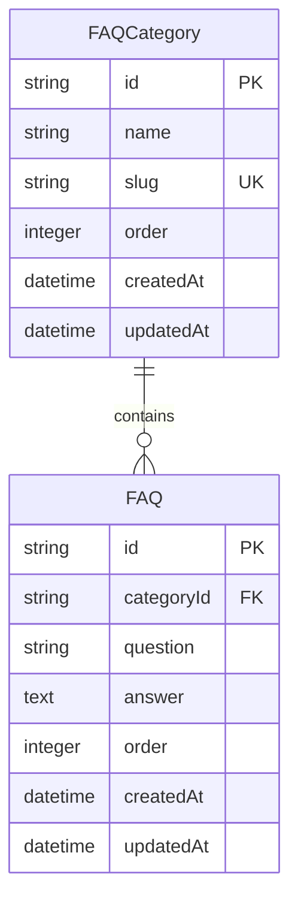
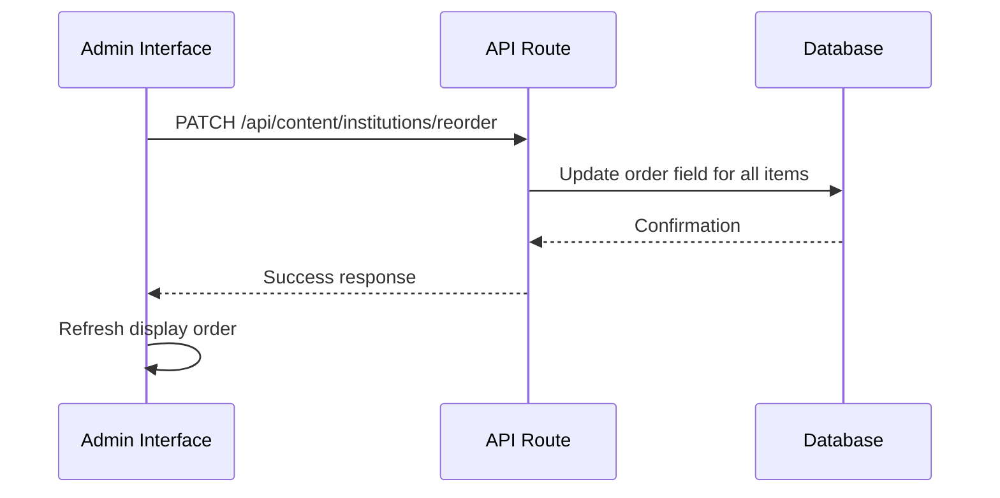
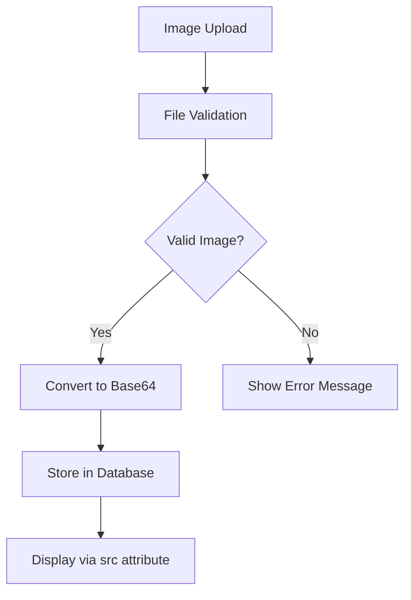

# Content Models

<cite>
**Referenced Files in This Document**   
- [migration.sql](file://prisma/migrations/20251101125707_init/migration.sql)
- [site-settings-tab.tsx](file://src/components/admin/content-tabs/site-settings-tab.tsx)
- [hero-section-tab.tsx](file://src/components/admin/content-tabs/hero-section-tab.tsx)
- [institutions-tab.tsx](file://src/components/admin/content-tabs/institutions-tab.tsx)
- [about-tab.tsx](file://src/components/admin/content-tabs/about-tab.tsx)
- [route.ts](file://src/app/api/content/site-settings/route.ts)
- [route.ts](file://src/app/api/content/hero/route.ts)
- [route.ts](file://src/app/api/content/institutions/route.ts)
- [route.ts](file://src/app/api/content/about/route.ts)
- [hero-section.tsx](file://src/components/landing/hero-section.tsx)
- [institutions-section.tsx](file://src/components/landing/institutions-section.tsx)
- [about-section.tsx](file://src/components/landing/about-section.tsx)
- [services-section.tsx](file://src/components/landing/services-section.tsx)
- [workflow-section.tsx](file://src/components/landing/workflow-section.tsx)
- [pricing-section.tsx](file://src/components/landing/pricing-section.tsx)
- [testimonials-section.tsx](file://src/components/landing/testimonials-section.tsx)
- [team-section.tsx](file://src/components/landing/team-section.tsx)
- [faq-section.tsx](file://src/components/landing/faq-section.tsx)
</cite>

## Table of Contents
1. [Introduction](#introduction)
2. [Core Content Models](#core-content-models)
3. [Hierarchical Relationships](#hierarchical-relationships)
4. [Ordering System](#ordering-system)
5. [Media Handling](#media-handling)
6. [Editorial Workflow](#editorial-workflow)
7. [Data Validation](#data-validation)
8. [Dynamic Content Updates](#dynamic-content-updates)
9. [Conclusion](#conclusion)

## Introduction
The smmm-system implements a comprehensive content management system with multiple models that power the public website. These models enable administrators to manage all aspects of the website's content through an intuitive admin interface without requiring code changes. The system follows a structured approach to content modeling, with clear relationships between entities, consistent ordering mechanisms, and robust media handling capabilities.

**Section sources**
- [migration.sql](file://prisma/migrations/20251101125707_init/migration.sql)

## Core Content Models

### SiteSettings Model
The SiteSettings model stores global configuration for the website, including branding elements and contact information.

**Field Definitions:**
- `siteName` (VARCHAR(191)): Website name with default value "SMMM Ofisi"
- `siteDescription` (TEXT): Meta description for SEO purposes
- `favicon` (LONGTEXT): Base64 encoded favicon image
- `brandIcon` (LONGTEXT): Base64 encoded brand icon
- `phone` (VARCHAR(191)): Contact phone number
- `email` (VARCHAR(191)): Contact email address
- `address` (TEXT): Physical address
- `mapLatitude` (VARCHAR(191)): Latitude for map integration
- `mapLongitude` (VARCHAR(191)): Longitude for map integration
- `mapEmbedUrl` (TEXT): Google Maps embed URL
- `facebookUrl` (VARCHAR(191)): Facebook profile URL
- `twitterUrl` (VARCHAR(191)): Twitter profile URL
- `linkedinUrl` (VARCHAR(191)): LinkedIn profile URL
- `instagramUrl` (VARCHAR(191)): Instagram profile URL
- `youtubeUrl` (VARCHAR(191)): YouTube channel URL

The model includes default values for all social media URLs and site information, ensuring the website has a functional configuration even when not fully customized.

**Section sources**
- [migration.sql](file://prisma/migrations/20251101125707_init/migration.sql#L202-L244)
- [site-settings-tab.tsx](file://src/components/admin/content-tabs/site-settings-tab.tsx)
- [route.ts](file://src/app/api/content/site-settings/route.ts)

### HeroSection Model
The HeroSection model manages the main banner content on the homepage.

**Field Definitions:**
- `title` (VARCHAR(191)): Main headline, required
- `subtitle` (TEXT): Sub-headline, required
- `description` (TEXT): Additional descriptive text
- `buttonText` (VARCHAR(191)): Call-to-action button text
- `buttonUrl` (VARCHAR(191)): URL for the call-to-action button
- `image` (LONGTEXT): Base64 encoded hero image
- `isActive` (BOOLEAN): Visibility flag with default true
- `order` (INTEGER): Display order with default 0

The model supports rich visual content with a prominent image and clear call-to-action, enabling effective user engagement from the homepage.

**Section sources**
- [migration.sql](file://prisma/migrations/20251101125707_init/migration.sql#L245-L270)
- [hero-section-tab.tsx](file://src/components/admin/content-tabs/hero-section-tab.tsx)
- [route.ts](file://src/app/api/content/hero/route.ts)

### ClientLogo Model
The ClientLogo model manages client institution logos displayed on the homepage.

**Field Definitions:**
- `name` (VARCHAR(191)): Institution name, required
- `description` (TEXT): Institution description
- `url` (VARCHAR(191)): Institution website URL
- `logo` (LONGTEXT): Base64 encoded logo image, required
- `isActive` (BOOLEAN): Visibility flag with default true
- `order` (INTEGER): Display order with default 0

This model enables the display of client logos in a carousel format, showcasing the organization's client base and building trust with visitors.

**Section sources**
- [migration.sql](file://prisma/migrations/20251101125707_init/migration.sql#L271-L296)
- [institutions-tab.tsx](file://src/components/admin/content-tabs/institutions-tab.tsx)
- [route.ts](file://src/app/api/content/institutions/route.ts)

### AboutSection Model
The AboutSection model manages the "About Us" content with supporting features.

**Field Definitions:**
- `title` (VARCHAR(191)): Section title, required
- `subtitle` (TEXT): Section subtitle
- `description` (TEXT): Main description text, required
- `image` (LONGTEXT): Base64 encoded section image

The model is linked to the AboutFeature model through a foreign key relationship, allowing for multiple features to be associated with the main about section.

**Section sources**
- [migration.sql](file://prisma/migrations/20251101125707_init/migration.sql#L297-L319)
- [about-tab.tsx](file://src/components/admin/content-tabs/about-tab.tsx)
- [route.ts](file://src/app/api/content/about/route.ts)

### Service Model
The Service model manages service offerings displayed on the website.

**Field Definitions:**
- `icon` (VARCHAR(191)): Icon identifier for the service
- `title` (VARCHAR(191)): Service title, required
- `description` (TEXT): Service description, required
- `features` (TEXT): Additional service features in text format
- `isActive` (BOOLEAN): Visibility flag with default true
- `order` (INTEGER): Display order with default 0

This model enables the presentation of service offerings with consistent formatting and the ability to highlight key features.

**Section sources**
- [migration.sql](file://prisma/migrations/20251101125707_init/migration.sql#L320-L345)

### WorkflowStep Model
The WorkflowStep model manages the steps in the service workflow process.

**Field Definitions:**
- `icon` (VARCHAR(191)): Icon identifier for the step
- `title` (VARCHAR(191)): Step title, required
- `description` (TEXT): Step description, required
- `order` (INTEGER): Display order with default 0

This model enables the visualization of the service delivery process, helping clients understand what to expect.

**Section sources**
- [migration.sql](file://prisma/migrations/20251101125707_init/migration.sql#L346-L371)

### PricingPlan Model
The PricingPlan model manages pricing information for services.

**Field Definitions:**
- `name` (VARCHAR(191)): Plan name, required
- `price` (VARCHAR(191)): Price string, required
- `period` (VARCHAR(191)): Billing period with default "ay" (month)
- `description` (TEXT): Plan description
- `isPopular` (BOOLEAN): Flag to highlight popular plans with default false
- `isActive` (BOOLEAN): Visibility flag with default true
- `order` (INTEGER): Display order with default 0

This model supports flexible pricing presentation with the ability to feature specific plans.

**Section sources**
- [migration.sql](file://prisma/migrations/20251101125707_init/migration.sql#L372-L397)

### Testimonial Model
The Testimonial model manages client testimonials.

**Field Definitions:**
- `name` (VARCHAR(191)): Client name, required
- `position` (VARCHAR(191)): Client position, required
- `company` (VARCHAR(191)): Client company
- `content` (TEXT): Testimonial content, required
- `avatar` (LONGTEXT): Base64 encoded client avatar
- `rating` (INTEGER): Star rating with default 5
- `isActive` (BOOLEAN): Visibility flag with default true
- `order` (INTEGER): Display order with default 0

This model enables social proof through client testimonials with visual elements.

**Section sources**
- [migration.sql](file://prisma/migrations/20251101125707_init/migration.sql#L398-L423)

### TeamMember Model
The TeamMember model manages team member profiles.

**Field Definitions:**
- `name` (VARCHAR(191)): Team member name, required
- `position` (VARCHAR(191)): Job position, required
- `bio` (TEXT): Biography text
- `avatar` (LONGTEXT): Base64 encoded profile image
- `email` (VARCHAR(191)): Email address
- `phone` (VARCHAR(191)): Phone number
- `linkedinUrl` (VARCHAR(191)): LinkedIn profile URL
- `isActive` (BOOLEAN): Visibility flag with default true
- `order` (INTEGER): Display order with default 0

This model enables the presentation of the team with professional profiles.

**Section sources**
- [migration.sql](file://prisma/migrations/20251101125707_init/migration.sql#L424-L449)

## Hierarchical Relationships

### FAQCategory and FAQ Relationship
The FAQCategory and FAQ models have a parent-child relationship where each FAQ belongs to a specific category.

**Relationship Structure:**
- `FAQCategory` contains categories with `name` and `slug` fields
- `FAQ` has a foreign key `categoryId` that references `FAQCategory.id`
- The `slug` field in FAQCategory enables SEO-friendly URLs for FAQ sections

This hierarchical structure allows for organized presentation of frequently asked questions, with navigation by category and slug-based routing to specific FAQ sections.

**Diagram sources**
- [migration.sql](file://prisma/migrations/20251101125707_init/migration.sql#L450-L475)

**Section sources**
- [migration.sql](file://prisma/migrations/20251101125707_init/migration.sql#L450-L475)

## Ordering System

### Carousel and List Sequencing
The system implements a consistent ordering mechanism across multiple content types using the `order` field.

**Ordering Implementation:**
- All ordered content models include an `order` field of type INTEGER with default value 0
- Content is retrieved with `orderBy: { order: 'asc' }` in API routes
- The admin interface provides up/down buttons to adjust the order
- Reordering is handled through dedicated API endpoints (e.g., `/api/content/institutions/reorder`)

This system enables administrators to control the display sequence of content in carousels and lists without requiring technical knowledge.

**Diagram sources**
- [institutions-tab.tsx](file://src/components/admin/content-tabs/institutions-tab.tsx)
- [route.ts](file://src/app/api/content/institutions/route.ts)

**Section sources**
- [institutions-tab.tsx](file://src/components/admin/content-tabs/institutions-tab.tsx)
- [route.ts](file://src/app/api/content/institutions/route.ts)

## Media Handling

### Base64 Image Encoding
The system handles media through Base64 encoding stored directly in the database.

**Media Implementation:**
- Image fields (favicon, brandIcon, image, logo, avatar) use LONGTEXT type
- Images are converted to Base64 data URLs during upload
- Client-side validation ensures images are under 2MB
- Image previews are displayed in admin interface
- Direct src attributes are used in frontend components

This approach simplifies deployment by eliminating the need for a separate file storage system while maintaining acceptable performance for the website's needs.

**Diagram sources**
- [site-settings-tab.tsx](file://src/components/admin/content-tabs/site-settings-tab.tsx)
- [hero-section-tab.tsx](file://src/components/admin/content-tabs/hero-section-tab.tsx)
- [institutions-tab.tsx](file://src/components/admin/content-tabs/institutions-tab.tsx)

**Section sources**
- [site-settings-tab.tsx](file://src/components/admin/content-tabs/site-settings-tab.tsx)
- [hero-section-tab.tsx](file://src/components/admin/content-tabs/hero-section-tab.tsx)
- [institutions-tab.tsx](file://src/components/admin/content-tabs/institutions-tab.tsx)

## Editorial Workflow

### Content Visibility Management
The system implements an editorial workflow through the `isActive` flag present in multiple models.

**Workflow Implementation:**
- `isActive` field with BOOLEAN type and default value true
- Toggle switches in admin interface to control visibility
- Content with `isActive: false` is excluded from public display
- No soft delete mechanism - content is preserved but hidden

This approach allows for content staging and selective publication without permanent deletion.

**Section sources**
- [migration.sql](file://prisma/migrations/20251101125707_init/migration.sql)
- [institutions-tab.tsx](file://src/components/admin/content-tabs/institutions-tab.tsx)

## Data Validation

### Content Integrity Rules
The system enforces data integrity through various validation mechanisms.

**Validation Implementation:**
- Required fields enforced at both database and application levels
- Server-side validation in API routes
- Client-side validation in admin interface
- Default values for critical fields
- Unique constraints where appropriate (e.g., FAQCategory slug)

These rules ensure that content remains consistent and complete, preventing broken experiences on the public website.

**Section sources**
- [migration.sql](file://prisma/migrations/20251101125707_init/migration.sql)
- [hero-section-tab.tsx](file://src/components/admin/content-tabs/hero-section-tab.tsx)
- [institutions-tab.tsx](file://src/components/admin/content-tabs/institutions-tab.tsx)

## Dynamic Content Updates

### Schema-Driven Content Management
The content models support dynamic updates without code changes through a flexible schema design.

**Dynamic Update Implementation:**
- All content stored in database rather than code
- Admin interface automatically adapts to content changes
- API routes provide CRUD operations for all content types
- Frontend components retrieve content via API calls
- No hardcoded content in templates

This architecture enables content editors to make changes independently of development cycles, improving agility and reducing maintenance costs.

**Section sources**
- [page.tsx](file://src/app/(public)/page.tsx)
- [route.ts](file://src/app/api/content/site-settings/route.ts)
- [route.ts](file://src/app/api/content/hero/route.ts)

## Conclusion
The smmm-system implements a comprehensive content management system with well-structured models that support all aspects of the public website. The system features a consistent approach to content modeling with hierarchical relationships, ordering mechanisms, and media handling. The editorial workflow is supported by visibility flags, and data integrity is maintained through validation rules. The architecture enables dynamic content updates without requiring code changes, providing flexibility for content editors while maintaining technical consistency.

**Section sources**
- [migration.sql](file://prisma/migrations/20251101125707_init/migration.sql)
- All referenced component and route files