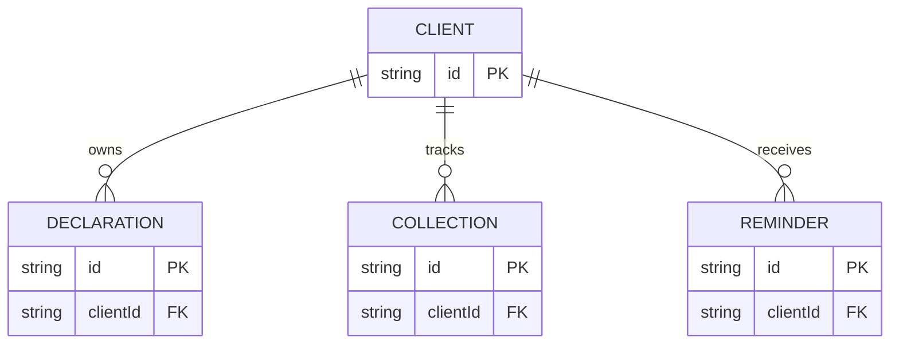
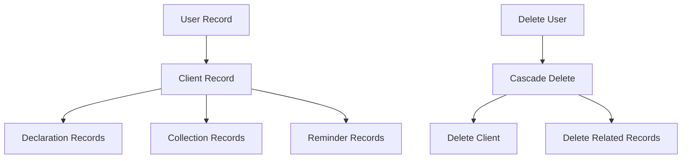
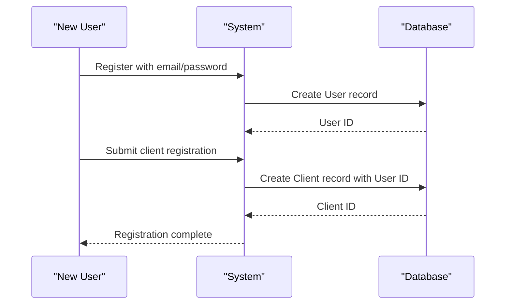

# Core Entities

<cite>
**Referenced Files in This Document**
- [migration.sql](file://prisma/migrations/20251101125707_init/migration.sql)
- [seed.ts](file://prisma/seed.ts)
- [prisma.ts](file://src/lib/prisma.ts)
- [db.ts](file://src/lib/db.ts)
- [profile/route.ts](file://src/app/api/profile/route.ts)
- [client/profile/page.tsx](file://src/app/client/profile/page.tsx)
- [admin/profile/page.tsx](file://src/app/admin/profile/page.tsx)
- [pdf-export.ts](file://src/lib/pdf-export.ts)
</cite>

## Table of Contents
1. [Introduction](#introduction)
2. [System Architecture Overview](#system-architecture-overview)
3. [User Model](#user-model)
4. [Client Model](#client-model)
5. [Declaration Model](#declaration-model)
6. [Collection Model](#collection-model)
7. [Reminder Model](#reminder-model)
8. [Entity Relationships](#entity-relationships)
9. [Data Validation and Constraints](#data-validation-and-constraints)
10. [Business Logic Implementation](#business-logic-implementation)
11. [Usage Examples](#usage-examples)
12. [Best Practices](#best-practices)

## Introduction

The smmm-system is built around five core business entities that form the foundation of the financial management and client relationship system. These entities work together to provide comprehensive tax management, client tracking, and administrative functionality for a Certified Public Accountant (SMMM) office. The system emphasizes data integrity through strict validation rules and maintains clear relationships between entities to ensure business requirements are met.

## System Architecture Overview

The core entities are designed with a relational database structure using Prisma ORM, providing type-safe database interactions and automatic schema migrations. The system follows a one-to-one relationship pattern between User and Client entities, ensuring each client has a corresponding user account while maintaining separate concerns for authentication and business data.

```mermaid
erDiagram
USER {
string id PK
string name
string email UK
datetime emailVerified
string password
enum role
longtext image
datetime createdAt
datetime updatedAt
}
CLIENT {
string id PK
string userId UK FK
string companyName
string taxNumber UK
string phone
text address
datetime createdAt
datetime updatedAt
}
DECLARATION {
string id PK
string clientId FK
string period
string title
string pdfUrl
datetime uploadedAt
datetime updatedAt
}
COLLECTION {
string id PK
string clientId FK
decimal amount
enum type
datetime date
text note
datetime createdAt
datetime updatedAt
}
REMINDER {
string id PK
string title
text message
datetime date
boolean completed
datetime createdAt
datetime updatedAt
}
USER ||--|| CLIENT : "has one"
CLIENT ||--o{ DECLARATION : "owns"
CLIENT ||--o{ COLLECTION : "tracks"
CLIENT ||--o{ REMINDER : "receives"
```

**Diagram sources**
- [migration.sql](file://prisma/migrations/20251101125707_init/migration.sql#L1-L449)

## User Model

The User model serves as the foundation for authentication and authorization within the system. Each user represents either an administrator or a client with distinct roles and permissions.

### Fields and Properties

| Field | Type | Constraints | Default Value | Description |
|-------|------|-------------|---------------|-------------|
| `id` | String | Primary Key | Auto-generated | Unique identifier for the user |
| `name` | String | Nullable | null | Full name of the user |
| `email` | String | Required, Unique | - | Email address for authentication |
| `emailVerified` | DateTime | Nullable | null | Timestamp when email was verified |
| `password` | String | Required | - | Hashed password for authentication |
| `role` | Enum | Required, Default: 'CLIENT' | 'CLIENT' | User role: ADMIN or CLIENT |
| `image` | LongText | Nullable | null | Profile image stored as base64 |
| `createdAt` | DateTime | Required, Default: Current Timestamp | Current Timestamp | Record creation timestamp |
| `updatedAt` | DateTime | Required | - | Last modification timestamp |

### Business Logic

The User model implements role-based access control with two primary roles:
- **ADMIN**: System administrators with full access to all features
- **CLIENT**: Registered clients with limited access to their own data

The system ensures email uniqueness to prevent duplicate accounts and implements password hashing for security. The `emailVerified` field tracks whether the user has completed the email verification process.

**Section sources**
- [migration.sql](file://prisma/migrations/20251101125707_init/migration.sql#L1-L20)
- [seed.ts](file://prisma/seed.ts#L10-L30)

## Client Model

The Client model represents business entities registered in the system, containing essential business information and establishing the one-to-one relationship with the User model.

### Fields and Properties

| Field | Type | Constraints | Default Value | Description |
|-------|------|-------------|---------------|-------------|
| `id` | String | Primary Key | Auto-generated | Unique identifier for the client |
| `userId` | String | Required, Unique, Foreign Key | - | References User.id |
| `companyName` | String | Required | - | Legal business name |
| `taxNumber` | String | Required, Unique | - | Tax identification number |
| `phone` | String | Nullable | null | Contact telephone number |
| `address` | Text | Nullable | null | Business address |
| `createdAt` | DateTime | Required, Default: Current Timestamp | Current Timestamp | Record creation timestamp |
| `updatedAt` | DateTime | Required | - | Last modification timestamp |

### Business Logic

The Client model enforces several critical business rules:
- **One-to-One Relationship**: Each client must have exactly one associated user account
- **Unique Tax Numbers**: Prevents duplicate business registrations
- **Unique User Association**: Ensures each user can only be linked to one client profile

The model stores comprehensive business information including legal name, tax identification, contact details, and physical address. This information is crucial for tax reporting and compliance purposes.

**Section sources**
- [migration.sql](file://prisma/migrations/20251101125707_init/migration.sql#L44-L60)
- [seed.ts](file://prisma/seed.ts#L32-L50)

## Declaration Model

The Declaration model handles tax return documentation and tracking, serving as the primary mechanism for managing tax-related submissions and records.

### Fields and Properties

| Field | Type | Constraints | Default Value | Description |
|-------|------|-------------|---------------|-------------|
| `id` | String | Primary Key | Auto-generated | Unique identifier for the declaration |
| `clientId` | String | Required, Foreign Key | - | References Client.id |
| `period` | String | Required | - | Tax period in YYYY-MM or YYYY-QN format |
| `title` | String | Nullable | null | Custom title for the declaration |
| `pdfUrl` | String | Required | - | URL path to the stored PDF document |
| `uploadedAt` | DateTime | Required, Default: Current Timestamp | Current Timestamp | Document upload timestamp |
| `updatedAt` | DateTime | Required | - | Last modification timestamp |

### Business Logic

The Declaration model implements sophisticated tax period formatting and PDF management:

#### Period Formatting
- **Monthly periods**: Format `YYYY-MM` (e.g., "2024-10")
- **Quarterly periods**: Format `YYYY-QN` (e.g., "2024-Q3")
- **Annual periods**: Format `YYYY` (e.g., "2024")

#### PDF Storage Management
The system stores PDF documents with secure URLs and maintains metadata about each document's lifecycle. The `pdfUrl` field contains the path to the stored document, enabling secure access control and document management.

#### Tax Compliance Features
- **Period Tracking**: Ensures proper tax period coverage
- **Document Versioning**: Maintains audit trails for submitted documents
- **Upload Timestamps**: Tracks when documents were submitted

**Section sources**
- [migration.sql](file://prisma/migrations/20251101125707_init/migration.sql#L82-L95)
- [pdf-export.ts](file://src/lib/pdf-export.ts#L50-L157)

## Collection Model

The Collection model manages income and expense tracking with precise decimal handling and comprehensive categorization.

### Fields and Properties

| Field | Type | Constraints | Default Value | Description |
|-------|------|-------------|---------------|-------------|
| `id` | String | Primary Key | Auto-generated | Unique identifier for the collection record |
| `clientId` | String | Required, Foreign Key | - | References Client.id |
| `amount` | Decimal(10,2) | Required | - | Monetary amount with 2 decimal precision |
| `type` | Enum | Required, Default: 'INCOME' | 'INCOME' | Transaction type: INCOME or EXPENSE |
| `date` | DateTime | Required | - | Transaction date and time |
| `note` | Text | Nullable | null | Additional description or comments |
| `createdAt` | DateTime | Required, Default: Current Timestamp | Current Timestamp | Record creation timestamp |
| `updatedAt` | DateTime | Required | - | Last modification timestamp |

### Business Logic

The Collection model provides comprehensive financial tracking with the following features:

#### Decimal Precision
- **Precision**: 10 digits total, 2 decimal places
- **Scale**: Fixed 2 decimal places for currency calculations
- **Validation**: Ensures accurate financial calculations

#### Transaction Types
- **INCOME**: Revenue generated by the client
- **EXPENSE**: Costs incurred by the client

#### Financial Management
- **Accurate Accounting**: Precise monetary tracking
- **Categorization**: Clear distinction between income and expenses
- **Date Tracking**: Timely transaction recording
- **Notes System**: Flexible documentation for transactions

**Section sources**
- [migration.sql](file://prisma/migrations/20251101125707_init/migration.sql#L119-L135)

## Reminder Model

The Reminder model handles task scheduling and follow-up management with completion tracking and notification capabilities.

### Fields and Properties

| Field | Type | Constraints | Default Value | Description |
|-------|------|-------------|---------------|-------------|
| `id` | String | Primary Key | Auto-generated | Unique identifier for the reminder |
| `title` | String | Required | - | Brief title describing the reminder |
| `message` | Text | Required | - | Detailed description or instructions |
| `date` | DateTime | Required | - | Scheduled date and time for the reminder |
| `completed` | Boolean | Required, Default: false | false | Completion status indicator |
| `createdAt` | DateTime | Required, Default: Current Timestamp | Current Timestamp | Record creation timestamp |
| `updatedAt` | DateTime | Required | - | Last modification timestamp |

### Business Logic

The Reminder model implements comprehensive task management with the following features:

#### Task Management
- **Title and Description**: Clear task identification and instructions
- **Scheduled Execution**: Precise timing for reminders
- **Completion Tracking**: Boolean flag for task status

#### Follow-Up System
- **Automated Notifications**: Scheduled reminders for pending tasks
- **Status Tracking**: Visual indication of completed vs. pending tasks
- **Historical Records**: Complete audit trail of all reminders

#### Business Workflow Integration
- **Client Communication**: Automated follow-ups for client interactions
- **Tax Deadlines**: Reminders for tax filing deadlines
- **Appointment Scheduling**: Calendar integration for appointments

**Section sources**
- [migration.sql](file://prisma/migrations/20251101125707_init/migration.sql#L96-L118)

## Entity Relationships

The core entities establish clear relationships that reflect real-world business scenarios and ensure data integrity.

### One-to-One Relationship: User and Client

The most critical relationship in the system is the one-to-one association between User and Client entities. This relationship ensures:

```mermaid
erDiagram
USER {
string id PK
string email UK
enum role
}
CLIENT {
string id PK
string userId UK FK
string companyName
string taxNumber UK
}
USER ||--|| CLIENT : "has one"
```

**Diagram sources**
- [migration.sql](file://prisma/migrations/20251101125707_init/migration.sql#L44-L60)

#### Relationship Benefits
- **Single Point of Access**: Each client has exactly one user account
- **Security Isolation**: User credentials are isolated from business data
- **Role Separation**: Clear distinction between administrative and client roles
- **Data Integrity**: Prevents orphaned records and duplicate associations

### One-to-Many Relationships

Each Client entity can have multiple related records across the other models:



**Diagram sources**
- [migration.sql](file://prisma/migrations/20251101125707_init/migration.sql#L432-L448)

**Section sources**
- [migration.sql](file://prisma/migrations/20251101125707_init/migration.sql#L432-L448)

## Data Validation and Constraints

The system implements comprehensive validation at the database schema level to ensure data integrity and enforce business requirements.

### Unique Constraints

| Constraint | Scope | Purpose |
|------------|-------|---------|
| `User_email_key` | Email field | Prevent duplicate email addresses |
| `Client_userId_key` | User ID field | Ensure one-to-one user-client relationship |
| `Client_taxNumber_key` | Tax number field | Prevent duplicate tax identification numbers |

### Foreign Key Constraints

The system uses cascading foreign keys to maintain referential integrity:



**Diagram sources**
- [migration.sql](file://prisma/migrations/20251101125707_init/migration.sql#L432-L448)

### Business Rule Validation

#### Email Validation
- **Format Validation**: Standard email format checking
- **Uniqueness**: Prevents duplicate email addresses
- **Required Field**: Ensures all users have valid email addresses

#### Tax Number Validation
- **Uniqueness**: Prevents duplicate tax identification numbers
- **Format Consistency**: Ensures proper tax number formatting
- **Business Requirement**: Critical for tax compliance

#### Monetary Validation
- **Decimal Precision**: Fixed 10,2 precision for financial calculations
- **Positive Values**: Ensures amounts are positive or zero
- **Currency Consistency**: Standardized monetary representation

**Section sources**
- [migration.sql](file://prisma/migrations/20251101125707_init/migration.sql#L1-L60)
- [seed.ts](file://prisma/seed.ts#L32-L50)

## Business Logic Implementation

The system implements sophisticated business logic through both database constraints and application-level validation.

### Client Registration Workflow



**Diagram sources**
- [seed.ts](file://prisma/seed.ts#L32-L50)
- [profile/route.ts](file://src/app/api/profile/route.ts#L35-L80)

### Declaration Upload Process

The system provides a structured process for uploading and managing tax declarations:

1. **Period Selection**: Users select appropriate tax period
2. **Document Upload**: PDF document upload with validation
3. **Metadata Assignment**: Title and description assignment
4. **Storage Management**: Secure PDF storage with URL generation
5. **Audit Trail**: Complete logging of all upload activities

### Collection Management

Financial tracking through the Collection model follows established accounting principles:

1. **Transaction Recording**: Accurate date and amount recording
2. **Type Classification**: Clear distinction between income and expenses
3. **Client Association**: Proper client-business relationship
4. **Audit Trail**: Complete transaction history

**Section sources**
- [profile/route.ts](file://src/app/api/profile/route.ts#L35-L80)
- [client/profile/page.tsx](file://src/app/client/profile/page.tsx#L28-L63)

## Usage Examples

### Creating a New Client with Associated User

The system demonstrates the one-to-one relationship between User and Client through practical examples:

```typescript
// Example from seed.ts showing client-user creation
const clientUser = await prisma.user.upsert({
  where: { email: 'mukellef@example.com' },
  update: {},
  create: {
    email: 'mukellef@example.com',
    name: 'Mükellef Kullanıcı',
    password: hashedPassword,
    role: 'CLIENT',
    image: '',
    client: {
      create: {
        companyName: 'ABC Ticaret Ltd. Şti.',
        taxNumber: '1234567890',
        phone: '0533 987 6543',
        address: 'Atatürk Cad. No: 123 Merkez/İstanbul',
      },
    },
  },
})
```

### Managing Declarations

The Declaration model enables comprehensive tax document management:

```typescript
// Creating a new declaration
await prisma.declaration.create({
  data: {
    clientId: client.id,
    period: '2024-10',
    title: 'KDV Beyannamesi',
    pdfUrl: '/uploads/tax-documents/kdv-2024-10.pdf',
  },
})
```

### Tracking Financial Transactions

The Collection model provides precise financial tracking:

```typescript
// Recording an income transaction
await prisma.collection.create({
  data: {
    clientId: client.id,
    amount: 15000.00,
    type: 'INCOME',
    date: new Date('2024-10-15'),
    note: 'Müşteri A\'dan alınan satış geliri',
  },
})

// Recording an expense transaction
await prisma.collection.create({
  data: {
    clientId: client.id,
    amount: 2500.00,
    type: 'EXPENSE',
    date: new Date('2024-10-20'),
    note: 'Ofis kira ödemesi',
  },
})
```

### Setting Up Reminders

The Reminder model facilitates task management:

```typescript
// Creating a tax deadline reminder
await prisma.reminder.create({
  data: {
    title: 'KDV Beyannamesi Teslim Tarihi',
    message: '2024 Ekim dönemi KDV beyannamesi teslim tarihi 15 Ekim 2024.',
    date: new Date('2024-10-15'),
    completed: false,
  },
})
```

**Section sources**
- [seed.ts](file://prisma/seed.ts#L32-L88)
- [profile/route.ts](file://src/app/api/profile/route.ts#L35-L80)

## Best Practices

### Data Integrity Management

1. **Foreign Key Constraints**: Always use cascading deletes for related records
2. **Unique Constraints**: Implement appropriate uniqueness constraints
3. **Validation Layers**: Combine database constraints with application validation
4. **Audit Trails**: Maintain comprehensive logging for all data modifications

### Security Considerations

1. **Password Hashing**: Use strong hashing algorithms for password storage
2. **Email Verification**: Implement email verification for new accounts
3. **Access Control**: Enforce role-based access control
4. **Data Encryption**: Encrypt sensitive data at rest and in transit

### Performance Optimization

1. **Indexing**: Create appropriate indexes for frequently queried fields
2. **Query Optimization**: Use efficient queries with proper joins
3. **Caching**: Implement caching for frequently accessed data
4. **Batch Operations**: Use batch operations for bulk data processing

### Scalability Planning

1. **Database Design**: Normalize data appropriately for scalability
2. **Partitioning**: Consider partitioning large tables
3. **Replication**: Implement read replicas for high availability
4. **Monitoring**: Establish comprehensive monitoring and alerting

The core entities of the smmm-system provide a robust foundation for financial management and client relationship tracking. Through careful design and implementation of business logic, data validation, and relationship management, the system ensures reliable operation while maintaining flexibility for future enhancements.