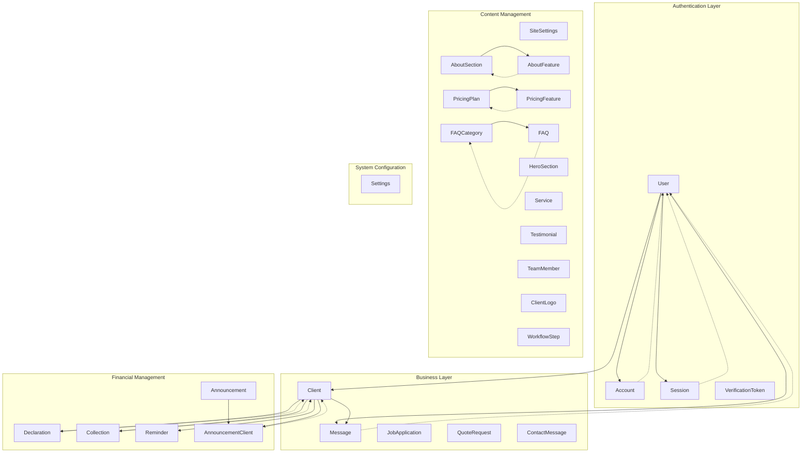

# Data Models

<cite>
**Referenced Files in This Document**
- [prisma/schema.prisma](file://prisma/schema.prisma)
- [prisma/migrations/20251101125707_init/migration.sql](file://prisma/migrations/20251101125707_init/migration.sql)
- [prisma/seed.ts](file://prisma/seed.ts)
- [src/lib/prisma.ts](file://src/lib/prisma.ts)
- [src/lib/db.ts](file://src/lib/db.ts)
- [src/app/api/contact-messages/route.ts](file://src/app/api/contact-messages/route.ts)
- [src/app/api/job-applications/route.ts](file://src/app/api/job-applications/route.ts)
- [src/app/api/quote-requests/route.ts](file://src/app/api/quote-requests/route.ts)
- [src/app/api/content/about/route.ts](file://src/app/api/content/about/route.ts)
- [src/components/admin/content-tabs/about-tab.tsx](file://src/components/admin/content-tabs/about-tab.tsx)
- [src/app/admin/content/page.tsx](file://src/app/admin/content/page.tsx)
- [package.json](file://package.json)
</cite>

## Table of Contents
1. [Introduction](#introduction)
2. [Database Schema Overview](#database-schema-overview)
3. [Core Authentication Models](#core-authentication-models)
4. [Business Relationship Models](#business-relationship-models)
5. [Content Management Models](#content-management-models)
6. [Application Status Enums](#application-status-enums)
7. [Data Validation and Constraints](#data-validation-and-constraints)
8. [Entity Relationship Diagram](#entity-relationship-diagram)
9. [Business Logic Implementation](#business-logic-implementation)
10. [Data Migration and Seeding](#data-migration-and-seeding)

## Introduction

The smmm-system employs a comprehensive data model architecture built on Prisma ORM with MySQL as the underlying database. The system manages professional services for Certified Public Accountants (SMMM) and includes sophisticated business logic for client management, content administration, and operational workflows. The data models support both administrative and public-facing functionalities while maintaining strict data integrity and business rule enforcement.

## Database Schema Overview

The system utilizes a relational database schema with carefully designed entity relationships. All models follow consistent naming conventions and implement proper foreign key constraints. The schema supports complex business scenarios including multi-tenant client management, content personalization, and operational workflow tracking.

```mermaid
erDiagram
User {
string id PK
string name
string email UK
datetime emailVerified
string password
enum role
longtext image
datetime createdAt
datetime updatedAt
}
Client {
string id PK
string userId UK FK
string companyName
string taxNumber UK
string phone
text address
datetime createdAt
datetime updatedAt
}
Message {
string id PK
string userId FK
string subject
text message
boolean read
datetime createdAt
}
JobApplication {
string id PK
string name
string email
string phone
string position
string experience
string education
text coverLetter
string cvFileName
longtext cvFileData
string cvMimeType
enum status
datetime createdAt
datetime updatedAt
}
QuoteRequest {
string id PK
string name
string email
string phone
string company
string serviceType
text message
enum status
datetime createdAt
datetime updatedAt
}
ContactMessage {
string id PK
string name
string email
string phone
string subject
text message
enum status
datetime createdAt
datetime updatedAt
}
SiteSettings {
string id PK
string siteName
text siteDescription
longtext favicon
longtext brandIcon
string phone
string email
text address
string mapLatitude
string mapLongitude
text mapEmbedUrl
string facebookUrl
string twitterUrl
string linkedinUrl
string instagramUrl
string youtubeUrl
datetime createdAt
datetime updatedAt
}
HeroSection {
string id PK
string title
text subtitle
text description
string buttonText
string buttonUrl
longtext image
boolean isActive
int order
datetime createdAt
datetime updatedAt
}
AboutSection {
string id PK
string title
text subtitle
text description
longtext image
datetime createdAt
datetime updatedAt
}
AboutFeature {
string id PK
string sectionId FK
string icon
string title
text description
boolean isActive
int order
}
Service {
string id PK
string icon
string title
text description
text features
boolean isActive
int order
datetime createdAt
datetime updatedAt
}
PricingPlan {
string id PK
string name
string price
string period
text description
boolean isPopular
boolean isActive
int order
datetime createdAt
datetime updatedAt
}
PricingFeature {
string id PK
string planId FK
string text
boolean isIncluded
int order
}
Testimonial {
string id PK
string name
string position
string company
text content
longtext avatar
int rating
boolean isActive
int order
datetime createdAt
datetime updatedAt
}
TeamMember {
string id PK
string name
string position
text bio
longtext avatar
string email
string phone
string linkedinUrl
boolean isActive
int order
datetime createdAt
datetime updatedAt
}
FAQCategory {
string id PK
string name UK
string slug UK
int order
datetime createdAt
datetime updatedAt
}
FAQ {
string id PK
string categoryId FK
string question
text answer
int order
datetime createdAt
datetime updatedAt
}
Declaration {
string id PK
string clientId FK
string period
string title
string pdfUrl
datetime uploadedAt
datetime updatedAt
}
Collection {
string id PK
string clientId FK
decimal amount
enum type
datetime date
text note
datetime createdAt
datetime updatedAt
}
Reminder {
string id PK
string title
text message
datetime date
boolean completed
datetime createdAt
datetime updatedAt
}
Announcement {
string id PK
string title
text message
enum type
boolean targetAll
datetime createdAt
datetime updatedAt
}
AnnouncementClient {
string id PK
string announcementId FK
string clientId FK
boolean read
}
ClientLogo {
string id PK
string name
text description
string url
longtext logo
boolean isActive
int order
datetime createdAt
datetime updatedAt
}
WorkflowStep {
string id PK
string icon
string title
text description
int order
datetime createdAt
datetime updatedAt
}
Account {
string id PK
string userId FK
string type
string provider
string providerAccountId
text refresh_token
text access_token
int expires_at
string token_type
string scope
text id_token
string session_state
}
Session {
string id PK
string sessionToken UK
string userId FK
datetime expires
}
VerificationToken {
string identifier
string token UK
datetime expires
}
Settings {
string id PK
string companyName
string logo
string taxNumber
string email
string phone
text address
string smtpHost
int smtpPort
string smtpUser
string smtpPass
datetime createdAt
datetime updatedAt
}
User ||--|| Client : "has one"
User ||--o{ Message : "sends"
User ||--o{ Account : "authenticates with"
User ||--o{ Session : "maintains"
Client ||--o{ Declaration : "submits"
Client ||--o{ Collection : "generates"
Client ||--o{ AnnouncementClient : "receives"
AboutSection ||--o{ AboutFeature : "contains"
PricingPlan ||--o{ PricingFeature : "includes"
FAQCategory ||--o{ FAQ : "contains"
Client ||--o{ Reminder : "managed by"
Client ||--o{ Message : "receives"
Announcement ||--o{ AnnouncementClient : "sent to"
```

**Diagram sources**
- [prisma/schema.prisma](file://prisma/schema.prisma#L1-L434)
- [prisma/migrations/20251101125707_init/migration.sql](file://prisma/migrations/20251101125707_init/migration.sql#L1-L450)

## Core Authentication Models

### User Model

The User model serves as the central authentication entity with comprehensive role-based access control and profile management capabilities.

| Field | Type | Constraints | Default Value | Description |
|-------|------|-------------|---------------|-------------|
| id | String | Primary Key, Auto-generated | cuid() | Unique identifier using Prisma's cuid() function |
| name | String | Nullable | null | User's display name or full name |
| email | String | Unique, Required | - | Email address for authentication and communication |
| emailVerified | DateTime | Nullable | null | Timestamp when email verification was completed |
| password | String | Required | - | BCrypt hashed password for authentication |
| role | Role | Required | CLIENT | User role enumeration (ADMIN/CLIENT) |
| image | String | Nullable | null | Base64 encoded user avatar image |
| createdAt | DateTime | Auto-set | now() | Record creation timestamp |
| updatedAt | DateTime | Auto-updated | - | Last modification timestamp |

**Business Logic:**
- Role-based access control with ADMIN and CLIENT roles
- Automatic timestamps for record lifecycle management
- Email uniqueness constraint ensures single account per email
- Password hashing handled externally using bcrypt

**Relationships:**
- One-to-One with Client model (each user can have one client profile)
- One-to-Many with Message model (users send multiple messages)
- One-to-Many with Account model (supports multiple OAuth providers)
- One-to-Many with Session model (multiple active sessions)

**Section sources**
- [prisma/schema.prisma](file://prisma/schema.prisma#L8-L22)

### Client Model

The Client model establishes the business relationship between User accounts and client organizations, enabling specialized client management features.

| Field | Type | Constraints | Default Value | Description |
|-------|------|-------------|---------------|-------------|
| id | String | Primary Key, Auto-generated | cuid() | Unique identifier for client records |
| userId | String | Foreign Key, Unique | - | Reference to associated User account |
| companyName | String | Required | - | Legal name of the client organization |
| taxNumber | String | Unique, Required | - | Tax identification number for compliance |
| phone | String | Nullable | null | Primary contact telephone number |
| address | String | Nullable | null | Physical or registered business address |
| createdAt | DateTime | Auto-set | now() | Record creation timestamp |
| updatedAt | DateTime | Auto-updated | - | Last modification timestamp |

**Business Logic:**
- Cascading delete relationship with User model ensures data consistency
- Tax number uniqueness prevents duplicate client registrations
- Address stored as plain text for flexibility in formatting
- Phone number field supports various international formats

**Relationships:**
- Many-to-One with User model (each client belongs to one user)
- One-to-Many with Declaration model (clients submit multiple tax returns)
- One-to-Many with Collection model (financial transactions tracking)
- One-to-Many with AnnouncementClient model (client-specific announcements)

**Section sources**
- [prisma/schema.prisma](file://prisma/schema.prisma#L44-L58)

### Authentication Support Models

The system includes standard NextAuth.js models for comprehensive authentication support.

#### Account Model
Manages OAuth provider integrations and third-party authentications.

#### Session Model
Handles session tokens and user authentication persistence.

#### VerificationToken Model
Supports email verification and password reset functionality.

**Section sources**
- [prisma/schema.prisma](file://prisma/schema.prisma#L24-L42)

## Business Relationship Models

### Message Model

Facilitates communication between users and administrators with comprehensive message tracking.

| Field | Type | Constraints | Default Value | Description |
|-------|------|-------------|---------------|-------------|
| id | String | Primary Key | cuid() | Unique message identifier |
| userId | String | Foreign Key | - | Reference to user who sent the message |
| subject | String | Required | - | Message subject/title |
| message | String | Required | - | Full message content |
| read | Boolean | Default | false | Read status indicator |
| createdAt | DateTime | Auto-set | now() | Message creation timestamp |

**Business Logic:**
- Automatic read status initialization to false
- User association enables personalized message filtering
- Full-text storage supports rich message content

**Relationships:**
- Many-to-One with User model (messages belong to users)
- Supports both internal messaging and external communications

**Section sources**
- [prisma/schema.prisma](file://prisma/schema.prisma#L345-L355)

### JobApplication Model

Manages career applications with comprehensive candidate information and file handling capabilities.

| Field | Type | Constraints | Default Value | Description |
|-------|------|-------------|---------------|-------------|
| id | String | Primary Key | cuid() | Unique application identifier |
| name | String | Required | - | Full name of applicant |
| email | String | Required | - | Contact email address |
| phone | String | Required | - | Telephone number for contact |
| position | String | Required | - | Desired position or role |
| experience | String | Required | - | Years of relevant experience |
| education | String | Required | - | Educational qualifications |
| coverLetter | String | Nullable | null | Personal cover letter |
| cvFileName | String | Nullable | null | Original CV filename |
| cvFileData | String | Nullable | null | Base64 encoded CV file data |
| cvMimeType | String | Nullable | null | MIME type of CV file |
| status | JobApplicationStatus | Default | NEW | Application lifecycle status |
| createdAt | DateTime | Auto-set | now() | Application submission timestamp |
| updatedAt | DateTime | Auto-updated | - | Last status change timestamp |

**Business Logic:**
- Comprehensive file upload support with MIME type validation
- Status tracking through application lifecycle
- Automatic CV data encoding for database storage
- Required field validation ensures complete application data

**Status Enum Values:**
- NEW: Newly submitted applications
- REVIEWING: Under initial review
- INTERVIEWED: Candidate has undergone interview
- ACCEPTED: Offer extended to candidate
- REJECTED: Application declined

**Relationships:**
- Self-contained model without foreign key dependencies
- Supports file attachments up to database limits
- Status tracking enables workflow automation

**Section sources**
- [prisma/schema.prisma](file://prisma/schema.prisma#L385-L401)

### QuoteRequest Model

Handles service quotation requests with comprehensive client information and status tracking.

| Field | Type | Constraints | Default Value | Description |
|-------|------|-------------|---------------|-------------|
| id | String | Primary Key | cuid() | Unique quote request identifier |
| name | String | Required | - | Client's full name |
| email | String | Required | - | Contact email address |
| phone | String | Required | - | Contact telephone number |
| company | String | Required | - | Company/Organization name |
| serviceType | String | Required | - | Type of service requested |
| message | String | Nullable | null | Additional request details |
| status | QuoteStatus | Default | NEW | Request lifecycle status |
| createdAt | DateTime | Auto-set | now() | Request submission timestamp |
| updatedAt | DateTime | Auto-updated | - | Last status update timestamp |

**Business Logic:**
- Comprehensive client information capture
- Service type categorization for routing
- Status tracking enables automated workflows
- Optional message field allows detailed requirements

**Status Enum Values:**
- NEW: Fresh requests requiring attention
- PENDING: Awaiting initial review
- REVIEWED: Initial assessment completed
- CONTACTED: Client contacted for details
- COMPLETED: Request fulfilled

**Relationships:**
- Self-contained model for external inquiries
- Status-driven workflow automation
- Supports follow-up communications

**Section sources**
- [prisma/schema.prisma](file://prisma/schema.prisma#L403-L415)

### ContactMessage Model

Processes external contact form submissions with comprehensive inquiry management.

| Field | Type | Constraints | Default Value | Description |
|-------|------|-------------|---------------|-------------|
| id | String | Primary Key | cuid() | Unique contact message identifier |
| name | String | Required | - | Sender's full name |
| email | String | Required | - | Contact email address |
| phone | String | Required | - | Contact telephone number |
| subject | String | Required | - | Message subject |
| message | String | Required | - | Complete message content |
| status | ContactMessageStatus | Default | NEW | Message lifecycle status |
| createdAt | DateTime | Auto-set | now() | Message receipt timestamp |
| updatedAt | DateTime | Auto-updated | - | Last status modification |

**Business Logic:**
- Standard contact form validation
- Status tracking for customer service workflows
- Automatic status initialization to NEW
- Comprehensive sender information capture

**Status Enum Values:**
- NEW: Unprocessed incoming messages
- PENDING: Being reviewed
- REPLIED: Response sent to sender
- RESOLVED: Issue fully addressed

**Relationships:**
- External communication model
- Customer service workflow integration
- Status-driven response automation

**Section sources**
- [prisma/schema.prisma](file://prisma/schema.prisma#L417-L429)

## Content Management Models

### SiteSettings Model

Centralizes global site configuration and branding information.

| Field | Type | Constraints | Default Value | Description |
|-------|------|-------------|---------------|-------------|
| id | String | Primary Key | cuid() | Unique settings identifier |
| siteName | String | Default | "SMMM Ofisi" | Brand/company name |
| siteDescription | String | Nullable | null | Site description for SEO |
| favicon | String | Nullable | null | Base64 encoded favicon |
| brandIcon | String | Nullable | null | Base64 encoded brand icon |
| phone | String | Nullable | null | Contact telephone number |
| email | String | Nullable | null | Contact email address |
| address | String | Nullable | null | Physical address |
| mapLatitude | String | Nullable | null | Google Maps latitude |
| mapLongitude | String | Nullable | null | Google Maps longitude |
| mapEmbedUrl | String | Nullable | null | Google Maps iframe URL |
| facebookUrl | String | Nullable | null | Facebook social media link |
| twitterUrl | String | Nullable | null | Twitter/X social media link |
| linkedinUrl | String | Nullable | null | LinkedIn professional link |
| instagramUrl | String | Nullable | null | Instagram social media link |
| youtubeUrl | String | Nullable | null | YouTube channel link |
| createdAt | DateTime | Auto-set | now() | Settings creation timestamp |
| updatedAt | DateTime | Auto-updated | - | Last modification timestamp |

**Business Logic:**
- Single record pattern enforced through unique constraints
- Base64 encoding for embedded images and icons
- Social media links support various platforms
- Geographic coordinates enable location services

**Relationships:**
- Singleton model (only one record exists)
- Centralized configuration for all site-related settings
- Supports multiple social media platform integrations

**Section sources**
- [prisma/schema.prisma](file://prisma/schema.prisma#L105-L125)

### HeroSection Model

Manages the primary landing page hero section with multimedia content.

| Field | Type | Constraints | Default Value | Description |
|-------|------|-------------|---------------|-------------|
| id | String | Primary Key | cuid() | Unique hero section identifier |
| title | String | Required | - | Hero section headline |
| subtitle | String | Required | - | Supporting subtitle text |
| description | String | Nullable | null | Detailed description text |
| buttonText | String | Nullable | null | Call-to-action button text |
| buttonUrl | String | Nullable | null | Button destination URL |
| image | String | Nullable | null | Base64 encoded hero image |
| isActive | Boolean | Default | true | Visibility toggle |
| order | Integer | Default | 0 | Display ordering |
| createdAt | DateTime | Auto-set | now() | Creation timestamp |
| updatedAt | DateTime | Auto-updated | - | Last modification timestamp |

**Business Logic:**
- Active/inactive status controls visibility
- Ordering system enables content prioritization
- Image storage supports various formats through base64 encoding
- Flexible button configuration for different CTAs

**Relationships:**
- Standalone content model
- Supports multimedia content management
- Ordering system for content prioritization

**Section sources**
- [prisma/schema.prisma](file://prisma/schema.prisma#L127-L140)

### AboutSection and AboutFeature Models

Comprehensive about page content management with feature highlighting.

#### AboutSection Model
Primary container for about page content with integrated feature management.

#### AboutFeature Model
Individual feature cards within the about section with flexible configuration.

| Field | Type | Constraints | Default Value | Description |
|-------|------|-------------|---------------|-------------|
| id | String | Primary Key | cuid() | Unique feature identifier |
| sectionId | String | Foreign Key | - | Reference to parent AboutSection |
| icon | String | Nullable | null | Lucide icon name |
| title | String | Required | - | Feature title |
| description | String | Required | - | Feature description |
| isActive | Boolean | Default | true | Feature visibility |
| order | Integer | Default | 0 | Display ordering |

**Business Logic:**
- Hierarchical structure with parent-child relationships
- Icon system supports standardized visual elements
- Active status enables content curation
- Ordering system for feature prioritization

**Relationships:**
- Many-to-One with AboutSection (features belong to sections)
- One-to-Many with AboutSection (sections contain multiple features)
- Supports unlimited feature count per section

**Section sources**
- [prisma/schema.prisma](file://prisma/schema.prisma#L142-L155)

### Service Model

Manages service offerings with comprehensive feature descriptions.

| Field | Type | Constraints | Default Value | Description |
|-------|------|-------------|---------------|-------------|
| id | String | Primary Key | cuid() | Unique service identifier |
| icon | String | Nullable | null | Lucide icon name |
| title | String | Required | - | Service name |
| description | String | Required | - | Service description |
| features | String | Nullable | null | JSON array of service features |
| isActive | Boolean | Default | true | Service availability |
| order | Integer | Default | 0 | Display ordering |
| createdAt | DateTime | Auto-set | now() | Creation timestamp |
| updatedAt | DateTime | Auto-updated | - | Last modification timestamp |

**Business Logic:**
- JSON storage for structured feature arrays
- Active status controls service visibility
- Ordering system enables service prioritization
- Icon support for visual service identification

**Relationships:**
- Standalone service catalog
- Supports hierarchical feature organization
- Ordering system for service prioritization

**Section sources**
- [prisma/schema.prisma](file://prisma/schema.prisma#L165-L177)

### PricingPlan and PricingFeature Models

Comprehensive pricing structure management with feature inclusion tracking.

#### PricingPlan Model
Base pricing plans with feature sets and promotional capabilities.

#### PricingFeature Model
Individual features included in pricing plans with inclusion flags.

| Field | Type | Constraints | Default Value | Description |
|-------|------|-------------|---------------|-------------|
| id | String | Primary Key | cuid() | Unique feature identifier |
| planId | String | Foreign Key | - | Reference to parent pricing plan |
| text | String | Required | - | Feature description |
| isIncluded | Boolean | Default | true | Feature inclusion status |
| order | Integer | Default | 0 | Display ordering |

**Business Logic:**
- Inclusion/exclusion flags control feature availability
- Hierarchical structure enables flexible pricing tiers
- Ordering system for feature prioritization
- Popular plan flag enables promotional displays

**Relationships:**
- Many-to-One with PricingPlan (features belong to plans)
- One-to-Many with PricingPlan (plans contain multiple features)
- Supports unlimited feature count per plan

**Section sources**
- [prisma/schema.prisma](file://prisma/schema.prisma#L189-L202)

### Testimonial Model

Customer feedback and social proof management.

| Field | Type | Constraints | Default Value | Description |
|-------|------|-------------|---------------|-------------|
| id | String | Primary Key | cuid() | Unique testimonial identifier |
| name | String | Required | - | Testimonial author name |
| position | String | Required | - | Author's position/title |
| company | String | Nullable | null | Associated company |
| content | String | Required | - | Full testimonial text |
| avatar | String | Nullable | null | Base64 encoded avatar image |
| rating | Integer | Default | 5 | Rating score (1-5) |
| isActive | Boolean | Default | true | Testimonial visibility |
| order | Integer | Default | 0 | Display ordering |
| createdAt | DateTime | Auto-set | now() | Creation timestamp |
| updatedAt | DateTime | Auto-updated | - | Last modification timestamp |

**Business Logic:**
- Rating system with 1-5 scale
- Avatar support for personalized testimonials
- Active status enables curated content
- Ordering system for testimonial prioritization

**Relationships:**
- Standalone testimonial collection
- Supports multimedia content (avatars)
- Rating-based sorting and filtering

**Section sources**
- [prisma/schema.prisma](file://prisma/schema.prisma#L214-L227)

### TeamMember Model

Organizational structure and team member profiles.

| Field | Type | Constraints | Default Value | Description |
|-------|------|-------------|---------------|-------------|
| id | String | Primary Key | cuid() | Unique team member identifier |
| name | String | Required | - | Team member name |
| position | String | Required | - | Job position/title |
| bio | String | Nullable | null | Professional biography |
| avatar | String | Nullable | null | Base64 encoded avatar image |
| email | String | Nullable | null | Contact email address |
| phone | String | Nullable | null | Contact telephone number |
| linkedinUrl | String | Nullable | null | LinkedIn profile link |
| isActive | Boolean | Default | true | Member visibility |
| order | Integer | Default | 0 | Display ordering |
| createdAt | DateTime | Auto-set | now() | Creation timestamp |
| updatedAt | DateTime | Auto-updated | - | Last modification timestamp |

**Business Logic:**
- Professional profile management
- Social media integration support
- Active status controls team visibility
- Ordering system for team prioritization

**Relationships:**
- Standalone team member collection
- Supports multimedia content (avatars)
- Social media link integration

**Section sources**
- [prisma/schema.prisma](file://prisma/schema.prisma#L229-L242)

### FAQCategory and FAQ Models

Structured frequently asked questions with categorization.

#### FAQCategory Model
Question categories for organized FAQ management.

#### FAQ Model
Individual questions and answers within categorized groups.

| Field | Type | Constraints | Default Value | Description |
|-------|------|-------------|---------------|-------------|
| id | String | Primary Key | cuid() | Unique FAQ identifier |
| categoryId | String | Foreign Key | - | Reference to FAQ category |
| question | String | Required | - | Question text |
| answer | String | Required | - | Answer text |
| order | Integer | Default | 0 | Display ordering |

**Business Logic:**
- Categorized question organization
- Ordering system for FAQ prioritization
- Hierarchical structure enables logical grouping
- Category-based filtering and navigation

**Relationships:**
- Many-to-One with FAQCategory (FAQs belong to categories)
- One-to-Many with FAQCategory (categories contain multiple FAQs)
- Supports unlimited FAQ count per category

**Section sources**
- [prisma/schema.prisma](file://prisma/schema.prisma#L244-L257)

## Application Status Enums

### Role Enum
Defines user role hierarchy and access control levels.

| Value | Description | Access Level |
|-------|-------------|--------------|
| ADMIN | System administrator | Full system access |
| CLIENT | Registered client user | Client-specific features |

**Business Logic:**
- Role-based access control implementation
- Administrative privileges for system management
- Client restrictions for business operations

**Section sources**
- [prisma/schema.prisma](file://prisma/schema.prisma#L24-L26)

### JobApplicationStatus Enum
Tracks career application lifecycle through standardized statuses.

| Value | Turkish Translation | Description |
|-------|-------------------|-------------|
| NEW | Yeni | Newly submitted applications |
| REVIEWING | İnceleniyor | Under initial review |
| INTERVIEWED | Görüşme Yapıldı | Candidate has undergone interview |
| ACCEPTED | Kabul Edildi | Offer extended to candidate |
| REJECTED | Reddedildi | Application declined |

**Business Logic:**
- Workflow automation support
- Status-driven notifications
- Historical tracking for analytics
- Sequential progression modeling

**Section sources**
- [prisma/schema.prisma](file://prisma/schema.prisma#L377-L383)

### QuoteStatus Enum
Manages service quotation request lifecycle.

| Value | Turkish Translation | Description |
|-------|-------------------|-------------|
| NEW | Yeni | Fresh requests requiring attention |
| PENDING | Beklemede | Awaiting initial review |
| REVIEWED | İncelendi | Initial assessment completed |
| CONTACTED | İletişime Geçildi | Client contacted for details |
| COMPLETED | Tamamlandı | Request fulfilled |

**Business Logic:**
- Customer service workflow automation
- Status-based routing and notifications
- Progress tracking for request management
- Sequential process modeling

**Section sources**
- [prisma/schema.prisma](file://prisma/schema.prisma#L401-L407)

### ContactMessageStatus Enum
Handles external contact message processing.

| Value | Turkish Translation | Description |
|-------|-------------------|-------------|
| NEW | Yeni | Unprocessed incoming messages |
| PENDING | Beklemede | Being reviewed |
| REPLIED | Yanıtlandı | Response sent to sender |
| RESOLVED | Çözüldü | Issue fully addressed |

**Business Logic:**
- Customer service ticketing system
- Status-driven response workflows
- Resolution tracking for quality metrics
- Sequential problem-solving process

**Section sources**
- [prisma/schema.prisma](file://prisma/schema.prisma#L429-L435)

### CollectionType Enum
Categorizes financial transactions for reporting and analysis.

| Value | Description | Accounting Impact |
|-------|-------------|-------------------|
| INCOME | Revenue generation | Credit balance |
| EXPENSE | Cost incurrence | Debit balance |

**Business Logic:**
- Double-entry accounting support
- Financial reporting categorization
- Balance sheet impact tracking
- Revenue vs. expense classification

**Section sources**
- [prisma/schema.prisma](file://prisma/schema.prisma#L89-L91)

### AnnouncementType Enum
Classifies system announcements by urgency and importance.

| Value | Description | Usage Context |
|-------|-------------|---------------|
| INFO | General information | Routine updates |
| WARNING | Cautionary notice | Important warnings |
| REMINDER | Scheduled notification | Upcoming events |
| URGENT | Critical alert | Emergency situations |

**Business Logic:**
- Priority-based delivery systems
- Target audience segmentation
- Compliance and regulatory requirements
- Communication strategy implementation

**Section sources**
- [prisma/schema.prisma](file://prisma/schema.prisma#L60-L64)

## Data Validation and Constraints

### Field-Level Validation

The schema implements comprehensive field validation at the database level:

#### String Fields
- Length constraints prevent excessive data storage
- Required field validation ensures data completeness
- Nullable fields provide flexibility for optional content

#### Numeric Fields
- Decimal precision controlled for financial calculations
- Integer ranges validated for ordering and indexing
- Auto-increment fields ensure unique identifiers

#### Date/Time Fields
- Timestamp auto-generation for record lifecycle
- DateTime precision for accurate temporal tracking
- Default values prevent null timestamp issues

#### Boolean Fields
- Default values eliminate null boolean ambiguity
- Active/inactive flags enable content curation
- Status tracking through boolean indicators

### Foreign Key Constraints

All relationships implement proper referential integrity:

#### Cascade Operations
- ON DELETE CASCADE ensures data consistency
- ON UPDATE CASCADE maintains relationship integrity
- Cascade operations prevent orphaned records

#### Unique Constraints
- Email uniqueness prevents duplicate accounts
- Tax number uniqueness for client validation
- Composite unique keys for junction tables

### Business Rule Enforcement

#### Client Validation
- Tax number format validation through database constraints
- Email format validation through Prisma schema
- Phone number format validation through application logic

#### Content Validation
- Image size limitations through base64 encoding
- File type validation through MIME type checking
- Content length validation for text fields

#### Security Constraints
- Password hashing through external bcrypt library
- Email verification through timestamp validation
- Session management through secure token handling

**Section sources**
- [prisma/migrations/20251101125707_init/migration.sql](file://prisma/migrations/20251101125707_init/migration.sql#L1-L450)

## Entity Relationship Diagram

The system implements a comprehensive entity relationship structure supporting complex business scenarios:



**Diagram sources**
- [prisma/schema.prisma](file://prisma/schema.prisma#L1-L434)

## Business Logic Implementation

### Data Access Patterns

The system implements consistent data access patterns across all models:

#### CRUD Operations
- Standard Create, Read, Update, Delete operations for all models
- Soft deletion patterns for historical record keeping
- Bulk operations for batch processing scenarios

#### Query Optimization
- Indexing strategies for frequently queried fields
- Relationship prefetching for complex object graphs
- Pagination support for large datasets

#### Transaction Management
- Atomic operations for complex business scenarios
- Consistency guarantees across related records
- Rollback mechanisms for error recovery

### API Integration

The system exposes RESTful APIs through Next.js API routes:

#### Contact Messages API
- POST endpoint for form submissions
- GET endpoint for message retrieval
- PATCH endpoint for status updates
- DELETE endpoint for message removal

#### Job Applications API
- Multi-part form support for file uploads
- Status tracking through application lifecycle
- CV file handling with MIME type validation

#### Quote Requests API
- Structured request processing
- Status-based workflow automation
- Client information validation

#### Content Management API
- Rich content editing capabilities
- Media file handling for images and documents
- Version control for content changes

**Section sources**
- [src/app/api/contact-messages/route.ts](file://src/app/api/contact-messages/route.ts#L1-L97)
- [src/app/api/job-applications/route.ts](file://src/app/api/job-applications/route.ts#L1-L130)
- [src/app/api/quote-requests/route.ts](file://src/app/api/quote-requests/route.ts#L1-L99)
- [src/app/api/content/about/route.ts](file://src/app/api/content/about/route.ts#L1-L190)

### File Management

The system implements comprehensive file management capabilities:

#### CV Upload System
- Multi-part form processing for file uploads
- MIME type validation for file safety
- Base64 encoding for database storage
- File size limitations and validation

#### Image Management
- Base64 encoding for embedded images
- Format validation for web compatibility
- Size optimization for performance
- CDN integration support

#### Document Storage
- PDF handling for declaration submissions
- Generic file support for various document types
- Metadata preservation for document management
- Secure file access controls

**Section sources**
- [src/app/api/job-applications/route.ts](file://src/app/api/job-applications/route.ts#L30-L50)

## Data Migration and Seeding

### Database Initialization

The system includes comprehensive database initialization through migration and seeding:

#### Migration Strategy
- Incremental migration approach for schema evolution
- Backup and rollback capabilities for production deployments
- Environment-specific migration targeting
- Automated migration execution during deployment

#### Seed Data Implementation
- Representative user accounts with realistic data
- Sample content for all content management models
- Default configurations for system settings
- Test data for functional validation

### Seed Data Structure

The seed script creates meaningful representative data:

#### User Accounts
- Admin user with full system access
- Client users with associated business data
- Realistic user profiles with complete information

#### Content Samples
- Default about section with professional features
- Sample service offerings with detailed descriptions
- Pricing plans with feature sets
- Testimonials with diverse ratings
- FAQ categories with sample questions

#### Business Data
- Job applications with realistic CV data
- Quote requests with service type variations
- Contact messages with status tracking
- Client declarations with PDF references

**Section sources**
- [prisma/seed.ts](file://prisma/seed.ts#L1-L222)

### Deployment Considerations

#### Environment Configuration
- Database URL configuration through environment variables
- Development vs. production database separation
- Migration locking for concurrent deployment safety
- Seed data conditional execution

#### Data Integrity
- Constraint validation during migration
- Data type consistency across environments
- Index optimization for performance
- Backup strategies for production data

**Section sources**
- [prisma.config.ts](file://prisma.config.ts#L1-L13)
- [package.json](file://package.json#L5-L10)