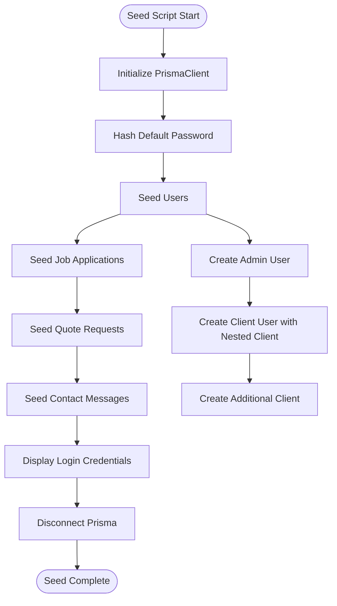
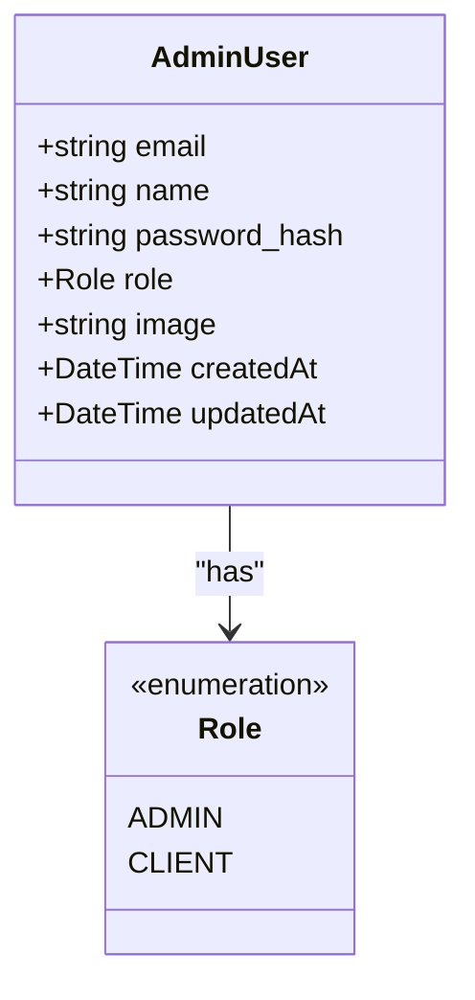
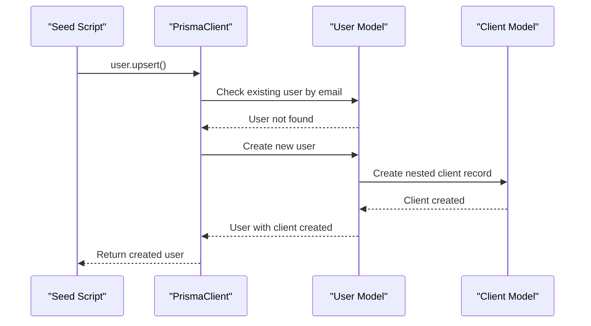
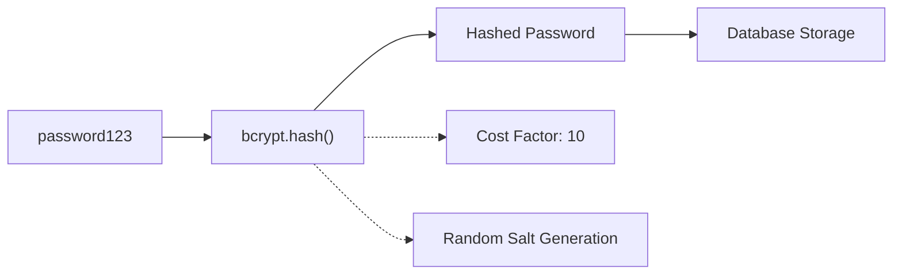
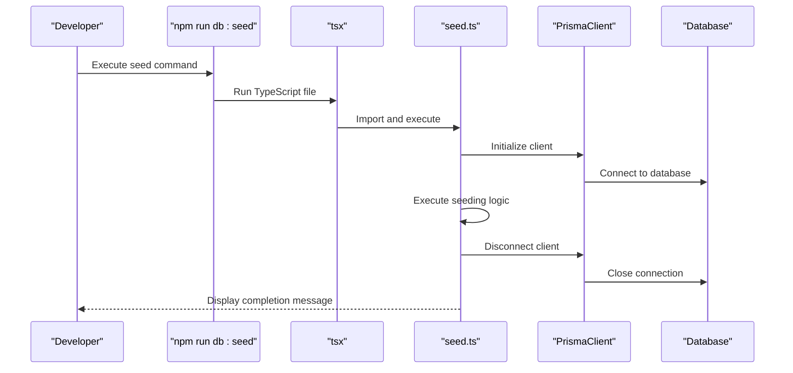
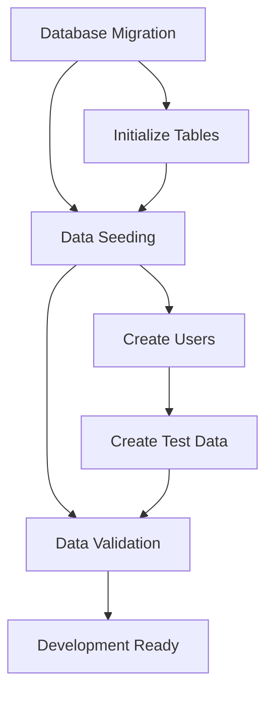

# Data Seeding

<cite>
**Referenced Files in This Document**
- [prisma/seed.ts](file://prisma/seed.ts)
- [prisma/schema.prisma](file://prisma/schema.prisma)
- [prisma/migrations/20251101125707_init/migration.sql](file://prisma/migrations/20251101125707_init/migration.sql)
- [src/lib/prisma.ts](file://src/lib/prisma.ts)
- [src/lib/auth.ts](file://src/lib/auth.ts)
- [package.json](file://package.json)
- [prisma.config.ts](file://prisma.config.ts)
</cite>

## Table of Contents
1. [Introduction](#introduction)
2. [Seed Script Architecture](#seed-script-architecture)
3. [User Seeding Implementation](#user-seeding-implementation)
4. [Nested Write Operations](#nested-write-operations)
5. [Sample Data Creation](#sample-data-creation)
6. [Security Considerations](#security-considerations)
7. [Running the Seed Script](#running-the-seed-script)
8. [Development Workflow Integration](#development-workflow-integration)
9. [Extending the Seed Script](#extending-the-seed-script)
10. [Troubleshooting](#troubleshooting)

## Introduction

The smmm-system includes a comprehensive data seeding process implemented in `prisma/seed.ts` that automatically populates the database with initial test data during development. This seeding process creates essential user accounts (admin and client roles), sample job applications, quote requests, and contact messages to facilitate testing and development workflows.

The seed script utilizes PrismaClient's powerful upsert operations to ensure data consistency while allowing for safe repeated executions. Passwords are securely hashed using bcryptjs, and the script demonstrates advanced Prisma features like nested writes for creating related records in a single operation.

## Seed Script Architecture

The seed script follows a structured approach with clear separation of concerns and comprehensive logging for tracking progress.



**Diagram sources**
- [prisma/seed.ts](file://prisma/seed.ts#L5-L221)

**Section sources**
- [prisma/seed.ts](file://prisma/seed.ts#L1-L221)

## User Seeding Implementation

The seed script creates two primary user types: administrators and clients, each serving different roles within the system.

### Admin User Creation

The admin user serves as the primary administrative account with full system access:



**Diagram sources**
- [prisma/seed.ts](file://prisma/seed.ts#L12-L25)
- [prisma/schema.prisma](file://prisma/schema.prisma#L13-L30)

### Client User Creation with Nested Writes

The seed script demonstrates advanced Prisma functionality by creating client users along with their associated client profiles in a single operation:



**Diagram sources**
- [prisma/seed.ts](file://prisma/seed.ts#L27-L50)

**Section sources**
- [prisma/seed.ts](file://prisma/seed.ts#L12-L50)

## Nested Write Operations

The seed script showcases Prisma's nested write capabilities, particularly in creating client-user relationships:

### Client Profile Creation

Each client user includes a comprehensive client profile with business information:

| Field | Type | Description | Example Value |
|-------|------|-------------|---------------|
| companyName | String | Business name | "ABC Ticaret Ltd. Şti." |
| taxNumber | String | Tax identification number | "1234567890" |
| phone | String | Contact phone number | "0533 987 6543" |
| address | String | Business address | "Atatürk Cad. No: 123 Merkez/İstanbul" |

**Section sources**
- [prisma/seed.ts](file://prisma/seed.ts#L35-L45)

## Sample Data Creation

The seed script generates realistic sample data for each major entity type in the system.

### Job Application Records

Four representative job applications demonstrate various positions and statuses:

| Position | Experience | Education | Status | Purpose |
|----------|------------|-----------|--------|---------|
| Mali Müşavir Yardımcısı | 3 yıl | İktisat Fakültesi | NEW | Entry-level candidate |
| Muhasebe Elemanı | 5 yıl | İşletme Fakültesi | REVIEWING | Mid-level professional |
| Stajyer | Yeni Mezun | Muhasebe ve Finans Yönetimi | INTERVIEWED | Recent graduate |
| Mali Müşavir | 8 yıl | İktisat Fakültesi - Yüksek Lisans | REJECTED | Experienced candidate |

### Quote Request Records

Business service requests showcase different types of financial services:

| Service Type | Company | Status | Purpose |
|--------------|---------|--------|---------|
| Tam Tasdik | ABC Teknoloji A.Ş. | PENDING | Annual financial statements |
| Sınırlı Bağımsız Denetim | XYZ Danışmanlık Ltd. | REVIEWED | Company audit |
| Muhasebe Danışmanlığı | Öz Gıda San. Tic. | CONTACTED | Monthly accounting |
| Vergi Danışmanlığı | Arslan İnşaat | COMPLETED | VAT and corporate tax |

### Contact Message Records

Customer inquiries demonstrate typical support scenarios:

| Subject | Status | Purpose |
|---------|--------|---------|
| Hizmetler Hakkında Bilgi | NEW | General inquiry |
| Randevu Talebi | PENDING | Appointment scheduling |
| Fiyat Bilgisi | REPLIED | Pricing information |
| E-Fatura Sistemi | RESOLVED | Technical support |

**Section sources**
- [prisma/seed.ts](file://prisma/seed.ts#L52-L210)

## Security Considerations

The seed script implements several security best practices for development environments.

### Password Hashing

Default passwords are securely hashed using bcryptjs with a cost factor of 10:



**Diagram sources**
- [prisma/seed.ts](file://prisma/seed.ts#L10-L11)

### Development-Specific Security

The seed script includes several security considerations:

1. **Default Passwords**: Uses "password123" for all accounts in development only
2. **Environment Isolation**: Runs only in non-production environments
3. **Logging**: Provides clear credential display for development convenience
4. **Prisma Client Management**: Proper connection lifecycle management

**Section sources**
- [prisma/seed.ts](file://prisma/seed.ts#L10-L11)
- [prisma/seed.ts](file://prisma/seed.ts#L212-L221)

## Running the Seed Script

The seed script can be executed through multiple methods integrated into the project's development workflow.

### Available Commands

The project includes predefined npm scripts for easy seed execution:

| Command | Purpose | Usage |
|---------|---------|-------|
| `npm run db:seed` | Run seed script | `npm run db:seed` |
| `prisma db seed` | Direct Prisma command | `npx prisma db seed` |

### Execution Process



**Diagram sources**
- [package.json](file://package.json#L6-L10)
- [prisma/seed.ts](file://prisma/seed.ts#L212-L221)

**Section sources**
- [package.json](file://package.json#L6-L10)

## Development Workflow Integration

The seed script integrates seamlessly with the project's development workflow and deployment pipeline.

### Database Migration Integration

The seed script runs after database migrations to ensure data consistency:



### Environment-Specific Behavior

The seed script respects environment boundaries:

- **Development**: Full seeding with all data types
- **Testing**: Minimal seeding for test isolation
- **Production**: Disabled to prevent accidental data modification

**Section sources**
- [prisma/seed.ts](file://prisma/seed.ts#L212-L221)

## Extending the Seed Script

The seed script provides a flexible foundation for adding additional test data and expanding functionality.

### Adding New User Types

To create additional user roles or types:

```typescript
// Example extension pattern
const newAdminUser = await prisma.user.upsert({
  where: { email: 'newadmin@example.com' },
  update: {},
  create: {
    email: 'newadmin@example.com',
    name: 'New Admin',
    password: hashedPassword,
    role: 'ADMIN',
    image: '',
  },
})
```

### Expanding Test Data

Add new entities following the established patterns:

```typescript
// Example for extending job applications
await prisma.jobApplication.createMany({
  data: [
    {
      name: "Additional Candidate",
      email: "candidate@example.com",
      phone: "0555 999 8877",
      position: "Financial Analyst",
      experience: "2 years",
      education: "Finance Department",
      coverLetter: "Looking for growth opportunities",
      cvFileName: "candidate_cv.pdf",
      status: "NEW",
    },
  ],
})
```

### Customization Guidelines

1. **Maintain Consistency**: Follow existing naming and structure patterns
2. **Use Upsert Operations**: Prefer upsert for idempotent operations
3. **Include Logging**: Add descriptive console logs for tracking
4. **Handle Errors**: Implement proper error handling blocks
5. **Clean Up**: Ensure proper resource cleanup

## Troubleshooting

Common issues and solutions when working with the seed script.

### Database Connection Issues

**Problem**: Connection timeout or authentication failures
**Solution**: Verify DATABASE_URL environment variable and database accessibility

### Permission Errors

**Problem**: Insufficient privileges for seeding operations
**Solution**: Ensure database user has appropriate CREATE and INSERT permissions

### Duplicate Data Errors

**Problem**: Repeated seed execution causing constraint violations
**Solution**: The upsert operations handle duplicates, but verify data integrity manually

### TypeScript Compilation Issues

**Problem**: TypeScript errors in seed script
**Solution**: Ensure all imports and types are properly configured in tsconfig.json

### Performance Considerations

For large datasets, consider:
- Batch operations using createMany
- Transaction wrapping for atomic operations
- Index optimization for upsert queries

**Section sources**
- [prisma/seed.ts](file://prisma/seed.ts#L212-L221)