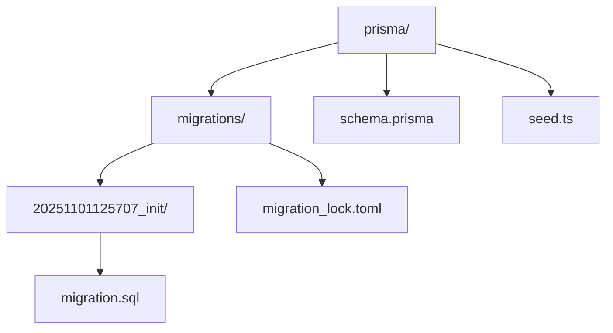
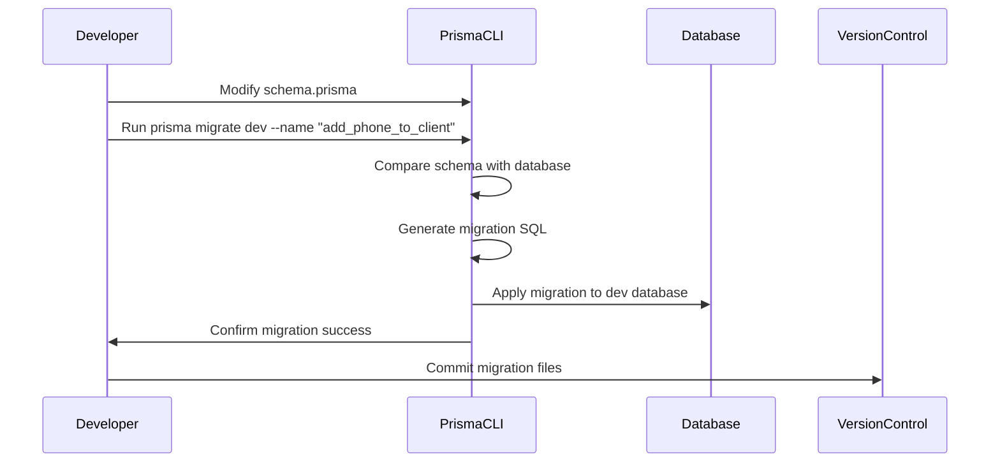
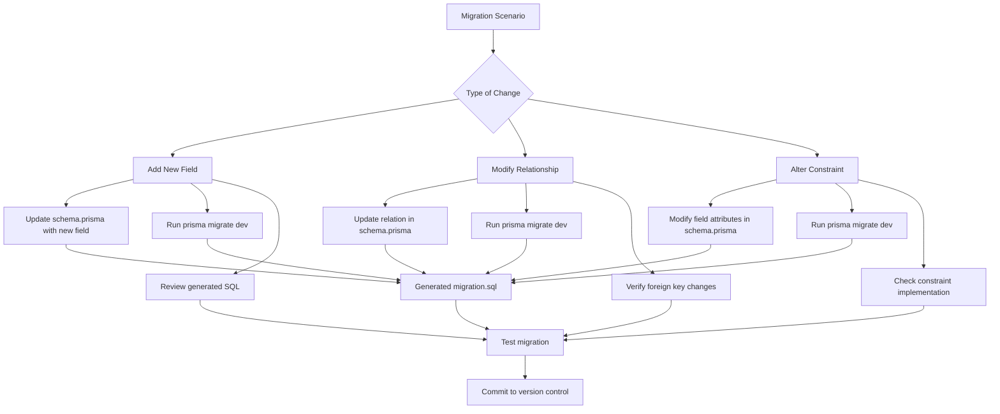

# Database Migrations

<cite>
**Referenced Files in This Document**   
- [schema.prisma](file://prisma/schema.prisma)
- [migration_lock.toml](file://prisma/migrations/migration_lock.toml)
- [migration.sql](file://prisma/migrations/20251101125707_init/migration.sql)
- [prisma.config.ts](file://prisma.config.ts)
- [package.json](file://package.json)
- [seed.ts](file://prisma/seed.ts)
</cite>

## Table of Contents
1. [Introduction](#introduction)
2. [Migration Directory Structure](#migration-directory-structure)
3. [Migration File Structure](#migration-file-structure)
4. [Creating New Migrations](#creating-new-migrations)
5. [Applying Migrations in Production](#applying-migrations-in-production)
6. [Common Migration Scenarios](#common-migration-scenarios)
7. [Migration Best Practices](#migration-best-practices)
8. [Team Collaboration and Conflict Resolution](#team-collaboration-and-conflict-resolution)
9. [Migration Lock File](#migration-lock-file)
10. [Database Schema Overview](#database-schema-overview)

## Introduction
This document provides comprehensive documentation for the database migration workflow in the smmm-system using Prisma Migrate. The system uses Prisma as an ORM and database migration tool to manage schema changes in a structured and version-controlled manner. The migration process ensures that database schema changes are tracked, versioned, and can be consistently applied across different environments (development, staging, production). This documentation covers the complete workflow from creating new migrations to deploying them in production, including best practices for team collaboration and conflict resolution.

**Section sources**
- [schema.prisma](file://prisma/schema.prisma)
- [prisma.config.ts](file://prisma.config.ts)

## Migration Directory Structure
The database migrations are organized in the `prisma/migrations/` directory, which contains timestamped subdirectories for each migration. The current structure includes an initial migration directory named `20251101125707_init` that was created when the database schema was first initialized. Each migration directory contains a `migration.sql` file that includes the SQL statements to implement the schema changes. The migrations are applied in chronological order based on their directory names, which use timestamps to ensure proper sequencing. This directory structure is automatically managed by Prisma Migrate and should be included in version control to ensure all team members have access to the complete migration history.



**Diagram sources**
- [prisma.config.ts](file://prisma.config.ts#L4-L6)
- [schema.prisma](file://prisma/schema.prisma#L1-L10)

**Section sources**
- [prisma.config.ts](file://prisma.config.ts#L4-L6)
- [schema.prisma](file://prisma/schema.prisma#L1-L10)

## Migration File Structure
Each migration consists of a SQL file (`migration.sql`) that contains the database schema changes implemented as SQL statements. The migration file includes both schema modifications (CREATE TABLE, ALTER TABLE, etc.) and relationship definitions (ADD FOREIGN KEY). The SQL statements are organized in a logical sequence that ensures dependencies are created before they are referenced. Each migration file begins with table creation statements followed by foreign key constraints that establish relationships between tables. The migration files are designed to be idempotent and can be safely applied multiple times without causing errors. The SQL syntax is specific to MySQL, as indicated by the database provider configuration, and includes MySQL-specific features such as `DEFAULT CHARACTER SET utf8mb4 COLLATE utf8mb4_unicode_ci`.

**Section sources**
- [migration.sql](file://prisma/migrations/20251101125707_init/migration.sql#L1-L450)

## Creating New Migrations
New migrations are created using the `prisma migrate dev` command, which compares the current Prisma schema (`schema.prisma`) with the database schema and generates a new migration file with the necessary SQL statements to synchronize them. When a developer makes changes to the Prisma schema by adding new models, modifying existing fields, or changing relationships, they can create a new migration by running this command. The process involves three main steps: (1) modifying the Prisma schema file with the desired changes, (2) running `prisma migrate dev` with a descriptive name for the migration, and (3) reviewing the generated SQL to ensure it correctly implements the intended changes. The migration name should be descriptive and follow a consistent naming convention to facilitate understanding of the migration's purpose.



**Diagram sources**
- [schema.prisma](file://prisma/schema.prisma#L1-L434)
- [package.json](file://package.json#L5-L10)

**Section sources**
- [schema.prisma](file://prisma/schema.prisma#L1-L434)
- [package.json](file://package.json#L5-L10)

## Applying Migrations in Production
Production migrations are applied using the `prisma migrate deploy` command, which is designed for safe deployment in production environments. Unlike the development command, `prisma migrate deploy` does not make changes to the Prisma schema file or generate new migrations. Instead, it applies all pending migrations from the migrations directory to the production database. This command is typically run as part of the deployment pipeline after the application code has been deployed. The process ensures that the database schema is updated to match the requirements of the new application version. Before applying migrations in production, it is recommended to first test them in a staging environment that closely mirrors the production setup to identify any potential issues.

**Section sources**
- [package.json](file://package.json#L5-L10)
- [prisma.config.ts](file://prisma.config.ts#L8-L10)

## Common Migration Scenarios
The system supports various common migration scenarios that developers may encounter during development. These include adding new fields to existing models, modifying relationships between models, and altering constraints such as unique indexes or default values. For example, adding a new field to the Client model would involve updating the Prisma schema to include the new field, then creating a migration that adds the corresponding column to the database table. Modifying relationships might involve changing the onDelete behavior of a foreign key or creating a new many-to-many relationship between models. Altering constraints could include adding a unique constraint to prevent duplicate values or changing the default value of a field. Each of these scenarios is handled through the standard migration workflow, ensuring that changes are properly tracked and can be rolled back if necessary.



**Diagram sources**
- [schema.prisma](file://prisma/schema.prisma#L1-L434)
- [migration.sql](file://prisma/migrations/20251101125707_init/migration.sql#L1-L450)

**Section sources**
- [schema.prisma](file://prisma/schema.prisma#L1-L434)
- [migration.sql](file://prisma/migrations/20251101125707_init/migration.sql#L1-L450)

## Migration Best Practices
The following best practices are recommended for effective database migration management in the smmm-system:

1. **Descriptive Migration Names**: Use clear, descriptive names for migrations that accurately reflect the changes being made (e.g., "add_phone_to_client" rather than "update_client_model").

2. **Small, Focused Migrations**: Create migrations that implement a single logical change rather than combining multiple unrelated changes in one migration.

3. **Test Migrations Thoroughly**: Always test migrations in a development environment before committing them, and test again in a staging environment before applying to production.

4. **Backup Before Production Migrations**: Always create a database backup before applying migrations to production to enable rollback if issues occur.

5. **Review Generated SQL**: Carefully review the SQL generated by Prisma Migrate to ensure it correctly implements the intended changes and doesn't include unexpected alterations.

6. **Handle Data Migrations Separately**: For migrations that require data transformation, implement the data migration logic in separate seed scripts rather than in the schema migration.

7. **Document Breaking Changes**: Clearly document any breaking changes in migrations that might affect application code or require coordination with other team members.

**Section sources**
- [schema.prisma](file://prisma/schema.prisma#L1-L434)
- [seed.ts](file://prisma/seed.ts#L1-L222)

## Team Collaboration and Conflict Resolution
Team collaboration on database migrations requires careful coordination to prevent conflicts. When multiple developers are working on different features that require database changes, migration conflicts can occur when their changes affect the same models or when they create migrations simultaneously. To resolve migration conflicts, the team should follow these practices:

1. **Regular Syncing**: Team members should regularly pull the latest changes from the main branch to stay updated on recent migrations.

2. **Communication**: Developers should communicate their planned schema changes to avoid overlapping modifications.

3. **Conflict Resolution Process**: When migration conflicts occur, the team should:
   - Identify the conflicting migrations based on their timestamps
   - Determine the correct order for applying the migrations
   - Manually merge the schema changes if necessary
   - Test the combined migrations thoroughly

4. **Migration Order**: The timestamp-based naming ensures that migrations are applied in the correct order, but developers should be aware of logical dependencies between schema changes.

5. **Code Reviews**: All migration files should undergo code review before being merged to catch potential issues early.

**Section sources**
- [schema.prisma](file://prisma/schema.prisma#L1-L434)
- [prisma.config.ts](file://prisma.config.ts#L1-L12)

## Migration Lock File
The `migration_lock.toml` file is an important component of the Prisma migration system that ensures consistency across environments. This file is automatically generated and should be committed to version control. It contains metadata about the migration system configuration, including the database provider (MySQL in this case). The lock file prevents accidental changes to the migration setup and ensures that all team members use the same migration configuration. It also helps prevent conflicts by recording the state of the migration system. The file includes a comment indicating that it should not be edited manually and should be included in the version control system. This file works in conjunction with the migration directories to provide a complete picture of the database schema evolution.

**Section sources**
- [migration_lock.toml](file://prisma/migrations/migration_lock.toml#L1-L4)

## Database Schema Overview
The database schema in smmm-system is defined in the `schema.prisma` file and includes a comprehensive set of models that support the application's functionality. The schema includes user authentication models (User, Account, Session), client management models (Client, Declaration, Collection), content management models (HeroSection, Service, PricingPlan), and various business models (JobApplication, QuoteRequest, ContactMessage). The models are interconnected through relationships that maintain data integrity and enable efficient querying. The schema uses MySQL as the database provider and includes appropriate field types, constraints, and indexes to optimize performance. The initial migration created all these tables and their relationships, establishing the foundation for the application's data storage.

```mermaid
erDiagram
User ||--o{ Client : "1-to-1"
User ||--o{ Account : "1-to-many"
User ||--o{ Session : "1-to-many"
User ||--o{ Message : "1-to-many"
Client ||--o{ Declaration : "1-to-many"
Client ||--o{ Collection : "1-to-many"
Client ||--o{ AnnouncementClient : "1-to-many"
Announcement ||--o{ AnnouncementClient : "1-to-many"
FAQCategory ||--o{ FAQ : "1-to-many"
PricingPlan ||--o{ PricingFeature : "1-to-many"
AboutSection ||--o{ AboutFeature : "1-to-many"
JobApplication ||--o{ JobApplicationStatus : "uses enum"
QuoteRequest ||--o{ QuoteStatus : "uses enum"
ContactMessage ||--o{ ContactMessageStatus : "uses enum"
User {
String id PK
String? name
String email UK
DateTime? emailVerified
String password
Role role
String? image
DateTime createdAt
DateTime updatedAt
}
Client {
String id PK
String userId UK
String companyName
String taxNumber UK
String? phone
String? address
DateTime createdAt
DateTime updatedAt
}
Announcement {
String id PK
String title
String message
AnnouncementType type
Boolean targetAll
DateTime createdAt
DateTime updatedAt
}
JobApplication {
String id PK
String name
String email
String phone
String position
String experience
String education
String? coverLetter
String? cvFileName
String? cvFileData
String? cvMimeType
JobApplicationStatus status
DateTime createdAt
DateTime updatedAt
}
```

**Diagram sources**
- [schema.prisma](file://prisma/schema.prisma#L1-L434)
- [migration.sql](file://prisma/migrations/20251101125707_init/migration.sql#L1-L450)

**Section sources**
- [schema.prisma](file://prisma/schema.prisma#L1-L434)
- [migration.sql](file://prisma/migrations/20251101125707_init/migration.sql#L1-L450)