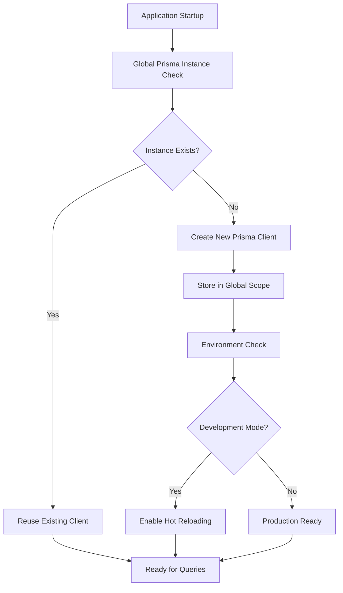
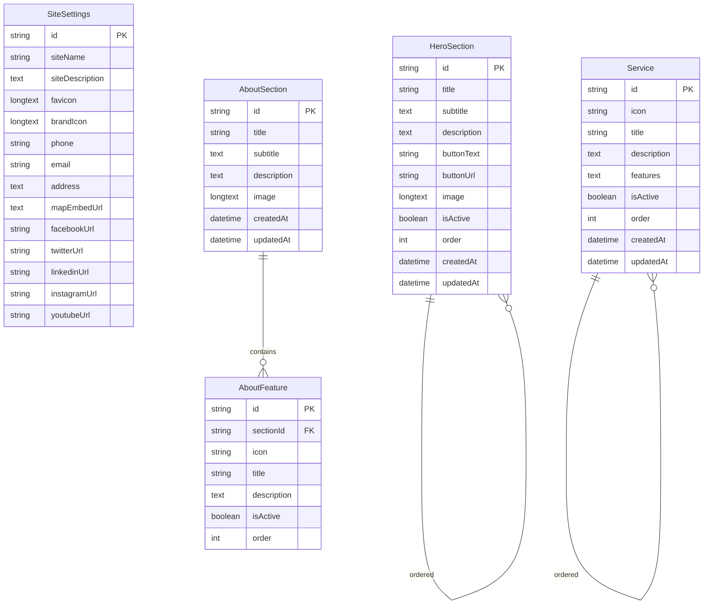
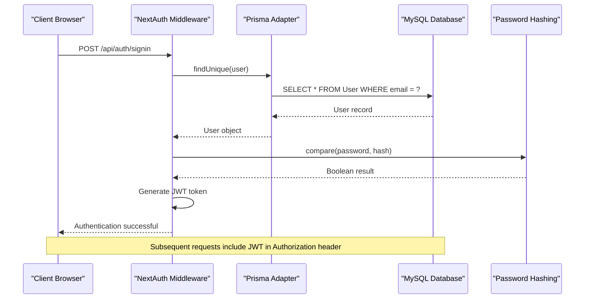
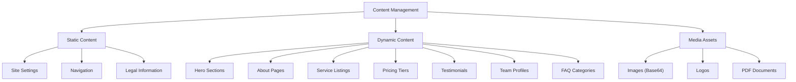
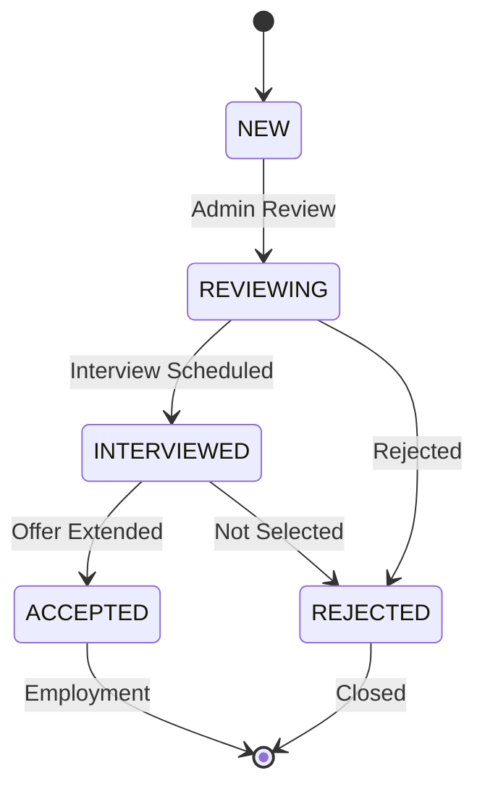
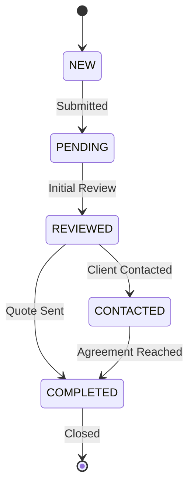
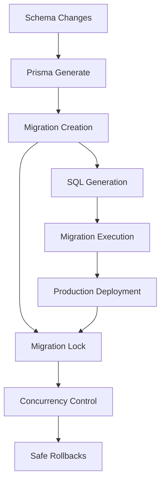
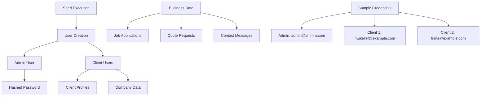
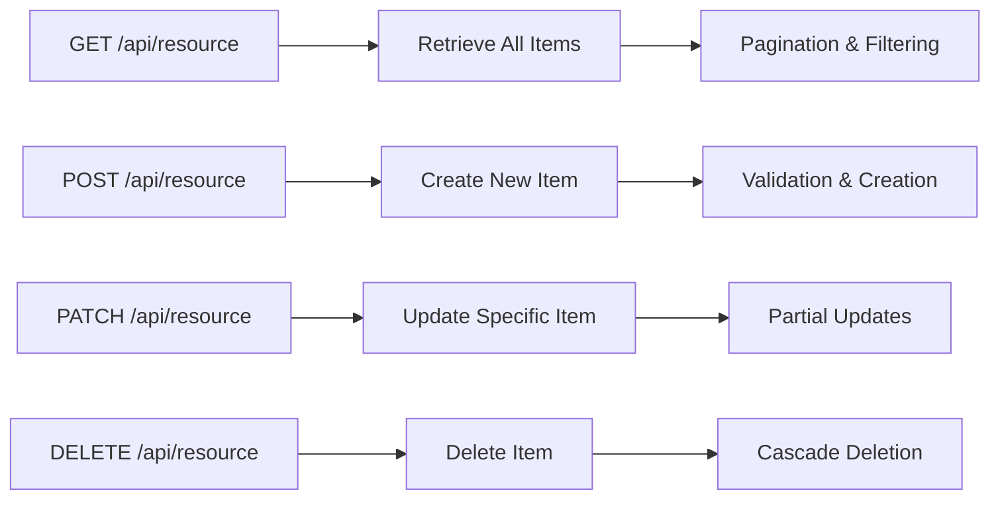

# Database and ORM

<cite>
**Referenced Files in This Document**
- [prisma/schema.prisma](file://prisma/schema.prisma)
- [src/lib/prisma.ts](file://src/lib/prisma.ts)
- [src/lib/db.ts](file://src/lib/db.ts)
- [prisma/seed.ts](file://prisma/seed.ts)
- [prisma/migrations/20251101125707_init/migration.sql](file://prisma/migrations/20251101125707_init/migration.sql)
- [src/app/api/auth/[...nextauth]/route.ts](file://src/app/api/auth/[...nextauth]/route.ts)
- [src/lib/auth.ts](file://src/lib/auth.ts)
- [src/app/api/contact-messages/route.ts](file://src/app/api/contact-messages/route.ts)
- [src/app/api/job-applications/route.ts](file://src/app/api/job-applications/route.ts)
- [src/app/api/quote-requests/route.ts](file://src/app/api/quote-requests/route.ts)
- [src/app/api/content/hero/route.ts](file://src/app/api/content/hero/route.ts)
- [src/app/api/content/about/route.ts](file://src/app/api/content/about/route.ts)
- [package.json](file://package.json)
- [prisma.config.ts](file://prisma.config.ts)
</cite>

## Table of Contents
1. [Introduction](#introduction)
2. [Prisma ORM Configuration](#prisma-orm-configuration)
3. [Database Schema Design](#database-schema-design)
4. [Data Models Overview](#data-models-overview)
5. [Authentication and User Management](#authentication-and-user-management)
6. [Content Management System](#content-management-system)
7. [Business Data Models](#business-data-models)
8. [Database Connection Management](#database-connection-management)
9. [Migration Workflow](#migration-workflow)
10. [Data Seeding Process](#data-seeding-process)
11. [Performance Considerations](#performance-considerations)
12. [Data Validation and Business Logic](#data-validation-and-business-logic)
13. [API Integration Patterns](#api-integration-patterns)
14. [Troubleshooting Guide](#troubleshooting-guide)
15. [Conclusion](#conclusion)

## Introduction

The smmm-system utilizes Prisma ORM as its primary database abstraction layer, providing a robust and type-safe foundation for managing relational data. Built on MySQL, the system implements a comprehensive data model architecture supporting administrative functions, content management, and business operations for a financial consulting firm.

Prisma serves as the central orchestrator for database operations, offering automatic schema generation, type-safe queries, and seamless migration management. The system employs a modular approach where database connections are managed globally, ensuring optimal performance across serverless and traditional hosting environments.

## Prisma ORM Configuration

### Client Initialization

The Prisma client is configured with singleton pattern implementation to prevent connection leaks and ensure efficient resource utilization. Both [`src/lib/prisma.ts`](file://src/lib/prisma.ts) and [`src/lib/db.ts`](file://src/lib/db.ts) implement identical initialization patterns.



**Diagram sources**
- [src/lib/prisma.ts](file://src/lib/prisma.ts#L1-L9)
- [src/lib/db.ts](file://src/lib/db.ts#L1-L9)

### Environment Configuration

The database connection utilizes environment variables for secure credential management. The configuration supports both development and production environments with appropriate connection pooling and timeout settings.

**Section sources**
- [src/lib/prisma.ts](file://src/lib/prisma.ts#L1-L9)
- [src/lib/db.ts](file://src/lib/db.ts#L1-L9)
- [prisma.config.ts](file://prisma.config.ts#L1-L12)

## Database Schema Design

### Core Architecture Principles

The database schema follows Domain-Driven Design principles with clear separation of concerns. The schema encompasses four primary domains:

1. **Authentication & Authorization** - User management and access control
2. **Content Management** - Dynamic website content and media
3. **Business Operations** - Client interactions and service requests
4. **Financial Administration** - Tax returns and payment tracking

### Database Structure Overview

```mermaid
erDiagram
User {
string id PK
string name
string email UK
datetime emailVerified
string password
enum role
longtext image
datetime createdAt
datetime updatedAt
}
Client {
string id PK
string userId UK FK
string companyName
string taxNumber UK
string phone
text address
datetime createdAt
datetime updatedAt
}
Announcement {
string id PK
string title
text message
enum type
boolean targetAll
datetime createdAt
datetime updatedAt
}
AnnouncementClient {
string id PK
string announcementId FK
string clientId FK
boolean read
}
Declaration {
string id PK
string clientId FK
string period
string title
string pdfUrl
datetime uploadedAt
datetime updatedAt
}
Collection {
string id PK
string clientId FK
decimal amount
enum type
datetime date
text note
datetime createdAt
datetime updatedAt
}
User ||--|| Client : "has"
User ||--o{ Account : "authenticates"
User ||--o{ Session : "maintains"
Client ||--o{ Declaration : "submits"
Client ||--o{ Collection : "tracks"
Client ||--o{ AnnouncementClient : "receives"
Announcement ||--o{ AnnouncementClient : "targets"
```

**Diagram sources**
- [prisma/schema.prisma](file://prisma/schema.prisma#L1-L434)

**Section sources**
- [prisma/schema.prisma](file://prisma/schema.prisma#L1-L434)

## Data Models Overview

### Authentication Models

The authentication system implements a comprehensive user management framework built on NextAuth.js with Prisma adapter integration.

#### User Model
The core User model supports both administrative and client roles with comprehensive profile management capabilities.

| Field | Type | Constraints | Description |
|-------|------|-------------|-------------|
| id | String | Primary Key, auto-generated | Unique user identifier |
| name | String | Nullable | User's full name |
| email | String | Unique, Not Null | Email address for authentication |
| emailVerified | DateTime | Nullable | Timestamp of email verification |
| password | String | Not Null | BCrypt hashed password |
| role | Enum | Default: CLIENT | User role classification |
| image | LongText | Nullable | Profile image data (Base64) |
| createdAt | DateTime | Default: now() | Record creation timestamp |
| updatedAt | DateTime | Auto-updated | Last modification timestamp |

#### Extended Authentication Models
- **Account**: OAuth and social authentication providers
- **Session**: JWT-based session management
- **VerificationToken**: Email verification and password reset tokens

### Content Management Models

The CMS system provides flexible content management with hierarchical relationships and ordering capabilities.

#### Media and Content Models
- **HeroSection**: Homepage hero banner with image and call-to-action
- **ClientLogo**: Partner and client logos with branding assets
- **AboutSection**: Company information with feature blocks
- **Service**: Service offerings with detailed descriptions
- **WorkflowStep**: Process steps for service delivery
- **PricingPlan**: Subscription and service pricing tiers
- **Testimonial**: Customer feedback and ratings
- **TeamMember**: Staff profiles and contact information
- **FAQCategory & FAQ**: Frequently asked questions organization

#### Content Relationship Patterns


**Diagram sources**
- [prisma/schema.prisma](file://prisma/schema.prisma#L200-L350)

### Business Data Models

#### Client Management
The Client model establishes the foundation for business operations, linking users to their organizational data.

| Field | Type | Constraints | Purpose |
|-------|------|-------------|---------|
| id | String | Primary Key | Unique client identifier |
| userId | String | Foreign Key, Unique | Associated user account |
| companyName | String | Not Null | Legal business name |
| taxNumber | String | Unique, Not Null | Tax identification number |
| phone | String | Nullable | Contact telephone number |
| address | Text | Nullable | Physical business address |

#### Financial Operations
- **Declaration**: Tax return submissions with PDF attachments
- **Collection**: Income and expense tracking with monetary precision
- **Reminder**: Task and deadline management system

#### Communication Models
- **Message**: Internal client-admin communication
- **ContactMessage**: Public contact form submissions
- **QuoteRequest**: Service quotation inquiries
- **JobApplication**: Career opportunity applications

**Section sources**
- [prisma/schema.prisma](file://prisma/schema.prisma#L40-L200)

## Authentication and User Management

### NextAuth.js Integration

The authentication system leverages NextAuth.js with Prisma adapter for seamless user management and session handling.



**Diagram sources**
- [src/lib/auth.ts](file://src/lib/auth.ts#L20-L50)
- [src/app/api/auth/[...nextauth]/route.ts](file://src/app/api/auth/[...nextauth]/route.ts#L1-L3)

### Role-Based Access Control

The system implements a two-tier role system with comprehensive access controls:

- **ADMIN**: Full system administration, content management, and user oversight
- **CLIENT**: Limited access to personal data, service requests, and profile management

### Password Security

All passwords undergo BCrypt hashing with configurable cost factors, ensuring robust protection against brute force attacks while maintaining reasonable performance characteristics.

**Section sources**
- [src/lib/auth.ts](file://src/lib/auth.ts#L1-L87)
- [src/app/api/auth/[...nextauth]/route.ts](file://src/app/api/auth/[...nextauth]/route.ts#L1-L3)

## Content Management System

### Dynamic Content Architecture

The CMS system provides granular control over website content with real-time editing capabilities and content versioning support.

#### Content Organization Strategy


#### Content Persistence Patterns

The system employs sophisticated content persistence strategies:

1. **Structured Content**: JSON-based feature arrays for flexible data representation
2. **Binary Assets**: Base64 encoding for small media files (images, logos)
3. **External References**: URLs for larger media assets and documents
4. **Temporal Ordering**: Integer-based ordering for content sequence management

### Media Asset Management

Large binary assets are handled through Base64 encoding within the database, balancing storage convenience with performance considerations. The system supports various media types including images, logos, and PDF documents.

**Section sources**
- [src/app/api/content/hero/route.ts](file://src/app/api/content/hero/route.ts#L1-L88)
- [src/app/api/content/about/route.ts](file://src/app/api/content/about/route.ts#L1-L190)

## Business Data Models

### Client Interaction Management

The business data models form the operational backbone of the system, managing client relationships, service requests, and financial transactions.

#### Job Application System


#### Quote Request Lifecycle


#### Contact Message Processing
The contact message system provides comprehensive customer support with status tracking and automated response capabilities.

### Financial Data Management

#### Tax Declaration Tracking
The Declaration model supports comprehensive tax return management with PDF attachment capabilities and period-based organization.

#### Payment Collection System
The Collection model implements dual-purpose accounting with income and expense categorization, supporting both cash flow monitoring and financial reporting.

**Section sources**
- [src/app/api/job-applications/route.ts](file://src/app/api/job-applications/route.ts#L1-L130)
- [src/app/api/quote-requests/route.ts](file://src/app/api/quote-requests/route.ts#L1-L99)
- [src/app/api/contact-messages/route.ts](file://src/app/api/contact-messages/route.ts#L1-L97)

## Database Connection Management

### Connection Pooling Strategy

The Prisma client implements intelligent connection management with environment-aware configuration:

#### Development Environment
- Singleton pattern prevents connection leaks during hot reloading
- Global scope ensures consistent client instances
- Automatic cleanup on server restart

#### Production Environment
- Optimized connection pooling for high-throughput scenarios
- Graceful degradation under load
- Connection health monitoring

### Performance Optimization

The connection management strategy incorporates several performance optimization techniques:

1. **Connection Reuse**: Single client instance across application lifecycle
2. **Lazy Initialization**: Prisma client instantiated only when needed
3. **Memory Management**: Proper cleanup in development mode
4. **Resource Efficiency**: Minimal overhead for database operations

**Section sources**
- [src/lib/prisma.ts](file://src/lib/prisma.ts#L1-L10)
- [src/lib/db.ts](file://src/lib/db.ts#L1-L10)

## Migration Workflow

### Migration Architecture

The system employs Prisma's declarative migration system for database schema evolution:



**Diagram sources**
- [prisma/migrations/20251101125707_init/migration.sql](file://prisma/migrations/20251101125707_init/migration.sql#L1-L450)

### Migration Process

The migration workflow follows a structured approach:

1. **Schema Modification**: Update [`prisma/schema.prisma`](file://prisma/schema.prisma) with desired changes
2. **Code Generation**: Run `prisma generate` to update TypeScript types
3. **Migration Creation**: Execute `prisma migrate dev` to create SQL scripts
4. **Testing**: Validate changes in development environment
5. **Deployment**: Apply migrations to production database
6. **Validation**: Verify data integrity and application functionality

### Production Safety Measures

The migration system incorporates several safety mechanisms:

- **Migration Lock**: Prevents concurrent migration attempts
- **Rollback Capabilities**: Enables safe change reversal
- **Data Preservation**: Maintains existing data during schema updates
- **Foreign Key Integrity**: Ensures referential consistency

**Section sources**
- [prisma/migrations/20251101125707_init/migration.sql](file://prisma/migrations/20251101125707_init/migration.sql#L1-L450)
- [prisma.config.ts](file://prisma.config.ts#L1-L12)

## Data Seeding Process

### Seed Script Architecture

The data seeding process provides comprehensive initial dataset creation with realistic business scenarios:



**Diagram sources**
- [prisma/seed.ts](file://prisma/seed.ts#L1-L222)

### Sample Data Structure

The seed script creates comprehensive sample data across all business domains:

#### Administrative Accounts
- **Admin User**: Full system access with hashed password
- **Client Users**: Two representative business accounts with complete profile data

#### Business Operations Data
- **Job Applications**: Four realistic applications with CV attachments
- **Quote Requests**: Four service inquiry records with varying statuses
- **Contact Messages**: Four customer inquiries with resolution tracking

#### Realistic Data Patterns
The seed data demonstrates realistic business scenarios:
- Varied application statuses reflecting typical hiring processes
- Different service types representing diverse client needs
- Realistic timing patterns for business operations

**Section sources**
- [prisma/seed.ts](file://prisma/seed.ts#L1-L222)

## Performance Considerations

### Indexing Strategies

The database schema implements comprehensive indexing for optimal query performance:

#### Primary Key Indexes
- All tables utilize UUID-based primary keys for distributed system compatibility
- Composite indexes for frequently queried relationship pairs

#### Unique Constraints
- Email addresses for user authentication
- Tax numbers for client identification
- Provider-account combinations for OAuth integrations

#### Foreign Key Indexes
- Automatic indexing on foreign key relationships
- Cascading operations for referential integrity

### Query Optimization

#### Connection Pooling
The Prisma client manages connection pools efficiently:
- Configurable pool sizes based on application requirements
- Automatic connection recycling
- Health checks for connection validity

#### Query Patterns
- Batch operations for bulk data processing
- Selective field projection to minimize data transfer
- Efficient pagination for large datasets

### Memory Management

#### Client Lifecycle
- Singleton pattern prevents memory leaks
- Global scope management for development environments
- Proper cleanup during application shutdown

#### Data Serialization
- Efficient JSON serialization for complex data structures
- Base64 encoding optimization for binary data
- Lazy loading for large content assets

### Scalability Considerations

#### Horizontal Scaling
- Stateless Prisma client design
- Database connection management independent of application instances
- Load balancer friendly architecture

#### Vertical Scaling
- Optimized queries for high-volume operations
- Efficient indexing for complex joins
- Caching strategies for frequently accessed data

## Data Validation and Business Logic

### Database-Level Constraints

The schema implements comprehensive validation rules at the database level:

#### Data Integrity Rules
- **Required Fields**: All mandatory fields marked as NOT NULL
- **Unique Constraints**: Email addresses, tax numbers, and provider combinations
- **Enum Validation**: Restricted value sets for status and type fields
- **Format Validation**: Email format enforcement and phone number standards

#### Business Logic Enforcement
- **Role-Based Access**: User permissions controlled through role enumeration
- **Status Transitions**: Valid state changes for business processes
- **Financial Constraints**: Decimal precision for monetary values
- **Temporal Consistency**: Created/updated timestamp management

### Application-Level Validation

#### Input Sanitization
- Form validation for web interfaces
- File type checking for uploads
- Size limitations for attachments
- Content filtering for user-generated data

#### Business Rule Implementation
- **Client Creation**: Automatic user association during client registration
- **Status Management**: Controlled state transitions for business processes
- **File Processing**: Base64 encoding for binary data storage
- **Relationship Validation**: Foreign key constraint enforcement

### Error Handling Strategy

The system implements comprehensive error handling across multiple layers:

1. **Database Layer**: Constraint violations and connection errors
2. **Prisma Layer**: Query execution failures and type mismatches
3. **Application Layer**: Business logic validation and processing errors
4. **API Layer**: HTTP status codes and error responses

**Section sources**
- [prisma/schema.prisma](file://prisma/schema.prisma#L1-L434)
- [src/app/api/job-applications/route.ts](file://src/app/api/job-applications/route.ts#L30-L50)

## API Integration Patterns

### CRUD Operation Patterns

The system implements consistent API patterns across all data models:

#### Standardized Endpoints


#### Request/Response Patterns
- **GET**: Support for sorting, filtering, and pagination
- **POST**: Comprehensive validation with error reporting
- **PATCH**: Partial updates with selective field modification
- **DELETE**: Soft deletion with cascade handling

### File Upload Management

The system handles file uploads through specialized endpoints:

#### Job Application CV Processing
- **File Validation**: MIME type checking and size limits
- **Encoding**: Base64 conversion for database storage
- **Metadata**: Original filename and content type preservation
- **Storage**: Binary data stored as Base64 strings

### Authentication Integration

API endpoints integrate seamlessly with the authentication system:

#### Protected Routes
- **Role-Based Access**: Endpoint access controlled by user roles
- **Session Validation**: JWT token verification for all requests
- **Permission Checking**: Granular access control implementation
- **Automatic Refresh**: Token renewal for long-running sessions

**Section sources**
- [src/app/api/contact-messages/route.ts](file://src/app/api/contact-messages/route.ts#L1-L97)
- [src/app/api/job-applications/route.ts](file://src/app/api/job-applications/route.ts#L1-L130)
- [src/app/api/quote-requests/route.ts](file://src/app/api/quote-requests/route.ts#L1-L99)

## Troubleshooting Guide

### Common Issues and Solutions

#### Database Connection Problems
**Symptoms**: Prisma client initialization failures, connection timeouts
**Solutions**:
- Verify DATABASE_URL environment variable configuration
- Check MySQL server accessibility and credentials
- Review connection pool settings and limits
- Validate network connectivity and firewall rules

#### Migration Failures
**Symptoms**: Migration lock errors, schema inconsistencies
**Solutions**:
- Clear migration locks manually if necessary
- Review migration history for conflicts
- Ensure proper backup before major schema changes
- Validate data integrity after migrations

#### Authentication Issues
**Symptoms**: Login failures, session expiration, permission errors
**Solutions**:
- Verify user account existence and activation
- Check password hashing and comparison logic
- Validate JWT token generation and verification
- Review role assignments and permissions

#### Performance Problems
**Symptoms**: Slow query responses, memory leaks, connection exhaustion
**Solutions**:
- Implement proper indexing for frequently queried fields
- Optimize query patterns and reduce data transfer
- Monitor connection pool usage and adjust limits
- Implement caching strategies for static data

### Debugging Tools and Techniques

#### Development Environment
- **Prisma Studio**: Visual database exploration and manipulation
- **Console Logging**: Comprehensive error logging and debugging information
- **Hot Reloading**: Development-friendly Prisma client management
- **TypeScript Validation**: Compile-time error detection and type safety

#### Production Monitoring
- **Error Tracking**: Centralized error reporting and alerting
- **Performance Metrics**: Query timing and resource usage monitoring
- **Health Checks**: Database connectivity and application health verification
- **Audit Logging**: Comprehensive change tracking and compliance support

### Recovery Procedures

#### Data Recovery
- **Backup Restoration**: Automated backup systems for disaster recovery
- **Point-in-Time Recovery**: Transaction log analysis for precise restoration
- **Schema Recovery**: Migration rollback capabilities for schema issues
- **Data Validation**: Integrity checks and data quality assurance

#### System Recovery
- **Graceful Degradation**: Fallback mechanisms for service continuity
- **Circuit Breakers**: Automatic failure isolation and recovery
- **Load Balancing**: Traffic distribution during maintenance windows
- **Monitoring Alerts**: Proactive issue detection and resolution

## Conclusion

The smmm-system database and ORM implementation represents a comprehensive solution for modern web applications requiring robust data management, scalable architecture, and enterprise-grade security. The Prisma ORM integration provides type-safe, efficient database operations while maintaining flexibility for evolving business requirements.

Key strengths of the implementation include:

- **Type Safety**: Comprehensive TypeScript integration ensuring compile-time error detection
- **Scalability**: Well-designed architecture supporting growth and increased load
- **Security**: Multi-layered security approach with authentication, authorization, and data validation
- **Maintainability**: Clean separation of concerns and standardized development patterns
- **Performance**: Optimized queries, efficient indexing, and connection management

The system successfully balances complexity with usability, providing powerful data management capabilities while maintaining developer productivity and application reliability. The comprehensive migration workflow, data seeding process, and performance optimization strategies ensure sustainable long-term operation.

Future enhancements could include advanced caching strategies, distributed database capabilities, and enhanced analytics integration, building upon the solid foundation established by the current implementation.