# Component Styling Strategy

<cite>
**Referenced Files in This Document**
- [components.json](file://components.json)
- [src/components/ui/button.tsx](file://src/components/ui/button.tsx)
- [src/components/ui/card.tsx](file://src/components/ui/card.tsx)
- [src/components/ui/table.tsx](file://src/components/ui/table.tsx)
- [src/components/ui/input.tsx](file://src/components/ui/input.tsx)
- [src/components/ui/form.tsx](file://src/components/ui/form.tsx)
- [src/components/ui/select.tsx](file://src/components/ui/select.tsx)
- [src/components/ui/switch.tsx](file://src/components/ui/switch.tsx)
- [src/components/ui/dialog.tsx](file://src/components/ui/dialog.tsx)
- [src/components/ui/badge.tsx](file://src/components/ui/badge.tsx)
- [src/components/ui/avatar.tsx](file://src/components/ui/avatar.tsx)
- [src/lib/utils.ts](file://src/lib/utils.ts)
- [src/app/globals.css](file://src/app/globals.css)
- [package.json](file://package.json)
- [tsconfig.json](file://tsconfig.json)
</cite>

## Table of Contents
1. [Introduction](#introduction)
2. [Design System Foundation](#design-system-foundation)
3. [Tailwind Utility Classes Architecture](#tailwind-utility-classes-architecture)
4. [Component Variants and Configuration](#component-variants-and-configuration)
5. [Radix UI Integration](#radix-ui-integration)
6. [Accessibility Implementation](#accessibility-implementation)
7. [Component Styling Patterns](#component-styling-patterns)
8. [Creating New Components](#creating-new-components)
9. [Customization Guidelines](#customization-guidelines)
10. [Best Practices](#best-practices)

## Introduction

The smmm-system employs a sophisticated component-level styling approach built on the shadcn/ui design system principles, utilizing Tailwind CSS utility classes for comprehensive visual styling while maintaining consistency and accessibility standards. This documentation explores how UI components in `src/components/ui` leverage Tailwind's utility-first methodology alongside Radix UI primitives to create a cohesive, accessible, and maintainable design system.

The styling strategy emphasizes component reusability, variant-based customization, and adherence to modern web accessibility guidelines through carefully crafted utility class combinations and semantic HTML structures.

## Design System Foundation

### Shadcn/UI Configuration

The design system is configured through the `components.json` file, establishing foundational styling principles and import path aliases:

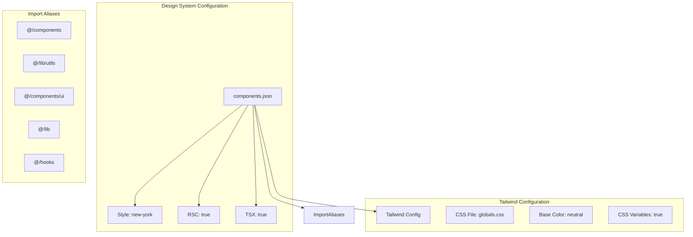

**Diagram sources**
- [components.json](file://components.json#L1-L23)

The configuration establishes:
- **Style Theme**: Uses the "new-york" design system variant
- **TypeScript Support**: Full TSX support with strict typing
- **CSS Variables**: Enables dynamic theming through CSS custom properties
- **Import Path Aliases**: Streamlined import paths for consistent module resolution

**Section sources**
- [components.json](file://components.json#L1-L23)

### Color System and Theming

The color system utilizes OKLCH color space for perceptually uniform color transitions across light and dark themes:

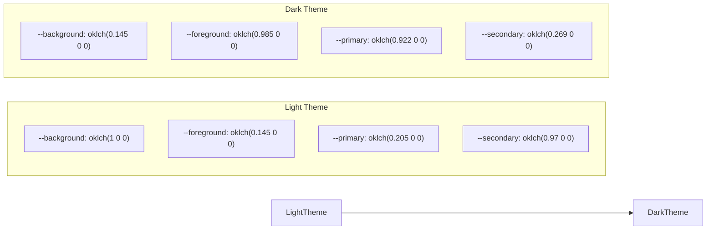

**Diagram sources**
- [src/app/globals.css](file://src/app/globals.css#L35-L80)

**Section sources**
- [src/app/globals.css](file://src/app/globals.css#L35-L123)

## Tailwind Utility Classes Architecture

### Utility Class Composition Pattern

Components employ a sophisticated utility class composition pattern using the `cn` helper function from `src/lib/utils.ts`:

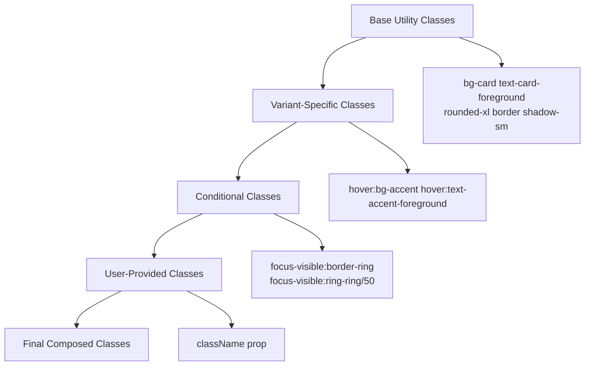

**Diagram sources**
- [src/lib/utils.ts](file://src/lib/utils.ts#L1-L7)
- [src/components/ui/button.tsx](file://src/components/ui/button.tsx#L1-L61)

The `cn` function combines `clsx` and `tailwind-merge` for intelligent class merging, ensuring proper specificity and avoiding conflicts between utility classes.

**Section sources**
- [src/lib/utils.ts](file://src/lib/utils.ts#L1-L7)

### Responsive Design System

The system implements a comprehensive responsive design approach using Tailwind's breakpoint system:

| Breakpoint | Size | Usage |
|------------|------|-------|
| `sm` | 640px | Small tablets |
| `md` | 768px | Tablets |
| `lg` | 1024px | Desktop |
| `xl` | 1280px | Large desktops |
| `2xl` | 1536px | Extra large displays |

**Section sources**
- [src/app/globals.css](file://src/app/globals.css#L1-L123)

## Component Variants and Configuration

### Button Component Variants

The button component demonstrates the class-variance-authority (CVA) pattern for managing component variants:

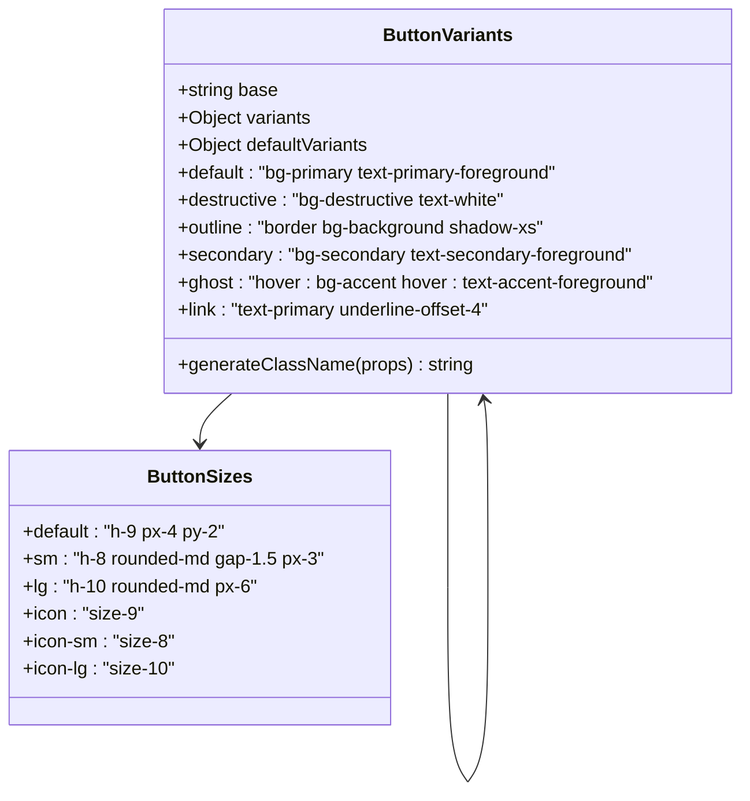

**Diagram sources**
- [src/components/ui/button.tsx](file://src/components/ui/button.tsx#L8-L35)

**Section sources**
- [src/components/ui/button.tsx](file://src/components/ui/button.tsx#L8-L61)

### Card Component Architecture

The card system showcases modular component design with specialized sub-components:

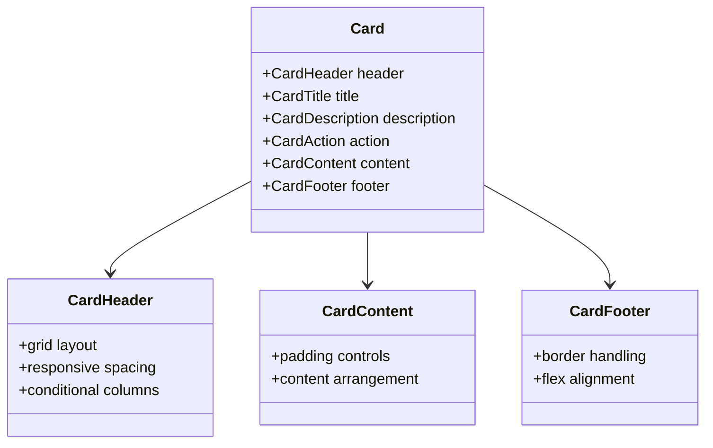

**Diagram sources**
- [src/components/ui/card.tsx](file://src/components/ui/card.tsx#L1-L93)

**Section sources**
- [src/components/ui/card.tsx](file://src/components/ui/card.tsx#L1-L93)

### Table Component Structure

The table component demonstrates advanced utility class patterns for complex layouts:

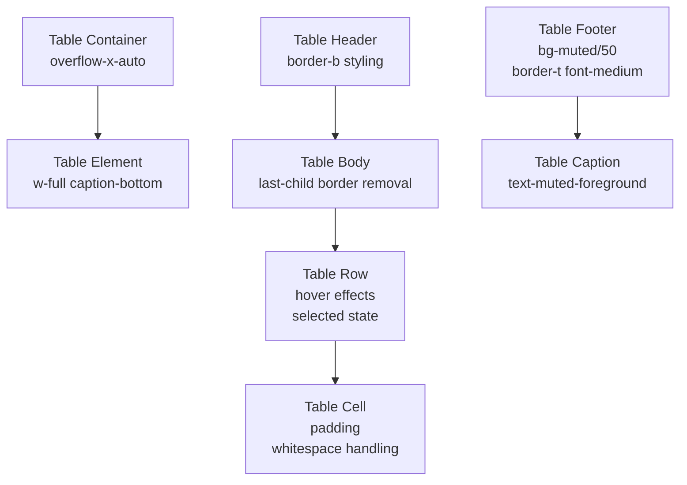

**Diagram sources**
- [src/components/ui/table.tsx](file://src/components/ui/table.tsx#L1-L117)

**Section sources**
- [src/components/ui/table.tsx](file://src/components/ui/table.tsx#L1-L117)

## Radix UI Integration

### Primitive Component Architecture

The system seamlessly integrates Radix UI primitives with Tailwind styling, maintaining semantic HTML structure while enhancing visual presentation:

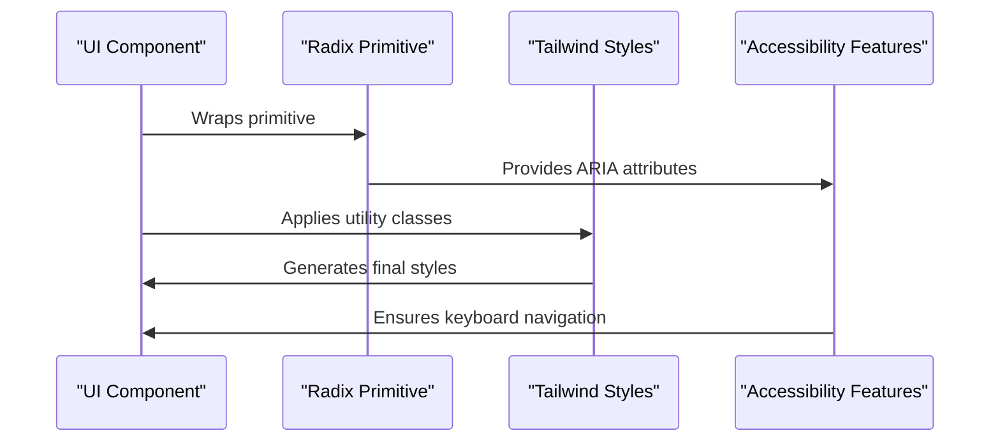

**Diagram sources**
- [src/components/ui/dialog.tsx](file://src/components/ui/dialog.tsx#L1-L159)
- [src/components/ui/select.tsx](file://src/components/ui/select.tsx#L1-L309)

### Focus Management and Accessibility

Components implement comprehensive focus management using Radix UI's focus utilities:

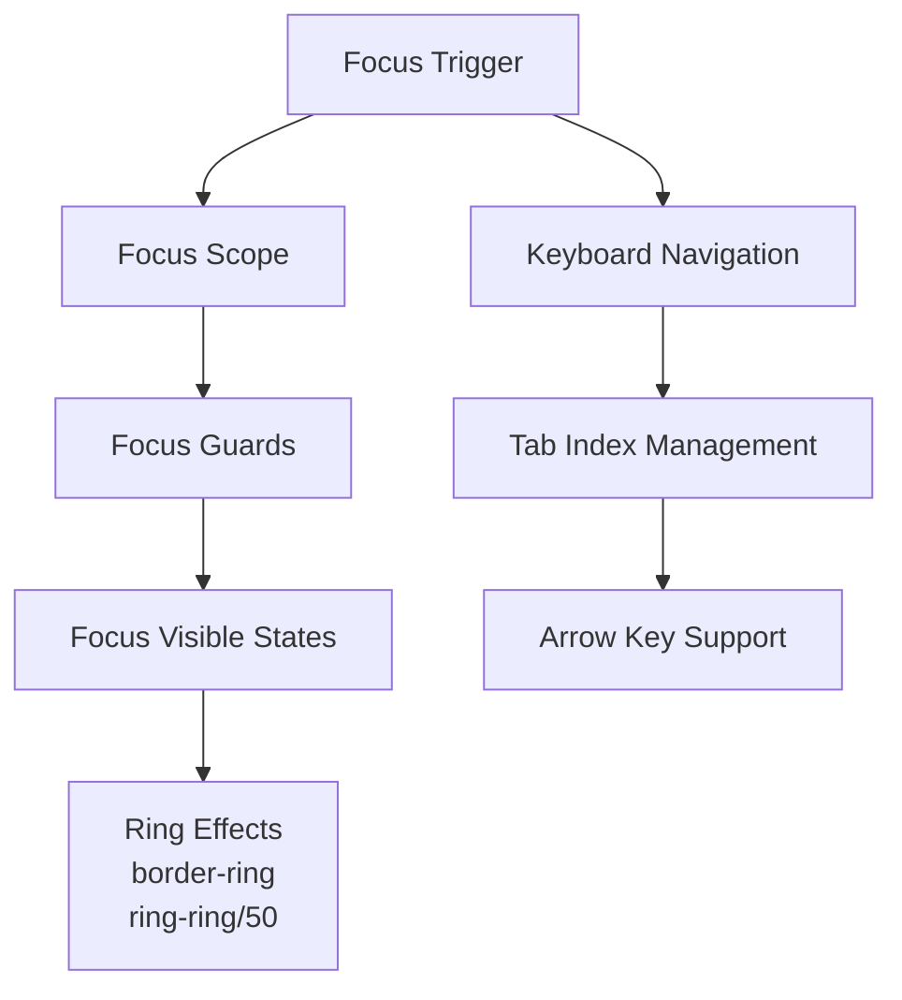

**Diagram sources**
- [src/components/ui/button.tsx](file://src/components/ui/button.tsx#L4-L6)
- [src/components/ui/dialog.tsx](file://src/components/ui/dialog.tsx#L80-L95)

**Section sources**
- [src/components/ui/dialog.tsx](file://src/components/ui/dialog.tsx#L1-L159)

## Accessibility Implementation

### Focus States and Visual Feedback

The system implements comprehensive focus states with appropriate visual feedback:

| Focus State | Light Theme | Dark Theme | Description |
|-------------|-------------|------------|-------------|
| Default Focus | `border-ring` | `border-ring` | Standard focus indication |
| Hover States | `hover:bg-accent` | `hover:bg-accent` | Interactive element feedback |
| Active States | `active:bg-accent` | `active:bg-accent` | Pressed state indication |
| Invalid States | `ring-destructive/20` | `ring-destructive/40` | Error state highlighting |

### Screen Reader Support

Components incorporate ARIA attributes and semantic HTML for optimal screen reader support:

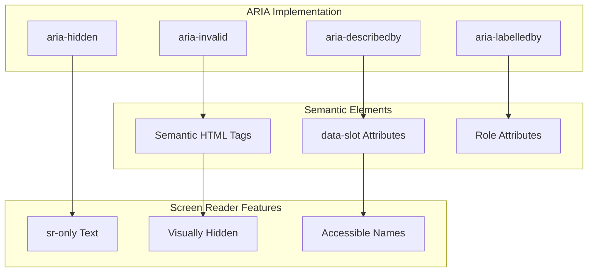

**Diagram sources**
- [src/components/ui/form.tsx](file://src/components/ui/form.tsx#L85-L105)
- [src/components/ui/dialog.tsx](file://src/components/ui/dialog.tsx#L80-L95)

**Section sources**
- [src/components/ui/form.tsx](file://src/components/ui/form.tsx#L85-L167)

### Contrast Ratios and Color Accessibility

The color system ensures WCAG AA compliance for contrast ratios:

| Element Type | Light Theme Ratio | Dark Theme Ratio | Requirement |
|--------------|-------------------|------------------|-------------|
| Text on Background | 4.5:1 | 4.5:1 | WCAG AA |
| Large Text | 3:1 | 3:1 | WCAG AA |
| UI Components | 3:1 | 3:1 | WCAG AA |
| Icons | N/A | N/A | Relative to context |

**Section sources**
- [src/app/globals.css](file://src/app/globals.css#L35-L123)

## Component Styling Patterns

### Form Component Integration

Form components demonstrate advanced accessibility patterns with integrated validation states:

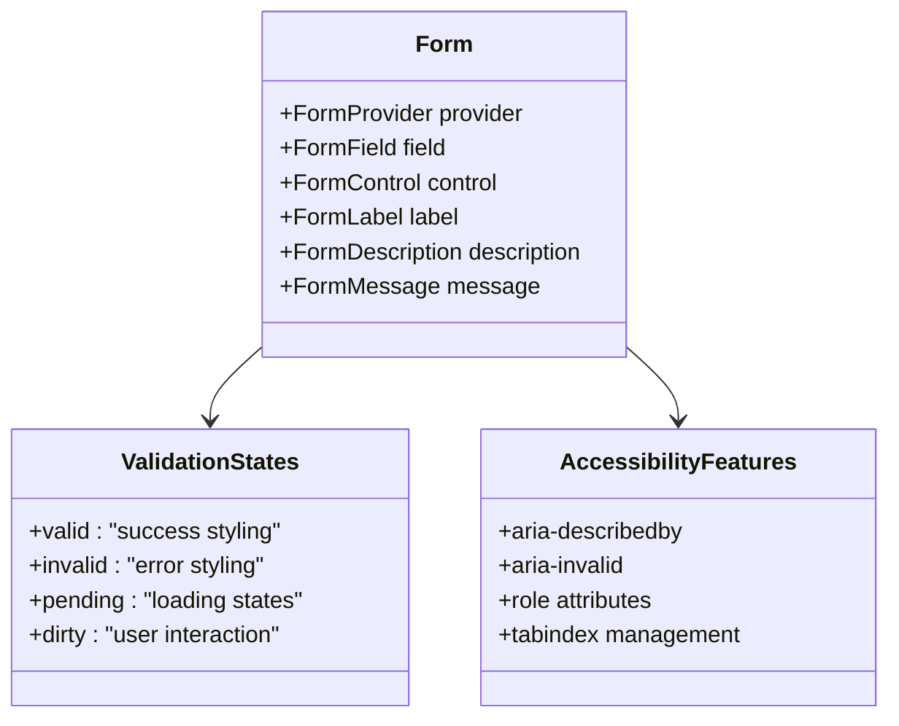

**Diagram sources**
- [src/components/ui/form.tsx](file://src/components/ui/form.tsx#L1-L168)

**Section sources**
- [src/components/ui/form.tsx](file://src/components/ui/form.tsx#L1-L168)

### Input Component Styling

Input components showcase responsive design and state management:

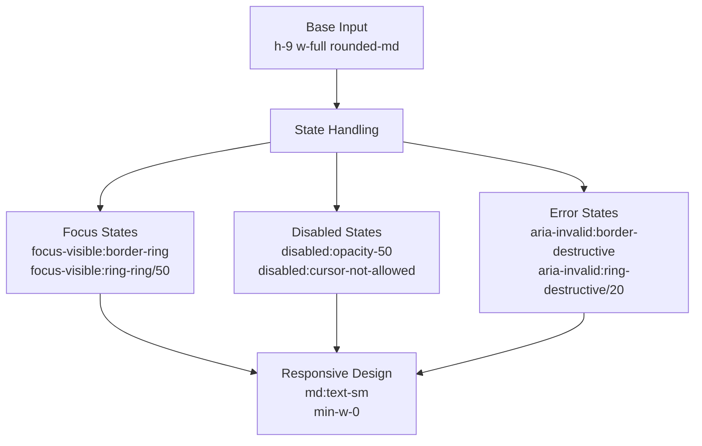

**Diagram sources**
- [src/components/ui/input.tsx](file://src/components/ui/input.tsx#L1-L22)

**Section sources**
- [src/components/ui/input.tsx](file://src/components/ui/input.tsx#L1-L22)

### Select Component Complexity

The select component demonstrates advanced interaction patterns:

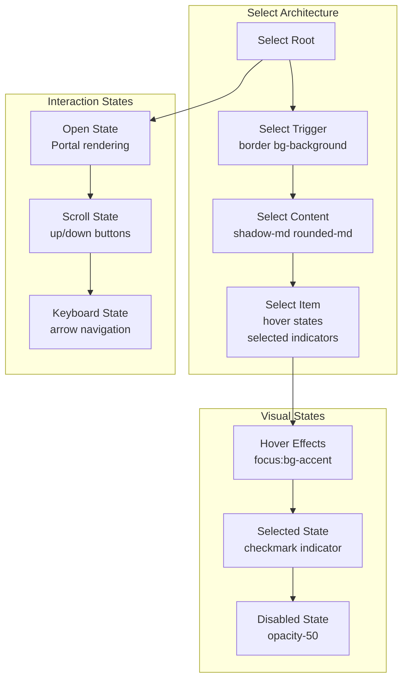

**Diagram sources**
- [src/components/ui/select.tsx](file://src/components/ui/select.tsx#L1-L309)

**Section sources**
- [src/components/ui/select.tsx](file://src/components/ui/select.tsx#L1-L309)

## Creating New Components

### Component Creation Template

When creating new components, follow this template pattern:

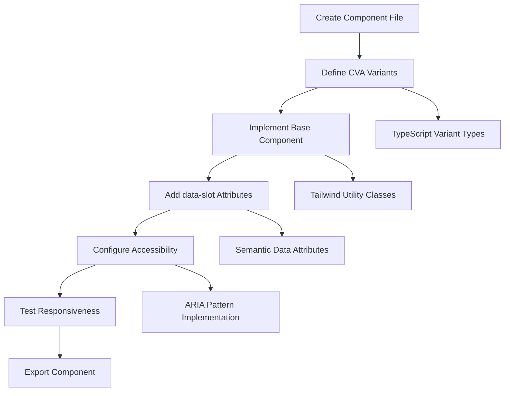

### Naming Conventions

Follow consistent naming conventions for component files and exports:

| Pattern | Example | Purpose |
|---------|---------|---------|
| Component File | `button.tsx` | Clear component identification |
| Variant Types | `ButtonVariants` | TypeScript type safety |
| Default Exports | `Button` | Primary component export |
| Helper Functions | `buttonVariants` | CVA configuration export |

### Utility Class Guidelines

When implementing utility classes:

1. **Base Classes First**: Establish foundation styles
2. **Variant Classes Second**: Add variant-specific modifications
3. **Conditional Classes Third**: Handle state-based variations
4. **User Classes Last**: Allow user customization

**Section sources**
- [src/components/ui/button.tsx](file://src/components/ui/button.tsx#L1-L61)
- [src/components/ui/card.tsx](file://src/components/ui/card.tsx#L1-L93)

## Customization Guidelines

### Theme Customization

Components support theme customization through CSS variables:

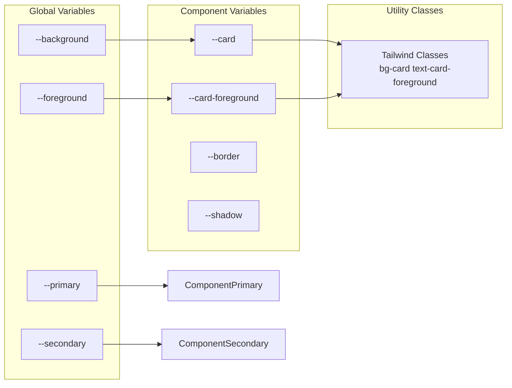

**Diagram sources**
- [src/app/globals.css](file://src/app/globals.css#L35-L80)

### Component Extension Patterns

Extend components while maintaining design consistency:

1. **Composition Over Inheritance**: Use slot pattern for flexibility
2. **Variant Expansion**: Add new variants through CVA configuration
3. **Utility Class Augmentation**: Extend base classes with additional utilities
4. **Accessibility Preservation**: Maintain ARIA attributes and keyboard navigation

**Section sources**
- [src/components/ui/badge.tsx](file://src/components/ui/badge.tsx#L1-L47)
- [src/components/ui/switch.tsx](file://src/components/ui/switch.tsx#L1-L32)

## Best Practices

### Performance Optimization

1. **Utility Class Efficiency**: Minimize redundant utility classes
2. **CSS Variable Usage**: Leverage CSS variables for theme consistency
3. **Bundle Size Management**: Use Tailwind's purge configuration effectively
4. **Component Reusability**: Design components for maximum reuse

### Maintenance Guidelines

1. **Consistent Patterns**: Follow established component patterns
2. **Documentation**: Document custom variants and configurations
3. **Testing**: Ensure cross-browser and accessibility testing
4. **Version Control**: Track component evolution and breaking changes

### Accessibility Standards

1. **WCAG Compliance**: Meet WCAG 2.1 AA standards
2. **Keyboard Navigation**: Ensure full keyboard accessibility
3. **Screen Reader Support**: Provide meaningful ARIA attributes
4. **Focus Management**: Implement proper focus trapping and visibility

The smmm-system's component styling approach demonstrates how modern React applications can leverage Tailwind CSS and Radix UI to create a cohesive, accessible, and maintainable design system that scales effectively across complex application requirements.