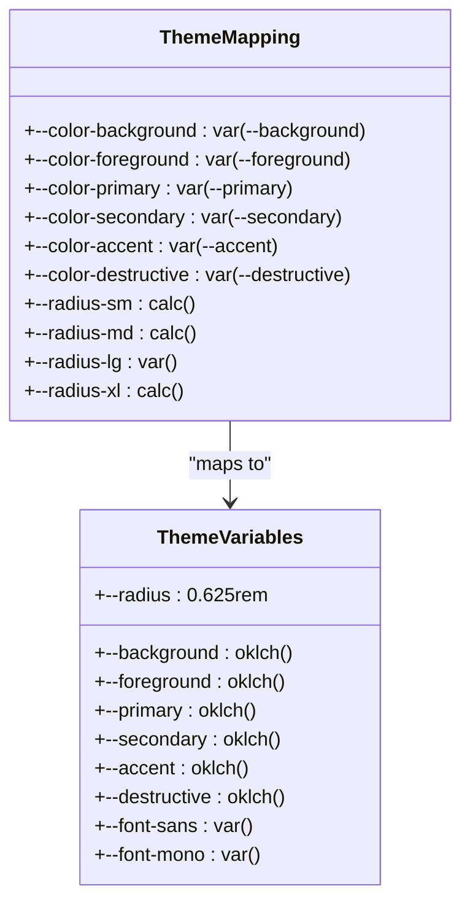
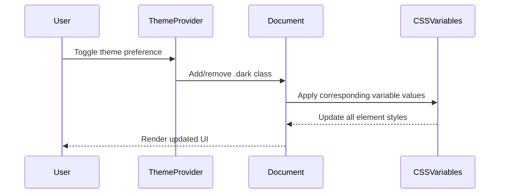
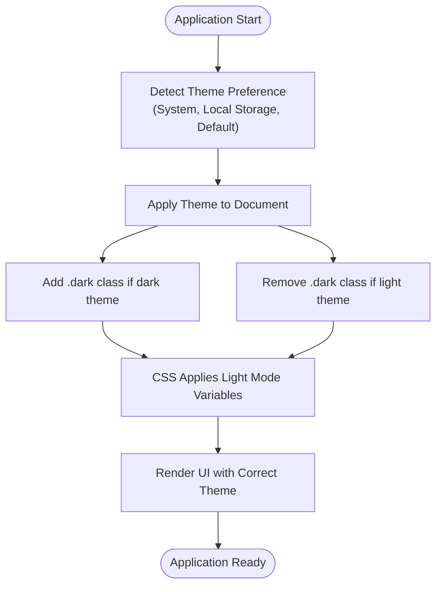

# Global Styles and Theme Variables

<cite>
**Referenced Files in This Document**   
- [globals.css](file://src/app/globals.css)
- [theme-provider.tsx](file://src/components/theme-provider.tsx)
- [layout.tsx](file://src/app/layout.tsx)
- [button.tsx](file://src/components/ui/button.tsx)
- [card.tsx](file://src/components/ui/card.tsx)
- [input.tsx](file://src/components/ui/input.tsx)
- [dialog.tsx](file://src/components/ui/dialog.tsx)
- [utils.ts](file://src/lib/utils.ts)
</cite>

## Table of Contents
1. [Introduction](#introduction)
2. [CSS Custom Properties and Theming](#css-custom-properties-and-theming)
3. [Light and Dark Mode Implementation](#light-and-dark-mode-implementation)
4. [OKLCH Color Space Usage](#oklch-color-space-usage)
5. [Theme Provider Integration](#theme-provider-integration)
6. [Base Layer Styling](#base-layer-styling)
7. [Responsive Design and Breakpoints](#responsive-design-and-breakpoints)
8. [Component Styling Patterns](#component-styling-patterns)
9. [Common Issues and Best Practices](#common-issues-and-best-practices)
10. [Conclusion](#conclusion)

## Introduction
The global styling system in this application is built on a modern CSS architecture that combines Tailwind CSS with custom CSS variables and advanced color space technology. The system enables dynamic theme switching between light and dark modes using the OKLCH color space, which provides perceptually uniform color representation across different devices and viewing conditions. This documentation explains the implementation details of the global styling system, focusing on the use of CSS custom properties, theme variables, and responsive design patterns.

**Section sources**
- [globals.css](file://src/app/globals.css#L1-L122)
- [layout.tsx](file://src/app/layout.tsx#L1-L42)

## CSS Custom Properties and Theming
The global styling system utilizes CSS custom properties (variables) defined in the `:root` selector to establish a consistent design system across the application. These variables serve as the foundation for all visual elements and are organized into semantic categories such as colors, typography, and spacing.

The `@theme inline` directive creates a theme mapping that connects Tailwind's utility classes to the custom CSS variables. This allows components to reference theme values through Tailwind's class-based syntax while maintaining the flexibility of CSS variables. For example, the `--color-background` variable maps to `var(--background)`, enabling the use of `bg-background` in component classes.

The system defines a comprehensive set of color variables for different UI elements including primary, secondary, accent, destructive, and muted states. It also includes variables for borders, inputs, rings (focus indicators), and chart colors. Typography variables define font families for sans-serif and monospace text, while radius variables establish consistent corner rounding across components.



**Diagram sources**
- [globals.css](file://src/app/globals.css#L15-L35)

**Section sources**
- [globals.css](file://src/app/globals.css#L15-L78)

## Light and Dark Mode Implementation
The application implements a dual theme system with distinct light and dark mode color schemes. The light mode theme is defined in the `:root` selector, while the dark mode theme is defined in the `.dark` class selector. Theme switching is accomplished by toggling the presence of the `.dark` class on the document element.

The dark mode implementation uses the same variable names as the light mode but with different OKLCH color values optimized for low-light viewing conditions. This approach ensures that all components automatically adapt to the current theme without requiring individual style modifications. The transition between themes is handled by the ThemeProvider component, which manages the application's theme state.

The system includes specific adjustments for dark mode, such as reduced opacity for borders and inputs to prevent excessive contrast, and modified chart colors that maintain visibility against dark backgrounds. The `--border` and `--input` variables in dark mode include alpha transparency values (e.g., `/ 10%` and `/ 15%`) to create subtle visual elements that don't overwhelm the user in low-light environments.



**Diagram sources**
- [globals.css](file://src/app/globals.css#L79-L121)
- [theme-provider.tsx](file://src/components/theme-provider.tsx#L1-L10)

**Section sources**
- [globals.css](file://src/app/globals.css#L79-L121)

## OKLCH Color Space Usage
The styling system employs the OKLCH color space for all color definitions, which offers significant advantages over traditional color models like RGB or HSL. OKLCH (Oklab Lightness, Chroma, Hue) is a perceptually uniform color space that ensures consistent color appearance across different devices and viewing conditions.

Colors are defined using the `oklch()` function with three parameters: lightness (0-1), chroma (color intensity), and hue (0-360). This approach allows for precise control over color appearance while maintaining accessibility and visual harmony. For example, the light mode background is defined as `oklch(1 0 0)` representing pure white, while the foreground text is `oklch(0.145 0 0)` representing a very dark gray that appears almost black.

The use of OKLCH enables the creation of color scales with consistent perceptual differences between steps, which is particularly important for data visualization elements like charts. The system defines five chart colors (`--chart-1` through `--chart-5`) with carefully selected chroma and hue values to ensure good contrast and distinguishability in both light and dark modes.

The color space also facilitates the creation of accessible color combinations by allowing precise control over contrast ratios. The system maintains appropriate contrast between text and background colors in both themes, with light mode using high-contrast combinations and dark mode using slightly reduced contrast to prevent eye strain in low-light environments.

**Section sources**
- [globals.css](file://src/app/globals.css#L38-L121)

## Theme Provider Integration
The theme switching functionality is implemented through the ThemeProvider component, which wraps the NextThemesProvider from the next-themes library. This component is integrated into the application's root layout and manages the theme state across all pages and components.

The ThemeProvider is configured with several key properties: `attribute="class"` specifies that theme changes should be applied by adding/removing the `.dark` class on the document element; `defaultTheme="light"` sets the initial theme; `enableSystem` allows the application to respect the user's system preference; and `disableTransitionOnChange` prevents animation flickering during theme switches.

The integration with the global CSS variables is seamless—the presence or absence of the `.dark` class triggers the application of the corresponding CSS variable values defined in the globals.css file. This approach ensures that all components, whether built with Tailwind utilities or custom styles, automatically respond to theme changes without requiring additional JavaScript logic.

The theme provider also handles edge cases such as server-side rendering by suppressing hydration warnings, ensuring a smooth user experience during the initial page load. This is particularly important for SEO and performance, as it prevents layout shifts that could occur if theme detection happened only on the client side after hydration.



**Diagram sources**
- [theme-provider.tsx](file://src/components/theme-provider.tsx#L1-L10)
- [layout.tsx](file://src/app/layout.tsx#L30-L38)

**Section sources**
- [theme-provider.tsx](file://src/components/theme-provider.tsx#L1-L10)
- [layout.tsx](file://src/app/layout.tsx#L30-L38)

## Base Layer Styling
The global styling system includes a base layer defined with the `@layer base` directive, which establishes fundamental styles applied to all elements before component-specific styles. This approach follows the Tailwind CSS methodology of styling in layers of increasing specificity.

The base layer contains two primary rules: a universal selector (`*`) that applies border and outline styles using the `border-border` and `outline-ring/50` Tailwind classes, and a body selector that sets the background and text colors using `bg-background` and `text-foreground`. These styles create a consistent foundation for all UI elements while respecting the current theme.

The universal selector ensures that all elements have consistent border styling derived from the `--border` variable, while the outline is set to 50% opacity of the `--ring` variable to create subtle focus indicators. The body element inherits the theme's background and foreground colors, establishing the basic color scheme for the entire application.

This base layer approach prevents style conflicts by establishing a predictable styling hierarchy where base styles are applied first, followed by component styles, and finally utility classes. It also improves performance by reducing the need for repetitive style declarations in individual components.

**Section sources**
- [globals.css](file://src/app/globals.css#L115-L121)

## Responsive Design and Breakpoints
While the provided code does not explicitly define custom breakpoints, the global styling system leverages Tailwind CSS's responsive design capabilities through its integration. The system supports responsive design through Tailwind's mobile-first breakpoint system, which is automatically available when using the Tailwind utilities.

Components in the application can use responsive prefixes (such as `sm:`, `md:`, `lg:`, and `xl:`) to apply different styles at different screen sizes. For example, a component might use `text-sm md:text-base lg:text-lg` to adjust text size based on viewport width. This approach allows for granular control over the user interface across different device types.

The styling system also includes responsive considerations in component implementations. For instance, the Dialog component uses different maximum widths based on screen size (`max-w-[calc(100%-2rem)]` on small screens and `sm:max-w-lg` on larger screens), ensuring optimal usability across devices. The carousel component includes logic to adjust the number of visible items based on screen size, providing an appropriate user experience on both mobile and desktop devices.

The use of relative units like `rem` for spacing and sizing ensures that the interface scales appropriately with user preferences and device characteristics. The radius variables are defined in `rem` units, allowing corner rounding to scale with the base font size, which may be adjusted by user settings or responsive breakpoints.

**Section sources**
- [dialog.tsx](file://src/components/ui/dialog.tsx#L1-L158)
- [carousel.tsx](file://src/components/ui/carousel.tsx#L176-L217)

## Component Styling Patterns
The application's UI components follow a consistent styling pattern that leverages both Tailwind CSS utilities and the global theme variables. Components use the `cn()` utility function from the `utils.ts` file to merge Tailwind classes with custom class names, ensuring proper class composition and avoiding specificity conflicts.

The `cn()` function combines `clsx` for conditional class evaluation and `tailwind-merge` for intelligent class merging, which automatically resolves conflicting Tailwind classes by keeping the most specific one. This pattern prevents common styling issues that occur when multiple classes target the same property (e.g., `text-red-500` and `text-blue-500`).

UI components such as Button, Card, Input, and Dialog use semantic class names that reference the global theme variables through Tailwind's dynamic class generation. For example, the Button component uses `bg-primary` and `text-primary-foreground` to inherit the theme's primary color scheme, while the Card component uses `bg-card` and `text-card-foreground` for its background and text colors.

Components also implement consistent focus and interaction states using the theme's ring and border variables. The focus-visible styles use `focus-visible:border-ring` and `focus-visible:ring-ring/50` to create accessible focus indicators that respect the current theme. Error states are handled with `aria-invalid:ring-destructive/20` and `aria-invalid:border-destructive` to provide visual feedback for invalid inputs.

```mermaid
classDiagram
class Button {
+variant : default|destructive|outline|secondary|ghost|link
+size : default|sm|lg|icon|icon-sm|icon-lg
+asChild : boolean
+className : string
}
class Card {
+className : string
}
class Input {
+className : string
+type : string
}
class ThemeVariables {
+--primary : oklch()
+--primary-foreground : oklch()
+--card : oklch()
+--card-foreground : oklch()
+--input : oklch()
+--ring : oklch()
+--destructive : oklch()
+--border : oklch()
}
Button --> ThemeVariables : "uses bg-primary"
Button --> ThemeVariables : "uses text-primary-foreground"
Card --> ThemeVariables : "uses bg-card"
Card --> ThemeVariables : "uses text-card-foreground"
Input --> ThemeVariables : "uses border-input"
Input --> ThemeVariables : "uses focus-visible : ring-ring"
Input --> ThemeVariables : "uses aria-invalid : border-destructive"
```

**Diagram sources**
- [button.tsx](file://src/components/ui/button.tsx#L1-L60)
- [card.tsx](file://src/components/ui/card.tsx#L1-L92)
- [input.tsx](file://src/components/ui/input.tsx#L1-L21)
- [utils.ts](file://src/lib/utils.ts#L1-L6)

**Section sources**
- [button.tsx](file://src/components/ui/button.tsx#L1-L60)
- [card.tsx](file://src/components/ui/card.tsx#L1-L92)
- [input.tsx](file://src/components/ui/input.tsx#L1-L21)
- [utils.ts](file://src/lib/utils.ts#L1-L6)

## Common Issues and Best Practices
When working with the global styling system, several common issues may arise, along with corresponding best practices for maintaining a clean and efficient codebase.

One common issue is style conflicts between Tailwind utilities and custom CSS. This is mitigated by the use of the `cn()` utility function, which properly merges classes and resolves conflicts. Developers should always use `cn()` when combining Tailwind classes with custom classes or when conditionally applying classes.

Specificity problems can occur when multiple classes target the same CSS property. The `tailwind-merge` library automatically handles this by keeping the most specific class, following Tailwind's specificity order. For example, when both `text-red-500` and `text-blue-500` are applied, the latter takes precedence as it appears later in the Tailwind class order.

Performance impacts can be minimized by avoiding excessive use of global styles and by leveraging Tailwind's tree-shaking capabilities. The current implementation is efficient as it relies primarily on Tailwind's utility-first approach, which generates only the CSS needed for the classes actually used in the application.

Best practices for maintaining global styles include:
- Using semantic variable names that describe the purpose rather than the appearance
- Organizing variables into logical groups (colors, typography, spacing)
- Maintaining consistent color scales using the OKLCH color space
- Avoiding hardcoded values in components by always referencing theme variables
- Documenting new variables and their intended use cases
- Regularly auditing unused CSS variables to prevent bloat

When adding new global utilities, developers should follow the existing pattern of defining CSS variables in `globals.css` and mapping them through the `@theme inline` directive. New utilities should be added sparingly and only when they represent truly global design tokens that will be used across multiple components.

**Section sources**
- [globals.css](file://src/app/globals.css#L1-L122)
- [utils.ts](file://src/lib/utils.ts#L1-L6)

## Conclusion
The global styling system in this application represents a modern approach to CSS architecture that combines the utility-first methodology of Tailwind CSS with the flexibility of CSS custom properties and the perceptual accuracy of the OKLCH color space. This combination enables a robust, maintainable, and accessible theming system that supports both light and dark modes with high visual quality.

The system's architecture allows for consistent design language across the application while providing the flexibility to adapt to different user preferences and device characteristics. The integration with the ThemeProvider component ensures seamless theme switching, while the base layer styling establishes a solid foundation for all UI elements.

By following the established patterns and best practices, developers can extend the styling system with new components and utilities while maintaining consistency and avoiding common pitfalls. The use of semantic variables, proper class composition, and responsive design principles ensures that the application remains accessible and visually appealing across a wide range of devices and viewing conditions.